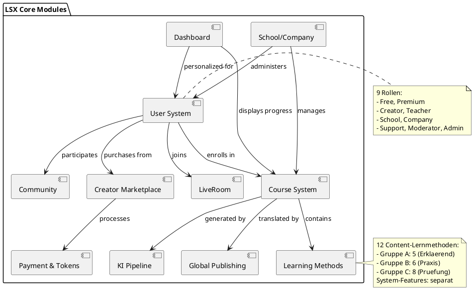
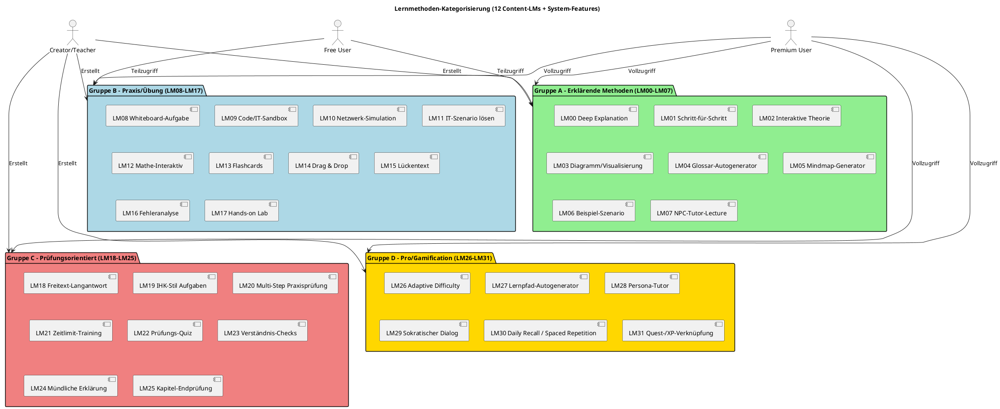
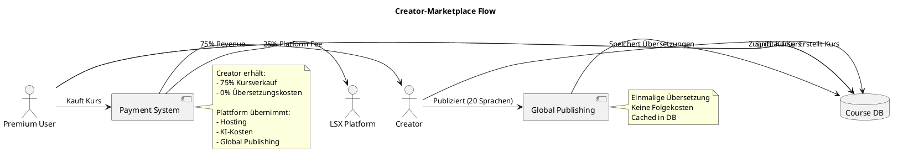
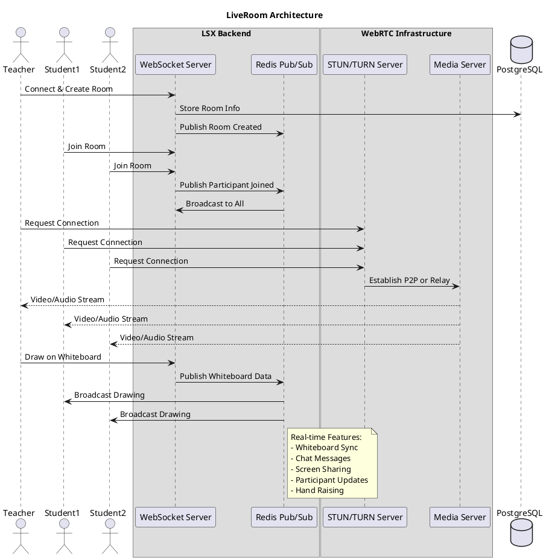
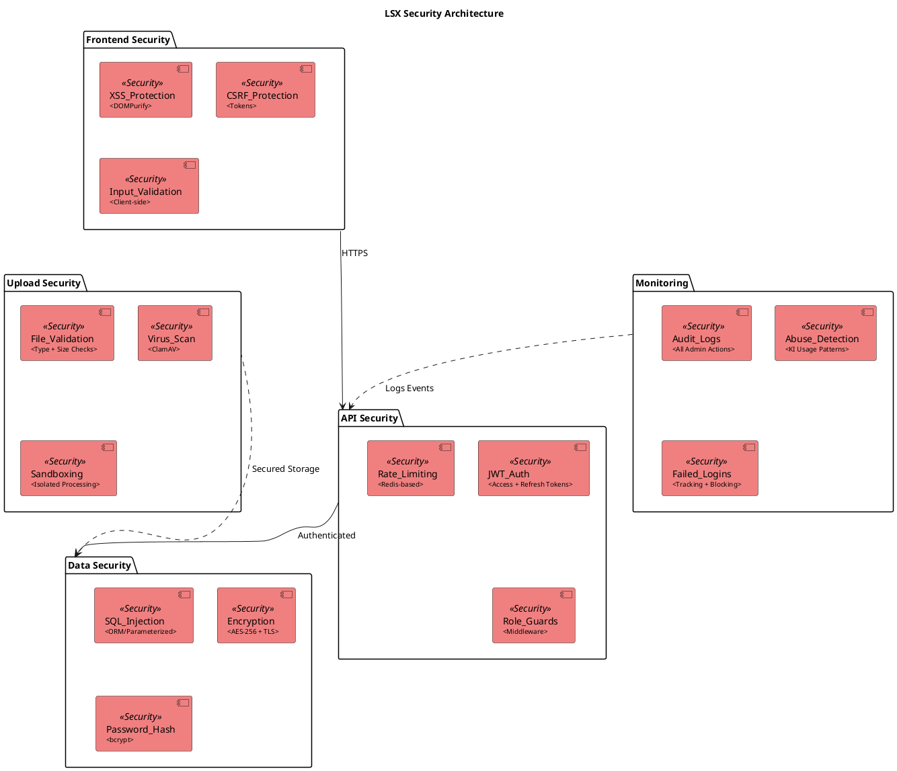

# 00 – LSX Lernsystem – Systemübersicht (Final)

**Version:** 1.0
**Stand:** Final

---

## Überblick

LSX (LernSystemX) ist ein KI-gestütztes, modulares Lern- und Kursplattform-System für:

- 🎓 Schüler & Azubis
- 👨‍🏫 Lehrer & Dozenten
- 🏫 Schulen & Unternehmen
- 🎨 Creator & Autoren
- 💎 Private Lernende (Premium)

### 🏗️ System-Architektur (C4 Model - Context)

```plantuml
@startuml
!include https://raw.githubusercontent.com/plantuml-stdlib/C4-PlantUML/master/C4_Context.puml

LAYOUT_WITH_LEGEND()

title LSX Lernsystem - System Context

Person(student, "Schüler/Student", "Lernt mit Kursen")
Person(premium, "Premium User", "Vollzugriff auf Lernmethoden")
Person(creator, "Creator", "Erstellt & verkauft Kurse")
Person(teacher, "Lehrer", "Unterrichtet & verwaltet Klassen")
Person(admin, "Admin", "Systemverwaltung")

System(lsx, "LSX Lernsystem", "KI-gestützte Lernplattform mit 12 Content-Lernmethoden")

System_Ext(ki_api, "KI APIs", "Anthropic Claude, OpenAI")
System_Ext(payment, "Payment Provider", "Stripe, PayPal")
System_Ext(webrtc, "WebRTC Server", "Video/Audio LiveRoom")
System_Ext(email, "E-Mail Service", "Transaktionale E-Mails")

Rel(student, lsx, "Nutzt Kurse", "HTTPS")
Rel(premium, lsx, "Nutzt alle Features", "HTTPS")
Rel(creator, lsx, "Erstellt Inhalte", "HTTPS")
Rel(teacher, lsx, "Unterrichtet", "HTTPS")
Rel(admin, lsx, "Verwaltet System", "HTTPS")

Rel(lsx, ki_api, "Generiert Inhalte", "HTTPS/REST")
Rel(lsx, payment, "Zahlungsabwicklung", "HTTPS")
Rel(lsx, webrtc, "Video/Audio Streaming", "WebRTC/STUN/TURN")
Rel(lsx, email, "Sendet Benachrichtigungen", "SMTP")

note right of lsx
  - 12 Content-Lernmethoden (Gruppen A-C)
  - 9 Rollenmodell
  - KI-Content-Pipeline
  - Global Publishing (20 Sprachen)
  - LiveRoom mit Whiteboard-KI
end note

@enduml
```

---

## 1. Kernfunktionen

### 📚 Lernmodule

| Feature | Beschreibung |
|---------|-------------|
| **12 Content-Lernmethoden** | 3 Gruppen (A-C): Erklaerend, Praxis, Pruefung |
| **Modulare Kurse** | Flexible Kursstruktur |
| **Theorie-Blätter** | Zentrale Wissensdokumente |
| **Prüfungen** | KI-generierte Tests & Simulationen |

### 🤖 KI-Integration

```plantuml
@startuml
!include https://raw.githubusercontent.com/plantuml-stdlib/C4-PlantUML/master/C4_Container.puml

Container_Boundary(ki, "KI-Pipeline") {
    Component(parser, "PDF/Doc Parser", "Extrahiert Struktur")
    Component(generator, "Content Generator", "Erzeugt Module & Methoden")
    Component(translator, "Translation Engine", "20 Sprachen")
    Component(analyzer, "Whiteboard Analyzer", "Erkennt Zeichnungen")
    Component(validator, "Content Validator", "Qualitätsprüfung")
}

Rel(parser, generator, "Strukturierte Daten")
Rel(generator, validator, "Generierte Inhalte")
Rel(generator, translator, "Original Content")

note right of ki
  13 spezialisierte KI-Module
  Token-basierte Nutzung
  Vollständig protokolliert
end note

@enduml
```

### 🌍 Global Publishing

- Automatische Übersetzung in 20 Sprachen
- Einmalige Übersetzung, wiederverwendbare Speicherung
- Verfügbar für Creator, Schulen & Unternehmen

---

## 2. Technologie-Stack

### 💻 Backend-Technologien

```plantuml
@startuml
!include https://raw.githubusercontent.com/plantuml-stdlib/C4-PlantUML/master/C4_Container.puml

title LSX Backend Architecture

Container(api, "Flask API", "Python 3.12", "REST API mit Blueprint-Architektur")
Container(celery, "Celery Workers", "Python", "Asynchrone KI-Tasks")
Container(websocket, "WebSocket Server", "Flask-SocketIO", "Real-time LiveRoom")

ContainerDb(postgres, "PostgreSQL", "Database", "Hauptdatenbank mit JSONB")
ContainerDb(redis, "Redis", "Cache/Queue", "Session, Cache, Task Queue")
ContainerDb(storage, "File Storage", "S3/Local", "Uploads, Recordings")

Rel(api, postgres, "Read/Write", "SQL")
Rel(api, redis, "Cache/Rate Limit", "Redis Protocol")
Rel(api, celery, "Queue Tasks", "Celery")
Rel(celery, postgres, "Store Results", "SQL")
Rel(websocket, redis, "Pub/Sub", "Redis Protocol")
Rel(api, storage, "Upload/Download", "S3 API")

note right of api
  - Factory Pattern
  - Blueprint-Architektur
  - JWT Authentication
  - Rate Limiting
end note

@enduml
```

| Komponente | Technologie | Verwendung |
|-----------|------------|-----------|
| 🐍 **Language** | Python 3.12 | Core Backend |
| 🌶️ **Framework** | Flask | Web Framework mit Factory Pattern |
| 🗃️ **Database Driver** | psycopg3 | Pure PostgreSQL driver |
| 🐘 **Database** | PostgreSQL | Hauptdatenbank |
| 🔴 **Cache** | Redis | Caching, Sessions, Task Queue |
| 📦 **Tasks** | Celery | Background Jobs |
| 🔌 **Real-time** | Flask-SocketIO | WebSockets für LiveRoom |
| 🔑 **Auth** | JWT | Token-basierte Authentifizierung |

### 🎨 Frontend-Technologien

```plantuml
@startuml
!include https://raw.githubusercontent.com/plantuml-stdlib/C4-PlantUML/master/C4_Component.puml

Container_Boundary(frontend, "Vue.js Frontend") {
    Component(vue, "Vue 3", "Composition API", "UI Framework")
    Component(pinia, "Pinia", "State Management", "Zentrale State-Verwaltung")
    Component(router, "Vue Router", "Routing", "Navigation & Guards")
    Component(i18n, "vue-i18n", "i18n", "Mehrsprachigkeit")
    Component(axios, "Axios", "HTTP Client", "API Communication")
}

Component(tailwind, "TailwindCSS", "CSS Framework", "Styling & Themes")
Component(webrtc, "WebRTC", "Video/Audio", "LiveRoom Streaming")

Rel(vue, pinia, "Nutzt State")
Rel(vue, router, "Navigation")
Rel(vue, i18n, "Übersetzungen")
Rel(vue, axios, "API Calls")
Rel(vue, tailwind, "Styling")
Rel(vue, webrtc, "Video/Audio")

note right of frontend
  - Composition API
  - TypeScript Support
  - ADHD/Focus Mode
  - Dark Mode
end note

@enduml
```

| Komponente | Technologie | Verwendung |
|-----------|------------|-----------|
| ⚡ **Framework** | Vue.js 3 | Composition API |
| 🚀 **Build Tool** | Vite | Schneller Dev-Server |
| 📦 **State** | Pinia | State Management |
| 🛣️ **Routing** | Vue Router | Client-side Routing |
| 🎨 **Styling** | TailwindCSS | Utility-first CSS |
| 🌍 **i18n** | vue-i18n | Internationalisierung |
| 🎥 **Video** | WebRTC | Video/Audio Streaming |
| 📡 **HTTP** | Axios | API Requests |

---

## 3. Hauptmodule

### 📋 Modulübersicht



### 🔐 Rollenbasiertes System (9 Rollen)

| Rolle | Zugriff | Besonderheiten |
|-------|---------|----------------|
| 🆓 **Free User** | Basis-Kurse, ausgewählte Methoden | ❌ Keine KI |
| 💎 **Premium User** | Alle 12 Content-Lernmethoden, KI-Zugriff | Private Gruppen |
| 🎨 **Creator** | Kurs-Erstellung, Verkauf | 75% Revenue Share |
| 👨‍🏫 **Lehrer/Dozent** | Klassen-Verwaltung, LiveRoom Pro | Prüfungs-Generator |
| 🏫 **Schule** | Lehrer + Schüler verwalten | Domain-Branding |
| 🏢 **Unternehmen** | Mitarbeiter-Training | Corporate Mode |
| 🛠️ **Support** | User-Hilfe, Debugging | Eingeschränkter Zugriff |
| 🛡️ **Moderator** | Content-Review | Kann sperren/löschen |
| 👑 **Admin** | Vollzugriff | System-Konfiguration |

---

## 4. Lernmethoden-System

### 🎯 12 Content-Lernmethoden

> **Details:** Siehe [02_Lernmethoden.md](02_Lernmethoden.md) für die vollständige Spezifikation. System-Features siehe [02a_System-Features.md](02a_System-Features.md).



### 📊 Methoden nach Gruppe

| Gruppe | Name | IDs | Anzahl | KI-Unterstützung |
|--------|------|-----|--------|------------------|
| **A** | Erklärende Methoden | LM00–LM07 | 8 | Mittel bis Intensiv |
| **B** | Praxis / Übung | LM08–LM17 | 10 | Optional bis Intensiv |
| **C** | Prüfungsorientiert | LM18–LM25 | 8 | Optional bis Intensiv |
| **D** | Pro/Gamification | LM26–LM31 | 6 | Mittel bis Intensiv |

**Gesamt: 12 Content-Lernmethoden (5 + 6 + 8) + System-Features**

---

## 5. KI-Pipeline (13 Module)

### 🤖 KI-Modul-Übersicht

```plantuml
@startuml
!define KI_MODULE(name) component name <<KI Module>> #LightYellow

package "Content Input" {
  KI_MODULE("PDF/Doc Parser")
  KI_MODULE("Foliensatz-Parser")
  KI_MODULE("Mathe-Parser")
  KI_MODULE("Whiteboard-Analyse")
}

package "Content Generation" {
  KI_MODULE("Modul-Generator")
  KI_MODULE("Theorieblatt-Generator")
  KI_MODULE("Lernmethoden-Generator")
  KI_MODULE("Quiz-Generator")
  KI_MODULE("Prüfungssimulation")
}

package "Content Enhancement" {
  KI_MODULE("Summarizer/Erklär-KI")
  KI_MODULE("Multi-Language Engine")
  KI_MODULE("Content-Validator")
  KI_MODULE("KI-Optimierer")
}

"PDF/Doc Parser" --> "Modul-Generator"
"Foliensatz-Parser" --> "Modul-Generator"
"Modul-Generator" --> "Theorieblatt-Generator"
"Theorieblatt-Generator" --> "Lernmethoden-Generator"
"Lernmethoden-Generator" --> "Quiz-Generator"
"Theorieblatt-Generator" --> "Multi-Language Engine"
"Content-Validator" ..> "Theorieblatt-Generator" : validates
"Content-Validator" ..> "Lernmethoden-Generator" : validates

@enduml
```

| Nr. | Modul | Funktion |
|-----|-------|----------|
| 1 | 📄 **PDF/Doc-Parser** | Verarbeitung von Dokumenten |
| 2 | 📊 **Foliensatz-Parser** | Bild + Text Extraktion |
| 3 | 🔢 **Mathe-Parser** | Rechenwegerkennung |
| 4 | 🖊️ **Whiteboard-Analyse** | Diagramm- & Zeichnungserkennung |
| 5 | 📚 **Modul-Generator** | Kursstruktur-Erstellung |
| 6 | 📖 **Theorieblatt-Generator** | Lerninhalte aufbereiten |
| 7 | 🎯 **Lernmethoden-Generator** | 12 Content-Lernmethoden befüllen |
| 8 | ❓ **Quiz-Generator** | Prüfungsfragen erstellen |
| 9 | 📝 **Prüfungssimulation** | Vollständige Tests generieren |
| 10 | 💡 **Summarizer/Erklär-KI** | Zusammenfassungen & Vereinfachungen |
| 11 | 🌍 **Multi-Language Engine** | LSX Global Publishing |
| 12 | ✅ **Content-Validator** | Qualitätssicherung |
| 13 | 🔧 **KI-Optimierer** | Vereinfachen, Umformulieren, Erweitern |

---

## 6. Community & Marketplace

### 🏪 Creator-Marketplace



### 👥 Community-Features

| Feature | Beschreibung | Verfügbarkeit |
|---------|-------------|---------------|
| 🆓 **Kostenlose Kurse** | Community-erstellte Inhalte | Alle User |
| 💰 **Marketplace** | Creator verkaufen Kurse | Premium+ kann kaufen |
| 👥 **Private Gruppen** | Geschlossene Lerngruppen | Premium+ |
| 💬 **Diskussionen** | Kurs-Foren | Alle User |
| ⭐ **Bewertungen** | Kurs-Reviews | Nach Kauf |

---

## 7. Schulen & Unternehmen

### 🏫 Organisationsverwaltung

```plantuml
@startuml
!include https://raw.githubusercontent.com/plantuml-stdlib/C4-PlantUML/master/C4_Component.puml

title School/Company Management

actor "School Admin" as admin
actor Teacher
actor Student
actor "Company Admin" as company
actor Employee

package "School System" {
  [Class Management]
  [Teacher Management]
  [Student Enrollment]
  [Course Assignment]
  [Progress Tracking]
}

package "Company System" {
  [Team Management]
  [Employee Training]
  [Learning Paths]
  [Compliance Tracking]
  [Corporate Branding]
}

package "Shared Features" {
  [LiveRoom Pro]
  [Exam Generator]
  [Token Pool]
  [Analytics Dashboard]
  [Domain Branding]
}

admin --> [Class Management]
admin --> [Teacher Management]
Teacher --> [Course Assignment]
Teacher --> [LiveRoom Pro]
Student --> [Course Assignment]

company --> [Team Management]
company --> [Learning Paths]
Employee --> [Learning Paths]

[Class Management] --> [Shared Features]
[Team Management] --> [Shared Features]

note right of [Shared Features]
  - Unbegrenzte User
  - Zentraler Token-Pool
  - Eigene Domain
  - White-Label Option
end note

@enduml
```

---

## 8. LiveRoom-System

### 🎥 Echtzeit-Kollaboration



### 🛠️ LiveRoom-Features

| Feature | Basic | Pro |
|---------|-------|-----|
| 🎥 **Video/Audio** | ✅ (max 4) | ✅ (unbegrenzt) |
| 🖊️ **Whiteboard** | ✅ Basis | ✅ + KI-Analyse |
| 💬 **Chat** | ✅ | ✅ |
| 🖥️ **Screen Sharing** | ❌ | ✅ |
| 📹 **Recording** | ❌ | ✅ |
| 🎯 **Breakout Rooms** | ❌ | ✅ |
| 📊 **Analytics** | ❌ | ✅ |

---

## 9. Dashboard-System

### 📊 Anpassbares Dashboard

```plantuml
@startuml
!include https://raw.githubusercontent.com/plantuml-stdlib/C4-PlantUML/master/C4_Component.puml

title Dashboard Widget System

component "Dashboard Core" {
  [Grid Layout Engine]
  [Widget Registry]
  [Drag & Drop Manager]
  [Theme Manager]
}

component "User Widgets" {
  [Progress Widget]
  [Token Widget]
  [KI Recommendations]
  [Calendar Widget]
  [Tasks Widget]
}

component "Course Widgets" {
  [Active Courses]
  [Exam Schedule]
  [Learning Stats]
  [Achievements]
}

component "LiveRoom Widgets" {
  [Upcoming Sessions]
  [Recording Library]
}

component "Creator Widgets" {
  [Sales Analytics]
  [Course Performance]
  [Revenue Dashboard]
}

[Widget Registry] --> [User Widgets]
[Widget Registry] --> [Course Widgets]
[Widget Registry] --> [LiveRoom Widgets]
[Widget Registry] --> [Creator Widgets]

[Grid Layout Engine] --> [Drag & Drop Manager]
[Grid Layout Engine] --> [Theme Manager]

note right of [Theme Manager]
  - Default Theme
  - Dark Mode
  - ADHD/Focus Mode
  - Custom Themes
end note

note right of [Widget Registry]
  15+ Widgets
  Dynamisch ladbar
  Rollenbasiert
end note

@enduml
```

---

## 10. Sicherheitsarchitektur

### 🔒 Security Layers



---

## 11. Kernprinzipien

### 📜 Entwicklungsrichtlinien

| Prinzip | Umsetzung |
|---------|-----------|
| 🏗️ **Factory Pattern** | Backend mit sauberer Initialisierung |
| 📦 **Blueprint-Architektur** | Modulare Route-Organisation |
| 🔄 **Service Layer** | Business-Logik getrennt von Routes |
| 🎨 **Component-based** | Wiederverwendbare UI-Komponenten |
| 📝 **Dokumentation** | Alle Änderungen dokumentiert |
| 🔐 **Security First** | Mehrschichtige Sicherheit |
| ♿ **Accessibility** | WCAG 2.1 AA konform |
| 🌍 **i18n Ready** | Mehrsprachigkeit von Anfang an |

### 🚫 Verbotene Praktiken

- ❌ Keine `.old` oder `.backup` Dateien
- ❌ Keine unstrukturierten Daten
- ❌ Keine Logik in Routes (nur im Service Layer)
- ❌ Keine hardcodierten Credentials
- ❌ Keine ungefilterten User-Inputs
- ❌ Keine automatische Rollenverschmelzung

---

## 12. Skalierungs-Architektur

### 📈 Horizontal Scaling

```plantuml
@startuml
!include https://raw.githubusercontent.com/plantuml-stdlib/C4-PlantUML/master/C4_Deployment.puml

Deployment_Node(lb, "Load Balancer", "Nginx/HAProxy") {
  Container(nginx, "Nginx", "SSL Termination & Routing")
}

Deployment_Node(app_cluster, "Application Cluster", "Docker Swarm / K8s") {
  Deployment_Node(app1, "App Node 1") {
    Container(flask1, "Flask API", "Gunicorn")
  }
  Deployment_Node(app2, "App Node 2") {
    Container(flask2, "Flask API", "Gunicorn")
  }
  Deployment_Node(app3, "App Node N") {
    Container(flaskN, "Flask API", "Gunicorn")
  }
}

Deployment_Node(worker_cluster, "Worker Cluster") {
  Container(celery1, "Celery Worker 1", "KI Tasks")
  Container(celery2, "Celery Worker 2", "Translation")
  Container(celeryN, "Celery Worker N", "Export")
}

Deployment_Node(data_cluster, "Data Layer") {
  Deployment_Node(db_cluster, "PostgreSQL Cluster") {
    ContainerDb(db_primary, "Primary", "Read/Write")
    ContainerDb(db_replica1, "Replica 1", "Read Only")
    ContainerDb(db_replica2, "Replica 2", "Read Only")
  }

  Deployment_Node(cache_cluster, "Redis Cluster") {
    ContainerDb(redis_master, "Redis Master", "Write")
    ContainerDb(redis_slave1, "Redis Slave 1", "Read")
    ContainerDb(redis_slave2, "Redis Slave 2", "Read")
  }
}

Deployment_Node(cdn, "CDN", "CloudFlare") {
  Container(static, "Static Assets", "JS/CSS/Images")
}

Rel(nginx, flask1, "Routes Traffic")
Rel(nginx, flask2, "Routes Traffic")
Rel(nginx, flaskN, "Routes Traffic")

Rel(flask1, db_primary, "Write")
Rel(flask1, db_replica1, "Read")
Rel(flask2, db_replica2, "Read")

Rel(flask1, redis_master, "Cache/Queue")
Rel(celery1, redis_master, "Get Tasks")
Rel(celery2, db_primary, "Store Results")

Rel(static, nginx, "Serves Assets")

note right of app_cluster
  Auto-scaling basiert auf:
  - CPU Usage
  - Memory Usage
  - Request Rate
end note

note right of worker_cluster
  Task-spezifische Worker:
  - KI-Generation (GPU)
  - Translation (CPU)
  - Export (I/O)
end note

@enduml
```

---

## 13. Zusammenfassung

### ✅ LSX Lernsystem auf einen Blick

| Bereich | Details |
|---------|---------|
| 👥 **User Management** | 9 Rollen mit klaren Grenzen |
| 📚 **Lernmethoden** | 12 Content-LMs in 3 Gruppen (A-C) + System-Features |
| 🤖 **KI-Integration** | 13 spezialisierte KI-Module |
| 🌍 **Mehrsprachigkeit** | 20 Sprachen via Global Publishing |
| 🎥 **LiveRoom** | WebRTC mit Whiteboard-KI |
| 🏪 **Marketplace** | Creator 75% / Platform 25% |
| 🏫 **Organisationen** | Schulen & Unternehmen mit Token-Pools |
| 🔒 **Sicherheit** | Mehrschichtig mit Audit-Logs |
| 📊 **Dashboard** | 15+ anpassbare Widgets |
| ⚡ **Performance** | Horizontal skalierbar mit Redis/Celery |

### 🎯 Architektur-Highlights

```
┌─────────────────────────────────────────────────┐
│  🎓 KI-gestützte Lernplattform                  │
│  📚 12 Content-Lernmethoden (A-C)               │
│  👥 9 Rollenmodell                              │
│  🤖 13 KI-Module                                │
│  🌍 20 Sprachen                                 │
│  🎥 WebRTC LiveRoom                             │
│  🏪 Creator Marketplace                         │
│  🏫 Enterprise-Ready                            │
│  🔒 Security First                              │
│  ⚡ Horizontal Scalable                         │
└─────────────────────────────────────────────────┘
```

---

## 14. Nächste Schritte

Detaillierte Informationen finden sich in den folgenden Dokumenten:

| Dokument | Thema |
|----------|-------|
| 📋 `01_Rollenmodell.md` | Alle 9 Rollen im Detail |
| 🎯 `02_Lernmethoden.md` | 12 Content-Lernmethoden (Gruppen A-C) – Master-Dokument |
| 🔐 `03_Zugriffssystem.md` | Berechtigungen & Zugriffskontrolle |
| 📚 `04_Kurs-Architektur.md` | Kurs- & Modulstruktur |
| 🤖 `09_KI-Pipeline.md` | KI-Module & Workflows |
| 🗃️ `14_DB-Struktur.md` | Komplette Datenbankstruktur |
| 🎨 `16_Frontend-Struktur.md` | Vue.js Frontend-Architektur |
| 🐍 `17_Backend-Struktur.md` | Flask Backend-Architektur |

---

## 📌 Dokument abgeschlossen

**Version:** 1.0
**Status:** Final
**Letzte Aktualisierung:** 2024

---

> 💡 **Hinweis:** Dieses Dokument bietet eine Gesamtübersicht über das LSX Lernsystem. Für technische Details siehe die verlinkten Spezifikationsdokumente.
