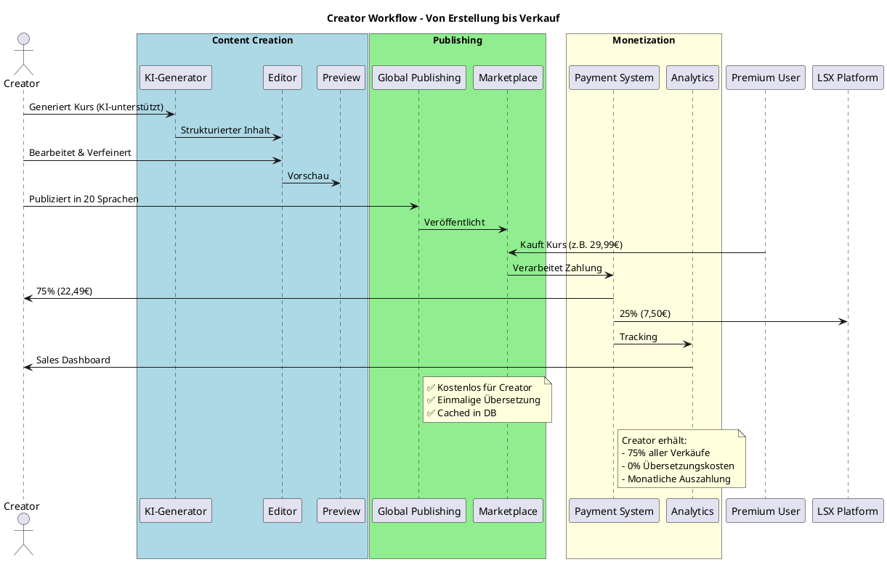
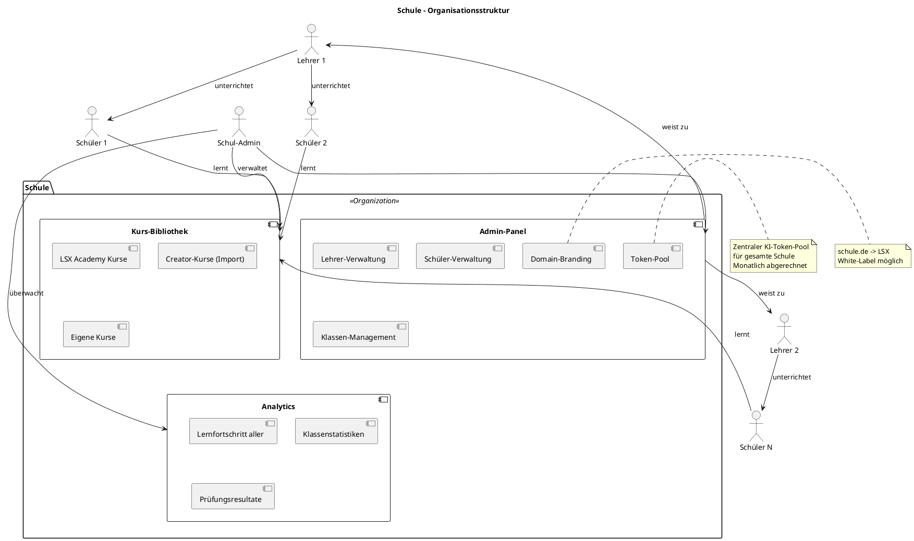
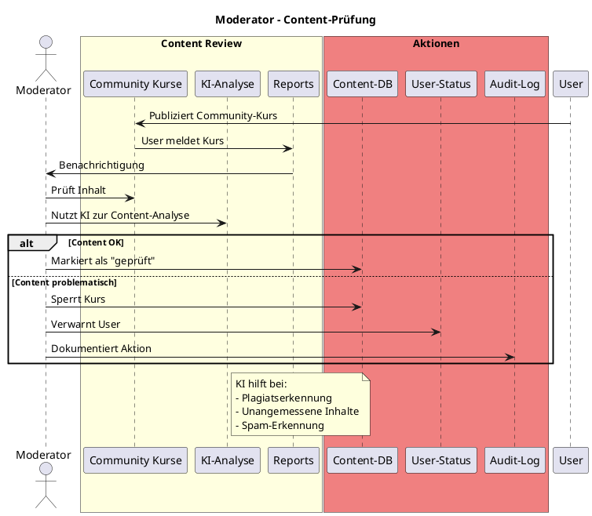
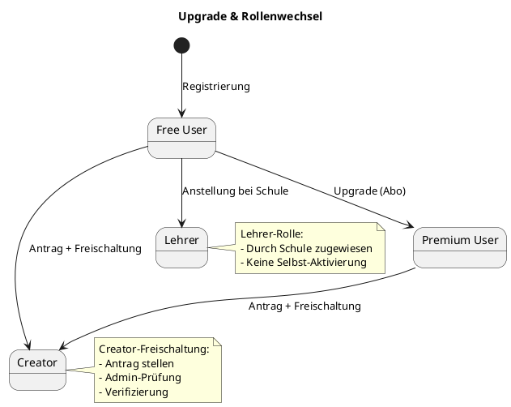

# 01 – Rollenmodell (Final)

**Version:** 1.0
**Stand:** Final

---

## Überblick

Das LSX-Rollenmodell definiert **9 klar getrennte Rollen** mit spezifischen Rechten, Verantwortlichkeiten und Funktionsbereichen. Rollen dürfen **niemals** automatisch ineinander fließen.

### 🏗️ Rollenarchitektur (Übersicht)

```plantuml
@startuml
!include https://raw.githubusercontent.com/plantuml-stdlib/C4-PlantUML/master/C4_Context.puml

title LSX Rollenmodell - 9 Rollen

actor "Free User" as free <<1. Free>> #LightGray
actor "Premium User" as premium <<2. Premium>> #Gold
actor "Creator" as creator <<3. Creator>> #LightBlue
actor "Lehrer/Dozent" as teacher <<4. Teacher>> #LightGreen
actor "Schule" as school <<5. School>> #LightCoral
actor "Unternehmen" as company <<6. Company>> #LightSalmon
actor "Support" as support <<7. Support>> #LightYellow
actor "Moderator" as moderator <<8. Moderator>> #Orange
actor "Admin" as admin <<9. Admin>> #Red

System(lsx, "LSX Lernsystem", "Zentrale Plattform")

free -down-> lsx : "Basis-Zugriff"
premium -down-> lsx : "Voll-Zugriff"
creator -down-> lsx : "Erstellt & Verkauft"
teacher -down-> lsx : "Unterrichtet"
school -down-> lsx : "Verwaltet Klassen"
company -down-> lsx : "Verwaltet Training"
support -down-> lsx : "Hilft Usern"
moderator -down-> lsx : "Moderiert Content"
admin -down-> lsx : "System-Kontrolle"

note right of free
  Basis-Lernmethoden
  Keine KI
  Kein Publishing
end note

note right of premium
  Alle 19 Content-Lernmethoden (A-C)
  KI-Zugriff
  Private Gruppen
end note

note right of creator
  Monetarisierung
  Global Publishing
  75% Revenue Share
end note

note left of school
  Klassen-Management
  Lehrer-Verwaltung
  Domain-Branding
end note

note left of admin
  Vollzugriff
  Rollen-Management
  System-Konfiguration
end note

@enduml
```

---

## 1. Free User (Basis-Nutzer)

### 🔓 Berechtigungen

```plantuml
@startuml
title Free User - Zugriffsmuster

actor "Free User" as user

package "Verfügbare Features" #LightGreen {
  [Community-Kurse lesen]
  [Gekaufte Kurse nutzen]
  [Ausgewählte Lernmethoden (Gruppe A+B Teilweise)]
  [Theorie-Blätter]
  [Profil]
  [Basic Dashboard]
}

package "Gesperrte Features" #LightCoral {
  [KI-Funktionen]
  [Erweiterte Methoden (Gruppe C+D)]
  [Kurs-Erstellung]
  [Private Gruppen]
  [LiveRoom]
  [Dashboard-Customizing]
}

user --> "Verfügbare Features"
user -[#red]x "Gesperrte Features" : ❌ Kein Zugriff

@enduml
```

| Kategorie | Details |
|-----------|---------|
| ✅ **Rechte** | Community-Kurse lesen, Gekaufte Kurse vollständig nutzen, ausgewählte Methoden aus Gruppe A+B, Profil & Basic Dashboard |
| ❌ **Einschränkungen** | Keine KI, Eingeschränkte Methoden (Gruppe C+D gesperrt), Kein Publishing, Keine Gruppen, Kein LiveRoom |
| 🎯 **Zweck** | Einstieg in die Plattform, Freemium-Modell |

---

## 2. Premium User

### 💎 Vollzugriff-Modell

```plantuml
@startuml
!include https://raw.githubusercontent.com/plantuml-stdlib/C4-PlantUML/master/C4_Component.puml

title Premium User - Feature-Set

actor "Premium User" as premium

package "Premium Features" {
  component "19 Content-Lernmethoden" as methods {
    [Gruppe A: Erklärend (LM00-03, LM06)]
    [Gruppe B: Praxis (LM08, LM12-15, LM17)]
    [Gruppe C: Prüfung (LM18–LM25)]
  }

  component "KI-Integration" as ki {
    [KI-Erklärungen]
    [KI-Zusammenfassungen]
    [KI-Lernpfade]
    [Whiteboard-KI]
  }

  component "Social Features" as social {
    [Private Study Groups]
    [Community Publishing]
    [User-Einladungen]
  }

  component "LiveRoom Basic" as liveroom {
    [Video/Audio (4 Teilnehmer)]
    [Whiteboard]
    [Chat]
  }

  component "Dashboard Pro" as dashboard {
    [15+ Widgets]
    [Drag & Drop]
    [Themes]
    [ADHD/Focus Mode]
  }
}

premium --> methods
premium --> ki
premium --> social
premium --> liveroom
premium --> dashboard

note right of methods
  Vollzugriff auf alle 19 Content-LMs
  (Gruppen A–C)
end note

note right of ki
  Token-basiert
  Individuelles Kontingent
end note

@enduml
```

| Kategorie | Details |
|-----------|---------|
| ✅ **19 Content-Lernmethoden** | Gruppen A–C (Vollzugriff) |
| 🤖 **KI-Zugriff** | Vollständig, Token-basiert |
| 👥 **Private Gruppen** | Erstellen & Verwalten |
| 🎥 **LiveRoom Basic** | 4 Teilnehmer, Whiteboard, Chat |
| 📊 **Dashboard** | Vollständig anpassbar |
| ❌ **Keine** | Monetarisierung, Global Publishing, Creator-Tools |

---

## 3. Creator

### 🎨 Business-Modell



| Kategorie | Details |
|-----------|---------|
| 🎨 **Kurserstellung** | Voller Zugriff auf alle 19 Content-Lernmethoden (A-C) |
| 🤖 **KI-Tools** | KI-Kursgenerator, Modulgenerator, Methodengenerator |
| 🌍 **Global Publishing** | 20 Sprachen, kostenlos |
| 💰 **Revenue Share** | 75% Creator / 25% Plattform |
| 📊 **Analytics** | Verkaufsstatistiken, Performance-Tracking |
| ❌ **Keine** | Schul-/Unternehmensverwaltung, Domain-Branding |

---

## 4. Lehrer / Dozent

### 👨‍🏫 Unterrichts-Fokus

```plantuml
@startuml
!include https://raw.githubusercontent.com/plantuml-stdlib/C4-PlantUML/master/C4_Component.puml

title Lehrer/Dozent - Hauptfunktionen

actor "Lehrer/Dozent" as teacher

package "Unterricht" {
  [Kurse erstellen]
  [Klassen verwalten]
  [Schüler/Studenten]
  [Lernpfade]
}

package "LiveRoom Pro" {
  [Unbegrenzte Teilnehmer]
  [Whiteboard + KI]
  [Recording]
  [Breakout Rooms]
  [Screen Sharing]
}

package "Prüfungen" {
  [KI-Prüfungsgenerator]
  [Individuelle Tests]
  [Bewertungssystem]
  [Fortschrittsanalyse]
}

package "Content Tools" {
  [Theorieblätter]
  [19 Content-Lernmethoden (A-C)]
  [KI-Unterstützung]
}

teacher --> "Unterricht"
teacher --> "LiveRoom Pro"
teacher --> "Prüfungen"
teacher --> "Content Tools"

note right of "Prüfungen"
  Generiert Prüfungen nach:
  - IHK-Standard
  - Schulcurriculum
  - Individuellen Vorgaben
end note

@enduml
```

| Kategorie | Details |
|-----------|---------|
| 📚 **Kurse** | Erstellen (nicht verkaufen), für Klassen zuweisen |
| 🎥 **LiveRoom Pro** | Unbegrenzte Teilnehmer, Recording, Breakouts |
| 📝 **Prüfungen** | KI-Generator, Bewertung, Tracking |
| 👥 **Verwaltung** | Schüler/Studenten, Klassenorganisation |
| ❌ **Keine** | Monetarisierung, Community-Publishing, Creator-Analytics |

---

## 5. Schule

### 🏫 Bildungseinrichtung



| Kategorie | Details |
|-----------|---------|
| 👨‍🏫 **Lehrer** | Hinzufügen, Verwalten, Zuweisen |
| 🎓 **Schüler** | Enrollment, Klassenzuweisung |
| 📚 **Kurse** | Importieren, Kopieren, Anpassen |
| 🏷️ **Branding** | Eigene Domain, White-Label |
| 💰 **Token-Pool** | Zentral für alle Lehrer/Schüler |
| 📊 **Analytics** | Gesamtübersicht über Fortschritt |
| ❌ **Keine** | Kursverkäufe, Marketplace-Funktionen |

---

## 6. Unternehmen

### 🏢 Corporate Training

```plantuml
@startuml
!include https://raw.githubusercontent.com/plantuml-stdlib/C4-PlantUML/master/C4_Component.puml

title Unternehmen - Mitarbeiter-Training

actor "Company Admin" as admin

package "Employee Management" {
  [Mitarbeiter-Verwaltung]
  [Team-Organisation]
  [Abteilungen]
  [Rollen-Zuweisung]
}

package "Learning Paths" {
  [Onboarding-Pfade]
  [Compliance-Training]
  [Skill-Development]
  [Zertifizierungen]
}

package "Corporate Features" {
  [Domain-Branding]
  [SSO Integration]
  [Corporate Mode]
  [Datenschutz-Konformität]
}

package "Analytics & Reporting" {
  [Skill-Gap-Analyse]
  [Fortschritts-Reports]
  [Compliance-Tracking]
  [ROI-Metriken]
}

admin --> "Employee Management"
admin --> "Learning Paths"
admin --> "Corporate Features"
admin --> "Analytics & Reporting"

note right of "Corporate Mode"
  - Erhöhte Sicherheit
  - DSGVO-konform
  - Audit-Logs
  - Data-Residency
end note

@enduml
```

| Kategorie | Details |
|-----------|---------|
| 👥 **Mitarbeiter** | Unbegrenzt, Team-Organisation |
| 🛤️ **Learning Paths** | Onboarding, Compliance, Skills |
| 🏷️ **Branding** | Eigene Domain, Corporate Design |
| 🔒 **Security** | SSO, Enhanced Security, Audit-Logs |
| 💰 **Token-Pool** | Zentral, Monatliche Abrechnung |
| ❌ **Keine** | Kursverkäufe, Community-Publishing |

---

## 7. Support

### 🛠️ Benutzer-Hilfe

```plantuml
@startuml
title Support - Zugriffsmuster

actor "Support Agent" as support

package "Lesezugriff" #LightGreen {
  [User-Profile (eingeschränkt)]
  [Kursinhalte]
  [Tickets]
  [System-Logs]
}

package "Aktionen" #LightYellow {
  [Tickets bearbeiten]
  [Accounts entsperren]
  [Passwort zurücksetzen]
  [Bug-Reports erstellen]
}

package "Verboten" #LightCoral {
  [KI-Nutzung]
  [Kurs-Änderungen]
  [Content-Moderation]
  [Rollen-Änderungen]
}

support --> "Lesezugriff" : ✅
support --> "Aktionen" : ✅
support -[#red]x "Verboten" : ❌

note right of "Lesezugriff"
  Kann Userdaten sehen,
  aber nicht ändern
end note

@enduml
```

| Kategorie | Details |
|-----------|---------|
| ✅ **Rechte** | Tickets, Account-Entsperrung, Debugging |
| 👀 **Lesezugriff** | User-Profile (eingeschränkt), Kursinhalte |
| ❌ **Keine** | KI-Nutzung, Kurs-Änderungen, Moderation |

---

## 8. Moderator

### 🛡️ Content-Review



| Kategorie | Details |
|-----------|---------|
| ✅ **Rechte** | Community-Kurse prüfen, Inhalte sperren/löschen |
| 🤖 **KI-Tools** | Content-Analyse, Plagiatserkennung |
| 👥 **User-Actions** | Verwarnen, Melden (nicht bannen) |
| ❌ **Keine** | Kurserstellung, LiveRooms, Premium-Tools |

---

## 9. Admin

### 👑 System-Kontrolle

```plantuml
@startuml
!include https://raw.githubusercontent.com/plantuml-stdlib/C4-PlantUML/master/C4_Component.puml

title Admin - Vollzugriff

actor Admin

package "User Management" {
  [Rollen-Vergabe]
  [Account-Management]
  [Creator-Verifizierung]
  [Nutzer-Sperren]
}

package "System Configuration" {
  [KI-Modelle konfigurieren]
  [Feature-Flags]
  [API-Keys]
  [Sicherheitseinstellungen]
}

package "Content Management" {
  [LSX Academy Kurse]
  [Global-Publishing-Control]
  [Widget-Registry]
}

package "Finance & Billing" {
  [Zahlungssystem]
  [Revenue-Reports]
  [Token-Preise]
  [Abrechnungszyklen]
}

package "Monitoring" {
  [System-Logs]
  [Audit-Logs]
  [Performance-Metriken]
  [Security-Events]
}

Admin --> "User Management" : Vollzugriff
Admin --> "System Configuration" : Vollzugriff
Admin --> "Content Management" : Vollzugriff
Admin --> "Finance & Billing" : Vollzugriff
Admin --> "Monitoring" : Vollzugriff

note right of Admin
  ⚠️ Alle Admin-Aktionen
  werden geloggt (Audit Trail)
end note

@enduml
```

| Kategorie | Details |
|-----------|---------|
| 👥 **User Management** | Rollen vergeben/entziehen, Accounts verwalten |
| ⚙️ **System Config** | KI-Modelle, Feature-Flags, API-Keys |
| 📚 **Content** | LSX Academy, Global Publishing Control |
| 💰 **Finance** | Zahlungssystem, Revenue-Reports |
| 📊 **Monitoring** | Logs, Audits, Performance |
| ❌ **Keine** | Monetarisierung (keine Creator-Rolle) |

---

## 10. Rollentrennung (Strikte Regeln)

### 🚫 Verbotene Rollenverschmelzung

```plantuml
@startuml
title Strikte Rollentrennung

package "Premium-Bereich" #Gold {
  actor "Premium User" as premium
}

package "Business-Bereich" #LightBlue {
  actor "Creator" as creator
}

package "Organisations-Bereich" #LightGreen {
  actor "Schule" as school
  actor "Unternehmen" as company
  actor "Lehrer" as teacher
}

package "System-Bereich" #LightCoral {
  actor "Admin" as admin
  actor "Moderator" as moderator
  actor "Support" as support
}

premium -[#red]x creator : ❌ Keine Auto-Verschmelzung
premium -[#red]x school : ❌ Getrennte Bereiche
creator -[#red]x teacher : ❌ Unterschiedliche Ziele
school -[#red]x company : ❌ Unterschiedliche Strukturen
admin -[#red]x creator : ❌ Admin kann nicht monetarisieren

note bottom
  ⚠️ WICHTIG:
  - Premium = Lernen
  - Creator = Business
  - Schule/Unternehmen = Verwaltung
  - Admin = System-Steuerung

  Rollen dürfen NIEMALS
  automatisch verschmelzen!
end note

@enduml
```

### 📜 Trennungsregeln

| Regel | Begründung |
|-------|------------|
| 💎 **Premium ≠ Creator** | Lernende vs. Content-Produzenten |
| 🎨 **Creator ≠ Lehrer** | Monetarisierung vs. Unterricht |
| 🏫 **Schule ≠ Unternehmen** | Bildung vs. Corporate Training |
| 👑 **Admin ≠ Creator** | Systemkontrolle vs. Business |
| 🛡️ **Moderator ≠ Admin** | Content-Review vs. Systemkontrolle |

---

## 11. Upgrade-Pfade

### 📈 Rolle wechseln



| Von | Nach | Voraussetzung |
|-----|------|---------------|
| 🆓 Free | 💎 Premium | Abo abschließen |
| 🆓 Free | 🎨 Creator | Antrag + Admin-Freischaltung |
| 💎 Premium | 🎨 Creator | Antrag + Admin-Freischaltung |
| 🆓 Free | 👨‍🏫 Lehrer | Anstellung bei Schule |
| - | 🏫 Schule | Registrierung als Organisation |
| - | 🏢 Unternehmen | Registrierung als Organisation |

---

## 12. Zusammenfassung

### ✅ Rollenmodell auf einen Blick

| Rolle | Zugriff | KI | Erstellung | Monetarisierung | Verwaltung |
|-------|---------|---|------------|-----------------|-----------|
| 🆓 **Free** | Basis | ❌ | ❌ | ❌ | ❌ |
| 💎 **Premium** | Voll | ✅ | Privat | ❌ | Gruppen |
| 🎨 **Creator** | Voll | ✅ | ✅ | ✅ (75%) | Content |
| 👨‍🏫 **Lehrer** | Voll | ✅ | ✅ | ❌ | Klassen |
| 🏫 **Schule** | Voll | ✅ | ✅ | ❌ | Organisation |
| 🏢 **Unternehmen** | Voll | ✅ | ✅ | ❌ | Organisation |
| 🛠️ **Support** | Eingeschränkt | ❌ | ❌ | ❌ | Tickets |
| 🛡️ **Moderator** | Content-Review | ✅ (Review) | ❌ | ❌ | Content |
| 👑 **Admin** | Vollzugriff | ✅ | ✅ | ❌ | System |

---

## 📌 Dokument abgeschlossen

**Version:** 1.0
**Status:** Final
**Letzte Aktualisierung:** 2024

---

> 💡 **Hinweis:** Dieses Rollenmodell ist das Fundament des LSX-Systems. Alle Features und Zugriffskontrollen basieren auf dieser strikten Rollentrennung.
