# 03 – Zugriffssystem (Final)

**Version:** 1.0
**Stand:** Final

---

## Überblick

Das LSX-Zugriffssystem definiert präzise, welche Rollen welche Funktionen **nutzen**, **erstellen**, **konsumieren** oder **verwalten** dürfen. Es basiert auf strikter Rollentrennung ohne Grauzonen.

### 🔐 Zugriffsarchitektur

```plantuml
@startuml
title Zugriffskontroll-Matrix

package "Content Access (12 Content-Lernmethoden)" {
  [Gruppe A: Erklärend (LM00-03, LM06)] as basis
  [Gruppe B: Praxis (LM08, LM12-15, LM17)] as premium_methods
  [Gruppe C: Prüfung (LM18–LM25)] as pruefung
}

package "Features" {
  [KI-Funktionen] as ki
  [LiveRoom] as liveroom
  [Dashboard] as dashboard
  [Global Publishing] as publishing
  [Marketplace] as marketplace
}

actor "Free" as free #LightGray
actor "Premium" as premium_user #Gold
actor "Creator" as creator #LightBlue
actor "Teacher" as teacher #LightGreen
actor "School/Company" as org #LightCoral

free --> basis : ✅ Konsumieren
premium_user --> basis : ✅ Konsumieren
premium_user --> premium_methods : ✅ Konsumieren + Erstellen
premium_user --> pruefung : ✅ Konsumieren
premium_user --> pro : ✅ Konsumieren
premium_user --> ki : ✅ Nutzen
premium_user --> liveroom : ✅ Basic
premium_user --> dashboard : ✅ Customize

creator --> basis : ✅ Erstellen + Verkaufen
creator --> premium_methods : ✅ Erstellen + Verkaufen
creator --> pruefung : ✅ Erstellen + Verkaufen
creator --> pro : ✅ Erstellen + Verkaufen
creator --> publishing : ✅ 20 Sprachen
creator --> marketplace : ✅ 75% Revenue

teacher --> basis : ✅ Erstellen
teacher --> premium_methods : ✅ Erstellen
teacher --> pruefung : ✅ Erstellen
teacher --> pro : ✅ Erstellen
teacher --> liveroom : ✅ Pro

org --> basis : ✅ Verwalten
org --> premium_methods : ✅ Verwalten
org --> pruefung : ✅ Verwalten
org --> pro : ✅ Verwalten
org --> publishing : ✅ 20 Sprachen

note right of free
  Keine KI
  Nur Gruppe A+B teilweise
  Kein Erstellen
end note

note right of premium_user
  Alle 12 Content-Lernmethoden (A-C)
  KI-Vollzugriff
  Erstellen für private Zwecke
end note

note right of creator
  Monetarisierung
  Global Publishing
  75% Revenue Share
end note

@enduml
```

---

## Grundprinzipien

| Nr. | Prinzip |
|-----|---------|
| 1 | Jede Rolle hat klar definierte, unveränderliche Rechte |
| 2 | Premium = Lernen auf höchstem Level (alle 12 Content-Lernmethoden **konsumieren**) |
| 3 | Creator = Inhalte erstellen & monetarisieren |
| 4 | Schulen/Unternehmen = Verwaltung von Menschen & Lernpfaden |
| 5 | Admins = Systemsteuerung |
| 6 | Support/Moderation = Service- und Kontrollrollen |
| 7 | Gekaufte Kurse → Basis-Methoden immer zugänglich |
| 8 | KI-Zugriff ist an Premium/Creator/Schule/Unternehmen gebunden |
| 9 | Free User dürfen keinen KI-Verbrauch verursachen |

---

## Rechte pro Rolle

### 📊 Hauptübersichtstabelle

| Funktion | Free | Premium | Creator | Lehrer | Schule | Unternehmen | Support | Mod | Admin |
|----------|------|---------|---------|--------|--------|-------------|---------|-----|-------|
| **12 LMs konsumieren** | ✅ Gruppe A+B teil | ✅ Alle (A-C) | ✅ Alle | ✅ Alle | ✅ Alle | ✅ Alle | ✅ Lesen | ✅ Lesen | ✅ Alle |
| **12 LMs erstellen** | ❌ | 🔶 Privat | ✅ | ✅ | ✅ | ✅ | ❌ | ❌ | ✅ |
| **KI-Nutzung** | ❌ | ✅ | ✅ | ✅ | ✅ | ✅ | ❌ | ❌ | ✅ |
| **Private Kurse** | ❌ | ✅ | ✅ | ✅ | ✅ | ✅ | ❌ | ❌ | ✅ |
| **Community-Kurse** | ❌ | ✅ | ✅ | ❌ | ❌ | ❌ | ❌ | ❌ | ✅ |
| **Kurse verkaufen** | ❌ | ❌ | ✅ | ❌ | ❌ | ❌ | ❌ | ❌ | ❌ |
| **Global Publishing** | ❌ | ❌ | ✅ | ❌ | ✅ | ✅ | ❌ | ❌ | ✅ |
| **LiveRoom Basic** | ❌ | ✅ | ✅ | ✅ | ✅ | ✅ | ❌ | ❌ | ✅ |
| **LiveRoom Pro** | ❌ | ❌ | ❌ | ✅ | ✅ | ✅ | ❌ | ❌ | ✅ |
| **Private Gruppen** | ❌ | ✅ | ✅ | ✅ | ✅ | ✅ | ❌ | ❌ | ✅ |
| **Dashboard Customizing** | ❌ | ✅ | ✅ | ✅ | ✅ | ✅ | ❌ | ❌ | ✅ |
| **Token-Verbrauch** | ❌ | ✅ | ✅ | ✅ | ✅ | ✅ | ❌ | ❌ | ✅ |
| **Admin-Panel** | ❌ | ❌ | ❌ | ❌ | ❌ | ❌ | ❌ | ❌ | ✅ |

**Legende:**
- ✅ = Vollzugriff
- ❌ = Kein Zugriff
- 🔶 = Eingeschränkt

---

## Konsumieren vs. Erstellen

### Konsumieren (Lernen)

| Rolle | Zugriff |
|-------|---------|
| Free | Gruppe A+B teilweise (ausgewählte Methoden) |
| Premium | Alle 12 Content-Lernmethoden (A-C) |
| Creator/Teacher/School/Company | Alle 12 Content-Lernmethoden |
| Support/Mod | Lesezugriff auf alle |
| Admin | Alle 12 Content-Lernmethoden |

### Erstellen (Produzieren)

| Rolle | Erstellungsrechte |
|-------|-------------------|
| Free | ❌ Keine |
| Premium | 🔶 Community & Private (alle Content-LMs) |
| Creator | ✅ Alle Content-LMs + Verkauf |
| Teacher/School/Company | ✅ Alle Content-LMs (ohne Verkauf) |
| Support/Mod | ❌ Keine |
| Admin | ✅ Alle Content-LMs |

---

## Detaillierte Rollenberechtigungen

### 🆓 Free User

| Bereich | Zugriff |
|---------|---------|
| Lernmethoden | ✅ Ausgewählte aus Gruppe A+B |
| KI | ❌ Keine |
| Kurserstellung | ❌ Keine |
| Gruppen | ❌ Erstellen, ✅ Beitreten (Einladung) |
| LiveRoom | ❌ Keine |

### 💎 Premium User

| Bereich | Zugriff |
|---------|---------|
| Lernmethoden | ✅ Alle 12 Content-LMs konsumieren (A-C) |
| KI | ✅ Vollzugriff |
| Kurserstellung | ✅ Community & Privat (alle Content-LMs) |
| Gruppen | ✅ Erstellen & Beitreten |
| LiveRoom | ✅ Basic (4 Teilnehmer) |
| Dashboard | ✅ Vollständig anpassbar |

**Einschränkungen:**
- ❌ Keine Verkäufe
- ❌ Kein Global Publishing
- ❌ Keine Creator-Analytics

### 🎨 Creator

| Bereich | Zugriff |
|---------|---------|
| Lernmethoden | ✅ Alle 12 Content-LMs erstellen & konsumieren (A-C) |
| KI | ✅ KI-Baukasten für Kursgenerierung |
| Monetarisierung | ✅ 75% Revenue Share |
| Global Publishing | ✅ 20 Sprachen kostenlos |
| Analytics | ✅ Creator Dashboard |

**Einschränkungen:**
- ❌ Keine Schul-/Unternehmensverwaltung
- ❌ Keine Domain-Funktionen

### 👨‍🏫 Lehrer/Dozent

| Bereich | Zugriff |
|---------|---------|
| Lernmethoden | ✅ Alle 12 Content-LMs erstellen (A-C) |
| KI | ✅ Prüfungsgenerator, Content-Erstellung |
| LiveRoom | ✅ Pro (unbegrenzte Teilnehmer) |
| Klassen | ✅ Verwaltung |

**Einschränkungen:**
- ❌ Keine Verkäufe
- ❌ Kein Community-Publishing

### 🏫 Schule / 🏢 Unternehmen

| Bereich | Zugriff |
|---------|---------|
| Verwaltung | ✅ Lehrer/Mitarbeiter hinzufügen |
| Lernmethoden | ✅ Alle 12 Content-LMs erstellen (A-C) |
| Global Publishing | ✅ 20 Sprachen |
| Domain | ✅ Branding & White-Label |
| Token-Pool | ✅ Zentral für Organisation |

**Einschränkungen:**
- ❌ Keine Verkäufe
- ❌ Keine Creator-Analytics

### 🛠️ Support

| Bereich | Zugriff |
|---------|---------|
| Lesezugriff | ✅ Inhalte, User-Profile (eingeschränkt) |
| Aktionen | ✅ Tickets, Account-Entsperrung |

**Einschränkungen:**
- ❌ Keine KI
- ❌ Keine Erstellung
- ❌ Keine Content-Bearbeitung

### 🛡️ Moderator

| Bereich | Zugriff |
|---------|---------|
| Content-Review | ✅ Kurse prüfen, sperren |
| KI-Tools | ✅ Content-Analyse (nur Review) |

**Einschränkungen:**
- ❌ Keine Kurserstellung
- ❌ Keine LiveRooms
- ❌ Keine Premium-Tools

### 👑 Admin

| Bereich | Zugriff |
|---------|---------|
| Vollzugriff | ✅ Alle Funktionen |
| Rollen | ✅ Zuweisung & Verwaltung |
| System | ✅ KI-Modelle, Feature-Flags, API-Keys |

**Einschränkung:**
- ❌ Keine Monetarisierung (keine Creator-Rolle)

---

## Zugriff auf die 12 Content-Lernmethoden (A-C)

> **Referenz:** Alle 12 Content-Lernmethoden sind im Master-Dokument [02_Lernmethoden.md](02_Lernmethoden.md) definiert.

### Gruppe A – Erklärende Methoden (LM00-03, LM06)

| Rolle | Konsumieren | Erstellen |
|-------|-------------|-----------|
| Free | ✅ Teilweise | ❌ |
| Premium | ✅ | ✅ |
| Creator/Teacher/School/Company | ✅ | ✅ |

### Gruppe B – Praxis (LM08, LM12-15, LM17)

| Rolle | Konsumieren | Erstellen |
|-------|-------------|-----------|
| Free | ✅ Teilweise | ❌ |
| Premium | ✅ | ✅ (privat) |
| Creator/Teacher/School/Company | ✅ | ✅ |

### Gruppe C – Prüfungsorientiert (LM18–LM25)

| Rolle | Konsumieren | Erstellen |
|-------|-------------|-----------|
| Free | ❌ | ❌ |
| Premium | ✅ | ✅ (privat) |
| Creator/Teacher/School/Company | ✅ | ✅ |

**Hinweis:** Frühere Gruppen D-F (LM04-05, LM07, LM09-11, LM16, LM26-31) sind jetzt System-Features und keine Content-Lernmethoden mehr. Siehe [02a_System-Features.md](02a_System-Features.md).

---

## KI-Zugriff

| Rolle | KI-Zugriff | KI-Erstellung | KI-Bewertung |
|-------|------------|---------------|--------------|
| Free | ❌ | ❌ | ❌ |
| Premium | ✅ | ✅ | ✅ |
| Creator | ✅ | ✅ | ✅ |
| Teacher | ✅ | ✅ | ✅ |
| School/Company | ✅ | ✅ | ✅ |
| Support | ❌ | ❌ | ❌ |
| Moderator | ❌ | ❌ | ✅ (nur Review) |
| Admin | ✅ | ✅ | ✅ |

---

## Private Gruppen

| Rolle | Erstellen | Beitreten |
|-------|-----------|-----------|
| Free | ❌ | ✅ (Einladung) |
| Premium | ✅ | ✅ |
| Creator | ✅ | ✅ |
| Teacher/School/Company | ✅ | ✅ |
| Support | ❌ | ❌ |
| Moderator | ❌ | ✅ (Lesemodus) |
| Admin | ✅ | ✅ |

---

## Community Publishing

| Rolle | Berechtigung |
|-------|--------------|
| Free | ❌ |
| Premium | ✅ (nur kostenlos) |
| Creator | ✅ (kostenlos & bezahlt) |
| Teacher/School/Company | ❌ |
| Admin | ✅ |

---

## Global Publishing (20 Sprachen)

**Nur verfügbar für:**

- ✅ Creator
- ✅ Schule
- ✅ Unternehmen
- ✅ Admin

**Nicht verfügbar für:**
- ❌ Premium
- ❌ Lehrer (außer via Schule)

---

## Zusammenfassung

### ✅ Zugriffsmatrix auf einen Blick

| Aspekt | Free | Premium | Creator | School/Company |
|--------|------|---------|---------|----------------|
| **Lernen** | Basis | Alle | Alle | Alle |
| **Erstellen** | ❌ | Privat | Alles + Verkauf | Alles |
| **KI** | ❌ | ✅ | ✅ | ✅ |
| **Publishing** | ❌ | ❌ | 20 Sprachen | 20 Sprachen |
| **Verwaltung** | ❌ | Gruppen | Content | Organisation |

### 🎯 Design-Prinzipien

- **Strikte Trennung:** Keine Rollenverschmelzung
- **Fair für Free:** Zugang zu Basis-Lernmethoden
- **Premium-Power:** Alle 12 Content-LMs (A-C) konsumieren
- **Creator-Monetarisierung:** 75% Revenue Share
- **Enterprise-Ready:** Schule & Unternehmen vollständig ausgestattet

---

## 📌 Dokument abgeschlossen

**Version:** 1.0
**Status:** Final
**Letzte Aktualisierung:** 2024

---

> 💡 **Hinweis:** Dieses Zugriffssystem bildet die Grundlage für Backend-Middleware, API-Endpoints, Datenbankberechtigungen und UI-Rendering.
