# 04 – Kurs-Architektur (Final)

**Version:** 1.0
**Stand:** Final

---

## Überblick

Die LSX-Kursarchitektur definiert eine **flexible, skalierbare, KI-fähige** Struktur für Lerninhalte, die von allen Rollen (Premium, Creator, Lehrer, Schulen, Unternehmen) genutzt werden kann.

### 🏗️ Kurs-Architektur (C4 Model - Container)

```plantuml
@startuml
!include https://raw.githubusercontent.com/plantuml-stdlib/C4-PlantUML/master/C4_Container.puml

title LSX Kurs-Architektur - Gesamtübersicht

Person(user, "Lernender", "Konsumiert Kurse")
Person(creator, "Creator", "Erstellt & verkauft Kurse")
Person(teacher, "Lehrer", "Erstellt Unterrichtsinhalte")

Container_Boundary(course_system, "Kurssystem") {
    Container(course, "Kurs", "Core Entity", "Metadaten, Einstellungen, Sichtbarkeit")
    Container(modules, "Module", "Lerneinheiten", "Strukturiert Kursinhalte in Themen")
    Container(theory, "Theorie-Blätter", "Wissensbasis", "Zentrale Lerndokumente")
    Container(methods, "Lernmethoden", "12 Content-LMs (A-C)", "Interaktive Übungen & Tests")
    Container(exams, "Prüfungen", "Assessment", "Tests & Zertifikate")
}

Container_Boundary(ki_system, "KI-Pipeline") {
    Container(ki_gen, "KI-Generator", "Content Creation", "Generiert Module & Methoden")
    Container(ki_trans, "Übersetzung", "20 Sprachen", "Global Publishing")
}

ContainerDb(db, "PostgreSQL", "Database", "Persistiert alle Kursdaten")
ContainerDb(storage, "File Storage", "S3/Local", "PDFs, Videos, Bilder")

Rel(user, course, "Belegt", "HTTPS")
Rel(creator, course, "Erstellt & Verkauft", "HTTPS")
Rel(teacher, course, "Erstellt für Klassen", "HTTPS")

Rel(course, modules, "Enthält", "1:n")
Rel(modules, theory, "Hat", "1:1")
Rel(modules, methods, "Enthält", "1:n")
Rel(course, exams, "Kann haben", "1:n")

Rel(ki_gen, modules, "Generiert")
Rel(ki_gen, methods, "Generiert")
Rel(ki_trans, course, "Übersetzt")

Rel(course, db, "Speichert")
Rel(modules, db, "Speichert")
Rel(theory, storage, "Referenziert Medien")

note right of course
  Kursarten:
  - Private
  - Community
  - Marketplace
  - School/Company Internal
end note

note right of modules
  Jedes Modul (Kapitel):
  - 1 Theorie-Blatt (Pflicht)
  - 12 Content-Lernmethoden (siehe 02_Lernmethoden.md)
  - Optional: Quiz-Pool
  - Optional: Kapitel-Endprüfung (LM25)
end note

@enduml
```

---

## 1. Grundaufbau eines Kurses

### 📊 Kurskomponenten

Ein LSX-Kurs besteht aus folgenden Hauptkomponenten:

| Komponente | Beschreibung | Pflicht |
|------------|--------------|---------|
| **Kurs-Metadaten** | Titel, Beschreibung, Kategorie, Sprache | ✅ |
| **Module** | Thematische Lerneinheiten | ✅ (mind. 1) |
| **Theorie-Blätter** | Zentrale Wissensdokumente pro Modul | ✅ (1 pro Modul) |
| **Lernmethoden** | 12 Content-Lernmethoden (siehe [02_Lernmethoden.md](02_Lernmethoden.md)) | Optional |
| **Prüfungen** | Tests & Simulationen | Optional |
| **KI-Materialien** | Zusatzinhalte, Zusammenfassungen | Optional |
| **Ressourcen** | PDFs, Videos, Links | Optional |

### 🔄 Kurs-Hierarchie

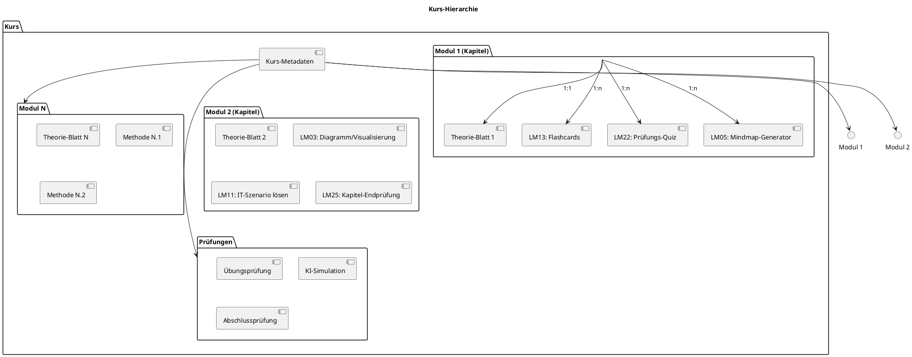

---

## 2. Kursdaten – Metadatenstruktur

### 📋 Kurs-Metadaten (course)

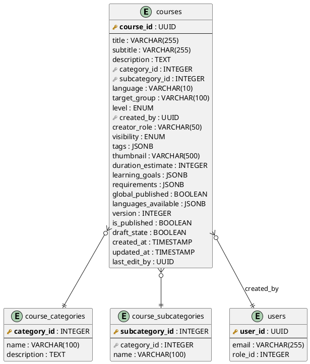

| Feld | Typ | Beschreibung |
|------|-----|--------------|
| `course_id` | UUID | Eindeutiger Kurs-Identifier |
| `title` | VARCHAR(255) | Kurstitel |
| `subtitle` | VARCHAR(255) | Untertitel |
| `description` | TEXT | Ausführliche Kursbeschreibung |
| `category_id` | INTEGER | Kategorie (IT, BWL, Sprachen) |
| `subcategory_id` | INTEGER | Unterkategorie (CompTIA, Netzwerk) |
| `language` | VARCHAR(10) | Primärsprache (de, en, pl) |
| `target_group` | VARCHAR(100) | Zielgruppe (Azubis, Schüler, Anfänger) |
| `level` | ENUM | Schwierigkeitsgrad (Beginner, Intermediate, Advanced) |
| `created_by` | UUID | Ersteller (user_id) |
| `creator_role` | VARCHAR(50) | Rolle des Erstellers |
| `visibility` | ENUM | Sichtbarkeitsstufe |
| `tags` | JSONB | Schlagwörter |
| `thumbnail` | VARCHAR(500) | Vorschaubild-URL |
| `duration_estimate` | INTEGER | Geschätzte Lernzeit (Minuten) |
| `learning_goals` | JSONB | Lernziele |
| `requirements` | JSONB | Voraussetzungen |
| `global_published` | BOOLEAN | Für Global Publishing markiert |
| `languages_available` | JSONB | Verfügbare Sprachversionen |
| `version` | INTEGER | Versionnummer |
| `is_published` | BOOLEAN | Veröffentlicht |
| `draft_state` | BOOLEAN | Entwurfs-Modus |

---

## 3. Kursarten

### 🎯 Kurstypen-Übersicht

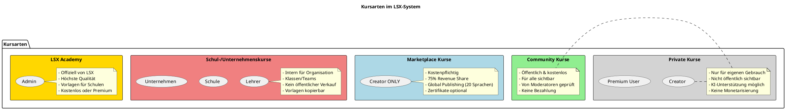

### Detaillierte Kursarten

#### 3.1 Private Kurse

| Eigenschaft | Details |
|-------------|---------|
| **Ersteller** | Premium User, Creator, Lehrer, Schulen, Unternehmen |
| **Sichtbarkeit** | Nur für Ersteller |
| **KI-Zugriff** | ✅ Für Premium+ |
| **Monetarisierung** | ❌ Keine |
| **Global Publishing** | ❌ Nicht verfügbar |
| **Zweck** | Eigenes Lernen, Vorbereitung |

#### 3.2 Community Kurse

| Eigenschaft | Details |
|-------------|---------|
| **Ersteller** | Premium User, Creator |
| **Sichtbarkeit** | Öffentlich für alle LSX-User |
| **Preis** | ✅ Immer kostenlos |
| **Methoden** | Gruppe A+B+C (keine Gruppe D-Erstellung durch Premium) |
| **Moderation** | ✅ Kann geprüft/gesperrt werden |
| **Zweck** | Community-Beitrag, Teilen von Wissen |

#### 3.3 Marketplace Kurse (Creator ONLY)

| Eigenschaft | Details |
|-------------|---------|
| **Ersteller** | ✅ Nur Creator |
| **Sichtbarkeit** | Öffentlich im Marketplace |
| **Preis** | Frei wählbar (Creator setzt Preis) |
| **Revenue Share** | 75% Creator / 25% Plattform |
| **Global Publishing** | ✅ Bis zu 20 Sprachen |
| **Zertifikate** | ✅ Optional |
| **Qualitätskontrolle** | Initial-Review durch Moderatoren |

#### 3.4 Schul-/Unternehmenskurse

| Eigenschaft | Details |
|-------------|---------|
| **Ersteller** | Schulen, Unternehmen, Lehrer (zugeordnet) |
| **Sichtbarkeit** | Nur innerhalb der Organisation |
| **Vorlagen** | ✅ LSX Academy & Creator-Kurse kopierbar |
| **Anpassung** | ✅ Vollständig anpassbar |
| **Monetarisierung** | ❌ Keine öffentlichen Verkäufe |
| **Zweck** | Interne Schulungen, Klassen, Teams |

#### 3.5 LSX Academy Kurse

| Eigenschaft | Details |
|-------------|---------|
| **Ersteller** | ✅ Nur LSX-Admins |
| **Qualität** | Höchster Standard |
| **Verwendung** | Vorlagen für Schulen/Unternehmen |
| **Preis** | Kostenlos oder Premium-exklusiv |
| **Zertifikate** | ✅ Offizielle LSX-Zertifikate |

---

## 4. Modul-Struktur

### 🧩 Modul-Datenmodell

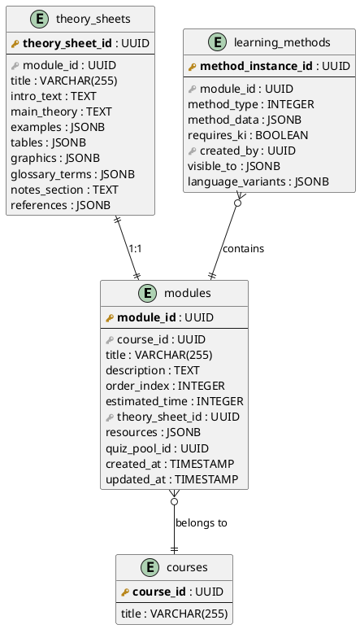

### Modul-Datenfelder

| Feld | Typ | Beschreibung |
|------|-----|--------------|
| `module_id` | UUID | Eindeutiger Modul-Identifier |
| `course_id` | UUID | Zugehöriger Kurs |
| `title` | VARCHAR(255) | Modultitel |
| `description` | TEXT | Modulbeschreibung |
| `order_index` | INTEGER | Reihenfolge im Kurs (1, 2, 3, ...) |
| `estimated_time` | INTEGER | Geschätzte Lernzeit (Minuten) |
| `theory_sheet_id` | UUID | Verweis auf Theorie-Blatt (1:1) |
| `resources` | JSONB | Liste von Dateien/Links |
| `quiz_pool_id` | UUID | Optional: Fragenpool |

### Modul-Regeln

| Regel | Beschreibung |
|-------|--------------|
| ✅ **Theorie-Pflicht** | Jedes Modul MUSS ein Theorie-Blatt haben |
| ✅ **Methoden-Flexibilität** | Jedes Modul KANN mehrere Content-Lernmethoden enthalten |
| ✅ **Reihenfolge** | Module werden über `order_index` sortiert |
| ✅ **Unabhängigkeit** | Module können einzeln konsumiert werden |

---

## 5. Theorie-Blatt (Zentrale Wissensbasis)

### 📖 Theorie-Blatt-Struktur

Das Theorie-Blatt ist das **Fundament** jedes Moduls und MUSS immer vorhanden sein.

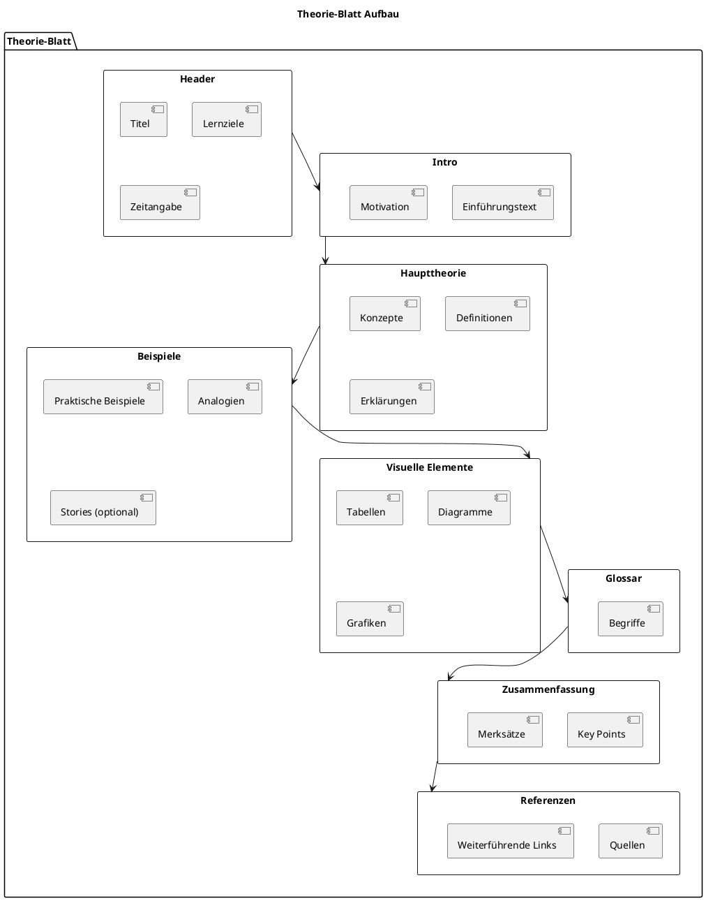

### Theorie-Blatt-Datenfelder

| Feld | Typ | Beschreibung |
|------|-----|--------------|
| `theory_sheet_id` | UUID | Eindeutiger Identifier |
| `module_id` | UUID | Zugehöriges Modul (1:1) |
| `title` | VARCHAR(255) | Titel des Theorie-Blatts |
| `intro_text` | TEXT | Einführung & Motivation |
| `main_theory` | TEXT | Haupttheoretischer Inhalt |
| `examples` | JSONB | Liste von Beispielen |
| `tables` | JSONB | Tabellenstrukturen |
| `graphics` | JSONB | Referenzen zu Bildern/Diagrammen |
| `glossary_terms` | JSONB | Begriffe & Definitionen |
| `notes_section` | TEXT | Bereich für Notizen (Lernende) |
| `references` | JSONB | Quellenangaben |

### Erstellungsmöglichkeiten

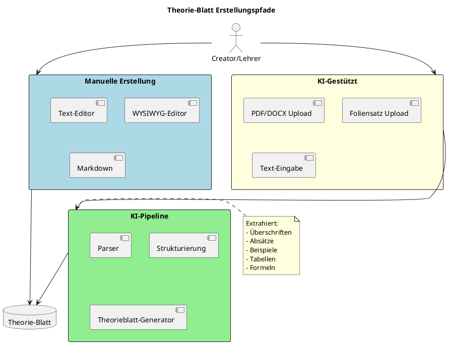

### KI-Unterstützung für Theorie-Blätter

| Funktion | Verfügbar für | Beschreibung |
|----------|---------------|--------------|
| **Zusammenfassung** | Premium, Creator, Lehrer, School, Company | KI generiert kurze Zusammenfassung |
| **Vereinfachung** | Premium, Creator, Lehrer, School, Company | "Erkläre wie für Anfänger" |
| **Beispiele generieren** | Premium, Creator, Lehrer, School, Company | Praktische Beispiele hinzufügen |
| **Analogien erstellen** | Premium, Creator, Lehrer, School, Company | Metaphern & Vergleiche |
| **Story-Modus** | Premium, Creator, Lehrer, School, Company | Thema als Geschichte erzählt |
| **Übersetzung** | Creator, School, Company | Global Publishing (20 Sprachen) |

---

## 6. Lernmethoden in Modulen

### 🎯 Methoden-Integration

Ein Modul kann **mehrere Lernmethoden** enthalten. Jede Methode ist eine Instanz eines der 12 Content-Lernmethodentypen (definiert in [02_Lernmethoden.md](02_Lernmethoden.md)).

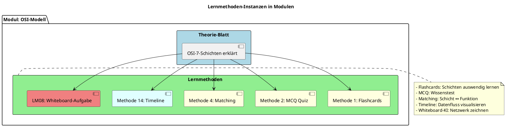

### Methoden-Datenstruktur

| Feld | Typ | Beschreibung |
|------|-----|--------------|
| `method_instance_id` | UUID | Eindeutige Instanz-ID |
| `module_id` | UUID | Zugehöriges Modul |
| `method_type` | INTEGER | Methodentyp (12 Content-LMs, siehe 02_Lernmethoden.md) |
| `method_data` | JSONB | Methodenspezifische Daten |
| `requires_ki` | BOOLEAN | KI erforderlich? |
| `created_by` | UUID | Ersteller |
| `visible_to` | JSONB | Rollenbasierte Sichtbarkeit |
| `language_variants` | JSONB | Übersetzungen |

### Methoden-Beispiel: Flashcards (Typ 1)

```json
{
  "method_instance_id": "uuid-123",
  "module_id": "module-uuid-456",
  "method_type": 1,
  "method_data": {
    "cards": [
      {
        "card_id": "card-1",
        "front": "Was ist die OSI-Schicht 7?",
        "back": "Application Layer - Anwendungsschicht",
        "tags": ["OSI", "Netzwerk"],
        "order": 1
      },
      {
        "card_id": "card-2",
        "front": "Was ist die OSI-Schicht 1?",
        "back": "Physical Layer - Bitübertragungsschicht",
        "tags": ["OSI", "Netzwerk"],
        "order": 2
      }
    ]
  },
  "requires_ki": false,
  "created_by": "creator-uuid",
  "visible_to": ["free", "premium", "creator"],
  "language_variants": {
    "de": "method_data above",
    "en": {
      "cards": [
        {
          "front": "What is OSI Layer 7?",
          "back": "Application Layer"
        }
      ]
    }
  }
}
```

---

## 7. Prüfungstypen

### 📝 Prüfungsarchitektur

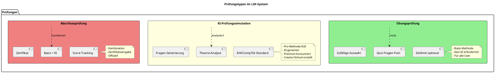

### 7.1 Übungsprüfung (Basis)

| Eigenschaft | Details |
|-------------|---------|
| **Typ** | `practice` |
| **KI-Bedarf** | ❌ Keine |
| **Quelle** | Vorhandene Quiz-Fragen |
| **Zugriff** | Free, Premium, alle Rollen |
| **Zeitlimit** | Optional |
| **Auswertung** | Sofort |

**Datenstruktur:**

```json
{
  "exam_id": "uuid-exam-1",
  "course_id": "course-uuid",
  "type": "practice",
  "title": "OSI-Modell Übungsprüfung",
  "question_ids": ["q1", "q2", "q3", "q4", "q5"],
  "time_limit": 1800,
  "passing_score": 70
}
```

### 7.2 KI-Prüfungssimulation (Pro-Methode #20)

| Eigenschaft | Details |
|-------------|---------|
| **Typ** | `ai_simulation` |
| **KI-Bedarf** | ✅ Erforderlich |
| **Erstellen** | Creator, Lehrer, School, Company |
| **Konsumieren** | Premium+ |
| **Standards** | IHK, CompTIA, Schulcurriculum, Custom |

**Workflow:**

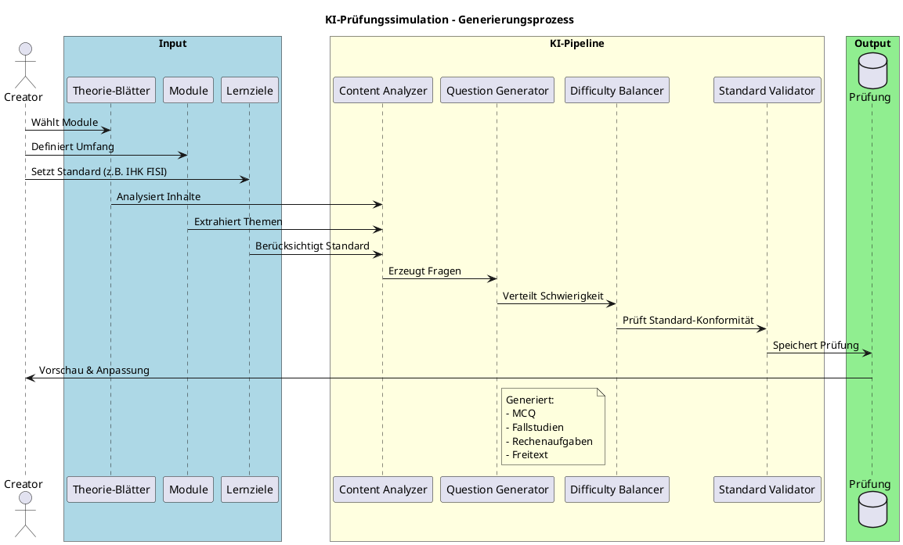

**Datenstruktur:**

```json
{
  "exam_id": "uuid-exam-ai-1",
  "course_id": "course-uuid",
  "type": "ai_simulation",
  "title": "IHK FISI AP1 Simulation",
  "source_modules": ["mod1", "mod2", "mod3"],
  "difficulty_level": "intermediate",
  "exam_profile": "IHK_FISI_AP1",
  "generated_by_ai": true,
  "ai_model": "claude-sonnet-4-20250514",
  "questions": [
    {
      "question_id": "ai-q1",
      "type": "mcq",
      "question": "Welche OSI-Schicht ist für Routing zuständig?",
      "options": ["Layer 2", "Layer 3", "Layer 4", "Layer 7"],
      "correct": 1,
      "explanation": "Layer 3 (Network Layer) ist für Routing zuständig."
    }
  ],
  "time_limit": 3600,
  "passing_score": 50
}
```

### 7.3 Abschlussprüfung

| Eigenschaft | Details |
|-------------|---------|
| **Typ** | `final` |
| **Kombination** | Basis-Fragen + KI-Fragen |
| **Zertifikat** | ✅ Bei Bestehen |
| **Wiederholbar** | Ja (mit Wartezeit) |

---

## 8. Kurs-Editor

### 🛠️ Editor-Funktionen nach Rolle

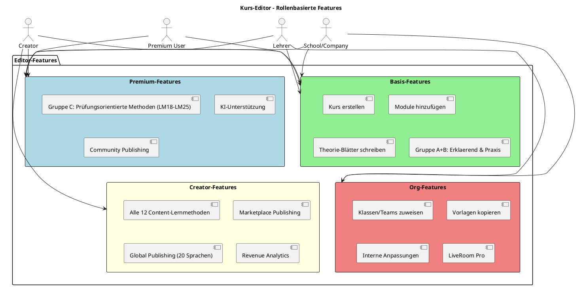

### Editor-Workflow

```plantuml
@startuml
title Kurserstellung - Workflow

start

:Kurs-Metadaten eingeben;

:Kategorie & Sprache wählen;

fork
  :Modul 1 erstellen;
  :Theorie-Blatt schreiben;
  :Lernmethoden hinzufügen;
fork again
  :Modul 2 erstellen;
  :Theorie-Blatt schreiben;
  :Lernmethoden hinzufügen;
fork again
  :Modul N erstellen;
  :Theorie-Blatt schreiben;
  :Lernmethoden hinzufügen;
end fork

:Prüfungen hinzufügen (optional);

if (Global Publishing?) then (ja)
  :KI übersetzt in 20 Sprachen;
else (nein)
  :Nur Primärsprache;
endif

:Vorschau prüfen;

if (Veröffentlichen?) then (ja)
  if (Kursart?) then (Private)
    :Als privat speichern;
  else (Community)
    :Community-Prüfung;
    :Veröffentlichen;
  else (Marketplace)
    :Moderator-Review;
    :Freigabe;
    :Im Marketplace listen;
  endif
else (nein)
  :Als Entwurf speichern;
endif

stop

@enduml
```

---

## 9. Versionierung & Änderungsverfolgung

### 📜 Versions-Management

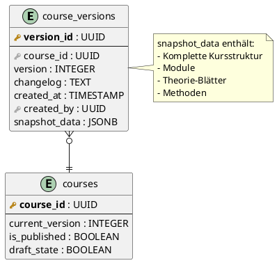

| Feld | Typ | Beschreibung |
|------|-----|--------------|
| `version` | INTEGER | Versionnummer (1, 2, 3, ...) |
| `last_edit_at` | TIMESTAMP | Letzter Bearbeitungszeitpunkt |
| `last_edit_by` | UUID | Letzter Bearbeiter |
| `changelog` | TEXT | Änderungsprotokoll |
| `is_published` | BOOLEAN | Veröffentlicht? |
| `draft_state` | BOOLEAN | Entwurfs-Modus? |

### Versionierungs-Regeln

| Regel | Beschreibung |
|-------|--------------|
| ✅ **Auto-Versionierung** | Änderungen an veröffentlichten Kursen erzeugen neue Versionen |
| ✅ **Snapshot** | Jede Version speichert vollständigen Stand |
| ✅ **Rollback** | Frühere Versionen wiederherstellbar |
| ✅ **Organisations-Versionen** | Schulen/Unternehmen können eigene Versionen führen |

---

## 10. Sichtbarkeitsstufen

### 🔐 Visibility-Matrix

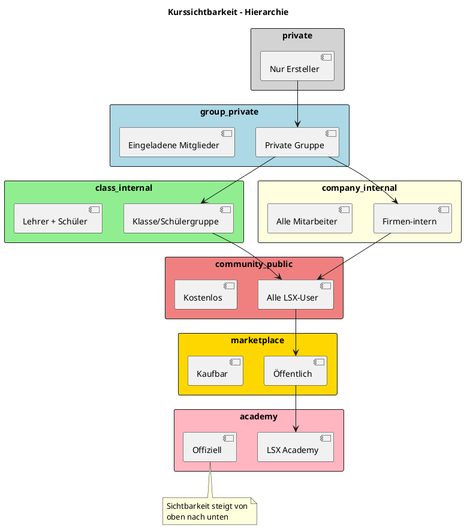

### Sichtbarkeitsstufen

| Stufe | Zugriff | Ersteller | Zweck |
|-------|---------|-----------|-------|
| `private` | Nur Ersteller | Alle Rollen | Persönliches Lernen |
| `group_private` | Eingeladene Mitglieder | Premium+ | Study Groups |
| `class_internal` | Klasse + Lehrer | Lehrer, School | Unterricht |
| `company_internal` | Alle Mitarbeiter | Company | Firmen-Training |
| `community_public` | Alle LSX-User | Premium, Creator | Community-Beitrag |
| `marketplace` | Kaufbar für alle | Creator | Monetarisierung |
| `academy` | Premium oder Free | Admin | Offizielle LSX-Kurse |

---

## 11. Kursfortschritt & Tracking

### 📊 Progress-Tracking

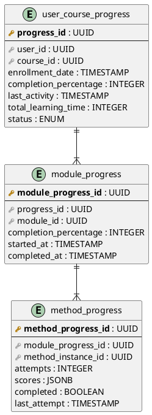

### Progress-Datenfelder

| Feld | Typ | Beschreibung |
|------|-----|--------------|
| `progress_id` | UUID | Eindeutiger Progress-Identifier |
| `user_id` | UUID | Lernender |
| `course_id` | UUID | Kurs |
| `module_id` | UUID | Aktuelles Modul |
| `method_instance_id` | UUID | Aktuelle Methode |
| `completion_state` | INTEGER | Fortschritt 0-100% |
| `last_activity` | TIMESTAMP | Letzte Aktivität |
| `total_learning_time` | INTEGER | Gesamte Lernzeit (Minuten) |
| `attempts` | INTEGER | Anzahl Versuche |
| `scores` | JSONB | Punkte nach Methode |

### Analytics für Rollen

| Rolle | Analytics |
|-------|-----------|
| **Premium User** | Eigener Fortschritt, Schwachstellen |
| **Creator** | Kurs-Performance, User-Statistiken |
| **Lehrer** | Klassen-Fortschritt, individuelle Schüler |
| **School/Company** | Gesamt-Statistiken, Abteilungen, Teams |
| **Admin** | System-weite Metriken |

---

## 12. Import, Copy & Vorlagen

### 📥 Vorlagen-System

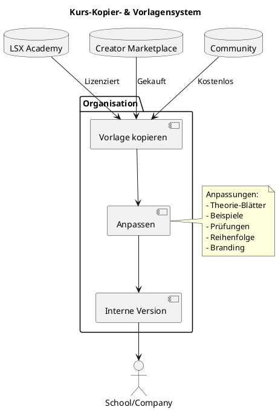

### Kopierfunktionen

| Rolle | Kopieren | Anpassen | Zweck |
|-------|----------|----------|-------|
| **Free** | ❌ | ❌ | Nur Konsum |
| **Premium** | ❌ | ❌ | Nur Konsum |
| **Creator** | ✅ Eigene | ✅ | Vorlagen für Marketplace |
| **Lehrer** | ✅ Academy, gekaufte | ✅ | Klassenanpassung |
| **School/Company** | ✅ Academy, gekaufte, Community | ✅ | Interne Schulungen |

---

## 13. Global Publishing

### 🌍 Übersetzungspipeline

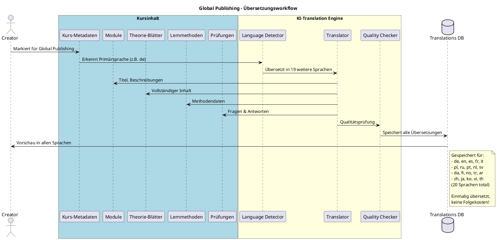

### Global Publishing-Prozess

| Schritt | Aktion |
|---------|--------|
| 1 | Creator markiert Kurs für Global Publishing |
| 2 | System erkennt Primärsprache |
| 3 | KI übersetzt in 19 weitere Sprachen |
| 4 | Übersetzungen werden gespeichert (JSONB) |
| 5 | Kurs in allen Sprachen verfügbar |
| 6 | Keine erneuten KI-Kosten bei Abruf |

### Unterstützte Sprachen

| Region | Sprachen |
|--------|----------|
| **Europa** | Deutsch (de), Englisch (en), Spanisch (es), Französisch (fr), Italienisch (it), Polnisch (pl), Niederländisch (nl), Schwedisch (sv), Dänisch (da), Finnisch (fi), Norwegisch (no), Türkisch (tr) |
| **Asien** | Chinesisch (zh), Japanisch (ja), Koreanisch (ko), Vietnamesisch (vi), Thailändisch (th), Arabisch (ar) |
| **Amerika** | Portugiesisch (pt), Russisch (ru) |

---

## 14. Zusammenfassung

### ✅ Kurs-Architektur-Highlights

| Aspekt | Details |
|--------|---------|
| **Modularität** | Kurse → Module → Theorie-Blätter → Methoden |
| **Flexibilität** | 12 Content-Lernmethoden pro Modul |
| **KI-Integration** | Content-Generierung, Übersetzung, Prüfungen |
| **Rollenbasiert** | Strikte Trennung: Premium/Creator/Teacher/School/Company |
| **International** | Global Publishing in 20 Sprachen |
| **Versionierung** | Vollständiges Versions-Management |
| **Tracking** | Detailliertes Progress-Tracking |
| **Vorlagen** | Kopierfunktionen für Organisationen |

### 🎯 Architektur-Prinzipien

```
┌─────────────────────────────────────────┐
│  📚 Kurs-Architektur                    │
│                                         │
│  Kurs                                   │
│    ├── Metadaten (Titel, Kategorie)    │
│    ├── Module (1-n)                     │
│    │    ├── Theorie-Blatt (1:1)        │
│    │    └── Lernmethoden (12 Content-LMs)   │
│    ├── Prüfungen (optional)            │
│    └── Versionen                        │
│                                         │
│  Eigenschaften:                         │
│  ✅ Modular                             │
│  ✅ Rollenbasiert                       │
│  ✅ KI-fähig                            │
│  ✅ International                       │
│  ✅ Versioniert                         │
└─────────────────────────────────────────┘
```

---

## 15. Datenbank-Schema (Zusammenfassung)

### 🗃️ Haupt-Tabellen

| Tabelle | Beschreibung | Kardinalität |
|---------|--------------|--------------|
| `courses` | Kurs-Metadaten | - |
| `modules` | Lernmodule | n:1 zu courses |
| `theory_sheets` | Theorie-Blätter | 1:1 zu modules |
| `learning_methods` | Methodeninstanzen | n:1 zu modules |
| `exams` | Prüfungen | n:1 zu courses |
| `exam_questions` | Fragen | n:1 zu exams |
| `user_course_progress` | Fortschritt | n:1 zu users & courses |
| `module_progress` | Modul-Fortschritt | n:1 zu user_course_progress |
| `method_progress` | Methoden-Fortschritt | n:1 zu module_progress |
| `course_versions` | Versionen | n:1 zu courses |
| `translations` | Übersetzungen | Poly zu content |

---

## 📌 Dokument abgeschlossen

**Version:** 1.0
**Status:** Final
**Letzte Aktualisierung:** 2024

---

> 💡 **Hinweis:** Diese Kurs-Architektur bildet das Rückgrat des gesamten LSX-Lernsystems und ist optimiert für Skalierbarkeit, KI-Integration und internationale Nutzung.
