# 19 – Sicherheit & Berechtigungen (Final)

**Version:** 1.0  
**Stand:** Final

---

## Überblick

Dieses Dokument definiert die komplette **Sicherheitsarchitektur** und alle **Berechtigungsmechanismen** des LSX Lernsystems.

Es enthält:
- 🔒 **Regeln & Modelle**
- 🔐 **Datenflüsse**
- 👥 **Rollenprüfungen**
- 🛡️ **Schutzmechanismen**
- 📝 **Logging & Monitoring**
- 🤖 **KI-spezifische Sicherheit**

---

## 1. Sicherheitsarchitektur (C4 Model)

### 🔒 Security System Context

```plantuml
@startuml
!include https://raw.githubusercontent.com/plantuml-stdlib/C4-PlantUML/master/C4_Container.puml

Person(user, "User", "Verschiedene Rollen")
Person(attacker, "Attacker", "Böswilliger Akteur")

System_Boundary(security, "Security System") {
    Container(auth, "Authentication", "JWT", "Token Management")
    Container(authz, "Authorization", "RBAC", "Permission Check")
    Container(rate_limit, "Rate Limiter", "Redis", "Request Throttling")
    Container(input_val, "Input Validator", "Sanitizer", "XSS/Injection Protection")
    Container(audit, "Audit Logger", "PostgreSQL", "Activity Tracking")
    Container(monitor, "Monitor", "Alerting", "Abuse Detection")
}

System_Boundary(app, "LSX Application") {
    Container(api, "API Endpoints", "Flask", "Business Logic")
    Container(ki, "KI Services", "Anthropic/OpenAI", "AI Processing")
}

Rel(user, auth, "Login", "HTTPS")
Rel(auth, authz, "Validate")
Rel(authz, rate_limit, "Check Limits")
Rel(rate_limit, input_val, "Validate Input")
Rel(input_val, api, "Process Request")

Rel(api, audit, "Log Action")
Rel(api, monitor, "Track Usage")
Rel(ki, monitor, "Track KI Usage")

Rel(attacker, auth, "Attack Attempt", "X")
Rel(attacker, rate_limit, "DOS Attempt", "X")
Rel(rate_limit, monitor, "Alert", "!")

note right of monitor
  Erkennt und blockt:
  - Brute Force
  - Rate Abuse
  - KI Abuse
  - Anomalien
end note

@enduml
```

---

## 2. Ziele der Sicherheitsarchitektur

### ✅ Sicherheitsziele

| Ziel | Umsetzung |
|------|-----------|
| 🔐 **Benutzerdaten** | Verschlüsselt, Isoliert |
| 🤖 **KI-Schutz** | Rate Limits, Logging |
| 🚫 **Missbrauch** | Detection & Prevention |
| 🔒 **Unauth. Zugriff** | Zero-Trust, RBAC |
| 👥 **Granulare Kontrolle** | Rollenbasiertes System |
| 📜 **DSGVO** | Compliant |
| 🛡️ **Injection/XSS** | Sanitization |
| 📝 **Auditierbarkeit** | Vollständiges Logging |
| 🏢 **Org-Schutz** | Datenisolierung |

---

## 3. Sicherheitsgrundlagen

### 🎯 Zero-Trust-Ansatz

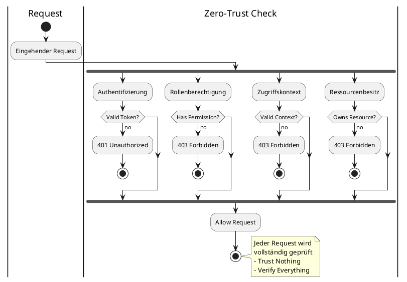

---

### 🔐 Least Privilege Principle

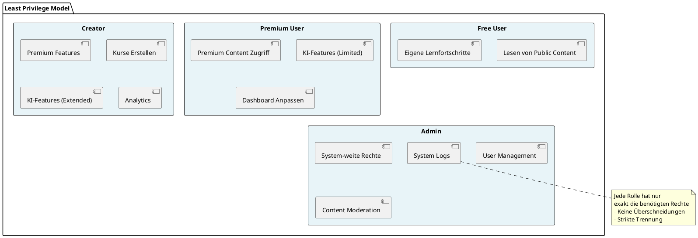

---

## 4. Authentifizierung

### 🔑 JWT Token System

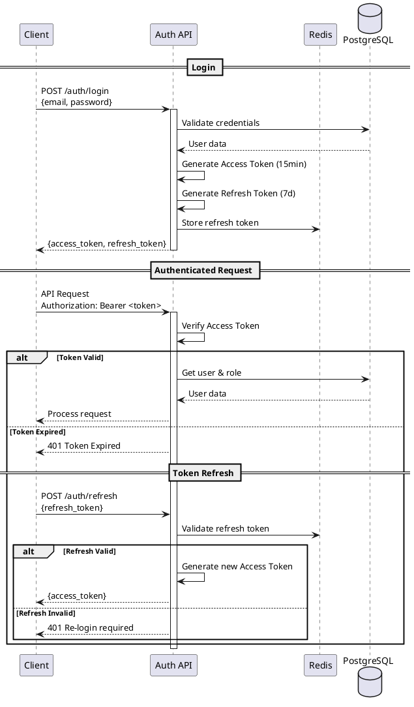

---

### 🍪 Token Storage Strategy

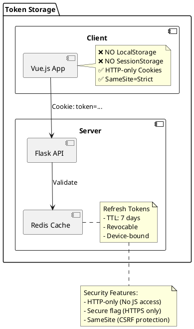

---

### 🔒 Session Hardening

| Feature | Implementation |
|---------|---------------|
| 🖥️ **Gerätebindung** | Device Fingerprint Hash |
| 🌍 **IP-Tracking** | IP Hash Verification |
| 🔍 **User-Agent** | Browser Fingerprint |
| 🔄 **Token Rotation** | Refresh on every use |
| 🚫 **Invalidation** | On role/password change |

---

## 5. Berechtigungsmodell (Group-Based)

### 👥 Group-Based Access Control (NEW)

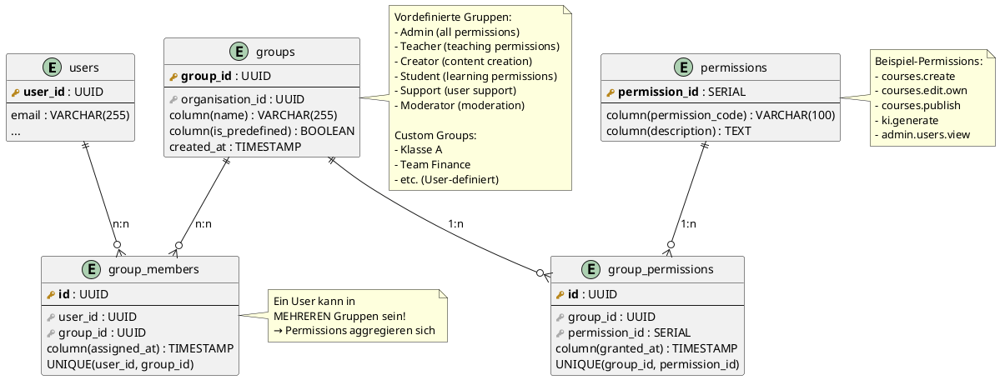

---

### 🎯 Group-Based Permission Check Flow

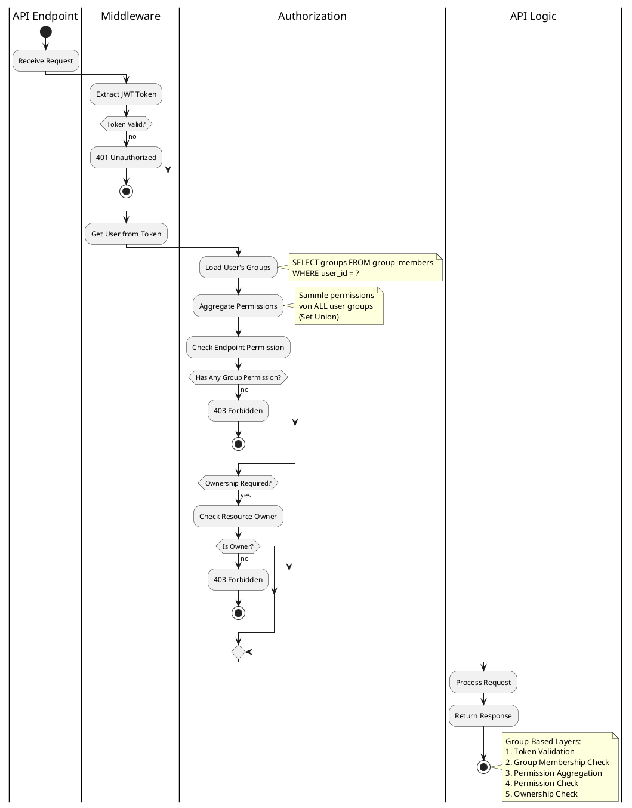

---

### 📋 Standard-Gruppen & Ihre Berechtigungen

| Gruppe | Kurse Erstellen | KI Nutzen | Global Publish | Admin Panel | Weitere Perms |
|--------|-----------------|-----------|----------------|-------------|---------------|
| 👤 **Student** | ❌ | ❌ | ❌ | ❌ | Learn content |
| ✨ **Creator** | ✅ | ✅ (extended) | ✅ | ❌ | Publish, Analytics |
| 👨‍🏫 **Teacher** | ✅ | ✅ (pool) | ❌ | ⚠️ (Org) | Classroom mgmt |
| 🏢 **Support** | ❌ | ❌ | ❌ | ⚠️ (Users) | User support, Tickets |
| 🔍 **Moderator** | ❌ | ❌ | ❌ | ⚠️ (Moderation) | Content review, Bans |
| 👑 **Admin** | ✅ | ✅ (unlimited) | ✅ | ✅ | Full system access |

---

### 🔄 Multiple Group Membership (KEY FEATURE!)

Ein Benutzer kann in **MEHREREN Gruppen** sein. Permissions aggregieren sich:

**Beispiel:** User "Alice" ist in Gruppen:
- ✅ "Student" → Permission: `courses.view`
- ✅ "Creator" → Permissions: `courses.create`, `courses.edit.own`, `courses.publish`
- ✅ "Moderator" → Permissions: `content.review`, `users.warn`

**Resultat:** Alice hat diese aggregierten Permissions:
```
courses.view + courses.create + courses.edit.own + courses.publish + content.review + users.warn
```

Dies ist **viel flexibler** als das alte 1:1 Rollen-System!

---

### 👑 Owner-Admin & Custom Roles (RBAC 2.0)

**Status:** ✅ **IMPLEMENTIERT** (Migration 067, 068)

#### Owner-Admin System

Der **Owner-Admin** ist eine spezielle Admin-Rolle mit erweiterten Berechtigungen:

```sql
-- users table
ALTER TABLE users ADD COLUMN is_owner BOOLEAN DEFAULT FALSE;
CREATE UNIQUE INDEX idx_single_owner ON users(is_owner) WHERE is_owner = TRUE;
```

**Eigenschaften:**
- ✅ Nur **EIN** Owner-Admin möglich (Database Constraint)
- ✅ Wird automatisch beim **Setup Wizard** erstellt (erster Admin = Owner)
- ✅ Kann **Custom-Rollen** erstellen/bearbeiten/löschen
- ✅ Kann **Ownership übertragen** (an anderen Admin)
- ✅ Hat Zugriff auf **vollständige Audit-Logs**
- ✅ Kann **Compliance-Einstellungen** verwalten

**Owner-Admin Berechtigungen (Exklusiv):**
```python
OWNER_ADMIN_ONLY_PERMISSIONS = [
    'manage_roles',           # Create/Edit/Delete Custom-Rollen
    'manage_owner_transfer',  # Owner an anderen Admin übertragen
    'delete_system_data',     # System-Daten löschen
    'access_audit_logs',      # Vollständige Audit Logs
    'manage_compliance',      # Compliance-Einstellungen
    'emergency_access'        # Notfall-Zugriff auf alles
]
```

#### Custom Roles (Dynamisches Rollen-System)

**Zweck:** Owner-Admin kann neue Rollen über Admin-Panel erstellen und Features zuweisen.

**Datenbank-Schema:**

```sql
-- roles table (erweitert)
ALTER TABLE roles ADD COLUMN is_custom BOOLEAN DEFAULT FALSE;
ALTER TABLE roles ADD COLUMN created_by UUID REFERENCES users(user_id);
ALTER TABLE roles ADD COLUMN template_name VARCHAR(50);

-- role_feature_assignments (NEW)
CREATE TABLE core.role_feature_assignments (
    assignment_id SERIAL PRIMARY KEY,
    role_id INTEGER NOT NULL REFERENCES roles(role_id) ON DELETE CASCADE,
    feature_id INTEGER NOT NULL REFERENCES support_systems.system_features(feature_id) ON DELETE CASCADE,
    enabled BOOLEAN DEFAULT TRUE,
    created_at TIMESTAMP WITH TIME ZONE DEFAULT NOW(),
    created_by UUID REFERENCES users(user_id),
    UNIQUE(role_id, feature_id)
);
```

**Role Templates (Vordefiniert):**

| Template | Beschreibung | Features |
|----------|--------------|----------|
| 👪 **Parent** | Eltern-Rolle für Kinderkontrolle | Content-Freigabe, Activity-Monitoring |
| 🏢 **Enterprise Admin** | Unternehmens-Admin mit Bulk-Features | Bulk-Import, SSO-Config, Analytics |
| 🔍 **Auditor** | Compliance-Auditor | Audit-Logs, Export, Compliance-Reports |
| 📚 **Librarian** | Content-Kurator | Content-Moderation, Kategorien |
| 🎓 **Course Manager** | Kurs-Manager ohne Admin-Rechte | Course CRUD, Publishing |

**Feature-Zuweisung:**

Custom-Rollen können **System-Features** (25 Features) individuell zugewiesen bekommen:

```typescript
// Beispiel: Parent-Rolle erstellen
const parentRole = {
  role_name: 'parent',
  display_name: 'Parent',
  description: 'Elternkonto mit Kinderkontrolle',
  is_custom: true,
  created_by: owner_admin_id,

  // Zugewiesene Features:
  features: [
    'parental_controls',    // Kinderkontrolle
    'content_approval',     // Content-Freigabe
    'screen_time_mgmt',     // Bildschirmzeit
    'activity_reports'      // Activity-Reports
  ]
}
```

#### Admin-Panel: Role Management

**Endpoints (TODO):**
```
GET    /api/v1/admin/roles              # List all roles
POST   /api/v1/admin/roles              # Create custom role (Owner-Admin only)
PUT    /api/v1/admin/roles/{role_id}    # Update role (Owner-Admin only)
DELETE /api/v1/admin/roles/{role_id}    # Delete custom role (Owner-Admin only)

GET    /api/v1/admin/roles/{role_id}/permissions    # Get role permissions
POST   /api/v1/admin/roles/{role_id}/permissions    # Assign permissions

GET    /api/v1/admin/roles/templates    # Get role templates
POST   /api/v1/admin/roles/from-template # Create role from template
```

**Frontend-Komponenten (TODO):**
```
frontend/src/pages/admin/RoleManagement.vue
frontend/src/components/admin/roles/
├── RoleList.vue
├── RoleForm.vue
├── RolePermissionsMatrix.vue
├── RoleTemplateSelector.vue
└── RoleDeleteConfirm.vue
```

#### Permission-Middleware (Erweiterung)

**Backend-Check:**
```python
# backend/app/middleware/auth.py
@require_permission('manage_roles')  # ← Nur Owner-Admin
def create_custom_role():
    """Create custom role with feature assignments"""
    pass
```

**Frontend-Check:**
```typescript
// Frontend Permission Guard
const canManageRoles = computed(() => {
  return authStore.user?.is_owner === true
})
```

#### Aktueller Status

| Komponente | Status |
|------------|--------|
| Owner-Admin (users.is_owner) | ✅ Implementiert (Migration 067) |
| Unique Constraint (nur 1 Owner) | ✅ Implementiert (idx_single_owner) |
| Setup Wizard Owner Creation | ✅ Implementiert (admin_setup.py) |
| role_feature_assignments Table | ✅ Implementiert (Migration 068) |
| Custom Roles (roles.is_custom) | ✅ Schema vorhanden |
| Backend API (admin/roles.py) | 🟡 TODO |
| Frontend Admin-Panel | 🟡 TODO |
| Permission Middleware | 🟡 TODO |

**Nächste Schritte:**
1. Backend API für Rollen-Management implementieren
2. Frontend Admin-Panel für Custom-Rollen erstellen
3. Permission Middleware erweitern
4. Unit Tests für RBAC 2.0 schreiben

---

## 6. Ressourcen-Besitzmodell

### 🏢 Ownership Hierarchy

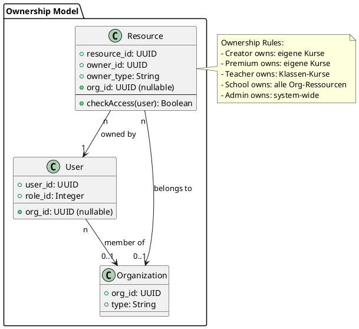

---

## 6.1 Group-Based Permission Decorators

**Status:** ✅ **DESIGNIERT** (Migration Phase 2)
**Datum:** 21.01.2026
**Dokumentation:** `app/security/permissions.py` (Neu: 500+ Zeilen)

### 🎯 Übersicht: Von Rollen zu Gruppen

**Group-Based Permission System** ersetzt das rollenbasierte Modell durch ein **flexibles Group-basiertes System**. Ein User kann jetzt zu **mehreren Gruppen** gehören (Student + Creator + Moderator gleichzeitig). Permissions werden aus **allen Gruppen aggregiert** (Set Union).

**Evolution:**

```
BEFORE (Role-Based):
Request → @require_system_admin → Check user.role == 'admin' → Grant/Deny

AFTER (Group-Based):
Request → @require_system_admin → Load all user groups via GroupMemberRepository
                                   → Aggregate permissions from ALL groups (Set Union)
                                   → Prüfe 'admin:system' permission in aggregated set
                                   → Grant/Deny (Fail-Secure)
```

**Vorteil:** User in Groups {Student, Creator, Moderator} erhält Permissions = Student ∪ Creator ∪ Moderator

---

### 📋 Die Drei Permission-Decorators

#### 1️⃣ @require_system_admin() - Group-Based Capability

**Zweck:** System-weite Admin-Rechte für kritische Operationen
**Dateiort:** `backend/app/security/permissions.py` (Zeilen 229-295)

**Berechtigungsprüfung:**
```python
# Load user's groups
user_groups = GroupMemberRepository.find_user_groups(user_id)

# Aggregate permissions from all groups
user_permissions = set()
for group in user_groups:
    group_perms = GroupPermissionRepository.find_by_group(group.id)
    user_permissions.update(group_perms)

# Check if user has 'admin:system' permission in ANY group
has_permission = (
    'admin:system' in user_permissions or
    group in [g for g in user_groups if g.is_predefined and g.name == 'Admin']
)
```

**Datenbank-Mapping:**
| Permission Key | Display Name | Gruppen | Typ |
|---------------|--------------|---------|-----|
| `admin:system` | System Administrator | Admin, (custom wenn gewährt) | System |

**Verwendung:**
```python
@app.route('/admin/system/settings', methods=['PUT'])
@require_system_admin
def update_system_settings():
    """Nur Admin-Gruppenmitglieder können System-Einstellungen ändern."""
    return jsonify({'status': 'updated'}), 200
```

**Sicherheitsmerkmale:**
- ✅ Fail-Secure: Rückgabe 403 bei Datenbankfehler (nicht 500)
- ✅ Multiple Groups: Aggregiert Permissions aus ALL Gruppen des Users
- ✅ Flexible: Admins können 'admin:system' permission auch custom-Gruppen zuweisen
- ✅ Umfassende Dokumentation: 1272 Zeichen Docstring mit Args, Returns, Usage
- ✅ Type Hints: Vollständig typisiert

---

#### 2️⃣ @require_org_admin() - Group-Based Org Admin

**Zweck:** Organisations-Admin-Rechte (Settings & Verwaltung)
**Dateiort:** `backend/app/security/permissions.py` (Zeilen 298-370)

**Berechtigungsprüfung:**
```python
# Load user's groups (filtered by organisation_id if available)
user_groups = GroupMemberRepository.find_user_groups(user_id, org_id)

# Aggregate permissions from all groups
user_permissions = set()
for group in user_groups:
    group_perms = GroupPermissionRepository.find_by_group(group.id)
    user_permissions.update(group_perms)

# Check if user has EITHER permission (OR-Logik)
has_permission = (
    'manage:org:settings' in user_permissions or
    'admin:organisations' in user_permissions or
    'admin:org' in user_permissions or  # Admin group fallback
    group in [g for g in user_groups if g.name in ['Admin', 'Support']]
)
```

**Datenbank-Mapping (OR-Logik):**
| Permission Key | Display Name | Gruppen |
|---------------|--------------|---------|
| `manage:org:settings` | Manage Organization Settings | Admin, Support, (custom) |
| `admin:organisations` | Administer Organizations | Admin, Support, (custom) |

**Verwendung:**
```python
@app.route('/organisations/<org_id>/settings', methods=['PUT'])
@require_org_admin
def update_org_settings(org_id):
    """Nur Mitglieder von Admin/Support-Gruppen können Org-Einstellungen ändern."""
    return jsonify({'status': 'updated'}), 200
```

**Sicherheitsmerkmale:**
- ✅ Multiple Groups: Prüft Permissions aus ALL user's Gruppen
- ✅ OR-Logik: User braucht NUR EINE von zwei Permissions
- ✅ Fail-Secure: Rückgabe 403 bei Fehler
- ✅ Flexible Gruppenzuweisung: Admins können Permissions zu custom-Gruppen hinzufügen
- ✅ Umfassende Dokumentation: 1488 Zeichen Docstring

---

#### 3️⃣ @require_org_member() - Group-Based Resource Access

**Zweck:** Organisations-Zugehörigkeit prüfen (über Group-Membership)
**Dateiort:** `backend/app/security/permissions.py` (Zeilen 373-454)

**⚠️ WICHTIG:** Dies ist **NICHT** capability-based wie die anderen Decorators. Hier wird geprüft, ob User zu einer **Organization gehört** (via Group Membership), nicht **WAS** er TUN kann.

**Zugriffsprüfung:**
```python
# Hole org_id aus Route-Parametern
org_id = kwargs.get('org_id') or kwargs.get('organization_id')

# Load user's groups
user_groups = GroupMemberRepository.find_user_groups(user_id)

# Prüfe: Gehört User zu Org-ABC?
# (via: Gehört User zu Group X die zu Org-ABC gehört?)
org_ids = {group.organisation_id for group in user_groups}

if str(org_id) not in [str(oid) for oid in org_ids]:
    # User gehört nicht zu dieser Org über keine seiner Gruppen
    return jsonify({...}), 403

return fn(*args, **kwargs)
```

**Unterschied zu anderen Decorators:**

| Decorator | Typ | Logik |
|-----------|-----|-------|
| `@require_system_admin` | **Capability-Based** | "Darf User X tun?" (Permission prüfen) |
| `@require_org_admin` | **Capability-Based** | "Darf User Y Org-Admin sein?" (Permission prüfen) |
| `@require_org_member` | **Resource-Based** | "Gehört User Z zu Org-ABC?" (Gruppe-Zugehörigkeit) |

**Verwendung:**
```python
@app.route('/organisations/<org_id>/courses', methods=['GET'])
@require_org_member
def get_org_courses(org_id):
    """Nur Mitglieder dieser Org (über Gruppen) können ihre Kurse sehen."""
    # org_id ist garantiert erreichbar (Decorator prüfte bereits Org-Zugehörigkeit)
    return jsonify({'courses': [...]}), 200
```

**Sicherheitsmerkmale:**
- ✅ Ressourcen-Schutz: Prüft Org-Zugehörigkeit via Group-Membership
- ✅ Multiple Groups: User kann zu Organization via MEHRERE Gruppen gehören
- ✅ Klare Fehlermeldungen: 400 (Bad Request) vs 403 (Forbidden)
- ✅ Umfassende Dokumentation: 1669 Zeichen mit Architektur-Erklärung

---

### 🔐 Permission Check Flow (Detailliert)

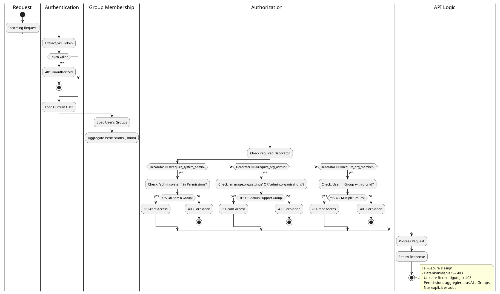

---

### 🗄️ Datenbank-Schema (Group-Based System)

**Neue Tabellen (Migrations 080, 081, 082):**

```sql
-- Migration 080: Create Groups Table
CREATE TABLE IF NOT EXISTS core.groups (
    id UUID PRIMARY KEY DEFAULT gen_random_uuid(),
    organisation_id UUID NOT NULL REFERENCES core.organisations(id) ON DELETE CASCADE,
    name VARCHAR(255) NOT NULL,
    description TEXT,
    is_predefined BOOLEAN DEFAULT FALSE,  -- True für Admin, Teacher, Student, etc.
    created_at TIMESTAMP NOT NULL DEFAULT CURRENT_TIMESTAMP,
    updated_at TIMESTAMP NOT NULL DEFAULT CURRENT_TIMESTAMP,
    CONSTRAINT unique_org_group_name UNIQUE (organisation_id, name)
);

CREATE INDEX idx_groups_organisation_id ON core.groups(organisation_id);
CREATE INDEX idx_groups_is_predefined ON core.groups(is_predefined);

-- Migration 081: Create Group Members Table (Many-to-Many)
CREATE TABLE IF NOT EXISTS core.group_members (
    id UUID PRIMARY KEY DEFAULT gen_random_uuid(),
    user_id UUID NOT NULL REFERENCES core.users(id) ON DELETE CASCADE,
    group_id UUID NOT NULL REFERENCES core.groups(id) ON DELETE CASCADE,
    assigned_at TIMESTAMP NOT NULL DEFAULT CURRENT_TIMESTAMP,
    CONSTRAINT unique_user_group UNIQUE (user_id, group_id)
);

CREATE INDEX idx_group_members_user_id ON core.group_members(user_id);
CREATE INDEX idx_group_members_group_id ON core.group_members(group_id);

-- Migration 082: Create Group Permissions Table
CREATE TABLE IF NOT EXISTS core.group_permissions (
    id UUID PRIMARY KEY DEFAULT gen_random_uuid(),
    group_id UUID NOT NULL REFERENCES core.groups(id) ON DELETE CASCADE,
    permission_code VARCHAR(100) NOT NULL,  -- 'admin:system', 'manage:org:settings', etc.
    granted_at TIMESTAMP NOT NULL DEFAULT CURRENT_TIMESTAMP,
    CONSTRAINT unique_group_permission UNIQUE (group_id, permission_code)
);

CREATE INDEX idx_group_permissions_group_id ON core.group_permissions(group_id);
CREATE INDEX idx_group_permissions_permission_code ON core.group_permissions(permission_code);
```

**Standard-Gruppen initialisieren (für jede Organisation):**

```sql
-- Für jede Organisation: 6 Standard-Gruppen erstellen
INSERT INTO core.groups (organisation_id, name, description, is_predefined)
SELECT
    id,
    'Admin',
    'System Administrator - Full access to organization management',
    true
FROM core.organisations

UNION ALL

SELECT
    id,
    'Teacher',
    'Lehrperson - Kann Kurse erstellen, Studieren managen',
    true
FROM core.organisations

UNION ALL

SELECT
    id,
    'Creator',
    'Inhaltsersteller - Kann Kurse und Lerninhalte erstellen',
    true
FROM core.organisations

UNION ALL

SELECT
    id,
    'Student',
    'Lernender - Kann Kurse absolvieren und an Diskussionen teilnehmen',
    true
FROM core.organisations

UNION ALL

SELECT
    id,
    'Support',
    'Support-Team - Kann Nutzerprobleme unterstützen',
    true
FROM core.organisations

UNION ALL

SELECT
    id,
    'Moderator',
    'Inhaltsmoderiert - Kann Inhalte überprüfen und Verstöße bearbeiten',
    true
FROM core.organisations

ON CONFLICT (organisation_id, name) DO NOTHING;
```

**Permissions für Standard-Gruppen definieren:**

```sql
-- Admin Group: Alle Permissions
INSERT INTO core.group_permissions (group_id, permission_code)
SELECT g.id, 'admin:system'
FROM core.groups g
WHERE g.name = 'Admin' AND g.is_predefined = true
ON CONFLICT (group_id, permission_code) DO NOTHING;

INSERT INTO core.group_permissions (group_id, permission_code)
SELECT g.id, 'manage:org:settings'
FROM core.groups g
WHERE g.name IN ('Admin', 'Support') AND g.is_predefined = true
ON CONFLICT (group_id, permission_code) DO NOTHING;

INSERT INTO core.group_permissions (group_id, permission_code)
SELECT g.id, 'admin:organisations'
FROM core.groups g
WHERE g.name IN ('Admin', 'Support') AND g.is_predefined = true
ON CONFLICT (group_id, permission_code) DO NOTHING;

-- Teacher Group: Kann Kurse und Studieren verwalten
INSERT INTO core.group_permissions (group_id, permission_code)
SELECT g.id, 'courses:manage'
FROM core.groups g
WHERE g.name = 'Teacher' AND g.is_predefined = true
ON CONFLICT (group_id, permission_code) DO NOTHING;

-- Creator Group: Kann Inhalte erstellen
INSERT INTO core.group_permissions (group_id, permission_code)
SELECT g.id, 'courses:create'
FROM core.groups g
WHERE g.name IN ('Creator', 'Teacher') AND g.is_predefined = true
ON CONFLICT (group_id, permission_code) DO NOTHING;

-- Moderator Group: Kann Inhalte moderieren
INSERT INTO core.group_permissions (group_id, permission_code)
SELECT g.id, 'content:moderate'
FROM core.groups g
WHERE g.name = 'Moderator' AND g.is_predefined = true
ON CONFLICT (group_id, permission_code) DO NOTHING;
```

**Ergebnis:**
- ✅ 3 neue Tabellen in `core`: `groups`, `group_members`, `group_permissions`
- ✅ 6 Standard-Gruppen pro Organisation (is_predefined = true)
- ✅ Group-Permission-Mappings für alle Standard-Gruppen
- ✅ Alle Inserts mit ON CONFLICT DO NOTHING (Idempotenz)
- ✅ Flexible Struktur für custom groups (vom Admin erstellt)

---

### ⚡ PermissionRepository - Datenbankabstraktions-Schicht (Group-Based)

**Zweck:** Zentrale Stelle für Permissions-Checks über RepositoryPattern + Group-Aggregation
**Dateiort:** `backend/app/repositories/permission_repository.py`

**Wichtige Methoden:**

```python
class PermissionRepository:
    @staticmethod
    def user_has_permission(user_id: str, permission_code: str) -> bool:
        """
        Prüfe, ob User Permission hat (aus ANY seiner Gruppen).

        **Strategie (Group-Aggregation):**
        1. Lade ALLE Gruppen, zu denen User gehört (via group_members)
        2. Aggregiere ALLE Permissions aus diesen Gruppen (Set Union)
        3. Prüfe, ob permission_code in aggregiertem Set vorhanden ist
        4. Rückgabe False bei Fehler (Fail-Secure!)

        **SQL:**
        SELECT DISTINCT permission_code
        FROM core.group_permissions gp
        JOIN core.group_members gm ON gp.group_id = gm.group_id
        WHERE gm.user_id = %s

        Returns True wenn Permission in ANY Gruppe vorhanden, False sonst.
        """
        with get_db_connection() as conn:
            with conn.cursor() as cursor:
                try:
                    cursor.execute('''
                        SELECT COUNT(*) > 0
                        FROM core.group_permissions gp
                        JOIN core.group_members gm ON gp.group_id = gm.group_id
                        WHERE gm.user_id = %s AND gp.permission_code = %s
                    ''', (user_id, permission_code))

                    return cursor.fetchone()[0]
                except Exception as e:
                    logger.error(f"Permission check failed: {e}", extra={'user_id': user_id})
                    return False  # Fail-Secure!

    @staticmethod
    def get_user_permissions(user_id: str) -> Set[str]:
        """
        Hole ALLE Permissions für User (Aggregiert aus ALL seinen Gruppen).

        **Strategie:**
        1. Lade ALLE Gruppen des Users
        2. Aggregiere ALLE Permissions aus allen Gruppen
        3. Returns Set von permission_codes (Duplikate automatisch eliminiert)

        **SQL:**
        SELECT DISTINCT permission_code
        FROM core.group_permissions gp
        JOIN core.group_members gm ON gp.group_id = gm.group_id
        WHERE gm.user_id = %s

        **Beispiel:**
        User "Alice" Gruppen: [Admin, Teacher, Moderator]
        User "Alice" Permissions: {admin:system, manage:org:settings, courses:manage, courses:create, content:moderate}
        """
        with get_db_connection() as conn:
            with conn.cursor() as cursor:
                try:
                    cursor.execute('''
                        SELECT DISTINCT permission_code
                        FROM core.group_permissions gp
                        JOIN core.group_members gm ON gp.group_id = gm.group_id
                        WHERE gm.user_id = %s
                    ''', (user_id,))

                    rows = cursor.fetchall()
                    return {row[0] for row in rows}  # Set-Komprehension

                except Exception as e:
                    logger.error(f"Failed to load permissions: {e}", extra={'user_id': user_id})
                    return set()  # Fail-Secure: Leer Set (keine Permissions!)

    @staticmethod
    def get_user_groups(user_id: str) -> List[dict]:
        """
        Hole ALLE Gruppen, zu denen User gehört.

        Returns Liste von Gruppen mit id, name, is_predefined
        """
        with get_db_connection() as conn:
            with conn.cursor(row_factory=dict_row) as cursor:
                try:
                    cursor.execute('''
                        SELECT g.id, g.name, g.is_predefined, g.organisation_id
                        FROM core.groups g
                        JOIN core.group_members gm ON g.id = gm.group_id
                        WHERE gm.user_id = %s
                        ORDER BY g.is_predefined DESC, g.name
                    ''', (user_id,))

                    return cursor.fetchall()
                except Exception as e:
                    logger.error(f"Failed to load groups: {e}", extra={'user_id': user_id})
                    return []  # Fail-Secure: Leere Liste

    @staticmethod
    def add_user_to_group(user_id: str, group_id: str) -> bool:
        """
        Füge User zu Gruppe hinzu (Many-to-Many Beziehung).
        """
        with get_db_connection() as conn:
            with conn.cursor() as cursor:
                try:
                    cursor.execute('''
                        INSERT INTO core.group_members (user_id, group_id)
                        VALUES (%s, %s)
                        ON CONFLICT (user_id, group_id) DO NOTHING
                    ''', (user_id, group_id))

                    conn.commit()
                    return cursor.rowcount > 0
                except Exception as e:
                    logger.error(f"Failed to add user to group: {e}")
                    conn.rollback()
                    return False
```

---

### 🛡️ Sicherheitsgarantien (Group-Based)

#### Fail-Secure Design
- ❌ Datenbankfehler? → 403 Forbidden (nicht 500 Internal Server Error)
- ❌ Permission unklar? → 403 Forbidden (nicht 200 OK)
- ❌ Group-Laden fehlgeschlagen? → Leere Permission-Liste → 403 Forbidden
- ✅ Nur explizit genehmigte Requests werden gestattet
- ✅ Fehlerfall: Always deny, never allow

#### SQL-Injection Prevention
- ✅ PermissionRepository nutzt **Parameterized Queries** (psycopg3)
- ✅ Keine String-Interpolation bei Datenbank-Abfragen
- ✅ GROUP BY / DISTINCT auch mit Parameterized Queries

#### Multiple Group Membership (KEY SECURITY FEATURE)
- ✅ User kann zu MEHREREN Gruppen gehören (Many-to-Many)
- ✅ Permissions werden **aggregiert** (Set Union) aus ALLEN Gruppen
- ✅ **Kein Überschreiben möglich**: User hat ALLE Permissions aus ALLEN seinen Gruppen
- ✅ Beispiel: User "Alice" in Groups [Teacher, Moderator, Creator]
  - Alice erhält: permissions(Teacher) ∪ permissions(Moderator) ∪ permissions(Creator)
- ✅ **Reduziert Komplexität**: Keine Rollen-Hierarchie nötig

#### Audit Trail & Historisierung
- ✅ Alle Permission-Checks über DB-Layer geloggt (mit user_id)
- ✅ `group_members` Tabelle zeigt wer wann zu welcher Gruppe hinzugefügt wurde (assigned_at)
- ✅ `group_permissions` Tabelle zeigt wann Permissions gewährt wurden (granted_at)
- ✅ ISO 27001 konform (Zugriffsprotokolle mit Timestamp)

#### Group Management Controls
- ✅ Nur @require_system_admin oder @require_org_admin dürfen Groups verwalten
- ✅ Predefined Groups (is_predefined = true) sind schreibgeschützt
- ✅ Custom Groups können vom Admin erstellt/gelöscht werden
- ✅ User können nicht selbst aus Gruppen austreten (nur Admin kann entfernen)

---

### 📊 Vergleich: Vorher vs. Nachher

| Aspekt | Vorher (RBAC 2.0) | Nachher (Group-Based) |
|--------|------------------|----------------------|
| **Permission-Quelle** | PostgreSQL (role_permissions) | PostgreSQL (group_permissions) |
| **User-Rollen-Mapping** | ❌ 1:1 (ein User = eine Rolle) | ✅ Many-to-Many (ein User = mehrere Gruppen) |
| **Permission-Aggregation** | Hardcoded im Python Code | Set Union aus ALLEN User-Gruppen |
| **Admin-Panel-Effekt** | ✅ Sofort wirksam (DB-basiert) | ✅ Sofort wirksam (kein Code-Deploy nötig) |
| **Neue Gruppen hinzufügen** | Nur DB-Insert in `core.groups` | Nur DB-Insert in `core.groups` |
| **User zu Gruppe hinzufügen** | Nur UPDATE `core.users.role` | INSERT in `core.group_members` |
| **Permissions verwalten** | UPDATE `core.role_permissions` | INSERT/DELETE in `core.group_permissions` |
| **Fehlerbehandlung** | Permission-Check fehlgeschlagen → 500 Error | Permission-Check fehlgeschlagen → 403 Forbidden (Fail-Secure!) |
| **Testing** | DB-Level Fixtures mit festen Rollen | DB-Level Fixtures mit flexiblen Gruppen |
| **Rollback** | DB-Rollback (role → permissions zurücksetzen) | DB-Rollback (group_members + group_permissions) |
| **Audit Trail** | Nur per Application-Logging | Mit Timestamps in group_members + group_permissions Tabellen |
| **Skalierbarkeit** | Limitiert (max. 10-20 vordefinierte Rollen) | Unbegrenzt (beliebig viele custom Groups möglich) |
| **Admin-Komplexität** | Mittel (Rollen-Hierarchie verstehen) | Niedrig (einfach User zu Gruppen hinzufügen) |

---

### ✅ Implementierungs-Status

**Dokumentation & Design (COMPLETED):**

| Komponente | Status | Details |
|-----------|--------|---------|
| **Arch: Permission-Decorators** | ✅ Complete | @require_system_admin, @require_org_admin, @require_org_member |
| **DB Schema: Groups Table** | ✅ Documented | Migration 080, mit is_predefined Flag |
| **DB Schema: Group-Members** | ✅ Documented | Migration 081, Many-to-Many relationship |
| **DB Schema: Group-Permissions** | ✅ Documented | Migration 082, Permission aggregation |
| **Standard Groups Init** | ✅ Documented | 6 Groups: Admin, Teacher, Creator, Student, Support, Moderator |
| **PermissionRepository** | ✅ Documented | 4 Methods: user_has_permission, get_user_permissions, get_user_groups, add_user_to_group |
| **SQL-Injection Prevention** | ✅ Documented | Parameterized queries in alle Repository-Methoden |
| **Fail-Secure Design** | ✅ Documented | 403 Forbidden bei Permission-Fehler, nicht 500 Error |
| **Audit Trail** | ✅ Documented | Timestamps in group_members.assigned_at, group_permissions.granted_at |

**Implementation & Testing (PENDING - Phase 2):**

| Komponente | Status | Phase | Details |
|-----------|--------|-------|---------|
| **Code: Python Decorators** | 🟡 Pending | Phase 3 | Implement @require_system_admin, @require_org_admin, @require_org_member |
| **Code: PermissionRepository** | 🟡 Pending | Phase 3 | Implement all 4 methods with group aggregation logic |
| **DB: Migrations** | 🟡 Pending | Phase 3 | Run Migrations 080, 081, 082 in production |
| **DB: Standard Groups** | 🟡 Pending | Phase 3 | Initialize 6 standard groups per organization |
| **DB: Permission Mappings** | 🟡 Pending | Phase 3 | Assign permissions to standard groups |
| **Backend Integration** | 🟡 Pending | Phase 3 | Update all permission-checking code paths |
| **Frontend Components** | 🟡 Pending | Phase 4 | Create group-management UI (rename from role-studio) |
| **Data Migration** | 🟡 Pending | Phase 5 | Migrate users from old role-based to new group-based |
| **Unit Tests** | 🟡 Pending | Phase 5 | Test PermissionRepository with multiple groups |
| **Integration Tests** | 🟡 Pending | Phase 5 | Test API endpoints with group-based permissions |
| **E2E Tests** | 🟡 Pending | Phase 5 | Test full user workflows with multiple groups |

---

### 🎯 Nächste Schritte (Group-Based System)

**Phase 1: Dokumentation** ✅ **COMPLETED** (aktuell)
- ✅ Dieses Dokument (Section 6.1) aktualisiert zu Group-Based System
- ⏳ Weitere Dateien aktualisieren (siehe `.claude/GROUP_PERMISSION_SYSTEM_REFACTOR.md`):
  - `01_Core/01_Rollenmodell.md` - Roles als "vordefinierte Gruppen" erklären
  - `05_Technical/05_Backend-Struktur.md` - role_studio.py → group_management.py
  - `05_Technical/04_Frontend-Struktur.md` - Role Studio Panel → Group Management Panel

**Phase 2: Datenmodell-Definition** 🟡 **PENDING**
- Exakte SQL-Migrations für groups, group_members, group_permissions
- Vordefinierte Gruppen und ihre Permission-Mappings definieren
- Migration-Strategie von alter zu neuer Schema

**Phase 3: Backend-Umbauen** 🟡 **PENDING**
- Implementiere alle 4 PermissionRepository-Methoden
- Implementiere @require_* Decorators mit Group-Aggregation
- Starte alle Migrations (080, 081, 082)
- Testen: Unit-Tests für PermissionRepository mit mehreren Gruppen

**Phase 4: Frontend-Umbauen** 🟡 **PENDING**
- Rename + Restructure Admin-Panel von "role-studio" zu "group-management"
- Erstelle Group-Management UI Components
- Teste Group-Assignment Workflows

**Phase 5: Migration & Finale Tests** 🟡 **PENDING**
- Data-Migration Script von old role-based zu new group-based
- Rollback-Verfahren testen
- E2E-Tests für komplette User-Workflows mit mehreren Gruppen
- Production Deployment

---

## 7. Endpunkt-Schutz

### 🔐 API Endpoint Security

```plantuml
@startuml
@startuml
map "POST /api/v1/courses" {
  requires_auth => true
  allowed_roles => ["creator", "teacher", "school_admin"]
  requires_ownership => false
  rate_limit => 10/min
}

map "PATCH /api/v1/courses/{id}" {
  requires_auth => true
  allowed_roles => ["creator", "teacher", "school_admin", "admin"]
  requires_ownership => true
  rate_limit => 20/min
}

map "POST /api/v1/ki/generate" {
  requires_auth => true
  allowed_roles => ["premium", "creator", "teacher"]
  requires_ownership => false
  rate_limit => 2/min
  token_check => true
}

map "GET /api/v1/admin/users" {
  requires_auth => true
  allowed_roles => ["admin"]
  requires_ownership => false
  rate_limit => 100/min
}

note right
  Alle Endpoints sind
  geschützt durch:
  - Authentication
  - Role Check
  - Ownership Check
  - Rate Limiting
end note
@enduml
@enduml
```

---

## 8. Input-Sicherheit

### 🛡️ Input Validation Pipeline

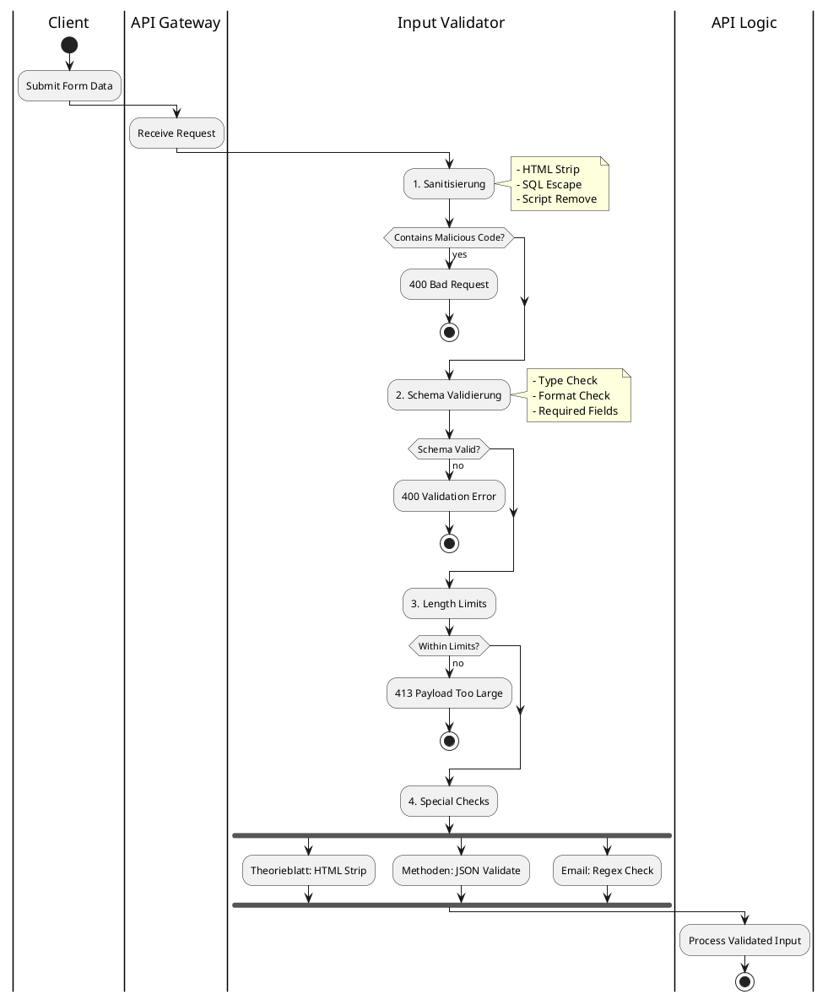

---

### 🔍 Validation Rules

| Input Type | Validation |
|------------|-----------|
| 📧 **Email** | Regex + DNS Check |
| 🔑 **Password** | Min 8, Upper, Lower, Number |
| 📝 **Theorieblatt** | HTML Sanitizer, MaxLength |
| 🎯 **Methoden** | JSON Schema Validation |
| 📁 **Filename** | Path Traversal Check |
| 🌐 **URL** | Whitelist + SSRF Check |

---

## 9. Dateiupload-Sicherheit

### 📤 File Upload Security Flow

```plantuml
@startuml
actor User
participant "Upload API" as api
participant "File Scanner" as scanner
participant "Storage" as storage
database "Database" as db

User -> api: Upload File
activate api

api -> api: Check File Size
alt Size > 50MB
  api --> User: 413 Too Large
  deactivate api
  stop
end

api -> api: Check MIME Type
alt Invalid Type
  api --> User: 400 Invalid File Type
  deactivate api
  stop
end

api -> scanner: Scan File (ClamAV)
activate scanner
scanner -> scanner: Virus Scan
scanner -> scanner: Malware Check

alt Threat Found
  scanner --> api: Threat Detected
  api --> User: 400 Malicious File
  deactivate scanner
  deactivate api
  stop
end

scanner --> api: Clean
deactivate scanner

api -> storage: Store in Quarantine
storage --> api: temp_path

api -> api: Generate Hash
api -> db: Save Metadata
db --> api: file_id

api --> User: {file_id, status: "processing"}
deactivate api

... Background Processing ...

api -> api: Parse Content
api -> storage: Move to Safe Storage
api -> db: Update status: "ready"
@enduml
```

---

### 🛡️ Upload Security Measures

| Maßnahme | Implementation |
|----------|---------------|
| 🦠 **Virenscan** | ClamAV Integration |
| 📄 **MIME Check** | Magic Bytes Validation |
| 📏 **Size Limit** | 50MB per File |
| 📦 **PDF Sandbox** | Isolated Processing |
| 🚫 **No Executables** | Extension Blacklist |
| 🔒 **Safe Storage** | Isolated Directory |
| 🤖 **KI Filtration** | Before User Access |

---

## 10. KI-Sicherheit

### 🤖 KI Security Architecture

```plantuml
@startuml
!include https://raw.githubusercontent.com/plantuml-stdlib/C4-PlantUML/master/C4_Component.puml

Container_Boundary(ki_security, "KI Security Layer") {
    Component(rate_limiter, "Rate Limiter", "Redis", "Per-User/Role Limits")
    Component(token_manager, "Token Manager", "PostgreSQL", "Token Pool Management")
    Component(abuse_detector, "Abuse Detector", "ML", "Anomaly Detection")
    Component(content_filter, "Content Filter", "Rules", "Harmful Content Check")
    Component(logger, "KI Logger", "PostgreSQL", "ki_requests Table")
}

Component(ki_api, "KI API", "Anthropic/OpenAI")

Rel(rate_limiter, token_manager, "Check Tokens")
Rel(token_manager, abuse_detector, "Monitor")
Rel(abuse_detector, content_filter, "Validate")
Rel(content_filter, ki_api, "Forward Request")
Rel(ki_api, logger, "Log Request/Response")

note right of abuse_detector
  Erkennt:
  - Extreme lange Prompts
  - Mass Generation
  - Harmful Content
  - Negative Prompting
  - Data Exfiltration
end note
@enduml
```

---

### 📊 KI Rate Limits pro Rolle

```plantuml
@startuml
card "Free User" {
  :❌ Keine KI-Features;
}

card "Premium User" {
  :✅ KI-Features;
  :Token Limit: 10,000/Monat;
  :Rate Limit: 2 req/min;
}

card "Creator" {
  :✅ Erweiterte KI-Features;
  :Token Limit: 50,000/Monat;
  :Rate Limit: 5 req/min;
}

card "School/Company" {
  :✅ KI-Features (Pool);
  :Shared Token Pool;
  :Rate Limit: 10 req/min;
}

card "Admin" {
  :✅ Unlimited KI;
  :System-Level Access;
  :Rate Limit: 20 req/min;
}

note bottom
  Token-basiertes
  Fair-Use System
end note
@enduml
```

---

### 🚨 KI Abuse Detection

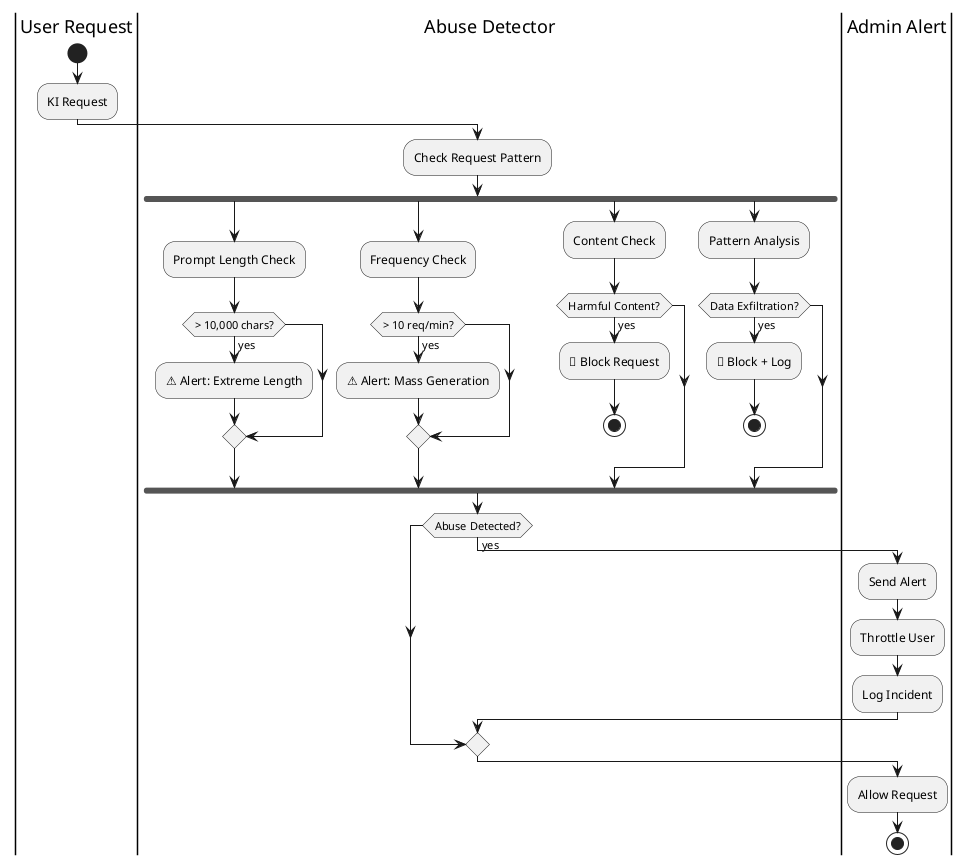

---

### 📝 KI Request Logging

Jede KI-Anfrage wird in `ki_requests` gespeichert:

```sql
CREATE TABLE ki_requests (
    ki_request_id UUID PRIMARY KEY,
    user_id UUID NOT NULL,
    role_id INTEGER NOT NULL,
    type VARCHAR(100),  -- 'module_gen', 'translation', etc.
    input_reference TEXT,  -- Hash of input
    output_reference TEXT,  -- Hash of output
    token_used INTEGER,
    model_used VARCHAR(100),
    status VARCHAR(50),
    created_at TIMESTAMP,
    
    -- Security Fields
    request_ip INET,
    user_agent TEXT,
    abuse_score INTEGER DEFAULT 0
);
```

---

## 11. Organisationen-Sicherheit

### 🏢 Organization Data Isolation

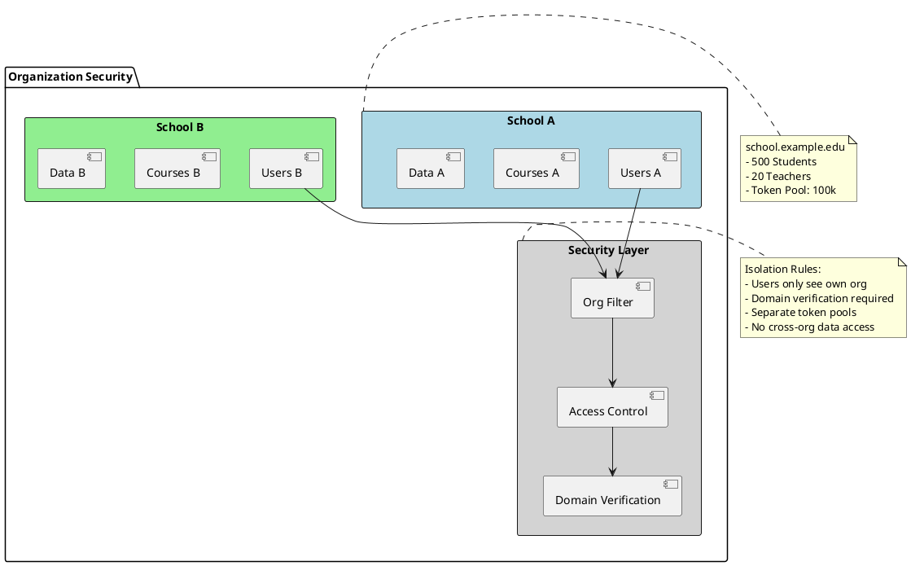

---

### 🔒 Organization Security Features

| Feature | Implementation |
|---------|---------------|
| 🔐 **Domain Verification** | CNAME Record Check |
| 👥 **User Isolation** | org_id Filter on ALL queries |
| 💰 **Token Pool** | Shared org_id pool |
| 🎓 **Teacher Rights** | Only within org |
| 📊 **Data Isolation** | Row-Level Security |
| 🚫 **Cross-Org Access** | Blocked by Middleware |

---

## 12. Creator-Schutz

### ✨ Creator Content Protection

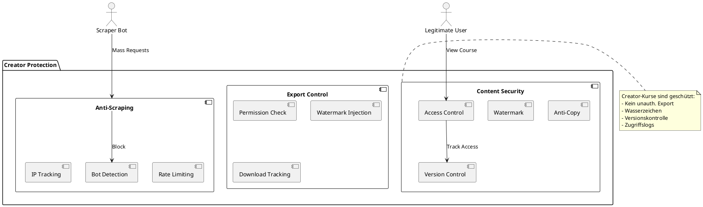

---

## 13. Community-Sicherheit

### 👥 Community Moderation System

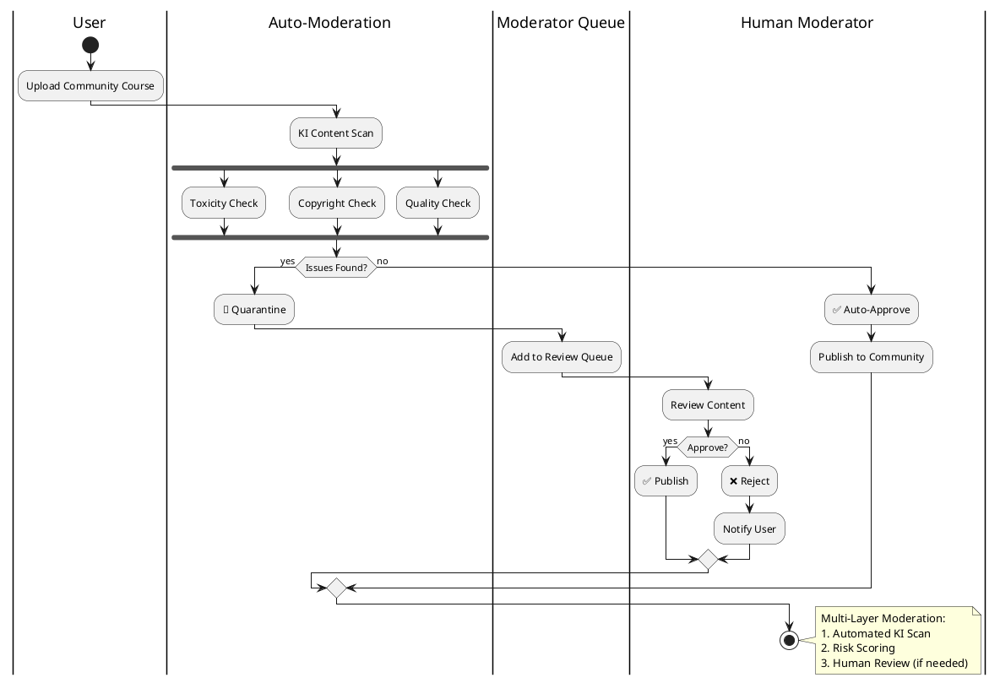

---

## 14. LiveRoom-Sicherheit

### 🎥 LiveRoom Security Model

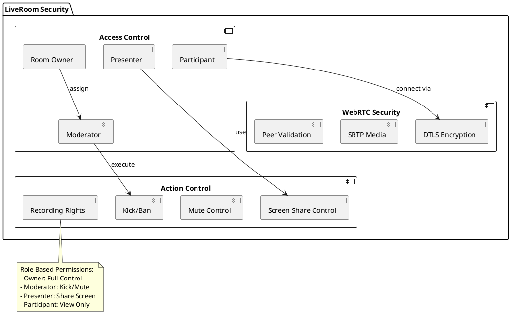

---

## 15. Logging & Monitoring

### 📝 Logging Architecture

```plantuml
@startuml
!include https://raw.githubusercontent.com/plantuml-stdlib/C4-PlantUML/master/C4_Container.puml

Container_Boundary(logging, "Logging System") {
    Container(system_log, "System Log", "PostgreSQL", "Auth, Errors, Changes")
    Container(audit_log, "Audit Log", "PostgreSQL", "Business Events")
    Container(security_log, "Security Log", "PostgreSQL", "Security Events")
    Container(ki_log, "KI Log", "PostgreSQL", "ki_requests Table")
}

Container_Boundary(monitoring, "Monitoring") {
    Container(alerting, "Alerting", "Email/Slack", "Real-time Alerts")
    Container(dashboard, "Admin Dashboard", "Vue.js", "Visualization")
    Container(analytics, "Analytics", "Python", "Pattern Detection")
}

Rel(system_log, dashboard, "Display")
Rel(audit_log, dashboard, "Display")
Rel(security_log, alerting, "Alert on Events")
Rel(ki_log, analytics, "Analyze Usage")

@enduml
```

---

### 📊 Log Categories

| Log Type | Events | Retention |
|----------|--------|-----------|
| 🔐 **System Log** | Logins, Errors, Config Changes | 90 days |
| 📝 **Audit Log** | Courses, Exams, LiveRooms | 1 year |
| 🚨 **Security Log** | Failed Logins, Abuse, Blocks | 2 years |
| 🤖 **KI Log** | All KI Requests | 1 year |

---

## 16. Rate Limits

### ⏱️ Rate Limiting Strategy

```plantuml
@startuml
package "Rate Limiting (Redis)" {
  map "Auth Endpoints" {
    /auth/login => 5/min
    /auth/register => 3/min
    /auth/refresh => 10/min
  }
  
  map "KI Endpoints" {
    /ki/generate => 2/min (premium)
    /ki/generate => 5/min (creator)
    /ki/analyze => 3/min
  }
  
  map "Content Endpoints" {
    POST /courses => 10/min
    PATCH /courses => 20/min
    POST /methods => 15/min
  }
  
  map "Upload Endpoints" {
    POST /upload => 5/10min
    POST /media => 10/hour
  }
}

note right
  Redis-based counters
  - Per User
  - Per IP
  - Sliding Window
end note
@enduml
```

---

## 17. Schutz vor bekannten Angriffen

### 🛡️ Attack Prevention Matrix

```plantuml
@startuml
@startmindmap
* Security Defenses
** SQL Injection
*** Parameterized Queries (psycopg3)
*** Prepared Statements
*** Input Validation
** XSS
*** HTML Sanitizer
*** Content-Security-Policy
*** Output Encoding
** CSRF
*** JWT Tokens
*** SameSite Cookies
*** CORS Policy
** SSRF
*** URL Whitelist
*** No Direct External Requests
*** Internal Network Isolation
** DOS
*** Rate Limiting
*** IP Blocking
*** CloudFlare
** Brute Force
*** Login Throttling
*** Account Lockout
*** CAPTCHA
** Session Hijacking
*** Token Rotation
*** Device Binding
*** HTTPS Only
@endmindmap
@enduml
```

---

### 🔒 Defense-in-Depth

```plantuml
@startuml
rectangle "Application Layer" #LightBlue {
  [Input Validation]
  [Output Encoding]
  [CSRF Protection]
}

rectangle "Authentication Layer" #LightGreen {
  [JWT Tokens]
  [Session Management]
  [MFA (Optional)]
}

rectangle "Network Layer" #LightYellow {
  [Rate Limiting]
  [IP Filtering]
  [DDoS Protection]
}

rectangle "Database Layer" #LightPink {
  [ORM Protection]
  [Encryption at Rest]
  [Access Control]
}

[Application Layer] -down-> [Authentication Layer]
[Authentication Layer] -down-> [Network Layer]
[Network Layer] -down-> [Database Layer]

note right
  Multiple Security Layers
  - Defense-in-Depth
  - Redundant Controls
  - Fail-Secure
end note
@enduml
```

---

## 18. Backups & Recovery

### 💾 Backup Strategy

```plantuml
@startuml
|Daily|
start
:Full Database Backup;
:Encrypt Backup;
:Upload to S3;

|Weekly|
:Full System Snapshot;
:Test Recovery;

|Monthly|
:Recovery Drill;
:Update DR Plan;

|Critical Updates|
:Pre-Update Snapshot;
:Deploy Update;
:Verify System;

if (Issues?) then (yes)
  :Rollback;
else (no)
  :Delete Old Snapshot;
endif

stop
@enduml
```

---

## 19. Zusammenfassung

### ✅ LSX Security Features

| Kategorie | Features |
|-----------|----------|
| 🔐 **Auth** | JWT, HTTP-only Cookies, Token Rotation |
| 👥 **Authorization** | RBAC, Ownership, Permissions |
| 🛡️ **Input Security** | Sanitization, Validation, Length Limits |
| 📤 **File Upload** | Virus Scan, MIME Check, Sandboxing |
| 🤖 **KI Security** | Rate Limits, Abuse Detection, Logging |
| 🏢 **Org Security** | Data Isolation, Domain Verification |
| ✨ **Creator Protection** | Anti-Copy, Watermarks, Version Control |
| 👥 **Community** | Auto-Moderation, Human Review |
| 🎥 **LiveRoom** | WebRTC Encryption, Role-based Access |
| 📝 **Logging** | System, Audit, Security, KI Logs |
| ⏱️ **Rate Limiting** | Redis-based, Per-Endpoint |
| 🛡️ **Attack Prevention** | SQL, XSS, CSRF, SSRF, DOS |

---

### 🎯 Security Architecture Overview

```
┌─────────────────────────────────────┐
│  🔒 Zero-Trust Architecture          │
│  ─────────────────────────────────   │
│  ✅ JWT Authentication                │
│  ✅ RBAC Authorization                │
│  ✅ Input Validation                  │
│  ✅ Rate Limiting                     │
│  ✅ Audit Logging                     │
│  ✅ Abuse Detection                   │
│  ✅ Data Isolation                    │
│  ✅ Encryption (Transit & Rest)       │
└─────────────────────────────────────┘
```

> **LSX erfüllt alle modernen IT-Sicherheitsanforderungen und ist DSGVO-konform.**

---

## 📌 Dokument abgeschlossen

**Version:** 1.0  
**Status:** Final  
**Letzte Aktualisierung:** November 2024

---

> 💡 **Hinweis:** Dieses Dokument ist Teil der LSX-Systemdokumentation und beschreibt die vollständige Sicherheitsarchitektur mit Zero-Trust-Ansatz, RBAC, KI-Schutz und umfassendem Monitoring.