# 19 – Sicherheit & Berechtigungen (Final)

**Version:** 1.0  
**Stand:** Final

---

## Überblick

Dieses Dokument definiert die komplette **Sicherheitsarchitektur** und alle **Berechtigungsmechanismen** des LSX Lernsystems.

Es enthält:
- 🔒 **Regeln & Modelle**
- 🔐 **Datenflüsse**
- 👥 **Rollenprüfungen**
- 🛡️ **Schutzmechanismen**
- 📝 **Logging & Monitoring**
- 🤖 **KI-spezifische Sicherheit**

---

## 1. Sicherheitsarchitektur (C4 Model)

### 🔒 Security System Context

```plantuml
@startuml
!include https://raw.githubusercontent.com/plantuml-stdlib/C4-PlantUML/master/C4_Container.puml

Person(user, "User", "Verschiedene Rollen")
Person(attacker, "Attacker", "Böswilliger Akteur")

System_Boundary(security, "Security System") {
    Container(auth, "Authentication", "JWT", "Token Management")
    Container(authz, "Authorization", "RBAC", "Permission Check")
    Container(rate_limit, "Rate Limiter", "Redis", "Request Throttling")
    Container(input_val, "Input Validator", "Sanitizer", "XSS/Injection Protection")
    Container(audit, "Audit Logger", "PostgreSQL", "Activity Tracking")
    Container(monitor, "Monitor", "Alerting", "Abuse Detection")
}

System_Boundary(app, "LSX Application") {
    Container(api, "API Endpoints", "Flask", "Business Logic")
    Container(ki, "KI Services", "Anthropic/OpenAI", "AI Processing")
}

Rel(user, auth, "Login", "HTTPS")
Rel(auth, authz, "Validate")
Rel(authz, rate_limit, "Check Limits")
Rel(rate_limit, input_val, "Validate Input")
Rel(input_val, api, "Process Request")

Rel(api, audit, "Log Action")
Rel(api, monitor, "Track Usage")
Rel(ki, monitor, "Track KI Usage")

Rel(attacker, auth, "Attack Attempt", "X")
Rel(attacker, rate_limit, "DOS Attempt", "X")
Rel(rate_limit, monitor, "Alert", "!")

note right of monitor
  Erkennt und blockt:
  - Brute Force
  - Rate Abuse
  - KI Abuse
  - Anomalien
end note

@enduml
```

---

## 2. Ziele der Sicherheitsarchitektur

### ✅ Sicherheitsziele

| Ziel | Umsetzung |
|------|-----------|
| 🔐 **Benutzerdaten** | Verschlüsselt, Isoliert |
| 🤖 **KI-Schutz** | Rate Limits, Logging |
| 🚫 **Missbrauch** | Detection & Prevention |
| 🔒 **Unauth. Zugriff** | Zero-Trust, RBAC |
| 👥 **Granulare Kontrolle** | Rollenbasiertes System |
| 📜 **DSGVO** | Compliant |
| 🛡️ **Injection/XSS** | Sanitization |
| 📝 **Auditierbarkeit** | Vollständiges Logging |
| 🏢 **Org-Schutz** | Datenisolierung |

---

## 3. Sicherheitsgrundlagen

### 🎯 Zero-Trust-Ansatz

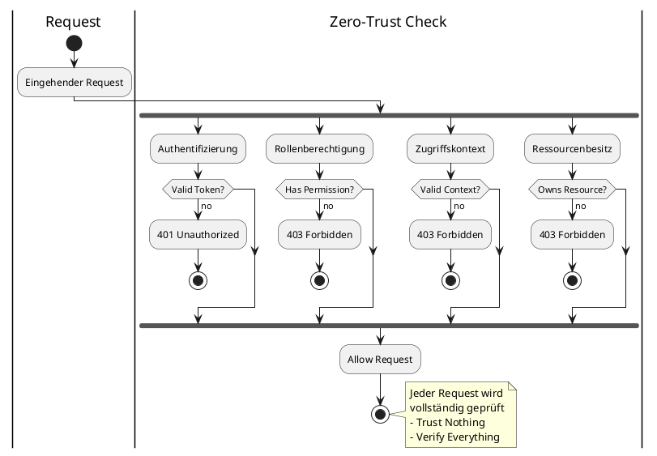

---

### 🔐 Least Privilege Principle

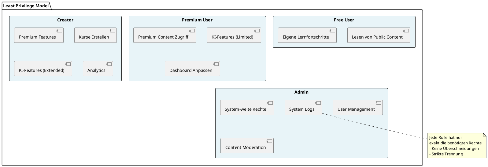

---

## 4. Authentifizierung

### 🔑 JWT Token System

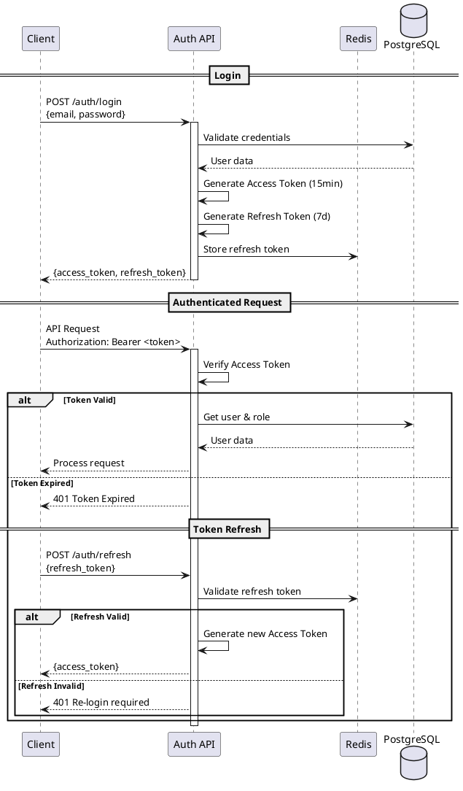

---

### 🍪 Token Storage Strategy

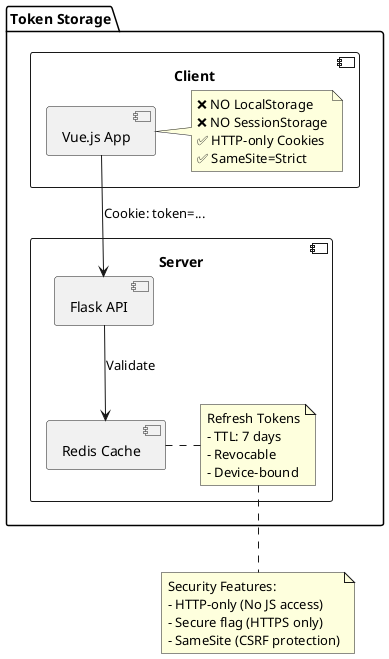

---

### 🔒 Session Hardening

| Feature | Implementation |
|---------|---------------|
| 🖥️ **Gerätebindung** | Device Fingerprint Hash |
| 🌍 **IP-Tracking** | IP Hash Verification |
| 🔍 **User-Agent** | Browser Fingerprint |
| 🔄 **Token Rotation** | Refresh on every use |
| 🚫 **Invalidation** | On role/password change |

---

## 5. Berechtigungsmodell (RBAC)

### 👥 Role-Based Access Control

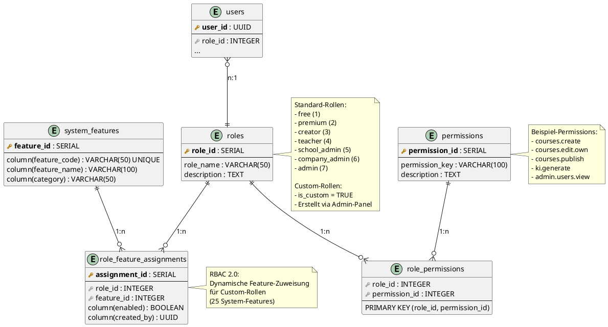

---

### 🎯 Permission Check Flow

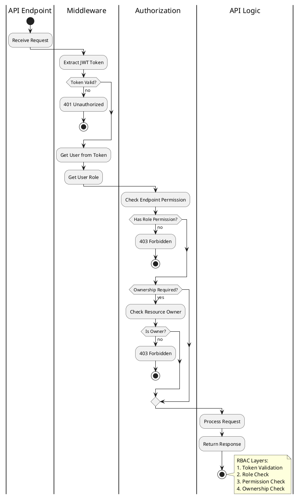

---

### 📋 Rollen-Matrix

| Rolle | Kurse Erstellen | KI Nutzen | Global Publish | Admin Panel |
|-------|-----------------|-----------|----------------|-------------|
| 🆓 **Free** | ❌ | ❌ | ❌ | ❌ |
| 💎 **Premium** | ✅ (privat) | ✅ (limit) | ❌ | ❌ |
| ✨ **Creator** | ✅ | ✅ (extended) | ✅ | ❌ |
| 👨‍🏫 **Teacher** | ✅ (Schule) | ✅ (pool) | ❌ | ❌ |
| 🏫 **School Admin** | ✅ | ✅ (pool) | ❌ | ⚠️ (Org) |
| 🏢 **Company Admin** | ✅ | ✅ (pool) | ❌ | ⚠️ (Org) |
| 👑 **Admin** | ✅ | ✅ (unlimited) | ✅ | ✅ |

---

### 👑 Owner-Admin & Custom Roles (RBAC 2.0)

**Status:** ✅ **IMPLEMENTIERT** (Migration 067, 068)

#### Owner-Admin System

Der **Owner-Admin** ist eine spezielle Admin-Rolle mit erweiterten Berechtigungen:

```sql
-- users table
ALTER TABLE users ADD COLUMN is_owner BOOLEAN DEFAULT FALSE;
CREATE UNIQUE INDEX idx_single_owner ON users(is_owner) WHERE is_owner = TRUE;
```

**Eigenschaften:**
- ✅ Nur **EIN** Owner-Admin möglich (Database Constraint)
- ✅ Wird automatisch beim **Setup Wizard** erstellt (erster Admin = Owner)
- ✅ Kann **Custom-Rollen** erstellen/bearbeiten/löschen
- ✅ Kann **Ownership übertragen** (an anderen Admin)
- ✅ Hat Zugriff auf **vollständige Audit-Logs**
- ✅ Kann **Compliance-Einstellungen** verwalten

**Owner-Admin Berechtigungen (Exklusiv):**
```python
OWNER_ADMIN_ONLY_PERMISSIONS = [
    'manage_roles',           # Create/Edit/Delete Custom-Rollen
    'manage_owner_transfer',  # Owner an anderen Admin übertragen
    'delete_system_data',     # System-Daten löschen
    'access_audit_logs',      # Vollständige Audit Logs
    'manage_compliance',      # Compliance-Einstellungen
    'emergency_access'        # Notfall-Zugriff auf alles
]
```

#### Custom Roles (Dynamisches Rollen-System)

**Zweck:** Owner-Admin kann neue Rollen über Admin-Panel erstellen und Features zuweisen.

**Datenbank-Schema:**

```sql
-- roles table (erweitert)
ALTER TABLE roles ADD COLUMN is_custom BOOLEAN DEFAULT FALSE;
ALTER TABLE roles ADD COLUMN created_by UUID REFERENCES users(user_id);
ALTER TABLE roles ADD COLUMN template_name VARCHAR(50);

-- role_feature_assignments (NEW)
CREATE TABLE core.role_feature_assignments (
    assignment_id SERIAL PRIMARY KEY,
    role_id INTEGER NOT NULL REFERENCES roles(role_id) ON DELETE CASCADE,
    feature_id INTEGER NOT NULL REFERENCES support_systems.system_features(feature_id) ON DELETE CASCADE,
    enabled BOOLEAN DEFAULT TRUE,
    created_at TIMESTAMP WITH TIME ZONE DEFAULT NOW(),
    created_by UUID REFERENCES users(user_id),
    UNIQUE(role_id, feature_id)
);
```

**Role Templates (Vordefiniert):**

| Template | Beschreibung | Features |
|----------|--------------|----------|
| 👪 **Parent** | Eltern-Rolle für Kinderkontrolle | Content-Freigabe, Activity-Monitoring |
| 🏢 **Enterprise Admin** | Unternehmens-Admin mit Bulk-Features | Bulk-Import, SSO-Config, Analytics |
| 🔍 **Auditor** | Compliance-Auditor | Audit-Logs, Export, Compliance-Reports |
| 📚 **Librarian** | Content-Kurator | Content-Moderation, Kategorien |
| 🎓 **Course Manager** | Kurs-Manager ohne Admin-Rechte | Course CRUD, Publishing |

**Feature-Zuweisung:**

Custom-Rollen können **System-Features** (25 Features) individuell zugewiesen bekommen:

```typescript
// Beispiel: Parent-Rolle erstellen
const parentRole = {
  role_name: 'parent',
  display_name: 'Parent',
  description: 'Elternkonto mit Kinderkontrolle',
  is_custom: true,
  created_by: owner_admin_id,

  // Zugewiesene Features:
  features: [
    'parental_controls',    // Kinderkontrolle
    'content_approval',     // Content-Freigabe
    'screen_time_mgmt',     // Bildschirmzeit
    'activity_reports'      // Activity-Reports
  ]
}
```

#### Admin-Panel: Role Management

**Endpoints (TODO):**
```
GET    /api/v1/admin/roles              # List all roles
POST   /api/v1/admin/roles              # Create custom role (Owner-Admin only)
PUT    /api/v1/admin/roles/{role_id}    # Update role (Owner-Admin only)
DELETE /api/v1/admin/roles/{role_id}    # Delete custom role (Owner-Admin only)

GET    /api/v1/admin/roles/{role_id}/permissions    # Get role permissions
POST   /api/v1/admin/roles/{role_id}/permissions    # Assign permissions

GET    /api/v1/admin/roles/templates    # Get role templates
POST   /api/v1/admin/roles/from-template # Create role from template
```

**Frontend-Komponenten (TODO):**
```
frontend/src/pages/admin/RoleManagement.vue
frontend/src/components/admin/roles/
├── RoleList.vue
├── RoleForm.vue
├── RolePermissionsMatrix.vue
├── RoleTemplateSelector.vue
└── RoleDeleteConfirm.vue
```

#### Permission-Middleware (Erweiterung)

**Backend-Check:**
```python
# backend/app/middleware/auth.py
@require_permission('manage_roles')  # ← Nur Owner-Admin
def create_custom_role():
    """Create custom role with feature assignments"""
    pass
```

**Frontend-Check:**
```typescript
// Frontend Permission Guard
const canManageRoles = computed(() => {
  return authStore.user?.is_owner === true
})
```

#### Aktueller Status

| Komponente | Status |
|------------|--------|
| Owner-Admin (users.is_owner) | ✅ Implementiert (Migration 067) |
| Unique Constraint (nur 1 Owner) | ✅ Implementiert (idx_single_owner) |
| Setup Wizard Owner Creation | ✅ Implementiert (admin_setup.py) |
| role_feature_assignments Table | ✅ Implementiert (Migration 068) |
| Custom Roles (roles.is_custom) | ✅ Schema vorhanden |
| Backend API (admin/roles.py) | 🟡 TODO |
| Frontend Admin-Panel | 🟡 TODO |
| Permission Middleware | 🟡 TODO |

**Nächste Schritte:**
1. Backend API für Rollen-Management implementieren
2. Frontend Admin-Panel für Custom-Rollen erstellen
3. Permission Middleware erweitern
4. Unit Tests für RBAC 2.0 schreiben

---

## 6. Ressourcen-Besitzmodell

### 🏢 Ownership Hierarchy

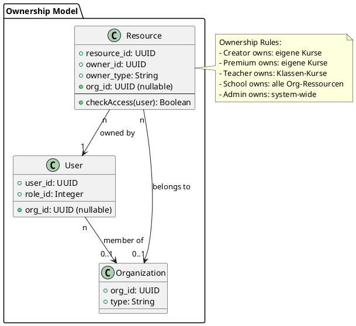

---

## 7. Endpunkt-Schutz

### 🔐 API Endpoint Security

```plantuml
@startuml
@startuml
map "POST /api/v1/courses" {
  requires_auth => true
  allowed_roles => ["creator", "teacher", "school_admin"]
  requires_ownership => false
  rate_limit => 10/min
}

map "PATCH /api/v1/courses/{id}" {
  requires_auth => true
  allowed_roles => ["creator", "teacher", "school_admin", "admin"]
  requires_ownership => true
  rate_limit => 20/min
}

map "POST /api/v1/ki/generate" {
  requires_auth => true
  allowed_roles => ["premium", "creator", "teacher"]
  requires_ownership => false
  rate_limit => 2/min
  token_check => true
}

map "GET /api/v1/admin/users" {
  requires_auth => true
  allowed_roles => ["admin"]
  requires_ownership => false
  rate_limit => 100/min
}

note right
  Alle Endpoints sind
  geschützt durch:
  - Authentication
  - Role Check
  - Ownership Check
  - Rate Limiting
end note
@enduml
@enduml
```

---

## 8. Input-Sicherheit

### 🛡️ Input Validation Pipeline

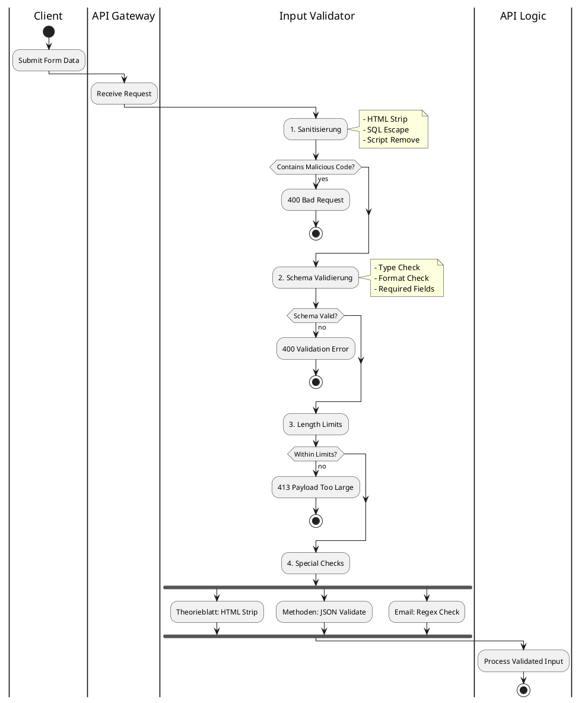

---

### 🔍 Validation Rules

| Input Type | Validation |
|------------|-----------|
| 📧 **Email** | Regex + DNS Check |
| 🔑 **Password** | Min 8, Upper, Lower, Number |
| 📝 **Theorieblatt** | HTML Sanitizer, MaxLength |
| 🎯 **Methoden** | JSON Schema Validation |
| 📁 **Filename** | Path Traversal Check |
| 🌐 **URL** | Whitelist + SSRF Check |

---

## 9. Dateiupload-Sicherheit

### 📤 File Upload Security Flow

```plantuml
@startuml
actor User
participant "Upload API" as api
participant "File Scanner" as scanner
participant "Storage" as storage
database "Database" as db

User -> api: Upload File
activate api

api -> api: Check File Size
alt Size > 50MB
  api --> User: 413 Too Large
  deactivate api
  stop
end

api -> api: Check MIME Type
alt Invalid Type
  api --> User: 400 Invalid File Type
  deactivate api
  stop
end

api -> scanner: Scan File (ClamAV)
activate scanner
scanner -> scanner: Virus Scan
scanner -> scanner: Malware Check

alt Threat Found
  scanner --> api: Threat Detected
  api --> User: 400 Malicious File
  deactivate scanner
  deactivate api
  stop
end

scanner --> api: Clean
deactivate scanner

api -> storage: Store in Quarantine
storage --> api: temp_path

api -> api: Generate Hash
api -> db: Save Metadata
db --> api: file_id

api --> User: {file_id, status: "processing"}
deactivate api

... Background Processing ...

api -> api: Parse Content
api -> storage: Move to Safe Storage
api -> db: Update status: "ready"
@enduml
```

---

### 🛡️ Upload Security Measures

| Maßnahme | Implementation |
|----------|---------------|
| 🦠 **Virenscan** | ClamAV Integration |
| 📄 **MIME Check** | Magic Bytes Validation |
| 📏 **Size Limit** | 50MB per File |
| 📦 **PDF Sandbox** | Isolated Processing |
| 🚫 **No Executables** | Extension Blacklist |
| 🔒 **Safe Storage** | Isolated Directory |
| 🤖 **KI Filtration** | Before User Access |

---

## 10. KI-Sicherheit

### 🤖 KI Security Architecture

```plantuml
@startuml
!include https://raw.githubusercontent.com/plantuml-stdlib/C4-PlantUML/master/C4_Component.puml

Container_Boundary(ki_security, "KI Security Layer") {
    Component(rate_limiter, "Rate Limiter", "Redis", "Per-User/Role Limits")
    Component(token_manager, "Token Manager", "PostgreSQL", "Token Pool Management")
    Component(abuse_detector, "Abuse Detector", "ML", "Anomaly Detection")
    Component(content_filter, "Content Filter", "Rules", "Harmful Content Check")
    Component(logger, "KI Logger", "PostgreSQL", "ki_requests Table")
}

Component(ki_api, "KI API", "Anthropic/OpenAI")

Rel(rate_limiter, token_manager, "Check Tokens")
Rel(token_manager, abuse_detector, "Monitor")
Rel(abuse_detector, content_filter, "Validate")
Rel(content_filter, ki_api, "Forward Request")
Rel(ki_api, logger, "Log Request/Response")

note right of abuse_detector
  Erkennt:
  - Extreme lange Prompts
  - Mass Generation
  - Harmful Content
  - Negative Prompting
  - Data Exfiltration
end note
@enduml
```

---

### 📊 KI Rate Limits pro Rolle

```plantuml
@startuml
card "Free User" {
  :❌ Keine KI-Features;
}

card "Premium User" {
  :✅ KI-Features;
  :Token Limit: 10,000/Monat;
  :Rate Limit: 2 req/min;
}

card "Creator" {
  :✅ Erweiterte KI-Features;
  :Token Limit: 50,000/Monat;
  :Rate Limit: 5 req/min;
}

card "School/Company" {
  :✅ KI-Features (Pool);
  :Shared Token Pool;
  :Rate Limit: 10 req/min;
}

card "Admin" {
  :✅ Unlimited KI;
  :System-Level Access;
  :Rate Limit: 20 req/min;
}

note bottom
  Token-basiertes
  Fair-Use System
end note
@enduml
```

---

### 🚨 KI Abuse Detection

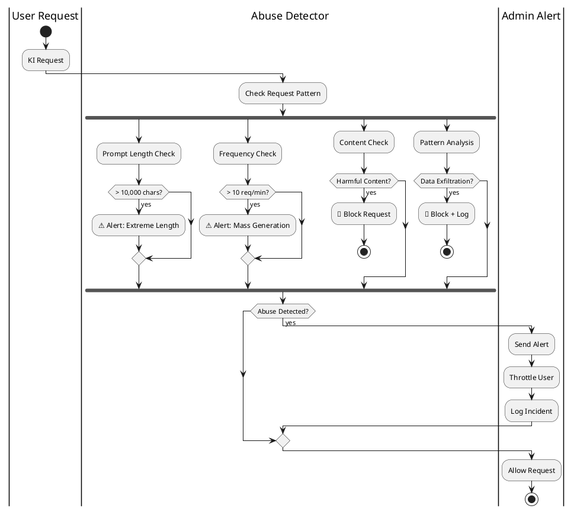

---

### 📝 KI Request Logging

Jede KI-Anfrage wird in `ki_requests` gespeichert:

```sql
CREATE TABLE ki_requests (
    ki_request_id UUID PRIMARY KEY,
    user_id UUID NOT NULL,
    role_id INTEGER NOT NULL,
    type VARCHAR(100),  -- 'module_gen', 'translation', etc.
    input_reference TEXT,  -- Hash of input
    output_reference TEXT,  -- Hash of output
    token_used INTEGER,
    model_used VARCHAR(100),
    status VARCHAR(50),
    created_at TIMESTAMP,
    
    -- Security Fields
    request_ip INET,
    user_agent TEXT,
    abuse_score INTEGER DEFAULT 0
);
```

---

## 11. Organisationen-Sicherheit

### 🏢 Organization Data Isolation

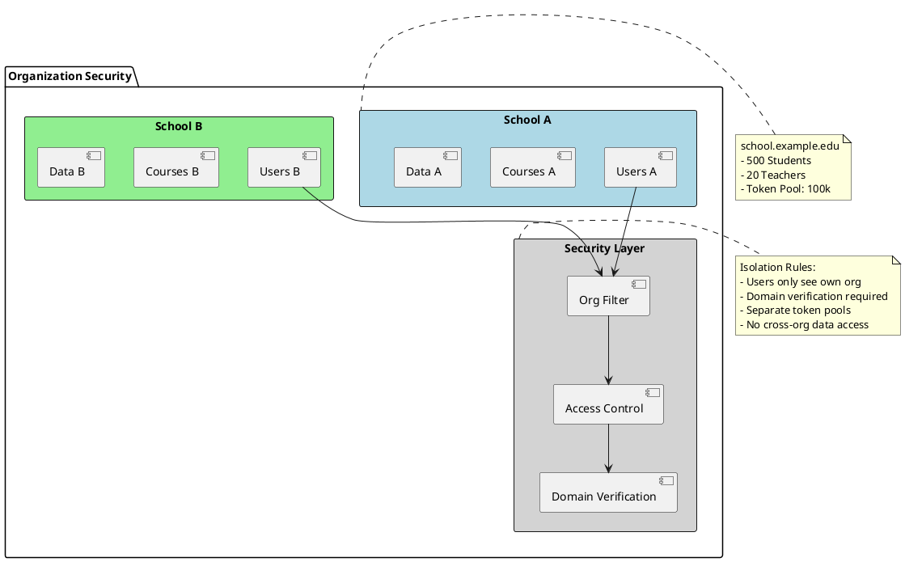

---

### 🔒 Organization Security Features

| Feature | Implementation |
|---------|---------------|
| 🔐 **Domain Verification** | CNAME Record Check |
| 👥 **User Isolation** | org_id Filter on ALL queries |
| 💰 **Token Pool** | Shared org_id pool |
| 🎓 **Teacher Rights** | Only within org |
| 📊 **Data Isolation** | Row-Level Security |
| 🚫 **Cross-Org Access** | Blocked by Middleware |

---

## 12. Creator-Schutz

### ✨ Creator Content Protection

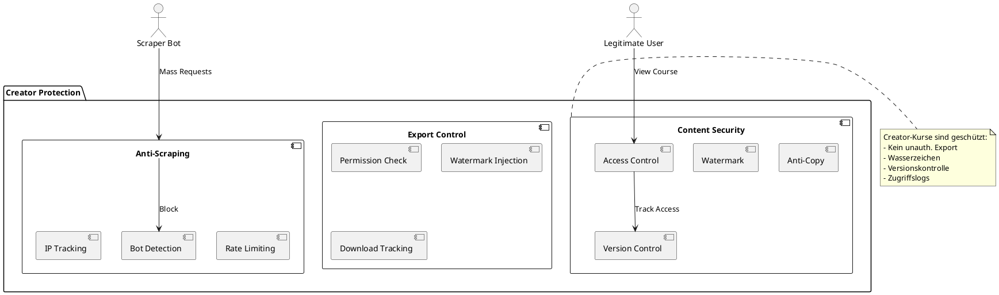

---

## 13. Community-Sicherheit

### 👥 Community Moderation System

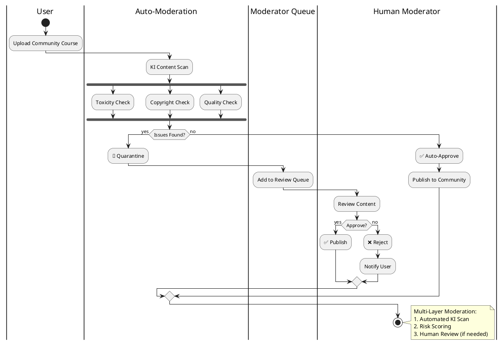

---

## 14. LiveRoom-Sicherheit

### 🎥 LiveRoom Security Model

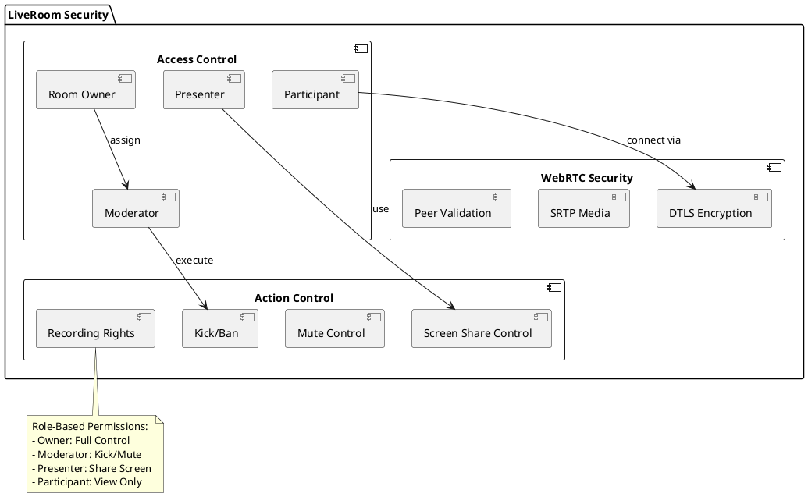

---

## 15. Logging & Monitoring

### 📝 Logging Architecture

```plantuml
@startuml
!include https://raw.githubusercontent.com/plantuml-stdlib/C4-PlantUML/master/C4_Container.puml

Container_Boundary(logging, "Logging System") {
    Container(system_log, "System Log", "PostgreSQL", "Auth, Errors, Changes")
    Container(audit_log, "Audit Log", "PostgreSQL", "Business Events")
    Container(security_log, "Security Log", "PostgreSQL", "Security Events")
    Container(ki_log, "KI Log", "PostgreSQL", "ki_requests Table")
}

Container_Boundary(monitoring, "Monitoring") {
    Container(alerting, "Alerting", "Email/Slack", "Real-time Alerts")
    Container(dashboard, "Admin Dashboard", "Vue.js", "Visualization")
    Container(analytics, "Analytics", "Python", "Pattern Detection")
}

Rel(system_log, dashboard, "Display")
Rel(audit_log, dashboard, "Display")
Rel(security_log, alerting, "Alert on Events")
Rel(ki_log, analytics, "Analyze Usage")

@enduml
```

---

### 📊 Log Categories

| Log Type | Events | Retention |
|----------|--------|-----------|
| 🔐 **System Log** | Logins, Errors, Config Changes | 90 days |
| 📝 **Audit Log** | Courses, Exams, LiveRooms | 1 year |
| 🚨 **Security Log** | Failed Logins, Abuse, Blocks | 2 years |
| 🤖 **KI Log** | All KI Requests | 1 year |

---

## 16. Rate Limits

### ⏱️ Rate Limiting Strategy

```plantuml
@startuml
package "Rate Limiting (Redis)" {
  map "Auth Endpoints" {
    /auth/login => 5/min
    /auth/register => 3/min
    /auth/refresh => 10/min
  }
  
  map "KI Endpoints" {
    /ki/generate => 2/min (premium)
    /ki/generate => 5/min (creator)
    /ki/analyze => 3/min
  }
  
  map "Content Endpoints" {
    POST /courses => 10/min
    PATCH /courses => 20/min
    POST /methods => 15/min
  }
  
  map "Upload Endpoints" {
    POST /upload => 5/10min
    POST /media => 10/hour
  }
}

note right
  Redis-based counters
  - Per User
  - Per IP
  - Sliding Window
end note
@enduml
```

---

## 17. Schutz vor bekannten Angriffen

### 🛡️ Attack Prevention Matrix

```plantuml
@startuml
@startmindmap
* Security Defenses
** SQL Injection
*** Parameterized Queries (psycopg3)
*** Prepared Statements
*** Input Validation
** XSS
*** HTML Sanitizer
*** Content-Security-Policy
*** Output Encoding
** CSRF
*** JWT Tokens
*** SameSite Cookies
*** CORS Policy
** SSRF
*** URL Whitelist
*** No Direct External Requests
*** Internal Network Isolation
** DOS
*** Rate Limiting
*** IP Blocking
*** CloudFlare
** Brute Force
*** Login Throttling
*** Account Lockout
*** CAPTCHA
** Session Hijacking
*** Token Rotation
*** Device Binding
*** HTTPS Only
@endmindmap
@enduml
```

---

### 🔒 Defense-in-Depth

```plantuml
@startuml
rectangle "Application Layer" #LightBlue {
  [Input Validation]
  [Output Encoding]
  [CSRF Protection]
}

rectangle "Authentication Layer" #LightGreen {
  [JWT Tokens]
  [Session Management]
  [MFA (Optional)]
}

rectangle "Network Layer" #LightYellow {
  [Rate Limiting]
  [IP Filtering]
  [DDoS Protection]
}

rectangle "Database Layer" #LightPink {
  [ORM Protection]
  [Encryption at Rest]
  [Access Control]
}

[Application Layer] -down-> [Authentication Layer]
[Authentication Layer] -down-> [Network Layer]
[Network Layer] -down-> [Database Layer]

note right
  Multiple Security Layers
  - Defense-in-Depth
  - Redundant Controls
  - Fail-Secure
end note
@enduml
```

---

## 18. Backups & Recovery

### 💾 Backup Strategy

```plantuml
@startuml
|Daily|
start
:Full Database Backup;
:Encrypt Backup;
:Upload to S3;

|Weekly|
:Full System Snapshot;
:Test Recovery;

|Monthly|
:Recovery Drill;
:Update DR Plan;

|Critical Updates|
:Pre-Update Snapshot;
:Deploy Update;
:Verify System;

if (Issues?) then (yes)
  :Rollback;
else (no)
  :Delete Old Snapshot;
endif

stop
@enduml
```

---

## 19. Zusammenfassung

### ✅ LSX Security Features

| Kategorie | Features |
|-----------|----------|
| 🔐 **Auth** | JWT, HTTP-only Cookies, Token Rotation |
| 👥 **Authorization** | RBAC, Ownership, Permissions |
| 🛡️ **Input Security** | Sanitization, Validation, Length Limits |
| 📤 **File Upload** | Virus Scan, MIME Check, Sandboxing |
| 🤖 **KI Security** | Rate Limits, Abuse Detection, Logging |
| 🏢 **Org Security** | Data Isolation, Domain Verification |
| ✨ **Creator Protection** | Anti-Copy, Watermarks, Version Control |
| 👥 **Community** | Auto-Moderation, Human Review |
| 🎥 **LiveRoom** | WebRTC Encryption, Role-based Access |
| 📝 **Logging** | System, Audit, Security, KI Logs |
| ⏱️ **Rate Limiting** | Redis-based, Per-Endpoint |
| 🛡️ **Attack Prevention** | SQL, XSS, CSRF, SSRF, DOS |

---

### 🎯 Security Architecture Overview

```
┌─────────────────────────────────────┐
│  🔒 Zero-Trust Architecture          │
│  ─────────────────────────────────   │
│  ✅ JWT Authentication                │
│  ✅ RBAC Authorization                │
│  ✅ Input Validation                  │
│  ✅ Rate Limiting                     │
│  ✅ Audit Logging                     │
│  ✅ Abuse Detection                   │
│  ✅ Data Isolation                    │
│  ✅ Encryption (Transit & Rest)       │
└─────────────────────────────────────┘
```

> **LSX erfüllt alle modernen IT-Sicherheitsanforderungen und ist DSGVO-konform.**

---

## 📌 Dokument abgeschlossen

**Version:** 1.0  
**Status:** Final  
**Letzte Aktualisierung:** November 2024

---

> 💡 **Hinweis:** Dieses Dokument ist Teil der LSX-Systemdokumentation und beschreibt die vollständige Sicherheitsarchitektur mit Zero-Trust-Ansatz, RBAC, KI-Schutz und umfassendem Monitoring.