# 06 – Premium-Modell (Final)

**Version:** 1.0
**Stand:** Final

---

## Überblick

Das LSX-Premium-Modell bietet Nutzern maximalen Lernnutzen durch Zugang zu allen 19 Content-Lernmethoden (Gruppen A-C), KI-gestützten Features und erweiterten Kollaborationsfunktionen. Es ist die zentrale Einnahmequelle der Plattform und muss klar definiert, fair, skalierbar, wertvoll und transparent gestaltet sein.

### 🎯 Premium-Positionierung

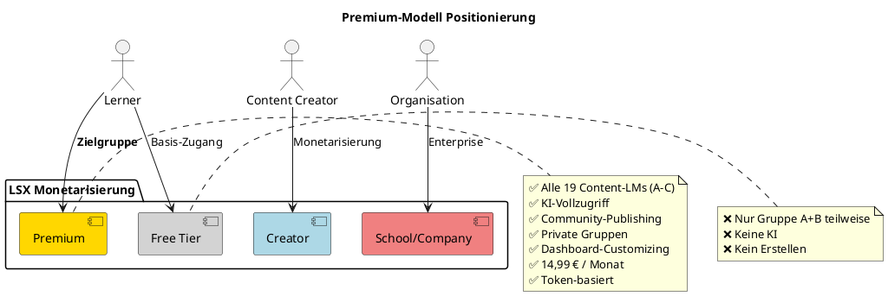
```plantuml
@startuml
title Premium-Modell Positionierung

package "LSX Monetarisierung" {
  [Free Tier] as free #LightGray
  [Premium] as premium #Gold
  [Creator] as creator #LightBlue
  [School/Company] as org #LightCoral
}

actor "Lerner" as learner
actor "Content Creator" as content_creator
actor "Organisation" as organisation

learner --> free : Basis-Zugang
learner --> premium : **Zielgruppe**
content_creator --> creator : Monetarisierung
organisation --> org : Enterprise

note right of premium
  ✅ Alle 19 Content-LMs (A-C)
  ✅ KI-Vollzugriff
  ✅ Community-Publishing
  ✅ Private Gruppen
  ✅ Dashboard-Customizing
  ✅ 14,99 € / Monat
  ✅ Token-basiert
end note

note left of free
  ❌ Nur Gruppe A+B teilweise
  ❌ Keine KI
  ❌ Kein Erstellen
end note

@enduml
```

---

## C4 Architektur

### Context Diagram

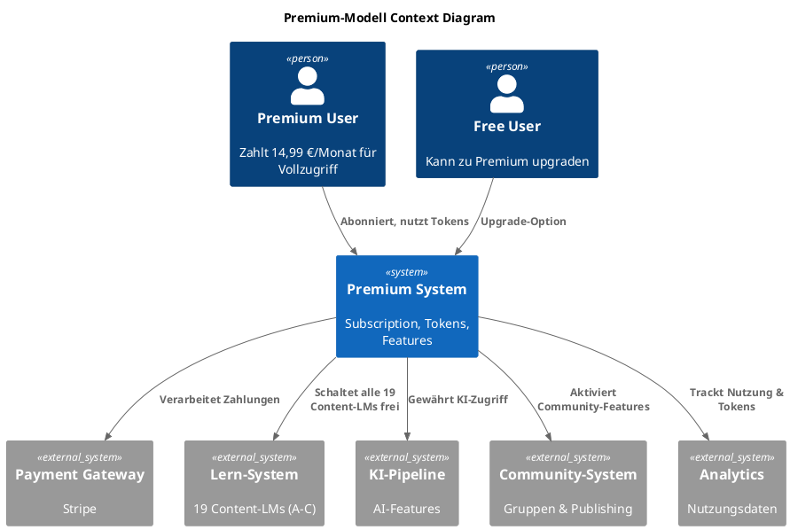
```plantuml
@startuml
!include <C4/C4_Context>

title Premium-Modell Context Diagram

Person(premium_user, "Premium User", "Zahlt 14,99 €/Monat für Vollzugriff")
Person(free_user, "Free User", "Kann zu Premium upgraden")

System(premium_system, "Premium System", "Subscription, Tokens, Features")

System_Ext(payment, "Payment Gateway", "Stripe")
System_Ext(learning, "Lern-System", "19 Content-LMs (A-C)")
System_Ext(ai_pipeline, "KI-Pipeline", "AI-Features")
System_Ext(community, "Community-System", "Gruppen & Publishing")
System_Ext(analytics, "Analytics", "Nutzungsdaten")

Rel(premium_user, premium_system, "Abonniert, nutzt Tokens")
Rel(free_user, premium_system, "Upgrade-Option")

Rel(premium_system, payment, "Verarbeitet Zahlungen")
Rel(premium_system, learning, "Schaltet alle 19 Content-LMs frei")
Rel(premium_system, ai_pipeline, "Gewährt KI-Zugriff")
Rel(premium_system, community, "Aktiviert Community-Features")
Rel(premium_system, analytics, "Trackt Nutzung & Tokens")

@enduml
```

### Container Diagram

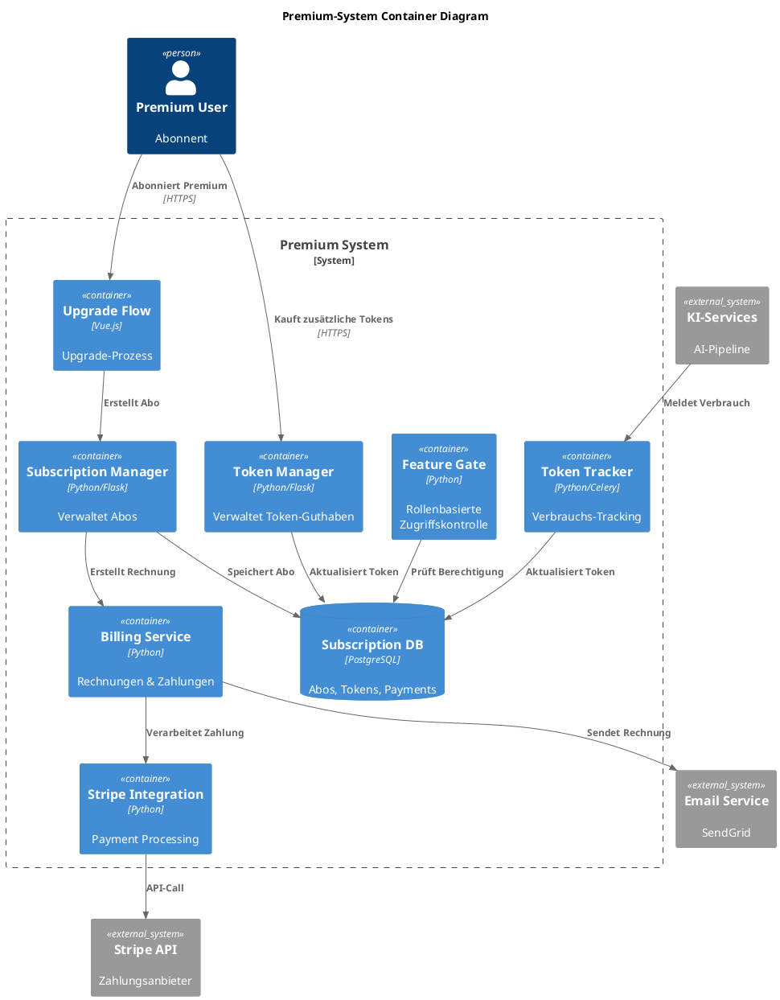
```plantuml
@startuml
!include <C4/C4_Container>

title Premium-System Container Diagram

Person(user, "Premium User", "Abonnent")

System_Boundary(premium, "Premium System") {
  Container(subscription_mgmt, "Subscription Manager", "Python/Flask", "Verwaltet Abos")
  Container(token_mgmt, "Token Manager", "Python/Flask", "Verwaltet Token-Guthaben")
  Container(feature_gate, "Feature Gate", "Python", "Rollenbasierte Zugriffskontrolle")
  Container(upgrade_flow, "Upgrade Flow", "Vue.js", "Upgrade-Prozess")
  Container(billing, "Billing Service", "Python", "Rechnungen & Zahlungen")

  ContainerDb(subscription_db, "Subscription DB", "PostgreSQL", "Abos, Tokens, Payments")
  Container(stripe_integration, "Stripe Integration", "Python", "Payment Processing")
  Container(token_tracker, "Token Tracker", "Python/Celery", "Verbrauchs-Tracking")
}

System_Ext(stripe, "Stripe API", "Zahlungsanbieter")
System_Ext(email, "Email Service", "SendGrid")
System_Ext(ai_services, "KI-Services", "AI-Pipeline")

Rel(user, upgrade_flow, "Abonniert Premium", "HTTPS")
Rel(user, token_mgmt, "Kauft zusätzliche Tokens", "HTTPS")

Rel(upgrade_flow, subscription_mgmt, "Erstellt Abo")
Rel(subscription_mgmt, billing, "Erstellt Rechnung")
Rel(billing, stripe_integration, "Verarbeitet Zahlung")
Rel(stripe_integration, stripe, "API-Call")

Rel(subscription_mgmt, subscription_db, "Speichert Abo")
Rel(token_mgmt, subscription_db, "Aktualisiert Token")
Rel(feature_gate, subscription_db, "Prüft Berechtigung")

Rel(ai_services, token_tracker, "Meldet Verbrauch")
Rel(token_tracker, subscription_db, "Aktualisiert Token")

Rel(billing, email, "Sendet Rechnung")

@enduml
```

---

## Datenbankschema

### ER-Diagram: Premium & Subscription

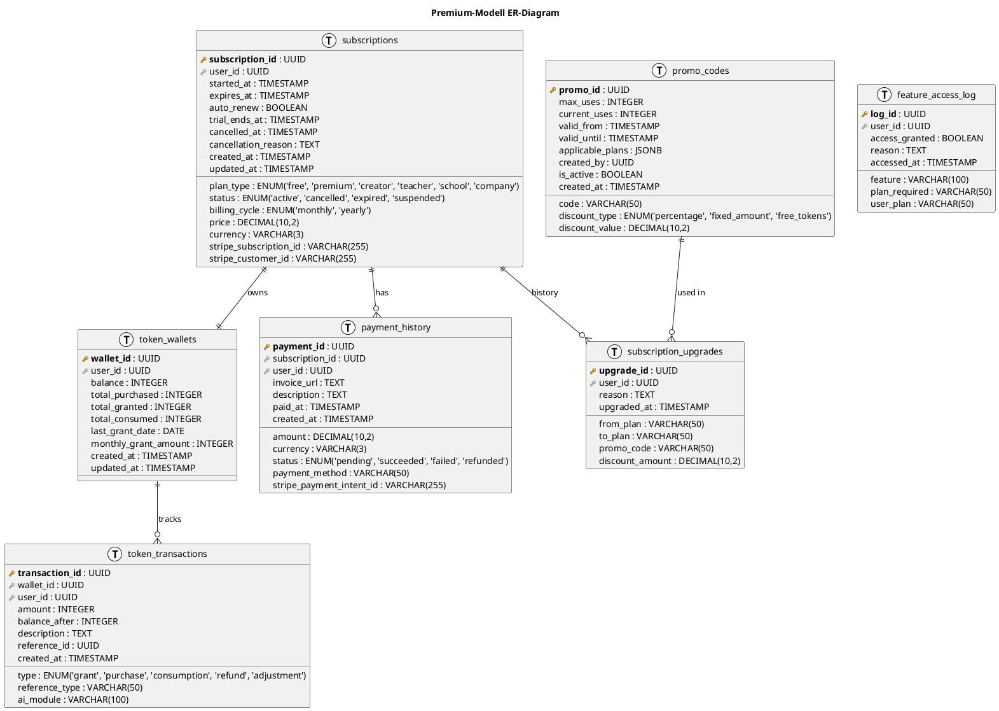
```plantuml
@startuml
!define primary_key(x) <b><color:#b8861b><&key></color> x</b>
!define foreign_key(x) <color:#aaaaaa><&key></color> x
!define column(x) <color:#efefef><&media-record></color> x
!define table(x) entity x << (T, white) >>

title Premium-Modell ER-Diagram

table(subscriptions) {
  primary_key(subscription_id) : UUID
  foreign_key(user_id) : UUID
  column(plan_type) : ENUM('free', 'premium', 'creator', 'teacher', 'school', 'company')
  column(status) : ENUM('active', 'cancelled', 'expired', 'suspended')
  column(started_at) : TIMESTAMP
  column(expires_at) : TIMESTAMP
  column(auto_renew) : BOOLEAN
  column(billing_cycle) : ENUM('monthly', 'yearly')
  column(price) : DECIMAL(10,2)
  column(currency) : VARCHAR(3)
  column(stripe_subscription_id) : VARCHAR(255)
  column(stripe_customer_id) : VARCHAR(255)
  column(trial_ends_at) : TIMESTAMP
  column(cancelled_at) : TIMESTAMP
  column(cancellation_reason) : TEXT
  column(created_at) : TIMESTAMP
  column(updated_at) : TIMESTAMP
}

table(token_wallets) {
  primary_key(wallet_id) : UUID
  foreign_key(user_id) : UUID
  column(balance) : INTEGER
  column(total_purchased) : INTEGER
  column(total_granted) : INTEGER
  column(total_consumed) : INTEGER
  column(last_grant_date) : DATE
  column(monthly_grant_amount) : INTEGER
  column(created_at) : TIMESTAMP
  column(updated_at) : TIMESTAMP
}

table(token_transactions) {
  primary_key(transaction_id) : UUID
  foreign_key(wallet_id) : UUID
  foreign_key(user_id) : UUID
  column(type) : ENUM('grant', 'purchase', 'consumption', 'refund', 'adjustment')
  column(amount) : INTEGER
  column(balance_after) : INTEGER
  column(description) : TEXT
  column(reference_type) : VARCHAR(50)
  column(reference_id) : UUID
  column(ai_module) : VARCHAR(100)
  column(created_at) : TIMESTAMP
}

table(payment_history) {
  primary_key(payment_id) : UUID
  foreign_key(subscription_id) : UUID
  foreign_key(user_id) : UUID
  column(amount) : DECIMAL(10,2)
  column(currency) : VARCHAR(3)
  column(status) : ENUM('pending', 'succeeded', 'failed', 'refunded')
  column(payment_method) : VARCHAR(50)
  column(stripe_payment_intent_id) : VARCHAR(255)
  column(invoice_url) : TEXT
  column(description) : TEXT
  column(paid_at) : TIMESTAMP
  column(created_at) : TIMESTAMP
}

table(subscription_upgrades) {
  primary_key(upgrade_id) : UUID
  foreign_key(user_id) : UUID
  column(from_plan) : VARCHAR(50)
  column(to_plan) : VARCHAR(50)
  column(reason) : TEXT
  column(promo_code) : VARCHAR(50)
  column(discount_amount) : DECIMAL(10,2)
  column(upgraded_at) : TIMESTAMP
}

table(promo_codes) {
  primary_key(promo_id) : UUID
  column(code) : VARCHAR(50)
  column(discount_type) : ENUM('percentage', 'fixed_amount', 'free_tokens')
  column(discount_value) : DECIMAL(10,2)
  column(max_uses) : INTEGER
  column(current_uses) : INTEGER
  column(valid_from) : TIMESTAMP
  column(valid_until) : TIMESTAMP
  column(applicable_plans) : JSONB
  column(created_by) : UUID
  column(is_active) : BOOLEAN
  column(created_at) : TIMESTAMP
}

table(feature_access_log) {
  primary_key(log_id) : UUID
  foreign_key(user_id) : UUID
  column(feature) : VARCHAR(100)
  column(access_granted) : BOOLEAN
  column(reason) : TEXT
  column(plan_required) : VARCHAR(50)
  column(user_plan) : VARCHAR(50)
  column(accessed_at) : TIMESTAMP
}

' Relationships
subscriptions ||--o{ payment_history : "has"
subscriptions ||--|| token_wallets : "owns"

token_wallets ||--o{ token_transactions : "tracks"

subscriptions ||--o{ subscription_upgrades : "history"

promo_codes ||--o{ subscription_upgrades : "used in"

@enduml
```

---

## 1. Zielgruppe des Premium-Modells

### Zielgruppen-Segmentierung

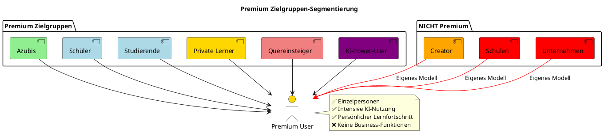
```plantuml
@startuml
title Premium Zielgruppen-Segmentierung

package "Premium Zielgruppen" {
  [Azubis] as azubi #LightGreen
  [Schüler] as schueler #LightBlue
  [Studierende] as studenten #LightBlue
  [Private Lerner] as private #Gold
  [Quereinsteiger] as quer #LightCoral
  [KI-Power-User] as ki_user #Purple
}

package "NICHT Premium" {
  [Creator] as creator #Orange
  [Schulen] as school #Red
  [Unternehmen] as company #Red
}

actor "Premium User" as premium #Gold

azubi --> premium
schueler --> premium
studenten --> premium
private --> premium
quer --> premium
ki_user --> premium

creator -[#red]-> premium : Eigenes Modell
school -[#red]-> premium : Eigenes Modell
company -[#red]-> premium : Eigenes Modell

note right of premium
  ✅ Einzelpersonen
  ✅ Intensive KI-Nutzung
  ✅ Persönlicher Lernfortschritt
  ❌ Keine Business-Funktionen
end note

@enduml
```

### Zielgruppen-Tabelle

| Zielgruppe | Motivation | Hauptnutzen | Typischer Use-Case |
|------------|------------|-------------|---------------------|
| **Azubis** | IHK-Prüfungsvorbereitung | Alle 19 Content-LMs, KI-Prüfungssimulation | FIAE, FISI, Kaufmännische Berufe |
| **Schüler** | Abitur, MSA, Grundschule | KI-Erklärungen, Spaced Repetition | Mathe, Deutsch, Englisch |
| **Studierende** | Prüfungsvorbereitung | Case Studies, Mind Maps, Whiteboard | BWL, IT, Ingenieurwesen |
| **Private Lerner** | Persönliche Weiterbildung | Flexibilität, Community-Kurse | Sprachen, Hobbies, IT-Skills |
| **Quereinsteiger** | Karrierewechsel | Alle Content-LMs, KI-Support | IT-Umschulung, neue Branchen |
| **KI-Power-User** | Maximale KI-Nutzung | Token-basierte KI, alle AI-Features | Content-Erstellung, Analyse |

---

## 2. Premium-Funktionen (Detailliert)

### Feature-Übersicht

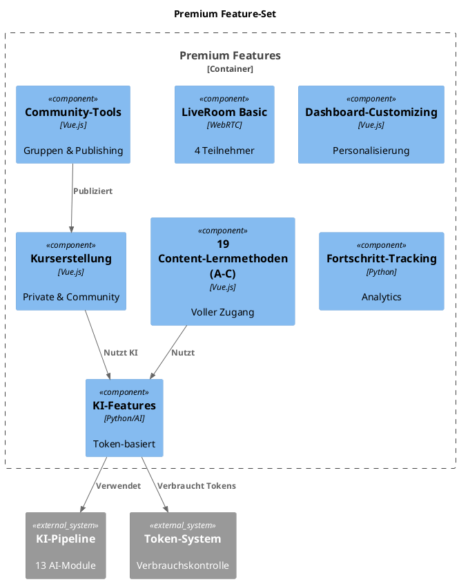
```plantuml
@startuml
!include <C4/C4_Component>

title Premium Feature-Set

Container_Boundary(premium_features, "Premium Features") {
  Component(learning_methods, "19 Content-Lernmethoden (A-C)", "Vue.js", "Voller Zugang")
  Component(ai_features, "KI-Features", "Python/AI", "Token-basiert")
  Component(course_creation, "Kurserstellung", "Vue.js", "Private & Community")
  Component(community, "Community-Tools", "Vue.js", "Gruppen & Publishing")
  Component(liveroom, "LiveRoom Basic", "WebRTC", "4 Teilnehmer")
  Component(dashboard, "Dashboard-Customizing", "Vue.js", "Personalisierung")
  Component(progress_tracking, "Fortschritt-Tracking", "Python", "Analytics")
}

System_Ext(ai_pipeline, "KI-Pipeline", "13 AI-Module")
System_Ext(token_system, "Token-System", "Verbrauchskontrolle")

Rel(learning_methods, ai_features, "Nutzt")
Rel(ai_features, ai_pipeline, "Verwendet")
Rel(ai_features, token_system, "Verbraucht Tokens")
Rel(course_creation, ai_features, "Nutzt KI")
Rel(community, course_creation, "Publiziert")

@enduml
```

### 🔵 Lernfunktionen

| Feature | Beschreibung | Free | Premium |
|---------|--------------|------|---------|
| **Gruppe A (LM00–LM07)** | Erklärende Methoden (Text, Video, etc.) | ✅ Teilweise | ✅ |
| **Gruppe B (LM08–LM17)** | Praxis/Übung (Flashcards, MCQ, etc.) | ✅ Teilweise | ✅ |
| **Gruppe C (LM18–LM25)** | Prüfungsorientiert (Spaced Repetition, etc.) | ❌ | ✅ |
| **Gruppe D (LM26–LM31)** | Pro/Gamification (Case Studies, etc.) | ❌ | ✅ Konsumieren |
| **KI-Erklärungen** | Begriffe erklärt durch KI | ❌ | ✅ |
| **KI-Quiz-Generator** | Automatische Quiz-Generierung | ❌ | ✅ |
| **KI-Zusammenfassungen** | Modul-Zusammenfassungen | ❌ | ✅ |
| **KI-Textverbesserungen** | Eigene Texte optimieren lassen | ❌ | ✅ |
| **Persönliche Lernpfade** | Adaptive Lernempfehlungen | ❌ | ✅ |

### 🔵 Kursfunktionen

| Feature | Beschreibung | Free | Premium | Creator |
|---------|--------------|------|---------|---------|
| **Private Kurse erstellen** | Nur für eigene Nutzung | ❌ | ✅ | ✅ |
| **Community-Kurse (kostenlos)** | Veröffentlichen ohne Monetarisierung | ❌ | ✅ | ✅ |
| **Marketplace-Kurse (bezahlt)** | Verkaufen von Kursen | ❌ | ❌ | ✅ |
| **KI-Kursgenerierung** | Kurse mit KI erstellen | ❌ | ✅ | ✅ |
| **KI-Modul-Generierung** | Module automatisch erstellen | ❌ | ✅ | ✅ |
| **Theorie-Blätter (KI)** | Automatisch generiert | ❌ | ✅ | ✅ |
| **Gruppe D-Methoden erstellen** | Case Studies, Role Play, etc. erstellen | ❌ | ❌ | ✅ |
| **Global Publishing (20 Sprachen)** | Mehrsprachige Veröffentlichung | ❌ | ❌ | ✅ |
| **Creator-Analytics** | Detaillierte Kursstatistiken | ❌ | ❌ | ✅ |

### 🔵 Community-Features

| Feature | Beschreibung | Free | Premium |
|---------|--------------|------|---------|
| **Community durchsuchen** | Kurse finden | ✅ | ✅ |
| **Community-Kurse ansehen** | Nur Basis-Methoden | ✅ | ✅ Alle |
| **Community-Kurse veröffentlichen** | Kostenlose Kurse teilen | ❌ | ✅ |
| **Private Gruppen erstellen** | Study Groups | ❌ | ✅ |
| **Gruppenmitglieder einladen** | Free User einladen | ❌ | ✅ |
| **Whiteboard Basic** | In Gruppen | ❌ | ✅ |
| **Datei-Sharing** | In Gruppen (50MB) | ❌ | ✅ |

### 🔵 LiveRoom Basic

| Feature | Free | Premium | Lehrer (Pro) |
|---------|------|---------|--------------|
| **Teilnehmer-Anzahl** | ❌ | 4 | Unbegrenzt |
| **Whiteboard** | ❌ | Basic | Pro (KI) |
| **Chat** | ❌ | ✅ | ✅ |
| **Bildschirmfreigabe** | ❌ | Einfach | Erweitert |
| **Aufzeichnung** | ❌ | ❌ | ✅ |
| **Breakout-Rooms** | ❌ | ❌ | ✅ |

### 🔵 Dashboard-Customizing

| Feature | Free | Premium |
|---------|------|---------|
| **Widgets anpassen** | ❌ | ✅ |
| **Themes wechseln** | ❌ | ✅ |
| **Fokus-Modus** | ❌ | ✅ |
| **ADHD-Modus** | ❌ | ✅ |
| **Fortschritt-Tracking** | Basic | Advanced |
| **Eigene Ansicht speichern** | ❌ | ✅ |

---

## 3. Einschränkungen von Premium

### Was Premium NICHT darf

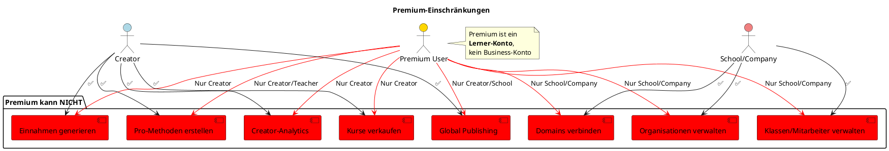
```plantuml
@startuml
title Premium-Einschränkungen

package "Premium kann NICHT" {
  [Kurse verkaufen] as sell #Red
  [Global Publishing] as global #Red
  [Pro-Methoden erstellen] as pro_create #Red
  [Organisationen verwalten] as org #Red
  [Domains verbinden] as domain #Red
  [Klassen/Mitarbeiter verwalten] as admin #Red
  [Creator-Analytics] as analytics #Red
  [Einnahmen generieren] as revenue #Red
}

actor "Premium User" as premium #Gold
actor "Creator" as creator #LightBlue
actor "School/Company" as school #LightCoral

premium -[#red]-> sell : Nur Creator
premium -[#red]-> global : Nur Creator/School
premium -[#red]-> pro_create : Nur Creator/Teacher
premium -[#red]-> org : Nur School/Company
premium -[#red]-> domain : Nur School/Company
premium -[#red]-> admin : Nur School/Company
premium -[#red]-> analytics : Nur Creator
premium -[#red]-> revenue : Nur Creator

creator --> sell : ✅
creator --> global : ✅
creator --> pro_create : ✅
creator --> analytics : ✅
creator --> revenue : ✅

school --> org : ✅
school --> domain : ✅
school --> admin : ✅

note right of premium
  Premium ist ein
  **Lerner-Konto**,
  kein Business-Konto
end note

@enduml
```

---

## 4. Premium vs. Free (Detaillierter Vergleich)

### Funktionsvergleich

| Funktion | Free | Premium | Vorteil Premium |
|----------|------|---------|-----------------|
| **Lernmethoden** | Gruppe A+B teilweise | Alle 19 (A-C) | +Gruppe C komplett |
| **KI-Funktionen** | ❌ Keine | ✅ Vollzugriff | Unbegrenzte KI-Nutzung (token-basiert) |
| **Eigene Kurse** | ❌ Keine | ✅ Private & Community | Content-Erstellung |
| **Private Gruppen** | ❌ Keine | ✅ Erstellen | Kollaboration |
| **Dashboard** | Standard | ✅ Customizing | Personalisierung |
| **LiveRoom** | ❌ Keine | ✅ Basic (4 Teilnehmer) | Echtzeit-Lernen |
| **Theory-Enhancement** | ❌ Keine | ✅ KI-optimiert | Bessere Inhalte |
| **KI-Prüfungssimulation** | ❌ Keine | ✅ Konsumieren | Prüfungsvorbereitung |
| **Spaced Repetition** | ❌ Keine | ✅ KI-gesteuert | Langfristiges Lernen |
| **Mind Maps** | ❌ Keine | ✅ KI-generiert | Visuelle Lernhilfen |
| **Whiteboard-KI** | ❌ Keine | ✅ Konsumieren | Interaktives Lernen |
| **Global Publishing** | ❌ Keine | ❌ Keine | N/A |
| **Kurse verkaufen** | ❌ Keine | ❌ Keine | N/A |

### Upgrade-Motivation

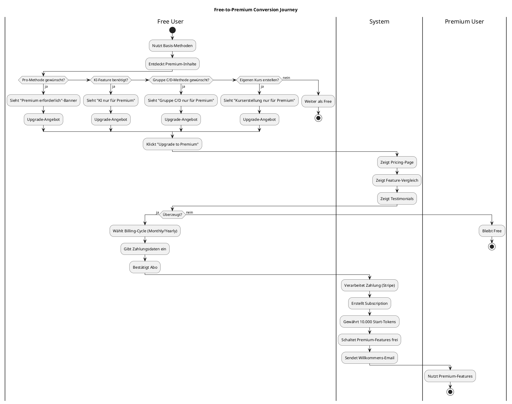
```plantuml
@startuml
title Free-to-Premium Conversion Journey

|Free User|
start
:Nutzt Basis-Methoden;
:Entdeckt Premium-Inhalte;

if (Pro-Methode gewünscht?) then (ja)
  :Sieht "Premium erforderlich"-Banner;
  :Upgrade-Angebot;
else if (KI-Feature benötigt?) then (ja)
  :Sieht "KI nur für Premium";
  :Upgrade-Angebot;
else if (Gruppe C/D-Methode gewünscht?) then (ja)
  :Sieht "Gruppe C/D nur für Premium";
  :Upgrade-Angebot;
else if (Eigenen Kurs erstellen?) then (ja)
  :Sieht "Kurserstellung nur für Premium";
  :Upgrade-Angebot;
else (nein)
  :Weiter als Free;
  stop
endif

:Klickt "Upgrade to Premium";

|System|
:Zeigt Pricing-Page;
:Zeigt Feature-Vergleich;
:Zeigt Testimonials;

|Free User|
if (Überzeugt?) then (ja)
  :Wählt Billing-Cycle (Monthly/Yearly);
  :Gibt Zahlungsdaten ein;
  :Bestätigt Abo;

  |System|
  :Verarbeitet Zahlung (Stripe);
  :Erstellt Subscription;
  :Gewährt 10.000 Start-Tokens;
  :Schaltet Premium-Features frei;
  :Sendet Willkommens-Email;

  |Premium User|
  :Nutzt Premium-Features;
  stop
else (nein)
  :Bleibt Free;
  stop
endif

@enduml
```

---

## 5. Token-System für Premium

### Token-Ökonomie

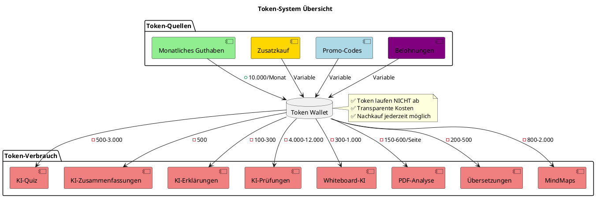
```plantuml
@startuml
title Token-System Übersicht

package "Token-Quellen" {
  [Monatliches Guthaben] as monthly #LightGreen
  [Zusatzkauf] as purchase #Gold
  [Promo-Codes] as promo #LightBlue
  [Belohnungen] as rewards #Purple
}

package "Token-Verbrauch" {
  [KI-Quiz] as quiz #LightCoral
  [KI-Zusammenfassungen] as summary #LightCoral
  [KI-Erklärungen] as explain #LightCoral
  [KI-Prüfungen] as exam #LightCoral
  [Whiteboard-KI] as whiteboard #LightCoral
  [PDF-Analyse] as pdf #LightCoral
  [Übersetzungen] as translate #LightCoral
  [MindMaps] as mindmap #LightCoral
}

database "Token Wallet" as wallet

monthly --> wallet : +10.000/Monat
purchase --> wallet : Variable
promo --> wallet : Variable
rewards --> wallet : Variable

wallet --> quiz : -500-3.000
wallet --> summary : -500
wallet --> explain : -100-300
wallet --> exam : -4.000-12.000
wallet --> whiteboard : -300-1.000
wallet --> pdf : -150-600/Seite
wallet --> translate : -200-500
wallet --> mindmap : -800-2.000

note right of wallet
  ✅ Token laufen NICHT ab
  ✅ Transparente Kosten
  ✅ Nachkauf jederzeit möglich
end note

@enduml
```

### Token-Preise (Beispiele)

| Aktion | Token-Verbrauch | Typische Nutzung | Tokens/Monat |
|--------|-----------------|------------------|--------------|
| **Modul-Zusammenfassung** | 500 | 10x | 5.000 |
| **Theorieblatt-KI-Verbesserung** | 800 | 5x | 4.000 |
| **Quiz-Generierung (klein)** | 1.000 | 8x | 8.000 |
| **Quiz-Generierung (groß)** | 3.000 | 2x | 6.000 |
| **PDF-Import (10 Seiten)** | 1.500-6.000 | 3x | 4.500-18.000 |
| **Whiteboard-KI (einfach)** | 300 | 10x | 3.000 |
| **Whiteboard-KI (komplex)** | 1.000 | 3x | 3.000 |
| **Prüfungssimulation (IHK)** | 8.000 | 1x | 8.000 |
| **KI-Erklärung** | 100-300 | 50x | 5.000-15.000 |
| **MindMap-Generierung** | 800-2.000 | 4x | 3.200-8.000 |

**Typischer Verbrauch:** 10.000-20.000 Tokens/Monat für aktive User

### Token-Verwaltung

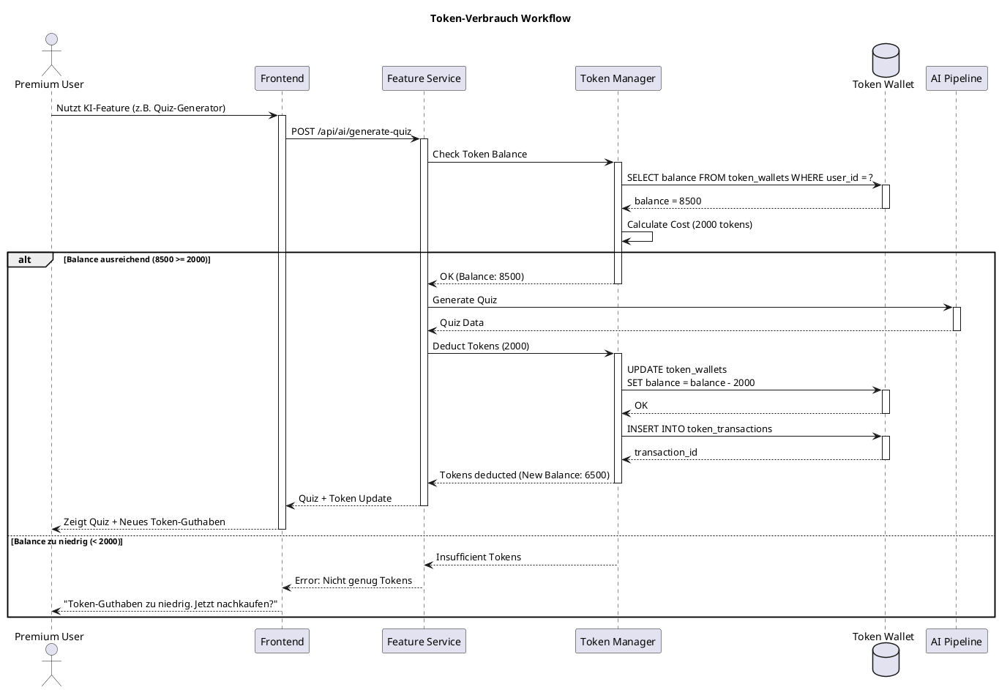
```plantuml
@startuml
title Token-Verbrauch Workflow

actor "Premium User" as user
participant "Frontend" as frontend
participant "Feature Service" as feature
participant "Token Manager" as token_mgr
database "Token Wallet" as wallet
participant "AI Pipeline" as ai

user -> frontend : Nutzt KI-Feature (z.B. Quiz-Generator)
activate frontend

frontend -> feature : POST /api/ai/generate-quiz
activate feature

feature -> token_mgr : Check Token Balance
activate token_mgr

token_mgr -> wallet : SELECT balance FROM token_wallets WHERE user_id = ?
activate wallet
wallet --> token_mgr : balance = 8500
deactivate wallet

token_mgr -> token_mgr : Calculate Cost (2000 tokens)

alt Balance ausreichend (8500 >= 2000)
  token_mgr --> feature : OK (Balance: 8500)
  deactivate token_mgr

  feature -> ai : Generate Quiz
  activate ai
  ai --> feature : Quiz Data
  deactivate ai

  feature -> token_mgr : Deduct Tokens (2000)
  activate token_mgr

  token_mgr -> wallet : UPDATE token_wallets\nSET balance = balance - 2000
  activate wallet
  wallet --> token_mgr : OK
  deactivate wallet

  token_mgr -> wallet : INSERT INTO token_transactions
  activate wallet
  wallet --> token_mgr : transaction_id
  deactivate wallet

  token_mgr --> feature : Tokens deducted (New Balance: 6500)
  deactivate token_mgr

  feature --> frontend : Quiz + Token Update
  deactivate feature

  frontend --> user : Zeigt Quiz + Neues Token-Guthaben
  deactivate frontend

else Balance zu niedrig (< 2000)
  token_mgr --> feature : Insufficient Tokens
  deactivate token_mgr

  feature --> frontend : Error: Nicht genug Tokens
  deactivate feature

  frontend --> user : "Token-Guthaben zu niedrig. Jetzt nachkaufen?"
  deactivate frontend
end

@enduml
```

### Token-Nachkauf

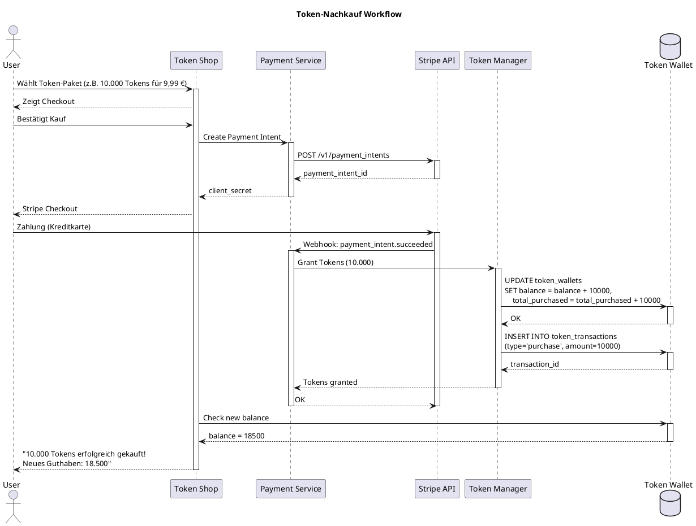
```plantuml
@startuml
title Token-Nachkauf Workflow

actor User
participant "Token Shop" as shop
participant "Payment Service" as payment
participant "Stripe API" as stripe
participant "Token Manager" as token_mgr
database "Token Wallet" as wallet

User -> shop : Wählt Token-Paket (z.B. 10.000 Tokens für 9,99 €)
activate shop

shop --> User : Zeigt Checkout
User -> shop : Bestätigt Kauf
shop -> payment : Create Payment Intent
activate payment

payment -> stripe : POST /v1/payment_intents
activate stripe
stripe --> payment : payment_intent_id
deactivate stripe

payment --> shop : client_secret
deactivate payment

shop --> User : Stripe Checkout
User -> stripe : Zahlung (Kreditkarte)
activate stripe

stripe -> payment : Webhook: payment_intent.succeeded
activate payment

payment -> token_mgr : Grant Tokens (10.000)
activate token_mgr

token_mgr -> wallet : UPDATE token_wallets\nSET balance = balance + 10000,\n    total_purchased = total_purchased + 10000
activate wallet
wallet --> token_mgr : OK
deactivate wallet

token_mgr -> wallet : INSERT INTO token_transactions\n(type='purchase', amount=10000)
activate wallet
wallet --> token_mgr : transaction_id
deactivate wallet

token_mgr --> payment : Tokens granted
deactivate token_mgr

payment --> stripe : OK
deactivate payment
deactivate stripe

shop -> wallet : Check new balance
activate wallet
wallet --> shop : balance = 18500
deactivate wallet

shop --> User : "10.000 Tokens erfolgreich gekauft!\nNeues Guthaben: 18.500"
deactivate shop

@enduml
```

### Token-Pakete

| Paket | Tokens | Preis | Preis/1000 Tokens | Rabatt |
|-------|--------|-------|-------------------|--------|
| **Klein** | 5.000 | 5,99 € | 1,20 € | - |
| **Mittel** | 10.000 | 9,99 € | 1,00 € | 16% |
| **Groß** | 25.000 | 19,99 € | 0,80 € | 33% |
| **XL** | 50.000 | 34,99 € | 0,70 € | 42% |
| **XXL** | 100.000 | 59,99 € | 0,60 € | 50% |

**Monatliches Guthaben Premium:** 10.000 Tokens (im Abo enthalten)

---

## 6. Premium-Preis & Billing

### Preismodelle

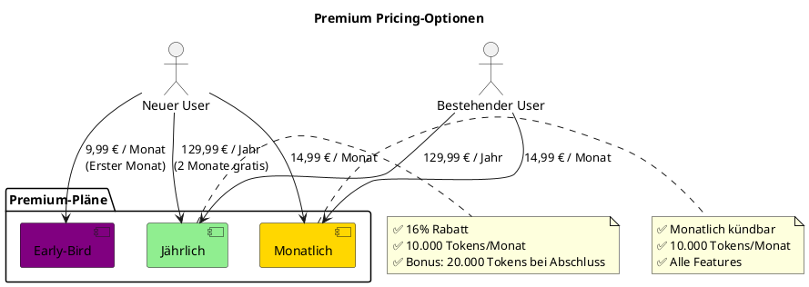
```plantuml
@startuml
title Premium Pricing-Optionen

package "Premium-Pläne" {
  [Monatlich] as monthly #Gold
  [Jährlich] as yearly #LightGreen
  [Early-Bird] as early #Purple
}

actor "Neuer User" as new_user
actor "Bestehender User" as existing

new_user --> early : 9,99 € / Monat\n(Erster Monat)
new_user --> monthly : 14,99 € / Monat
new_user --> yearly : 129,99 € / Jahr\n(2 Monate gratis)

existing --> monthly : 14,99 € / Monat
existing --> yearly : 129,99 € / Jahr

note right of monthly
  ✅ Monatlich kündbar
  ✅ 10.000 Tokens/Monat
  ✅ Alle Features
end note

note right of yearly
  ✅ 16% Rabatt
  ✅ 10.000 Tokens/Monat
  ✅ Bonus: 20.000 Tokens bei Abschluss
end note

@enduml
```

### Preistabelle

| Plan | Preis | Token/Monat | Zusatz-Features | Empfohlen für |
|------|-------|-------------|-----------------|---------------|
| **Free** | 0 € | 0 | Nur Gruppe A+B teilweise | Testen, Einsteiger |
| **Premium (Monthly)** | 14,99 € | 10.000 | Alle Features | Flexible Nutzer |
| **Premium (Yearly)** | 129,99 € (10,83 €/Monat) | 10.000 + 20.000 Bonus | Alle Features | Langfristige Lerner |
| **Early-Bird** | 9,99 € (Erster Monat) | 10.000 | Alle Features | Neukunden |
| **Creator** | 29,99 € | 20.000 | + Monetarisierung | Content Creators |
| **Teacher** | 39,99 € | 30.000 | + LiveRoom Pro | Dozenten |

### Subscription Lifecycle

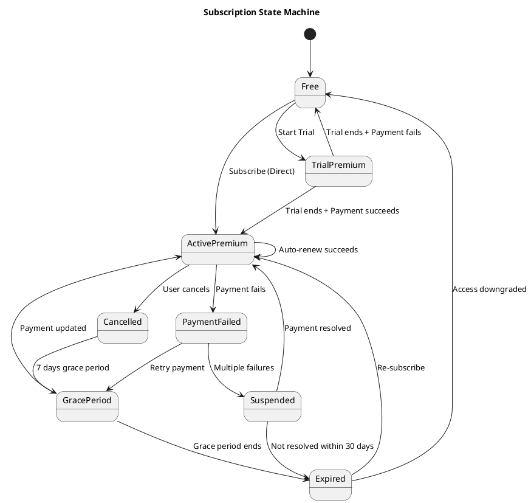
```plantuml
@startuml
title Subscription State Machine

[*] --> Free

Free --> TrialPremium : Start Trial
Free --> ActivePremium : Subscribe (Direct)

TrialPremium --> ActivePremium : Trial ends + Payment succeeds
TrialPremium --> Free : Trial ends + Payment fails

ActivePremium --> ActivePremium : Auto-renew succeeds
ActivePremium --> Cancelled : User cancels
ActivePremium --> PaymentFailed : Payment fails

Cancelled --> GracePeriod : 7 days grace period
GracePeriod --> ActivePremium : Payment updated
GracePeriod --> Expired : Grace period ends

PaymentFailed --> GracePeriod : Retry payment
PaymentFailed --> Suspended : Multiple failures

Suspended --> ActivePremium : Payment resolved
Suspended --> Expired : Not resolved within 30 days

Expired --> Free : Access downgraded
Expired --> ActivePremium : Re-subscribe

@enduml
```

### Billing-Workflow

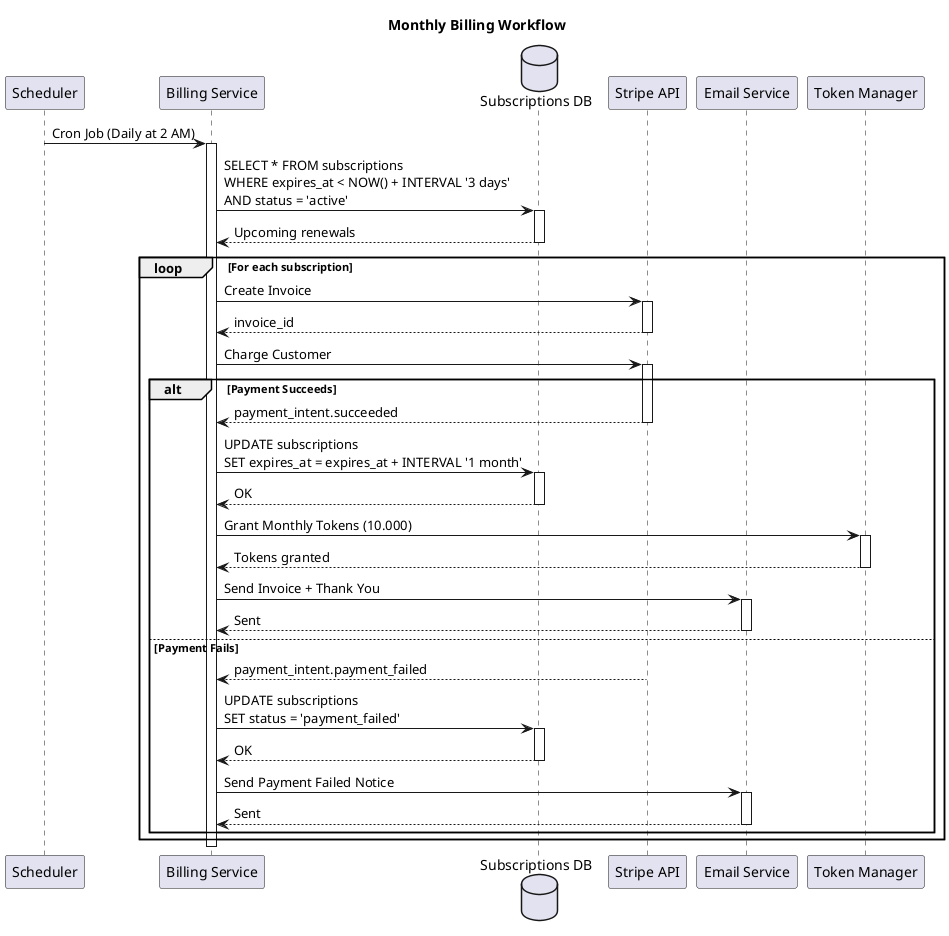
```plantuml
@startuml
title Monthly Billing Workflow

participant "Scheduler" as scheduler
participant "Billing Service" as billing
database "Subscriptions DB" as db
participant "Stripe API" as stripe
participant "Email Service" as email
participant "Token Manager" as token_mgr

scheduler -> billing : Cron Job (Daily at 2 AM)
activate billing

billing -> db : SELECT * FROM subscriptions\nWHERE expires_at < NOW() + INTERVAL '3 days'\nAND status = 'active'
activate db
db --> billing : Upcoming renewals
deactivate db

loop For each subscription
  billing -> stripe : Create Invoice
  activate stripe
  stripe --> billing : invoice_id
  deactivate stripe

  billing -> stripe : Charge Customer
  activate stripe

  alt Payment Succeeds
    stripe --> billing : payment_intent.succeeded
    deactivate stripe

    billing -> db : UPDATE subscriptions\nSET expires_at = expires_at + INTERVAL '1 month'
    activate db
    db --> billing : OK
    deactivate db

    billing -> token_mgr : Grant Monthly Tokens (10.000)
    activate token_mgr
    token_mgr --> billing : Tokens granted
    deactivate token_mgr

    billing -> email : Send Invoice + Thank You
    activate email
    email --> billing : Sent
    deactivate email

  else Payment Fails
    stripe --> billing : payment_intent.payment_failed
    deactivate stripe

    billing -> db : UPDATE subscriptions\nSET status = 'payment_failed'
    activate db
    db --> billing : OK
    deactivate db

    billing -> email : Send Payment Failed Notice
    activate email
    email --> billing : Sent
    deactivate email
  end
end

deactivate billing

@enduml
```

---

## 7. Premium-Vorteile für Free-User

### Free-User-Garantien

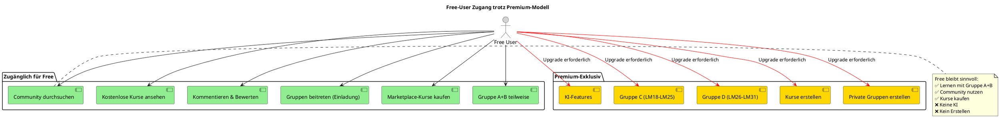
```plantuml
@startuml
title Free-User Zugang trotz Premium-Modell

actor "Free User" as free #LightGray

package "Zugänglich für Free" {
  [Community durchsuchen] as browse #LightGreen
  [Kostenlose Kurse ansehen] as view #LightGreen
  [Kommentieren & Bewerten] as comment #LightGreen
  [Gruppen beitreten (Einladung)] as join #LightGreen
  [Marketplace-Kurse kaufen] as buy #LightGreen
  [Gruppe A+B teilweise] as basic #LightGreen
}

package "Premium-Exklusiv" {
  [KI-Features] as ai #Gold
  [Gruppe C (LM18–LM25)] as premium_methods #Gold
  [Gruppe D (LM26–LM31)] as pro_methods #Gold
  [Kurse erstellen] as create #Gold
  [Private Gruppen erstellen] as create_group #Gold
}

free --> browse
free --> view
free --> comment
free --> join
free --> buy
free --> basic

free -[#red]-> ai : Upgrade erforderlich
free -[#red]-> premium_methods : Upgrade erforderlich
free -[#red]-> pro_methods : Upgrade erforderlich
free -[#red]-> create : Upgrade erforderlich
free -[#red]-> create_group : Upgrade erforderlich

note right of browse
  Free bleibt sinnvoll:
  ✅ Lernen mit Gruppe A+B
  ✅ Community nutzen
  ✅ Kurse kaufen
  ❌ Keine KI
  ❌ Kein Erstellen
end note

@enduml
```

### Upgrade-Incentives

| Incentive | Beschreibung | Trigger |
|-----------|--------------|---------|
| **Feature-Banner** | "Diese Methode erfordert Premium" | User klickt auf Gruppe C/D-Methode |
| **KI-Teaser** | "KI kann dir helfen - Upgrade zu Premium" | User öffnet Modul ohne KI |
| **Token-Anzeige** | Zeigt benötigte Tokens, aber Free hat keine | Bei KI-Feature-Nutzung |
| **Gruppen-Limit** | "Premium-User können eigene Gruppen erstellen" | Free versucht Gruppe zu erstellen |
| **Kurs-Teaser** | "Erstelle eigene Kurse mit Premium" | Free sieht Creator-Dashboard |
| **Promo-Code** | 20% Rabatt für ersten Monat | Nach 7 Tagen Free-Nutzung |
| **Trial-Angebot** | 7 Tage Premium kostenlos testen | Nach Kurs-Abschluss |

---

## 8. Premium & Marketplace

### Marketplace-Kurs-Logik

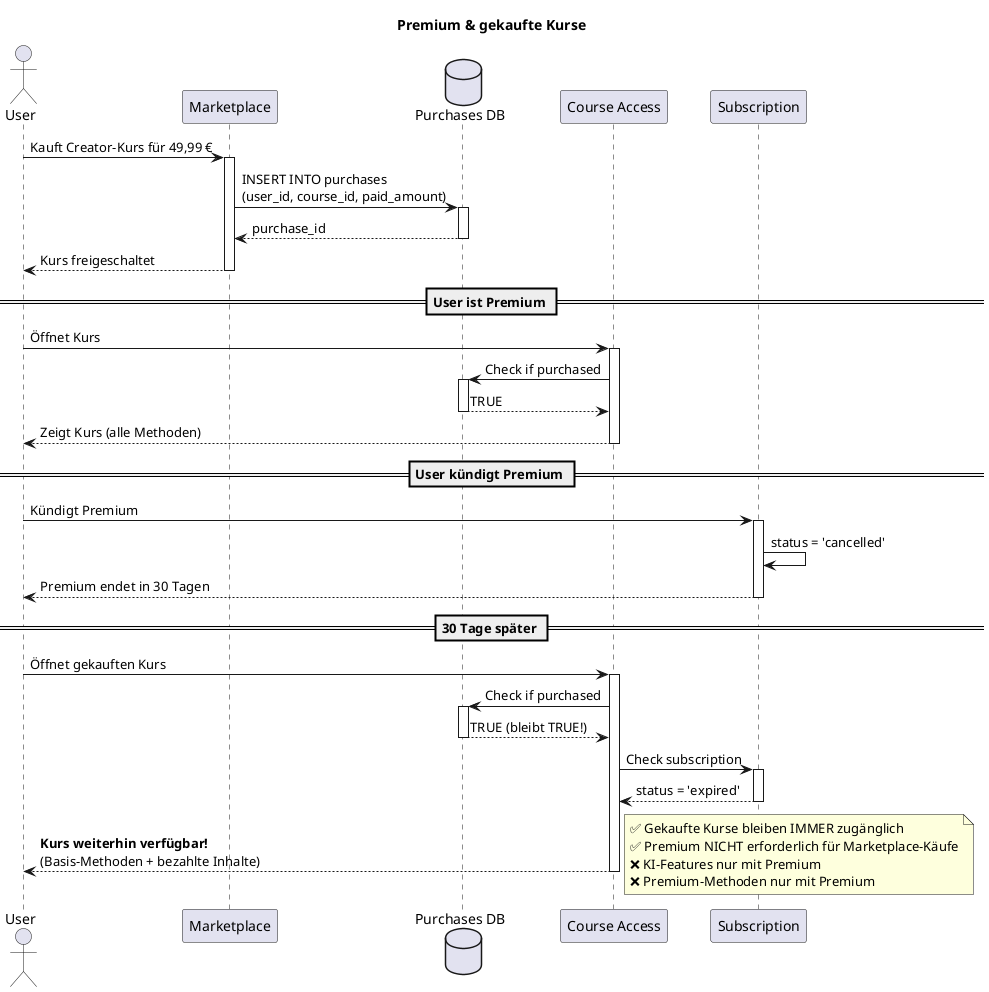
```plantuml
@startuml
title Premium & gekaufte Kurse

actor "User" as user
participant "Marketplace" as marketplace
database "Purchases DB" as purchases
participant "Course Access" as access
participant "Subscription" as subscription

user -> marketplace : Kauft Creator-Kurs für 49,99 €
activate marketplace

marketplace -> purchases : INSERT INTO purchases\n(user_id, course_id, paid_amount)
activate purchases
purchases --> marketplace : purchase_id
deactivate purchases

marketplace --> user : Kurs freigeschaltet
deactivate marketplace

== User ist Premium ==

user -> access : Öffnet Kurs
activate access

access -> purchases : Check if purchased
activate purchases
purchases --> access : TRUE
deactivate purchases

access --> user : Zeigt Kurs (alle Methoden)
deactivate access

== User kündigt Premium ==

user -> subscription : Kündigt Premium
activate subscription

subscription -> subscription : status = 'cancelled'
subscription --> user : Premium endet in 30 Tagen
deactivate subscription

== 30 Tage später ==

user -> access : Öffnet gekauften Kurs
activate access

access -> purchases : Check if purchased
activate purchases
purchases --> access : TRUE (bleibt TRUE!)
deactivate purchases

access -> subscription : Check subscription
activate subscription
subscription --> access : status = 'expired'
deactivate subscription

access --> user : **Kurs weiterhin verfügbar!**\n(Basis-Methoden + bezahlte Inhalte)
deactivate access

note right
  ✅ Gekaufte Kurse bleiben IMMER zugänglich
  ✅ Premium NICHT erforderlich für Marketplace-Käufe
  ❌ KI-Features nur mit Premium
  ❌ Premium-Methoden nur mit Premium
end note

@enduml
```

### Kauf-Garantien

| Szenario | Verhalten | Grund |
|----------|-----------|-------|
| **Premium kauft Kurs** | Kurs bleibt nach Premium-Kündigung zugänglich | Kauf ist unabhängig von Abo |
| **Free kauft Kurs** | Kurs zugänglich (Basis-Methoden) | Fair für Käufer |
| **Gruppe C/D-Methoden im gekauften Kurs** | Nur mit Premium zugänglich | Abo-Feature |
| **KI im gekauften Kurs** | Nur mit Premium nutzbar | Token-System |
| **Kurs-Updates** | Immer zugänglich | Lebenslanges Update-Recht |

---

## 9. Premium & Community

### Community-Publishing

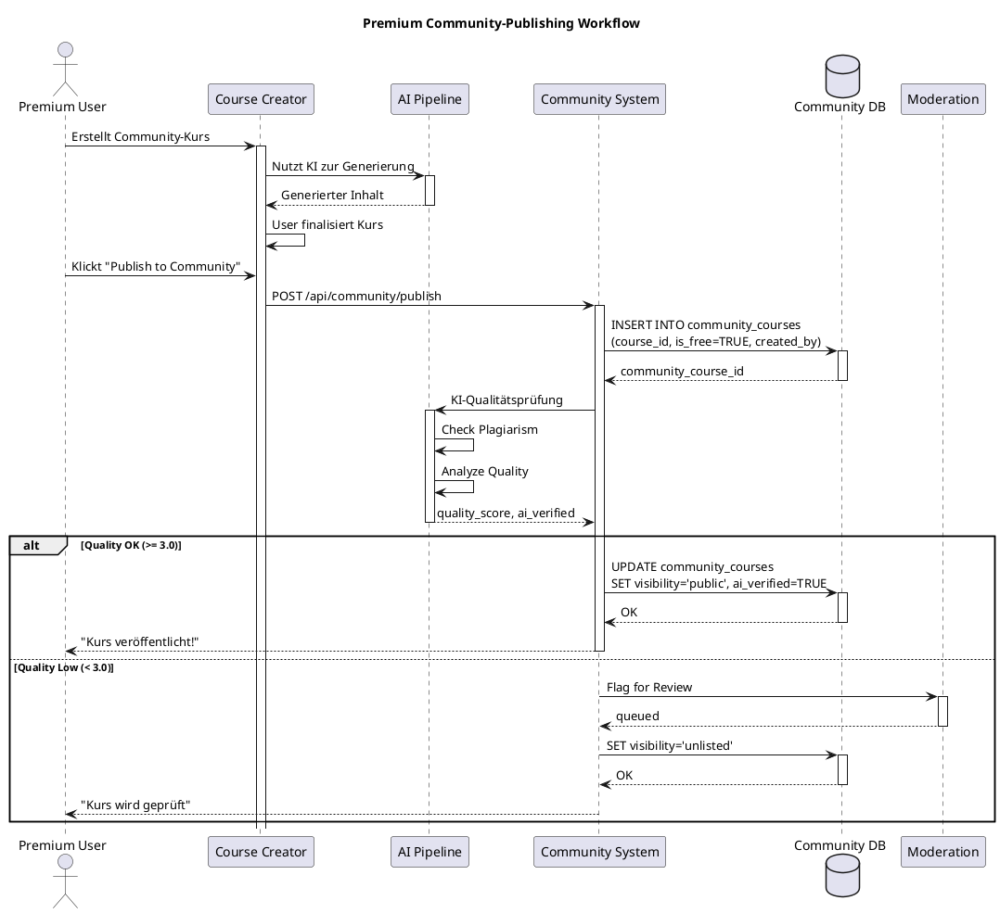
```plantuml
@startuml
title Premium Community-Publishing Workflow

actor "Premium User" as premium
participant "Course Creator" as creator
participant "AI Pipeline" as ai
participant "Community System" as community
database "Community DB" as db
participant "Moderation" as moderation

premium -> creator : Erstellt Community-Kurs
activate creator

creator -> ai : Nutzt KI zur Generierung
activate ai
ai --> creator : Generierter Inhalt
deactivate ai

creator -> creator : User finalisiert Kurs

premium -> creator : Klickt "Publish to Community"
creator -> community : POST /api/community/publish
activate community

community -> db : INSERT INTO community_courses\n(course_id, is_free=TRUE, created_by)
activate db
db --> community : community_course_id
deactivate db

community -> ai : KI-Qualitätsprüfung
activate ai

ai -> ai : Check Plagiarism
ai -> ai : Analyze Quality
ai --> community : quality_score, ai_verified
deactivate ai

alt Quality OK (>= 3.0)
  community -> db : UPDATE community_courses\nSET visibility='public', ai_verified=TRUE
  activate db
  db --> community : OK
  deactivate db

  community --> premium : "Kurs veröffentlicht!"
  deactivate community

else Quality Low (< 3.0)
  community -> moderation : Flag for Review
  activate moderation
  moderation --> community : queued
  deactivate moderation

  community -> db : SET visibility='unlisted'
  activate db
  db --> community : OK
  deactivate db

  community --> premium : "Kurs wird geprüft"
  deactivate community
end

@enduml
```

### Private Gruppen

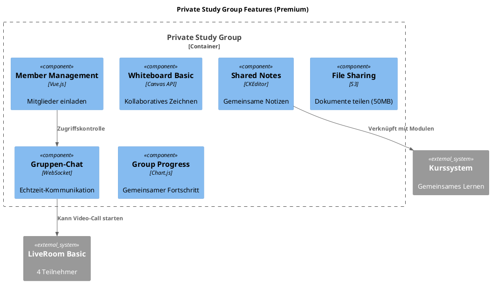
```plantuml
@startuml
!include <C4/C4_Component>

title Private Study Group Features (Premium)

Container_Boundary(study_group, "Private Study Group") {
  Component(chat, "Gruppen-Chat", "WebSocket", "Echtzeit-Kommunikation")
  Component(whiteboard, "Whiteboard Basic", "Canvas API", "Kollaboratives Zeichnen")
  Component(notes, "Shared Notes", "CKEditor", "Gemeinsame Notizen")
  Component(files, "File Sharing", "S3", "Dokumente teilen (50MB)")
  Component(members, "Member Management", "Vue.js", "Mitglieder einladen")
  Component(progress, "Group Progress", "Chart.js", "Gemeinsamer Fortschritt")
}

System_Ext(liveroom, "LiveRoom Basic", "4 Teilnehmer")
System_Ext(courses, "Kurssystem", "Gemeinsames Lernen")

Rel(chat, liveroom, "Kann Video-Call starten")
Rel(notes, courses, "Verknüpft mit Modulen")
Rel(members, chat, "Zugriffskontrolle")

@enduml
```

---

## 10. Premium & Creator

### Upgrade-Vergleich

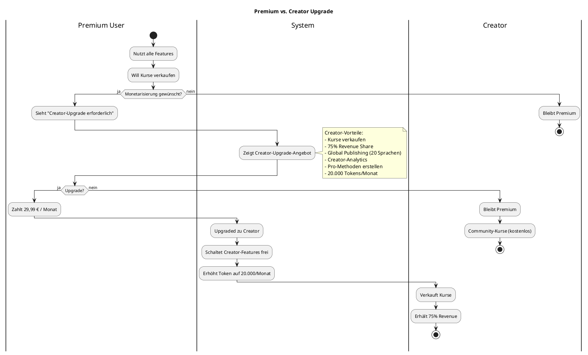
```plantuml
@startuml
title Premium vs. Creator Upgrade

|Premium User|
start
:Nutzt alle Features;
:Will Kurse verkaufen;

if (Monetarisierung gewünscht?) then (ja)
  :Sieht "Creator-Upgrade erforderlich";

  |System|
  :Zeigt Creator-Upgrade-Angebot;
  note right
    Creator-Vorteile:
    - Kurse verkaufen
    - 75% Revenue Share
    - Global Publishing (20 Sprachen)
    - Creator-Analytics
    - Pro-Methoden erstellen
    - 20.000 Tokens/Monat
  end note

  |Premium User|
  if (Upgrade?) then (ja)
    :Zahlt 29,99 € / Monat;

    |System|
    :Upgraded zu Creator;
    :Schaltet Creator-Features frei;
    :Erhöht Token auf 20.000/Monat;

    |Creator|
    :Verkauft Kurse;
    :Erhält 75% Revenue;
    stop
  else (nein)
    :Bleibt Premium;
    :Community-Kurse (kostenlos);
    stop
  endif
else (nein)
  :Bleibt Premium;
  stop
endif

@enduml
```

### Feature-Unterschiede

| Feature | Premium | Creator | Delta |
|---------|---------|---------|-------|
| **Preis** | 14,99 € / Monat | 29,99 € / Monat | +15 € |
| **Tokens/Monat** | 10.000 | 20.000 | +10.000 |
| **Kurse verkaufen** | ❌ | ✅ | Monetarisierung |
| **Revenue Share** | - | 75% | Einnahmen |
| **Global Publishing** | ❌ | ✅ 20 Sprachen | Reichweite |
| **Pro-Methoden erstellen** | ❌ | ✅ | Content-Qualität |
| **Creator-Analytics** | ❌ | ✅ | Insights |
| **Marketplace-Zugang** | Käufer | Verkäufer | Business |
| **Community-Kurse** | ✅ Kostenlos | ✅ Alle | Erweitert |

---

## 11. Premium & Schulen/Unternehmen

### Vergleich: Premium vs. School/Company

| Feature | Premium | School | Company | Hauptunterschied |
|---------|---------|--------|---------|------------------|
| **Zielgruppe** | Einzelperson | Bildungseinrichtung | Unternehmen | Organisation vs. Individuum |
| **Preis** | 14,99 € / Monat | Individuelles Angebot | Individuelles Angebot | Custom Pricing |
| **Tokens** | 10.000/Monat | Token-Pool (organisationsweit) | Token-Pool | Shared Resources |
| **Verwaltung** | Eigenes Konto | Lehrer/Klassen verwalten | Mitarbeiter/Teams verwalten | Admin-Features |
| **LiveRoom** | Basic (4 Teilnehmer) | Pro (unbegrenzt) | Pro (unbegrenzt) | Skalierbarkeit |
| **Domain** | ❌ | ✅ Eigene Domain | ✅ Eigene Domain | Branding |
| **Prüfungsverwaltung** | ❌ | ✅ Zentral | ✅ Zentral | Enterprise |
| **Global Publishing** | ❌ | ✅ | ✅ | Content Distribution |
| **Support** | Community | Priority | Premium | Service Level |

---

## 12. API-Endpoints

### Subscription-API

| Endpoint | Methode | Beschreibung | Auth | Rolle |
|----------|---------|--------------|------|-------|
| `/api/subscriptions/current` | GET | Aktuelles Abo abrufen | ✅ | Alle |
| `/api/subscriptions/upgrade` | POST | Zu Premium upgraden | ✅ | Free |
| `/api/subscriptions/cancel` | POST | Abo kündigen | ✅ | Premium+ |
| `/api/subscriptions/reactivate` | POST | Gekündigtes Abo reaktivieren | ✅ | Cancelled |
| `/api/subscriptions/change-plan` | PUT | Plan wechseln (Monthly ↔ Yearly) | ✅ | Premium+ |
| `/api/tokens/balance` | GET | Token-Guthaben abrufen | ✅ | Premium+ |
| `/api/tokens/purchase` | POST | Zusätzliche Tokens kaufen | ✅ | Premium+ |
| `/api/tokens/transactions` | GET | Token-Verlauf | ✅ | Premium+ |
| `/api/payments/history` | GET | Zahlungshistorie | ✅ | Premium+ |
| `/api/payments/invoices` | GET | Rechnungen herunterladen | ✅ | Premium+ |

### Beispiel-Request: Premium-Upgrade

```http
POST /api/subscriptions/upgrade
Authorization: Bearer <token>
Content-Type: application/json

{
  "plan_type": "premium",
  "billing_cycle": "monthly",
  "promo_code": "EARLYBIRD2024",
  "payment_method": "stripe",
  "success_url": "https://lsx.com/premium/welcome",
  "cancel_url": "https://lsx.com/pricing"
}
```

**Response:**

```json
{
  "status": "success",
  "data": {
    "subscription_id": "sub_1a2b3c4d",
    "stripe_checkout_url": "https://checkout.stripe.com/...",
    "plan_type": "premium",
    "billing_cycle": "monthly",
    "price": 9.99,
    "currency": "EUR",
    "discount_applied": 5.00,
    "trial_ends_at": "2024-03-15T23:59:59Z",
    "tokens_granted": 10000
  },
  "message": "Bitte schließen Sie die Zahlung bei Stripe ab."
}
```

---

## 13. Promo-Codes & Rabatte

### Promo-Code-Typen

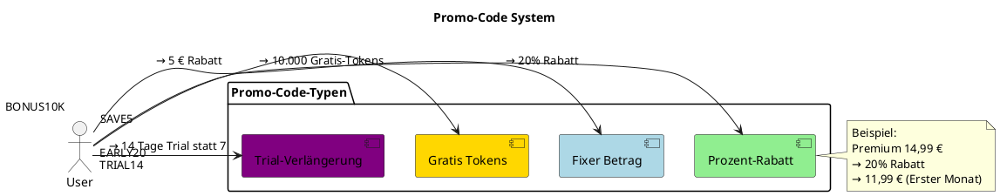
```plantuml
@startuml
title Promo-Code System

package "Promo-Code-Typen" {
  [Prozent-Rabatt] as percent #LightGreen
  [Fixer Betrag] as fixed #LightBlue
  [Gratis Tokens] as tokens #Gold
  [Trial-Verlängerung] as trial #Purple
}

actor "User" as user

user -> percent : "EARLY20" → 20% Rabatt
user -> fixed : "SAVE5" → 5 € Rabatt
user -> tokens : "BONUS10K" → 10.000 Gratis-Tokens
user -> trial : "TRIAL14" → 14 Tage Trial statt 7

note right of percent
  Beispiel:
  Premium 14,99 €
  → 20% Rabatt
  → 11,99 € (Erster Monat)
end note

@enduml
```

### Promo-Code-Beispiele

| Code | Typ | Wert | Gültigkeit | Max Uses | Beschreibung |
|------|-----|------|------------|----------|--------------|
| **EARLYBIRD2024** | Prozent | 33% | 2024-01-01 bis 2024-03-31 | 1000 | Early-Bird-Rabatt |
| **STUDENT10** | Prozent | 10% | Unbegrenzt | 10000 | Studenten-Rabatt |
| **WELCOME5** | Fixer Betrag | 5 € | Unbegrenzt | Unbegrenzt | Willkommens-Rabatt |
| **BONUS10K** | Gratis Tokens | 10.000 | 2024-02-01 bis 2024-02-29 | 500 | Token-Bonus |
| **TRIAL14** | Trial-Verlängerung | 14 Tage | Unbegrenzt | Unbegrenzt | Verlängerter Trial |
| **FRIEND20** | Prozent | 20% | Unbegrenzt | 100 | Freundschaftswerbung |

---

## 14. Analytics & Reporting

### Premium-Metriken (Admin-Dashboard)

```plantuml
@startuml
!include <C4/C4_Component>

title Premium-Analytics Dashboard

Container_Boundary(analytics, "Premium Analytics") {
  Component(revenue, "Revenue-Tracker", "Python/Pandas", "MRR, ARR, Churn")
  Component(user_metrics, "User-Metriken", "Python", "Conversions, Retentions")
  Component(token_analytics, "Token-Analytics", "Python", "Verbrauch, Nachkäufe")
  Component(cohort, "Cohort-Analyse", "Python/Pandas", "User-Verhalten über Zeit")
  Component(funnel, "Conversion-Funnel", "Python", "Free → Premium Journey")
}

Database(analytics_db, "Analytics DB", "PostgreSQL")
System_Ext(reporting, "Reporting Service", "Metabase/Looker")

Rel(revenue, analytics_db, "Liest Zahlungen")
Rel(user_metrics, analytics_db, "Liest Subscriptions")
Rel(token_analytics, analytics_db, "Liest Token-Transaktionen")
Rel(cohort, analytics_db, "Liest User-Daten")
Rel(funnel, analytics_db, "Liest Conversion-Events")

Rel(revenue, reporting, "Visualisiert")

@enduml
```

### Key Metrics

| Metrik | Beschreibung | Berechnung |
|--------|--------------|------------|
| **MRR** | Monthly Recurring Revenue | SUM(active_subscriptions.price) |
| **ARR** | Annual Recurring Revenue | MRR * 12 |
| **Churn Rate** | Prozent gekündigter Abos | (Cancelled / Total Active) * 100 |
| **LTV** | Lifetime Value eines Premium-Users | Avg. Subscription Duration * MRR per User |
| **CAC** | Customer Acquisition Cost | Marketing Spend / New Subscribers |
| **Conversion Rate** | Free → Premium Conversion | (New Premium / Total Free) * 100 |
| **Token Usage** | Durchschnittlicher Token-Verbrauch | AVG(monthly_token_consumption) |
| **Token Purchase Rate** | Prozent der User, die Tokens nachkaufen | (Users with Token Purchase / Total Premium) * 100 |

---

## 15. Zusammenfassung

### ✅ Premium-Kernwerte

| Aspekt | Details |
|--------|---------|
| **Preis** | 14,99 € / Monat (129,99 € / Jahr) |
| **Zielgruppe** | Einzelpersonen, Lerner, Studenten |
| **Lernmethoden** | Alle 19 Content-Lernmethoden (A-C) |
| **KI-Zugriff** | Vollzugriff (token-basiert, 10.000/Monat) |
| **Kurserstellung** | Private & Community (kostenlos) |
| **Community** | Gruppen erstellen, Publishing |
| **LiveRoom** | Basic (4 Teilnehmer) |
| **Dashboard** | Vollständig anpassbar |
| **Tokens** | 10.000/Monat + Nachkauf möglich |
| **Gekaufte Kurse** | Bleiben IMMER zugänglich |

### 🎯 Design-Prinzipien

- **Fair:** Free bleibt sinnvoll, Premium bietet massiven Mehrwert
- **Transparent:** Token-Verbrauch klar kommuniziert
- **Flexibel:** Monatlich kündbar, Tokens laufen nicht ab
- **Skalierbar:** Token-Nachkauf für Power-User
- **Klar abgegrenzt:** Premium ist Lerner-Konto, kein Business-Account
- **Wertvoll:** Alle 19 Content-LMs (A-C) + KI rechtfertigen Preis

---

## 📌 Dokument abgeschlossen

**Version:** 1.0
**Status:** Final
**Letzte Aktualisierung:** 2024

---

> 💡 **Hinweis:** Das Premium-Modell ist die zentrale Einnahmequelle der LSX-Plattform und bietet Lernenden maximalen Wert durch Zugang zu allen Features ohne Business-Komplexität.
