# 07 – Creator-Modell (Final)

**Version:** 1.0
**Stand:** Final

---

## Überblick

Das LSX-Creator-Modell ist das wirtschaftliche Rückgrat der Plattform. Creator sind Kursautoren, Dozenten, Coaches und Experten, die hochwertige Bildungsinhalte erstellen, global veröffentlichen und durch 75% Revenue Share monetarisieren. Sie verfügen über Business-Funktionen, die weit über Premium-User hinausgehen.

### 🎯 Creator-Positionierung

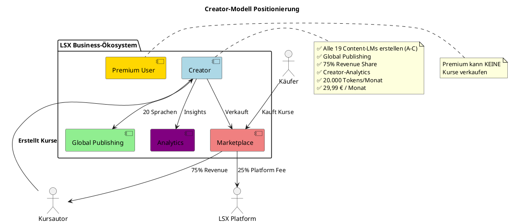

---

## C4 Architektur

### Context Diagram

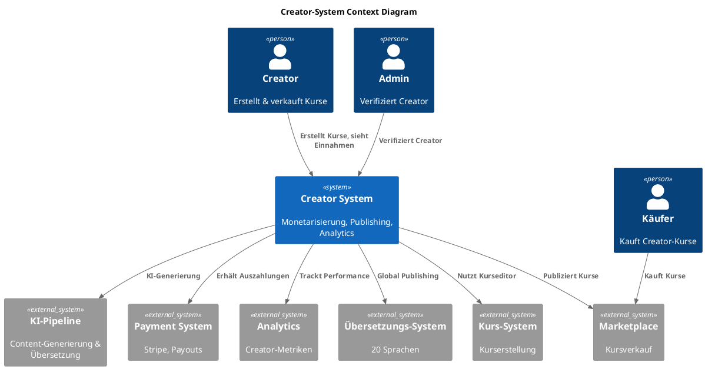

### Container Diagram

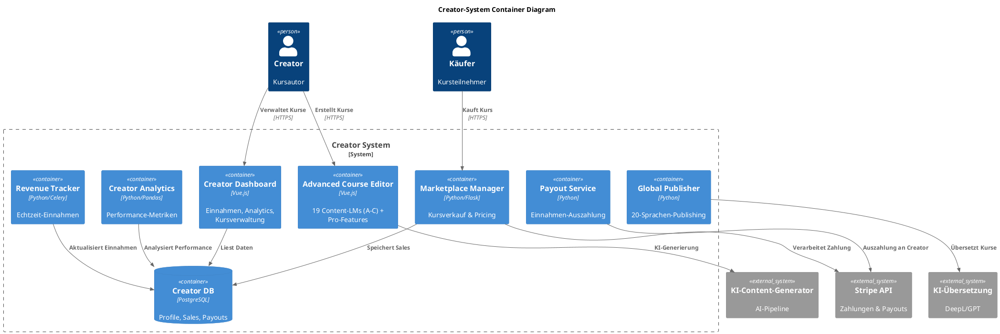

---

## Datenbankschema

### ER-Diagram: Creator & Monetarisierung

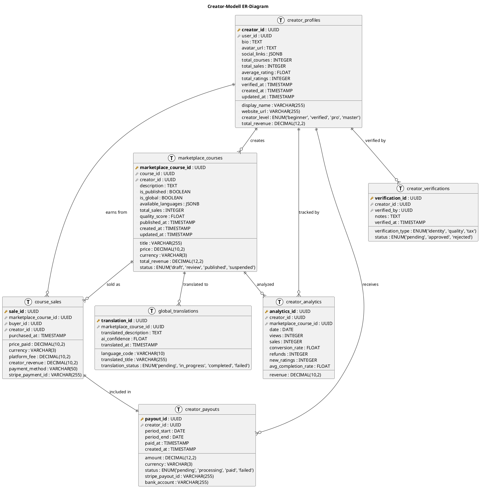

---

## 1. Zielgruppe des Creator-Modells

### Zielgruppen-Segmentierung

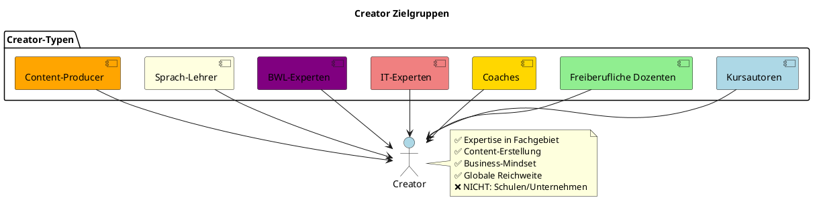

### Creator-Persona-Tabelle

| Persona | Hintergrund | Motivation | Hauptnutzen | Typischer Use-Case |
|---------|-------------|------------|-------------|---------------------|
| **IT-Experte** | Software-Entwickler, DevOps | Wissen teilen, passives Einkommen | Global Publishing, KI-Tools | "Python für Data Science", "Docker Mastery" |
| **Freiberuflicher Dozent** | Erfahrener Trainer | Skalierung ohne Zeitlimit | 75% Revenue, keine Overhead-Kosten | "Projektmanagement", "Agile Methoden" |
| **Coach** | Business/Life Coach | Digitales Produkt | Automatisierung, passive Einnahmen | "Leadership Skills", "Mindfulness" |
| **Sprachlehrer** | Native Speaker, Polyglott | Weltweite Schüler | Multi-Language-Support | "Business Englisch", "Spanisch für Anfänger" |
| **Content-Producer** | Influencer, YouTuber | Audience monetarisieren | Integration mit bestehenden Kanälen | "Video Editing", "Social Media Marketing" |

---

## 2. Creator-Funktionen (Detailliert)

### Feature-Übersicht

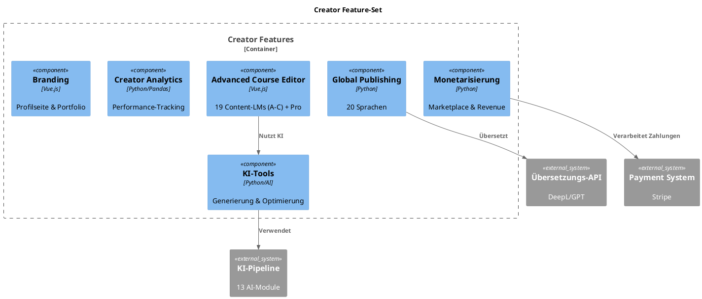

### 🔵 Kompletter Kurseditor

| Feature | Beschreibung | Premium | Creator |
|---------|--------------|---------|---------|
| **Gruppe A+B (LM00–LM17)** | Erklärende + Praxis-Methoden | ✅ Erstellen | ✅ Erstellen |
| **Gruppe C (LM18–LM25)** | Prüfungsorientierte Methoden | ✅ Privat | ✅ Verkaufen |
| **Gruppe D (LM26–LM31)** | Pro/Gamification (Case Studies, etc.) | ❌ | ✅ Erstellen |
| **KI-Unterstützung** | Generierung, Optimierung | ✅ | ✅ Enhanced |
| **Theorieblätter-Generator** | Automatisch generiert | ✅ | ✅ |
| **Modul-Templates** | Vordefinierte Strukturen | ❌ | ✅ |
| **Bulk-Operations** | Mehrere Module gleichzeitig | ❌ | ✅ |

### 🔵 Global Publishing (20 Sprachen)

| Sprache | ISO-Code | Marktgröße | Priorität |
|---------|----------|------------|-----------|
| Deutsch | de | 100M | Hoch |
| Englisch | en | 1.5B | Sehr Hoch |
| Spanisch | es | 500M | Hoch |
| Französisch | fr | 300M | Hoch |
| Italienisch | it | 70M | Mittel |
| Portugiesisch | pt | 260M | Hoch |
| Russisch | ru | 260M | Mittel |
| Chinesisch | zh | 1.3B | Sehr Hoch |
| Japanisch | ja | 130M | Mittel |
| Koreanisch | ko | 80M | Mittel |
| Arabisch | ar | 420M | Mittel |
| Türkisch | tr | 80M | Niedrig |
| Polnisch | pl | 40M | Niedrig |
| Niederländisch | nl | 25M | Niedrig |
| Schwedisch | sv | 10M | Niedrig |
| Norwegisch | no | 5M | Niedrig |
| Dänisch | da | 6M | Niedrig |
| Finnisch | fi | 5M | Niedrig |
| Griechisch | el | 13M | Niedrig |
| Hindi | hi | 600M | Hoch |

**Hinweis:** Übersetzung erfolgt automatisch und kostenlos für Creator.

### 🔵 Monetarisierung

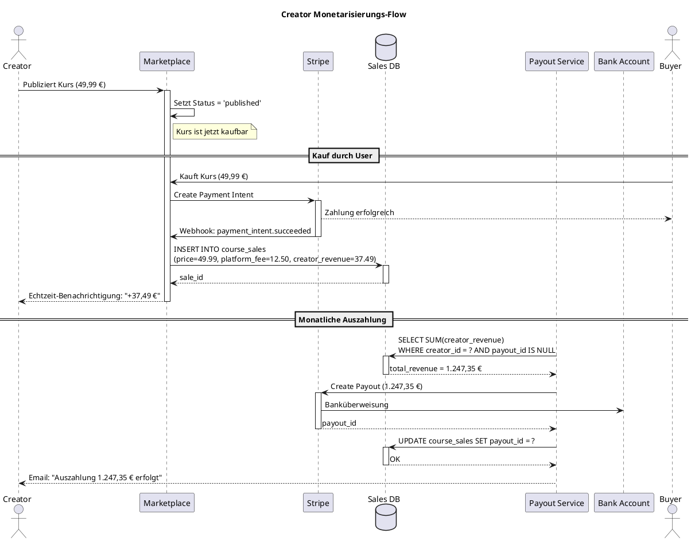

### Revenue Share Breakdown

| Verkaufspreis | Platform Fee (25%) | Creator Revenue (75%) |
|---------------|--------------------|-----------------------|
| 9,99 € | 2,50 € | 7,49 € |
| 19,99 € | 5,00 € | 14,99 € |
| 29,99 € | 7,50 € | 22,49 € |
| 49,99 € | 12,50 € | 37,49 € |
| 99,99 € | 25,00 € | 74,99 € |
| 199,99 € | 50,00 € | 149,99 € |
| 299,99 € | 75,00 € | 224,99 € |

**Platform Fee deckt ab:**
- Hosting & Infrastruktur
- KI-Kosten (Übersetzung, Content-Generierung)
- Zahlungsabwicklung (Stripe-Gebühren)
- Marketing & SEO
- Support
- Qualitätskontrolle

---

## 3. Creator vs. Premium (Detaillierter Vergleich)

### Funktionsvergleich

| Funktion | Premium | Creator | Delta |
|----------|---------|---------|-------|
| **Abo-Preis** | 14,99 € / Monat | 29,99 € / Monat | +15 € |
| **Tokens/Monat** | 10.000 | 20.000 | +10.000 |
| **Kurse erstellen** | ✅ Privat & Community | ✅ Alle Typen | Erweitert |
| **Gruppe D-Methoden erstellen** | ❌ | ✅ | Exklusiv |
| **Kurse verkaufen** | ❌ | ✅ | Monetarisierung |
| **Revenue Share** | - | 75% | Einnahmen |
| **Global Publishing** | ❌ | ✅ 20 Sprachen | Reichweite |
| **Creator Analytics** | ❌ | ✅ | Business-Insights |
| **Creator-Profilseite** | ❌ | ✅ | Branding |
| **Pricing-Control** | - | ✅ | Preisgestaltung |
| **Bulk-Operations** | ❌ | ✅ | Effizienz |
| **Verified Badge** | ❌ | ✅ | Trust Signal |

### Upgrade-Journey

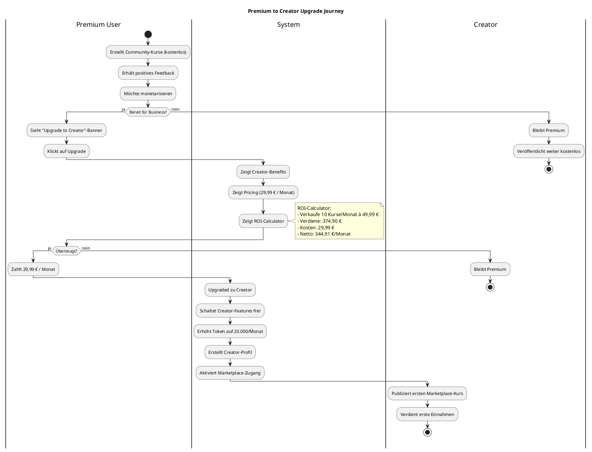

---

## 4. Arten von Creator-Kursen

### Kursarten-Übersicht

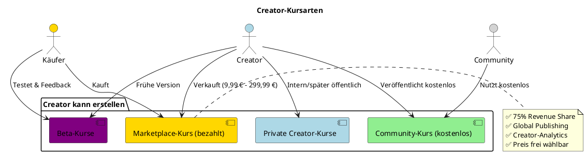

### Kursarten-Details

#### 4.1 Community-Kurs (kostenlos)

| Eigenschaft | Details |
|-------------|---------|
| **Preis** | Kostenlos |
| **Sichtbarkeit** | Öffentlich |
| **Methoden** | Alle 19 Content-LMs (A-C) |
| **Global Publishing** | ✅ Optional |
| **Zweck** | Marketing, Portfolio, Community-Building |
| **Analytics** | Basic (Views, Enrollments, Ratings) |
| **Monetarisierung** | Indirekt (Lead-Generierung) |

#### 4.2 Marketplace-Kurs (kostenpflichtig)

| Eigenschaft | Details |
|-------------|---------|
| **Preis** | 9,99 € - 299,99 € (Creator wählt) |
| **Revenue Share** | 75% an Creator |
| **Sichtbarkeit** | Weltweit (20 Sprachen) |
| **Methoden** | Alle 19 Content-LMs (A-C) |
| **Global Publishing** | ✅ Empfohlen |
| **Analytics** | Advanced (Sales, Revenue, Conversion, Retention) |
| **Auszahlung** | Monatlich via Stripe |

#### 4.3 Private Creator-Kurse

| Eigenschaft | Details |
|-------------|---------|
| **Preis** | Intern |
| **Sichtbarkeit** | Privat |
| **Zweck** | Entwürfe, Experimente, später öffentlich |
| **Methoden** | Alle 19 Content-LMs (A-C) |

#### 4.4 Beta-Kurse

| Eigenschaft | Details |
|-------------|---------|
| **Preis** | Reduziert (z.B. 50% Rabatt) |
| **Status** | "Beta" Badge |
| **Zweck** | Feedback sammeln, iterativ verbessern |
| **Vorteil für Käufer** | Günstiger Preis, Early Access |
| **Vorteil für Creator** | Qualitätsverbesserung, Marketing |

---

## 5. Global Publishing Prozess

### Publishing-Workflow

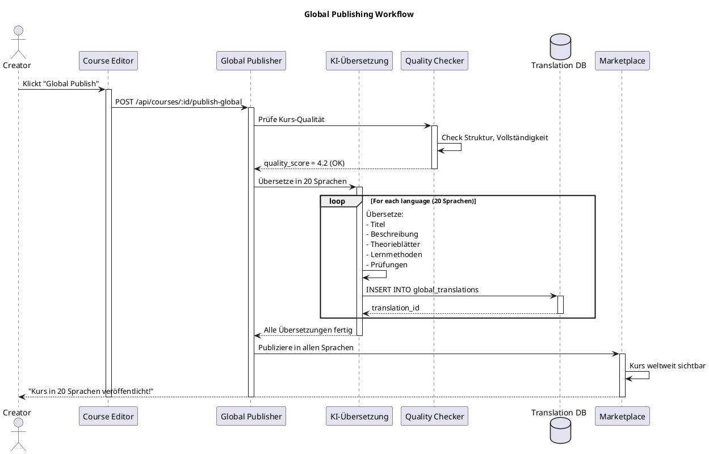

### Übersetzungs-Qualität

| Element | KI-Übersetzung | Manuelle Review | Ergebnis |
|---------|----------------|-----------------|----------|
| **Titel** | ✅ Automatisch | Optional | 95% Qualität |
| **Beschreibung** | ✅ Automatisch | Optional | 95% Qualität |
| **Theorieblätter** | ✅ Automatisch | Empfohlen | 90% Qualität |
| **Lernmethoden** | ✅ Automatisch | Empfohlen | 90% Qualität |
| **Quiz-Fragen** | ✅ Automatisch | Empfohlen | 85% Qualität |
| **Videos (Untertitel)** | ✅ Automatisch | Empfohlen | 85% Qualität |

**Hinweis:** Creator kann jede Übersetzung manuell nachbearbeiten.

---

## 6. Monetarisierung & Einnahmen

### Pricing-Strategie

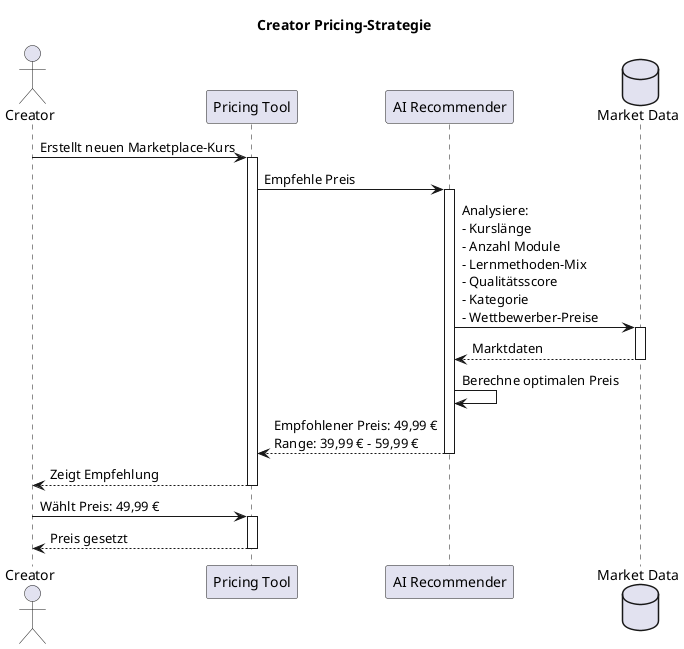

### Revenue-Modell

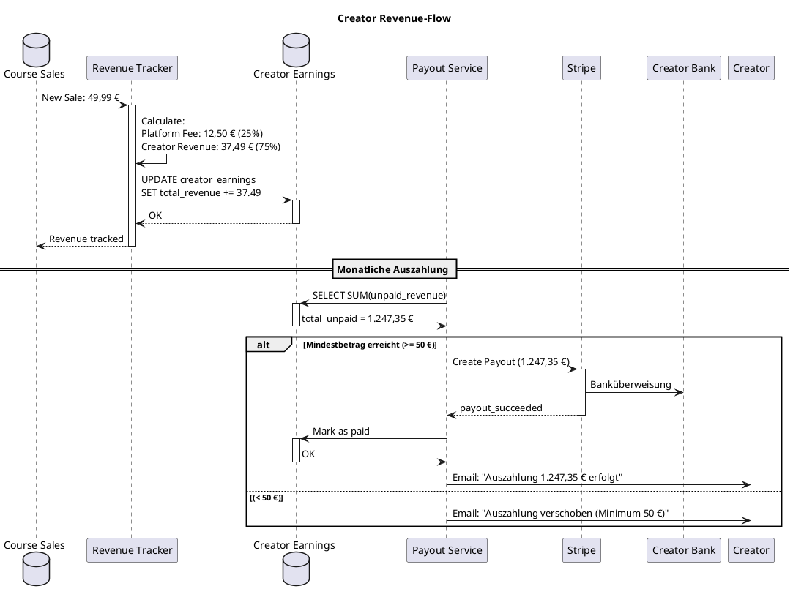

### Einnahmen-Dashboard

| Metrik | Beschreibung | Berechnung |
|--------|--------------|------------|
| **Total Revenue** | Gesamteinnahmen (alle Zeiten) | SUM(creator_revenue) |
| **Monthly Revenue** | Einnahmen diesen Monat | SUM(creator_revenue WHERE month = current) |
| **Avg. Sale Price** | Durchschnittlicher Verkaufspreis | AVG(price_paid) |
| **Total Sales** | Anzahl Verkäufe | COUNT(sale_id) |
| **Conversion Rate** | Verkäufe / Views | (sales / views) * 100 |
| **Top Course** | Best-Seller | Course mit höchstem Revenue |
| **Pending Payout** | Noch nicht ausgezahlt | SUM(unpaid_revenue) |
| **Next Payout Date** | Nächste Auszahlung | 1. des Folgemonats |

---

## 7. Creator-Tools

### KI-Tools für Creator

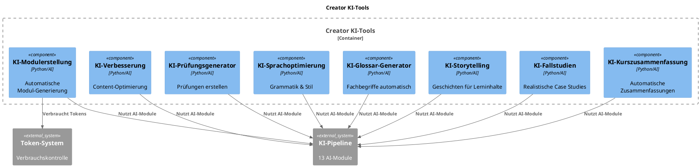

### KI-Tool-Verbrauch (Tokens)

| KI-Tool | Token-Kosten | Typische Nutzung | Tokens/Kurs |
|---------|--------------|------------------|-------------|
| **KI-Modulerstellung** | 2.000-5.000 | 10 Module | 20.000-50.000 |
| **KI-Kurszusammenfassung** | 1.000-2.000 | 1x pro Kurs | 1.000-2.000 |
| **KI-Verbesserung** | 500-1.500 | 5 Module | 2.500-7.500 |
| **KI-Prüfungsgenerator** | 3.000-8.000 | 2 Prüfungen | 6.000-16.000 |
| **KI-Sprachoptimierung** | 300-800 | 10 Texte | 3.000-8.000 |
| **KI-Glossar-Generator** | 500-1.000 | 1x pro Kurs | 500-1.000 |
| **KI-Storytelling** | 800-2.000 | 3 Geschichten | 2.400-6.000 |
| **KI-Fallstudien** | 2.000-5.000 | 2 Case Studies | 4.000-10.000 |

**Total für einen vollständigen Kurs:** 39.400-100.500 Tokens

**Creator-Abo:** 20.000 Tokens/Monat → Zusatzkauf empfohlen für größere Kurse

---

## 8. Creator-Level-System

### Level-Progression

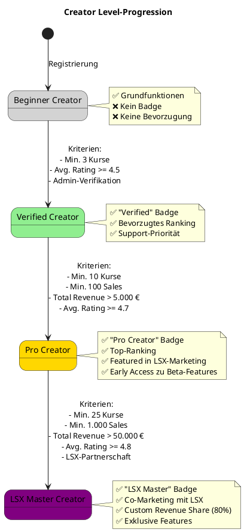

### Level-Kriterien-Tabelle

| Level | Kurse | Sales | Revenue | Avg. Rating | Besonderheiten |
|-------|-------|-------|---------|-------------|----------------|
| **Beginner** | 0-2 | 0-49 | < 1.000 € | Beliebig | Grundfunktionen |
| **Verified** | 3+ | 50+ | 1.000-5.000 € | >= 4.5 | Admin-Verifikation, "Verified" Badge |
| **Pro** | 10+ | 100+ | 5.000-50.000 € | >= 4.7 | Top-Ranking, Featured |
| **Master** | 25+ | 1.000+ | > 50.000 € | >= 4.8 | Custom Revenue Share (80%), Co-Marketing |

---

## 9. Qualitätskontrolle

### Quality-Check-Workflow

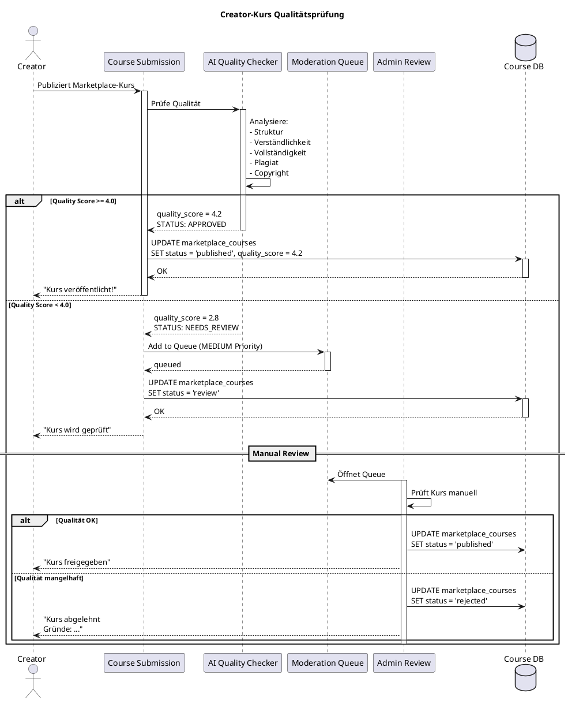

### Quality-Kriterien

| Kriterium | Gewichtung | Bewertung |
|-----------|------------|-----------|
| **Struktur** | 20% | Klare Gliederung, logischer Aufbau |
| **Verständlichkeit** | 25% | Sprache, Erklärungen, Beispiele |
| **Vollständigkeit** | 15% | Alle Themen abgedeckt |
| **Lernmethoden-Mix** | 15% | Vielfältige Methoden genutzt |
| **Theoriequalität** | 15% | Korrektheit, Tiefe |
| **Kein Plagiat** | 10% | Originalität |

**Mindest-Score für Auto-Approval:** 4.0 / 5.0

---

## 10. Creator-Analytics

### Analytics-Dashboard

```plantuml
@startuml
!include <C4/C4_Component>

title Creator Analytics Dashboard

Container_Boundary(creator_analytics, "Creator Analytics") {
  Component(revenue_charts, "Revenue-Charts", "Chart.js", "Einnahmen-Visualisierung")
  Component(sales_funnel, "Sales-Funnel", "Python", "Conversion-Tracking")
  Component(course_performance, "Course-Performance", "Python/Pandas", "Pro-Kurs-Metriken")
  Component(student_insights, "Student-Insights", "Python", "Lernenden-Verhalten")
  Component(rating_analysis, "Rating-Analyse", "Python/NLP", "Sentiment-Analyse")
  Component(comparison, "Markt-Vergleich", "Python", "Benchmarking")
}

Database(analytics_db, "Analytics DB", "PostgreSQL")
System_Ext(ai_insights, "AI-Insights", "Verbesserungsvorschläge")

Rel(revenue_charts, analytics_db, "Liest Revenue")
Rel(sales_funnel, analytics_db, "Liest Conversion")
Rel(course_performance, analytics_db, "Liest Performance")
Rel(student_insights, analytics_db, "Liest User-Daten")
Rel(rating_analysis, analytics_db, "Liest Reviews")
Rel(comparison, analytics_db, "Liest Marktdaten")

Rel(rating_analysis, ai_insights, "Nutzt AI für Sentiment")

@enduml
```

### Key Metriken

| Metrik | Beschreibung | Visualisierung |
|--------|--------------|----------------|
| **Total Revenue** | Gesamteinnahmen | Number + Trend |
| **Monthly Revenue** | Monatliche Einnahmen | Line Chart |
| **Sales Funnel** | Views → Enrollments → Purchases | Funnel Chart |
| **Conversion Rate** | (Sales / Views) * 100 | Percentage + Trend |
| **Avg. Rating** | Durchschnittsbewertung | Star Rating + Distribution |
| **Completion Rate** | Abschlussquote pro Kurs | Percentage + Bar Chart |
| **Student Retention** | Wiederkehrende Käufer | Percentage |
| **Top Courses** | Best-Seller | Table |
| **Revenue by Language** | Einnahmen pro Sprache | Pie Chart |
| **Growth Rate** | MoM Revenue-Wachstum | Percentage |

---

## 11. API-Endpoints

### Creator-API

| Endpoint | Methode | Beschreibung | Auth | Rolle |
|----------|---------|--------------|------|-------|
| `/api/creator/profile` | GET | Creator-Profil abrufen | ✅ | Creator |
| `/api/creator/profile` | PUT | Profil aktualisieren | ✅ | Creator |
| `/api/creator/courses` | GET | Alle Creator-Kurse | ✅ | Creator |
| `/api/creator/courses/:id/publish` | POST | Kurs publizieren | ✅ | Creator |
| `/api/creator/courses/:id/publish-global` | POST | Global Publishing | ✅ | Creator |
| `/api/creator/analytics/:course_id` | GET | Kurs-Analytics | ✅ | Creator |
| `/api/creator/revenue` | GET | Einnahmen-Übersicht | ✅ | Creator |
| `/api/creator/payouts` | GET | Auszahlungshistorie | ✅ | Creator |
| `/api/creator/pricing/recommend` | POST | KI-Preisempfehlung | ✅ | Creator |
| `/api/creator/translations/:course_id` | GET | Übersetzungsstatus | ✅ | Creator |
| `/api/creator/verify` | POST | Verifikation beantragen | ✅ | Creator |

### Beispiel-Request: Global Publishing

```http
POST /api/creator/courses/c1a2b3c4/publish-global
Authorization: Bearer <creator_token>
Content-Type: application/json

{
  "target_languages": ["en", "es", "fr", "it", "pt", "zh"],
  "auto_translate": true,
  "manual_review_required": false
}
```

**Response:**

```json
{
  "status": "success",
  "data": {
    "course_id": "c1a2b3c4",
    "publishing_job_id": "job_9x8y7z",
    "target_languages": ["en", "es", "fr", "it", "pt", "zh"],
    "estimated_completion": "2024-03-15T14:30:00Z",
    "translations": [
      {
        "language": "en",
        "status": "in_progress",
        "progress": 0
      },
      {
        "language": "es",
        "status": "pending",
        "progress": 0
      }
    ]
  },
  "message": "Global Publishing gestartet. Du erhältst eine Benachrichtigung, sobald alle Übersetzungen fertig sind."
}
```

---

## 12. Zusammenfassung

### ✅ Creator-Kernwerte

| Aspekt | Details |
|--------|---------|
| **Abo-Preis** | 29,99 € / Monat |
| **Tokens/Monat** | 20.000 |
| **Revenue Share** | 75% an Creator |
| **Auszahlung** | Monatlich via Stripe (Minimum 50 €) |
| **Global Publishing** | 20 Sprachen kostenlos |
| **Lernmethoden** | Alle 19 Content-LMs (A-C) |
| **Kurstypen** | Community, Marketplace, Privat, Beta |
| **Analytics** | Vollständig (Revenue, Sales, Conversion, Retention) |
| **Branding** | Creator-Profilseite, Verified Badge |
| **Support** | Priority (für Verified+) |

### 🎯 Design-Prinzipien

- **Fair für Creator:** 75% Revenue Share ist marktführend
- **Global Reach:** 20 Sprachen ohne Zusatzkosten
- **KI-First:** Alle Tools KI-gestützt
- **Quality über Quantity:** Level-System belohnt Qualität
- **Transparent:** Echtzeit-Einnahmen, klare Metriken
- **Skalierbar:** Business-Tools für professionelle Creator
- **Community-Driven:** Creator können auch kostenlos publizieren

---

## 📌 Dokument abgeschlossen

**Version:** 1.0
**Status:** Final
**Letzte Aktualisierung:** 2024

---

> 💡 **Hinweis:** Das Creator-Modell ist das wirtschaftliche Herzstück von LSX und ermöglicht es Experten weltweit, Wissen zu monetarisieren und gleichzeitig Lernenden Zugang zu hochwertigen Inhalten zu bieten.
