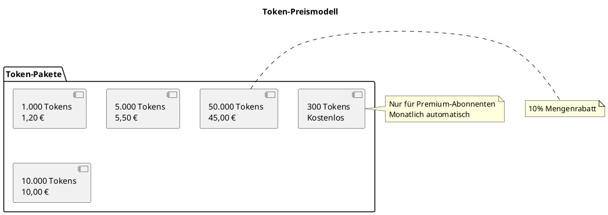
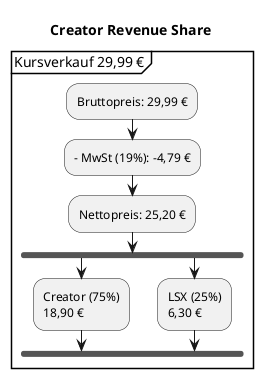
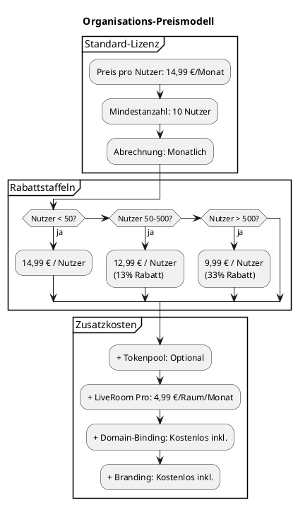
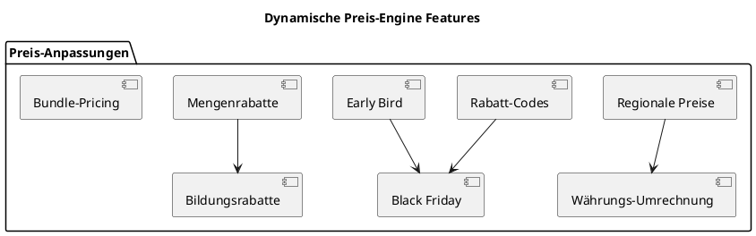
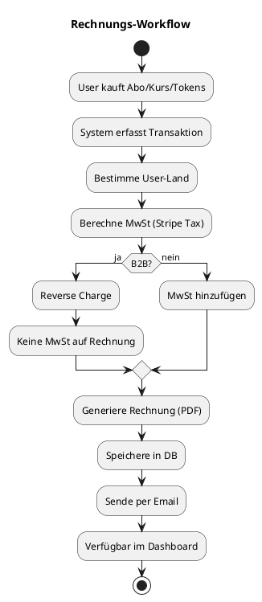

# 23 – Price-Engine (Final)

**Version:** 1.0
**Stand:** Final

---

## Überblick

Die **Price-Engine** ist das zentrale Business-System des LSX-Lernsystems und definiert alle Preis-, Zahlungs- und Monetarisierungs-Regeln.

### 🎯 Kernziele

- 💰 **Flexible Preismodelle** – Abos, Tokens, Kursverkäufe, Lizenzen
- 🎨 **Creator-Freundlich** – 75% Revenue Share
- 🏢 **Enterprise-Ready** – Planbare Kosten für Organisationen
- 🌍 **Global** – Multi-Währung, regionale Preise
- 📊 **Transparent** – Klare Abrechnung
- 🤖 **KI-Kostenmanagement** – Token-basierte Abrechnung
- 🔒 **Rechtssicher** – EU-Mehrwertsteuer, DSGVO-konform

---

## Systemarchitektur

### 🏗️ C4 Context Diagram

```plantuml
@startuml
!include https://raw.githubusercontent.com/plantuml-stdlib/C4-PlantUML/master/C4_Context.puml

LAYOUT_WITH_LEGEND()

title C4 Context - Price-Engine im LSX-Ökosystem

Person(user, "User", "Free/Premium")
Person(creator, "Creator", "Content-Verkäufer")
Person(org_admin, "Org Admin", "Schule/Unternehmen")

System(price_engine, "Price-Engine", "Zentrale Preis- & Abrechnungslogik")

System_Ext(stripe, "Stripe", "Zahlungsabwicklung")
System_Ext(paypal, "PayPal", "Alternative Zahlungsmethode")
System_Ext(tax_service, "Stripe Tax", "EU-Mehrwertsteuer")
System_Ext(user_system, "User-System", "Rollen, Token-Budget")
System_Ext(course_system, "Kurs-System", "Kursverkäufe")
System_Ext(ki_pipeline, "KI-Pipeline", "Token-Verbrauch")

Rel(user, price_engine, "Kauft Abo/Tokens", "HTTPS")
Rel(creator, price_engine, "Verkauft Kurse", "HTTPS")
Rel(org_admin, price_engine, "Zahlt Lizenzen", "HTTPS")

Rel(price_engine, stripe, "Verarbeitet Zahlungen", "REST API")
Rel(price_engine, paypal, "Alternative Zahlung", "REST API")
Rel(price_engine, tax_service, "Berechnet MwSt", "REST API")
Rel(price_engine, user_system, "Aktualisiert Budget", "REST API")
Rel(price_engine, course_system, "Lizenziert Kurse", "REST API")
Rel(price_engine, ki_pipeline, "Tracked Token-Kosten", "REST API")

@enduml
```

---

### 📦 C4 Container Diagram

```plantuml
@startuml
!include https://raw.githubusercontent.com/plantuml-stdlib/C4-PlantUML/master/C4_Container.puml

LAYOUT_WITH_LEGEND()

title C4 Container - Price-Engine Komponenten

Person(user, "User")

System_Boundary(price_system, "Price-Engine System") {
    Container(pricing_api, "Pricing API", "Flask Blueprint", "REST API für Preise & Zahlungen")
    Container(subscription_service, "Subscription Service", "Python", "Abo-Management")
    Container(token_service, "Token Service", "Python", "KI-Token-Verwaltung")
    Container(marketplace_service, "Marketplace Service", "Python", "Kursverkäufe")
    Container(invoice_generator, "Invoice Generator", "Python, Jinja2", "Rechnungserstellung")
    Container(payout_service, "Payout Service", "Python", "Creator-Auszahlungen")
    Container(tax_calculator, "Tax Calculator", "Python, Stripe Tax", "MwSt-Berechnung")
    ContainerDb(billing_db, "Billing DB", "PostgreSQL", "Transaktionen, Abos, Invoices")
}

System_Ext(stripe_api, "Stripe")
System_Ext(paypal_api, "PayPal")

Rel(user, pricing_api, "Kauft/Abonniert", "JSON/HTTPS")

Rel(pricing_api, subscription_service, "Abo-Verwaltung")
Rel(pricing_api, token_service, "Token-Kauf")
Rel(pricing_api, marketplace_service, "Kurs-Kauf")

Rel(subscription_service, stripe_api, "Subscription API", "REST")
Rel(token_service, billing_db, "Speichert Token-Käufe", "SQL")
Rel(marketplace_service, billing_db, "Speichert Transaktionen", "SQL")

Rel(subscription_service, invoice_generator, "Generiert Rechnung")
Rel(marketplace_service, payout_service, "Triggerrt Auszahlung")

Rel(tax_calculator, stripe_api, "Tax API", "REST")
Rel(invoice_generator, billing_db, "Speichert Rechnungen", "SQL")
Rel(payout_service, paypal_api, "Zahlt aus", "REST")

@enduml
```

---

## Preisstruktur-Übersicht

### 💰 4 Haupt-Preisbereiche

| Bereich | Beschreibung | Beispiele |
|---------|-------------|-----------|
| 🎫 **Abomodelle** | Monatliche/Jährliche Abos | Free, Premium (14,99 €/Monat) |
| 🤖 **Token-System** | KI-Nutzung | 1.000 Tokens = 1,20 € |
| 🛒 **Kursverkäufe** | Marketplace + Creator | 9,99 € - 59,99 € pro Kurs |
| 🏢 **Org-Lizenzen** | Schulen/Unternehmen | 14,99 €/Nutzer/Monat |

---

## Abomodelle

### 🆓 Free

| Feature | Status |
|---------|--------|
| KI-Zugriff | ❌ |
| Gruppe A (Erklaerend) | ✅ Teilweise |
| Gruppe B (Praxis) | ✅ Teilweise |
| Gruppe C (Pruefung) | ❌ |
| Community-Publishing | ❌ |
| Dashboard-Anpassung | ❌ |
| LiveRoom Basic | ❌ |
| Kurse kaufen | ✅ |

**Preis:** Kostenlos

---

### 💎 Premium

| Feature | Status | Details |
|---------|--------|---------|
| Alle 19 Content-Lernmethoden | ✅ | Konsumieren + Erstellen (privat) |
| KI-Zugriff | ✅ | 300 Tokens/Monat inkl. |
| Community-Publishing | ✅ | Nur kostenlos |
| Private Kurse | ✅ | Unbegrenzt |
| Dashboard-Anpassung | ✅ | Drag & Drop |
| LiveRoom Basic | ✅ | Max 4 Teilnehmer |
| Zusatz-Tokens | ✅ | Zukaufbar |

**Preis:** 14,99 € / Monat

---

### 🏆 Premium Jährlich

**Preis:** 149,99 € / Jahr (16% Rabatt)

**Vorteile:**
- Alle Premium-Features
- 2 Monate gratis
- 500 Tokens/Monat inkl. (statt 300)

---

## Token-System

### 🤖 KI-Token-Preise



---

### 📊 Token-Verbrauch Beispiele

| Aktion | Token-Verbrauch | Kosten (€) |
|--------|-----------------|------------|
| Theorieblatt generieren | 500-2.000 | 0,60 - 2,40 |
| Quiz (20 Fragen) | 200-800 | 0,24 - 0,96 |
| PDF → Kurs | 3.000-20.000 | 3,60 - 24,00 |
| Übersetzung (1 Kurs) | 1.000-10.000 | 1,20 - 12,00 |
| Video-Transkript (10 Min) | ~1.000 | 1,20 |
| Prüfungssimulation | 2.000-12.000 | 2,40 - 14,40 |
| Matheaufgaben (10 Stück) | 200-500 | 0,24 - 0,60 |
| Whiteboard-Erkennung | 50-150 | 0,06 - 0,18 |

---

## Kursverkäufe (Creator Marketplace)

### 💰 Pricing-Empfehlungen

| Kategorie | Preisbereich | Zielgruppe |
|-----------|--------------|------------|
| **Basis-Kurs** | 9,99 € - 19,99 € | Einsteiger, Schüler |
| **Standard-Kurs** | 29,99 € - 39,99 € | IHK, CompTIA, Berufsbildung |
| **Pro-Kurs** | 49,99 € - 59,99 € | Zertifizierungen, umfassende Kurse |
| **Bundle** | 79,99 € - 99,99 € | Mehrere Kurse kombiniert |

---

### 📊 Revenue-Share-Modell



**Wichtig:**
- Creator erhält **75%** vom Nettopreis
- LSX erhält **25%**
- MwSt wird automatisch abgeführt
- Promoted Kurse: **65/35**-Split

---

### 💸 Payout-Regeln

| Regel | Details |
|-------|---------|
| **Minimum-Schwelle** | 50,00 € |
| **Auszahlungsturnus** | Monatlich (15. des Monats) |
| **Methoden** | SEPA, PayPal, Stripe Connect |
| **Gebühren** | PayPal: 2,5%, SEPA: kostenlos |
| **Wartezeit** | 14 Tage nach Verkauf (Rückerstattungsschutz) |

---

## Organisation-Lizenzen

### 🏫 Schulen / 🏢 Unternehmen



---

### 📋 Lizenz-Features

| Feature | Inkludiert | Zusatzkosten |
|---------|-----------|--------------|
| **User-Management** | ✅ | - |
| **Klassen-Verwaltung** | ✅ | - |
| **Domain-Binding** | ✅ | - |
| **Branding** | ✅ | - |
| **Analytics** | ✅ | - |
| **KI-Basis-Tokens** | ✅ (100/User/Monat) | Tokenpool zukaufbar |
| **LiveRoom Basic** | ✅ | LiveRoom Pro optional |
| **Support** | Email | Premium-Support: +299 €/Monat |

---

## Dynamische Preislogik

### 🎯 Preis-Features



---

### 🌍 Regionale Preise

| Region | Premium-Preis | Anpassung |
|--------|---------------|-----------|
| **Deutschland** | 14,99 € | Basis |
| **USA** | $16,99 | +13% |
| **UK** | £12,99 | -13% |
| **Schweiz** | CHF 16,99 | +13% |
| **Osteuropa** | 9,99 € | -33% (PPP-adjustiert) |
| **Indien** | ₹999 (~11 €) | -27% (PPP-adjustiert) |

---

## Steuern & Rechnungen

### 🧾 Rechnungsstellung



---

### 💶 EU-Mehrwertsteuer

| Land | MwSt-Satz | Behandlung |
|------|-----------|------------|
| **Deutschland** | 19% | Standard |
| **Österreich** | 20% | Automatisch |
| **Frankreich** | 20% | Automatisch |
| **Niederlande** | 21% | Automatisch |
| **B2B (EU)** | 0% | Reverse Charge |
| **Nicht-EU** | 0% | Keine MwSt |

**Wichtig:** LSX nutzt **Stripe Tax** für automatische Berechnung.

---

## API-Dokumentation

### 🔌 Pricing-Endpoints

#### 1. Preise abrufen

```http
GET /api/pricing/list
```

**Response:**

```json
{
  "subscriptions": {
    "premium_monthly": {
      "price": 14.99,
      "currency": "EUR",
      "interval": "month",
      "features": ["all_methods", "300_tokens", "dashboard_customization"]
    },
    "premium_yearly": {
      "price": 149.99,
      "currency": "EUR",
      "interval": "year",
      "discount": "16%"
    }
  },
  "tokens": {
    "1000": {"price": 1.20, "currency": "EUR"},
    "5000": {"price": 5.50, "currency": "EUR"},
    "10000": {"price": 10.00, "currency": "EUR"}
  }
}
```

---

#### 2. Abo starten

```http
POST /api/subscription/start
Authorization: Bearer {jwt_token}
Content-Type: application/json
```

**Request:**

```json
{
  "plan": "premium_monthly",
  "payment_method_id": "pm_1234567890"
}
```

**Response:**

```json
{
  "subscription_id": "sub_xyz",
  "status": "active",
  "current_period_end": "2024-12-14T00:00:00Z",
  "invoice_url": "https://..."
}
```

---

#### 3. Token kaufen

```http
POST /api/token/buy
Authorization: Bearer {jwt_token}
Content-Type: application/json
```

**Request:**

```json
{
  "amount": 5000,
  "payment_method_id": "pm_1234567890"
}
```

**Response:**

```json
{
  "transaction_id": "txn_abc",
  "tokens_purchased": 5000,
  "price": 5.50,
  "currency": "EUR",
  "new_balance": 6200
}
```

---

#### 4. Kurs kaufen

```http
POST /api/course/{course_id}/purchase
Authorization: Bearer {jwt_token}
Content-Type: application/json
```

**Request:**

```json
{
  "payment_method_id": "pm_1234567890"
}
```

**Response:**

```json
{
  "purchase_id": "prc_xyz",
  "course_id": "course_123",
  "price": 29.99,
  "currency": "EUR",
  "access_granted": true,
  "invoice_url": "https://..."
}
```

---

#### 5. Creator-Auszahlung anfordern

```http
POST /api/creator/payout/request
Authorization: Bearer {jwt_token}
Content-Type: application/json
```

**Request:**

```json
{
  "method": "sepa",
  "iban": "DE89370400440532013000"
}
```

**Response:**

```json
{
  "payout_id": "payout_abc",
  "amount": 125.50,
  "currency": "EUR",
  "status": "pending",
  "estimated_arrival": "2024-11-20"
}
```

---

## Zusammenfassung

### ✅ Price-Engine Features

| Feature | Status | Beschreibung |
|---------|--------|-------------|
| 💰 **Flexible Abos** | ✅ | Monatlich/Jährlich |
| 🤖 **Token-System** | ✅ | KI-basierte Abrechnung |
| 🛒 **Marketplace** | ✅ | Creator-Verkäufe mit 75% Revenue Share |
| 🏢 **Org-Lizenzen** | ✅ | Schulen/Unternehmen mit Rabatten |
| 🌍 **Multi-Währung** | ✅ | EUR, USD, GBP, CHF, etc. |
| 🧾 **Auto-Rechnungen** | ✅ | PDF-Generierung |
| 💶 **EU-MwSt** | ✅ | Automatisch via Stripe Tax |
| 💸 **Creator-Payouts** | ✅ | SEPA, PayPal, Stripe |

---

### 💡 Kernaussage

> Die Price-Engine ist das **Business-Fundament** des LSX-Systems und ermöglicht **flexible Monetarisierung**, **faire Creator-Vergütung** und **planbare Enterprise-Kosten**.

---

### 🎯 Vorteile auf einen Blick

```
┌────────────────────────────────────────┐
│  💰 Transparente Preismodelle          │
│  🎨 Creator-freundlich (75% Share)     │
│  🏢 Enterprise-ready (Rabatte)         │
│  🌍 Global (Multi-Währung)             │
│  🤖 KI-Kostenmanagement                │
│  🧾 Auto-Rechnungen & MwSt             │
│  💸 Zuverlässige Payouts               │
│  📊 Umfassende Analytics               │
└────────────────────────────────────────┘
```

---

## 📌 Dokument abgeschlossen

**Version:** 1.0
**Status:** Final
**Letzte Aktualisierung:** November 2024

---

> 💡 **Hinweis:** Dieses Dokument beschreibt die vollständige Price-Engine des LSX-Systems. Es bildet die Grundlage für Monetarisierung, Abrechnungen und Creator-Vergütungen.
