# 08 – Schulen & Unternehmen (Final)

**Version:** 1.0
**Stand:** Final

---

## Überblick

Das LSX-System bietet eine vollständige Professional/Enterprise-Lösung für Bildungseinrichtungen und Unternehmen. Diese Ebene ermöglicht die Verwaltung großer Gruppen, professionelle Unterrichtswerkzeuge, kontrollierte Lernpfade, KI-gestützte Prüfungen und LiveRoom-Unterricht mit umfassendem Branding und Analytics.

### 🎯 Zielgruppen

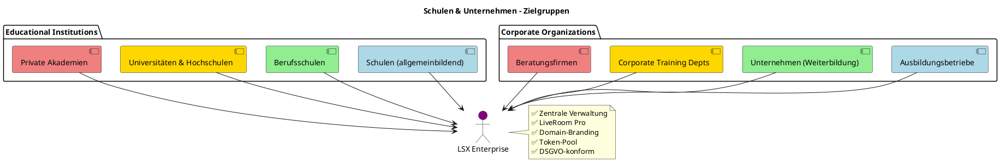

---

## C4 Architektur

### Context Diagram

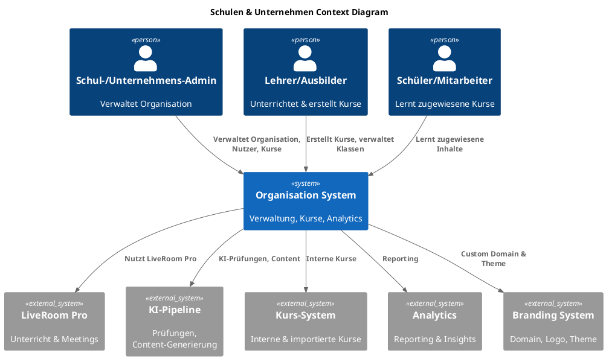

### Container Diagram

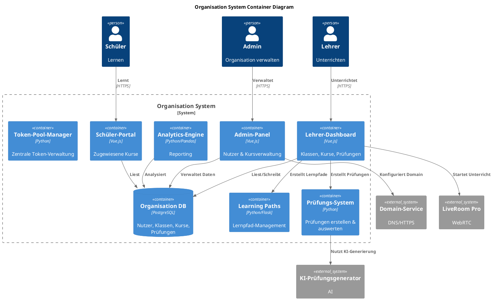

---

## Datenbankschema

### ER-Diagram: Organisationen

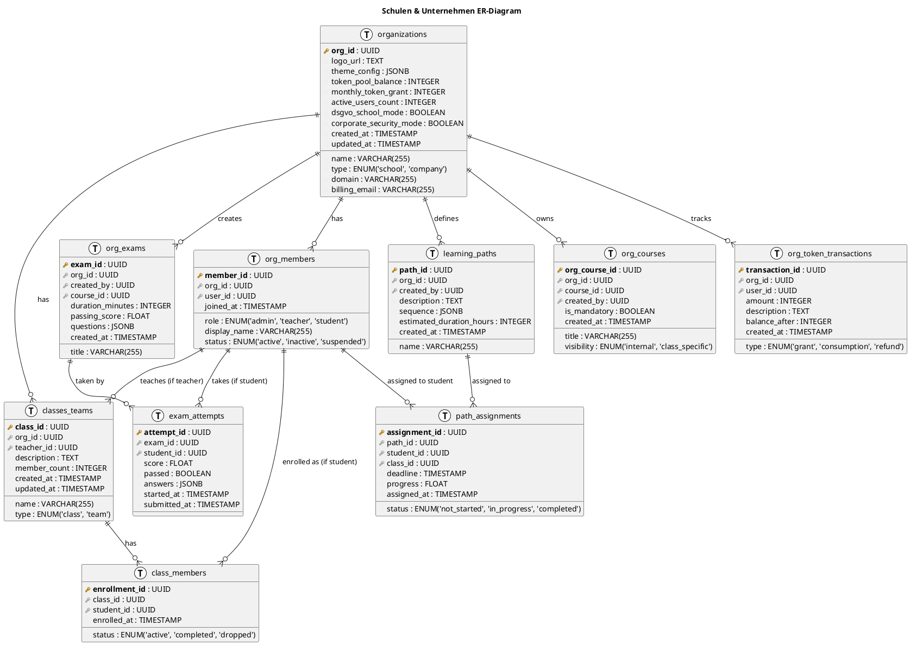

---

## 1. Ziel des Schul- & Unternehmensmodells

### Anforderungen

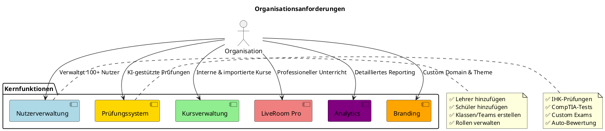

---

## 2. Rollen innerhalb von Organisationen

### Rollen-Hierarchie

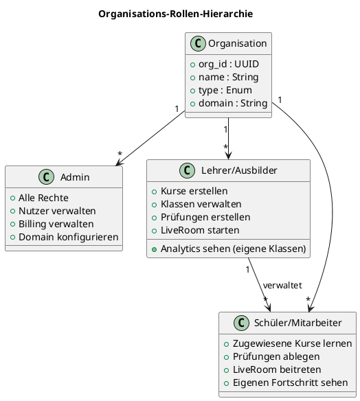

### Berechtigungsmatrix

| Funktion | Admin | Lehrer | Schüler |
|----------|-------|--------|---------|
| **Nutzer hinzufügen** | ✅ | ❌ | ❌ |
| **Nutzer löschen** | ✅ | ❌ | ❌ |
| **Klassen erstellen** | ✅ | ✅ (eigene) | ❌ |
| **Kurse erstellen** | ✅ | ✅ | ❌ |
| **Prüfungen erstellen** | ✅ | ✅ | ❌ |
| **LiveRoom starten** | ✅ | ✅ | ❌ |
| **LiveRoom beitreten** | ✅ | ✅ | ✅ (eingeladen) |
| **Analytics (alle)** | ✅ | ❌ | ❌ |
| **Analytics (eigene Klassen)** | ✅ | ✅ | ❌ |
| **Analytics (eigener Fortschritt)** | ✅ | ✅ | ✅ |
| **Domain konfigurieren** | ✅ | ❌ | ❌ |
| **Billing** | ✅ | ❌ | ❌ |
| **Token-Pool verwalten** | ✅ | ❌ | ❌ |

---

## 3. Organisations-Struktur

### Organisations-Aufbau

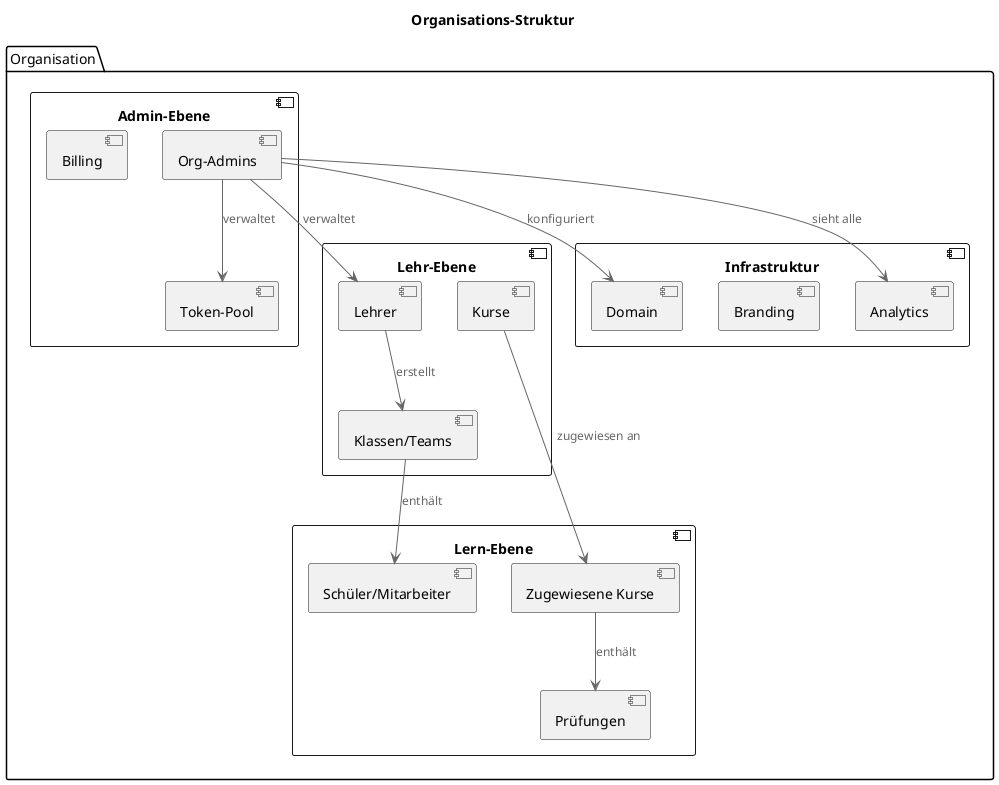

---

## 4. Domain-Branding

### Branding-Workflow

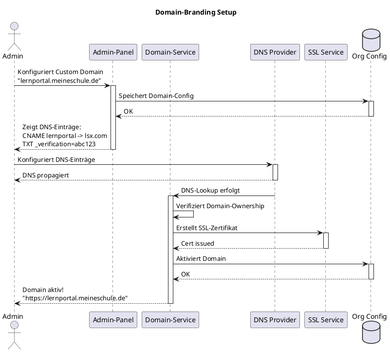

### Branding-Optionen

| Element | Anpassbar | Format | Beispiel |
|---------|-----------|--------|----------|
| **Domain** | ✅ | FQDN | lernportal.meineschule.de |
| **Logo** | ✅ | PNG, SVG (max 2MB) | logo.svg |
| **Farbschema** | ✅ | Hex Colors | Primary: #1E40AF |
| **Hintergrundbild** | ✅ | JPG, PNG (max 5MB) | background.jpg |
| **Favicon** | ✅ | ICO, PNG | favicon.ico |
| **Theme** | ✅ | Light/Dark/Custom | Custom |
| **Font** | ✅ | Google Fonts | Inter, Roboto |

**Theme-Konfiguration (JSON):**

```json
{
  "branding": {
    "domain": "lernportal.meineschule.de",
    "logo_url": "https://cdn.lsx.com/orgs/org_123/logo.svg",
    "colors": {
      "primary": "#1E40AF",
      "secondary": "#10B981",
      "accent": "#F59E0B",
      "background": "#F3F4F6",
      "text": "#111827"
    },
    "fonts": {
      "heading": "Inter",
      "body": "Roboto"
    },
    "theme_mode": "custom"
  }
}
```

---

## 5. Kursverwaltung

### Kurs-Typen

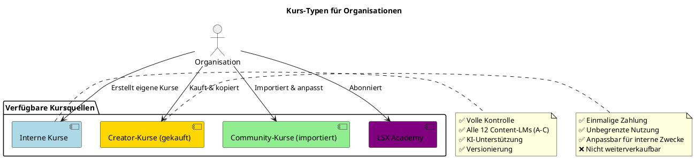

### Kurs-Erstellungs-Workflow

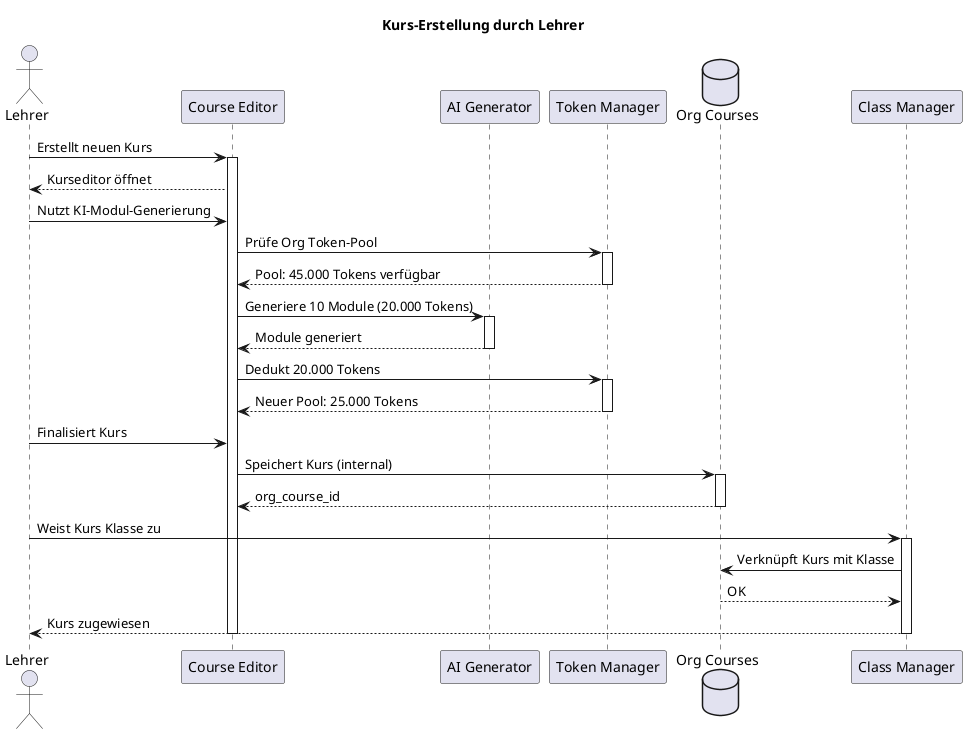

---

## 6. LiveRoom Pro

### LiveRoom-Architektur

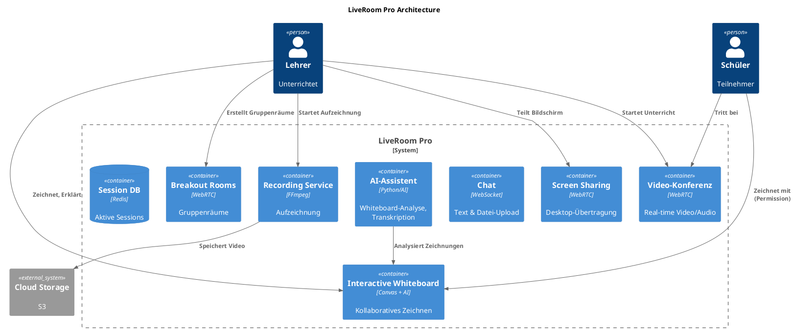

### Feature-Vergleich

| Feature | Free | Premium | Lehrer | Schule/Unternehmen |
|---------|------|---------|--------|---------------------|
| **Max. Teilnehmer** | ❌ | 4 | 20 | Unbegrenzt |
| **Whiteboard** | ❌ | Basic | Pro | Pro + AI |
| **Bildschirmfreigabe** | ❌ | ✅ | ✅ | ✅ |
| **Chat** | ❌ | ✅ | ✅ | ✅ |
| **Datei-Upload** | ❌ | ✅ (10MB) | ✅ (50MB) | ✅ (100MB) |
| **Breakout Rooms** | ❌ | ❌ | ✅ | ✅ |
| **Aufzeichnung** | ❌ | ❌ | ✅ | ✅ |
| **Transkription** | ❌ | ❌ | ❌ | ✅ (AI) |
| **Whiteboard-AI** | ❌ | ❌ | ❌ | ✅ |
| **Dauer (max)** | - | 2h | 4h | Unbegrenzt |

---

## 7. Prüfungswesen

### Prüfungs-Workflow

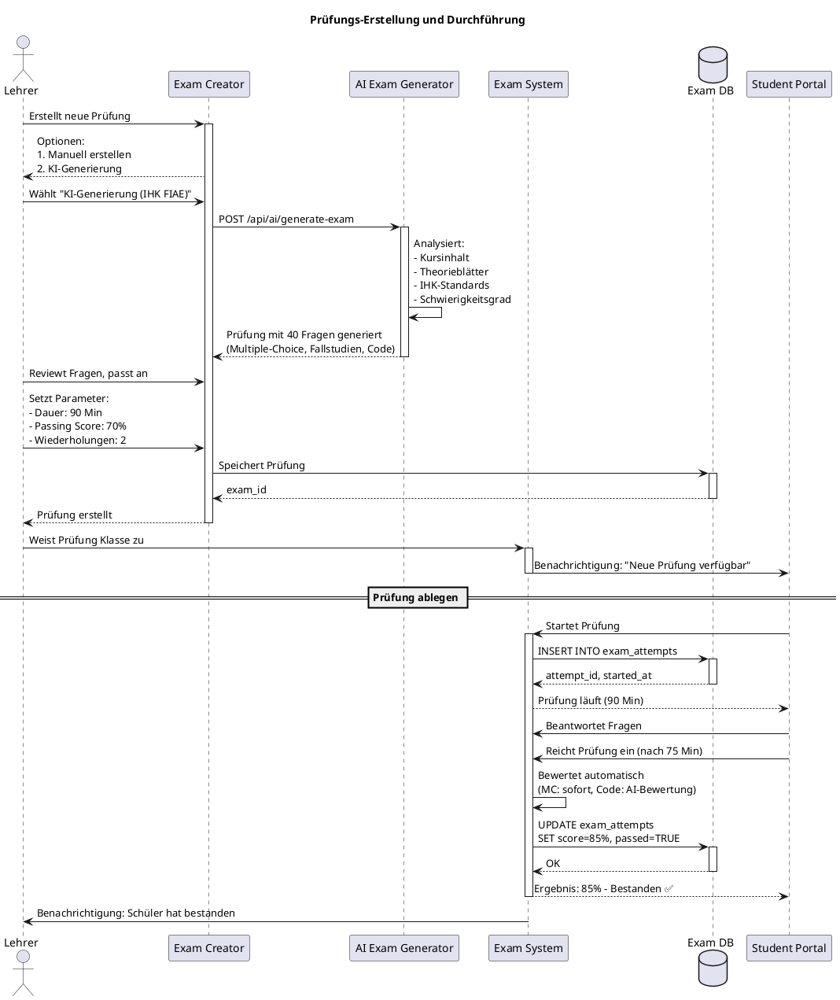

### KI-Prüfungsgenerator

**Unterstützte Prüfungstypen:**

| Typ | Beschreibung | KI-Unterstützung | Beispiele |
|-----|--------------|------------------|-----------|
| **IHK-Prüfungen** | Offizielle IHK-Standards | ✅ Vollständig | FIAE, FISI, Kaufmann |
| **CompTIA** | IT-Zertifizierungen | ✅ Vollständig | A+, Network+, Security+ |
| **Custom** | Eigene Prüfungen | ✅ Basis | Firmen-spezifisch |
| **Quiz** | Kurze Tests | ✅ Vollständig | Wissensabfragen |

---

## 8. Lernpfade (Learning Paths)

### Lernpfad-Struktur

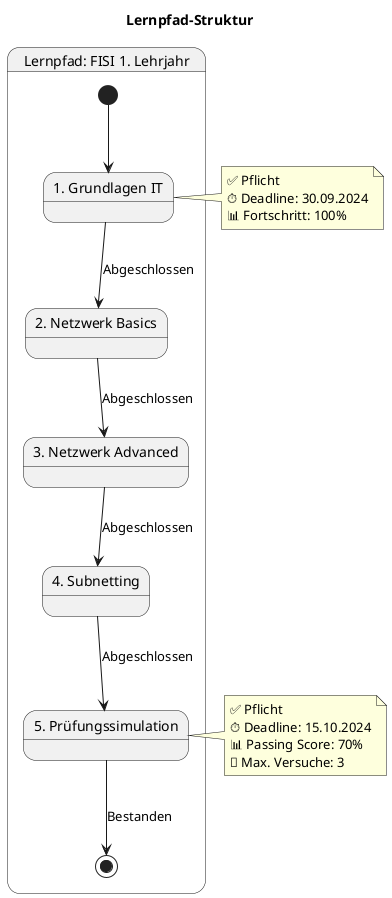

### Lernpfad-Features

```plantuml
@startuml
!include <C4/C4_Component>

title Learning Path System

Container_Boundary(lp_system, "Learning Path System") {
  Component(path_creator, "Path Creator", "Vue.js", "Lernpfade definieren")
  Component(path_engine, "Path Engine", "Python", "Fortschritt tracken")
  Component(deadline_mgr, "Deadline Manager", "Python/Celery", "Erinnerungen senden")
  Component(ai_optimizer, "AI-Optimizer", "Python/AI", "Adaptive Pfad-Anpassung")
}

Database(paths_db, "Paths DB", "PostgreSQL")
System_Ext(notification, "Notification Service", "Email/Push")

Rel(path_creator, paths_db, "Erstellt Pfade")
Rel(path_engine, paths_db, "Trackt Fortschritt")
Rel(deadline_mgr, notification, "Sendet Erinnerungen")
Rel(ai_optimizer, path_engine, "Passt Pfad an")

@enduml
```

**Lernpfad-Beispiel (JSON):**

```json
{
  "path_id": "path_fisi_year1",
  "name": "FISI 1. Lehrjahr",
  "description": "Kompletter Lernpfad für das erste Ausbildungsjahr",
  "estimated_duration_hours": 180,
  "sequence": [
    {
      "step": 1,
      "course_id": "course_grundlagen_it",
      "mandatory": true,
      "deadline": "2024-09-30",
      "estimated_hours": 40
    },
    {
      "step": 2,
      "course_id": "course_netzwerk_basics",
      "mandatory": true,
      "deadline": "2024-10-15",
      "estimated_hours": 30
    },
    {
      "step": 3,
      "course_id": "course_netzwerk_advanced",
      "mandatory": true,
      "deadline": "2024-11-01",
      "estimated_hours": 40
    },
    {
      "step": 4,
      "course_id": "course_subnetting",
      "mandatory": true,
      "deadline": "2024-11-20",
      "estimated_hours": 30
    },
    {
      "step": 5,
      "exam_id": "exam_ap1_sim",
      "mandatory": true,
      "deadline": "2024-12-15",
      "passing_score": 70,
      "max_attempts": 3
    }
  ]
}
```

---

## 9. Schüler-/Mitarbeiterverwaltung

### Verwaltungs-Workflow

```plantuml
@startuml
title Nutzer-Verwaltungs-Workflow

actor Admin
participant "Admin-Panel" as panel
database "Org Members" as members
participant "Email Service" as email
participant "Student Portal" as student_portal

Admin -> panel : Fügt neuen Schüler hinzu
activate panel

panel --> Admin : Formular:\n- Name: Max Mustermann\n- Email: max@schule.de\n- Klasse: 10A\n- Rolle: Student

Admin -> panel : Speichert

panel -> members : INSERT INTO org_members
activate members
members --> panel : member_id
deactivate members

panel -> email : Sendet Willkommens-Email mit Login-Daten
activate email
email --> panel : Sent
deactivate email

panel --> Admin : Schüler hinzugefügt
deactivate panel

== Schüler loggt ein ==

student "Max" -> student_portal : Login mit Credentials
activate student_portal

student_portal -> members : Authentifizierung
activate members
members --> student_portal : OK, Rolle: Student
deactivate members

student_portal --> student : Zugewiesene Kurse:\n- Mathematik Kl. 10\n- Physik Kl. 10\n- Englisch Kl. 10
deactivate student_portal

@enduml
```

### Verwaltungs-Aktionen

| Aktion | Beschreibung | Durchführbar von | API-Endpoint |
|--------|--------------|------------------|--------------|
| **Hinzufügen** | Neuen User anlegen | Admin | POST /api/orgs/:id/members |
| **Entfernen** | User deaktivieren | Admin | DELETE /api/orgs/:id/members/:member_id |
| **Bearbeiten** | Details anpassen | Admin, Lehrer (begrenzt) | PUT /api/orgs/:id/members/:member_id |
| **Klasse zuweisen** | User zu Klasse hinzufügen | Admin, Lehrer | POST /api/orgs/:id/classes/:class_id/members |
| **Fortschritt sehen** | Lernfortschritt tracken | Admin, Lehrer, Self | GET /api/orgs/:id/analytics/member/:member_id |
| **Prüfungen einsehen** | Prüfungsergebnisse | Admin, Lehrer, Self | GET /api/orgs/:id/exams/results/:member_id |
| **Lernzeit** | Zeiterfassung | Admin, Lehrer | GET /api/orgs/:id/analytics/time/:member_id |

### DSGVO-Schulmodus

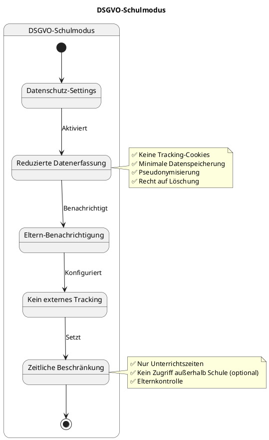

**DSGVO-Features:**

- ✅ Minimale Datenerfassung (nur notwendige Daten)
- ✅ Pseudonymisierung von Schülerdaten
- ✅ Kein externes Tracking (Google Analytics, etc.)
- ✅ Zugriffsbeschränkung auf Unterrichtszeiten
- ✅ Eltern-Dashboard (optional)
- ✅ Recht auf Löschung (automatisch nach Abschluss)
- ✅ Einwilligungsverwaltung

---

## 10. Analytics & Reporting

### Analytics-Dashboard

```plantuml
@startuml
!include <C4/C4_Component>

title Organisation Analytics Dashboard

Container_Boundary(analytics, "Analytics System") {
  Component(overview, "Übersichts-Dashboard", "Vue.js + Chart.js", "Org-wide Metriken")
  Component(class_analytics, "Klassen-Analytics", "Vue.js", "Pro-Klasse Insights")
  Component(student_progress, "Schüler-Fortschritt", "Python/Pandas", "Individuelles Tracking")
  Component(exam_analysis, "Prüfungs-Analyse", "Python", "Fehler-Cluster, Schwachstellen")
  Component(ai_insights, "AI-Insights", "Python/AI", "Verbesserungsvorschläge")
  Component(export_engine, "Export-Engine", "Python", "CSV, PDF, API")
}

Database(analytics_db, "Analytics DB", "PostgreSQL")
System_Ext(reporting_service, "Reporting Service", "Metabase")

Rel(overview, analytics_db, "Liest Metriken")
Rel(class_analytics, analytics_db, "Liest Klassen-Daten")
Rel(student_progress, analytics_db, "Trackt Fortschritt")
Rel(exam_analysis, analytics_db, "Analysiert Prüfungen")
Rel(ai_insights, exam_analysis, "Generiert Insights")

Rel(export_engine, reporting_service, "Exportiert Berichte")

@enduml
```

### Key Metriken

| Kategorie | Metrik | Beschreibung | Visualisierung |
|-----------|--------|--------------|----------------|
| **Übersicht** | Aktive Nutzer | Anzahl aktiver Schüler/Mitarbeiter | Number + Trend |
| **Übersicht** | Kurs-Completion-Rate | Abschlussquote aller Kurse | Percentage + Bar Chart |
| **Übersicht** | Durchschnittliche Lernzeit | Zeit pro User pro Woche | Number + Line Chart |
| **Klassen** | Fortschritt pro Klasse | Durchschnittlicher Fortschritt | Progress Bars |
| **Klassen** | Engagement-Rate | Aktivität der Klasse | Heatmap |
| **Schüler** | Individueller Fortschritt | Kurs-Completion pro Schüler | Timeline |
| **Schüler** | Lernzeit | Wöchentliche/Monatliche Zeit | Bar Chart |
| **Prüfungen** | Durchfallquote | Prozent nicht bestanden | Percentage |
| **Prüfungen** | Fehler-Cluster | Häufigste falsche Antworten | Word Cloud |
| **Prüfungen** | Durchschnittsscore | Avg. Prüfungsergebnis | Number + Distribution |

**Beispiel-Export (CSV):**

```csv
Schüler,Klasse,Kurs,Fortschritt,Lernzeit (h),Prüfungsergebnis
Max Mustermann,10A,Mathematik,85%,12.5,88%
Anna Schmidt,10A,Mathematik,92%,15.2,95%
Tom Müller,10A,Mathematik,45%,6.1,62% (nicht bestanden)
```

---

## 11. KI für Organisationen

### Token-Pool-System

```plantuml
@startuml
title Organisation Token-Pool

database "Org Token Pool" as pool {
  Balance: 50.000 Tokens
  Monthly Grant: 50.000
  Last Grant: 01.02.2024
}

participant "Lehrer 1" as t1
participant "Lehrer 2" as t2
participant "Lehrer 3" as t3
participant "Token Manager" as mgr

t1 -> mgr : Nutzt KI-Prüfungsgenerator (8.000 Tokens)
activate mgr
mgr -> pool : Deduct 8.000
pool --> mgr : New Balance: 42.000
mgr --> t1 : Prüfung generiert
deactivate mgr

t2 -> mgr : Nutzt KI-Modul-Generierung (5.000 Tokens)
activate mgr
mgr -> pool : Deduct 5.000
pool --> mgr : New Balance: 37.000
mgr --> t2 : Module generiert
deactivate mgr

t3 -> mgr : Nutzt Whiteboard-AI (2.000 Tokens)
activate mgr
mgr -> pool : Deduct 2.000
pool --> mgr : New Balance: 35.000
mgr --> t3 : Analyse fertig
deactivate mgr

note right of pool
  ✅ Zentrale Verwaltung
  ✅ Faire Verteilung
  ✅ Transparente Abrechnung
  ⚠️ Bei < 10% → Admin-Warnung
end note

@enduml
```

### KI-Features für Organisationen

| KI-Feature | Token-Kosten | Nutzer | Zweck |
|------------|--------------|--------|-------|
| **Foliensatz-Analyse** | 1.000-3.000 | Lehrer | PDF-Import, Content-Extraktion |
| **Theorie-Generierung** | 1.500-4.000 | Lehrer | Automatische Theorieblätter |
| **Quiz-Erstellung** | 500-2.000 | Lehrer | Fragenpool aufbauen |
| **Prüfungs-Generierung** | 5.000-12.000 | Lehrer | Vollständige IHK/CompTIA-Tests |
| **Lernpfad-Optimierung** | 2.000-5.000 | Admin | Adaptive Anpassung |
| **Fehleranalyse** | 1.000-3.000 | Lehrer | Schülerdaten auswerten |
| **Whiteboard-Analyse** | 500-1.500 | Lehrer | Handschrifterkennung |
| **Zusammenfassungen** | 300-800 | Schüler (mit Permission) | Content-Kondensierung |

---

## 12. Preismodell

### Pricing-Struktur

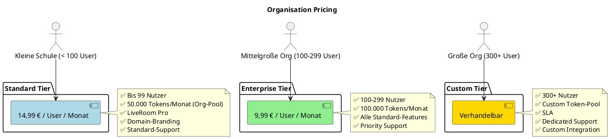

**Preis-Beispiele:**

| Organisation | Nutzer | Tier | Preis/Monat | Tokens/Monat |
|--------------|--------|------|-------------|--------------|
| Kleine Schule | 50 | Standard | 50 × 14,99 € = 749,50 € | 50.000 |
| Mittelgroße Firma | 150 | Enterprise | 150 × 9,99 € = 1.498,50 € | 100.000 |
| Große Universität | 500 | Custom | ~4.000 € (negotiated) | 250.000 |

**Zusatzkosten:**

- 🤖 **Zusätzliche Tokens:** 10.000 Tokens = 25 € (on-demand)
- 🎬 **Recording-Speicher:** 100 GB = 10 € / Monat (über Inklusiv hinaus)
- 📊 **Premium-Analytics:** 50 € / Monat (erweiterte Dashboards)

---

## 13. Unterschiede Schule vs. Unternehmen

### Feature-Mapping

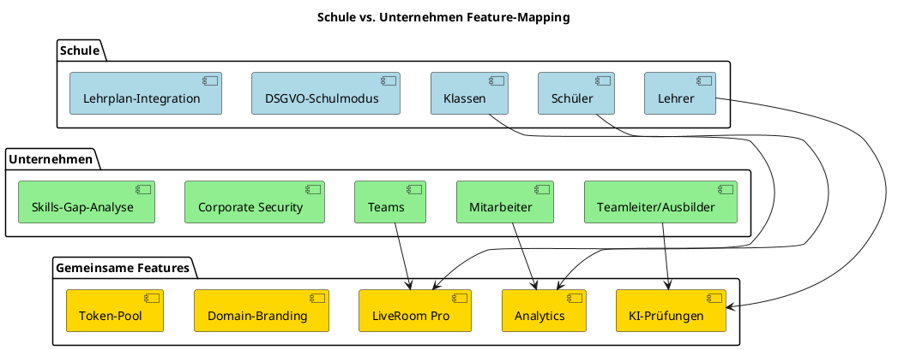

### Vergleichstabelle

| Aspekt | Schule | Unternehmen |
|--------|--------|-------------|
| **Primäres Ziel** | Bildung & Ausbildung | Weiterbildung & Compliance |
| **Gruppierung** | Klassen | Teams |
| **Teilnehmer** | Schüler | Mitarbeiter |
| **Lehrende** | Lehrer | Ausbilder, Teamleiter |
| **Datenschutz** | DSGVO-Schulmodus (Minderjährige) | Corporate Security (Firmengeheimnisse) |
| **Prüfungen** | IHK, Schulprüfungen | CompTIA, Firmenzertifikate |
| **Zeitplan** | Schuljahr, Stundenplan | Flexibel, On-Demand |
| **Eltern-Integration** | Ja (optional) | Nein |
| **Reporting** | Schulleitung, Eltern | Management, HR |
| **Compliance** | Lehrplan-konform | ISO, Branchen-spezifisch |

---

## 14. API-Endpoints

### Organisation-API

| Endpoint | Methode | Beschreibung | Auth | Rolle |
|----------|---------|--------------|------|-------|
| `/api/orgs/:id` | GET | Organisation abrufen | ✅ | Admin |
| `/api/orgs/:id` | PUT | Organisation aktualisieren | ✅ | Admin |
| `/api/orgs/:id/members` | GET | Alle Mitglieder | ✅ | Admin, Lehrer |
| `/api/orgs/:id/members` | POST | Neues Mitglied hinzufügen | ✅ | Admin |
| `/api/orgs/:id/members/:member_id` | DELETE | Mitglied entfernen | ✅ | Admin |
| `/api/orgs/:id/classes` | GET | Alle Klassen/Teams | ✅ | Admin, Lehrer |
| `/api/orgs/:id/classes` | POST | Neue Klasse erstellen | ✅ | Admin, Lehrer |
| `/api/orgs/:id/classes/:class_id/members` | POST | Mitglied zu Klasse hinzufügen | ✅ | Admin, Lehrer |
| `/api/orgs/:id/courses` | GET | Org-Kurse | ✅ | Admin, Lehrer |
| `/api/orgs/:id/courses` | POST | Neuer Kurs | ✅ | Admin, Lehrer |
| `/api/orgs/:id/exams` | POST | Prüfung erstellen | ✅ | Admin, Lehrer |
| `/api/orgs/:id/learning-paths` | GET | Lernpfade | ✅ | Admin, Lehrer |
| `/api/orgs/:id/learning-paths` | POST | Lernpfad erstellen | ✅ | Admin, Lehrer |
| `/api/orgs/:id/analytics` | GET | Organisation-Analytics | ✅ | Admin |
| `/api/orgs/:id/analytics/class/:class_id` | GET | Klassen-Analytics | ✅ | Admin, Lehrer (eigene) |
| `/api/orgs/:id/token-pool` | GET | Token-Pool Status | ✅ | Admin |

### Beispiel-Request: Member hinzufügen

```http
POST /api/orgs/org_abc123/members
Authorization: Bearer <admin_token>
Content-Type: application/json

{
  "email": "max.mustermann@schule.de",
  "display_name": "Max Mustermann",
  "role": "student",
  "classes": ["class_10a", "class_mathematik"]
}
```

**Response:**

```json
{
  "status": "success",
  "data": {
    "member_id": "mem_xyz789",
    "user_id": "user_123",
    "org_id": "org_abc123",
    "email": "max.mustermann@schule.de",
    "display_name": "Max Mustermann",
    "role": "student",
    "status": "active",
    "joined_at": "2024-02-15T10:00:00Z"
  },
  "message": "Mitglied hinzugefügt. Willkommens-Email wurde versendet."
}
```

---

## 15. Zusammenfassung

### ✅ Kernfunktionen

| Feature | Status | Details |
|---------|--------|---------|
| **Nutzerverwaltung** | ✅ | Unbegrenzte Nutzer, Rollen, Klassen |
| **Kursverwaltung** | ✅ | Interne Kurse, Importe, 12 Content-LMs (A-C) |
| **LiveRoom Pro** | ✅ | Unbegrenzte Teilnehmer, Aufzeichnung, Breakout Rooms |
| **Prüfungssystem** | ✅ | KI-Generierung (IHK, CompTIA), Auto-Bewertung |
| **Lernpfade** | ✅ | Strukturierte Pfade, Deadlines, AI-Optimierung |
| **Domain-Branding** | ✅ | Custom Domain, Logo, Theme |
| **Token-Pool** | ✅ | Zentrale Verwaltung, transparente Abrechnung |
| **Analytics** | ✅ | Umfassendes Reporting, Export (CSV, PDF, API) |
| **DSGVO-Modus** | ✅ | Schulkonformer Datenschutz |
| **Corporate Security** | ✅ | Enterprise-Grade Security |

### 🎯 Alleinstellungsmerkmale

**Was LSX für Organisationen besonders macht:**

1. **🤖 KI-First:** Vollständig integrierte KI (Prüfungen, Content, Analytics)
2. **🎥 LiveRoom Pro:** Professionelles Online-Teaching mit Aufzeichnung
3. **📊 Datengetriebene Optimierung:** AI-Insights zur Lernverbesserung
4. **🌐 White-Label:** Custom Domain & Branding
5. **💰 Faire Preise:** Transparente, nutzungsbasierte Abrechnung
6. **🔒 Datenschutz:** DSGVO-konform (Schulen) + Corporate Security

---

## 📌 Dokument abgeschlossen

**Version:** 1.0
**Status:** Final
**Letzte Aktualisierung:** 2024

---

> 💡 **Hinweis:** Dieses Dokument definiert die Professional/Enterprise-Ebene des LSX-Systems für Bildungseinrichtungen und Unternehmen mit vollständiger Verwaltung, professionellen Tools und umfassenden Analytics.
