# 25_Organisation-System.md (Final)
Version: 1.0
Stand: Final

Dieses Dokument beschreibt das gesamte Organisationssystem von LSX.
Organisationen umfassen **Schulen**, **Unternehmen**, **Lehrer/Dozenten**, **Bildungsträger**, **Akademien** und **Teams**.
Das Organisationssystem ist einer der wichtigsten Bausteine des LSX-Ökosystems, weil es:

- strukturierte Benutzerverwaltung ermöglicht
- Rollen sauber trennt
- Tokenpools verwaltet
- Kurse zentralisiert
- eigene Dashboards bereitstellt
- eigene Domains anbinden kann
- Branding und Einstellungen je Organisation erlaubt

---

# 1. Architektur-Übersicht

## 1.1 C4 Context Diagramm – Organisation-System

```plantuml
@startuml
!include https://raw.githubusercontent.com/plantuml-stdlib/C4-PlantUML/master/C4_Context.puml

LAYOUT_WITH_LEGEND()

title C4 Context - Organisation-System im LSX Ökosystem

Person(org_admin, "Organisation Admin", "Verwaltet Org, Nutzer, Klassen, Tokenpool")
Person(teacher, "Lehrer/Trainer", "Verwaltet Klassen, Kurse, Prüfungen")
Person(student, "Schüler/Mitarbeiter", "Bearbeitet zugewiesene Kurse")

System(org_system, "Organisation-System", "Verwaltet Schulen, Firmen, Teams mit Nutzern, Klassen, Tokenpools")

System_Ext(kurs_system, "Kurs-System", "Stellt Kurse bereit")
System_Ext(ki_system, "KI-System", "Generiert Inhalte")
System_Ext(liveroom, "LiveRoom-System", "Video-Räume für Unterricht")
System_Ext(analytics, "Analytics-System", "Statistiken & Reports")
System_Ext(price_engine, "Price-Engine", "Abrechnung & Rechnungen")
System_Ext(admin_system, "Admin-System", "LSX-Administration")

Rel(org_admin, org_system, "Verwaltet Organisation", "HTTPS/REST")
Rel(teacher, org_system, "Verwaltet Klassen & Kurse", "HTTPS/REST")
Rel(student, org_system, "Nutzt zugewiesene Kurse", "HTTPS/REST")

Rel(org_system, kurs_system, "Importiert & zuweist Kurse", "REST API")
Rel(org_system, ki_system, "Nutzt KI aus Tokenpool", "REST API")
Rel(org_system, liveroom, "Erstellt LiveRooms", "REST API")
Rel(org_system, analytics, "Liefert Org-Daten", "REST API")
Rel(org_system, price_engine, "Abrechnung & Billing", "REST API")
Rel(org_system, admin_system, "Admin-Überwachung", "REST API")

@enduml
```

## 1.2 C4 Container Diagramm – Organisation-System

```plantuml
@startuml
!include https://raw.githubusercontent.com/plantuml-stdlib/C4-PlantUML/master/C4_Container.puml

LAYOUT_WITH_LEGEND()

title C4 Container - Organisation-System Komponenten

Person(org_admin, "Org Admin", "Verwaltet Organisation")
Person(teacher, "Lehrer", "Verwaltet Klassen")
Person(student, "Schüler", "Nutzt Kurse")

Container(org_frontend, "Organisation Frontend", "Vue.js 3", "Org-Dashboard, Nutzer-, Klassen-, Kurs-Verwaltung")
Container(org_api, "Organisation API", "Flask Blueprint", "REST API für Org-Verwaltung")
Container(org_service, "Organisation Service", "Python", "Geschäftslogik für Orgs, Klassen, Nutzer")
Container(user_mgmt, "User Management", "Python", "Nutzer hinzufügen, deaktivieren, Rollen")
Container(class_mgmt, "Class Management", "Python", "Klassen erstellen, Schüler zuweisen")
Container(tokenpool_service, "Tokenpool Service", "Python", "Tokenpool kaufen, verwalten, tracken")
Container(domain_service, "Domain Binding Service", "Python", "CNAME-Verifikation, TLS-Zertifikate")
Container(branding_service, "Branding Service", "Python", "Logo, Farben, Custom UI")
Container(billing_service, "Billing Service", "Python", "Rechnungen, Nutzerzahlen, Tokenverbrauch")

ContainerDb(org_db, "Organisation DB", "PostgreSQL", "Orgs, Users, Klassen, Tokenpool")
ContainerDb(redis, "Redis Cache", "Redis", "Org-Settings, Nutzer-Rollen")

Rel(org_admin, org_frontend, "Verwaltet Org", "HTTPS")
Rel(teacher, org_frontend, "Verwaltet Klassen", "HTTPS")
Rel(student, org_frontend, "Sieht zugewiesene Kurse", "HTTPS")

Rel(org_frontend, org_api, "REST Calls", "HTTPS/JSON")
Rel(org_api, org_service, "Business Logic", "Python")
Rel(org_api, user_mgmt, "User Operations", "Python")
Rel(org_api, class_mgmt, "Class Operations", "Python")
Rel(org_api, tokenpool_service, "Token Operations", "Python")
Rel(org_api, domain_service, "Domain Operations", "Python")
Rel(org_api, branding_service, "Branding Operations", "Python")
Rel(org_api, billing_service, "Billing Operations", "Python")

Rel(org_service, org_db, "CRUD Operations", "SQL")
Rel(user_mgmt, org_db, "User CRUD", "SQL")
Rel(class_mgmt, org_db, "Class CRUD", "SQL")
Rel(tokenpool_service, org_db, "Token CRUD", "SQL")
Rel(domain_service, org_db, "Domain CRUD", "SQL")
Rel(branding_service, org_db, "Branding CRUD", "SQL")
Rel(billing_service, org_db, "Billing Queries", "SQL")

Rel(org_service, redis, "Cache Org-Settings", "Redis Protocol")
Rel(user_mgmt, redis, "Cache User-Roles", "Redis Protocol")

@enduml
```

---

# 2. Ziele des Organisationssystems

Das Organisationssystem soll:

- ein skalierbares Konstrukt für hunderte bis tausende Nutzer bieten
- klare Rollen- und Rechteverteilung ermöglichen
- Schulen und Firmen vollständig autonom arbeiten lassen
- Integration mit KI-, Kurs-, LiveRoom- und Analytic-System ermöglichen
- Abrechnung pro Organisation ermöglichen
- Domain-Binding und Branding unterstützen
- LMS-Funktionalität (wie Moodle, Google Classroom, Teams) bereitstellen

**Kernvorteile:**

✅ **Skalierbarkeit** – Tausende Nutzer pro Organisation
✅ **Autonomie** – Organisationen verwalten sich selbst
✅ **Flexibilität** – 4 Organisationstypen für verschiedene Anwendungsfälle
✅ **Integration** – Nahtlose Anbindung an LSX-Ökosystem
✅ **White-Label** – Eigenes Branding und Domain möglich
✅ **B2B-Potenzial** – Schulen, Firmen, Bildungsträger als Kunden

---

# 3. Organisationsarten

LSX unterscheidet zwischen vier grundlegenden Organisationstypen:

```plantuml
@startuml
title Organisationstypen im LSX-System

rectangle "LSX Organisationen" {
  rectangle "Schule" as school #LightBlue {
    + Berufsschulen
    + Privatschulen
    + Hochschulen
    + Volkshochschulen
    --
    Features:
    • Klassen-System
    • Schüler-Verwaltung
    • Prüfungen
    • Zeugnisse
  }

  rectangle "Unternehmen" as company #LightGreen {
    + Firmen
    + Abteilungen
    + IT-Akademien
    + Consulting-Firmen
    --
    Features:
    • Mitarbeiter-Schulung
    • Compliance-Training
    • Abteilungs-Struktur
    • Team-Management
  }

  rectangle "Lehrer/Dozenten-Team" as teacher #LightYellow {
    + Einzelne Dozenten
    + Kleine Gruppen
    + Nachhilfe-Lehrer
    + Freelance-Trainer
    --
    Features:
    • Kurs-Erstellung
    • Schüler-Gruppen
    • Whiteboard
    • LiveRooms
  }

  rectangle "Creator-Team" as creator #LightPink {
    + Creator mit Mitarbeitern
    + Content-Teams
    + Akademie-Betreiber
    --
    Features:
    • Team-Kollaboration
    • Kurs-Co-Authoring
    • Shared Revenue
    • Projekt-Management
  }
}

@enduml
```

## 3.1 Vergleichstabelle

| Organisationstyp | Zielgruppe | Hauptfunktionen | Billing-Model |
|------------------|------------|-----------------|---------------|
| **Schule** | Berufsschulen, Privatschulen, Hochschulen | Klassen, Schüler, Prüfungen, Zeugnisse | Pro aktiver Nutzer + Tokenpool |
| **Unternehmen** | Firmen, Abteilungen, IT-Akademien | Mitarbeiter-Schulung, Compliance, Teams | Pro Mitarbeiter + Tokenpool |
| **Lehrer/Dozenten-Team** | Einzelne Dozenten oder kleine Gruppen | Kurs-Erstellung, Schüler-Gruppen, LiveRooms | Flat-Fee + Tokenpool |
| **Creator-Team** | Creator mit Mitarbeitern | Team-Kollaboration, Co-Authoring | Umsatzbeteiligung |

---

# 4. Datenmodell – Organisation-System

## 4.1 ER-Diagramm – Organisation-Entitäten

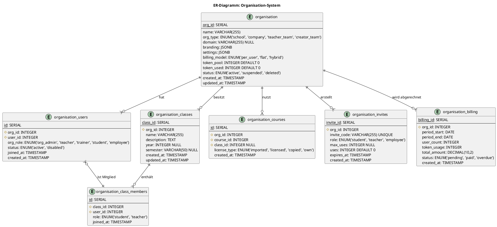

## 4.2 Schema-Details

### 4.2.1 organisation

| Feld | Typ | Beschreibung |
|------|-----|--------------|
| **org_id** | SERIAL PK | Eindeutige Organisation-ID |
| **name** | VARCHAR(255) | Name der Organisation |
| **org_type** | ENUM | Typ: school, company, teacher_team, creator_team |
| **domain** | VARCHAR(255) NULL | Custom Domain (z.B. schule123.de) |
| **branding** | JSONB | Logo, Farben, Custom CSS |
| **settings** | JSONB | Einstellungen (Features, Limits, Preferences) |
| **billing_model** | ENUM | per_user, flat, hybrid |
| **token_pool** | INTEGER | Verfügbare Tokens |
| **token_used** | INTEGER | Bereits verbrauchte Tokens |
| **status** | ENUM | active, suspended, deleted |
| **created_at** | TIMESTAMP | Erstellungsdatum |
| **updated_at** | TIMESTAMP | Letzte Änderung |

**Branding JSON Beispiel:**
```json
{
  "logo_url": "https://cdn.lsx.de/org/123/logo.png",
  "primary_color": "#1E40AF",
  "secondary_color": "#F59E0B",
  "custom_css": "body { font-family: 'Inter'; }",
  "welcome_message": "Willkommen an der Berufsschule XYZ"
}
```

**Settings JSON Beispiel:**
```json
{
  "features": {
    "liveroom_enabled": true,
    "whiteboard_enabled": true,
    "exams_enabled": true,
    "ai_enabled": true
  },
  "limits": {
    "max_users": 500,
    "max_classes": 50,
    "max_courses": 200
  },
  "preferences": {
    "language": "de",
    "timezone": "Europe/Berlin",
    "notifications_enabled": true
  }
}
```

### 4.2.2 organisation_users

| Feld | Typ | Beschreibung |
|------|-----|--------------|
| **id** | SERIAL PK | Eindeutige ID |
| **org_id** | INTEGER FK | Verknüpfung zu organisation |
| **user_id** | INTEGER FK | Verknüpfung zu users |
| **org_role** | ENUM | org_admin, teacher, trainer, student, employee |
| **status** | ENUM | active, disabled |
| **joined_at** | TIMESTAMP | Beitrittsdatum |
| **created_at** | TIMESTAMP | Erstellungsdatum |

### 4.2.3 organisation_classes

| Feld | Typ | Beschreibung |
|------|-----|--------------|
| **class_id** | SERIAL PK | Eindeutige Klassen-ID |
| **org_id** | INTEGER FK | Verknüpfung zu organisation |
| **name** | VARCHAR(255) | Klassenname (z.B. "10A", "Python-Kurs 2025") |
| **description** | TEXT | Beschreibung |
| **year** | INTEGER NULL | Jahrgang (z.B. 2025) |
| **semester** | VARCHAR(50) NULL | Semester (z.B. "WS 2025/26") |
| **created_at** | TIMESTAMP | Erstellungsdatum |
| **updated_at** | TIMESTAMP | Letzte Änderung |

### 4.2.4 organisation_class_members

| Feld | Typ | Beschreibung |
|------|-----|--------------|
| **id** | SERIAL PK | Eindeutige ID |
| **class_id** | INTEGER FK | Verknüpfung zu organisation_classes |
| **user_id** | INTEGER FK | Verknüpfung zu users |
| **role** | ENUM | student, teacher |
| **joined_at** | TIMESTAMP | Beitrittsdatum |

### 4.2.5 organisation_courses

| Feld | Typ | Beschreibung |
|------|-----|--------------|
| **id** | SERIAL PK | Eindeutige ID |
| **org_id** | INTEGER FK | Verknüpfung zu organisation |
| **course_id** | INTEGER FK | Verknüpfung zu courses |
| **class_id** | INTEGER FK NULL | Optional: Zuweisung zu Klasse |
| **license_type** | ENUM | imported, licensed, copied, own |
| **created_at** | TIMESTAMP | Erstellungsdatum |

**License Types:**
- **imported**: Aus LSX Academy importiert
- **licensed**: Von Creator lizenziert (B2B)
- **copied**: Community-Kurs kopiert
- **own**: Selbst erstellt

### 4.2.6 organisation_invites

| Feld | Typ | Beschreibung |
|------|-----|--------------|
| **invite_id** | SERIAL PK | Eindeutige Einladungs-ID |
| **org_id** | INTEGER FK | Verknüpfung zu organisation |
| **invite_code** | VARCHAR(255) UNIQUE | Einladungscode (z.B. "SCHULE123-ABC") |
| **role** | ENUM | Zielrolle: student, teacher, employee |
| **max_uses** | INTEGER NULL | Max. Nutzungen (NULL = unbegrenzt) |
| **uses** | INTEGER | Bisherige Nutzungen |
| **expires_at** | TIMESTAMP | Ablaufdatum |
| **created_at** | TIMESTAMP | Erstellungsdatum |

### 4.2.7 organisation_billing

| Feld | Typ | Beschreibung |
|------|-----|--------------|
| **billing_id** | SERIAL PK | Eindeutige Rechnungs-ID |
| **org_id** | INTEGER FK | Verknüpfung zu organisation |
| **period_start** | DATE | Abrechnungszeitraum Start |
| **period_end** | DATE | Abrechnungszeitraum Ende |
| **user_count** | INTEGER | Anzahl aktiver Nutzer |
| **token_usage** | INTEGER | Tokenverbrauch im Zeitraum |
| **total_amount** | DECIMAL(10,2) | Gesamtbetrag |
| **status** | ENUM | pending, paid, overdue |
| **created_at** | TIMESTAMP | Erstellungsdatum |

---

# 5. Rollen innerhalb einer Organisation

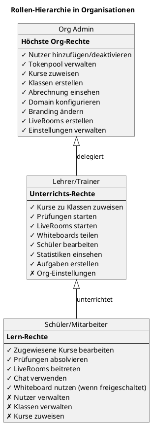

## 5.1 Organisation Admin

**Vollständige Kontrolle über die Organisation:**

✅ **Nutzerverwaltung:**
- Nutzer hinzufügen (einzeln oder CSV-Import)
- Nutzer deaktivieren/löschen
- Rollen ändern
- Einladungslinks generieren

✅ **Tokenpool:**
- Token kaufen
- Tokenverbrauch überwachen
- Token-Limits pro Nutzer/Klasse setzen

✅ **Kurse:**
- Academy-Kurse importieren
- Creator-Kurse lizenzieren
- Kurse zu Klassen zuweisen
- Eigene Kurse erstellen

✅ **Klassen:**
- Klassen erstellen
- Schüler/Lehrer zuweisen
- Klassen-Statistiken einsehen

✅ **Abrechnung:**
- Rechnungen einsehen
- Nutzerzahlen prüfen
- Tokenverbrauch pro Abteilung

✅ **Domain & Branding:**
- Custom Domain anbinden
- Logo hochladen
- Farben anpassen
- Welcome Message definieren

✅ **LiveRooms:**
- LiveRooms für Klassen erstellen
- Lehrer berechtigen

## 5.2 Lehrer / Dozenten / Trainer

**Unterrichts- und Klassenverwaltung:**

✅ **Klassen:**
- Kurse zu eigenen Klassen zuweisen
- Schüler in Klassen verwalten
- Fortschritt überwachen

✅ **Prüfungen:**
- Prüfungen starten
- Ergebnisse einsehen
- Prüfungen auswerten

✅ **LiveRooms:**
- LiveRooms für Unterricht starten
- Whiteboard nutzen
- Bildschirm teilen

✅ **Aufgaben:**
- Aufgaben erstellen
- Abgaben bewerten
- Feedback geben

✅ **Statistiken:**
- Klassenfortschritt
- Schülerleistung
- Aktivitätslogs

❌ **Keine Rechte für:**
- Org-Einstellungen
- Abrechnung
- Nutzer außerhalb eigener Klassen

## 5.3 Schüler (Schools) / Mitarbeiter (Company)

**Lern- und Teilnahmerechte:**

✅ **Kurse:**
- Zugewiesene Kurse bearbeiten
- Lernfortschritt verfolgen
- Module abschließen

✅ **Prüfungen:**
- Prüfungen absolvieren
- Ergebnisse einsehen
- Zertifikate herunterladen

✅ **LiveRooms:**
- LiveRooms beitreten
- Chat nutzen
- Whiteboard nutzen (wenn freigeschaltet)

✅ **Community:**
- Fragen stellen
- Diskussionen teilnehmen

❌ **Keine Rechte für:**
- Nutzer verwalten
- Klassen verwalten
- Kurse zuweisen
- Org-Einstellungen
- Abrechnung

---

# 6. Organisationsfunktionen

## 6.1 Nutzerverwaltung

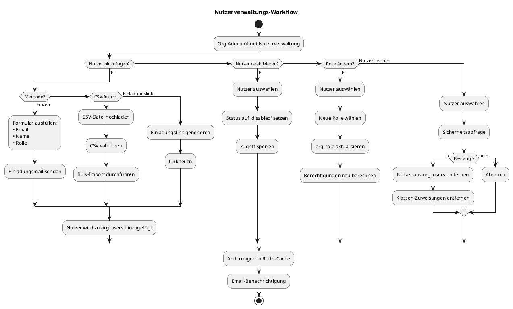

**Funktionen:**

### 6.1.1 Nutzer hinzufügen (Einzeln)

**Frontend (Vue.js):**
```vue
<template>
  <div class="add-user-form">
    <h2>Nutzer hinzufügen</h2>

    <form @submit.prevent="addUser">
      <div class="form-group">
        <label>Email</label>
        <input v-model="user.email" type="email" required />
      </div>

      <div class="form-group">
        <label>Name</label>
        <input v-model="user.name" type="text" required />
      </div>

      <div class="form-group">
        <label>Rolle</label>
        <select v-model="user.role" required>
          <option value="student">Schüler/Mitarbeiter</option>
          <option value="teacher">Lehrer/Trainer</option>
          <option value="org_admin">Org Admin</option>
        </select>
      </div>

      <button type="submit" class="btn-primary">Hinzufügen</button>
    </form>
  </div>
</template>

<script setup>
import { ref } from 'vue'
import { useOrgStore } from '@/stores/org'

const orgStore = useOrgStore()

const user = ref({
  email: '',
  name: '',
  role: 'student'
})

const addUser = async () => {
  try {
    await orgStore.addUser(user.value)
    // Success notification
    user.value = { email: '', name: '', role: 'student' }
  } catch (error) {
    // Error handling
  }
}
</script>
```

### 6.1.2 Bulk-Import via CSV

**CSV-Format:**
```csv
email,name,role,class_id
max.mustermann@example.com,Max Mustermann,student,10
anna.schmidt@example.com,Anna Schmidt,student,10
tom.mueller@example.com,Tom Müller,teacher,NULL
```

**Backend-Processing:**
```python
import csv
from io import StringIO

class UserImportService:
    def __init__(self, org_id: int):
        self.org_id = org_id

    def validate_csv(self, csv_content: str) -> List[Dict]:
        """Validiert CSV und gibt Fehler zurück"""
        errors = []
        valid_users = []

        reader = csv.DictReader(StringIO(csv_content))

        for idx, row in enumerate(reader, start=2):
            # Email validieren
            if not self._is_valid_email(row['email']):
                errors.append(f"Zeile {idx}: Ungültige Email")
                continue

            # Rolle validieren
            if row['role'] not in ['student', 'teacher', 'org_admin']:
                errors.append(f"Zeile {idx}: Ungültige Rolle")
                continue

            valid_users.append(row)

        return valid_users, errors

    def import_users(self, csv_content: str) -> Dict:
        """Führt Bulk-Import durch"""
        valid_users, errors = self.validate_csv(csv_content)

        imported = 0
        failed = 0

        for user_data in valid_users:
            try:
                # User erstellen oder finden
                user = self._create_or_find_user(user_data['email'], user_data['name'])

                # Zu Organisation hinzufügen
                org_user = OrganisationUser(
                    org_id=self.org_id,
                    user_id=user.id,
                    org_role=user_data['role'],
                    status='active'
                )
                db.session.add(org_user)

                # Optional: Zu Klasse hinzufügen
                if user_data.get('class_id'):
                    class_member = OrganisationClassMember(
                        class_id=int(user_data['class_id']),
                        user_id=user.id,
                        role='student' if user_data['role'] == 'student' else 'teacher'
                    )
                    db.session.add(class_member)

                imported += 1

            except Exception as e:
                failed += 1
                errors.append(f"Fehler bei {user_data['email']}: {str(e)}")

        db.session.commit()

        return {
            'imported': imported,
            'failed': failed,
            'errors': errors
        }
```

### 6.1.3 Einladungslink generieren

**Backend:**
```python
import secrets
from datetime import datetime, timedelta

class InviteLinkService:
    def create_invite(self, org_id: int, role: str, max_uses: int = None, expires_days: int = 7) -> str:
        """Erstellt Einladungslink"""

        # Eindeutigen Code generieren
        invite_code = f"ORG{org_id}-{secrets.token_urlsafe(16)}"

        invite = OrganisationInvite(
            org_id=org_id,
            invite_code=invite_code,
            role=role,
            max_uses=max_uses,
            uses=0,
            expires_at=datetime.utcnow() + timedelta(days=expires_days)
        )

        db.session.add(invite)
        db.session.commit()

        # URL generieren
        invite_url = f"https://lsx.de/join/{invite_code}"

        return invite_url

    def validate_invite(self, invite_code: str) -> Tuple[bool, str]:
        """Validiert Einladungscode"""

        invite = OrganisationInvite.query.filter_by(invite_code=invite_code).first()

        if not invite:
            return False, "Ungültiger Einladungscode"

        if invite.expires_at < datetime.utcnow():
            return False, "Einladungscode abgelaufen"

        if invite.max_uses and invite.uses >= invite.max_uses:
            return False, "Einladungscode wurde zu oft verwendet"

        return True, invite.org_id

    def accept_invite(self, invite_code: str, user_id: int) -> bool:
        """Akzeptiert Einladung und fügt Nutzer hinzu"""

        valid, org_id_or_error = self.validate_invite(invite_code)

        if not valid:
            raise ValueError(org_id_or_error)

        invite = OrganisationInvite.query.filter_by(invite_code=invite_code).first()

        # Nutzer zu Organisation hinzufügen
        org_user = OrganisationUser(
            org_id=invite.org_id,
            user_id=user_id,
            org_role=invite.role,
            status='active'
        )
        db.session.add(org_user)

        # Nutzungszähler erhöhen
        invite.uses += 1

        db.session.commit()

        return True
```

## 6.2 Kursmanagement

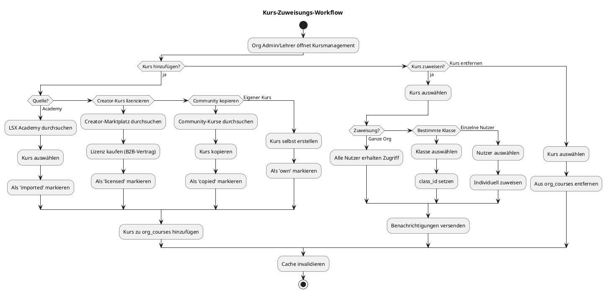

**Organisationen können:**

- **Academy-Kurse importieren** – Kostenlose LSX Academy Kurse für alle Nutzer
- **Creator-Kurse lizenzieren** – B2B-Vertrag mit Creator, Lizenz für alle Org-Nutzer
- **Community-Kurse kopieren** – Kurse aus Community klonen und anpassen
- **Eigene Kurse erstellen** – Vollständig eigene Kurse aufbauen
- **Prüfungen hinzufügen** – Eigene Prüfungen zu Kursen hinzufügen

## 6.3 Tokenpool

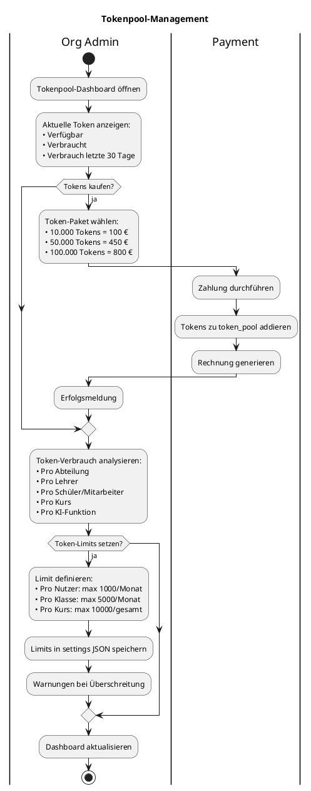

**Funktionen:**

✅ **Token kaufen** – Token-Pakete erwerben
✅ **Tokenverbrauch überwachen** – Pro Abteilung, Lehrer, Schüler
✅ **Token-Limits setzen** – Max. Verbrauch pro Nutzer/Klasse
✅ **Verbrauchsanalyse** – Detaillierte Reports über Token-Nutzung
✅ **Warnungen** – Automatische Benachrichtigungen bei niedrigem Token-Pool

---

# 7. Domain-Binding & Branding

## 7.1 Domain-Binding Workflow

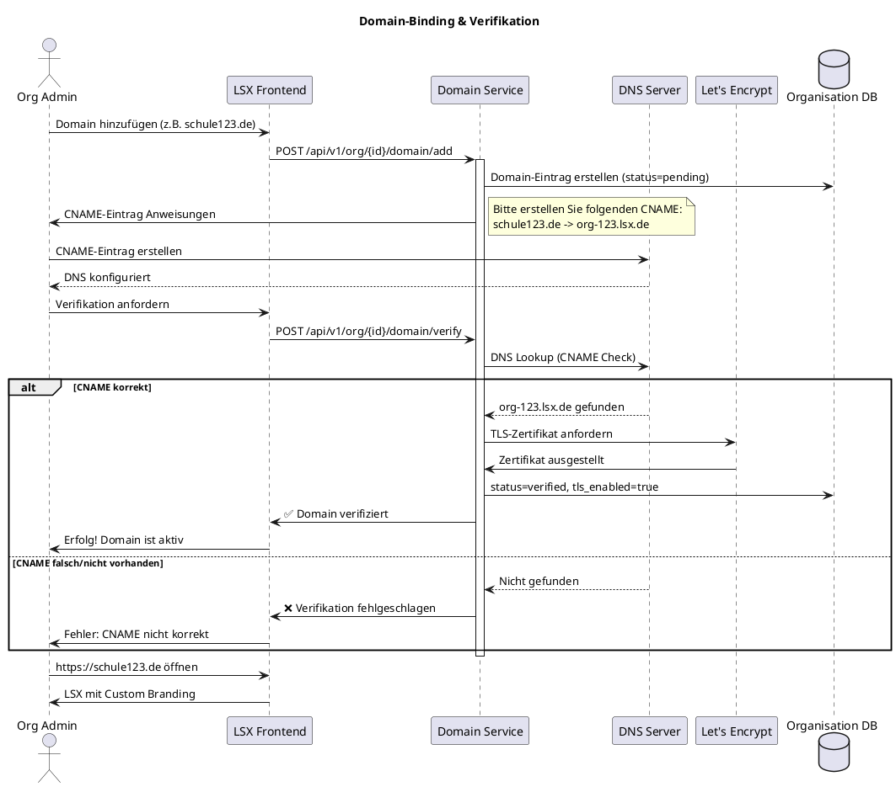

## 7.2 Anforderungen für Domain-Binding

✅ **CNAME-Eintrag** – Domain muss auf LSX-Subdomain zeigen
✅ **Verifikation** – DNS-Check durch LSX
✅ **TLS-Zertifikat** – Automatisch via Let's Encrypt
✅ **Branding** – Automatisch aktiv nach Verifikation

**Beispiel CNAME-Konfiguration:**
```
schule123.de.    IN    CNAME    org-123.lsx.de.
```

## 7.3 Branding-Funktionen

**Organisationen können anpassen:**

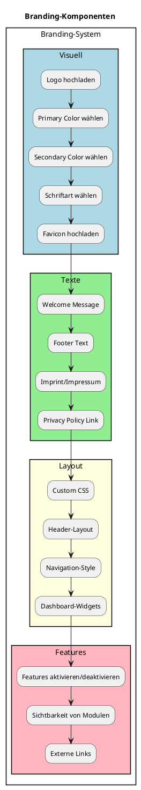

**Branding Service Backend:**
```python
class BrandingService:
    def update_branding(self, org_id: int, branding_data: Dict) -> bool:
        """Aktualisiert Branding-Einstellungen"""

        org = Organisation.query.get(org_id)

        if not org:
            raise ValueError("Organisation nicht gefunden")

        # Validierung
        if 'logo_url' in branding_data:
            if not self._is_valid_url(branding_data['logo_url']):
                raise ValueError("Ungültige Logo-URL")

        if 'primary_color' in branding_data:
            if not self._is_valid_hex_color(branding_data['primary_color']):
                raise ValueError("Ungültige Farbe")

        # Branding aktualisieren
        org.branding = branding_data
        db.session.commit()

        # Cache invalidieren
        cache.delete(f"CACHE:ORG:{org_id}:branding")

        return True

    def get_branding(self, org_id: int) -> Dict:
        """Holt Branding-Einstellungen (mit Cache)"""

        cache_key = f"CACHE:ORG:{org_id}:branding"

        # Aus Cache holen
        cached = cache.get(cache_key)
        if cached:
            return json.loads(cached)

        # Aus DB holen
        org = Organisation.query.get(org_id)

        if not org:
            return self._default_branding()

        branding = org.branding or self._default_branding()

        # In Cache speichern (1 Stunde)
        cache.setex(cache_key, 3600, json.dumps(branding))

        return branding

    def _default_branding(self) -> Dict:
        """Standard-Branding"""
        return {
            "logo_url": "https://cdn.lsx.de/default-logo.png",
            "primary_color": "#1E40AF",
            "secondary_color": "#F59E0B",
            "custom_css": "",
            "welcome_message": "Willkommen bei LSX"
        }
```

---

# 8. Klassen- & Gruppenstruktur (Schulen)

## 8.1 Klassen-Management Workflow

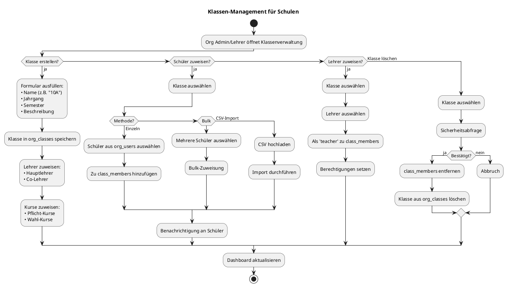

## 8.2 Klassen-Dashboard

**Lehrer sehen:**

📊 **Klassenübersicht:**
- Anzahl Schüler
- Aktive Kurse
- Durchschnittlicher Fortschritt
- Nächste Prüfungen

📈 **Leistungsübersicht:**
- Top-Performer
- Schüler mit Schwierigkeiten
- Durchschnittliche Abschlussrate
- Aktivitätslevel

📚 **Kurs-Status:**
- Welche Kurse werden bearbeitet
- Fortschritt pro Kurs
- Abgabe-Status von Aufgaben

📅 **Terminübersicht:**
- Kommende LiveRooms
- Prüfungen
- Abgabefristen

## 8.3 Schülerzuweisung

**Methoden:**

### 8.3.1 Manuelle Zuweisung

```python
class ClassManagementService:
    def add_student_to_class(self, class_id: int, user_id: int) -> bool:
        """Fügt Schüler zu Klasse hinzu"""

        # Validierung
        cls = OrganisationClass.query.get(class_id)
        if not cls:
            raise ValueError("Klasse nicht gefunden")

        # Prüfen ob Nutzer in Organisation
        org_user = OrganisationUser.query.filter_by(
            org_id=cls.org_id,
            user_id=user_id
        ).first()

        if not org_user:
            raise ValueError("Nutzer nicht in Organisation")

        # Prüfen ob bereits Mitglied
        existing = OrganisationClassMember.query.filter_by(
            class_id=class_id,
            user_id=user_id
        ).first()

        if existing:
            raise ValueError("Nutzer bereits in Klasse")

        # Hinzufügen
        member = OrganisationClassMember(
            class_id=class_id,
            user_id=user_id,
            role='student'
        )
        db.session.add(member)
        db.session.commit()

        # Benachrichtigung
        self._send_class_assignment_notification(user_id, class_id)

        return True
```

### 8.3.2 Automatische Zuweisung via Einladungslink

```python
def create_class_invite(class_id: int, max_students: int = None) -> str:
    """Erstellt Einladungslink für Klasse"""

    cls = OrganisationClass.query.get(class_id)

    # Invite erstellen
    invite = OrganisationInvite(
        org_id=cls.org_id,
        invite_code=f"CLASS{class_id}-{secrets.token_urlsafe(12)}",
        role='student',
        max_uses=max_students,
        uses=0,
        expires_at=datetime.utcnow() + timedelta(days=90)
    )
    db.session.add(invite)
    db.session.commit()

    # Klassen-Info im Invite speichern (könnte erweitert werden)
    return f"https://lsx.de/join/{invite.invite_code}?class={class_id}"
```

## 8.4 Lehrerrechte in Klassen

**Lehrer können in ihren Klassen:**

✅ **Aufgaben erstellen** – Hausaufgaben, Projekte, Übungen
✅ **Whiteboard verwenden** – Interaktive Tafeln im LiveRoom
✅ **LiveRooms starten** – Video-Unterricht für Klasse
✅ **Prüfungen erstellen** – Tests und Examen
✅ **Ergebnisse auswerten** – Noten vergeben, Feedback geben
✅ **Fortschritt überwachen** – Wer ist aktiv, wer braucht Hilfe
✅ **Kurse zuweisen** – Zusätzliche Kurse für Klasse

❌ **Keine Rechte für:**
- Klassen löschen
- Org-Einstellungen
- Abrechnung
- Nutzer außerhalb eigener Klassen verwalten

---

# 9. Organisation-Dashboard

```plantuml
@startuml
title Organisation-Dashboard Layout

rectangle "Org-Dashboard" {
  rectangle "Header" #LightBlue {
    :Logo (Branding);
    :Org Name;
    :Admin/Lehrer Navigation;
  }

  rectangle "Widgets Row 1" {
    card "Aktive Nutzer" #LightGreen {
      **247**
      --
      +12 diese Woche
    }

    card "Token-Pool" #LightYellow {
      **45.230**
      --
      -1.200 heute
    }

    card "Klassen" #LightPink {
      **18**
      --
      2 neu
    }

    card "Kurse" #LightCyan {
      **56**
      --
      4 in Bearbeitung
    }
  }

  rectangle "Widgets Row 2" {
    card "Fortschritt Übersicht" #White {
      === Durchschnittlicher Fortschritt ===
      Klasse 10A: ████████░░ 80%
      Klasse 10B: ██████░░░░ 60%
      Klasse 11A: █████████░ 90%
    }

    card "LiveRoom Übersicht" #White {
      === Kommende LiveRooms ===
      Heute 14:00: Python-Kurs (Klasse 10A)
      Morgen 10:00: Mathe (Klasse 11B)
    }
  }

  rectangle "Widgets Row 3" {
    card "Prüfungsübersicht" #White {
      === Aktive Prüfungen ===
      Python-Test: 12/20 abgeschlossen
      Mathe-Klausur: Startet in 2 Tagen
    }

    card "Abrechnung" #White {
      === Nächste Rechnung ===
      Zeitraum: 01.02 - 28.02
      Geschätzt: 1.240,00 €
      Fällig: 01.03.2025
    }
  }
}

@enduml
```

**Dashboard enthält:**

📊 **Anzahl aktiver Nutzer** – Live-Zähler mit Trend
💰 **Tokenpool** – Verfügbar, Verbraucht, Trend
📚 **Klassen** – Anzahl, Neu erstellte
📖 **Kurse** – Zugewiesene, In Bearbeitung
📈 **Fortschritt** – Durchschnittlicher Kursfortschritt pro Klasse
🎥 **LiveRoom-Übersicht** – Kommende Sessions
📝 **Prüfungsübersicht** – Aktive Prüfungen, Ergebnisse
💳 **Abrechnung** – Nächste Rechnung, Kosten

---

# 10. Organisation KI-Funktionen

Organisationen können KI-Features aus ihrem Tokenpool nutzen:

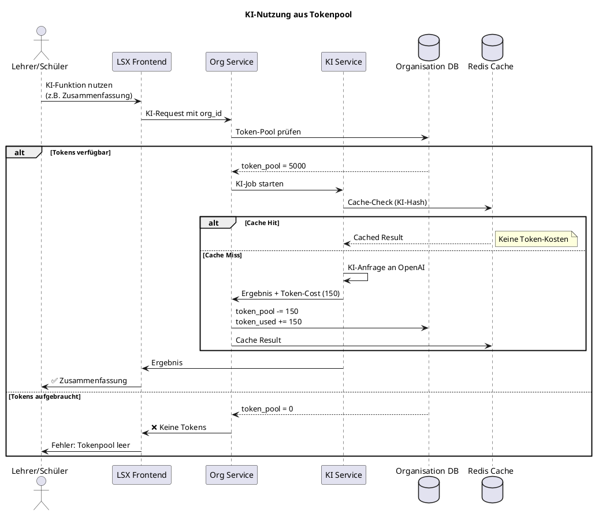

**KI-Funktionen:**

✅ **Kursübersetzungen** – Kurse in andere Sprachen übersetzen
✅ **Prüfungssimulationen** – Automatische Testfragen generieren
✅ **Whiteboard-Korrekturen** – Handschrift in Text umwandeln
✅ **Theorieblattgenerierung** – Lernmaterial erstellen
✅ **Zusammenfassungen** – Module zusammenfassen
✅ **Gruppenanalysen** – Klassen-Performance analysieren

**Token-Verbrauch wird getrackt:**
- Pro Nutzer
- Pro Klasse
- Pro Kurs
- Pro KI-Funktion

---

# 11. Organisationen → Creator-Kurse (B2B)

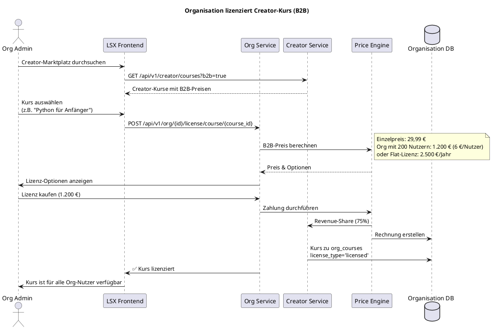

**Organisationen können:**

✅ **Creator-Kurse für alle Nutzer lizenzieren** – B2B-Verträge mit Creators
✅ **Creator-Kurse kopieren und modifizieren** – Anpassung für interne Zwecke
✅ **Creator-Kurse als interne Module verwenden** – Integration in eigene Curricula

**LSX unterstützt Creator im B2B-Markt:**

- Revenue-Share bleibt bei 75% Creator / 25% LSX
- Volumen-Rabatte für große Organisationen
- Langfristverträge möglich
- Exklusive Anpassungen durch Creator

---

# 12. Abrechnung & Rechnungslogik

## 12.1 Billing-Modelle

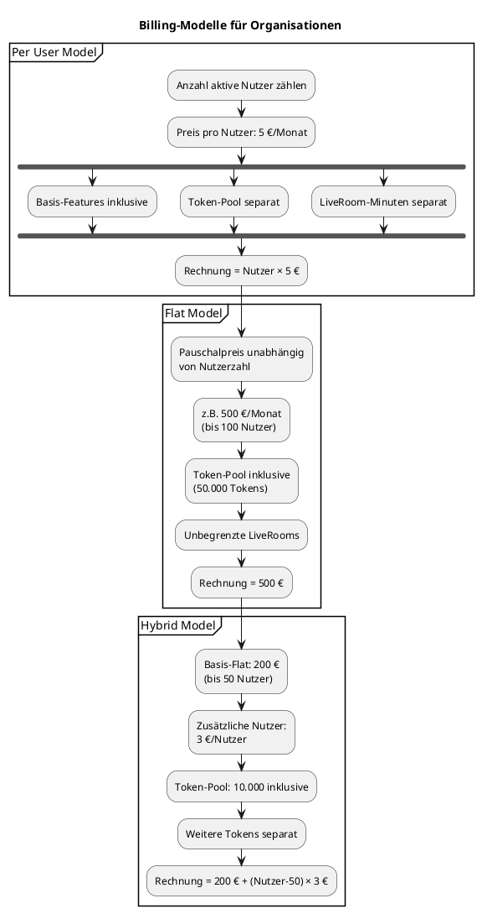

## 12.2 Rechnungs-Workflow

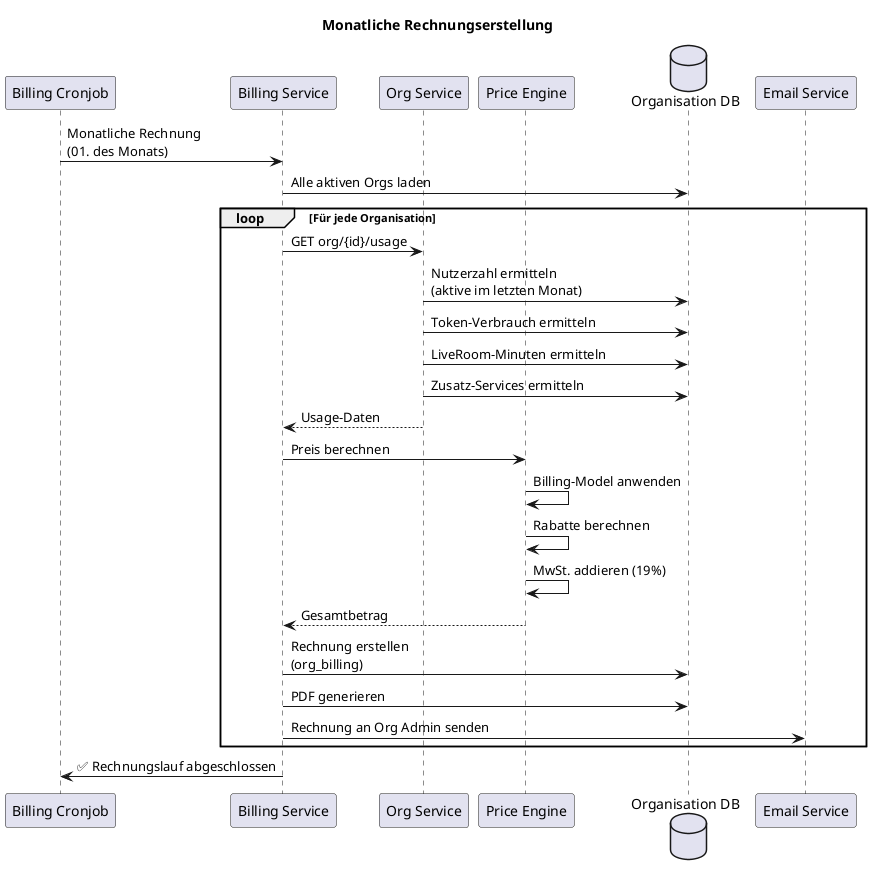

## 12.3 Rechnungsdetails

**Eine Rechnung enthält:**

📄 **Zeitraum** – z.B. 01.02.2025 - 28.02.2025
👥 **Anzahl Nutzer** – Durchschnittlich aktive Nutzer im Zeitraum
🎯 **Tokenverbrauch** – Verbrauchte Tokens (falls nicht im Flat inklusive)
🎥 **LiveRoom-Minuten** – Genutzte Minuten (falls separat)
🎓 **Lizenzierte Kurse** – B2B-Lizenzen von Creators
🔧 **Extra Dienste** – Add-Ons, Premium-Features

**Beispiel-Rechnung (Per User):**

```
Organisation: Berufsschule Musterstadt
Zeitraum: 01.02.2025 - 28.02.2025

POSITIONEN:
------------------------------------------
247 aktive Nutzer × 5,00 €      1.235,00 €
Token-Pool (50.000 Tokens)        450,00 €
LiveRoom Pro (500 Min)            100,00 €
B2B-Lizenz: Python-Kurs         1.200,00 €
------------------------------------------
Zwischensumme:                  2.985,00 €
MwSt. (19%):                      567,15 €
------------------------------------------
GESAMT:                         3.552,15 €

Zahlbar bis: 15.03.2025
```

**Backend - Rechnungserstellung:**
```python
class BillingService:
    def generate_monthly_invoice(self, org_id: int, period_start: date, period_end: date) -> int:
        """Generiert monatliche Rechnung für Organisation"""

        org = Organisation.query.get(org_id)

        # Nutzerzahl ermitteln
        user_count = self._get_average_active_users(org_id, period_start, period_end)

        # Token-Verbrauch ermitteln
        token_usage = self._get_token_usage(org_id, period_start, period_end)

        # LiveRoom-Minuten ermitteln
        liveroom_minutes = self._get_liveroom_minutes(org_id, period_start, period_end)

        # Lizenzierte Kurse ermitteln
        licensed_courses = self._get_licensed_courses(org_id, period_start, period_end)

        # Preis berechnen
        amount = 0

        # Per User Pricing
        if org.billing_model == 'per_user':
            amount += user_count * 5.00  # 5€ pro Nutzer
        elif org.billing_model == 'flat':
            amount += 500.00  # Flat-Fee
        elif org.billing_model == 'hybrid':
            if user_count <= 50:
                amount += 200.00
            else:
                amount += 200.00 + (user_count - 50) * 3.00

        # Token-Kosten (wenn nicht inklusive)
        if token_usage > org.settings.get('included_tokens', 0):
            extra_tokens = token_usage - org.settings['included_tokens']
            amount += (extra_tokens / 1000) * 9.00  # 9€ pro 1000 Tokens

        # LiveRoom-Kosten
        if liveroom_minutes > org.settings.get('included_minutes', 0):
            extra_minutes = liveroom_minutes - org.settings['included_minutes']
            amount += (extra_minutes / 60) * 12.00  # 12€ pro Stunde

        # Lizenzierte Kurse
        for course in licensed_courses:
            amount += course['monthly_fee']

        # MwSt.
        amount_net = amount
        tax = amount_net * 0.19
        total_amount = amount_net + tax

        # Rechnung erstellen
        billing = OrganisationBilling(
            org_id=org_id,
            period_start=period_start,
            period_end=period_end,
            user_count=user_count,
            token_usage=token_usage,
            total_amount=total_amount,
            status='pending'
        )
        db.session.add(billing)
        db.session.commit()

        # PDF generieren
        pdf_url = self._generate_invoice_pdf(billing.billing_id)

        # Email senden
        self._send_invoice_email(org_id, billing.billing_id, pdf_url)

        return billing.billing_id
```

---

# 13. API-Endpunkte – Organisation

## 13.1 Organisation anlegen

**POST** `/api/v1/org/create`

**Request:**
```json
{
  "name": "Berufsschule Musterstadt",
  "org_type": "school",
  "billing_model": "per_user",
  "admin_user_id": 123,
  "settings": {
    "features": {
      "liveroom_enabled": true,
      "whiteboard_enabled": true,
      "exams_enabled": true,
      "ai_enabled": true
    },
    "limits": {
      "max_users": 500,
      "max_classes": 50,
      "max_courses": 200
    }
  }
}
```

**Response:**
```json
{
  "status": "success",
  "org_id": 42,
  "message": "Organisation erfolgreich erstellt",
  "data": {
    "org_id": 42,
    "name": "Berufsschule Musterstadt",
    "org_type": "school",
    "billing_model": "per_user",
    "token_pool": 0,
    "status": "active",
    "created_at": "2025-02-15T10:30:00Z"
  }
}
```

**Backend:**
```python
@org_bp.route('/create', methods=['POST'])
@jwt_required()
def create_organisation():
    data = request.get_json()

    # Validierung
    required_fields = ['name', 'org_type', 'billing_model', 'admin_user_id']
    for field in required_fields:
        if field not in data:
            return jsonify({'status': 'error', 'message': f'{field} fehlt'}), 400

    # Organisation erstellen
    org = Organisation(
        name=data['name'],
        org_type=data['org_type'],
        billing_model=data['billing_model'],
        settings=data.get('settings', {}),
        token_pool=0,
        token_used=0,
        status='active'
    )
    db.session.add(org)
    db.session.flush()

    # Admin hinzufügen
    org_user = OrganisationUser(
        org_id=org.org_id,
        user_id=data['admin_user_id'],
        org_role='org_admin',
        status='active'
    )
    db.session.add(org_user)
    db.session.commit()

    return jsonify({
        'status': 'success',
        'org_id': org.org_id,
        'message': 'Organisation erfolgreich erstellt',
        'data': org.to_dict()
    }), 201
```

---

## 13.2 Nutzer hinzufügen

**POST** `/api/v1/org/{org_id}/user/add`

**Request:**
```json
{
  "email": "max.mustermann@example.com",
  "name": "Max Mustermann",
  "role": "student"
}
```

**Response:**
```json
{
  "status": "success",
  "message": "Nutzer erfolgreich hinzugefügt",
  "user_id": 456,
  "invite_sent": true
}
```

**Backend:**
```python
@org_bp.route('/<int:org_id>/user/add', methods=['POST'])
@jwt_required()
@org_admin_required()
def add_user(org_id):
    data = request.get_json()

    # Nutzer erstellen oder finden
    user = User.query.filter_by(email=data['email']).first()

    if not user:
        user = User(
            email=data['email'],
            name=data['name'],
            role='free'  # Standard-Rolle
        )
        db.session.add(user)
        db.session.flush()

    # Zu Organisation hinzufügen
    org_user = OrganisationUser(
        org_id=org_id,
        user_id=user.id,
        org_role=data['role'],
        status='active'
    )
    db.session.add(org_user)
    db.session.commit()

    # Einladungsmail senden
    email_service.send_org_invite(user.email, org_id)

    # Cache invalidieren
    cache.delete(f"CACHE:ORG:{org_id}:users")

    return jsonify({
        'status': 'success',
        'message': 'Nutzer erfolgreich hinzugefügt',
        'user_id': user.id,
        'invite_sent': True
    }), 201
```

---

## 13.3 Klasse erstellen

**POST** `/api/v1/org/{org_id}/class/create`

**Request:**
```json
{
  "name": "10A",
  "description": "Informatik-Klasse Jahrgang 10",
  "year": 2025,
  "semester": "WS 2025/26"
}
```

**Response:**
```json
{
  "status": "success",
  "message": "Klasse erfolgreich erstellt",
  "class_id": 15,
  "data": {
    "class_id": 15,
    "name": "10A",
    "description": "Informatik-Klasse Jahrgang 10",
    "year": 2025,
    "semester": "WS 2025/26",
    "created_at": "2025-02-15T11:00:00Z"
  }
}
```

**Backend:**
```python
@org_bp.route('/<int:org_id>/class/create', methods=['POST'])
@jwt_required()
@org_admin_or_teacher_required()
def create_class(org_id):
    data = request.get_json()

    # Validierung
    if 'name' not in data:
        return jsonify({'status': 'error', 'message': 'Name fehlt'}), 400

    # Klasse erstellen
    cls = OrganisationClass(
        org_id=org_id,
        name=data['name'],
        description=data.get('description', ''),
        year=data.get('year'),
        semester=data.get('semester')
    )
    db.session.add(cls)
    db.session.commit()

    # Cache invalidieren
    cache.delete(f"CACHE:ORG:{org_id}:classes")

    return jsonify({
        'status': 'success',
        'message': 'Klasse erfolgreich erstellt',
        'class_id': cls.class_id,
        'data': cls.to_dict()
    }), 201
```

---

## 13.4 Tokenpool kaufen

**POST** `/api/v1/org/{org_id}/tokens/buy`

**Request:**
```json
{
  "amount": 50000,
  "payment_method": "stripe"
}
```

**Response:**
```json
{
  "status": "success",
  "message": "Tokens erfolgreich gekauft",
  "new_balance": 95230,
  "transaction_id": "txn_abc123",
  "invoice_url": "https://lsx.de/invoices/inv_xyz789.pdf"
}
```

**Backend:**
```python
@org_bp.route('/<int:org_id>/tokens/buy', methods=['POST'])
@jwt_required()
@org_admin_required()
def buy_tokens(org_id):
    data = request.get_json()

    org = Organisation.query.get_or_404(org_id)

    amount = data.get('amount')
    if not amount or amount <= 0:
        return jsonify({'status': 'error', 'message': 'Ungültige Token-Anzahl'}), 400

    # Preis berechnen (9€ pro 1000 Tokens)
    price = (amount / 1000) * 9.00

    # Zahlung durchführen
    payment_result = payment_service.charge(
        org_id=org_id,
        amount=price,
        description=f"{amount} Tokens für Organisation"
    )

    if not payment_result['success']:
        return jsonify({
            'status': 'error',
            'message': 'Zahlung fehlgeschlagen'
        }), 400

    # Tokens hinzufügen
    org.token_pool += amount
    db.session.commit()

    # Cache invalidieren
    cache.delete(f"CACHE:ORG:{org_id}")

    return jsonify({
        'status': 'success',
        'message': 'Tokens erfolgreich gekauft',
        'new_balance': org.token_pool,
        'transaction_id': payment_result['transaction_id'],
        'invoice_url': payment_result['invoice_url']
    }), 200
```

---

## 13.5 Org-Dashboard Daten abrufen

**GET** `/api/v1/org/{org_id}/dashboard`

**Response:**
```json
{
  "status": "success",
  "data": {
    "org": {
      "org_id": 42,
      "name": "Berufsschule Musterstadt",
      "org_type": "school"
    },
    "stats": {
      "active_users": 247,
      "total_classes": 18,
      "total_courses": 56,
      "token_pool": 45230,
      "token_used_today": 1200,
      "token_used_month": 15430
    },
    "upcoming_liverooms": [
      {
        "title": "Python-Kurs",
        "class": "10A",
        "start_time": "2025-02-15T14:00:00Z"
      }
    ],
    "active_exams": [
      {
        "title": "Python-Test",
        "completed": 12,
        "total_students": 20
      }
    ],
    "next_billing": {
      "period_start": "2025-02-01",
      "period_end": "2025-02-28",
      "estimated_amount": 1240.00,
      "due_date": "2025-03-01"
    }
  }
}
```

---

## 13.6 Domain hinzufügen

**POST** `/api/v1/org/{org_id}/domain/add`

**Request:**
```json
{
  "domain": "schule123.de"
}
```

**Response:**
```json
{
  "status": "success",
  "message": "Domain hinzugefügt. Bitte CNAME-Eintrag erstellen.",
  "instructions": {
    "type": "CNAME",
    "record": "schule123.de",
    "value": "org-42.lsx.de",
    "status": "pending"
  }
}
```

---

## 13.7 Domain verifizieren

**POST** `/api/v1/org/{org_id}/domain/verify`

**Response:**
```json
{
  "status": "success",
  "message": "Domain erfolgreich verifiziert",
  "domain": "schule123.de",
  "tls_enabled": true,
  "verified_at": "2025-02-15T12:30:00Z"
}
```

---

## 13.8 CSV-Import (Bulk-User-Import)

**POST** `/api/v1/org/{org_id}/users/import`

**Request (multipart/form-data):**
```
file: users.csv
```

**Response:**
```json
{
  "status": "success",
  "message": "Import abgeschlossen",
  "imported": 45,
  "failed": 2,
  "errors": [
    "Zeile 10: Ungültige Email",
    "Zeile 23: Nutzer existiert bereits"
  ]
}
```

---

# 14. Sicherheit

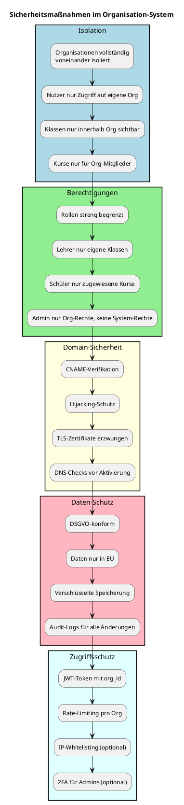

**Sicherheitsfeatures:**

🔒 **Isolierung:**
- Organisationen sind vollständig voneinander isoliert
- Nutzer können nur auf Inhalte ihrer eigenen Organisation zugreifen
- Keine Cross-Org-Datenlecks möglich

🔑 **Berechtigungen:**
- Rollen streng begrenzt (org_admin, teacher, student)
- Lehrer nur Zugriff auf eigene Klassen
- Schüler nur auf zugewiesene Kurse
- Org Admin hat KEINE System-Admin-Rechte

🌐 **Domain-Verifikation:**
- CNAME-Eintrag muss korrekt sein
- DNS-Check vor Aktivierung
- Hijacking-Schutz durch Verifikation
- TLS-Zertifikate erzwungen (Let's Encrypt)

📋 **DSGVO-Konformität:**
- Alle Daten nur in EU-Servern
- Verschlüsselte Speicherung
- Audit-Logs für alle Änderungen
- Recht auf Vergessenwerden (Nutzer löschen)

🛡️ **Zugriffsschutz:**
- JWT-Token enthält org_id (kann nur auf eigene Org zugreifen)
- Rate-Limiting pro Organisation
- Optional: IP-Whitelisting für Schulen
- Optional: 2FA für Org Admins

---

# 15. Zusammenfassung

Das Organisation-System von LSX ist:

✅ **Mächtig** – Vollständiges LMS für Schulen, Firmen, Teams
✅ **Flexibel** – 4 Organisationstypen für verschiedene Anwendungsfälle
✅ **Sicher** – Isolierung, Rollen, Domain-Verifikation, DSGVO
✅ **Skalierbar** – Tausende Nutzer pro Organisation
✅ **Integriert** – Nahtlos mit Kurs-, KI-, LiveRoom-, Analytics-System
✅ **White-Label** – Eigenes Branding und Domain möglich
✅ **B2B-ready** – Creator-Kurse lizenzieren, Abrechnung, Reports

**Kernfunktionen:**

📊 **Nutzerverwaltung** – Einzeln, CSV-Import, Einladungslinks
📚 **Kursmanagement** – Academy, Creator, Community, Eigene
💰 **Tokenpool** – Zentral verwaltet, Analytics pro Nutzer/Klasse
🎓 **Klassen** – Schüler, Lehrer, Kurse, Prüfungen
🌐 **Domain-Binding** – Custom Domain mit TLS
🎨 **Branding** – Logo, Farben, Custom CSS
💳 **Abrechnung** – Per User, Flat, Hybrid
🤖 **KI** – Aus Tokenpool für alle Features

**Zielgruppen:**

- Berufsschulen
- Privatschulen
- Hochschulen
- Unternehmen (Employee Training)
- IT-Akademien
- Bildungsträger
- Dozenten-Teams
- Creator-Teams

Das Organisation-System ist die **B2B-Grundlage** von LSX und ermöglicht es, tausende Nutzer strukturiert zu verwalten, zu schulen und abzurechnen.

---

**Dokument abgeschlossen.**
Stand: Final
Version: 1.0
