# 05 – Community-System (Final)

**Version:** 1.0
**Stand:** Final

---

## Überblick

Das LSX-Community-System ist ein zentraler Bestandteil der Plattform und ermöglicht soziales Lernen, Wissensaustausch und organisches Wachstum. Es verbindet Free User, Premium User und Creator in einem Ökosystem, das durch qualitativ hochwertige Inhalte, Moderation und KI-gestützte Qualitätssicherung geprägt ist.

### 🎯 Kernziele

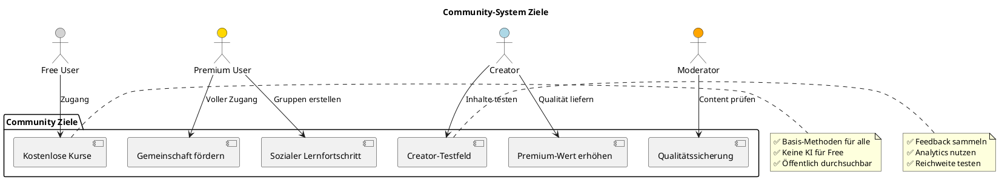

---

## C4 Architektur

### Context Diagram

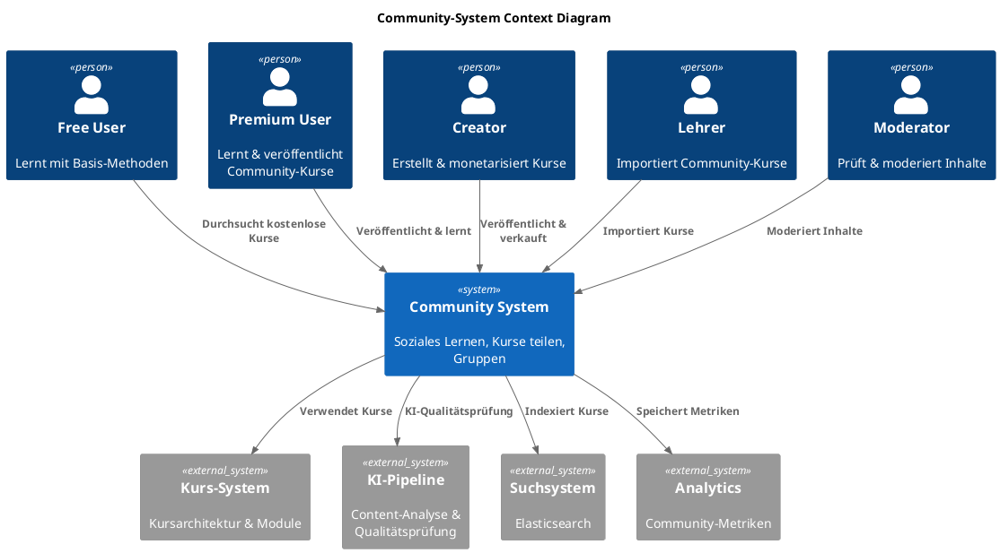

### Container Diagram

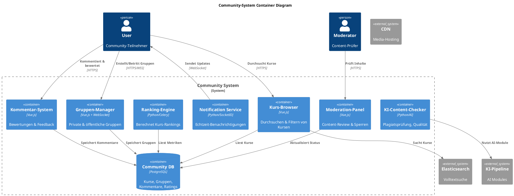

---

## Datenbankschema

### ER-Diagram: Community Entities

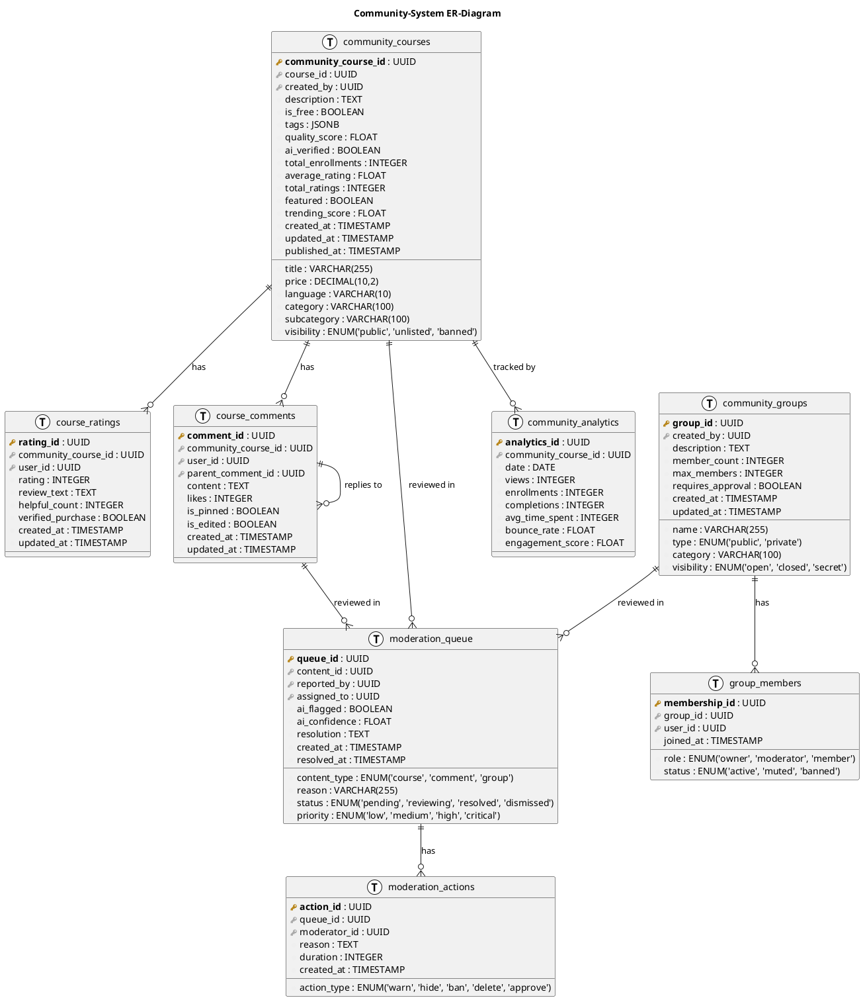

---

## 1. Rollen & Community-Berechtigungen

### Zugriffskontrolle

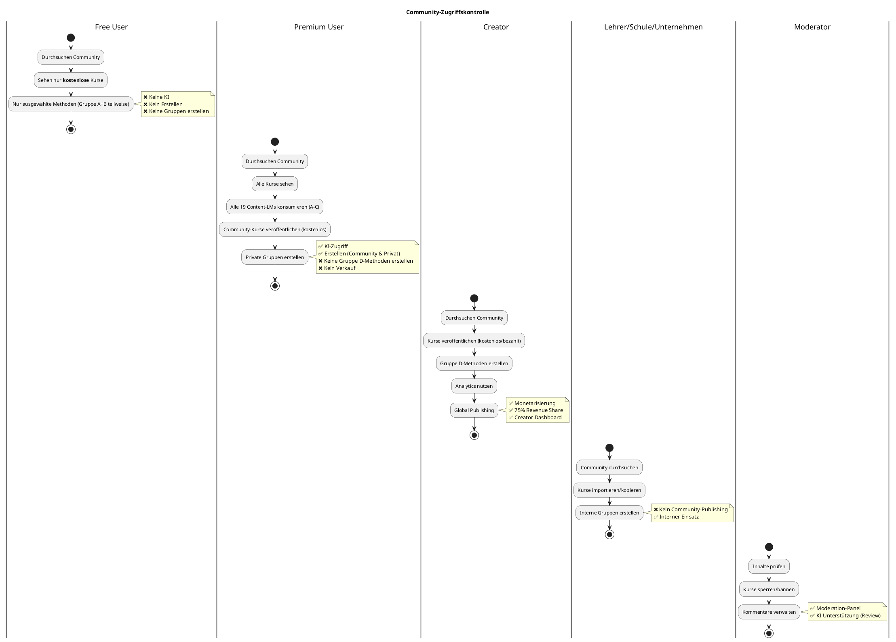

### Berechtigungsmatrix

| Funktion | Free | Premium | Creator | Lehrer | Schule | Unternehmen | Moderator | Admin |
|----------|------|---------|---------|--------|--------|-------------|-----------|-------|
| **Community durchsuchen** | ✅ | ✅ | ✅ | ✅ | ✅ | ✅ | ✅ | ✅ |
| **Kostenlose Kurse sehen** | ✅ | ✅ | ✅ | ✅ | ✅ | ✅ | ✅ | ✅ |
| **Alle Kurse sehen** | ❌ | ✅ | ✅ | ✅ | ✅ | ✅ | ✅ | ✅ |
| **Community-Kurs erstellen** | ❌ | ✅ Kostenlos | ✅ Alle | ❌ | ❌ | ❌ | ❌ | ✅ |
| **Kurs verkaufen** | ❌ | ❌ | ✅ | ❌ | ❌ | ❌ | ❌ | ❌ |
| **Gruppe D-Methoden erstellen** | ❌ | ❌ | ✅ | ✅ | ✅ | ✅ | ❌ | ✅ |
| **Öffentliche Gruppe erstellen** | ❌ | ✅ | ✅ | ✅ | ✅ | ✅ | ❌ | ✅ |
| **Private Gruppe erstellen** | ❌ | ✅ | ✅ | ✅ | ✅ | ✅ | ❌ | ✅ |
| **Gruppe beitreten** | ✅ Einladung | ✅ | ✅ | ✅ | ✅ | ✅ | ❌ | ✅ |
| **Kommentieren** | ✅ | ✅ | ✅ | ✅ | ✅ | ✅ | ❌ | ✅ |
| **Bewerten** | ✅ | ✅ | ✅ | ✅ | ✅ | ✅ | ❌ | ✅ |
| **Content melden** | ✅ | ✅ | ✅ | ✅ | ✅ | ✅ | ❌ | ✅ |
| **Moderieren** | ❌ | ❌ | ❌ | ❌ | ❌ | ❌ | ✅ | ✅ |
| **Analytics sehen** | ❌ | ❌ | ✅ Eigene | ❌ | ❌ | ❌ | ❌ | ✅ |

---

## 2. Struktur der Community

### Komponenten-Übersicht

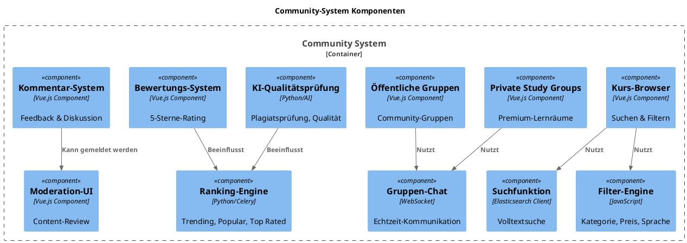

---

## 3. Kurs-Browser (Explore)

### Browse-Workflow

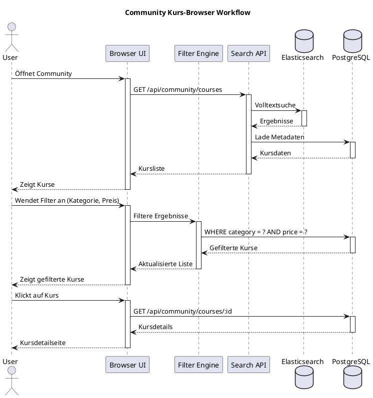

### Filter-Optionen

| Filter | Optionen | Verfügbar für |
|--------|----------|---------------|
| **Kategorie** | IT, Sprachen, Business, Mathematik, Wissenschaft, etc. | Alle |
| **Unterkategorie** | Programmierung, Netzwerk, Cloud, etc. | Alle |
| **Preis** | Kostenlos, Bezahlt (€0-€500) | Alle |
| **Sprache** | DE, EN, FR, ES, IT, etc. (20 Sprachen) | Alle |
| **Schwierigkeit** | Anfänger, Fortgeschritten, Experte | Alle |
| **Lernmethoden** | Anzahl verfügbarer Methoden (19 Content-LMs) | Alle |
| **Bewertung** | 1-5 Sterne | Alle |
| **Erstellungsdatum** | Letzte Woche, Monat, Jahr | Alle |
| **Beliebtheit** | Trending, Most Popular, Editor's Pick | Alle |
| **Tags** | Custom Tags (JSON) | Alle |
| **Creator** | Creator-Name | Alle |
| **Verifiziert** | KI-verifiziert, Editor's Choice | Alle |

### Such-Syntax

```javascript
// Beispiel: Elasticsearch Query für Community-Browser
{
  "query": {
    "bool": {
      "must": [
        {
          "multi_match": {
            "query": "Python Programmierung",
            "fields": ["title^3", "description^2", "tags"]
          }
        },
        {
          "term": {
            "visibility": "public"
          }
        }
      ],
      "filter": [
        {
          "term": {
            "is_free": true
          }
        },
        {
          "term": {
            "language": "de"
          }
        },
        {
          "range": {
            "average_rating": {
              "gte": 4.0
            }
          }
        }
      ]
    }
  },
  "sort": [
    {
      "trending_score": {
        "order": "desc"
      }
    },
    {
      "created_at": {
        "order": "desc"
      }
    }
  ]
}
```

---

## 4. Kursarten in der Community

### Kursarten-Übersicht

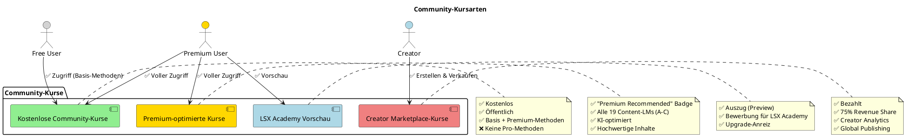

### Kursarten-Details

#### 4.1 Kostenlose Community-Kurse

| Eigenschaft | Details |
|-------------|---------|
| **Ersteller** | Premium User, Creator |
| **Preis** | Kostenlos |
| **Sichtbarkeit** | Öffentlich |
| **Lernmethoden** | Gruppe A–C (LM00–LM25) |
| **KI** | Optional |
| **Nutzung** | Alle Rollen können lernen |
| **Import** | Lehrer/Schule/Unternehmen können kopieren |

**Beispiel-Datenstruktur:**

```json
{
  "community_course_id": "a1b2c3d4-...",
  "course_id": "e5f6g7h8-...",
  "created_by": "user_uuid",
  "title": "Python für Anfänger",
  "description": "Grundlagen der Python-Programmierung",
  "is_free": true,
  "price": 0.00,
  "language": "de",
  "category": "IT",
  "subcategory": "Programmierung",
  "tags": ["Python", "Coding", "Anfänger"],
  "visibility": "public",
  "quality_score": 4.2,
  "ai_verified": true,
  "total_enrollments": 1523,
  "average_rating": 4.5,
  "total_ratings": 342,
  "featured": false,
  "trending_score": 87.3,
  "created_at": "2024-01-15T10:30:00Z",
  "published_at": "2024-01-15T12:00:00Z"
}
```

#### 4.2 Premium-optimierte Community-Kurse

| Eigenschaft | Details |
|-------------|---------|
| **Ersteller** | Creator (verifiziert) |
| **Badge** | "Premium Recommended" |
| **Lernmethoden** | Alle 19 Content-LMs (A-C) |
| **KI** | Intensiv genutzt |
| **Qualität** | KI-verifiziert, mind. 4.5 Sterne |
| **Sichtbarkeit** | Featured, Trending |

#### 4.3 LSX Academy Vorschau-Kurse

| Eigenschaft | Details |
|-------------|---------|
| **Ersteller** | LSX Academy (Admin) |
| **Inhalt** | Auszug aus offiziellen Kursen |
| **Zweck** | Marketing für Premium-Kurse |
| **Badge** | "LSX Academy Preview" |
| **Upgrade-Link** | Zu Vollversion |

#### 4.4 Creator Marketplace-Kurse

| Eigenschaft | Details |
|-------------|---------|
| **Ersteller** | Creator |
| **Preis** | €5 - €500 |
| **Revenue Share** | 75% an Creator |
| **Lernmethoden** | 19 Content-LMs (A-C) |
| **Global Publishing** | 20 Sprachen |
| **Analytics** | Vollständig |

---

## 5. Private Study Groups (Premium+)

### Gruppen-Workflow

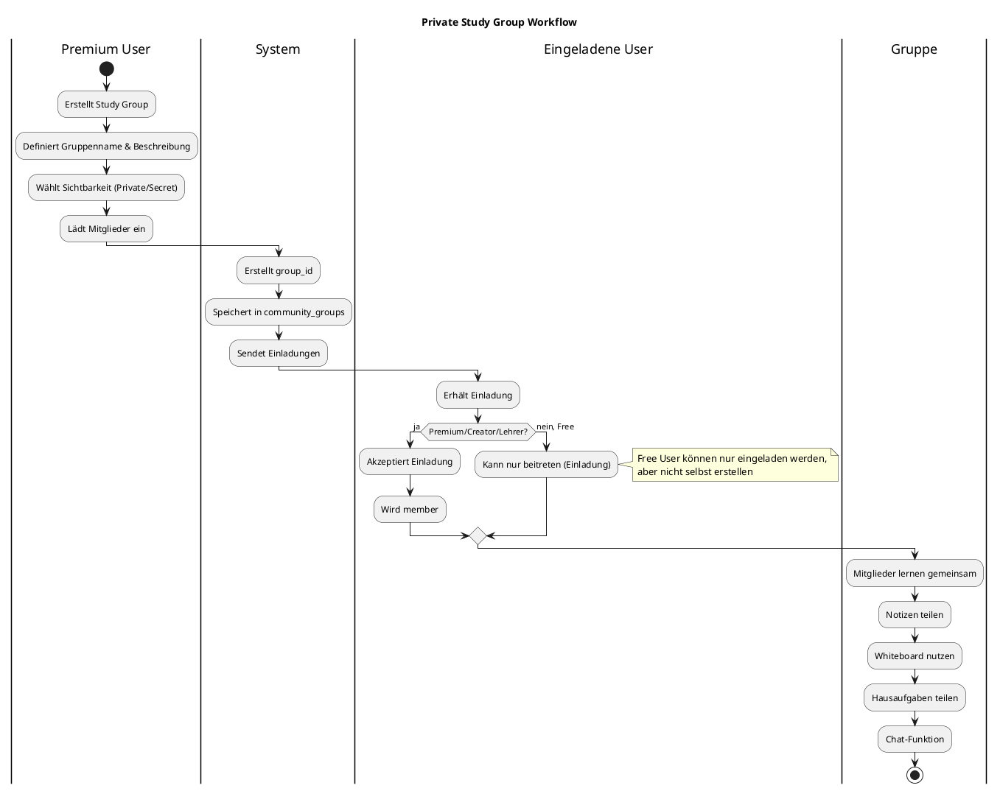

### Gruppen-Typen

| Typ | Sichtbarkeit | Wer kann erstellen | Wer kann beitreten |
|-----|--------------|--------------------|--------------------|
| **Öffentlich** | Alle sehen | Premium+, Creator, Lehrer | Alle |
| **Privat** | Nur Mitglieder | Premium+, Creator, Lehrer | Nur Eingeladene |
| **Secret** | Unsichtbar | Premium+, Creator, Lehrer | Nur Eingeladene |

### Gruppen-Features

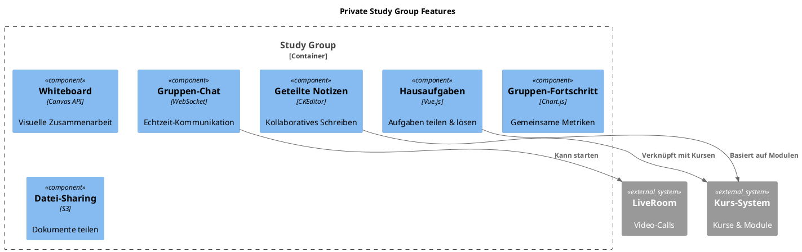

---

## 6. Community-Gruppen (öffentlich)

### Öffentliche Gruppen-Features

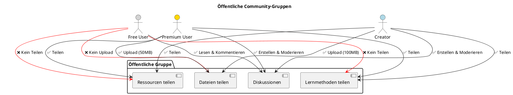

### Gruppen-Kategorien

| Kategorie | Beschreibung | Beispiele |
|-----------|--------------|-----------|
| **Lerngruppen** | Gemeinsames Lernen | "Python Lerngruppe", "IHK Prüfungsvorbereitung" |
| **Themenforen** | Diskussionen zu Themen | "Cloud Computing", "Künstliche Intelligenz" |
| **Regional** | Lokale Gruppen | "Berlin Coding Meetup", "München IT-Community" |
| **Sprachen** | Sprachlernen | "Deutsch für Anfänger", "English Conversation" |
| **Fachbereiche** | Berufliche Themen | "IT-Security Experten", "BWL-Studenten" |

---

## 7. Kommentar- und Bewertungssystem

### Bewertungs-Workflow

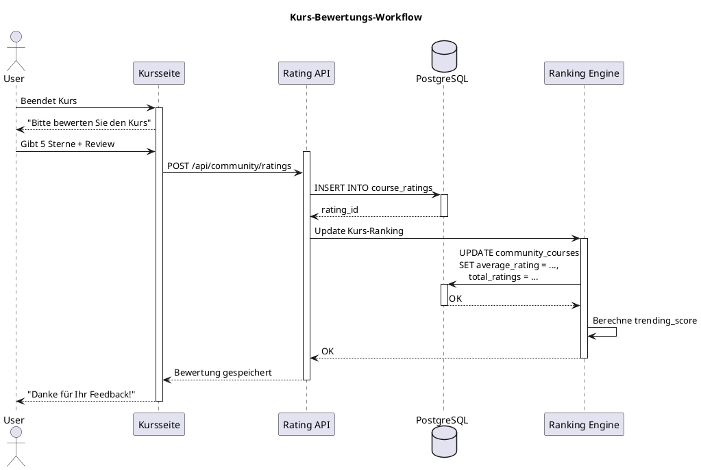

### Bewertungs-Datenstruktur

```json
{
  "rating_id": "r1a2t3i4-...",
  "community_course_id": "c5o6u7r8-...",
  "user_id": "u9s0e1r2-...",
  "rating": 5,
  "review_text": "Hervorragender Kurs! Die KI-gestützten Methoden haben mir sehr geholfen.",
  "helpful_count": 23,
  "verified_purchase": true,
  "created_at": "2024-02-10T14:30:00Z",
  "updated_at": "2024-02-10T14:30:00Z"
}
```

### Kommentar-Hierarchie

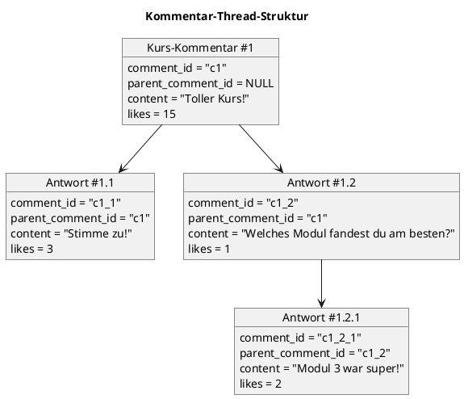

---

## 8. Moderations-System

### Moderation-Workflow

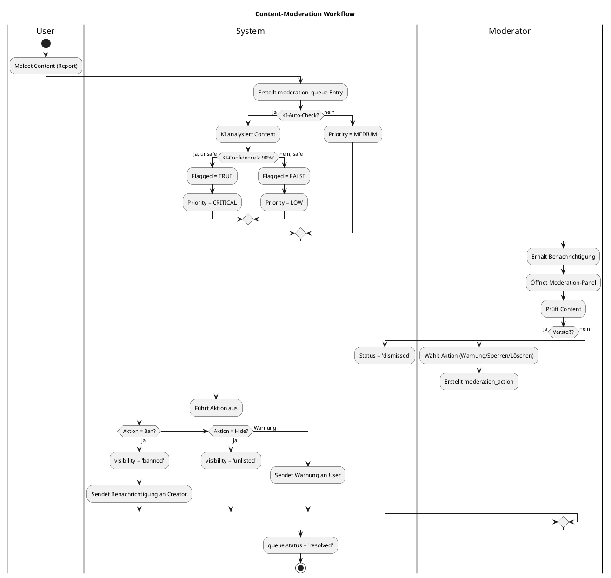

### Moderations-Aktionen

| Aktion | Beschreibung | Dauer | Auswirkung |
|--------|--------------|-------|------------|
| **Warnung** | User wird gewarnt | Permanent (Log) | Keine direkte Auswirkung |
| **Ausblenden** | Content unsichtbar | Temporär/Permanent | visibility = 'unlisted' |
| **Sperren** | Content gebannt | Permanent | visibility = 'banned' |
| **Löschen** | Content gelöscht | Permanent | Datensatz entfernt |
| **Freigeben** | Content genehmigt | - | Zurück zu 'public' |

### KI-Moderation

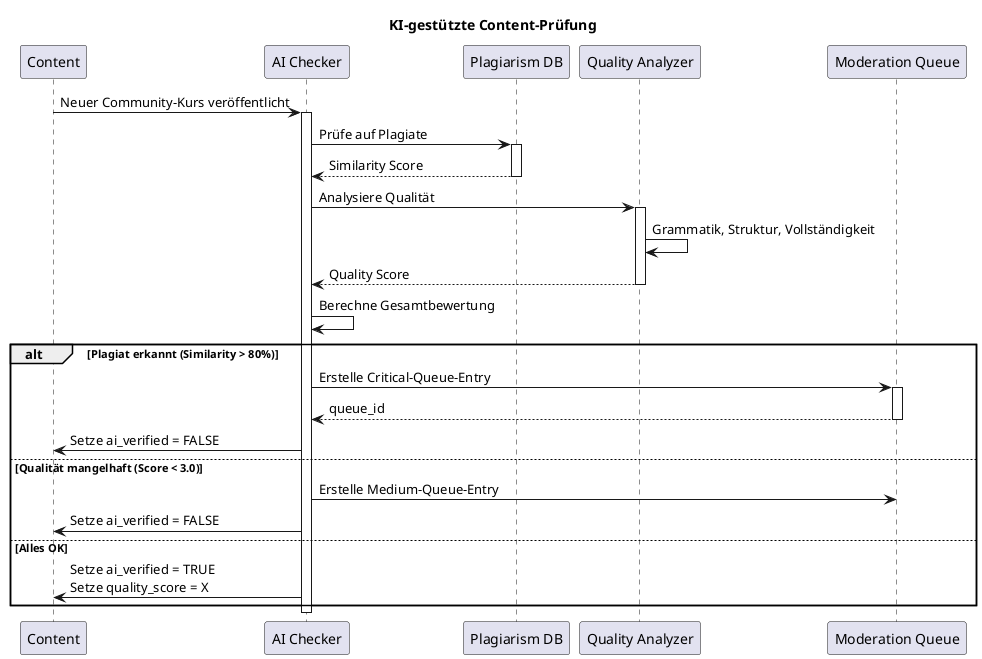

---

## 9. KI in der Community

### KI-Module für Community

| KI-Modul | Funktion | Einsatzbereich |
|----------|----------|----------------|
| **Content-Analyzer** | Qualitätsprüfung | Neue Kurse |
| **Plagiarism-Checker** | Duplikate finden | Alle Inhalte |
| **Category-Suggester** | Auto-Kategorisierung | Neue Kurse |
| **Sentiment-Analyzer** | Bewertungsanalyse | Reviews & Kommentare |
| **Recommendation-Engine** | Personalisierte Vorschläge | Kurs-Browser |
| **Spam-Detector** | Spam-Erkennung | Kommentare & Bewertungen |
| **Quality-Scorer** | Bewertung der Kursqualität | Ranking |

### KI-Qualitätsprüfung

```python
# Beispiel: KI-Qualitätsprüfung für Community-Kurse

from ai_modules.content_analyzer import analyze_course_quality
from ai_modules.plagiarism_checker import check_plagiarism
from models.community_course import CommunityCourse

def ai_verify_course(course_id):
    """
    KI-gestützte Qualitätsprüfung für Community-Kurse
    """
    course = CommunityCourse.query.get(course_id)

    # 1. Plagiatsprüfung
    plagiarism_score = check_plagiarism(
        title=course.title,
        description=course.description,
        content=course.get_full_content()
    )

    if plagiarism_score > 0.8:
        # Zu hohe Ähnlichkeit mit existierenden Kursen
        flag_for_moderation(
            course_id=course_id,
            reason="Mögliches Plagiat",
            priority="critical",
            ai_confidence=plagiarism_score
        )
        return False

    # 2. Qualitätsanalyse
    quality_metrics = analyze_course_quality(
        course_content=course.get_full_content(),
        modules=course.get_modules(),
        learning_methods=course.get_learning_methods()
    )

    course.quality_score = quality_metrics['overall_score']

    if quality_metrics['overall_score'] < 3.0:
        # Niedrige Qualität
        flag_for_moderation(
            course_id=course_id,
            reason="Qualität unter Mindeststandard",
            priority="medium",
            ai_confidence=quality_metrics['confidence']
        )
        course.ai_verified = False
    else:
        course.ai_verified = True

    # 3. Auto-Kategorisierung
    suggested_categories = quality_metrics['suggested_categories']
    if not course.category:
        course.category = suggested_categories[0]
        course.subcategory = suggested_categories[1]

    course.save()
    return course.ai_verified
```

---

## 10. Community-Ranking

### Ranking-Algorithmus

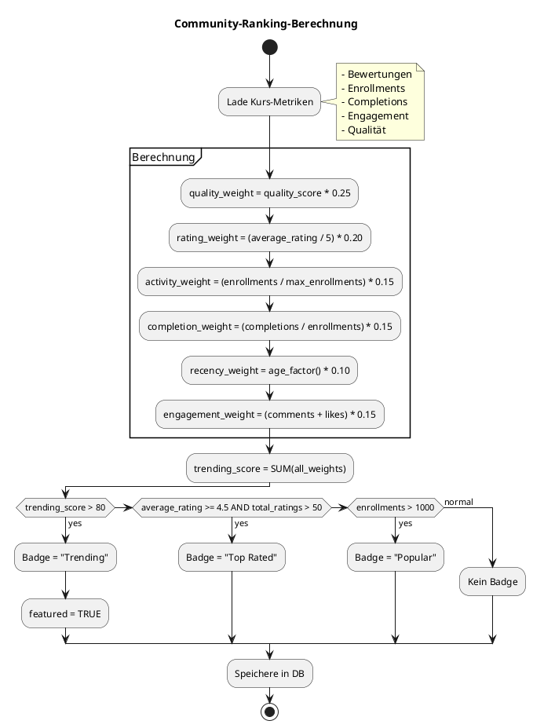

### Ranking-Kategorien

| Kategorie | Kriterien | Badge |
|-----------|-----------|-------|
| **Trending** | trending_score > 80 | 🔥 Trending |
| **Top Rated** | average_rating ≥ 4.5 AND total_ratings > 50 | ⭐ Top Rated |
| **Popular Today** | enrollments_today > 100 | 📈 Popular |
| **Editor's Pick** | Manuell ausgewählt von Admins | ✨ Editor's Pick |
| **Premium Recommended** | quality_score > 4.0 AND creator_verified | 💎 Premium |
| **LSX Academy** | Offizieller Kurs | 🏆 LSX Academy |

### Ranking-Gewichtung

```javascript
// Beispiel: Trending-Score-Berechnung

function calculateTrendingScore(course) {
  const weights = {
    quality: 0.25,      // KI-Qualitätsscore
    rating: 0.20,       // User-Bewertungen
    activity: 0.15,     // Enrollments
    completion: 0.15,   // Completion Rate
    recency: 0.10,      // Aktualität
    engagement: 0.15    // Comments + Likes
  };

  const metrics = {
    quality: course.quality_score / 5,
    rating: course.average_rating / 5,
    activity: Math.min(course.total_enrollments / 1000, 1),
    completion: course.completions / Math.max(course.total_enrollments, 1),
    recency: calculateRecencyFactor(course.created_at),
    engagement: Math.min((course.total_comments + course.total_likes) / 500, 1)
  };

  let score = 0;
  for (const [key, weight] of Object.entries(weights)) {
    score += metrics[key] * weight * 100;
  }

  return Math.round(score * 10) / 10; // 0-100
}

function calculateRecencyFactor(createdAt) {
  const ageInDays = (Date.now() - new Date(createdAt)) / (1000 * 60 * 60 * 24);

  if (ageInDays < 7) return 1.0;       // Letzte Woche
  if (ageInDays < 30) return 0.8;      // Letzter Monat
  if (ageInDays < 90) return 0.5;      // Letzte 3 Monate
  if (ageInDays < 365) return 0.3;     // Letztes Jahr
  return 0.1;                           // Älter als 1 Jahr
}
```

---

## 11. Community-Regeln

### Verhaltenskodex

| Nr. | Regel | Konsequenz bei Verstoß |
|-----|-------|------------------------|
| 1 | Kein Spam oder Werbung | Warnung → Ban |
| 2 | Keine Plagiate | Sofortige Sperrung |
| 3 | Keine illegalen Inhalte | Sofortige Sperrung + Meldung |
| 4 | Respektvoller Umgangston | Warnung → Temporärer Ban |
| 5 | KI-Inhalte müssen verifizierbar sein | Kurs-Review |
| 6 | Keine externen Werbelinks | Entfernung + Warnung |
| 7 | Keine falschen Informationen | Kurs-Review → Sperrung |
| 8 | Keine doppelten Kurse | Duplikat löschen |

### Content-Policy

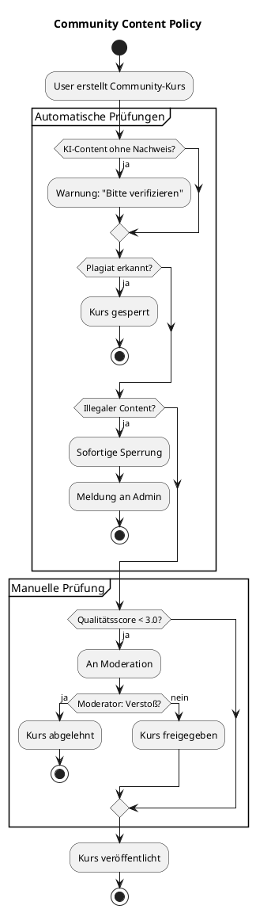

---

## 12. Interne Funktionen für LSX Academy & Admin

### Admin-Dashboard

```plantuml
@startuml
!include <C4/C4_Component>

title Admin Community-Dashboard

Container_Boundary(admin_dashboard, "Admin Dashboard") {
  Component(analytics, "Community-Analytics", "Python/Pandas", "Metriken & Statistiken")
  Component(promotion, "Promotion-Engine", "Python", "Kurse für Marketing auswählen")
  Component(creator_insights, "Creator-Insights", "Vue.js", "High-Potential Creators")
  Component(content_monitor, "Content-Monitor", "Python/AI", "Verdächtige Inhalte")
  Component(cluster_analysis, "Themen-Cluster", "ML", "Schwachstellen-Analyse")
  Component(engagement, "Engagement-Tracker", "Python", "Community-Aktivität")
}

Database(analytics_db, "Analytics DB", "PostgreSQL")
System_Ext(ai_pipeline, "KI-Pipeline", "ML Models")

Rel(analytics, analytics_db, "Liest Metriken")
Rel(promotion, analytics, "Nutzt Daten")
Rel(creator_insights, analytics, "Nutzt Daten")
Rel(content_monitor, ai_pipeline, "KI-Analyse")
Rel(cluster_analysis, ai_pipeline, "ML-Clustering")

@enduml
```

### Admin-Metriken

| Metrik | Beschreibung | Verwendung |
|--------|--------------|------------|
| **Kurs-Promotion-Score** | Eignung für Marketing | Auswahl für LSX Academy |
| **Creator-Potenzial** | High-Potential Creators | Direktansprache, Partnerschaften |
| **Content-Flagging** | Verdächtige Inhalte | Moderation |
| **Performance-Daten** | Top-Kurse, Top-Kategorien | Algorithmus-Optimierung |
| **Themen-Cluster** | Schwachstellen in Themen | Neue Kurse planen |
| **Engagement-Stats** | Aktivität pro Kategorie | Community-Strategie |

---

## 13. Analytics für Creator

### Creator-Dashboard

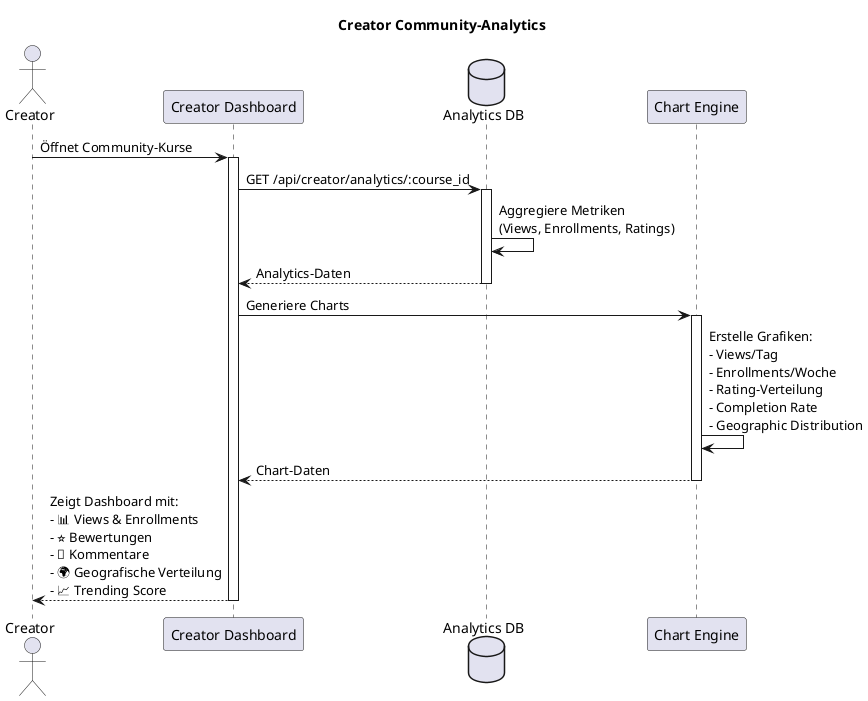

### Creator-Metriken

| Metrik | Beschreibung | Visualisierung |
|--------|--------------|----------------|
| **Views** | Anzahl Kursaufrufe | Line Chart (Zeitverlauf) |
| **Enrollments** | Einschreibungen | Line Chart (Zeitverlauf) |
| **Completions** | Abschlüsse | Pie Chart (%) |
| **Average Rating** | Durchschnittsbewertung | Star Rating + Bar Chart |
| **Reviews** | Anzahl Bewertungen | Number + List |
| **Comments** | Kommentare | Number + List |
| **Trending Score** | Aktueller Trending-Score | Gauge Chart (0-100) |
| **Revenue** | Einnahmen (für bezahlte Kurse) | Line Chart + Total |
| **Geographic Distribution** | Nutzer nach Land | Map Chart |
| **Completion Rate** | Abschlussquote | Percentage + Trend |

---

## 14. API-Endpoints

### Community-API

| Endpoint | Methode | Beschreibung | Auth | Rolle |
|----------|---------|--------------|------|-------|
| `/api/community/courses` | GET | Liste aller Community-Kurse | Optional | Alle |
| `/api/community/courses/:id` | GET | Kursdetails | Optional | Alle |
| `/api/community/courses` | POST | Neuen Kurs erstellen | ✅ | Premium+, Creator |
| `/api/community/courses/:id` | PUT | Kurs aktualisieren | ✅ | Creator (eigener Kurs) |
| `/api/community/courses/:id` | DELETE | Kurs löschen | ✅ | Creator (eigener Kurs), Admin |
| `/api/community/groups` | GET | Liste aller Gruppen | Optional | Alle |
| `/api/community/groups` | POST | Gruppe erstellen | ✅ | Premium+, Creator, Lehrer |
| `/api/community/groups/:id/join` | POST | Gruppe beitreten | ✅ | Alle |
| `/api/community/groups/:id/leave` | POST | Gruppe verlassen | ✅ | Alle |
| `/api/community/ratings` | POST | Bewertung abgeben | ✅ | Alle |
| `/api/community/comments` | POST | Kommentar erstellen | ✅ | Alle |
| `/api/community/comments/:id` | DELETE | Kommentar löschen | ✅ | Ersteller, Moderator, Admin |
| `/api/community/moderation/report` | POST | Content melden | ✅ | Alle |
| `/api/community/moderation/queue` | GET | Moderation-Queue | ✅ | Moderator, Admin |
| `/api/community/moderation/action` | POST | Moderations-Aktion | ✅ | Moderator, Admin |
| `/api/community/analytics/:course_id` | GET | Kurs-Analytics | ✅ | Creator (eigener Kurs), Admin |

### Beispiel-Request: Kurs erstellen

```http
POST /api/community/courses
Authorization: Bearer <token>
Content-Type: application/json

{
  "course_id": "e5f6g7h8-...",
  "title": "Python für Anfänger",
  "description": "Grundlagen der Python-Programmierung",
  "is_free": true,
  "language": "de",
  "category": "IT",
  "subcategory": "Programmierung",
  "tags": ["Python", "Coding", "Anfänger"]
}
```

**Response:**

```json
{
  "status": "success",
  "data": {
    "community_course_id": "a1b2c3d4-...",
    "course_id": "e5f6g7h8-...",
    "created_by": "user_uuid",
    "title": "Python für Anfänger",
    "visibility": "public",
    "ai_verified": false,
    "quality_score": null,
    "created_at": "2024-02-15T10:00:00Z"
  },
  "message": "Kurs wird von KI geprüft und dann veröffentlicht."
}
```

---

## 15. Zukunftserweiterungen

### Geplante Features

| Feature | Beschreibung | Priorität | Status |
|---------|--------------|-----------|--------|
| **Community-Challenges** | Wettbewerbe & Challenges | Hoch | Geplant |
| **Badges & Achievements** | Gamification für Community | Mittel | Geplant |
| **Creator-Partnerschaft** | Offizielle LSX-Partner | Hoch | In Entwicklung |
| **Live-Events** | Community-weite Events | Mittel | Geplant |
| **Mentorship-Programm** | Creator helfen Lernenden | Niedrig | Idee |
| **Community-Podcasts** | Audio-Inhalte | Niedrig | Idee |

---

## 16. Zusammenfassung

### ✅ Kernfunktionen

| Bereich | Features |
|---------|----------|
| **Kurse** | Kostenlose & bezahlte Community-Kurse, Premium-optimiert, LSX Academy Vorschau |
| **Gruppen** | Öffentliche & private Study Groups, Chat, Whiteboard, Datei-Sharing |
| **Social** | Kommentare, Bewertungen, Diskussionen |
| **Moderation** | KI-gestützte Content-Prüfung, Moderation-Queue, Aktionen |
| **Ranking** | Trending, Top Rated, Popular, Editor's Pick |
| **Analytics** | Creator-Dashboard, Admin-Insights, Community-Metriken |
| **KI** | Qualitätsprüfung, Plagiatserkennung, Auto-Kategorisierung |

### 🎯 Design-Prinzipien

- **Inklusiv:** Free User haben Zugang zu Basis-Inhalten
- **Qualität:** KI-gestützte Qualitätssicherung
- **Community-Driven:** Nutzer erstellen & teilen Inhalte
- **Fair für Creator:** 75% Revenue Share, Analytics, Global Publishing
- **Moderiert:** Strenge Regeln & Moderation
- **Skalierbar:** Elasticsearch, Caching, Ranking-Engine

---

## 📌 Dokument abgeschlossen

**Version:** 1.0
**Status:** Final
**Letzte Aktualisierung:** 2024

---

> 💡 **Hinweis:** Das Community-System ist ein lebendiges Ökosystem, das durch Nutzer, Creator und KI gemeinsam wächst. Es bildet das Herzstück des sozialen Lernens bei LSX.
