# 18 – Editor-System (Final)

**Version:** 1.0  
**Stand:** Final

---

## Überblick

Dieses Dokument beschreibt das vollständige Editor-System des LSX Lernsystems.

Das Editor-System ist **zentral** für das Erstellen, Bearbeiten und Optimieren von:

- 📚 **Kursen**
- 📖 **Modulen**
- 📄 **Theorieblättern**
- 🎯 **Lernmethoden** (12 Content-LMs, A-C)
- 📝 **Prüfungen**
- 🌍 **Übersetzungen**
- 🎨 **Whiteboard-Inhalten**
- ✨ **Creator-Content**

> Das System ist **komponentenbasiert** aufgebaut und erlaubt sowohl **manuelle Bearbeitung** als auch **KI-Unterstützung**.

---

## 1. Editor-System Architektur (C4 Model)

### 🏗️ System Context

```plantuml
@startuml
!include https://raw.githubusercontent.com/plantuml-stdlib/C4-PlantUML/master/C4_Container.puml

Person(creator, "Creator", "Erstellt Kurse")
Person(teacher, "Lehrer", "Bearbeitet Schulinhalte")
Person(admin, "Admin", "Verwaltet System")

System_Boundary(editor, "Editor-System") {
    Container(course_editor, "Kurs-Editor", "Vue.js", "Kurs-Verwaltung")
    Container(module_editor, "Modul-Editor", "Vue.js", "Modul-Bearbeitung")
    Container(method_editor, "Methoden-Editor", "Vue.js", "12 Content-LMs (A-C)")
    Container(theory_editor, "Theorieblatt-Editor", "Vue.js", "Markdown Editor")
    Container(exam_editor, "Prüfungs-Editor", "Vue.js", "Exam Builder")
    Container(whiteboard_editor, "Whiteboard-Editor", "Canvas API", "Zeichnen + KI")
    Container(validator, "Validator Panel", "Vue.js", "Qualitätsprüfung")
}

System_Ext(ki_api, "KI API", "Anthropic/OpenAI")
System_Ext(backend, "LSX Backend", "Flask API")

Rel(creator, course_editor, "Erstellt Kurse")
Rel(teacher, module_editor, "Bearbeitet Module")
Rel(admin, validator, "Prüft Qualität")

Rel(course_editor, backend, "API Calls", "JSON/REST")
Rel(method_editor, ki_api, "KI-Generierung", "HTTPS")
Rel(whiteboard_editor, ki_api, "KI-Analyse", "HTTPS")
Rel(validator, backend, "Validierung", "JSON/REST")

@enduml
```

---

### 🧩 Component Diagram

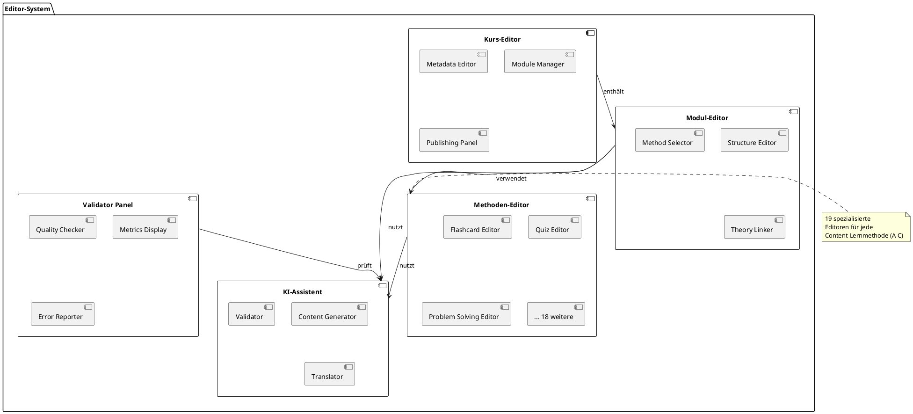

---

## 2. Ziele des Editor-Systems

### ✅ Das Editor-System soll:

| Ziel | Umsetzung |
|------|-----------|
| 🎯 **Intuitive Bearbeitung** | Drag & Drop, WYSIWYG |
| 👥 **Professionelle Tools** | Creator, Lehrer, Schulen, Admins |
| 📝 **12 Content-Lernmethoden (A-C)** | Konsistente Bearbeitung |
| 🤖 **KI-Unterstützung** | Automatisierung & Optimierung |
| 💾 **Strukturierte Daten** | JSON-Schema Validierung |
| 🔄 **Versionierung** | Git-ähnliches System |
| ♿ **Barrierefrei** | WCAG 2.1 AA |
| 🌍 **Mehrsprachig** | i18n Integration |

---

## 3. Editor-Arten Übersicht

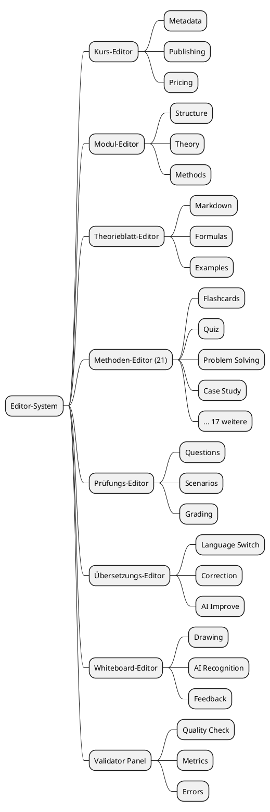

---

## 4. Kurs-Editor

### 📚 Funktionen

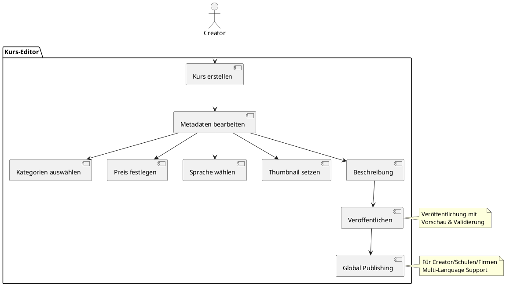

---

### 🎯 Kursstruktur-Panel

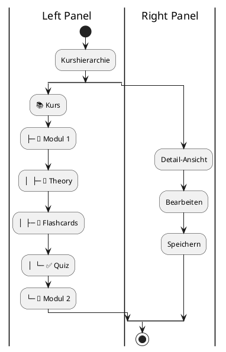

---

## 5. Modul-Editor

### 📖 Funktionen & Workflow

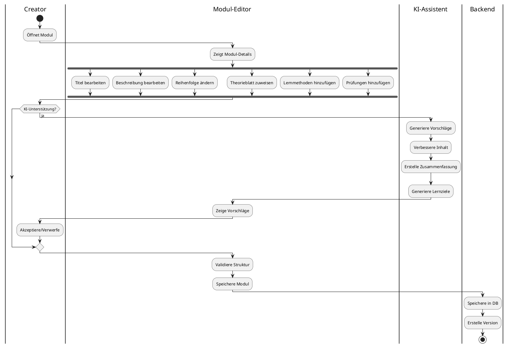

---

### 🤖 KI-Unterstützung

| Funktion | Beschreibung |
|----------|--------------|
| 📄 **Aus PDF generieren** | Automatische Modul-Erstellung |
| 💡 **Verbesserungsvorschläge** | KI analysiert Struktur |
| 📝 **Zusammenfassung** | Auto-generierte Summary |
| 🎯 **Lernziele** | Automatisch erstellt |

---

## 6. Theorieblatt-Editor

### 📄 Editor-Komponenten

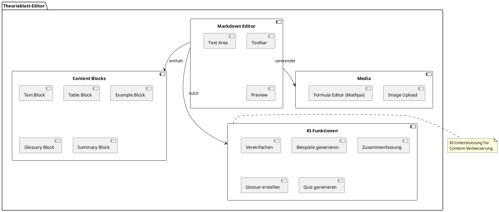

---

### 🎨 Editor UI Flow

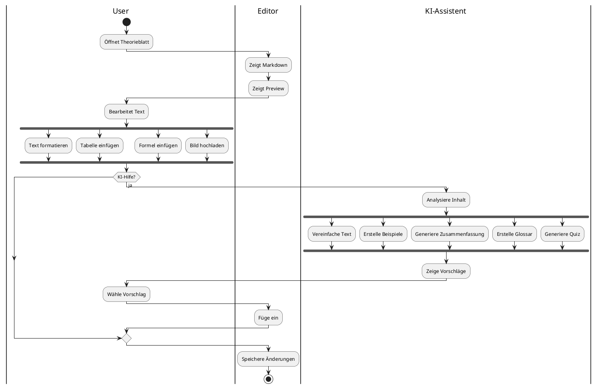

---

## 7. Methoden-Editor (12 Content-LMs)

### 🎯 Alle 12 Content-Lernmethoden (Gruppen A-C)

| Nr | Methode | Editor-Typ |
|----|---------|-----------|
| 1 | 🎴 Flashcards | Card-based |
| 2 | ✅ Quiz (MCQ) | Question-based |
| 3 | 🗺️ Mindmap | Visual |
| 4 | ✏️ Fill-in-the-Blanks | Text-based |
| 5 | 🎯 Drag & Drop | Interactive |
| 6 | 🔗 Matching | Pair-based |
| 7 | 📝 Summary | Text-based |
| 8 | ⏱️ Timeline | Sequential |
| 9 | 📖 Storytelling | Narrative |
| 10 | 🎭 Roleplay | Scenario-based |
| 11 | 📊 Case Study | Analysis-based |
| 12 | 🧩 Problem Solving | Step-based |
| 13 | 👥 Peer Learning | Collaborative |
| 14 | 🎮 Gamification | Game-based |
| 15 | 🔄 Spaced Repetition | Algorithm-based |
| 16 | 🎥 Video-Based | Media-based |
| 17 | 📄 Theory Sheet | Document-based |
| 18 | 🔢 Matheaufgaben | Calculation-based |
| 19 | 📈 Diagramm-Erkennung | Visual-recognition |
| 20 | 📝 Prüfungssimulation | Exam-based |
| 21 | 🎨 Whiteboard KI-Analyse | Canvas-based |

---

### 🧩 Methoden-Editor Framework

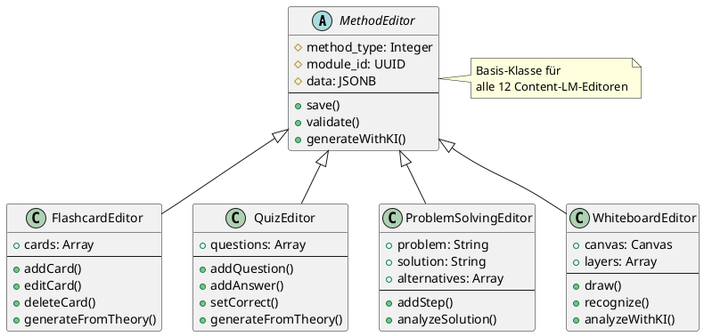

---

### 💡 Beispiel: Flashcard-Editor

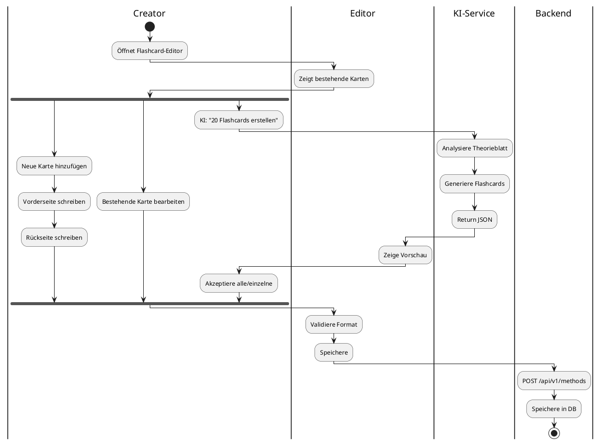

---

### 💡 Beispiel: Quiz-Editor

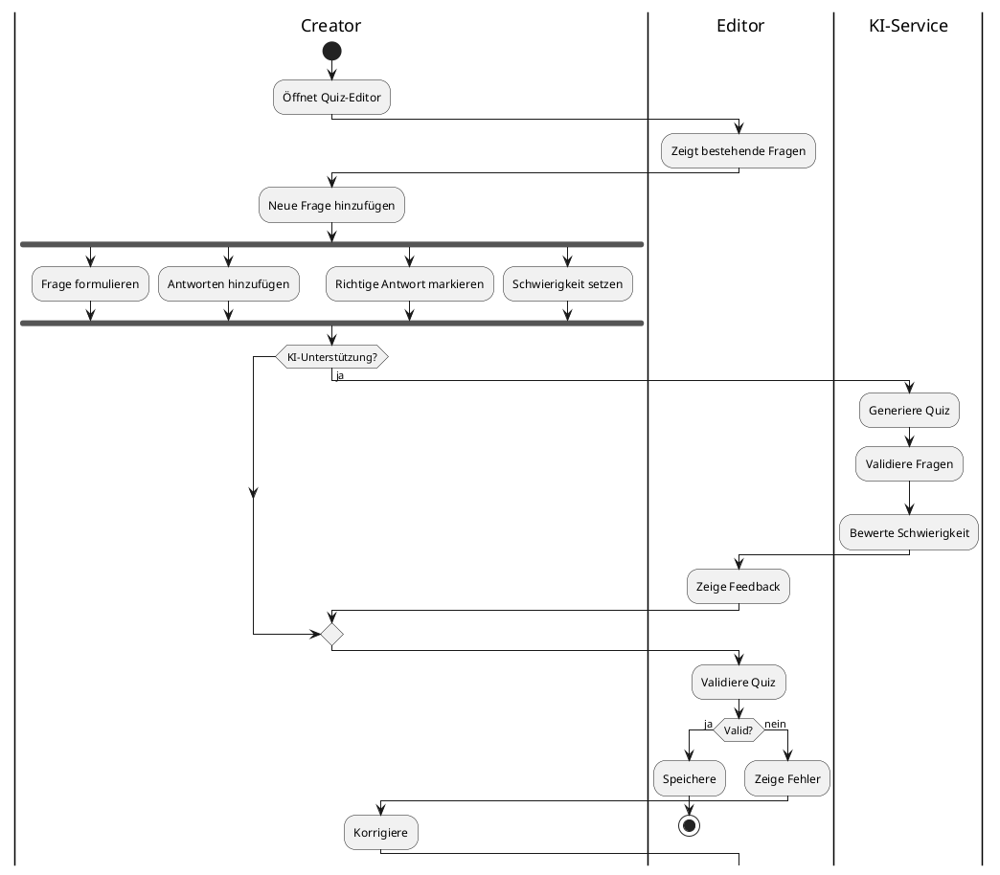

---

## 8. Prüfungs-Editor

### 📝 Editor-Architektur

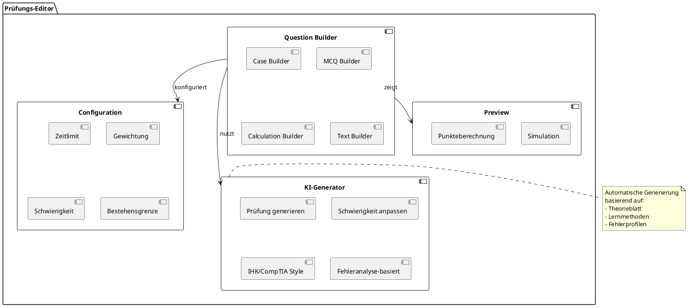

---

### 🔄 Prüfungs-Erstellung Flow

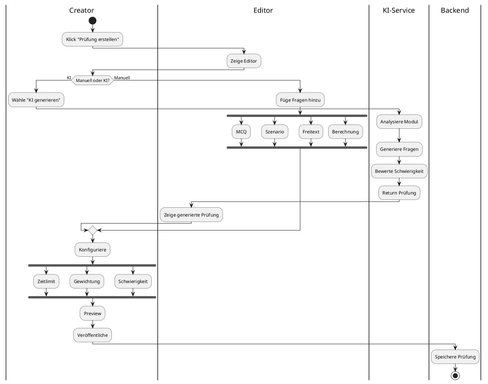

---

## 9. Übersetzungs-Editor

### 🌍 Translation Workflow

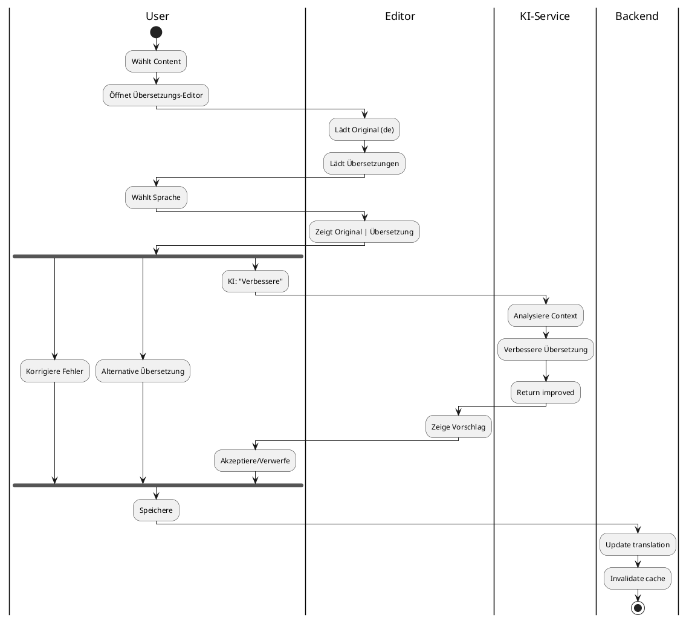

---

## 10. Whiteboard-Editor (mit KI)

### 🎨 Editor-Komponenten

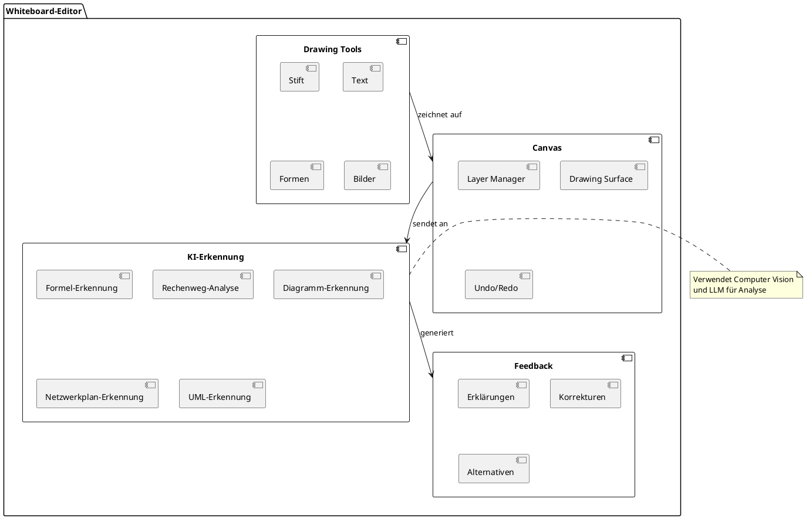

---

### 🔄 Whiteboard KI-Analyse Flow

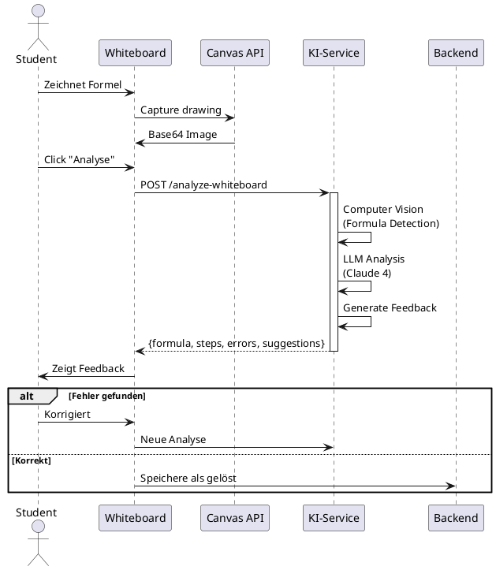

---

### 🤖 KI-Erkennungs-Fähigkeiten

| Typ | Erkennung | Feedback |
|-----|-----------|----------|
| 🔢 **Formeln** | LaTeX-Extraktion | Richtig/Falsch |
| 📊 **Diagramme** | Struktur-Erkennung | Vollständigkeit |
| 🌐 **Netzwerkpläne** | Topologie-Analyse | Optimierungen |
| 📐 **UML** | Diagramm-Typ | Syntax-Check |
| ➗ **Rechenwege** | Schritt-für-Schritt | Fehler finden |

---

## 11. Validator Panel

### ✅ Quality Assurance System

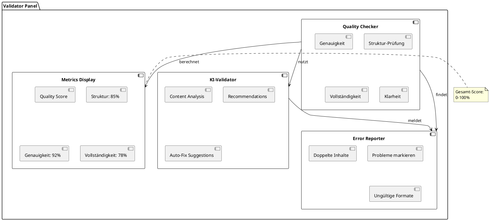

---

### 📊 Qualitätsmetriken

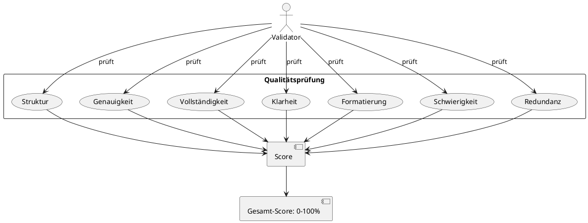

---

## 12. Versionierung im Editor

### 🔄 Version Control System

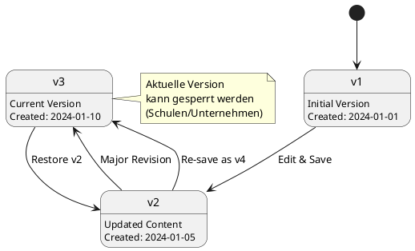

---

### 📂 Versionierungs-Funktionen

| Funktion | Beschreibung |
|----------|--------------|
| 📜 **History** | Alle Versionen anzeigen |
| 🔄 **Restore** | Alte Version wiederherstellen |
| 🔍 **Compare** | Diff zwischen Versionen |
| 🔒 **Lock** | Version sperren (Schulen) |
| 🏷️ **Tag** | Version markieren |
| 📝 **Comments** | Änderungen kommentieren |

---

## 13. Editor API-Schnittstellen

### 🔌 API Endpoints Overview

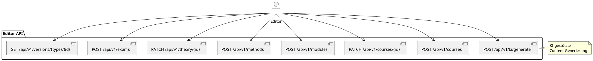

---

### 💡 API Request/Response Flow

```plantuml
@startuml
participant "Editor UI" as ui
participant "Pinia Store" as store
participant "API Service" as service
participant "Backend" as backend
participant "KI Service" as ki
database "PostgreSQL" as db

ui -> store: saveModule(data)
activate store

store -> service: moduleService.create(data)
activate service

service -> backend: POST /api/v1/modules
activate backend

backend -> backend: Validate data
backend -> db: INSERT module
db --> backend: module_id

backend -> ki: Queue analysis task
ki --> backend: task_id

backend --> service: {success, module_id, task_id}
deactivate backend

service --> store: Response
deactivate service

store -> store: Update state
store --> ui: Success
deactivate store

ui -> ui: Show notification

... 5 seconds later ...

ki -> backend: Analysis complete
backend -> ui: WebSocket notification
ui -> ui: Show KI suggestions
@enduml
```

---

## 14. Sicherheit

### 🔒 Security Measures

```plantuml
@startuml
|Request|
start

|Auth Layer|
:Check JWT Token;
if (Valid?) then (no)
  :401 Unauthorized;
  stop
endif

|Role Layer|
:Check User Role;
if (Has Permission?) then (no)
  :403 Forbidden;
  stop
endif

|Validation Layer|
:Sanitize Input;
:Validate Schema;
if (Valid?) then (no)
  :400 Bad Request;
  stop
endif

|Rate Limit|
:Check KI Usage;
if (Limit Exceeded?) then (yes)
  :429 Too Many Requests;
  stop
endif

|Version Control|
if (Version Locked?) then (yes)
  :Check Lock Permission;
  if (Allowed?) then (no)
    :423 Locked;
    stop
  endif
endif

|Process|
:Execute Operation;
:Log Action;
:Return Success;
stop
@enduml
```

---

### 🛡️ Security Features

| Feature | Implementation |
|---------|---------------|
| 🔐 **Rollenprüfung** | Middleware Decorator |
| 🧹 **Input Sanitization** | XSS Protection |
| 🤖 **KI-Abuse Schutz** | Rate Limiting |
| 🔒 **Version Lock** | DB Flag + Permission |
| 👥 **Rechteverwaltung** | Hierarchisches System |
| 📝 **Audit Log** | Alle Änderungen geloggt |

---

## 15. Zusammenfassung

### ✅ Das LSX Editor-System ist:

| Feature | Status |
|---------|--------|
| 🧩 **Modular** | ✅ Komponenten-basiert |
| 🤖 **KI-unterstützt** | ✅ Anthropic/OpenAI |
| 💼 **Professionell** | ✅ Enterprise-Ready |
| 🔧 **Anpassbar** | ✅ Für alle Rollen |
| 📝 **12 Content-Lernmethoden (A-C)** | ✅ Vollständig |
| 🔄 **Versioniert** | ✅ Git-ähnlich |
| ✅ **Validierung** | ✅ Qualitätssystem |
| 🌍 **Mehrsprachig** | ✅ i18n Support |

---

### 🎯 Editor-Übersicht

```
┌─────────────────────────────────────┐
│  📚 Kurs-Editor                      │
│  📖 Modul-Editor                     │
│  📄 Theorieblatt-Editor              │
│  🎯 Methoden-Editor (32 Stück)      │
│  📝 Prüfungs-Editor                  │
│  🌍 Übersetzungs-Editor              │
│  🎨 Whiteboard-Editor mit KI         │
│  ✅ Validator Panel                  │
│  🔄 Versionierungs-System            │
└─────────────────────────────────────┘
```

---

### 💡 Editor-Features

| Kategorie | Features |
|-----------|----------|
| 🎨 **UI** | WYSIWYG, Drag & Drop, Preview |
| 🤖 **KI** | Auto-Generate, Analyze, Suggest |
| 💾 **Storage** | Auto-Save, Versions, Backup |
| ✅ **Validation** | Real-time, Quality Score |
| 🔒 **Security** | Role-based, Sanitization |
| 🌍 **i18n** | Multi-language Support |

> **Es ist der zentrale Arbeitsplatz für das Erstellen von Lerninhalten.**

---
## 📌 Dokument abgeschlossen
---

> 💡 **Hinweis:** Dieses Dokument ist Teil der LSX-Systemdokumentation und beschreibt das vollständige Editor-System mit allen 12 Content-Lernmethoden (Gruppen A-C), KI-Integration und Qualitätssicherung.