# 20 – Internationalisierung & Lokalisierung (Final)

**Version:** 1.0  
**Stand:** Final

---

## Überblick

Dieses Dokument beschreibt das vollständige **Internationalisierungs- (i18n)** und **Lokalisierungssystem (L10n)** des LSX Lernsystems.

Die Internationalisierung ist **zentral**, da LSX **global nutzbar** sein soll, inklusive **automatischer KI-Übersetzungen** für Kurse.

---

## 1. Ziele der Internationalisierung

### ✅ i18n System Ziele

| Ziel | Umsetzung |
|------|-----------|
| 🌍 **Vollständige UI-Übersetzung** | vue-i18n mit JSON-Dateien |
| 📚 **Content-Übersetzung** | KI-gestützte Übersetzungen |
| ✨ **Global Publishing** | Creator können weltweit publishen |
| 🔄 **Echtzeit-Sprachwechsel** | Ohne Page Reload |
| 🔍 **Auto-Detection** | Browser-Sprache erkennen |
| 📅 **Lokalisierung** | Datum, Zeit, Zahlen formatieren |
| 🤖 **KI-Übersetzung** | Anthropic/OpenAI Integration |
| ♿ **Barrierefreiheit** | Vereinfachte Sprachen, ADHD-Modus |

---

## 2. i18n System Architecture (C4 Model)

### 🌍 Internationalization System Context

```plantuml
@startuml
!include https://raw.githubusercontent.com/plantuml-stdlib/C4-PlantUML/master/C4_Container.puml

LAYOUT_WITH_LEGEND()

Person(user_de, "Deutscher User", "Nutzer aus DE")
Person(user_pl, "Polnischer User", "Nutzer aus PL")
Person(creator, "Creator", "Erstellt mehrsprachige Kurse")

System_Boundary(i18n, "i18n System") {
    Container(ui_i18n, "UI i18n", "vue-i18n", "Statische UI-Texte")
    Container(content_i18n, "Content i18n", "PostgreSQL", "Dynamische Inhalte")
    Container(translation_engine, "Translation Engine", "KI", "Automatische Übersetzung")
    Container(locale_service, "Locale Service", "JavaScript", "Formatierung")
}

System_Ext(ki_api, "KI APIs", "Anthropic/OpenAI")

Rel(user_de, ui_i18n, "Browser: de", "HTTPS")
Rel(user_pl, ui_i18n, "Browser: pl", "HTTPS")

Rel(ui_i18n, content_i18n, "Lädt Content", "API")
Rel(creator, translation_engine, "Global Publishing", "API")
Rel(translation_engine, ki_api, "Übersetzt", "HTTPS")
Rel(translation_engine, content_i18n, "Speichert", "SQL")
Rel(ui_i18n, locale_service, "Formatiert", "JS")

note right of translation_engine
  Automatische Übersetzung:
  - Kurse
  - Module
  - Methoden
  - Prüfungen
end note

@enduml
```

---

### 🧩 i18n Components

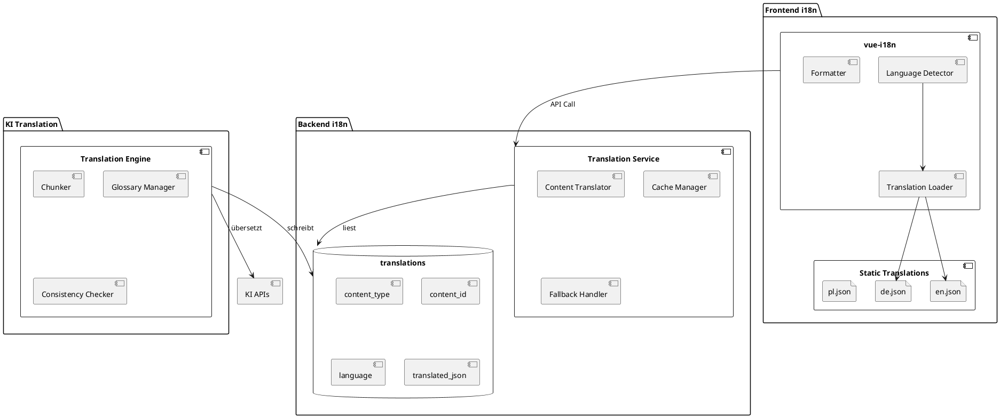

---

## 3. Unterstützte Sprachen

### 🌐 Language Support Matrix

```plantuml
@startuml
card "Standard-Sprachen (Always Active)" #E8F4F8 {
  :🇩🇪 Deutsch (de);
  :🇬🇧 Englisch (en);
  :🇵🇱 Polnisch (pl);
}

card "Erweiterbare Sprachen (Admin Activation)" #FFF4E1 {
  :🇫🇷 Französisch (fr);
  :🇪🇸 Spanisch (es);
  :🇮🇹 Italienisch (it);
  :🇳🇱 Niederländisch (nl);
  :🇸🇪 Schwedisch (sv);
  :🇳🇴 Norwegisch (no);
  :🇵🇹 Portugiesisch (pt);
  :🇹🇷 Türkisch (tr);
  :🇸🇦 Arabisch (ar);
  :🇯🇵 Japanisch (ja);
  :🇰🇷 Koreanisch (ko);
  :🇨🇳 Chinesisch (zh);
}

note bottom
  Alle Sprachen können
  per Admin-Panel
  aktiviert werden
end note
@enduml
```

---

### 📋 Sprachen-Übersicht

| Kategorie | Sprachen | Status |
|-----------|----------|--------|
| **Standard** | DE, EN, PL | ✅ Immer aktiv |
| **EU-West** | FR, ES, IT, NL | ⚠️ Admin-Aktivierung |
| **EU-Nord** | SV, NO | ⚠️ Admin-Aktivierung |
| **Global** | PT, TR | ⚠️ Admin-Aktivierung |
| **Asien** | JA, KO, ZH | ⚠️ Admin-Aktivierung |
| **MENA** | AR | ⚠️ Admin-Aktivierung + RTL |

---

## 4. Sprachlogik & Fallback

### 🔄 Language Detection & Fallback Flow

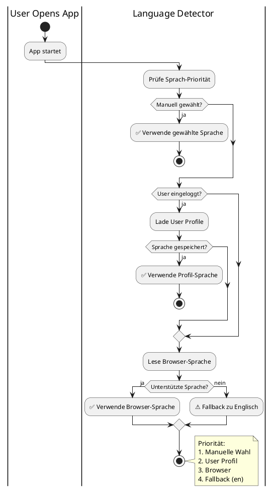

---

### 🗂️ Content Fallback Strategy

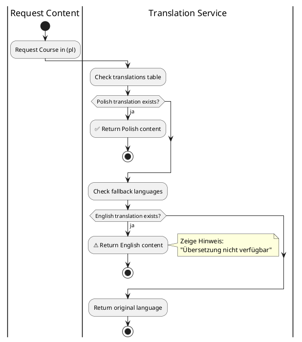

---

## 5. Lokalisierung (L10n)

### 📅 Locale-specific Formatting

| Locale | Datum | Zahlen | Währung | Timezone |
|--------|-------|--------|---------|----------|
| 🇩🇪 **de** | DD.MM.YYYY | 1.234,56 | 1.234,56 € | Europe/Berlin |
| 🇬🇧 **en-GB** | DD/MM/YYYY | 1,234.56 | £1,234.56 | Europe/London |
| 🇺🇸 **en-US** | MM/DD/YYYY | 1,234.56 | $1,234.56 | America/New_York |
| 🇵🇱 **pl** | DD.MM.YYYY | 1 234,56 | 1 234,56 zł | Europe/Warsaw |
| 🇫🇷 **fr** | DD/MM/YYYY | 1 234,56 | 1 234,56 € | Europe/Paris |
| 🇯🇵 **ja** | YYYY/MM/DD | 1,234.56 | ¥1,235 | Asia/Tokyo |

---

### 💡 Locale Service Implementation

```javascript
// Locale Service
export class LocaleService {
  formatDate(date, locale) {
    const formats = {
      'de': 'DD.MM.YYYY',
      'en-US': 'MM/DD/YYYY',
      'en-GB': 'DD/MM/YYYY',
      'pl': 'DD.MM.YYYY'
    }
    return dayjs(date).locale(locale).format(formats[locale])
  }
  
  formatCurrency(amount, locale) {
    const currencies = {
      'de': { style: 'currency', currency: 'EUR' },
      'en-US': { style: 'currency', currency: 'USD' },
      'en-GB': { style: 'currency', currency: 'GBP' },
      'pl': { style: 'currency', currency: 'PLN' }
    }
    return new Intl.NumberFormat(locale, currencies[locale]).format(amount)
  }
  
  formatNumber(number, locale) {
    return new Intl.NumberFormat(locale).format(number)
  }
}
```

---

### ⏰ Timezone Management

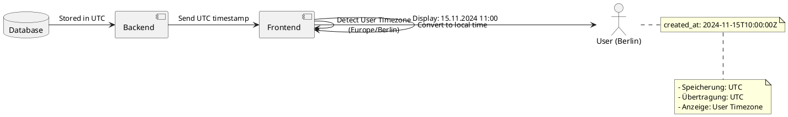

---

## 6. Global Publishing System

### ✨ Global Publishing Architecture

```plantuml
@startuml
!include https://raw.githubusercontent.com/plantuml-stdlib/C4-PlantUML/master/C4_Component.puml

Container_Boundary(publishing, "Global Publishing System") {
    Component(creator_ui, "Creator UI", "Vue.js", "Global Publishing Button")
    Component(translation_service, "Translation Service", "Python", "Orchestriert Übersetzung")
    Component(chunker, "Chunker", "Python", "Teilt Content (2000 tokens)")
    Component(ki_translator, "KI Translator", "Anthropic/OpenAI", "Übersetzt Content")
    Component(validator, "Validator", "Python", "Prüft Übersetzung")
    Component(storage, "Translation Storage", "PostgreSQL", "Speichert Übersetzungen")
}

System_Ext(anthropic, "Anthropic API", "Claude 3.5/4.0")
System_Ext(openai, "OpenAI API", "GPT-4")

Rel(creator_ui, translation_service, "Start Translation")
Rel(translation_service, chunker, "Prepare Content")
Rel(chunker, ki_translator, "Send Chunks")
Rel(ki_translator, anthropic, "Translate")
Rel(ki_translator, openai, "Translate")
Rel(ki_translator, validator, "Validate Translation")
Rel(validator, storage, "Save Translation")

note right of ki_translator
  KI-Features:
  - Chunking (2000 tokens)
  - Glossar-Referenz
  - Markup-Preservation
  - Konsistenz-Check
end note

@enduml
```

---

### 🔄 Global Publishing Workflow

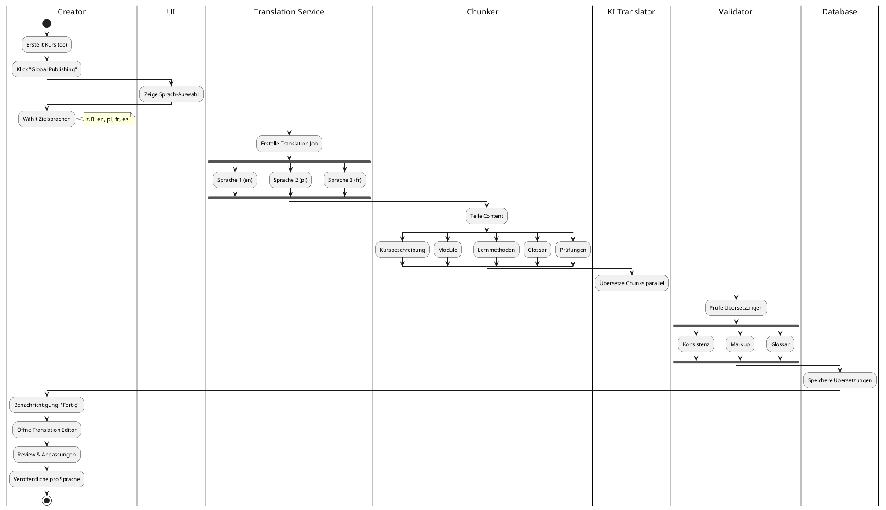

---

### 💰 Token-Kosten Management

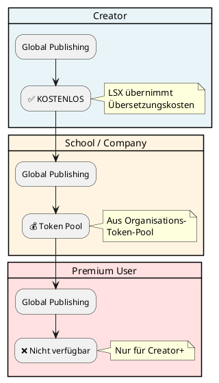

---

## 7. KI-Übersetzungslogik

### 🤖 Translation Engine Components

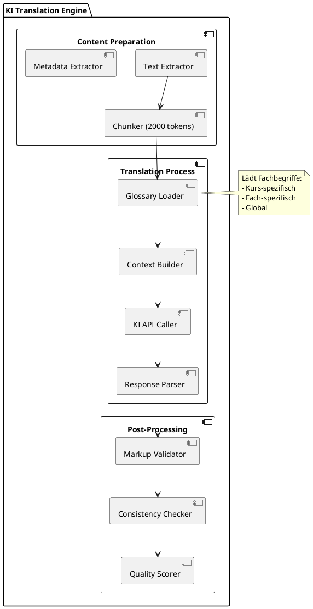

---

### 📋 KI-Übersetzungsstrategie

| Strategie | Beschreibung | Technologie |
|-----------|-------------|-------------|
| **Chunking** | Max. 2000 Tokens pro Chunk | Python |
| **Semantisches Matching** | Kontext-Erhaltung | KI |
| **Glossar-Referenz** | Fachbegriffe konsistent | Database |
| **Konsistenzprüfung** | Qualitätssicherung | Validator |
| **Markup-Preservation** | Listen, Tabellen, Formeln | Parser |

---

### 💡 Translation API Call

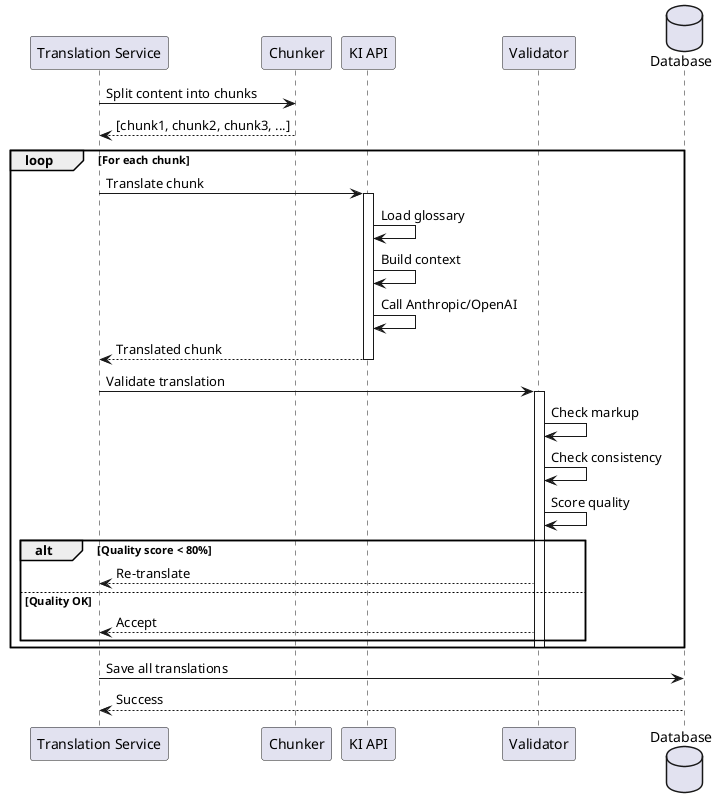

---

## 8. Markup & Code Preservation

### 🔒 Content Preservation Rules

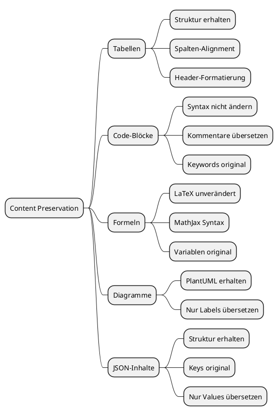

---

### 💡 Preservation Example

**Original (de):**
```markdown
## Beispiel: Python Loop

\```python
# Zähle von 1 bis 10
for i in range(1, 11):
    print(f"Zahl: {i}")
\```

| Variable | Typ | Beschreibung |
|----------|-----|--------------|
| i | int | Zählvariable |
```

**Übersetzt (en):**
```markdown
## Example: Python Loop

\```python
# Count from 1 to 10
for i in range(1, 11):
    print(f"Number: {i}")
\```

| Variable | Type | Description |
|----------|------|-------------|
| i | int | Counter variable |
```

---

## 9. API für Übersetzungen

### 🔌 Translation API Endpoints

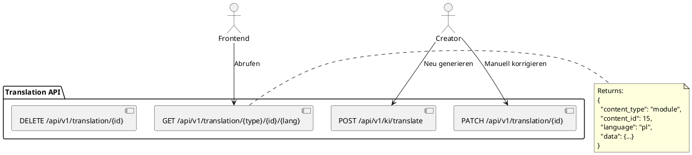

---

### 💡 API Examples

#### 1. Übersetzung abrufen

**Request:**
```http
GET /api/v1/translation/module/15/pl
Authorization: Bearer <token>
```

**Response:**
```json
{
  "content_type": "module",
  "content_id": 15,
  "language": "pl",
  "data": {
    "title": "Wprowadzenie do Pythona",
    "description": "Naucz się podstaw...",
    "content": "..."
  },
  "translated_at": "2024-11-15T10:00:00Z"
}
```

---

#### 2. Übersetzung erzeugen

**Request:**
```http
POST /api/v1/ki/translate
Authorization: Bearer <token>
Content-Type: application/json

{
  "content_type": "theory",
  "content_id": 15,
  "target_language": "pl"
}
```

**Response:**
```json
{
  "status": "success",
  "job_id": "trans-job-123",
  "estimated_time": 30,
  "message": "Translation started"
}
```

---

#### 3. Manuelle Korrektur

**Request:**
```http
PATCH /api/v1/translation/456
Authorization: Bearer <token>
Content-Type: application/json

{
  "data": {
    "title": "Korrigierter Titel",
    "description": "Korrigierte Beschreibung"
  }
}
```

---

## 10. Frontend-Integration

### 🎨 Language Switcher Component

```vue
<!-- LanguageSwitcher.vue -->
<template>
  <div class="language-switcher">
    <Dropdown>
      <template #trigger>
        <button class="btn-language">
          <Flag :code="currentLanguage" />
          {{ languageNames[currentLanguage] }}
        </button>
      </template>
      
      <DropdownItem 
        v-for="lang in availableLanguages" 
        :key="lang"
        @click="changeLanguage(lang)"
      >
        <Flag :code="lang" />
        {{ languageNames[lang] }}
      </DropdownItem>
    </Dropdown>
  </div>
</template>

<script setup>
import { ref, computed } from 'vue'
import { useI18n } from 'vue-i18n'
import { useUserStore } from '@/store/user'

const { locale } = useI18n()
const userStore = useUserStore()

const currentLanguage = computed(() => locale.value)

const availableLanguages = ['de', 'en', 'pl', 'fr', 'es']

const languageNames = {
  de: 'Deutsch',
  en: 'English',
  pl: 'Polski',
  fr: 'Français',
  es: 'Español'
}

const changeLanguage = async (lang) => {
  locale.value = lang
  
  // Save to user profile
  if (userStore.isAuthenticated) {
    await userStore.updateLanguage(lang)
  }
  
  // Reload dynamic content
  window.location.reload()
}
</script>
```

---

### 🔄 Dynamic Content Loading

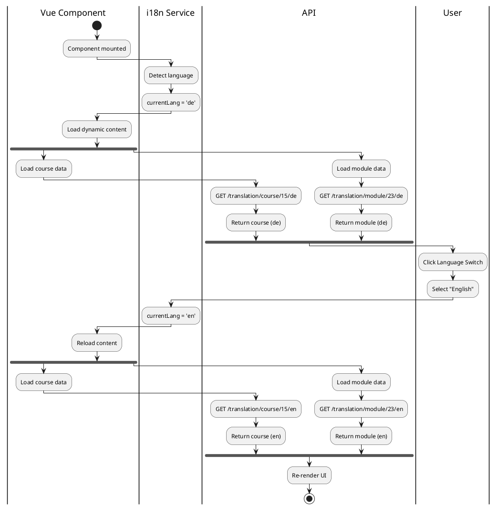

---

## 11. Domain-Lokalisierung (Organisationen)

### 🏢 Organization-specific Localization

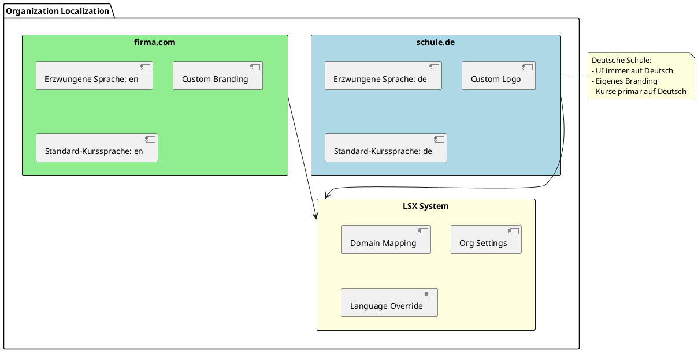

---

## 12. Barrierefreiheit & Lernprofile

### ♿ Accessibility Features

```plantuml
@startuml
package "Accessibility & Learning Profiles" {
  card "Vereinfachte Sprachen" #E8F4F8 {
    :📘 Leichte Sprache (de);
    :📗 Plain Language (en);
    :Kurze Sätze;
    :Einfache Wörter;
  }
  
  card "Legasthenie-Unterstützung" #FFF4E1 {
    :🔤 OpenDyslexic Font;
    :Größerer Zeilenabstand;
    :Kontrastreiches Design;
    :Silbentrennung;
  }
  
  card "ADHD-Modus" #E1F5E1 {
    :🎯 Reduzierte UI;
    :Weniger Animationen;
    :Klare Struktur;
    :Fokus-Highlights;
  }
  
  card "Screenreader" #FFE1E1 {
    :🔊 ARIA Labels;
    :Semantisches HTML;
    :Tastatur-Navigation;
    :Alt-Texte;
  }
}

note bottom
  Alle Features kombinierbar
  und pro User konfigurierbar
end note
@enduml
```

---

## 13. Fehlende Übersetzungen

### 🔍 Missing Translation Handling

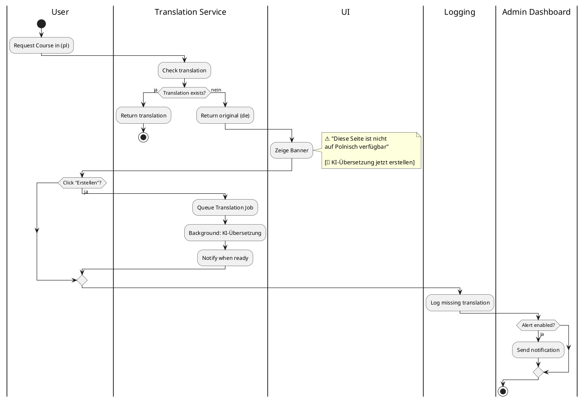

---

## 14. Sicherheitsaspekte

### 🔒 Translation Security

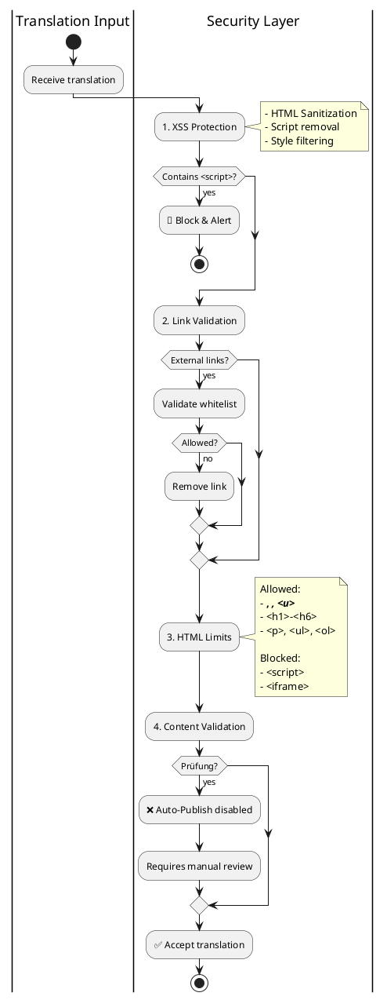

---

## 15. Zusammenfassung

### ✅ LSX Internationalisierung ist:

| Feature | Status |
|---------|--------|
| 🌍 **Global** | ✅ 15+ Sprachen |
| 🤖 **KI-gestützt** | ✅ Automatische Übersetzung |
| 🔄 **Automatisiert** | ✅ Global Publishing |
| 🎯 **Präzise** | ✅ Glossar & Konsistenz |
| 📈 **Skalierbar** | ✅ Unbegrenzte Sprachen |
| 🔒 **Sicher** | ✅ XSS-Schutz, Validation |
| ♿ **Barrierefrei** | ✅ Accessibility Features |
| 🏢 **Flexibel** | ✅ Org-spezifisch |

---

### 🌍 i18n Architecture Overview

```
┌─────────────────────────────────────┐
│  🌍 Multi-Language Support           │
│  ─────────────────────────────────   │
│  ✅ UI i18n (vue-i18n)                │
│  ✅ Content i18n (KI-gestützt)        │
│  ✅ Lokalisierung (Datum, Zahlen)     │
│  ✅ Echtzeit-Sprachwechsel            │
│  ✅ Automatische Erkennung            │
│  ✅ Fallback-System                   │
│  ✅ Creator Global Publishing         │
│  ✅ Barrierefreiheit                  │
└─────────────────────────────────────┘
```

---

### 💡 Translation Flow Summary

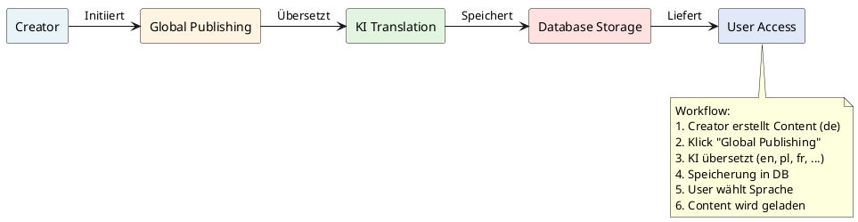

> **LSX kann weltweit angeboten werden, ohne inhaltliche Barrieren.**

---

## 📌 Dokument abgeschlossen

**Version:** 1.0  
**Status:** Final  
**Letzte Aktualisierung:** November 2024

---

> 💡 **Hinweis:** Dieses Dokument ist Teil der LSX-Systemdokumentation und beschreibt das vollständige Internationalisierungs- und Lokalisierungssystem mit KI-gestützten Übersetzungen, Multi-Language-Support und Barrierefreiheit.