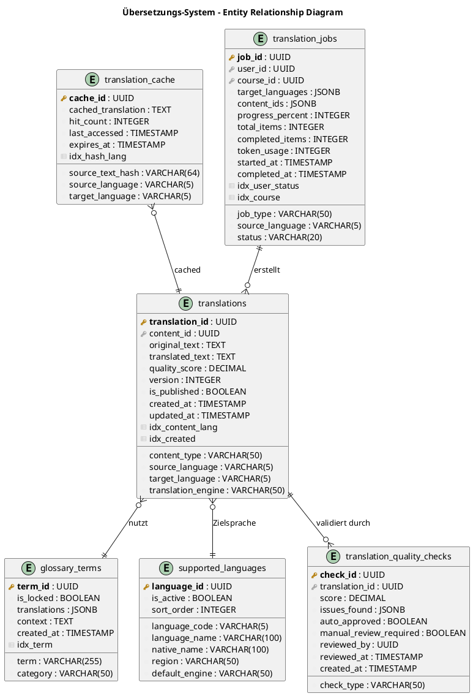
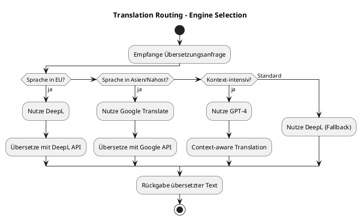
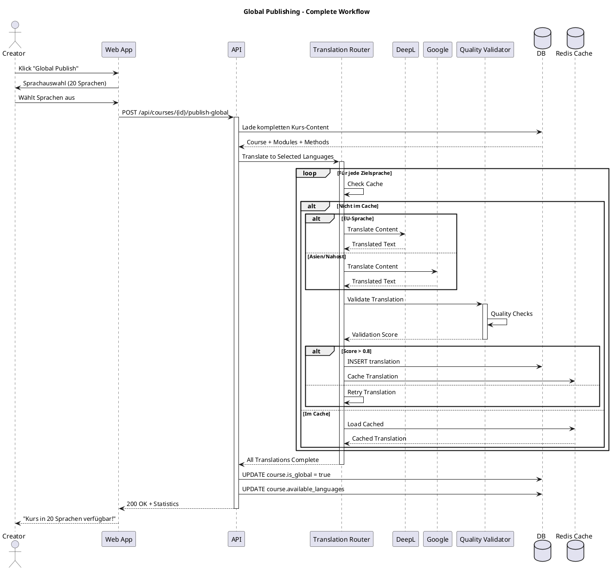
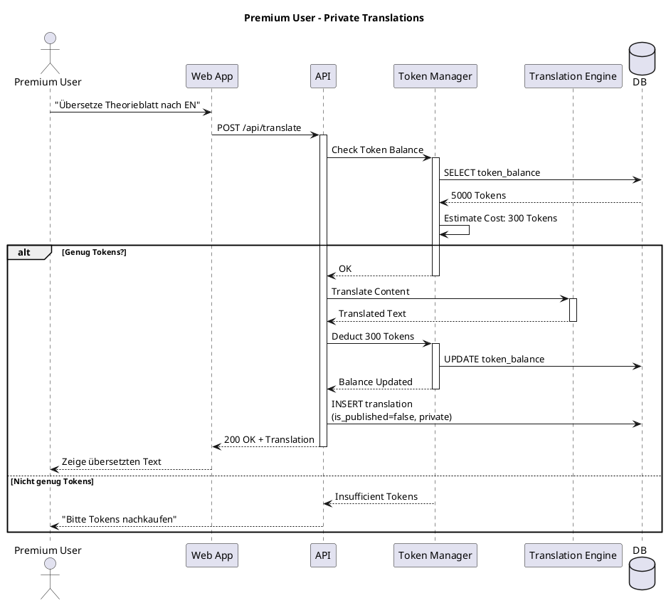
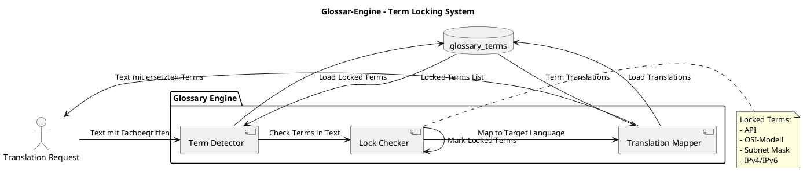
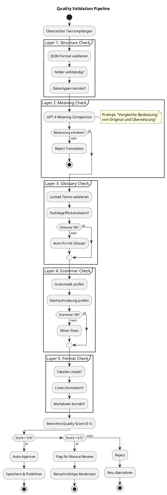
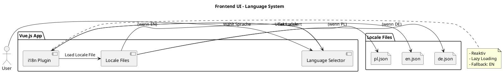
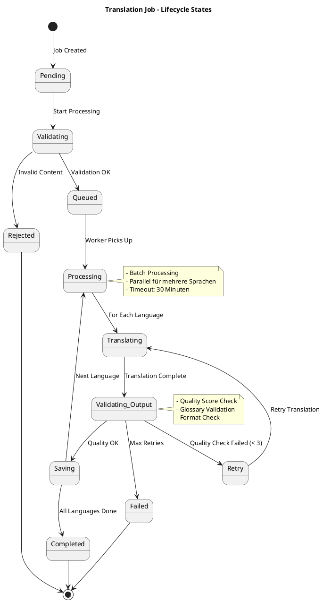

# 10 – Übersetzungs-System (Final)

**Version:** 1.0
**Stand:** Final

---

## Überblick

Das **LSX Übersetzungs-System** ermöglicht automatische, KI-gestützte Übersetzungen in bis zu **20 Sprachen** und ist ein Kernbestandteil des **Global Publishing Systems**.

### 🎯 Kernfunktionen

- 🌍 Unterstützung für 20 Sprachen weltweit
- 🤖 KI-gestützte automatische Übersetzung
- 📦 Versionierung und Caching
- 🔍 Multi-Layer Qualitätssicherung
- 💰 Token-basiertes Kostenmodell
- 🚀 Global Publishing für Creator/Schulen/Unternehmen
- 🔐 Glossar-Lock für Fachbegriffe
- ⚡ Inkrementelle Updates

### 📊 Systemarchitektur

```plantuml
@startuml
!include https://raw.githubusercontent.com/plantuml-stdlib/C4-PlantUML/master/C4_Context.puml

title Übersetzungs-System - System Context

Person(creator, "Creator", "Veröffentlicht global")
Person(school, "Schule", "Übersetzt Kurse")
Person(premium, "Premium User", "Nutzt Übersetzungen")
Person(free, "Free User", "Konsumiert übersetzte Kurse")

System(lsx, "LSX LernSystem", "Zentrale Lernplattform")

System_Ext(deepl, "DeepL API", "Professionelle Übersetzungen")
System_Ext(google_translate, "Google Translate", "Zusätzliche Sprachen")
System_Ext(openai, "OpenAI GPT-4", "Kontext-bewusste Übersetzung")
SystemDb_Ext(translation_cache, "Translation Cache", "Redis")

Rel(creator, lsx, "Publish Global (20 Sprachen)", "HTTPS")
Rel(school, lsx, "Übersetzt Lerninhalte", "HTTPS")
Rel(premium, lsx, "Nutzt Übersetzungen", "HTTPS")
Rel(free, lsx, "Konsumiert übersetzte Kurse", "HTTPS")

Rel(lsx, deepl, "Übersetzt (EU-Sprachen)", "REST API")
Rel(lsx, google_translate, "Übersetzt (Asien, Nahost)", "REST API")
Rel(lsx, openai, "Kontext-Übersetzung", "REST API")
Rel(lsx, translation_cache, "Cached Translations", "Redis Protocol")

@enduml
```

### 🏗️ Container-Architektur

```plantuml
@startuml
!include https://raw.githubusercontent.com/plantuml-stdlib/C4-PlantUML/master/C4_Container.puml

title Übersetzungs-System - Container Diagram

Person(user, "User")

System_Boundary(lsx_boundary, "LSX System") {
    Container(web, "Web App", "Vue.js", "User Interface")
    Container(api, "API Gateway", "Flask", "REST API")

    Container_Boundary(translation_system, "Translation System") {
        Container(trans_router, "Translation Router", "Python", "Request Distribution")
        Container(deepl_adapter, "DeepL Adapter", "Python", "EU Languages")
        Container(google_adapter, "Google Adapter", "Python", "Asian Languages")
        Container(openai_adapter, "OpenAI Adapter", "Python", "Context-Aware")
        Container(validator, "Quality Validator", "GPT-3.5", "Multi-Layer Check")
        Container(glossary_engine, "Glossary Engine", "Python", "Term Locking")
        Container(version_manager, "Version Manager", "Python", "Translation Versions")
    }

    ContainerDb(db, "PostgreSQL", "SQL Database", "Translations, Glossary")
    ContainerDb(redis, "Redis", "Cache", "Translation Cache")
    Container(celery, "Celery Worker", "Python", "Async Translation Jobs")
}

Rel(user, web, "Nutzt", "HTTPS")
Rel(web, api, "API Calls", "JSON/REST")
Rel(api, trans_router, "Translation Requests", "Internal")

Rel(trans_router, deepl_adapter, "Translate (DE, EN, FR, ES, IT, ...)")
Rel(trans_router, google_adapter, "Translate (AR, ZH, JA, KO, ...)")
Rel(trans_router, openai_adapter, "Context Translation")

Rel(deepl_adapter, validator, "Translated Text")
Rel(google_adapter, validator, "Translated Text")
Rel(openai_adapter, validator, "Translated Text")

Rel(validator, glossary_engine, "Check Terms")
Rel(glossary_engine, db, "Load Glossary")

Rel(validator, version_manager, "Save Translation")
Rel(version_manager, db, "Store Versions")
Rel(version_manager, redis, "Cache Translation")

Rel(api, celery, "Queue Translation Jobs")

@enduml
```

---

## 1. Grundprinzipien

### 🎯 Zentrale Regeln

| Nr. | Prinzip |
|-----|---------|
| 1 | Jede Übersetzung ist **einmalig** → danach dauerhaft gespeichert |
| 2 | Übersetzungen werden in der Datenbank **versioniert** |
| 3 | Creator, Schulen, Unternehmen können **global veröffentlichen** |
| 4 | Premium/Free können nur **konsumieren**, nicht global veröffentlichen |
| 5 | KI-Übersetzungen werden automatisch **qualitätsgeprüft** |
| 6 | Übersetzungen dürfen **keine Bedeutung verändern** – nur Sprache |
| 7 | Plattform trennt **UI-Sprachen** & **Kurs-Sprachen** |
| 8 | **Inkrementelle Updates** – nur Änderungen werden neu übersetzt |
| 9 | **Glossar-Lock** für Fachbegriffe (API, OSI-Modell, etc.) |
| 10 | **Caching** verhindert doppelte Übersetzungen |

---

## 2. Unterstützte Sprachen

### 🌐 20 Sprachen im Überblick

```plantuml
@startuml
title LSX Global Publishing - 20 Unterstützte Sprachen

package "Europa (10)" #LightBlue {
  [🇩🇪 Deutsch (DE)] as de
  [🇬🇧 Englisch (EN)] as en
  [🇪🇸 Spanisch (ES)] as es
  [🇫🇷 Französisch (FR)] as fr
  [🇮🇹 Italienisch (IT)] as it
  [🇵🇹 Portugiesisch (PT)] as pt
  [🇳🇱 Niederländisch (NL)] as nl
  [🇵🇱 Polnisch (PL)] as pl
  [🇸🇪 Schwedisch (SV)] as sv
  [🇩🇰 Dänisch (DA)] as da
}

package "Asien (5)" #LightGreen {
  [🇨🇳 Chinesisch (ZH)] as zh
  [🇯🇵 Japanisch (JA)] as ja
  [🇰🇷 Koreanisch (KO)] as ko
  [🇮🇳 Hindi (HI)] as hi
  [🇹🇭 Thai (TH)] as th
}

package "Nahost & Osteuropa (5)" #LightYellow {
  [🇹🇷 Türkisch (TR)] as tr
  [🇸🇦 Arabisch (AR)] as ar
  [🇮🇱 Hebräisch (HE)] as he
  [🇷🇺 Russisch (RU)] as ru
  [🇺🇦 Ukrainisch (UK)] as uk
}

cloud "DeepL API" as deepl
cloud "Google Translate" as google

de --> deepl
en --> deepl
es --> deepl
fr --> deepl
it --> deepl
pt --> deepl
nl --> deepl
pl --> deepl

zh --> google
ja --> google
ko --> google
ar --> google
he --> google
tr --> google

@enduml
```



### 📋 Sprachen-Details

| Sprache | Code | Region | Translation Engine | Status |
|---------|------|--------|--------------------|--------|
| 🇩🇪 Deutsch | `de` | Europa | DeepL | ✅ Basis |
| 🇬🇧 Englisch | `en` | Europa | DeepL | ✅ Basis |
| 🇵🇱 Polnisch | `pl` | Europa | DeepL | ✅ Basis |
| 🇪🇸 Spanisch | `es` | Europa | DeepL | ✅ Verfügbar |
| 🇫🇷 Französisch | `fr` | Europa | DeepL | ✅ Verfügbar |
| 🇮🇹 Italienisch | `it` | Europa | DeepL | ✅ Verfügbar |
| 🇵🇹 Portugiesisch | `pt` | Europa | DeepL | ✅ Verfügbar |
| 🇳🇱 Niederländisch | `nl` | Europa | DeepL | ✅ Verfügbar |
| 🇸🇪 Schwedisch | `sv` | Europa | DeepL | ✅ Verfügbar |
| 🇩🇰 Dänisch | `da` | Europa | DeepL | ✅ Verfügbar |
| 🇨🇳 Chinesisch | `zh` | Asien | Google Translate | ✅ Verfügbar |
| 🇯🇵 Japanisch | `ja` | Asien | Google Translate | ✅ Verfügbar |
| 🇰🇷 Koreanisch | `ko` | Asien | Google Translate | ✅ Verfügbar |
| 🇮🇳 Hindi | `hi` | Asien | Google Translate | ✅ Verfügbar |
| 🇹🇭 Thai | `th` | Asien | Google Translate | ✅ Verfügbar |
| 🇹🇷 Türkisch | `tr` | Nahost | Google Translate | ✅ Verfügbar |
| 🇸🇦 Arabisch | `ar` | Nahost | Google Translate | ✅ Verfügbar |
| 🇮🇱 Hebräisch | `he` | Nahost | Google Translate | ✅ Verfügbar |
| 🇷🇺 Russisch | `ru` | Osteuropa | DeepL | ✅ Verfügbar |
| 🇺🇦 Ukrainisch | `uk` | Osteuropa | Google Translate | ✅ Verfügbar |

---

## 3. Übersetzbare Inhalte

### 📚 Content-Typen

```plantuml
@startuml
title Übersetzbare Content-Typen

package "Kursstruktur" {
  [Titel] as title
  [Untertitel] as subtitle
  [Beschreibung] as desc
  [Kategorien] as cat
  [Module] as mod
}

package "Theorie & Methoden" {
  [Theorieblätter] as theory
  [Beispiele] as examples
  [Glossar] as glossary
  [Fallstudien] as cases
  [Storytelling] as story
  [Zusammenfassungen] as summary
}

package "Quiz & Prüfungen" {
  [MCQ Fragen] as mcq
  [Lückentexte] as blanks
  [Matching] as match
  [Szenarien] as scenarios
  [Prüfungen] as exams
}

package "Multimedia" {
  [Video-Untertitel] as subs
  [Transkripte] as trans
  [Alt-Texte] as alt
}

package "Whiteboard/KI" {
  [Kommentare] as comments
  [KI-Erklärungen] as ai_explain
  [Analysen] as analyses
}

cloud "Translation Engine" as engine

title --> engine
subtitle --> engine
desc --> engine
cat --> engine
mod --> engine

theory --> engine
examples --> engine
glossary --> engine
cases --> engine
story --> engine
summary --> engine

mcq --> engine
blanks --> engine
match --> engine
scenarios --> engine
exams --> engine

subs --> engine
trans --> engine
alt --> engine

comments --> engine
ai_explain --> engine
analyses --> engine

@enduml
```



### ✅ Übersetzungs-Matrix

| Content-Typ | Übersetzbar | KI-Modell | Besonderheiten |
|-------------|-------------|-----------|----------------|
| **Kurs-Titel** | ✅ | DeepL/Google | Kurz, prägnant |
| **Beschreibung** | ✅ | DeepL/GPT-4 | Lang, kontextreich |
| **Modul-Namen** | ✅ | DeepL | Kurz, fachlich |
| **Theorieblätter** | ✅ | GPT-4 | Kontext-bewusst, lang |
| **Flashcards** | ✅ | DeepL | Front + Back |
| **Quiz-Fragen** | ✅ | GPT-4 | Frage + Optionen + Erklärung |
| **Lückentexte** | ✅ | GPT-4 | Platzhalter beibehalten |
| **Fallstudien** | ✅ | GPT-4 | Kontext-intensiv |
| **Glossar** | ✅ | DeepL + Glossar-Lock | Terms + Definitions |
| **Video-Untertitel** | ✅ | DeepL | SRT/VTT Format |
| **Mathe-Aufgaben** | ✅ | GPT-4 | Formel-Schutz |
| **Code-Beispiele** | ❌ | - | Bleiben im Original |
| **Technische IDs** | ❌ | - | Nicht übersetzbar |

---

## 4. Datenmodell: Übersetzungs-Entities

### 🗄️ ER-Diagramm



### 📋 Datenbank-Schema Details

**translations - Haupttabelle**

```sql
CREATE TABLE translations (
    translation_id UUID PRIMARY KEY DEFAULT gen_random_uuid(),
    content_id UUID NOT NULL,
    content_type VARCHAR(50) NOT NULL, -- 'course', 'module', 'theory', 'quiz', 'method'
    source_language VARCHAR(5) NOT NULL DEFAULT 'de',
    target_language VARCHAR(5) NOT NULL,
    original_text TEXT,
    translated_text TEXT NOT NULL,
    translation_engine VARCHAR(50), -- 'deepl', 'google', 'openai'
    quality_score DECIMAL(3,2) DEFAULT 0.00,
    version INTEGER DEFAULT 1,
    is_published BOOLEAN DEFAULT false,
    created_at TIMESTAMP DEFAULT NOW(),
    updated_at TIMESTAMP DEFAULT NOW(),
    CONSTRAINT unique_translation UNIQUE (content_id, target_language, version)
);

CREATE INDEX idx_translations_content_lang ON translations(content_id, target_language);
CREATE INDEX idx_translations_created ON translations(created_at DESC);
```

**translation_cache - Redis-Cache**

```sql
CREATE TABLE translation_cache (
    cache_id UUID PRIMARY KEY DEFAULT gen_random_uuid(),
    source_text_hash VARCHAR(64) NOT NULL, -- SHA-256 hash
    source_language VARCHAR(5) NOT NULL,
    target_language VARCHAR(5) NOT NULL,
    cached_translation TEXT NOT NULL,
    hit_count INTEGER DEFAULT 0,
    last_accessed TIMESTAMP DEFAULT NOW(),
    expires_at TIMESTAMP,
    CONSTRAINT unique_cache UNIQUE (source_text_hash, source_language, target_language)
);

CREATE INDEX idx_cache_hash_lang ON translation_cache(source_text_hash, source_language, target_language);
```

**glossary_terms - Glossar mit Term-Locking**

```sql
CREATE TABLE glossary_terms (
    term_id UUID PRIMARY KEY DEFAULT gen_random_uuid(),
    term VARCHAR(255) NOT NULL UNIQUE,
    category VARCHAR(50), -- 'technical', 'math', 'general'
    is_locked BOOLEAN DEFAULT false, -- Locked terms bleiben unübersetzt
    translations JSONB, -- {"en": "Subnet Mask", "fr": "Masque de sous-réseau"}
    context TEXT,
    created_at TIMESTAMP DEFAULT NOW()
);

CREATE INDEX idx_glossary_term ON glossary_terms(term);
```

**Glossar-Beispiele:**

```json
{
  "term": "Subnetzmaske",
  "category": "technical",
  "is_locked": true,
  "translations": {
    "en": "Subnet Mask",
    "fr": "Masque de sous-réseau",
    "es": "Máscara de subred"
  }
}
```

---

## 5. Übersetzungsprozess

### 🔄 6-Schritt-Workflow

```plantuml
@startuml
title Translation Workflow - 6 Schritte

start

:1. Content Identification;
note right
  - Welcher Content-Typ?
  - Welche Sprachen?
  - Bereits übersetzt?
end note

:2. Normierung;
note right
  - Text in Blöcke zerlegen
  - JSON-Struktur erstellen
  - Glossar-Terms markieren
end note

:3. Translation;
note right
  - DeepL/Google/GPT-4
  - Batch-Processing
  - Parallel für mehrere Sprachen
end note

:4. Quality Check;
note right
  - Bedeutungsvalidierung
  - Grammatik-Check
  - Glossar-Compliance
  - Format-Validierung
end note

if (Qualität OK?) then (ja)
  :5. Persistierung;
  note right
    - In DB speichern
    - Versionieren
    - Cache aktualisieren
  end note

  :6. Publishing;
  note right
    - is_published = true
    - Nutzer sehen neue Sprache
  end note

  stop
else (nein)
  :Neu übersetzen;
  backward:Zurück zu Schritt 3;
endif

@enduml
```

### 📋 Detaillierte Schritte

#### 1️⃣ Content Identification

```python
def identify_content(content_id, content_type):
    # Prüfe ob bereits übersetzt
    existing = db.query(Translation).filter_by(
        content_id=content_id,
        target_language=target_lang
    ).first()

    if existing:
        return "already_translated"

    # Lade Original-Content
    content = load_content(content_id, content_type)
    return content
```

#### 2️⃣ Normierung

```python
def normalize_content(text, content_type):
    return {
        "title": extract_title(text),
        "paragraphs": split_paragraphs(text),
        "tables": extract_tables(text),
        "examples": extract_examples(text),
        "glossary_terms": identify_glossary_terms(text)
    }
```

#### 3️⃣ Translation



#### 4️⃣ Quality Check

```python
def validate_translation(original, translated, glossary_terms):
    checks = {
        "meaning_preserved": check_meaning(original, translated),
        "grammar_correct": check_grammar(translated),
        "glossary_compliance": check_glossary(translated, glossary_terms),
        "format_intact": check_format(original, translated)
    }

    score = calculate_score(checks)
    return score >= 0.8  # 80% threshold
```

---

## 6. Global Publishing

### 🚀 Creator/School Global Publishing Workflow



### 💰 Kostenmodell für Global Publishing

| Rolle | Global Publishing | Token-Kosten |
|-------|-------------------|--------------|
| 🎨 **Creator** | ✅ Kostenlos | Plattform trägt Kosten |
| 🏫 **Schule** | ✅ Kostenlos | Plattform trägt Kosten |
| 🏢 **Unternehmen** | ✅ Kostenlos | Plattform trägt Kosten |
| 🎓 **LSX Academy** | ✅ Kostenlos | System-Kurse |
| 💎 **Premium** | ❌ Nur privat | Token-basiert |
| 🆓 **Free** | ❌ Nein | - |

---

## 7. Premium User Übersetzungen

### 💎 Premium-Features



### 📊 Token-Berechnung

```python
def calculate_translation_cost(text, target_languages):
    char_count = len(text)
    complexity_factor = analyze_complexity(text)  # 1.0-2.0
    num_languages = len(target_languages)

    base_cost = char_count * 0.01  # 1 Token pro 100 Zeichen
    total_cost = base_cost * complexity_factor * num_languages

    return int(total_cost)
```

**Beispiel:**
- Text: 1000 Zeichen
- Komplexität: 1.5 (fachlich)
- Sprachen: 2 (EN, FR)
- Kosten: 1000 * 0.01 * 1.5 * 2 = **30 Tokens**

---

## 8. Inkrementelle Updates

### 🔄 Drei Update-Szenarien

```plantuml
@startuml
title Translation Update - Scenarios

start

:Content wurde geändert;

if (Welcher Change-Typ?) then (Sprachversion existiert)
  partition "Fall A: Existing Updated" {
    :Markiere Übersetzung als veraltet;
    :Identifiziere geänderte Abschnitte;
    :Übersetze nur Änderungen;
    :Update Translation (version++)
  }
  stop
elseif (Neuer Content) then (ja)
  partition "Fall B: New Content Added" {
    :Erstelle neue Übersetzungen;
    :Nur für neue Abschnitte;
    :Bestehende bleiben unberührt;
  }
  stop
else (Strukturänderung)
  partition "Fall C: Structure Changed" {
    :Aktualisiere Modul-Namen;
    :Update Metadaten;
    :Content-Übersetzungen bleiben;
  }
  stop
endif

@enduml
```

### ⚙️ Inkrementelle Update-Logik

```python
def update_translation(content_id, changes):
    # Lade bestehende Übersetzungen
    existing_translations = db.query(Translation).filter_by(
        content_id=content_id
    ).all()

    for translation in existing_translations:
        # Identifiziere geänderte Abschnitte
        changed_sections = identify_changes(
            translation.original_text,
            changes
        )

        if not changed_sections:
            continue  # Keine Änderungen

        # Übersetze nur Änderungen
        new_sections = translate_sections(
            changed_sections,
            translation.target_language
        )

        # Merge mit bestehendem Content
        updated_text = merge_translations(
            translation.translated_text,
            new_sections
        )

        # Neue Version speichern
        translation.version += 1
        translation.translated_text = updated_text
        translation.updated_at = now()

        db.commit()
```

---

## 9. Glossar-System & Term-Locking

### 📚 Glossar-Engine



### 🔐 Glossar-Kategorien

| Kategorie | Beispiele | Locked? |
|-----------|-----------|---------|
| **Technical Standards** | API, REST, HTTP, IPv4, OSI-Modell | ✅ Ja |
| **Programming** | Python, JavaScript, JSON | ✅ Ja |
| **Math Symbols** | π, Σ, ∫, √ | ✅ Ja |
| **Company Names** | Microsoft, Cisco, Linux | ✅ Ja |
| **Protocols** | TCP/IP, SMTP, FTP | ✅ Ja |
| **General Terms** | Computer, Server, Router | ❌ Nein (übersetzbar) |

### 📋 Glossar-Eintrag Beispiel

```json
{
  "term_id": "uuid-123",
  "term": "Subnetzmaske",
  "category": "technical",
  "is_locked": true,
  "translations": {
    "en": "Subnet Mask",
    "fr": "Masque de sous-réseau",
    "es": "Máscara de subred",
    "it": "Maschera di sottorete",
    "pl": "Maska podsieci"
  },
  "context": "Netzwerktechnik, IPv4/IPv6",
  "created_at": "2024-01-15T10:00:00Z"
}
```

---

## 10. Qualitätssicherung

### 🔍 Multi-Layer Validation



### 📊 Quality Score Berechnung

```python
def calculate_quality_score(checks):
    weights = {
        "structure": 0.15,
        "meaning": 0.40,
        "glossary": 0.20,
        "grammar": 0.15,
        "format": 0.10
    }

    score = sum(checks[key] * weights[key] for key in weights)
    return round(score, 2)
```

**Beispiel:**

```json
{
  "checks": {
    "structure": 1.0,
    "meaning": 0.95,
    "glossary": 1.0,
    "grammar": 0.85,
    "format": 1.0
  },
  "quality_score": 0.96,
  "auto_approved": true
}
```

---

## 11. UI-Übersetzung (Frontend)

### 🎨 Frontend Language System



### 📂 UI-Locale Struktur

**de.json:**

```json
{
  "nav": {
    "dashboard": "Dashboard",
    "courses": "Kurse",
    "settings": "Einstellungen",
    "logout": "Abmelden"
  },
  "buttons": {
    "save": "Speichern",
    "cancel": "Abbrechen",
    "delete": "Löschen",
    "edit": "Bearbeiten"
  },
  "dashboard": {
    "welcome": "Willkommen zurück, {name}!",
    "courses_count": "{count} Kurse",
    "progress": "Fortschritt"
  },
  "errors": {
    "network": "Netzwerkfehler",
    "auth": "Bitte einloggen",
    "not_found": "Nicht gefunden"
  }
}
```

**Verwendung in Vue:**

```vue
<template>
  <div>
    <h1>{{ $t('dashboard.welcome', { name: user.name }) }}</h1>
    <p>{{ $t('dashboard.courses_count', { count: courses.length }) }}</p>
    <button>{{ $t('buttons.save') }}</button>
  </div>
</template>
```

### ⚠️ Wichtiger Unterschied

| UI-Strings | Kurs-Content |
|-----------|--------------|
| ❌ **Nicht** KI-übersetzt | ✅ KI-übersetzt |
| ✅ Manuell gepflegt | ❌ Nicht manuell |
| 📦 In .json Dateien | 📦 In PostgreSQL |
| 🚀 Build-Time | 🚀 Runtime |

---

## 12. API-Endpunkte

### 📡 Translation API Endpoints

| Endpoint | Methode | Beschreibung | Rolle |
|----------|---------|--------------|-------|
| `/api/courses/{id}/publish-global` | POST | Global Publishing (20 Sprachen) | Creator/School+ |
| `/api/translate` | POST | Einzelne Übersetzung | Premium+ |
| `/api/translations/{id}` | GET | Übersetzung abrufen | Alle |
| `/api/translations/{id}` | PUT | Übersetzung aktualisieren | Creator+ |
| `/api/translations/{id}` | DELETE | Übersetzung löschen | Creator+ |
| `/api/languages` | GET | Unterstützte Sprachen | Alle |
| `/api/glossary` | GET | Glossar abrufen | Premium+ |
| `/api/glossary` | POST | Glossar-Eintrag hinzufügen | Admin |
| `/api/translation-jobs/{id}` | GET | Job-Status abfragen | Creator+ |
| `/api/translation-jobs/{id}/cancel` | POST | Job abbrechen | Creator+ |

### 📋 Beispiel-Request: Global Publishing

**Request:**

```http
POST /api/courses/uuid-123/publish-global HTTP/1.1
Host: api.lsx-system.com
Authorization: Bearer <jwt_token>
Content-Type: application/json

{
  "target_languages": [
    "en", "es", "fr", "it", "pt", "nl", "pl",
    "zh", "ja", "ko", "ar", "tr", "ru"
  ],
  "include_content_types": [
    "title",
    "description",
    "modules",
    "theory",
    "quiz",
    "methods"
  ]
}
```

**Response:**

```json
{
  "status": "success",
  "job_id": "job-456",
  "course_id": "uuid-123",
  "target_languages": 13,
  "estimated_time_minutes": 15,
  "estimated_tokens": 0,
  "message": "Translation job started. Check status at /api/translation-jobs/job-456"
}
```

### 📋 Beispiel-Request: Job-Status

**Request:**

```http
GET /api/translation-jobs/job-456 HTTP/1.1
Host: api.lsx-system.com
Authorization: Bearer <jwt_token>
```

**Response:**

```json
{
  "job_id": "job-456",
  "status": "processing",
  "progress_percent": 65,
  "total_items": 150,
  "completed_items": 97,
  "current_language": "fr",
  "started_at": "2024-11-14T10:00:00Z",
  "estimated_completion": "2024-11-14T10:12:00Z",
  "languages_completed": ["en", "es", "it", "pt"],
  "languages_pending": ["nl", "pl", "zh", "ja", "ko", "ar", "tr", "ru", "fr"]
}
```

### 📋 Beispiel-Request: Einzelübersetzung (Premium)

**Request:**

```http
POST /api/translate HTTP/1.1
Host: api.lsx-system.com
Authorization: Bearer <jwt_token>
Content-Type: application/json

{
  "content_type": "theory_sheet",
  "content_id": "uuid-789",
  "target_language": "en",
  "text": "Das OSI-Modell besteht aus 7 Schichten..."
}
```

**Response:**

```json
{
  "status": "success",
  "translation_id": "trans-101",
  "source_language": "de",
  "target_language": "en",
  "translated_text": "The OSI model consists of 7 layers...",
  "quality_score": 0.94,
  "token_usage": 25,
  "balance_remaining": 4975,
  "cached": false,
  "translation_engine": "deepl"
}
```

---

## 13. Translation Job Lifecycle

### 🔄 State Diagram



---

## 14. Zusammenfassung

### ✅ Das Übersetzungs-System von LSX

| Merkmal | Beschreibung |
|---------|-------------|
| 🌍 **Global** | 20 Sprachen weltweit |
| 🤖 **Automatisiert** | KI-gestützte Übersetzung |
| 📦 **Cached** | Keine doppelten Übersetzungen |
| 🔍 **Qualitätsgesichert** | Multi-Layer Validation |
| 💰 **Fair** | Token-basiert für Premium, kostenlos für Creator |
| 🔐 **Glossar-Lock** | Fachbegriffe bleiben konsistent |
| ⚡ **Inkrementell** | Nur Änderungen werden übersetzt |
| 📊 **Versioniert** | Historische Nachvollziehbarkeit |
| 🎨 **UI-Trennung** | Frontend ≠ Content-Übersetzungen |
| 🚀 **Skalierbar** | Async Processing mit Celery |

### 🎯 Kernvorteile

- **Globale Reichweite:** Kurse in 20 Sprachen verfügbar
- **Zeit-Ersparnis:** Automatische Übersetzungen in Minuten
- **Kosteneffizienz:** Caching verhindert doppelte Kosten
- **Qualität:** Multi-Layer Validation sichert Genauigkeit
- **Konsistenz:** Glossar-Lock für Fachbegriffe
- **Flexibilität:** Inkrementelle Updates bei Änderungen

### 💡 Strategische Bedeutung

> Das Übersetzungs-System ist ein **zentraler Baustein** der internationalen Expansion und ermöglicht LSX, als **globale Bildungsplattform** zu agieren.

---

## 📌 Dokument abgeschlossen

**Version:** 1.0
**Status:** Final
**Letzte Aktualisierung:** 2024

---

> 💡 **Hinweis:** Das Übersetzungs-System ist essenziell für LSX Global Publishing und ermöglicht barrierefreie Bildung in 20 Sprachen weltweit.
