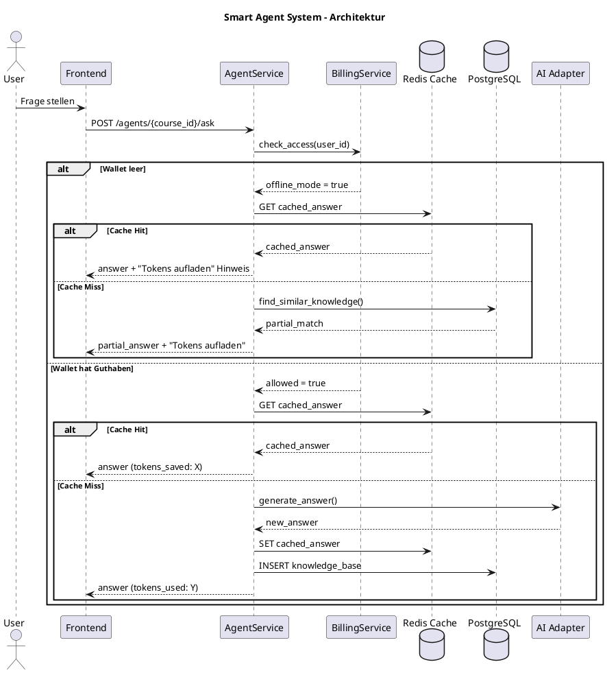
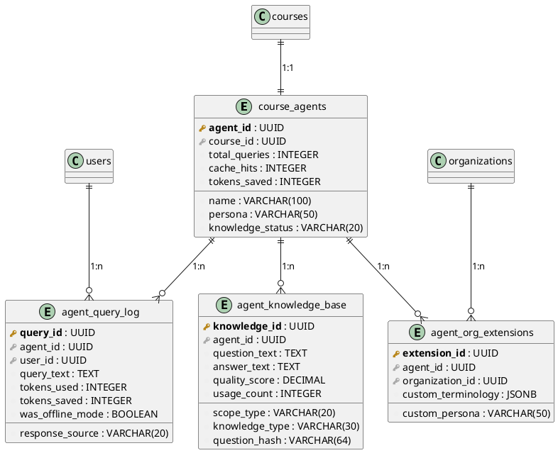
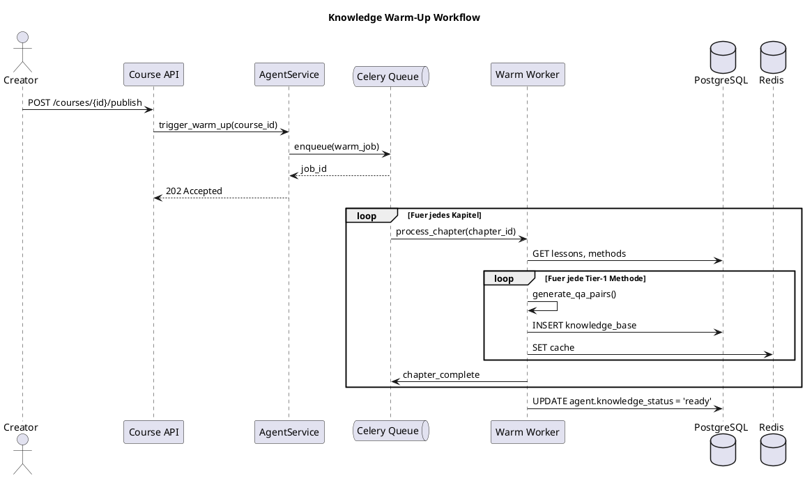

# 39 - Smart Agent System (Final)

**Version:** 1.1
**Stand:** Final
**Migrationen:** 065_smart_agent_system.sql, 066_agent_media_cache.sql

---

## Uebersicht

Das **Smart Agent System** ist ein intelligentes Wissens-Caching-System, das KI-Antworten pro Kurs cached und zwischen Nutzern teilt. Es reduziert den Token-Verbrauch um 50-70% und ermoeglicht Offline-Lernen wenn das Wallet leer ist.

### Kernfeatures

- **Hybrid Agent Sharing**: Globaler Basis-Agent + Organisations-spezifische Erweiterungen
- **Offline-Faehig**: Funktioniert aus Cache wenn Wallet leer (mit Hinweis "Tokens aufladen")
- **Wissens-Quellen**: Auto-Generierung bei Kurs-Veroeffentlichung + Lernen aus Nutzer-Interaktionen
- **Skalierbar**: 1000+ Nutzer pro Kurs-Agent

### Vorteile

| Ohne Agent | Mit Agent | Ersparnis |
|------------|-----------|-----------|
| 500k Tokens/Monat (Tier 1) | 75k Tokens/Monat | 85% |
| 800k Tokens/Monat (Tier 2) | 320k Tokens/Monat | 60% |
| 1.2M Tokens/Monat (Mixed) | 480k Tokens/Monat | 60% |

---

## Architektur



---

## Caching Tiers

Das System nutzt drei Cache-Tiers basierend auf der KI-Nutzungsintensitaet der Lernmethoden:

| Tier | KI-Usage | Strategie | Lernmethoden |
|------|----------|-----------|--------------|
| **1** | OPTIONAL | Voll-Cache, Pre-Generate | LM13 Flashcards, LM14 Drag&Drop, LM15 Lückentext, LM21 Zeitlimit, LM22 Quiz |
| **2** | MEDIUM | Template-Cache + Teil-KI | LM01 Schritt-fuer-Schritt, LM02 Theorie, LM03 Visualisierung, LM12 Mathe |
| **3** | INTENSIVE | Nur Real-Time KI | LM00 Deep Explanation, LM04 Sokratisch, LM08 Whiteboard, LM19 IHK |

### TTL-Strategien

```
Tier 1: TTL = 7 Tage (permanente Antworten)
Tier 2: TTL = 24 Stunden (Template-basiert)
Tier 3: TTL = 1 Stunde (kontextabhaengig)
```

---

## Datenbank-Schema

### Tabellenuebersicht

| Tabelle | Zweck |
|---------|-------|
| **course_agents** | Agent-Konfiguration pro Kurs |
| **agent_knowledge_base** | Wissens-Eintraege (Q&A Paare) |
| **agent_cache_entries** | Redis Cache Metadaten |
| **agent_query_log** | Alle Anfragen tracken |
| **agent_org_extensions** | Org-spezifische Anpassungen |
| **agent_warm_jobs** | Background Warm-Up Jobs |

### ER-Diagramm



### SQL-Definitionen

#### course_agents

```sql
CREATE TABLE course_agents (
    agent_id UUID PRIMARY KEY DEFAULT gen_random_uuid(),
    course_id UUID NOT NULL REFERENCES courses(course_id) ON DELETE CASCADE,

    -- Agent Settings
    name VARCHAR(100) DEFAULT 'KI-Tutor',
    persona VARCHAR(50) DEFAULT 'friendly',
    language VARCHAR(5) DEFAULT 'de',

    -- Knowledge Status
    knowledge_status VARCHAR(20) DEFAULT 'pending',
    last_warmed_at TIMESTAMPTZ,
    knowledge_version INTEGER DEFAULT 1,

    -- AI Configuration
    primary_provider VARCHAR(50) DEFAULT 'openai',
    primary_model VARCHAR(100) DEFAULT 'gpt-4o-mini',
    fallback_provider VARCHAR(50),
    fallback_model VARCHAR(100),
    temperature DECIMAL(3,2) DEFAULT 0.7,
    max_tokens INTEGER DEFAULT 2000,

    -- Statistics
    total_queries INTEGER DEFAULT 0,
    cache_hits INTEGER DEFAULT 0,
    tokens_saved INTEGER DEFAULT 0,

    created_at TIMESTAMPTZ DEFAULT NOW(),
    updated_at TIMESTAMPTZ DEFAULT NOW(),

    UNIQUE(course_id),
    CONSTRAINT chk_agent_knowledge_status CHECK (
        knowledge_status IN ('pending', 'warming', 'ready', 'stale')
    ),
    CONSTRAINT chk_agent_persona CHECK (
        persona IN ('strict', 'friendly', 'motivating', 'expert')
    )
);
```

#### agent_knowledge_base

```sql
CREATE TABLE agent_knowledge_base (
    knowledge_id UUID PRIMARY KEY DEFAULT gen_random_uuid(),
    agent_id UUID NOT NULL REFERENCES course_agents(agent_id) ON DELETE CASCADE,

    -- Scope
    scope_type VARCHAR(20) NOT NULL,
    scope_id UUID,

    -- Content
    knowledge_type VARCHAR(30) NOT NULL,
    method_type INTEGER,
    question_hash VARCHAR(64),
    question_text TEXT,
    answer_text TEXT NOT NULL,
    answer_html TEXT,

    -- Source
    source VARCHAR(20) NOT NULL,
    generated_by VARCHAR(50),

    -- Quality Metrics
    quality_score DECIMAL(5,2) DEFAULT 0.00,
    usage_count INTEGER DEFAULT 0,
    positive_feedback INTEGER DEFAULT 0,
    negative_feedback INTEGER DEFAULT 0,

    created_at TIMESTAMPTZ DEFAULT NOW(),
    updated_at TIMESTAMPTZ DEFAULT NOW(),

    CONSTRAINT chk_knowledge_scope_type CHECK (
        scope_type IN ('course', 'chapter', 'lesson', 'method')
    ),
    CONSTRAINT chk_knowledge_type CHECK (
        knowledge_type IN ('qa_pair', 'explanation', 'example', 'definition', 'summary', 'flashcard', 'quiz_item')
    ),
    CONSTRAINT chk_knowledge_source CHECK (
        source IN ('auto_generated', 'user_interaction', 'manual', 'imported')
    )
);

-- Full-text search index for German
CREATE INDEX idx_agent_knowledge_question_fts ON agent_knowledge_base
    USING GIN (to_tsvector('german', COALESCE(question_text, '')));
```

---

## API Endpoints

### POST /api/v1/agents/{course_id}/ask

Hauptendpoint fuer Agent-Anfragen.

**Request:**
```json
{
  "question": "Was ist das OSI-Modell?",
  "context": {
    "lesson_id": "uuid",
    "method_type": 2
  },
  "language": "de"
}
```

**Response (Cache Hit):**
```json
{
  "success": true,
  "data": {
    "answer": "Das OSI-Modell ist ein Referenzmodell...",
    "answer_html": "<p>Das OSI-Modell...</p>",
    "source": "cache_hit",
    "tokens_used": 0,
    "tokens_saved": 850,
    "cache_key": "agent:course:123:hash:abc123"
  }
}
```

**Response (Offline Mode):**
```json
{
  "success": true,
  "data": {
    "answer": "Das OSI-Modell ist ein Referenzmodell...",
    "source": "offline_fallback",
    "offline_message": "KI-Unterstuetzung deaktiviert. Dein Token-Guthaben ist aufgebraucht.",
    "tokens_used": 0,
    "tokens_saved": 0
  },
  "meta": {
    "offline_mode": true,
    "buy_tokens_url": "/tokens/purchase"
  }
}
```

### GET /api/v1/agents/{course_id}/status

Agent-Status und Statistiken.

**Response:**
```json
{
  "success": true,
  "data": {
    "agent_id": "uuid",
    "course_id": "uuid",
    "knowledge_status": "ready",
    "cache_hit_rate": 68.5,
    "total_queries": 15420,
    "cache_hits": 10563,
    "tokens_saved": 2450000,
    "knowledge_count": 342,
    "last_warmed_at": "2025-12-10T10:30:00Z"
  }
}
```

### POST /api/v1/agents/{course_id}/warm (Admin)

Startet Knowledge Warm-Up Job.

**Request:**
```json
{
  "tier": 1,
  "chapters": ["uuid1", "uuid2"]
}
```

**Response:**
```json
{
  "success": true,
  "data": {
    "job_id": "uuid",
    "status": "pending",
    "estimated_tokens": 15000,
    "estimated_cost_eur": 0.30
  }
}
```

### POST /api/v1/agents/{course_id}/feedback

Nutzer-Feedback zu Antworten.

**Request:**
```json
{
  "query_id": "uuid",
  "rating": 5,
  "was_helpful": true,
  "feedback": "Sehr gut erklaert!"
}
```

---

## Services & Repositories

### Backend-Struktur

```
backend/app/
  api/
    agents.py                    # API Endpoints
  services/
    agent_service.py             # Haupt-Logik
    knowledge_service.py         # Wissens-Management
  repositories/
    agent_repository.py          # DB-Zugriff Agents
    knowledge_repository.py      # DB-Zugriff Knowledge
  models/
    agent.py                     # Pydantic Models
  ki/
    agent_prompts.py             # Agent-Prompts
  tasks/
    agent_tasks.py               # Celery fuer Warming
```

### AgentService Flow

```python
class AgentService:
    @staticmethod
    def ask(course_id: str, user_id: str, question: str, context: dict) -> dict:
        # 1. Billing Check
        billing_result = BillingService.ensure_user_can_use_ai(user_id, 0, 0)
        offline_mode = not billing_result.get('allowed', False)

        # 2. Cache Check
        cache_key = CacheService.generate_agent_key(course_id, question)
        cached = CacheService.get(cache_key)

        if cached:
            # Cache Hit - kostenlos
            AgentRepository.increment_stats(agent_id, cache_hit=True, tokens_saved=cached['tokens'])
            return {
                'answer': cached['answer'],
                'source': 'cache_hit',
                'tokens_saved': cached['tokens']
            }

        # 3. Offline Mode - nur aus Knowledge Base
        if offline_mode:
            similar = KnowledgeRepository.find_similar(agent_id, question)
            if similar:
                return {
                    'answer': similar['answer'],
                    'source': 'offline_fallback',
                    'offline_message': 'Token-Guthaben aufgebraucht'
                }
            return {'error': 'Keine gecachte Antwort verfuegbar'}

        # 4. AI Generation
        response = AIAdapter.generate(question, context)

        # 5. Cache speichern
        CacheService.set(cache_key, response, ttl=get_tier_ttl(method_type))

        # 6. Knowledge Base aktualisieren
        KnowledgeRepository.learn_from_interaction(agent_id, question, response)

        return {
            'answer': response['answer'],
            'source': 'ai_generated',
            'tokens_used': response['tokens']
        }
```

---

## Offline-Mode UX

Wenn das Wallet leer ist, zeigt das Frontend folgenden Hinweis:

```
+---------------------------------------------------+
|  ! KI-Unterstuetzung deaktiviert                  |
|                                                   |
|  Dein Token-Guthaben ist aufgebraucht.            |
|  Du erhaeltst Antworten aus dem Wissens-Cache.    |
|                                                   |
|  [Tokens aufladen]  [Weiter ohne KI]              |
+---------------------------------------------------+
```

**Frontend-Komponente:** `OfflineWarning.vue`

```vue
<template>
  <div v-if="offlineMode" class="offline-warning">
    <AlertIcon class="icon" />
    <div class="content">
      <h4>KI-Unterstuetzung deaktiviert</h4>
      <p>{{ offlineMessage }}</p>
      <div class="actions">
        <router-link to="/tokens/purchase" class="btn-primary">
          Tokens aufladen
        </router-link>
        <button @click="$emit('continue')" class="btn-secondary">
          Weiter ohne KI
        </button>
      </div>
    </div>
  </div>
</template>
```

---

## Knowledge Warm-Up

### Automatische Generierung

Bei Kurs-Veroeffentlichung wird automatisch ein Warm-Up Job gestartet:



### Warm-Job Typen

| Typ | Beschreibung | Trigger |
|-----|--------------|---------|
| `full_warm` | Kompletter Kurs | Kurs-Publish |
| `incremental` | Nur neue Inhalte | Content-Update |
| `tier_specific` | Bestimmter Tier | Manuell |
| `chapter_warm` | Einzelnes Kapitel | Kapitel-Update |
| `lesson_warm` | Einzelne Lektion | Lektion-Update |

---

## Organisations-Erweiterungen

Organisationen koennen Agents anpassen:

### Custom Terminology

```json
{
  "custom_terminology": {
    "API": "Schnittstelle",
    "Server": "Rechner",
    "Cloud": "Datenwolke"
  }
}
```

### Custom Persona

```sql
INSERT INTO agent_org_extensions (
  agent_id,
  organization_id,
  custom_persona,
  custom_terminology
) VALUES (
  'agent-uuid',
  'org-uuid',
  'strict',
  '{"API": "Schnittstelle"}'
);
```

### Blocked Topics

```json
{
  "blocked_topics": [
    "Konkurrenz-Produkte",
    "Interne Prozesse"
  ]
}
```

---

## Statistiken & Analytics

### View: v_agent_stats

```sql
SELECT
    ca.agent_id,
    ca.course_id,
    c.title as course_title,
    ca.name as agent_name,
    ca.knowledge_status,
    ca.total_queries,
    ca.cache_hits,
    ca.tokens_saved,
    CASE
        WHEN ca.total_queries > 0
        THEN ROUND((ca.cache_hits::DECIMAL / ca.total_queries) * 100, 2)
        ELSE 0
    END as cache_hit_rate,
    COUNT(DISTINCT akb.knowledge_id) as knowledge_count,
    COUNT(DISTINCT aql.query_id) FILTER (WHERE aql.created_at > NOW() - INTERVAL '24 hours') as queries_24h
FROM course_agents ca
JOIN courses c ON ca.course_id = c.course_id
LEFT JOIN agent_knowledge_base akb ON ca.agent_id = akb.agent_id
LEFT JOIN agent_query_log aql ON ca.agent_id = aql.agent_id
GROUP BY ca.agent_id, c.title;
```

### Dashboard-Integration

Agent-Statistiken koennen im Dashboard-Widget angezeigt werden:

- Cache Hit Rate (%)
- Tokens gespart (gesamt)
- Tokens gespart (EUR)
- Anfragen pro Tag
- Beliebteste Fragen

---

## Funktionen

### increment_agent_stats

Atomares Update der Agent-Statistiken nach jeder Anfrage:

```sql
CREATE OR REPLACE FUNCTION increment_agent_stats(
    p_agent_id UUID,
    p_cache_hit BOOLEAN,
    p_tokens_saved INTEGER DEFAULT 0
) RETURNS VOID AS $$
BEGIN
    UPDATE course_agents
    SET
        total_queries = total_queries + 1,
        cache_hits = cache_hits + CASE WHEN p_cache_hit THEN 1 ELSE 0 END,
        tokens_saved = tokens_saved + COALESCE(p_tokens_saved, 0),
        updated_at = NOW()
    WHERE agent_id = p_agent_id;
END;
$$ LANGUAGE plpgsql;
```

### find_similar_knowledge

Full-Text-Suche fuer aehnliche Fragen:

```sql
CREATE OR REPLACE FUNCTION find_similar_knowledge(
    p_agent_id UUID,
    p_query_text TEXT,
    p_limit INTEGER DEFAULT 5
) RETURNS TABLE (
    knowledge_id UUID,
    question_text TEXT,
    answer_text TEXT,
    similarity_rank REAL
) AS $$
BEGIN
    RETURN QUERY
    SELECT
        akb.knowledge_id,
        akb.question_text,
        akb.answer_text,
        ts_rank(
            to_tsvector('german', COALESCE(akb.question_text, '')),
            plainto_tsquery('german', p_query_text)
        ) as similarity_rank
    FROM agent_knowledge_base akb
    WHERE akb.agent_id = p_agent_id
      AND akb.question_text IS NOT NULL
      AND to_tsvector('german', akb.question_text) @@ plainto_tsquery('german', p_query_text)
    ORDER BY similarity_rank DESC
    LIMIT p_limit;
END;
$$ LANGUAGE plpgsql;
```

---

## Redis Cache Keys

### Namespace-Konvention

```
CACHE:AGENT:{course_id}:Q:{question_hash}
CACHE:AGENT:{course_id}:WARM:{tier}
CACHE:AGENT:{course_id}:STATS
```

### Beispiele

```
CACHE:AGENT:15:Q:2f74aabc109d...
CACHE:AGENT:15:WARM:tier1
CACHE:AGENT:15:STATS
```

---

## Implementierungs-Phasen

### Phase 1: MVP (abgeschlossen)
- [x] Datenbank-Migration 065
- [ ] AgentRepository, KnowledgeRepository
- [ ] AgentService.ask() mit Redis-Cache
- [ ] POST /api/v1/agents/{course_id}/ask
- [ ] Offline-Mode Handling
- [ ] Basis-Frontend (AgentChat.vue)

### Phase 2: Wissens-Generierung
- [ ] KnowledgeService.generate_base_knowledge()
- [ ] Warm-Job System
- [ ] Celery Tasks
- [ ] Course-Publish Webhook

### Phase 3: Lernen & Qualitaet
- [ ] learn_from_interaction()
- [ ] Quality Scoring
- [ ] Aehnliche Fragen finden (Fuzzy Search)
- [ ] Feedback-System

### Phase 4: Organisation Extensions
- [ ] Org-spezifische Terminologie
- [ ] Custom Personas
- [ ] Admin UI

### Phase 5: Analytics
- [ ] Dashboard fuer Agent-Stats
- [ ] Token-Ersparnis Reports
- [ ] Skalierungs-Tests

---

## Media Caching (Migration 066)

Das Smart Agent System unterstuetzt auch das Caching von Media-Assets wie TTS Audio, Video-Erklaerungen und Transkripte.

### Architektur

```plantuml
@startuml
title Agent Media Cache Flow

actor "User" as user
participant "Frontend" as frontend
participant "AgentService" as agent
participant "MediaCacheService" as media
database "Redis" as redis
database "PostgreSQL" as db
storage "File Storage" as storage
participant "OpenAI TTS" as tts
participant "Whisper" as whisper

== Text + Audio Response ==
user -> frontend: Frage stellen (mit Audio)
frontend -> agent: POST /agents/{id}/ask/audio
agent -> agent: get_text_answer() [cached]
agent -> media: get_or_generate_tts(answer)

media -> redis: GET TTS cache
alt Cache Hit
  redis --> media: audio_path
else Cache Miss
  media -> tts: generate_audio(text, voice)
  tts --> media: audio_bytes
  media -> storage: save_file()
  media -> db: INSERT agent_tts_cache
  media -> redis: SET cache
end

media --> agent: audio_url
agent --> frontend: {answer, audio_url}

== Voice-to-Voice ==
user -> frontend: Sprachaufnahme
frontend -> agent: POST /agents/{id}/ask/voice [audio file]
agent -> media: transcribe(audio)

media -> db: GET transcript_cache
alt Cache Hit
  db --> media: transcript
else Cache Miss
  media -> whisper: transcribe(audio)
  whisper --> media: transcript
  media -> db: INSERT transcript_cache
end

media --> agent: user_text
agent -> agent: ask_with_audio(user_text)
agent --> frontend: {user_text, agent_text, audio_url}
@enduml
```

### Media Cache Tabellen

#### agent_media_cache
Basis-Tabelle fuer alle gecachten Media-Assets:

```sql
CREATE TABLE agent_media_cache (
    media_id UUID PRIMARY KEY,
    agent_id UUID REFERENCES course_agents(agent_id),
    content_hash VARCHAR(64) NOT NULL,
    media_type VARCHAR(20) NOT NULL,  -- tts_audio, video, transcript
    storage_path TEXT NOT NULL,
    file_size_bytes BIGINT,
    duration_ms INTEGER,
    access_count INTEGER DEFAULT 0,
    expires_at TIMESTAMPTZ,
    created_at TIMESTAMPTZ DEFAULT NOW()
);
```

#### agent_tts_cache
TTS-spezifische Metadaten:

```sql
CREATE TABLE agent_tts_cache (
    tts_id UUID PRIMARY KEY,
    media_id UUID REFERENCES agent_media_cache(media_id),
    text_hash VARCHAR(64) NOT NULL,
    text_content TEXT NOT NULL,
    voice_id VARCHAR(50) NOT NULL,      -- nova, alloy, echo, etc.
    voice_provider VARCHAR(30) NOT NULL, -- openai, elevenlabs
    speech_speed DECIMAL(3,2) DEFAULT 1.0,
    total_cost DECIMAL(10,6),
    UNIQUE(text_hash, voice_id, speech_speed)
);
```

#### agent_transcript_cache
Gecachte Transkripte:

```sql
CREATE TABLE agent_transcript_cache (
    transcript_id UUID PRIMARY KEY,
    media_id UUID REFERENCES agent_media_cache(media_id),
    source_file_hash VARCHAR(64) NOT NULL,
    transcript_text TEXT NOT NULL,
    segments JSONB DEFAULT '[]',  -- Word-level timestamps
    confidence_score DECIMAL(5,4),
    model_used VARCHAR(50),
    UNIQUE(source_file_hash)
);
```

### API Endpoints

#### POST /api/v1/agents/{course_id}/ask/audio

Text-Frage mit TTS-Audio-Antwort:

**Request:**
```json
{
  "question": "Was ist das OSI-Modell?",
  "voice": "nova",
  "speed": 1.0,
  "language": "de"
}
```

**Response:**
```json
{
  "success": true,
  "data": {
    "answer": "Das OSI-Modell ist...",
    "source": "cache_hit",
    "tokens_saved": 850,
    "audio_url": "/api/v1/media/tts/uuid",
    "audio_from_cache": true,
    "audio_duration_ms": 45000,
    "tts_cost_saved": 0.015
  }
}
```

#### POST /api/v1/agents/{course_id}/ask/voice

Voice-to-Voice: Audio-Frage -> Audio-Antwort:

**Request:**
```
Content-Type: multipart/form-data
- audio: <audio file>
- voice: nova (optional)
- language: de (optional)
```

**Response:**
```json
{
  "success": true,
  "data": {
    "user_text": "Was ist das OSI-Modell?",
    "agent_text": "Das OSI-Modell ist...",
    "agent_audio_url": "/api/v1/media/tts/uuid",
    "transcription_from_cache": false,
    "response_from_cache": true,
    "tts_from_cache": true,
    "turn_cost": 0.006,
    "turn_saved": 0.021
  }
}
```

### Kosten-Ersparnis Media

| Media Typ | Kosten pro Einheit | Mit Cache |
|-----------|-------------------|-----------|
| TTS (OpenAI) | $0.015/1000 chars | 1x generieren, ewig nutzen |
| Whisper | $0.006/min | Einmalig transkribieren |
| Video Gen | $0.50-2.00/Video | Massive Wiederverwertung |

**Beispiel:** 1000 User fragen "Was ist OOP?"
- Ohne Cache: 1000 x TTS = $15.00
- Mit Cache: 1 x TTS = $0.015 -> **99.9% Ersparnis**

### Voice Session Tracking

```sql
CREATE TABLE agent_realtime_sessions (
    session_id UUID PRIMARY KEY,
    agent_id UUID REFERENCES course_agents,
    user_id UUID REFERENCES users,
    session_type VARCHAR(30),  -- voice_chat, video_tutoring
    duration_ms INTEGER,
    total_turns INTEGER,
    transcription_cost DECIMAL(10,6),
    tts_cost DECIMAL(10,6),
    tokens_saved INTEGER,
    responses_from_cache INTEGER
);
```

---

## Zusammenfassung

Das Smart Agent System bietet:

| Feature | Beschreibung |
|---------|-------------|
| **Cache-First** | Alle Anfragen pruefen zuerst den Cache |
| **Offline-Faehig** | Funktioniert ohne Token-Guthaben |
| **Lernfaehig** | Lernt aus Nutzer-Interaktionen |
| **Skalierbar** | 1000+ Nutzer pro Agent |
| **Kosteneffizient** | 50-70% Token-Ersparnis |
| **Anpassbar** | Org-spezifische Erweiterungen |
| **Voice Support** | TTS Audio-Antworten mit Caching |
| **Voice-to-Voice** | Spracheingabe -> Sprachausgabe |
| **Transcript Cache** | Whisper-Transkripte einmalig generieren |
| **Media Savings** | 99% Ersparnis bei TTS durch Caching |

---

**Dokument abgeschlossen.**
Stand: Final
Version: 1.1
Migrationen: 065_smart_agent_system.sql, 066_agent_media_cache.sql
