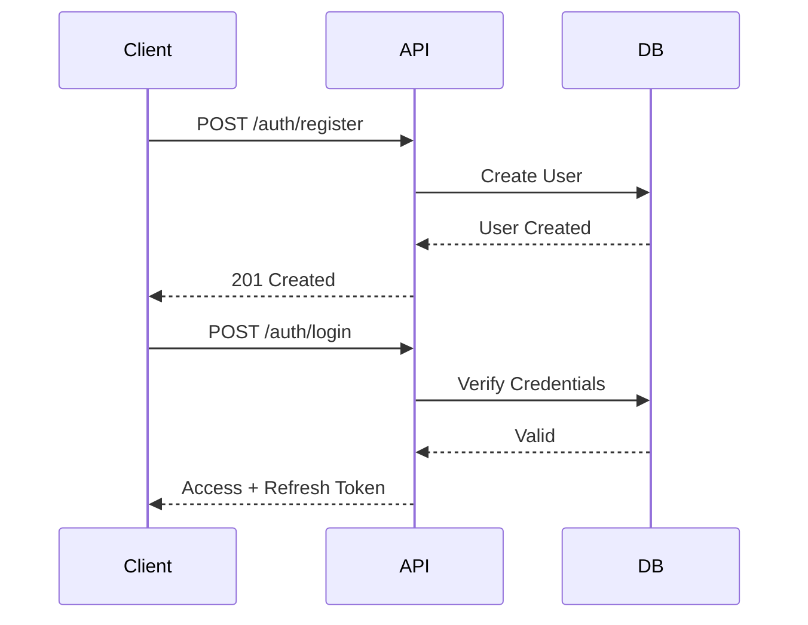
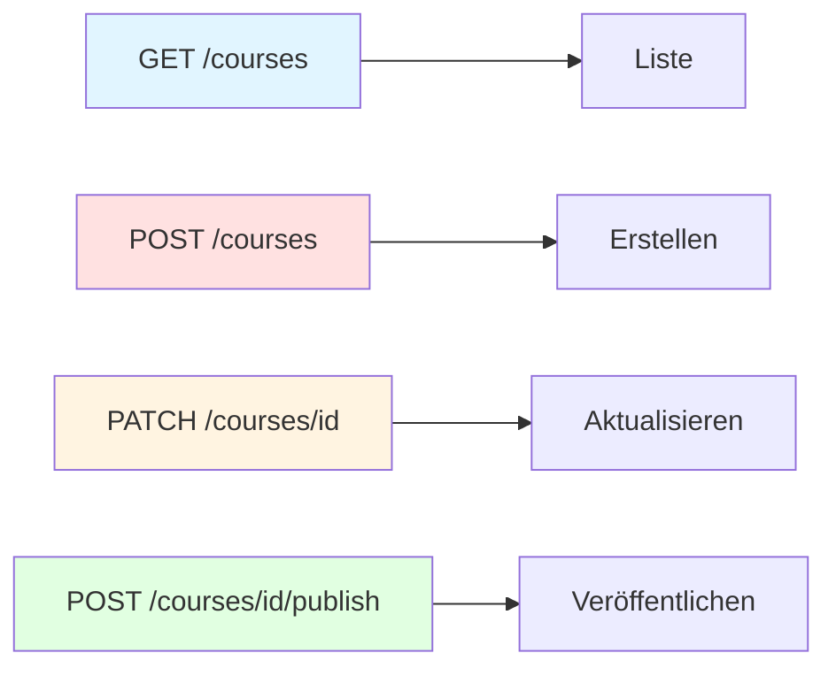
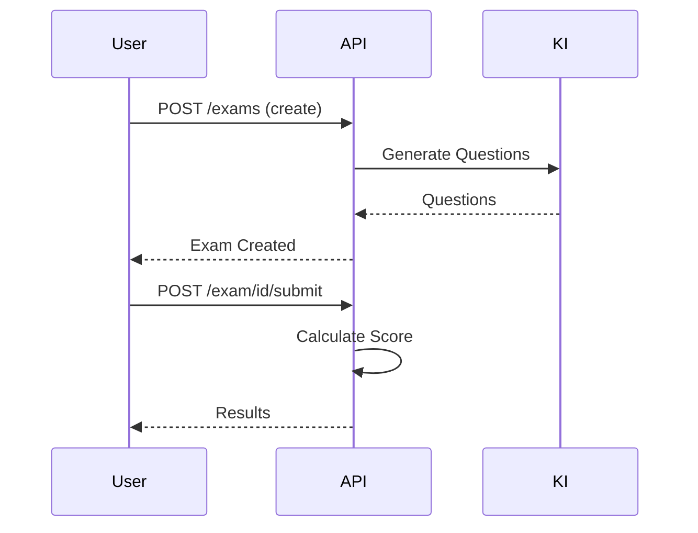
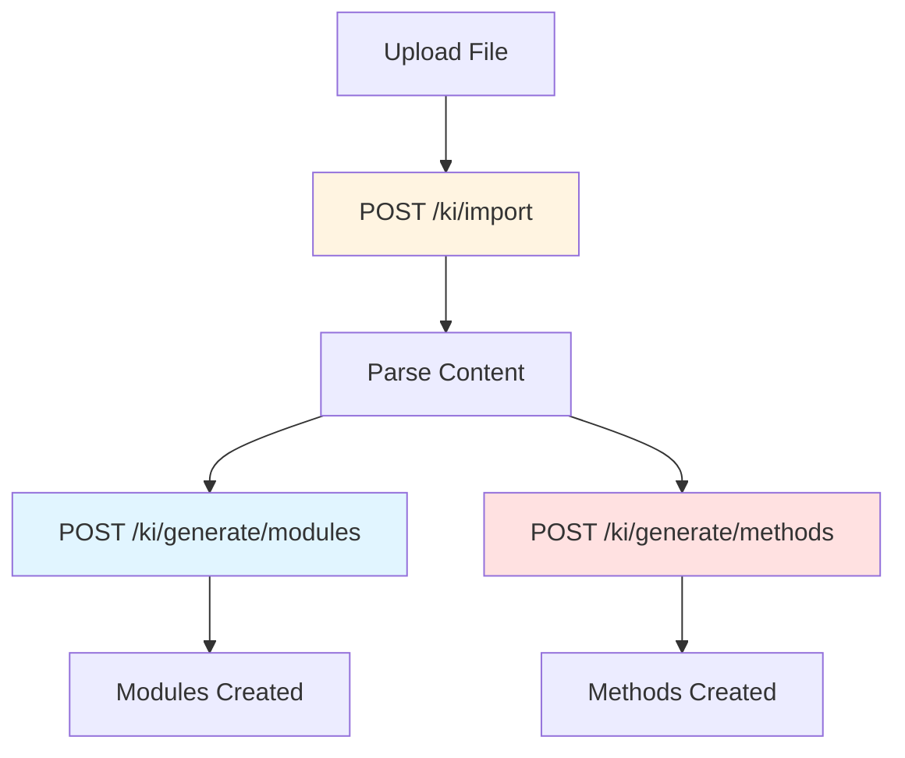
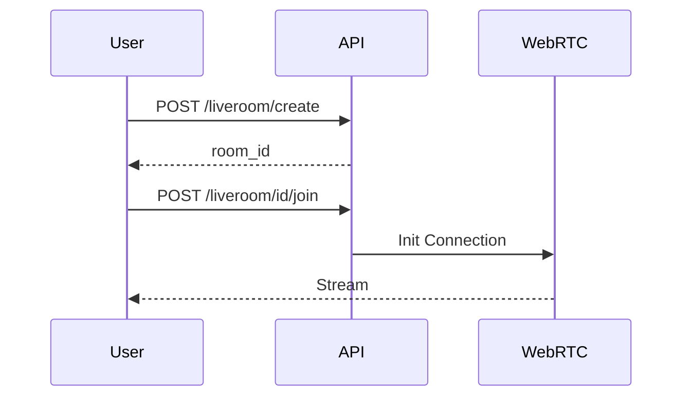
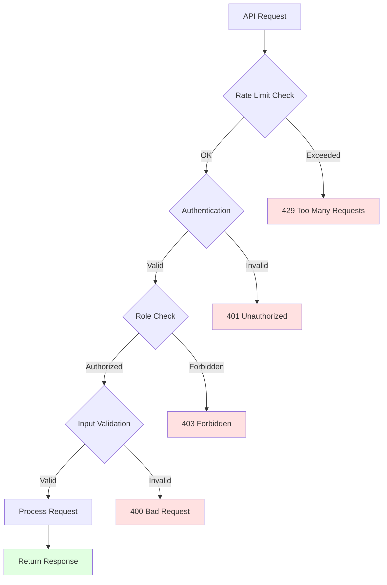

# 15 – API-Spezifikation (Final)

**Version:** 1.0  
**Stand:** Final

---

## Überblick

Dieses Dokument definiert die API-Spezifikation des LSX Lernsystems.

Die API ist **REST-basiert** (JSON), folgt klaren Namenskonventionen und unterstützt:

- 👥 **Benutzerverwaltung**
- 🔐 **Rollen & Berechtigungen**
- 📚 **Kurssystem**
- 📖 **Lernmodule & Methoden**
- 📝 **Prüfungssystem**
- 🤖 **KI-Pipeline**
- 🌍 **Übersetzungssystem**
- 📊 **Dashboard & Widgets**
- 🎥 **LiveRoom**
- 💰 **Token & Billing**
- 👥 **Community & Gruppen**

> Alle Endpunkte sind **versioniert** (v1).

---

## 1. API-Standards

### 1.1 📋 Format-Konventionen

| Standard | Wert |
|----------|------|
| 🌐 **Protokoll** | REST JSON |
| 📝 **Encoding** | UTF-8 |
| 🔤 **Naming** | snake_case |
| 🔧 **Partial Update** | PATCH |
| ➕ **Aktionen** | POST |
| 👁️ **Lesezugriffe** | GET |
| 🗑️ **Löschen** | DELETE |

---

### 1.2 🔐 Authentifizierung

**JWT-basierte Authentifizierung mit Access & Refresh Token**

#### 📨 Request Header

```http
Authorization: Bearer <access_token>
Content-Type: application/json
```

#### 🔑 Token-Typen

| Token | Lebensdauer | Verwendung |
|-------|-------------|-----------|
| 🎫 **Access Token** | 15 Minuten | API-Requests |
| 🔄 **Refresh Token** | 7 Tage | Token-Erneuerung |

---

### 1.3 ❌ Fehlerformat

```json
{
  "error": true,
  "message": "Unauthorized",
  "code": 401,
  "details": {
    "reason": "Invalid token"
  }
}
```

#### 🚨 HTTP Status Codes

| Code | Bedeutung | Verwendung |
|------|-----------|-----------|
| 200 | ✅ OK | Erfolg |
| 201 | ✅ Created | Ressource erstellt |
| 400 | ❌ Bad Request | Ungültige Anfrage |
| 401 | 🔒 Unauthorized | Nicht authentifiziert |
| 403 | 🚫 Forbidden | Keine Berechtigung |
| 404 | 🔍 Not Found | Ressource nicht gefunden |
| 429 | ⏱️ Too Many Requests | Rate Limit überschritten |
| 500 | 💥 Internal Server Error | Server-Fehler |

---

### 1.4 ✅ Erfolgformat

```json
{
  "success": true,
  "data": {
    "id": "uuid",
    "name": "Example"
  },
  "meta": {
    "timestamp": "2024-11-14T10:30:00Z"
  }
}
```

---

## 2. Auth & Benutzer

### 🔐 Authentifizierung & User-Management



---

### 2.1 ➕ POST `/api/v1/auth/register`

**Registriert einen neuen Benutzer**

#### Request Body

```json
{
  "email": "test@example.com",
  "password": "SecurePass123!",
  "firstname": "John",
  "lastname": "Doe",
  "language": "de"
}
```

#### Response (201 Created)

```json
{
  "success": true,
  "data": {
    "user_id": "uuid",
    "email": "test@example.com",
    "role": "free"
  }
}
```

---

### 2.2 🔑 POST `/api/v1/auth/login`

**Authentifiziert einen Benutzer**

#### Request Body

```json
{
  "email": "test@example.com",
  "password": "SecurePass123!"
}
```

#### Response (200 OK)

```json
{
  "success": true,
  "data": {
    "access_token": "eyJhbGciOiJIUzI1NiIsInR5cCI6IkpXVCJ9...",
    "refresh_token": "eyJhbGciOiJIUzI1NiIsInR5cCI6IkpXVCJ9...",
    "user": {
      "user_id": "uuid",
      "email": "test@example.com",
      "role": "premium",
      "firstname": "John",
      "lastname": "Doe"
    }
  }
}
```

---

### 2.3 👤 GET `/api/v1/users/me`

**Gibt das eigene Profil zurück**

#### Response (200 OK)

```json
{
  "success": true,
  "data": {
    "user_id": "uuid",
    "email": "test@example.com",
    "firstname": "John",
    "lastname": "Doe",
    "role": "premium",
    "language": "de",
    "created_at": "2024-01-15T10:00:00Z"
  }
}
```

---

### 2.4 🔄 POST `/api/v1/auth/refresh`

**Erneuert Access Token**

#### Request Body

```json
{
  "refresh_token": "eyJhbGciOiJIUzI1NiIsInR5cCI6IkpXVCJ9..."
}
```

#### Response (200 OK)

```json
{
  "success": true,
  "data": {
    "access_token": "new_access_token..."
  }
}
```

---

### 2.5 🚪 POST `/api/v1/auth/logout`

**Invalidiert Token**

---

### 2.6 🎨 User Profile – Theme Preference

**Theme-Einstellungen für Benutzer (Phase B24)**

Jeder eingeloggte Benutzer kann seine UI-Theme-Präferenz festlegen. Die Einstellung wird in `users.theme_preference` gespeichert und wirkt sich auf Dashboard, Kurse, Admin Panel und alle Ansichten aus.

#### Valide Theme-Werte
- `system` – Verwendet Betriebssystem-Einstellung
- `light` – Heller Modus (Daylight)
- `dark` – Dunkler Modus (Midnight, Standard)

---

#### 👁️ GET `/api/v1/profile/theme`

**Gibt die aktuelle Theme-Einstellung des eingeloggten Benutzers zurück**

**Auth:** Erforderlich (JWT Token)

**Response (200 OK):**

```json
{
  "theme": "dark"
}
```

**Fehlercodes:**
- `401 Unauthorized` – Kein gültiger Token
- `500 Internal Server Error` – Server-Fehler

**Beispiel:**
```bash
curl -X GET https://api.lernsystemx.com/api/v1/profile/theme \
  -H "Authorization: Bearer <access_token>"
```

---

#### 🎨 PATCH `/api/v1/profile/theme`

**Aktualisiert die Theme-Einstellung des eingeloggten Benutzers**

**Auth:** Erforderlich (JWT Token)

**Request Body:**

```json
{
  "theme": "light"
}
```

**Response (200 OK):**

```json
{
  "theme": "light"
}
```

**Fehlercodes:**
- `400 Bad Request` – Ungültiger Theme-Wert (muss `system`, `light` oder `dark` sein)
- `401 Unauthorized` – Kein gültiger Token
- `500 Internal Server Error` – Server-Fehler

**Beispiel:**
```bash
curl -X PATCH https://api.lernsystemx.com/api/v1/profile/theme \
  -H "Authorization: Bearer <access_token>" \
  -H "Content-Type: application/json" \
  -d '{"theme": "light"}'
```

**Hinweise:**
- ✅ **Audit-Logging:** Theme-Änderungen werden im Audit-Log mit Kategorie `preferences` und Aktion `change_theme` protokolliert
- ✅ **Sicherheit:** Benutzer können nur ihr eigenes Theme ändern (kein Admin-Zugriff auf andere Profile erforderlich)
- ✅ **Validierung:** Ungültige Theme-Werte werden mit HTTP 400 abgelehnt
- ✅ **DB-Constraint:** PostgreSQL CHECK Constraint verhindert ungültige Werte auf DB-Ebene

---

## 3. Rollen & Permissions

### 🎭 Rollen-Management

| Endpunkt | Methode | Beschreibung |
|----------|---------|-------------|
| `/api/v1/roles` | GET | Liste aller Rollen |
| `/api/v1/roles/{role_id}` | GET | Details einer Rolle |
| `/api/v1/roles/assign` | POST | Rolle zuweisen (Admin) |

---

### 3.1 📋 GET `/api/v1/roles`

#### Response (200 OK)

```json
{
  "success": true,
  "data": [
    {
      "role_id": 1,
      "role_name": "free",
      "description": "Kostenloser Basis-Zugang"
    },
    {
      "role_id": 2,
      "role_name": "premium",
      "description": "Premium-Mitgliedschaft"
    }
  ]
}
```

---

## 4. Kurs-System

### 📚 Kurs-Management



---

### 4.1 📋 GET `/api/v1/courses`

**Liste aller Kurse mit Filterung**

#### Query Parameter

| Parameter | Typ | Beschreibung |
|-----------|-----|-------------|
| `type` | string | academy, creator, community |
| `category` | integer | Kategorie-ID |
| `language` | string | de, en, pl, ... |
| `level` | string | beginner, intermediate, advanced |
| `page` | integer | Seite (Default: 1) |
| `limit` | integer | Ergebnisse pro Seite (Default: 20) |

#### Response (200 OK)

```json
{
  "success": true,
  "data": [
    {
      "course_id": "uuid",
      "title": "Network+ Komplettkurs",
      "description": "Vollständiger Kurs für CompTIA Network+",
      "course_type": "creator",
      "level": "intermediate",
      "price": 39.99,
      "thumbnail_url": "https://...",
      "creator": {
        "user_id": "uuid",
        "name": "Max Mustermann"
      },
      "rating": 4.8,
      "students": 1250
    }
  ],
  "meta": {
    "total": 150,
    "page": 1,
    "limit": 20
  }
}
```

---

### 4.2 👁️ GET `/api/v1/courses/{course_id}`

**Details eines Kurses**

#### Response (200 OK)

```json
{
  "success": true,
  "data": {
    "course_id": "uuid",
    "title": "Network+ Komplettkurs",
    "description": "...",
    "course_type": "creator",
    "category_id": 12,
    "level": "intermediate",
    "language_default": "de",
    "published": true,
    "price": 39.99,
    "modules": [
      {
        "module_id": "uuid",
        "title": "OSI-Modell",
        "order_index": 1
      }
    ],
    "creator": {
      "user_id": "uuid",
      "name": "Max Mustermann"
    }
  }
}
```

---

### 4.3 ➕ POST `/api/v1/courses`

**Erstellen eines Kurses** (Creator / Academy / Schule / Unternehmen)

#### Request Body

```json
{
  "title": "Network+ Komplettkurs",
  "description": "Vollständiger Vorbereitungskurs",
  "category_id": 12,
  "level": "intermediate",
  "price": 39.99,
  "course_type": "creator",
  "language_default": "de"
}
```

#### Response (201 Created)

```json
{
  "success": true,
  "data": {
    "course_id": "uuid",
    "title": "Network+ Komplettkurs",
    "published": false,
    "created_at": "2024-11-14T10:30:00Z"
  }
}
```

---

### 4.4 🔧 PATCH `/api/v1/courses/{course_id}`

**Kurs aktualisieren**

#### Request Body

```json
{
  "title": "Network+ Komplettkurs 2024",
  "price": 44.99
}
```

---

### 4.5 🚀 POST `/api/v1/courses/{course_id}/publish`

**Kurs veröffentlichen**

#### Response (200 OK)

```json
{
  "success": true,
  "data": {
    "course_id": "uuid",
    "published": true,
    "published_at": "2024-11-14T10:30:00Z"
  }
}
```

---

## 5. Lernmodule

### 📖 Modul-Management

| Endpunkt | Methode | Beschreibung |
|----------|---------|-------------|
| `/api/v1/modules/{course_id}` | GET | Module eines Kurses |
| `/api/v1/modules` | POST | Modul erstellen |
| `/api/v1/module/{module_id}` | GET | Modul-Details |
| `/api/v1/module/{module_id}` | PATCH | Modul aktualisieren |
| `/api/v1/module/{module_id}` | DELETE | Modul löschen |

---

### 5.1 📋 GET `/api/v1/modules/{course_id}`

**Alle Module eines Kurses**

#### Response (200 OK)

```json
{
  "success": true,
  "data": [
    {
      "module_id": "uuid",
      "title": "OSI-Modell",
      "description": "Die 7 Schichten des OSI-Modells",
      "order_index": 1,
      "theory_available": true,
      "methods_count": 5
    }
  ]
}
```

---

### 5.2 ➕ POST `/api/v1/modules`

**Neues Modul erstellen**

#### Request Body

```json
{
  "course_id": "uuid",
  "title": "Subnetting Grundlagen",
  "description": "IPv4 Subnetting verstehen",
  "order_index": 2
}
```

#### Response (201 Created)

```json
{
  "success": true,
  "data": {
    "module_id": "uuid",
    "title": "Subnetting Grundlagen",
    "course_id": "uuid",
    "order_index": 2
  }
}
```

---

## 6. Lernmethoden

### 🎯 Methoden-Management

| Endpunkt | Methode | Beschreibung |
|----------|---------|-------------|
| `/api/v1/methods/{module_id}` | GET | Methoden eines Moduls |
| `/api/v1/methods` | POST | Methode erstellen |
| `/api/v1/methods/{method_id}` | GET | Methoden-Details |
| `/api/v1/methods/{method_id}` | PATCH | Methode aktualisieren |

---

### 6.1 📋 GET `/api/v1/methods/{module_id}`

**Alle Methoden eines Moduls**

#### Response (200 OK)

```json
{
  "success": true,
  "data": [
    {
      "method_id": "uuid",
      "method_type": 1,
      "title": "Flashcards: OSI Layer",
      "instructions": "Lerne die 7 Schichten auswendig"
    }
  ]
}
```

---

### 6.2 ➕ POST `/api/v1/methods`

**Neue Lernmethode erstellen**

#### Request Body

```json
{
  "module_id": "uuid",
  "method_type": 1,
  "title": "Flashcards: OSI Layer",
  "instructions": "Lerne die 7 Schichten",
  "data": {
    "cards": [
      {
        "front": "Layer 7",
        "back": "Application Layer"
      },
      {
        "front": "Layer 1",
        "back": "Physical Layer"
      }
    ]
  },
  "solution": {
    "hints": ["Von oben nach unten lernen"]
  }
}
```

#### Response (201 Created)

```json
{
  "success": true,
  "data": {
    "method_id": "uuid",
    "method_type": 1,
    "title": "Flashcards: OSI Layer"
  }
}
```

---

## 7. Prüfungen

### 📝 Prüfungs-Management



---

### 7.1 📋 GET `/api/v1/exams/{course_id}`

**Alle Prüfungen eines Kurses**

---

### 7.2 ➕ POST `/api/v1/exams`

**Neue Prüfung erstellen**

#### Request Body

```json
{
  "course_id": "uuid",
  "module_id": "uuid",
  "type": "simulation",
  "title": "Network+ Practice Exam 1",
  "settings": {
    "time_limit": 90,
    "passing_score": 70,
    "question_count": 50
  }
}
```

---

### 7.3 👁️ GET `/api/v1/exam/{exam_id}`

**Prüfungsdetails abrufen**

---

### 7.4 ✅ POST `/api/v1/exam/{exam_id}/submit`

**Prüfung abgeben**

#### Request Body

```json
{
  "answers": [
    {
      "question_id": "uuid",
      "answer": [0, 2]
    },
    {
      "question_id": "uuid",
      "answer": "Text answer"
    }
  ]
}
```

#### Response (200 OK)

```json
{
  "success": true,
  "data": {
    "result_id": "uuid",
    "score": 85.5,
    "passed": true,
    "correct_answers": 43,
    "total_questions": 50,
    "details": {
      "by_topic": {
        "OSI Model": 90,
        "Subnetting": 80
      }
    }
  }
}
```

---

## 8. KI-Pipeline

### 🤖 KI-Funktionen



---

### 8.1 📤 POST `/api/v1/ki/import`

**Datei hochladen für KI-Verarbeitung**

#### Request (Multipart Form)

```
POST /api/v1/ki/import
Content-Type: multipart/form-data

file: [PDF/DOCX/IMG]
course_id: uuid (optional)
module_id: uuid (optional)
purpose: "module_gen" | "method_gen" | "exam_gen"
```

#### Response (201 Created)

```json
{
  "success": true,
  "data": {
    "input_id": "uuid",
    "file_path": "/uploads/...",
    "status": "processing"
  }
}
```

---

### 8.2 🏗️ POST `/api/v1/ki/generate/modules`

**Module aus Inhalt generieren**

#### Request Body

```json
{
  "course_id": "uuid",
  "input_id": "uuid",
  "settings": {
    "module_count": 5,
    "difficulty": "intermediate"
  }
}
```

---

### 8.3 🎯 POST `/api/v1/ki/generate/methods`

**Lernmethoden generieren**

#### Request Body

```json
{
  "module_id": "uuid",
  "method_types": [1, 2, 5],
  "count_per_type": 3
}
```

---

### 8.4 📝 POST `/api/v1/ki/generate/exam`

**Prüfung generieren**

---

### 8.5 🌍 POST `/api/v1/ki/translate`

**Inhalte übersetzen**

#### Request Body

```json
{
  "content_type": "theory",
  "content_id": "uuid",
  "target_language": "en",
  "source_language": "de"
}
```

#### Response (200 OK)

```json
{
  "success": true,
  "data": {
    "translation_id": "uuid",
    "status": "completed",
    "target_language": "en"
  }
}
```

---

## 9. Übersetzungen

### 🌍 Translation-API

### 9.1 📥 GET `/api/v1/translation/{content_type}/{content_id}/{language}`

**Übersetzung abrufen**

#### Response (200 OK)

```json
{
  "success": true,
  "data": {
    "translation_id": "uuid",
    "content_type": "theory",
    "content_id": "uuid",
    "language": "en",
    "translated_json": {
      "title": "Subnetting Basics",
      "content": "..."
    }
  }
}
```

---

## 10. Dashboard & Widgets

### 📊 Dashboard-Management

| Endpunkt | Methode | Beschreibung |
|----------|---------|-------------|
| `/api/v1/dashboard` | GET | Dashboard laden |
| `/api/v1/dashboard/save` | POST | Layout speichern |
| `/api/v1/widgets` | GET | Verfügbare Widgets |
| `/api/v1/widgets/settings` | POST | Widget-Einstellungen |

---

### 10.1 📊 GET `/api/v1/dashboard`

**Dashboard-Layout laden**

#### Response (200 OK)

```json
{
  "success": true,
  "data": {
    "dashboard_id": "uuid",
    "layout_id": "main",
    "widgets": [
      {
        "widget_id": 1,
        "type": "progress",
        "position_x": 0,
        "position_y": 0,
        "size": "medium",
        "settings": {},
        "data": {
          "progress": 65,
          "courses_active": 3
        }
      }
    ]
  }
}
```

---

### 10.2 💾 POST `/api/v1/dashboard/save`

**Dashboard-Layout speichern**

#### Request Body

```json
{
  "layout_id": "focus",
  "widgets": [
    {
      "widget_id": 1,
      "position_x": 0,
      "position_y": 0,
      "size": "large",
      "settings": {}
    }
  ]
}
```

---

## 11. LiveRoom

### 🎥 LiveRoom-API



---

### 11.1 ➕ POST `/api/v1/liveroom/create`

**LiveRoom erstellen**

#### Request Body

```json
{
  "room_type": "pro",
  "settings": {
    "max_participants": 50,
    "recording_enabled": true,
    "breakout_rooms": true
  }
}
```

#### Response (201 Created)

```json
{
  "success": true,
  "data": {
    "room_id": "uuid",
    "room_type": "pro",
    "owner_user_id": "uuid",
    "created_at": "2024-11-14T10:30:00Z"
  }
}
```

---

### 11.2 👁️ GET `/api/v1/liveroom/{room_id}`

**LiveRoom-Details**

---

### 11.3 🚪 POST `/api/v1/liveroom/{room_id}/join`

**LiveRoom beitreten**

---

### 11.4 🚶 POST `/api/v1/liveroom/{room_id}/leave`

**LiveRoom verlassen**

---

### 11.5 📹 POST `/api/v1/liveroom/{room_id}/record/start`

**Aufzeichnung starten**

---

### 11.6 ⏹️ POST `/api/v1/liveroom/{room_id}/record/stop`

**Aufzeichnung stoppen**

---

## 12. Token-System

### 💰 Token-Management

| Endpunkt | Methode | Beschreibung |
|----------|---------|-------------|
| `/api/v1/tokens` | GET | Token-Status |
| `/api/v1/tokens/buy` | POST | Token kaufen |
| `/api/v1/tokens/history` | GET | Verbrauchs-Historie |

---

### 12.1 💎 GET `/api/v1/tokens`

**Token-Status abrufen**

#### Response (200 OK)

```json
{
  "success": true,
  "data": {
    "balance": 15000,
    "used_this_month": 5000,
    "estimated_monthly_usage": 8000
  }
}
```

---

### 12.2 💳 POST `/api/v1/tokens/buy`

**Token kaufen**

#### Request Body

```json
{
  "amount": 10000,
  "payment_method": "stripe"
}
```

---

## 13. Billing (Schulen/Unternehmen)

### 💳 Rechnungs-Management

### 13.1 📋 GET `/api/v1/billing/invoices`

**Alle Rechnungen**

#### Response (200 OK)

```json
{
  "success": true,
  "data": [
    {
      "invoice_id": "uuid",
      "period_start": "2024-11-01",
      "period_end": "2024-11-30",
      "total_amount": 299.00,
      "status": "paid"
    }
  ]
}
```

---

### 13.2 👁️ GET `/api/v1/billing/invoices/{invoice_id}`

**Rechnungsdetails**

---

## 14. Community & Gruppen

### 👥 Gruppen-Management

| Endpunkt | Methode | Beschreibung |
|----------|---------|-------------|
| `/api/v1/groups/create` | POST | Gruppe erstellen |
| `/api/v1/groups/{group_id}` | GET | Gruppen-Details |
| `/api/v1/groups/{group_id}/join` | POST | Gruppe beitreten |
| `/api/v1/groups/{group_id}/resources/add` | POST | Ressource hinzufügen |

---

### 14.1 ➕ POST `/api/v1/groups/create`

**Neue Gruppe erstellen**

#### Request Body

```json
{
  "name": "Network+ Lerngruppe",
  "is_private": false,
  "description": "Gemeinsam für Network+ lernen"
}
```

---

## 15. Suche

### 🔍 Such-API

### 15.1 🔎 GET `/api/v1/search`

**Globale Suche**

#### Query Parameter

| Parameter | Typ | Beschreibung |
|-----------|-----|-------------|
| `q` | string | Suchbegriff |
| `filter` | string | course, module, method |
| `language` | string | de, en, pl |
| `page` | integer | Seite |
| `limit` | integer | Ergebnisse |

#### Response (200 OK)

```json
{
  "success": true,
  "data": {
    "courses": [
      {
        "course_id": "uuid",
        "title": "Network+ Kurs",
        "match_score": 0.95
      }
    ],
    "modules": [],
    "methods": []
  },
  "meta": {
    "total_results": 15,
    "query": "network"
  }
}
```

---

## 16. Sicherheit

### 🔒 Sicherheitsmaßnahmen



---

### 🛡️ Security Features

| Feature | Beschreibung |
|---------|-------------|
| ⏱️ **Rate Limiting** | 100 Requests/Minute pro User |
| 🔐 **Rollenprüfung** | Bei jedem Endpunkt |
| 📝 **IP-Logging** | Für Admin-Zugriffe |
| 🚨 **Abuse-Detection** | KI-Endpunkte überwacht |
| 🔑 **JWT-Validation** | Token-Integrität |
| 🛡️ **Upload-Scan** | Virenscan bei Datei-Uploads |
| 🔒 **HTTPS Only** | TLS 1.3 |
| 🎫 **CSRF Protection** | Token-basiert |

---

### ⏱️ Rate Limits

| Endpunkt-Typ | Limit | Zeitfenster |
|--------------|-------|-------------|
| 🔓 **Public** | 60 | 1 Minute |
| 🔐 **Authenticated** | 120 | 1 Minute |
| 🤖 **KI-Endpoints** | 10 | 1 Minute |
| 📤 **Upload** | 5 | 1 Minute |

---

## 17. Zusammenfassung

### ✅ Die LSX-API

| Feature | Status |
|---------|--------|
| 📚 **Alle Funktionen abgedeckt** | ✅ |
| 🧩 **Modular aufgebaut** | ✅ |
| 📦 **Versioniert (v1)** | ✅ |
| 🔒 **Sicher** | ✅ |
| 🔄 **Erweiterbar** | ✅ |
| 🤖 **KI-optimiert** | ✅ |
| 👥 **Rollenbasiert** | ✅ |
| 📊 **RESTful** | ✅ |

### 💡 API-Highlights

```
┌─────────────────────────────────────┐
│  🌐 REST JSON (UTF-8)                │
│  🔐 JWT Authentication               │
│  📦 Versioniert (v1)                 │
│  🎯 snake_case Naming                │
│  ⚡ Rate Limited                     │
│  🛡️ Rollenbasierte Autorisierung     │
└─────────────────────────────────────┘
```

### 🎯 Endpoint-Kategorien

| Kategorie | Endpunkte | Beschreibung |
|-----------|-----------|-------------|
| 🔐 **Auth** | 5 | Authentifizierung & User |
| 📚 **Courses** | 10+ | Kurs-Management |
| 📖 **Modules** | 5 | Modul-Verwaltung |
| 🎯 **Methods** | 5 | Lernmethoden |
| 📝 **Exams** | 6 | Prüfungssystem |
| 🤖 **KI** | 8+ | KI-Pipeline |
| 🌍 **Translation** | 3 | Übersetzungen |
| 📊 **Dashboard** | 4 | Dashboard & Widgets |
| 🎥 **LiveRoom** | 8 | LiveRoom-System |
| 💰 **Tokens** | 3 | Token-Management |
| 💳 **Billing** | 4 | Rechnungen |
| 👥 **Groups** | 5 | Community & Gruppen |
| 🔍 **Search** | 1 | Globale Suche |

> **Sie ist die Grundlage für das gesamte LSX Backend.**

---

## 📌 Dokument abgeschlossen

**Version:** 1.0  
**Status:** Final  
**Letzte Aktualisierung:** November 2024

---

> 💡 **Hinweis:** Dieses Dokument ist Teil der LSX-Systemdokumentation und beschreibt die vollständige REST-API mit allen Endpunkten, Authentifizierung und Sicherheitsmaßnahmen.