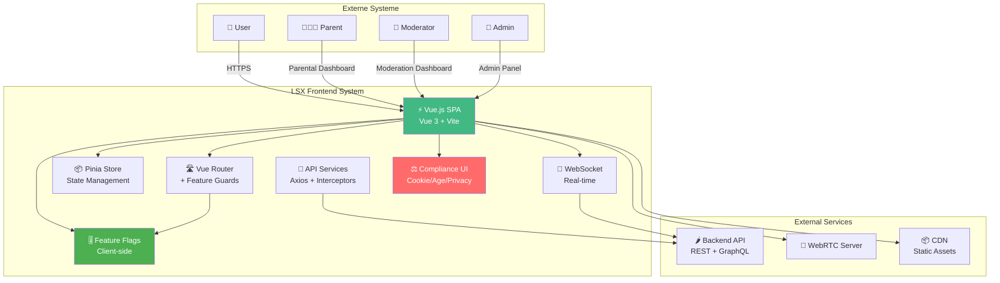

# 16 – Frontend-Struktur (Final)

**Version:** 2.0  
**Stand:** 10.01.2026  
**Änderungen:** Complete Enterprise Architecture mit Social Network UI, Compliance Components, Feature Flags UI, Moderation Dashboard

---

## Überblick

Dieses Dokument definiert die vollständige **Enterprise-Grade Frontend-Architektur** des LSX Lernsystems.

Das Frontend ist **modular**, **komponentenbasiert**, **mehrsprachig**, **performant**, **compliance-konform** und für **ADHD/ADHS optimiert**.

### 🎯 Neue Features in v2.0

- ✅ **Social Network UI** - Posts, Feed, Follow, Engagement Components
- ✅ **Compliance Components** - Cookie Consent, Age Gates, Privacy Controls
- ✅ **Moderation Dashboard** - Content Review, Reports, Statistics
- ✅ **Feature Flag UI** - Admin Controls, A/B Testing, Rollout Management
- ✅ **Content Reporting** - User Report Forms, Evidence Collection
- ✅ **Privacy Dashboard** - GDPR Controls, Data Export, Consent Management
- ✅ **Child Safety UI** - Parental Controls, Safe Mode, Age Verification
- ✅ **DRM UI Components** - License Display, Watermarks, Access Gates

### 🛠️ Tech-Stack

| Technologie | Verwendung |
|------------|-----------|
| ⚡ **Vue.js 3** | Composition API |
| 🚀 **Vite** | Build Tool |
| 📦 **Pinia** | State Management |
| 🛣️ **Vue Router** | Routing mit Feature Flag Guards |
| 🎨 **TailwindCSS** | Styling |
| 🌍 **vue-i18n** | Internationalisierung (20+ Sprachen) |
| 🎥 **WebRTC** | Video/Audio (LiveRoom) |
| 🔌 **WebSockets** | Real-time (Notifications, Feed) |
| 📡 **Axios** | API Requests mit Interceptors |
| 🎚️ **Feature Flags** | Progressive Feature Rollout |
| 🛡️ **DOMPurify** | XSS Protection |
| 🍪 **js-cookie** | Cookie Management (GDPR) |
| 📊 **Chart.js** | Analytics & Statistics |
| 🔒 **CryptoJS** | Client-side Encryption (DRM) |

> Alle Komponenten sind **klar getrennt**, **gut wartbar**, **erweiterbar** und **compliance-konform**.

---

## 1. Projektstruktur (Frontend-Verzeichnis)

### 📁 Komplette Verzeichnisstruktur v2.0

```
/frontend
├── /public
│   ├── favicon.ico
│   └── /assets
│       ├── /images
│       ├── /icons
│       └── /legal          # ⭐ Legal Documents
│           ├── privacy-policy.pdf
│           ├── terms-of-service.pdf
│           ├── community-guidelines.pdf
│           └── cookie-policy.pdf
│
├── /src
│   ├── /assets
│   │   ├── /images
│   │   ├── /icons
│   │   └── styles.css
│   │
│   ├── /components         # 🧩 UI COMPONENTS
│   │   ├── /base           # Base Components
│   │   │   ├── Button.vue
│   │   │   ├── Input.vue
│   │   │   ├── Textarea.vue
│   │   │   ├── Modal.vue
│   │   │   ├── Dropdown.vue
│   │   │   ├── Tabs.vue
│   │   │   ├── Loader.vue
│   │   │   ├── Alert.vue
│   │   │   ├── Card.vue
│   │   │   ├── ProgressBar.vue
│   │   │   ├── Tooltip.vue
│   │   │   ├── Badge.vue
│   │   │   ├── Avatar.vue
│   │   │   └── Pagination.vue
│   │   │
│   │   ├── /social         # ⭐ SOCIAL NETWORK COMPONENTS
│   │   │   ├── PostCard.vue              # Single Post Display
│   │   │   ├── PostComposer.vue          # Create Post
│   │   │   ├── PostList.vue              # Post Feed List
│   │   │   ├── CommentSection.vue        # Comments
│   │   │   ├── CommentInput.vue          # Comment Input
│   │   │   ├── LikeButton.vue            # Like/Unlike
│   │   │   ├── ShareButton.vue           # Share Post
│   │   │   ├── FollowButton.vue          # Follow/Unfollow User
│   │   │   ├── FollowersList.vue         # Followers List
│   │   │   ├── FollowingList.vue         # Following List
│   │   │   ├── UserCard.vue              # User Profile Card
│   │   │   ├── UserBadge.vue             # User Achievement Badge
│   │   │   ├── HashtagChip.vue           # Hashtag Display
│   │   │   ├── MentionInput.vue          # @mention Input
│   │   │   ├── TrendingCard.vue          # Trending Posts
│   │   │   ├── SuggestedUsers.vue        # Follow Suggestions
│   │   │   └── ActivityFeed.vue          # Notification Feed
│   │   │
│   │   ├── /compliance     # ⭐ COMPLIANCE COMPONENTS
│   │   │   ├── CookieConsent.vue         # GDPR Cookie Banner
│   │   │   ├── CookieSettings.vue        # Granular Cookie Control
│   │   │   ├── AgeGate.vue               # Age Verification Gate
│   │   │   ├── ParentalConsent.vue       # COPPA Consent Form
│   │   │   ├── PrivacyDashboard.vue      # User Privacy Controls
│   │   │   ├── DataExport.vue            # GDPR Data Export
│   │   │   ├── DataDeletion.vue          # Right to Erasure
│   │   │   ├── ConsentManager.vue        # Consent Management
│   │   │   ├── ReportContent.vue         # Report Form (DSA)
│   │   │   ├── ReportStatus.vue          # Track Report Status
│   │   │   ├── ContentWarning.vue        # Content Warning Overlay
│   │   │   ├── SafeMode.vue              # Child Safe Mode Toggle
│   │   │   ├── ParentalControls.vue      # Parent Dashboard
│   │   │   ├── ScreenTimeWidget.vue      # Usage Tracking
│   │   │   └── TransparencyReport.vue    # Public Transparency Reports
│   │   │
│   │   ├── /moderation     # ⭐ MODERATION COMPONENTS
│   │   │   ├── ModerationQueue.vue       # Review Queue
│   │   │   ├── ContentReview.vue         # Single Content Review
│   │   │   ├── ReportDetails.vue         # Report Details View
│   │   │   ├── ModerationActions.vue     # Action Buttons
│   │   │   ├── UserHistory.vue           # User Violation History
│   │   │   ├── ModerationStats.vue       # Statistics Dashboard
│   │   │   ├── SLAMonitor.vue            # 24h/7d Deadline Tracker
│   │   │   └── AppealReview.vue          # Appeal Review (DSA Art. 17)
│   │   │
│   │   ├── /security       # 🔒 SECURITY COMPONENTS
│   │   │   ├── TwoFactorAuth.vue         # 2FA Setup
│   │   │   ├── SessionManager.vue        # Active Sessions
│   │   │   ├── SecurityLog.vue           # Security Event Log
│   │   │   ├── DRMLicenseDisplay.vue     # License Information
│   │   │   ├── Watermark.vue             # Visible Watermark
│   │   │   └── AccessGate.vue            # DRM Access Gate
│   │   │
│   │   └── /feature-flags  # ⭐ FEATURE FLAG COMPONENTS
│   │       ├── FeatureGate.vue           # Feature Flag Wrapper
│   │       ├── FeatureFlagBadge.vue      # "Beta" Badge
│   │       ├── RolloutProgress.vue       # Rollout Stats
│   │       └── ABTestBanner.vue          # A/B Test Info
│   │
│   ├── /layouts            # 🏗️ LAYOUTS
│   │   ├── MainLayout.vue
│   │   ├── AuthLayout.vue
│   │   ├── DashboardLayout.vue
│   │   ├── AdminLayout.vue
│   │   ├── ModeratorLayout.vue          # ⭐ NEW: Moderation Layout
│   │   ├── OrganizationLayout.vue
│   │   └── MinimalLayout.vue            # ⭐ NEW: Age Gate, Consent
│   │
│   ├── /pages              # 📄 PAGES/VIEWS
│   │   ├── /auth
│   │   │   ├── Login.vue
│   │   │   ├── Register.vue
│   │   │   ├── RegisterWithConsent.vue  # ⭐ NEW: GDPR Consent
│   │   │   ├── ForgotPassword.vue
│   │   │   └── AgeVerification.vue      # ⭐ NEW: Age Gate
│   │   │
│   │   ├── /dashboard
│   │   │   ├── Index.vue
│   │   │   ├── Settings.vue
│   │   │   ├── Notifications.vue
│   │   │   └── LayoutManager.vue
│   │   │
│   │   ├── /social         # ⭐ NEW: SOCIAL PAGES
│   │   │   ├── Feed.vue                  # Main Feed
│   │   │   ├── Explore.vue               # Explore/Discovery
│   │   │   ├── Trending.vue              # Trending Page
│   │   │   ├── Profile.vue               # User Profile
│   │   │   ├── EditProfile.vue           # Edit Profile
│   │   │   ├── Followers.vue             # Followers List
│   │   │   ├── Following.vue             # Following List
│   │   │   ├── Post.vue                  # Single Post View
│   │   │   ├── Bookmarks.vue             # Saved Posts
│   │   │   ├── Messages.vue              # Direct Messages
│   │   │   └── Notifications.vue         # Social Notifications
│   │   │
│   │   ├── /privacy        # ⭐ NEW: PRIVACY & COMPLIANCE
│   │   │   ├── PrivacySettings.vue       # Privacy Dashboard
│   │   │   ├── DataExport.vue            # GDPR Export
│   │   │   ├── DataDeletion.vue          # Right to Erasure
│   │   │   ├── ConsentHistory.vue        # Consent Log
│   │   │   ├── CookiePreferences.vue     # Cookie Settings
│   │   │   ├── PrivacyPolicy.vue         # Privacy Policy Page
│   │   │   ├── TermsOfService.vue        # ToS Page
│   │   │   └── CommunityGuidelines.vue   # Content Policy
│   │   │
│   │   ├── /moderation     # ⭐ NEW: MODERATION DASHBOARD
│   │   │   ├── Dashboard.vue             # Moderator Dashboard
│   │   │   ├── Queue.vue                 # Review Queue
│   │   │   ├── Reports.vue               # All Reports
│   │   │   ├── ReviewContent.vue         # Content Review Page
│   │   │   ├── Appeals.vue               # Appeal Queue (DSA)
│   │   │   ├── Statistics.vue            # Mod Statistics
│   │   │   ├── TransparencyReports.vue   # Generate Reports
│   │   │   └── UserProfile.vue           # User Moderation View
│   │   │
│   │   ├── /parental       # ⭐ NEW: PARENTAL CONTROLS
│   │   │   ├── Dashboard.vue             # Parent Dashboard
│   │   │   ├── ActivityLog.vue           # Child Activity
│   │   │   ├── ScreenTime.vue            # Usage Limits
│   │   │   ├── ContentApproval.vue       # Pre-approval Queue
│   │   │   ├── Restrictions.vue          # Content Restrictions
│   │   │   └── Reports.vue               # Activity Reports
│   │   │
│   │   ├── /admin          # 👑 ADMIN PAGES (Extended)
│   │   │   ├── AdminDashboard.vue
│   │   │   ├── UserManagement.vue
│   │   │   ├── FeatureFlags.vue          # ⭐ NEW: Feature Flag Admin
│   │   │   ├── RolloutControl.vue        # ⭐ NEW: Rollout Management
│   │   │   ├── ABTesting.vue             # ⭐ NEW: A/B Test Config
│   │   │   ├── ComplianceDashboard.vue   # ⭐ NEW: Compliance Overview
│   │   │   ├── ModerationSettings.vue    # ⭐ NEW: Mod Config
│   │   │   ├── ContentPolicies.vue       # ⭐ NEW: Policy Management
│   │   │   ├── Logs.vue
│   │   │   ├── WidgetRegistry.vue
│   │   │   └── RoleManagement.vue
│   │   │
│   │   ├── ProfilePage.vue
│   │   ├── SettingsPage.vue
│   │   ├── /courses                      # (existing course pages)
│   │   ├── /creator                      # (existing creator pages)
│   │   ├── /community                    # (existing community pages)
│   │   └── /org                          # (existing org pages)
│   │
│   ├── /router             # 🛣️ ROUTER
│   │   ├── index.js                      # Main Router
│   │   ├── guards.js                     # Route Guards
│   │   └── featureGuards.js              # ⭐ NEW: Feature Flag Guards
│   │
│   ├── /store              # 📦 PINIA STORES
│   │   ├── /modules
│   │   │   ├── user.js                   # User Store
│   │   │   ├── auth.js                   # Auth Store
│   │   │   ├── courses.js                # Courses Store
│   │   │   ├── dashboard.js              # Dashboard Store
│   │   │   │
│   │   │   ├── /social                   # ⭐ NEW: SOCIAL STORES
│   │   │   │   ├── posts.js              # Posts State
│   │   │   │   ├── feed.js               # Feed State
│   │   │   │   ├── follows.js            # Follow Relationships
│   │   │   │   ├── likes.js              # Likes State
│   │   │   │   ├── comments.js           # Comments State
│   │   │   │   ├── notifications.js      # Social Notifications
│   │   │   │   └── messages.js           # Direct Messages
│   │   │   │
│   │   │   ├── /compliance               # ⭐ NEW: COMPLIANCE STORES
│   │   │   │   ├── consent.js            # Cookie/Privacy Consents
│   │   │   │   ├── privacy.js            # Privacy Settings
│   │   │   │   ├── reports.js            # User Reports
│   │   │   │   └── childSafety.js        # Parental Controls
│   │   │   │
│   │   │   ├── /moderation               # ⭐ NEW: MODERATION STORES
│   │   │   │   ├── queue.js              # Review Queue
│   │   │   │   ├── reports.js            # All Reports
│   │   │   │   ├── actions.js            # Mod Actions
│   │   │   │   └── statistics.js         # Mod Stats
│   │   │   │
│   │   │   ├── /admin                    # Admin Stores
│   │   │   │   ├── featureFlags.js       # ⭐ NEW: Feature Flags
│   │   │   │   ├── rollout.js            # ⭐ NEW: Rollout Control
│   │   │   │   └── analytics.js          # Admin Analytics
│   │   │   │
│   │   │   └── /security                 # ⭐ NEW: SECURITY STORES
│   │   │       ├── drm.js                # DRM State
│   │   │       ├── sessions.js           # Session Management
│   │   │       └── auditLog.js           # Security Audit Log
│   │   │
│   │   └── index.js                      # Root Store
│   │
│   ├── /services           # 📡 API SERVICES
│   │   ├── api.js                        # Base Axios Instance
│   │   ├── interceptors.js               # Request/Response Interceptors
│   │   │
│   │   ├── /core                         # Core Services
│   │   │   ├── auth.service.js
│   │   │   ├── user.service.js
│   │   │   └── course.service.js
│   │   │
│   │   ├── /social                       # ⭐ NEW: SOCIAL SERVICES
│   │   │   ├── post.service.js
│   │   │   ├── feed.service.js
│   │   │   ├── follow.service.js
│   │   │   ├── like.service.js
│   │   │   ├── comment.service.js
│   │   │   ├── share.service.js
│   │   │   ├── message.service.js
│   │   │   └── notification.service.js
│   │   │
│   │   ├── /compliance                   # ⭐ NEW: COMPLIANCE SERVICES
│   │   │   ├── consent.service.js        # Consent Management
│   │   │   ├── privacy.service.js        # Privacy Export/Deletion
│   │   │   ├── report.service.js         # Content Reporting
│   │   │   └── ageVerification.service.js # Age Verification
│   │   │
│   │   ├── /moderation                   # ⭐ NEW: MODERATION SERVICES
│   │   │   ├── queue.service.js
│   │   │   ├── review.service.js
│   │   │   ├── action.service.js
│   │   │   └── statistics.service.js
│   │   │
│   │   └── /admin                        # Admin Services
│   │       ├── featureFlag.service.js    # ⭐ NEW: Feature Flags API
│   │       └── analytics.service.js
│   │
│   ├── /composables        # 🔄 VUE COMPOSABLES
│   │   ├── /core
│   │   │   ├── useAuth.js
│   │   │   ├── useToast.js
│   │   │   └── useModal.js
│   │   │
│   │   ├── /social                       # ⭐ NEW: SOCIAL COMPOSABLES
│   │   │   ├── usePost.js                # Post CRUD
│   │   │   ├── useFeed.js                # Feed Management
│   │   │   ├── useFollow.js              # Follow Logic
│   │   │   ├── useLike.js                # Like Logic
│   │   │   ├── useComment.js             # Comment Logic
│   │   │   ├── useNotifications.js       # Real-time Notifications
│   │   │   └── useInfiniteScroll.js      # Infinite Scroll
│   │   │
│   │   ├── /compliance                   # ⭐ NEW: COMPLIANCE COMPOSABLES
│   │   │   ├── useConsent.js             # Cookie Consent
│   │   │   ├── usePrivacy.js             # Privacy Controls
│   │   │   ├── useReport.js              # Content Reporting
│   │   │   └── useAgeGate.js             # Age Verification
│   │   │
│   │   ├── /moderation                   # ⭐ NEW: MODERATION COMPOSABLES
│   │   │   ├── useModerationQueue.js
│   │   │   ├── useContentReview.js
│   │   │   └── useModerationStats.js
│   │   │
│   │   ├── /security                     # ⭐ NEW: SECURITY COMPOSABLES
│   │   │   ├── useDRM.js                 # DRM Logic
│   │   │   ├── useSession.js             # Session Management
│   │   │   └── useAuditLog.js            # Security Logging
│   │   │
│   │   └── /admin
│   │       ├── useFeatureFlags.js        # ⭐ NEW: Feature Flag Logic
│   │       └── useRollout.js             # ⭐ NEW: Rollout Logic
│   │
│   ├── /widgets            # 🎨 DASHBOARD WIDGETS (existing)
│   ├── /modules            # 📝 LEARNING METHOD MODULES (existing)
│   ├── /liveroom           # 🎥 LIVEROOM COMPONENTS (existing)
│   │
│   ├── /i18n               # 🌍 INTERNATIONALIZATION
│   │   ├── index.js
│   │   └── /locales
│   │       ├── de.json                   # German
│   │       ├── en.json                   # English
│   │       ├── fr.json                   # French
│   │       ├── es.json                   # Spanish
│   │       └── ... (20+ languages)
│   │
│   ├── /utils              # 🛠️ UTILITIES
│   │   ├── formatDate.js
│   │   ├── validation.js
│   │   ├── sanitize.js                   # XSS Protection
│   │   ├── storage.js                    # LocalStorage Wrapper
│   │   ├── crypto.js                     # ⭐ NEW: Client Crypto (DRM)
│   │   ├── featureFlags.js               # ⭐ NEW: Feature Flag Helpers
│   │   └── gdpr.js                       # ⭐ NEW: GDPR Helpers
│   │
│   ├── /plugins            # 🔌 VUE PLUGINS
│   │   ├── featureFlags.js               # ⭐ NEW: Feature Flag Plugin
│   │   ├── analytics.js                  # Analytics Plugin
│   │   └── errorTracking.js              # Error Tracking
│   │
│   ├── /directives         # 🎯 CUSTOM DIRECTIVES
│   │   ├── v-feature.js                  # ⭐ NEW: v-feature="'posts'"
│   │   ├── v-tooltip.js
│   │   └── v-click-outside.js
│   │
│   ├── /middleware         # 🛡️ MIDDLEWARE
│   │   ├── auth.js
│   │   ├── role.js
│   │   ├── featureFlag.js                # ⭐ NEW: Feature Flag Middleware
│   │   └── ageGate.js                    # ⭐ NEW: Age Verification
│   │
│   ├── App.vue             # 🎯 Root Component
│   └── main.js             # 🚀 Application Entry Point
│
├── /tests                  # 🧪 TESTS
│   ├── /unit
│   ├── /integration
│   └── /e2e
│
├── index.html
├── vite.config.js
├── tailwind.config.js
├── package.json
├── .env
├── .env.production
└── .eslintrc.js
```

---

## 2. System-Architektur (C4 Model - Context)



---

## 3. Feature Flag Integration

### 🎚️ Feature Flag Plugin

```javascript
// src/plugins/featureFlags.js

import { ref } from 'vue'
import { featureFlagService } from '@/services/admin/featureFlag.service'

export const featureFlags = ref({
  // Social Features
  user_posts: false,
  feed_system: false,
  follow_system: false,
  likes_reactions: false,
  comments: true,
  shares: false,
  bookmarks: false,
  
  // Discovery
  trending_discovery: false,
  hashtags: false,
  mentions: false,
  explore_page: false,
  
  // Messaging
  direct_messages: false,
  group_chat: true,
  
  // Moderation
  community_moderation: false,
  
  // Child Safety
  child_safety_strict: true,
})

export const isFeatureEnabled = (featureName) => {
  return featureFlags.value[featureName] === true
}

export const loadFeatureFlags = async () => {
  try {
    const flags = await featureFlagService.getUserFlags()
    featureFlags.value = { ...featureFlags.value, ...flags }
  } catch (error) {
    console.error('Failed to load feature flags:', error)
  }
}

// Vue Plugin
export default {
  install(app) {
    app.config.globalProperties.$features = {
      isEnabled: isFeatureEnabled,
      flags: featureFlags
    }
    
    // Load flags on app mount
    loadFeatureFlags()
  }
}
```

### 🎯 v-feature Directive

```javascript
// src/directives/v-feature.js

export default {
  mounted(el, binding) {
    const featureName = binding.value
    const isEnabled = isFeatureEnabled(featureName)
    
    if (!isEnabled) {
      // Hide element if feature is disabled
      el.style.display = 'none'
      
      // Optionally show "Coming Soon" badge
      if (binding.modifiers.badge) {
        const badge = document.createElement('span')
        badge.className = 'feature-badge'
        badge.textContent = 'Coming Soon'
        el.parentNode.insertBefore(badge, el)
      }
    }
  }
}

// Usage in component:
// <PostComposer v-feature="'user_posts'" />
// <FollowButton v-feature.badge="'follow_system'" />
```

### 🔒 Feature Flag Route Guard

```javascript
// src/router/featureGuards.js

import { isFeatureEnabled } from '@/plugins/featureFlags'

export const requireFeature = (featureName) => {
  return (to, from, next) => {
    if (isFeatureEnabled(featureName)) {
      next()
    } else {
      // Redirect to dashboard with message
      next({
        name: 'Dashboard',
        query: {
          featureDisabled: featureName
        }
      })
    }
  }
}

// Usage in router:
// {
//   path: '/social/feed',
//   component: Feed,
//   beforeEnter: requireFeature('feed_system')
// }
```

---

## 4. Social Network Components

### 🌟 PostCard Component

```vue
<!-- src/components/social/PostCard.vue -->

<template>
  <Card class="post-card">
    <!-- User Info -->
    <div class="post-header">
      <Avatar :user="post.author" />
      <div class="user-info">
        <router-link :to="`/profile/${post.author.id}`">
          <h4>{{ post.author.username }}</h4>
        </router-link>
        <span class="post-time">{{ formatTime(post.created_at) }}</span>
      </div>
      
      <!-- Report Button -->
      <Dropdown v-if="!isOwnPost">
        <DropdownItem @click="reportPost">
          🚩 Report Post
        </DropdownItem>
      </Dropdown>
    </div>

    <!-- Content Warning (Child Safety) -->
    <ContentWarning 
      v-if="post.has_warning"
      :type="post.warning_type"
      @reveal="revealContent"
    />

    <!-- Post Content -->
    <div v-show="!post.has_warning || contentRevealed" class="post-content">
      <p v-html="sanitizedContent"></p>
      
      <!-- Media -->
      <div v-if="post.media_urls" class="post-media">
        
      </div>
      
      <!-- Hashtags -->
      <div v-if="post.hashtags" class="post-hashtags">
        <HashtagChip 
          v-for="tag in post.hashtags"
          :key="tag"
          :tag="tag"
        />
      </div>
    </div>

    <!-- Engagement Actions -->
    <div v-feature="'likes_reactions'" class="post-actions">
      <LikeButton 
        :post-id="post.id"
        :initial-liked="post.user_liked"
        :count="post.likes_count"
      />
      
      <CommentButton 
        :count="post.comments_count"
        @click="toggleComments"
      />
      
      <ShareButton 
        v-feature="'shares'"
        :post-id="post.id"
        :count="post.shares_count"
      />
      
      <BookmarkButton 
        v-feature="'bookmarks'"
        :post-id="post.id"
        :initial-bookmarked="post.user_bookmarked"
      />
    </div>

    <!-- Comments Section -->
    <CommentSection 
      v-if="showComments && commentsEnabled"
      :post-id="post.id"
    />

    <!-- DRM Watermark (if applicable) -->
    <Watermark 
      v-if="post.is_premium_content"
      :user="currentUser"
    />
  </Card>
</template>

<script setup>
import { ref, computed } from 'vue'
import { usePost } from '@/composables/social/usePost'
import { sanitizeHtml } from '@/utils/sanitize'
import { useReport } from '@/composables/compliance/useReport'

const props = defineProps({
  post: {
    type: Object,
    required: true
  }
})

const { currentUser } = useAuth()
const { openReportModal } = useReport()

const contentRevealed = ref(false)
const showComments = ref(false)

const isOwnPost = computed(() => {
  return props.post.author.id === currentUser.value?.id
})

const sanitizedContent = computed(() => {
  return sanitizeHtml(props.post.content)
})

const commentsEnabled = computed(() => {
  return isFeatureEnabled('comments')
})

const revealContent = () => {
  contentRevealed.value = true
}

const toggleComments = () => {
  showComments.value = !showComments.value
}

const reportPost = () => {
  openReportModal({
    content_id: props.post.id,
    content_type: 'post',
    author: props.post.author
  })
}
</script>
```

### 💬 CommentSection Component

```vue
<!-- src/components/social/CommentSection.vue -->

<template>
  <div class="comment-section">
    <!-- Comment Input -->
    <CommentInput 
      v-if="canComment"
      :post-id="postId"
      @submit="handleNewComment"
    />

    <!-- Comments List -->
    <div class="comments-list">
      <div 
        v-for="comment in comments"
        :key="comment.id"
        class="comment"
      >
        <Avatar :user="comment.author" size="sm" />
        
        <div class="comment-content">
          <div class="comment-header">
            <strong>{{ comment.author.username }}</strong>
            <span class="comment-time">{{ formatTime(comment.created_at) }}</span>
          </div>
          
          <p v-html="sanitizeHtml(comment.content)"></p>
          
          <!-- Comment Actions -->
          <div class="comment-actions">
            <LikeButton 
              v-feature="'likes_reactions'"
              type="comment"
              :comment-id="comment.id"
              :count="comment.likes_count"
              size="sm"
            />
            
            <button @click="replyToComment(comment)">
              Reply
            </button>
            
            <button 
              v-if="!isOwnComment(comment)"
              @click="reportComment(comment)"
            >
              🚩 Report
            </button>
          </div>
          
          <!-- Nested Replies -->
          <div v-if="comment.replies_count > 0" class="comment-replies">
            <CommentSection 
              :post-id="postId"
              :parent-comment-id="comment.id"
              nested
            />
          </div>
        </div>
      </div>
    </div>
    
    <!-- Load More -->
    <button 
      v-if="hasMore"
      @click="loadMoreComments"
      class="btn-load-more"
    >
      Load More Comments
    </button>
  </div>
</template>

<script setup>
import { ref, computed, onMounted } from 'vue'
import { useComment } from '@/composables/social/useComment'
import { useAuth } from '@/composables/core/useAuth'
import { useReport } from '@/composables/compliance/useReport'

const props = defineProps({
  postId: {
    type: String,
    required: true
  },
  parentCommentId: {
    type: String,
    default: null
  },
  nested: {
    type: Boolean,
    default: false
  }
})

const { currentUser } = useAuth()
const { 
  comments, 
  hasMore,
  loadComments, 
  addComment 
} = useComment(props.postId, props.parentCommentId)

const { openReportModal } = useReport()

const canComment = computed(() => {
  return currentUser.value && !props.nested
})

const isOwnComment = (comment) => {
  return comment.author.id === currentUser.value?.id
}

const handleNewComment = async (commentData) => {
  await addComment(commentData)
}

const loadMoreComments = async () => {
  await loadComments()
}

const reportComment = (comment) => {
  openReportModal({
    content_id: comment.id,
    content_type: 'comment',
    author: comment.author
  })
}

onMounted(() => {
  loadComments()
})
</script>
```

---

## 5. Compliance Components

### 🍪 CookieConsent Component (GDPR)

```vue
<!-- src/components/compliance/CookieConsent.vue -->

<template>
  <div v-if="!hasConsent" class="cookie-banner">
    <div class="cookie-content">
      <h3>{{ $t('compliance.cookies.title') }}</h3>
      <p>{{ $t('compliance.cookies.description') }}</p>
      
      <div class="cookie-options">
        <!-- Essential Cookies (always on) -->
        <label class="cookie-option">
          <input type="checkbox" checked disabled>
          <span>{{ $t('compliance.cookies.essential') }}</span>
          <small>{{ $t('compliance.cookies.essential_desc') }}</small>
        </label>
        
        <!-- Analytics Cookies -->
        <label class="cookie-option">
          <input 
            type="checkbox" 
            v-model="preferences.analytics"
          >
          <span>{{ $t('compliance.cookies.analytics') }}</span>
          <small>{{ $t('compliance.cookies.analytics_desc') }}</small>
        </label>
        
        <!-- Marketing Cookies -->
        <label class="cookie-option">
          <input 
            type="checkbox" 
            v-model="preferences.marketing"
          >
          <span>{{ $t('compliance.cookies.marketing') }}</span>
          <small>{{ $t('compliance.cookies.marketing_desc') }}</small>
        </label>
      </div>
      
      <div class="cookie-actions">
        <button @click="acceptAll" class="btn btn-primary">
          {{ $t('compliance.cookies.accept_all') }}
        </button>
        
        <button @click="acceptSelected" class="btn btn-secondary">
          {{ $t('compliance.cookies.accept_selected') }}
        </button>
        
        <button @click="rejectAll" class="btn btn-text">
          {{ $t('compliance.cookies.reject_all') }}
        </button>
      </div>
      
      <div class="cookie-links">
        <router-link to="/privacy/cookie-policy">
          {{ $t('compliance.cookies.learn_more') }}
        </router-link>
      </div>
    </div>
  </div>
</template>

<script setup>
import { ref, onMounted } from 'vue'
import { useConsent } from '@/composables/compliance/useConsent'

const { 
  hasConsent, 
  preferences, 
  saveConsent, 
  loadConsent 
} = useConsent()

const acceptAll = async () => {
  preferences.value = {
    essential: true,
    analytics: true,
    marketing: true
  }
  await saveConsent(preferences.value)
}

const acceptSelected = async () => {
  await saveConsent(preferences.value)
}

const rejectAll = async () => {
  preferences.value = {
    essential: true,
    analytics: false,
    marketing: false
  }
  await saveConsent(preferences.value)
}

onMounted(() => {
  loadConsent()
})
</script>

<style scoped>
.cookie-banner {
  position: fixed;
  bottom: 0;
  left: 0;
  right: 0;
  background: white;
  box-shadow: 0 -4px 12px rgba(0,0,0,0.1);
  padding: 24px;
  z-index: 9999;
}

.cookie-options {
  margin: 16px 0;
}

.cookie-option {
  display: flex;
  align-items: flex-start;
  margin-bottom: 12px;
  padding: 8px;
  border: 1px solid #e0e0e0;
  border-radius: 4px;
}

.cookie-option input {
  margin-right: 12px;
}

.cookie-option small {
  display: block;
  color: #666;
  font-size: 0.875rem;
}

.cookie-actions {
  display: flex;
  gap: 12px;
  margin-top: 16px;
}

@media (max-width: 768px) {
  .cookie-actions {
    flex-direction: column;
  }
}
</style>
```

### 👶 AgeGate Component (Child Safety)

```vue
<!-- src/components/compliance/AgeGate.vue -->

<template>
  <div v-if="!ageVerified" class="age-gate-overlay">
    <div class="age-gate-modal">
      
      
      <h2>{{ $t('compliance.age_gate.title') }}</h2>
      <p>{{ $t('compliance.age_gate.description') }}</p>
      
      <!-- Age Input -->
      <form @submit.prevent="verifyAge">
        <div class="form-group">
          <label>{{ $t('compliance.age_gate.birthdate') }}</label>
          <input 
            type="date" 
            v-model="birthdate"
            :max="maxDate"
            required
          />
        </div>
        
        <!-- Parental Consent (if under 13) -->
        <div v-if="requiresParentalConsent" class="parental-consent">
          <h3>{{ $t('compliance.age_gate.parental_consent_required') }}</h3>
          <p>{{ $t('compliance.age_gate.coppa_notice') }}</p>
          
          <div class="form-group">
            <label>{{ $t('compliance.age_gate.parent_email') }}</label>
            <input 
              type="email" 
              v-model="parentEmail"
              required
            />
          </div>
        </div>
        
        <!-- Terms Agreement -->
        <div class="form-group checkbox-group">
          <label>
            <input type="checkbox" v-model="agreeTerms" required />
            {{ $t('compliance.age_gate.agree_terms') }}
            <router-link to="/privacy/terms" target="_blank">
              {{ $t('compliance.age_gate.read_terms') }}
            </router-link>
          </label>
        </div>
        
        <button 
          type="submit" 
          class="btn btn-primary"
          :disabled="!canSubmit"
        >
          {{ $t('compliance.age_gate.continue') }}
        </button>
      </form>
      
      <div class="age-gate-footer">
        <a href="/privacy/age-verification" target="_blank">
          {{ $t('compliance.age_gate.why_ask') }}
        </a>
      </div>
    </div>
  </div>
</template>

<script setup>
import { ref, computed } from 'vue'
import { useAgeGate } from '@/composables/compliance/useAgeGate'

const {
  ageVerified,
  verifyAge: submitVerification,
  requestParentalConsent
} = useAgeGate()

const birthdate = ref('')
const parentEmail = ref('')
const agreeTerms = ref(false)

const maxDate = computed(() => {
  const today = new Date()
  return today.toISOString().split('T')[0]
})

const age = computed(() => {
  if (!birthdate.value) return 0
  
  const today = new Date()
  const birth = new Date(birthdate.value)
  let age = today.getFullYear() - birth.getFullYear()
  const monthDiff = today.getMonth() - birth.getMonth()
  
  if (monthDiff < 0 || (monthDiff === 0 && today.getDate() < birth.getDate())) {
    age--
  }
  
  return age
})

const requiresParentalConsent = computed(() => {
  return age.value > 0 && age.value < 13 // COPPA
})

const canSubmit = computed(() => {
  return agreeTerms.value && 
         birthdate.value &&
         (!requiresParentalConsent.value || parentEmail.value)
})

const verifyAge = async () => {
  if (requiresParentalConsent.value) {
    // Request parental consent via email
    await requestParentalConsent({
      birthdate: birthdate.value,
      parent_email: parentEmail.value
    })
    
    // Show message: "Parental consent email sent"
    alert($t('compliance.age_gate.consent_email_sent'))
  } else {
    // Verify age directly
    await submitVerification({
      birthdate: birthdate.value,
      agree_terms: agreeTerms.value
    })
  }
}
</script>

<style scoped>
.age-gate-overlay {
  position: fixed;
  top: 0;
  left: 0;
  right: 0;
  bottom: 0;
  background: rgba(0,0,0,0.95);
  display: flex;
  align-items: center;
  justify-content: center;
  z-index: 10000;
}

.age-gate-modal {
  background: white;
  padding: 48px;
  border-radius: 12px;
  max-width: 500px;
  width: 90%;
}

.logo {
  width: 120px;
  margin-bottom: 24px;
}

.parental-consent {
  background: #fff3cd;
  border: 1px solid #ffc107;
  padding: 16px;
  border-radius: 8px;
  margin: 16px 0;
}

.checkbox-group label {
  display: flex;
  align-items: flex-start;
  gap: 8px;
}
</style>
```

### 🚩 ReportContent Component (DSA Art. 14)

```vue
<!-- src/components/compliance/ReportContent.vue -->

<template>
  <Modal 
    :show="isOpen"
    @close="closeModal"
    size="large"
  >
    <template #header>
      <h2>{{ $t('compliance.report.title') }}</h2>
    </template>

    <template #body>
      <form @submit.prevent="submitReport">
        <!-- Report Category -->
        <div class="form-group">
          <label>{{ $t('compliance.report.category') }} *</label>
          <select v-model="form.category" required>
            <option value="">{{ $t('compliance.report.select_category') }}</option>
            <option value="hate_speech">{{ $t('compliance.report.hate_speech') }}</option>
            <option value="harassment">{{ $t('compliance.report.harassment') }}</option>
            <option value="spam">{{ $t('compliance.report.spam') }}</option>
            <option value="violence">{{ $t('compliance.report.violence') }}</option>
            <option value="nsfw">{{ $t('compliance.report.nsfw') }}</option>
            <option value="csam">🚨 {{ $t('compliance.report.csam') }}</option>
            <option value="misinformation">{{ $t('compliance.report.misinformation') }}</option>
            <option value="copyright">{{ $t('compliance.report.copyright') }}</option>
            <option value="other">{{ $t('compliance.report.other') }}</option>
          </select>
        </div>

        <!-- CSAM Warning -->
        <Alert v-if="form.category === 'csam'" type="error">
          <strong>{{ $t('compliance.report.csam_warning') }}</strong>
          <p>{{ $t('compliance.report.csam_notice') }}</p>
        </Alert>

        <!-- Description -->
        <div class="form-group">
          <label>{{ $t('compliance.report.description') }} *</label>
          <textarea 
            v-model="form.description"
            rows="5"
            :placeholder="$t('compliance.report.description_placeholder')"
            required
          ></textarea>
          <small>{{ $t('compliance.report.be_specific') }}</small>
        </div>

        <!-- Evidence Upload -->
        <div class="form-group">
          <label>{{ $t('compliance.report.evidence') }}</label>
          <input 
            type="file"
            @change="handleFileUpload"
            accept="image/*,.pdf"
            multiple
          />
          <small>{{ $t('compliance.report.evidence_help') }}</small>
        </div>

        <!-- Anonymous Reporting -->
        <div class="form-group checkbox-group">
          <label>
            <input type="checkbox" v-model="form.anonymous" />
            {{ $t('compliance.report.report_anonymously') }}
          </label>
          <small>{{ $t('compliance.report.anonymous_notice') }}</small>
        </div>

        <!-- Content Preview -->
        <div class="content-preview">
          <h4>{{ $t('compliance.report.reported_content') }}</h4>
          <PostCard 
            v-if="contentType === 'post'"
            :post="content"
            preview-mode
          />
          <!-- Other content types... -->
        </div>
      </form>
    </template>

    <template #footer>
      <button 
        @click="closeModal"
        class="btn btn-secondary"
      >
        {{ $t('common.cancel') }}
      </button>
      
      <button 
        @click="submitReport"
        class="btn btn-primary"
        :disabled="!canSubmit || isSubmitting"
      >
        <Loader v-if="isSubmitting" size="sm" />
        {{ $t('compliance.report.submit') }}
      </button>
    </template>
  </Modal>
</template>

<script setup>
import { ref, computed } from 'vue'
import { useReport } from '@/composables/compliance/useReport'
import { useToast } from '@/composables/core/useToast'

const props = defineProps({
  contentId: String,
  contentType: String,
  content: Object
})

const {
  isOpen,
  closeModal,
  submitReport: submitToAPI
} = useReport()

const { showToast } = useToast()

const form = ref({
  category: '',
  description: '',
  evidence: [],
  anonymous: false
})

const isSubmitting = ref(false)

const canSubmit = computed(() => {
  return form.value.category && form.value.description.length >= 20
})

const handleFileUpload = (event) => {
  form.value.evidence = Array.from(event.target.files)
}

const submitReport = async () => {
  if (!canSubmit.value) return

  isSubmitting.value = true

  try {
    await submitToAPI({
      content_id: props.contentId,
      content_type: props.contentType,
      category: form.value.category,
      description: form.value.description,
      evidence: form.value.evidence,
      anonymous: form.value.anonymous
    })

    showToast({
      type: 'success',
      message: $t('compliance.report.success')
    })

    closeModal()
  } catch (error) {
    showToast({
      type: 'error',
      message: $t('compliance.report.error')
    })
  } finally {
    isSubmitting.value = false
  }
}
</script>

<style scoped>
.content-preview {
  background: #f5f5f5;
  padding: 16px;
  border-radius: 8px;
  margin-top: 16px;
}

.checkbox-group small {
  display: block;
  margin-top: 4px;
  color: #666;
}
</style>
```

---

## 6. Moderation Dashboard

### 🛡️ ModerationQueue Component

```vue
<!-- src/pages/moderation/Queue.vue -->

<template>
  <ModeratorLayout>
    <div class="moderation-queue">
      <header class="queue-header">
        <h1>{{ $t('moderation.queue.title') }}</h1>
        
        <!-- Filters -->
        <div class="queue-filters">
          <select v-model="filters.priority">
            <option value="">All Priorities</option>
            <option value="critical">🚨 Critical</option>
            <option value="high">⚠️ High</option>
            <option value="medium">📊 Medium</option>
            <option value="low">ℹ️ Low</option>
          </select>
          
          <select v-model="filters.category">
            <option value="">All Categories</option>
            <option value="hate_speech">Hate Speech</option>
            <option value="harassment">Harassment</option>
            <option value="spam">Spam</option>
            <option value="csam">CSAM</option>
          </select>
          
          <select v-model="filters.sla">
            <option value="">All SLA</option>
            <option value="overdue">Overdue</option>
            <option value="urgent">< 2h</option>
            <option value="soon">< 24h</option>
          </select>
        </div>
      </header>

      <!-- Stats -->
      <div class="queue-stats">
        <StatCard 
          title="Pending"
          :value="stats.pending"
          icon="⏳"
        />
        <StatCard 
          title="Overdue (SLA)"
          :value="stats.overdue"
          icon="🚨"
          type="danger"
        />
        <StatCard 
          title="Reviewed Today"
          :value="stats.reviewed_today"
          icon="✅"
        />
        <StatCard 
          title="Avg. Response Time"
          :value="stats.avg_response_time"
          icon="⏱️"
        />
      </div>

      <!-- Queue List -->
      <div class="queue-list">
        <ContentReview 
          v-for="report in filteredReports"
          :key="report.id"
          :report="report"
          @action="handleModerationAction"
        />
        
        <!-- Empty State -->
        <div v-if="filteredReports.length === 0" class="empty-state">
          <p>✅ {{ $t('moderation.queue.empty') }}</p>
        </div>
      </div>

      <!-- Pagination -->
      <Pagination 
        :current-page="currentPage"
        :total-pages="totalPages"
        @change="changePage"
      />
    </div>
  </ModeratorLayout>
</template>

<script setup>
import { ref, computed, onMounted } from 'vue'
import { useModerationQueue } from '@/composables/moderation/useModerationQueue'
import { useModerationStats } from '@/composables/moderation/useModerationStats'

const {
  reports,
  stats,
  filters,
  currentPage,
  totalPages,
  loadQueue,
  takeAction
} = useModerationQueue()

const filteredReports = computed(() => {
  let filtered = reports.value

  if (filters.value.priority) {
    filtered = filtered.filter(r => r.priority === filters.value.priority)
  }

  if (filters.value.category) {
    filtered = filtered.filter(r => r.category === filters.value.category)
  }

  if (filters.value.sla) {
    const now = new Date()
    filtered = filtered.filter(r => {
      const deadline = new Date(r.sla_deadline)
      const hoursLeft = (deadline - now) / (1000 * 60 * 60)

      if (filters.value.sla === 'overdue') {
        return hoursLeft < 0
      } else if (filters.value.sla === 'urgent') {
        return hoursLeft < 2 && hoursLeft > 0
      } else if (filters.value.sla === 'soon') {
        return hoursLeft < 24 && hoursLeft > 2
      }

      return true
    })
  }

  return filtered
})

const handleModerationAction = async (action) => {
  await takeAction(action)
  await loadQueue()
}

const changePage = (page) => {
  currentPage.value = page
  loadQueue()
}

onMounted(() => {
  loadQueue()
  
  // Auto-refresh every 30 seconds
  setInterval(() => {
    loadQueue()
  }, 30000)
})
</script>

<style scoped>
.queue-header {
  display: flex;
  justify-content: space-between;
  align-items: center;
  margin-bottom: 24px;
}

.queue-filters {
  display: flex;
  gap: 12px;
}

.queue-stats {
  display: grid;
  grid-template-columns: repeat(auto-fit, minmax(200px, 1fr));
  gap: 16px;
  margin-bottom: 24px;
}

.queue-list {
  display: flex;
  flex-direction: column;
  gap: 16px;
}

.empty-state {
  text-align: center;
  padding: 48px;
  background: #f5f5f5;
  border-radius: 8px;
}
</style>
```

---

## 7. Router mit Feature Guards

```javascript
// src/router/index.js

import { createRouter, createWebHistory } from 'vue-router'
import { useUserStore } from '@/store/modules/user'
import { requireAuth, requireRole } from './guards'
import { requireFeature } from './featureGuards'

const routes = [
  // ... existing routes

  // Social Routes (Feature-Flagged)
  {
    path: '/social',
    component: () => import('@/layouts/MainLayout.vue'),
    beforeEnter: requireFeature('feed_system'),
    children: [
      {
        path: 'feed',
        name: 'SocialFeed',
        component: () => import('@/pages/social/Feed.vue'),
        meta: { requiresAuth: true }
      },
      {
        path: 'explore',
        name: 'Explore',
        component: () => import('@/pages/social/Explore.vue'),
        beforeEnter: requireFeature('explore_page')
      },
      {
        path: 'trending',
        name: 'Trending',
        component: () => import('@/pages/social/Trending.vue'),
        beforeEnter: requireFeature('trending_discovery')
      },
      {
        path: 'profile/:userId',
        name: 'UserProfile',
        component: () => import('@/pages/social/Profile.vue')
      },
      {
        path: 'messages',
        name: 'Messages',
        component: () => import('@/pages/social/Messages.vue'),
        beforeEnter: [requireAuth, requireFeature('direct_messages')]
      }
    ]
  },

  // Privacy & Compliance Routes
  {
    path: '/privacy',
    component: () => import('@/layouts/MinimalLayout.vue'),
    children: [
      {
        path: 'settings',
        name: 'PrivacySettings',
        component: () => import('@/pages/privacy/PrivacySettings.vue'),
        meta: { requiresAuth: true }
      },
      {
        path: 'export',
        name: 'DataExport',
        component: () => import('@/pages/privacy/DataExport.vue'),
        meta: { requiresAuth: true }
      },
      {
        path: 'delete',
        name: 'DataDeletion',
        component: () => import('@/pages/privacy/DataDeletion.vue'),
        meta: { requiresAuth: true }
      },
      {
        path: 'policy',
        name: 'PrivacyPolicy',
        component: () => import('@/pages/privacy/PrivacyPolicy.vue')
      },
      {
        path: 'terms',
        name: 'TermsOfService',
        component: () => import('@/pages/privacy/TermsOfService.vue')
      },
      {
        path: 'guidelines',
        name: 'CommunityGuidelines',
        component: () => import('@/pages/privacy/CommunityGuidelines.vue')
      }
    ]
  },

  // Moderation Routes
  {
    path: '/moderation',
    component: () => import('@/layouts/ModeratorLayout.vue'),
    beforeEnter: [requireAuth, requireRole('moderator')],
    children: [
      {
        path: '',
        name: 'ModerationDashboard',
        component: () => import('@/pages/moderation/Dashboard.vue')
      },
      {
        path: 'queue',
        name: 'ModerationQueue',
        component: () => import('@/pages/moderation/Queue.vue')
      },
      {
        path: 'reports',
        name: 'ModerationReports',
        component: () => import('@/pages/moderation/Reports.vue')
      },
      {
        path: 'review/:reportId',
        name: 'ReviewContent',
        component: () => import('@/pages/moderation/ReviewContent.vue')
      },
      {
        path: 'appeals',
        name: 'Appeals',
        component: () => import('@/pages/moderation/Appeals.vue')
      },
      {
        path: 'statistics',
        name: 'ModerationStatistics',
        component: () => import('@/pages/moderation/Statistics.vue')
      }
    ]
  },

  // Parental Control Routes
  {
    path: '/parental',
    component: () => import('@/layouts/MainLayout.vue'),
    beforeEnter: [requireAuth, requireRole('parent')],
    children: [
      {
        path: '',
        name: 'ParentalDashboard',
        component: () => import('@/pages/parental/Dashboard.vue')
      },
      {
        path: 'activity',
        name: 'ChildActivity',
        component: () => import('@/pages/parental/ActivityLog.vue')
      },
      {
        path: 'screen-time',
        name: 'ScreenTime',
        component: () => import('@/pages/parental/ScreenTime.vue')
      },
      {
        path: 'restrictions',
        name: 'ContentRestrictions',
        component: () => import('@/pages/parental/Restrictions.vue')
      }
    ]
  },

  // Admin Feature Flag Routes
  {
    path: '/admin',
    component: () => import('@/layouts/AdminLayout.vue'),
    beforeEnter: [requireAuth, requireRole('admin')],
    children: [
      // ... existing admin routes
      
      {
        path: 'features',
        name: 'AdminFeatureFlags',
        component: () => import('@/pages/admin/FeatureFlags.vue')
      },
      {
        path: 'rollout',
        name: 'AdminRollout',
        component: () => import('@/pages/admin/RolloutControl.vue')
      },
      {
        path: 'compliance',
        name: 'AdminCompliance',
        component: () => import('@/pages/admin/ComplianceDashboard.vue')
      }
    ]
  }
]

const router = createRouter({
  history: createWebHistory(),
  routes
})

// Global Guards
router.beforeEach(async (to, from, next) => {
  const userStore = useUserStore()
  
  // Check authentication
  if (to.meta.requiresAuth && !userStore.isAuthenticated) {
    next({ name: 'Login', query: { redirect: to.fullPath } })
    return
  }
  
  // Age gate check
  if (!userStore.ageVerified && to.name !== 'AgeVerification') {
    next({ name: 'AgeVerification' })
    return
  }
  
  next()
})

export default router
```

---

## 8. Zusammenfassung

### ✅ LSX Frontend Features v2.0

| Feature | Status | Technologie |
|---------|--------|-------------|
| 🧩 **Modular** | ✅ | Component-based Architecture |
| 👥 **Rollenbasiert** | ✅ | Router Guards + RBAC |
| 🎨 **Komponentengetrieben** | ✅ | Vue 3 Composition API |
| ⚡ **Vue 3 Composition API** | ✅ | Composables Pattern |
| 🤖 **KI-Integration** | ✅ | AI Services Integration |
| ♿ **Barrierefrei** | ✅ | WCAG 2.1 AA |
| 🌍 **Multilingual** | ✅ | vue-i18n (20+ Languages) |
| 🔄 **Erweiterbar** | ✅ | Plugin System |
| 🔒 **Sicher** | ✅ | XSS Protection, CSP, DRM |
| 🚀 **Performant** | ✅ | Lazy Loading, Code Splitting |
| 🎚️ **Feature Flags** | ✅ | Progressive Rollout |
| 🌟 **Social Network** | ✅ | Posts, Feed, Follow, Engagement |
| ⚖️ **Compliance UI** | ✅ | Cookie Consent, Age Gates, Privacy |
| 🛡️ **Moderation Dashboard** | ✅ | Content Review, Reports, Appeals |
| 👶 **Child Safety** | ✅ | Parental Controls, Safe Mode |
| 📊 **Analytics** | ✅ | Feature Usage, A/B Testing |

### 💡 Enterprise Architecture Highlights

```
┌──────────────────────────────────────────────────────────┐
│  🎯 Enterprise-Grade Social Learning Frontend            │
│  ─────────────────────────────────────────────────────── │
│                                                           │
│  ✅ Vue 3 Composition API + Vite                         │
│  ✅ Feature Flag System (v-feature directive)            │
│  ✅ Social Network Components (50+ components)           │
│  ✅ Compliance UI (GDPR, Age Gates, Reporting)           │
│  ✅ Moderation Dashboard (Review Queue, Stats)           │
│  ✅ Child Safety (Parental Controls, Safe Mode)          │
│  ✅ DRM UI Components (License, Watermarks)              │
│  ✅ Real-time Notifications (WebSockets)                 │
│  ✅ Internationalization (20+ Languages)                 │
│  ✅ Progressive Web App (PWA)                            │
│                                                           │
└──────────────────────────────────────────────────────────┘
```

### 🎯 Component Overview

| Kategorie | Anzahl | Beispiele |
|-----------|--------|-----------|
| 🧩 **Base Components** | 15+ | Button, Modal, Card |
| 🌟 **Social Components** | 20+ | PostCard, CommentSection, FollowButton |
| ⚖️ **Compliance Components** | 15+ | CookieConsent, AgeGate, ReportContent |
| 🛡️ **Moderation Components** | 8+ | ModerationQueue, ContentReview, SLAMonitor |
| 🔒 **Security Components** | 6+ | TwoFactorAuth, DRMLicense, Watermark |
| 🏗️ **Layouts** | 7 | Main, Dashboard, Admin, Moderator |
| 📄 **Pages** | 60+ | Feed, Explore, Profile, Moderation |
| 🎨 **Widgets** | 13 | Progress, Token, KI (existing) |
| 🎥 **LiveRoom** | 8 | Whiteboard, Chat, Recording (existing) |

---

## 📌 Dokument abgeschlossen

**Version:** 2.0  
**Status:** Final  
**Letzte Aktualisierung:** 10.01.2026

**Änderungen v2.0:**
- ✅ Complete Enterprise Frontend Architecture
- ✅ Feature Flag System (v-feature directive, guards)
- ✅ Social Network UI Layer (50+ components)
- ✅ Full Compliance Components (GDPR, Age Gates, Privacy)
- ✅ Moderation Dashboard (Review Queue, Reports, Appeals)
- ✅ Child Safety UI (Parental Controls, Safe Mode)
- ✅ DRM UI Components (License Display, Watermarks)
- ✅ Extended Router (Feature Guards, Compliance Routes)
- ✅ Updated Store Architecture (Social, Compliance, Moderation)
- ✅ 60+ New Pages & Components

---

> ⚠️ **WICHTIG:**
> - **Feature Flags** steuern alle neuen Social Features
> - **v-feature** Directive für Feature-basierte UI
> - **Progressive Rollout**: Phase 0 → 1 → 2 → 3
> - **Compliance-Ready** für internationale Expansion
> - **Child Safety First** - Immer aktiviert
