# 16 – Frontend-Struktur (Final)

**Version:** 1.0  
**Stand:** Final

---

## Überblick

Dieses Dokument definiert die vollständige Frontend-Architektur des LSX Lernsystems.

Das Frontend ist **modular**, **komponentenbasiert**, **mehrsprachig**, **performant** und für **ADHD/ADHS optimiert**.

### 🛠️ Empfohlener Tech-Stack

| Technologie | Verwendung |
|------------|-----------|
| ⚡ **Vue.js 3** | Composition API |
| 🚀 **Vite** | Build Tool |
| 📦 **Pinia** | State Management |
| 🛣️ **Vue Router** | Routing |
| 🎨 **TailwindCSS** | Styling |
| 🌍 **vue-i18n** | Internationalisierung |
| 🎥 **WebRTC** | Video/Audio (LiveRoom) |
| 🔌 **WebSockets** | Real-time Communication |
| 📡 **Axios** | API Requests |

> Alle Komponenten sind **klar getrennt**, **gut wartbar** und **erweiterbar**.

---

## 1. Projektstruktur (Frontend-Verzeichnis)

### 📁 Komplette Verzeichnisstruktur

```
/frontend
├── /public
│   ├── favicon.ico
│   └── assets/
├── /src
│   ├── /assets
│   │   ├── /images
│   │   ├── /icons
│   │   └── styles.css
│   ├── /components
│   ├── /layouts
│   ├── /pages
│   ├── /router
│   ├── /store
│   ├── /services
│   ├── /widgets
│   ├── /modules
│   ├── /liveroom
│   ├── /i18n
│   ├── /utils
│   ├── App.vue
│   └── main.js
├── index.html
├── vite.config.js
├── tailwind.config.js
├── package.json
└── .env
```

---

## 2. Komponentenübersicht

### 🧩 System-Architektur (C4 Model - Context)

```plantuml
@startuml
!include https://raw.githubusercontent.com/plantuml-stdlib/C4-PlantUML/master/C4_Container.puml

LAYOUT_WITH_LEGEND()

Person(user, "User", "LSX Nutzer (Free/Premium/Creator)")
Person(teacher, "Lehrer/Dozent", "Unterrichtet & verwaltet")
Person(admin, "Admin", "System-Administrator")

System_Boundary(lsx, "LSX Frontend") {
    Container(spa, "Vue.js SPA", "Vue 3, Vite", "Single Page Application")
    Container(router, "Vue Router", "Routing", "Navigation & Guards")
    Container(store, "Pinia Store", "State Management", "Zentrale Zustandsverwaltung")
    Container(services, "API Services", "Axios", "Backend-Kommunikation")
}

System_Ext(api, "LSX Backend API", "REST API, WebSockets")
System_Ext(webrtc, "WebRTC Server", "LiveRoom Video/Audio")

Rel(user, spa, "Nutzt", "HTTPS")
Rel(teacher, spa, "Nutzt", "HTTPS")
Rel(admin, spa, "Nutzt", "HTTPS")

Rel(spa, router, "Verwendet")
Rel(spa, store, "Verwendet")
Rel(spa, services, "Verwendet")

Rel(services, api, "API Calls", "JSON/REST")
Rel(spa, webrtc, "Video/Audio", "WebRTC")

@enduml
```

### 🏗️ Frontend-Komponenten (C4 Model - Component)

```plantuml
@startuml
!include https://raw.githubusercontent.com/plantuml-stdlib/C4-PlantUML/master/C4_Component.puml

Container_Boundary(spa, "Vue.js SPA") {
    Component(app, "App.vue", "Root Component", "Haupt-Vue-Komponente")
    
    Component(layouts, "Layouts", "Vue Components", "MainLayout, DashboardLayout, AuthLayout")
    Component(pages, "Pages", "Vue Components", "Dashboard, Courses, Creator")
    Component(components, "UI Components", "Vue Components", "Button, Modal, Card")
    Component(widgets, "Widgets", "Vue Components", "ProgressWidget, TokenWidget")
    Component(liveroom, "LiveRoom", "Vue Components", "Whiteboard, Chat, Video")
}

Container_Boundary(core, "Core Services") {
    Component(router, "Vue Router", "Routing", "Navigation Management")
    Component(store, "Pinia Stores", "State", "user, courses, dashboard")
    Component(i18n, "vue-i18n", "i18n", "Mehrsprachigkeit")
    Component(api, "API Layer", "Axios", "HTTP Client")
}

Rel(app, layouts, "Verwendet")
Rel(layouts, pages, "Enthält")
Rel(pages, components, "Verwendet")
Rel(pages, widgets, "Enthält")
Rel(pages, liveroom, "Verwendet")

Rel(app, router, "Routing")
Rel(pages, store, "State Management")
Rel(pages, i18n, "Übersetzungen")
Rel(pages, api, "API Calls")

@enduml
```

---

### 2.1 📦 `/components`

**Allgemeine, wiederverwendbare UI-Komponenten:**

```
/components
├── Button.vue
├── Input.vue
├── Textarea.vue
├── Modal.vue
├── Dropdown.vue
├── Tabs.vue
├── Loader.vue
├── Alert.vue
├── Card.vue
├── ProgressBar.vue
├── Tooltip.vue
├── Badge.vue
├── Avatar.vue
└── Pagination.vue
```

#### 💡 Beispiel: `Button.vue`

```vue
<template>
  <button
    :class="buttonClasses"
    :disabled="disabled"
    @click="$emit('click', $event)"
  >
    <slot />
  </button>
</template>

<script setup>
import { computed } from 'vue'

const props = defineProps({
  variant: {
    type: String,
    default: 'primary'
  },
  size: {
    type: String,
    default: 'md'
  },
  disabled: Boolean
})

const buttonClasses = computed(() => {
  return [
    'btn',
    `btn-${props.variant}`,
    `btn-${props.size}`
  ]
})
</script>
```

---

## 3. Layouts

### 🏗️ Layout-System & Routing

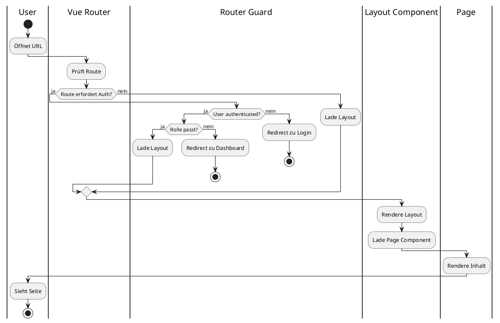

---

### 3.1 📐 `/layouts`

**Layouts definieren die Seitenstruktur:**

```
/layouts
├── MainLayout.vue
├── AuthLayout.vue
├── DashboardLayout.vue
├── AdminLayout.vue
└── OrganizationLayout.vue
```

#### 📄 Beispiel: `DashboardLayout.vue`

```vue
<template>
  <div class="dashboard-layout">
    <Header />
    <Sidebar />
    <main class="content">
      <router-view />
    </main>
    <Footer />
  </div>
</template>

<script setup>
import Header from '@/components/Header.vue'
import Sidebar from '@/components/Sidebar.vue'
import Footer from '@/components/Footer.vue'
</script>
```

---

## 4. Pages (Routen)

### 📄 `/pages` Struktur

```
/pages
├── /auth
│   ├── Login.vue
│   ├── Register.vue
│   └── ForgotPassword.vue
├── /dashboard
│   ├── Index.vue
│   ├── Settings.vue
│   ├── Notifications.vue
│   └── LayoutManager.vue
├── ProfilePage.vue
├── SettingsPage.vue
├── /courses
│   ├── CourseList.vue
│   ├── CourseView.vue
│   ├── CourseModules.vue
│   ├── ModuleView.vue
│   ├── MethodView.vue
│   └── ExamView.vue
├── /creator
│   ├── CreatorDashboard.vue
│   ├── CourseEditor.vue
│   ├── ModuleEditor.vue
│   ├── MethodEditor.vue
│   └── Publish.vue
├── /community
│   ├── CommunityHome.vue
│   ├── CourseView.vue
│   └── CreatorProfile.vue
├── /org
│   ├── OrgDashboard.vue
│   ├── Classes.vue
│   ├── Members.vue
│   ├── Billing.vue
│   └── TokenPool.vue
└── /admin
    ├── AdminDashboard.vue
    ├── UserManagement.vue
    ├── Logs.vue
    ├── WidgetRegistry.vue
    └── RoleManagement.vue
```

---

## 5. Router

### 🛣️ Vue Router Konfiguration

#### 5.1 📂 `/router/index.js`

```javascript
import { createRouter, createWebHistory } from 'vue-router'
import { useUserStore } from '@/store/user'

const routes = [
  {
    path: '/',
    component: () => import('@/layouts/MainLayout.vue'),
    children: [
      {
        path: '',
        name: 'Home',
        component: () => import('@/pages/Home.vue')
      }
    ]
  },
  {
    path: '/auth',
    component: () => import('@/layouts/AuthLayout.vue'),
    children: [
      {
        path: 'login',
        name: 'Login',
        component: () => import('@/pages/auth/Login.vue')
      },
      {
        path: 'register',
        name: 'Register',
        component: () => import('@/pages/auth/Register.vue')
      }
    ]
  },
  {
    path: '/dashboard',
    component: () => import('@/layouts/DashboardLayout.vue'),
    meta: { requiresAuth: true },
    children: [
      {
        path: '',
        name: 'Dashboard',
        component: () => import('@/pages/dashboard/Index.vue')
      }
    ]
  },
  {
    path: '/admin',
    component: () => import('@/layouts/AdminLayout.vue'),
    meta: { requiresAuth: true, role: 'admin' },
    children: [
      {
        path: '',
        name: 'AdminDashboard',
        component: () => import('@/pages/admin/AdminDashboard.vue')
      }
    ]
  }
]

const router = createRouter({
  history: createWebHistory(),
  routes
})

// Route Guards
router.beforeEach((to, from, next) => {
  const userStore = useUserStore()
  
  if (to.meta.requiresAuth && !userStore.isAuthenticated) {
    next('/auth/login')
  } else if (to.meta.role && userStore.role !== to.meta.role) {
    next('/dashboard')
  } else {
    next()
  }
})

export default router
```

---

## 6. State Management (Pinia)

### 📦 Store-Architektur

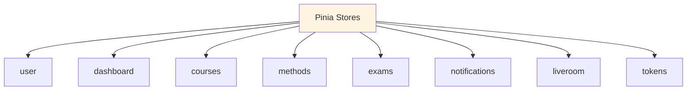

---

### 6.1 🗂️ `/store` Struktur

```
/store
├── user.js
├── dashboard.js
├── courses.js
├── methods.js
├── exams.js
├── notifications.js
├── liveroom.js
├── tokens.js
└── theme.store.ts
```

---

### 📝 Beispiel: `user.js`

```javascript
import { defineStore } from 'pinia'
import * as userService from '@/services/userService'

export const useUserStore = defineStore('user', {
  state: () => ({
    user: null,
    role: null,
    token: null,
    isAuthenticated: false
  }),
  
  getters: {
    fullName: (state) => {
      if (!state.user) return ''
      return `${state.user.firstname} ${state.user.lastname}`
    },
    
    isPremium: (state) => {
      return state.role === 'premium' || state.role === 'creator'
    }
  },
  
  actions: {
    async login(email, password) {
      try {
        const res = await userService.login(email, password)
        this.token = res.data.access_token
        this.user = res.data.user
        this.role = res.data.user.role
        this.isAuthenticated = true
        
        // Store token
        localStorage.setItem('access_token', this.token)
      } catch (error) {
        throw error
      }
    },
    
    async logout() {
      this.user = null
      this.token = null
      this.role = null
      this.isAuthenticated = false
      localStorage.removeItem('access_token')
    },
    
    async fetchProfile() {
      const res = await userService.getProfile()
      this.user = res.data
      this.role = res.data.role
    }
  }
})
```

### 📊 User Store State Diagram

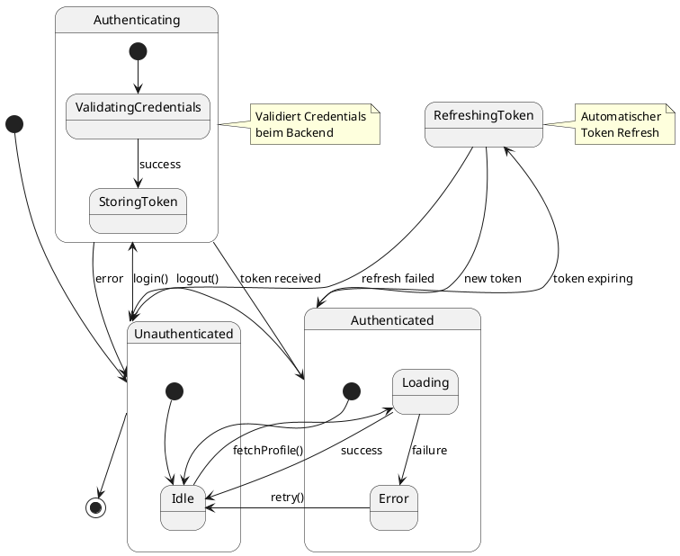

---

### 6.2 🎨 Theme Store (Dark/Light Mode)

**Phase B24 - Theme Support**

Der Theme Store verwaltet das globale Theme-System mit Dark Midnight (Standard), Light und System-Modi.

#### Theme-Architektur

```plantuml
@startuml
package "Theme System" {
  component ThemeStore {
    [themePreference]
    [systemTheme]
    [effectiveTheme]
  }

  component "DOM" {
    [<html class="dark">]
  }

  component "CSS Variables" {
    [:root]
    [.dark]
  }
}

component "API" {
  [GET /profile/theme]
  [PATCH /profile/theme]
}

component "OS" {
  [prefers-color-scheme]
}

ThemeStore --> [<html class="dark">] : "applyTheme()"
ThemeStore --> [GET /profile/theme] : "load on login"
ThemeStore --> [PATCH /profile/theme] : "save preference"
[prefers-color-scheme] --> ThemeStore : "system theme change"
[<html class="dark">] --> CSS Variables : "activates"

note right of ThemeStore
  Verwaltet Theme-Präferenz
  und wendet sie auf DOM an
end note
@enduml
```

#### Store-Implementierung

**Datei:** `frontend/src/store/theme.store.ts`

**State:**
- `themePreference`: User-Präferenz ('system' | 'light' | 'dark')
- `systemTheme`: Erkanntes OS-Theme ('light' | 'dark')
- `effectiveTheme`: Aktuell angewendetes Theme ('light' | 'dark')
- `isReady`: Theme-Initialisierung abgeschlossen
- `isUpdating`: Theme wird gerade aktualisiert

**Actions:**
- `initTheme()`: Initialisiert Theme-System (lädt von API, erkennt OS-Theme)
- `setThemePreference(theme)`: Setzt neue Theme-Präferenz (mit API-Sync)
- `detectSystemTheme()`: Erkennt OS-Theme via matchMedia
- `applyTheme()`: Wendet effektives Theme auf DOM an (add/remove 'dark' class)
- `setupSystemThemeListener()`: Registriert MediaQuery-Listener für OS-Änderungen

**Getters:**
- `isDarkMode`: computed, gibt `true` zurück wenn effectiveTheme === 'dark'

#### Theme-Anwendung

**CSS-Variablen in `style.css`:**

```css
:root {
  /* Light Theme */
  --color-bg: #f5f5f7;
  --color-surface: #ffffff;
  --color-text-primary: #111827;
  /* ... */
}

.dark {
  /* Dark Midnight Theme */
  --color-bg: #050814;
  --color-surface: #0b1020;
  --color-text-primary: #e5e7eb;
  /* ... */
}
```

**TailwindCSS Dark Mode:**

```javascript
// tailwind.config.js
export default {
  darkMode: 'class', // Class-basierter Dark Mode
  // ...
}
```

**Komponenten nutzen automatisch dark: Varianten:**

```vue
<template>
  <div class="bg-white dark:bg-gray-900">
    <h1 class="text-gray-900 dark:text-gray-100">Titel</h1>
  </div>
</template>
```

#### Theme-Initialisierung in main.ts

```typescript
import { useThemeStore } from './store/theme.store'

;(async () => {
  const app = createApp(App)
  const pinia = createPinia()
  app.use(pinia)

  // Theme vor App-Mount initialisieren (verhindert FOUC)
  const themeStore = useThemeStore()
  await themeStore.initTheme()

  app.use(router)
  app.mount('#app')
})()
```

#### API-Integration

**Backend-Endpoints:**
- `GET /api/v1/profile/theme` - Theme-Präferenz laden
- `PATCH /api/v1/profile/theme` - Theme-Präferenz speichern

**Frontend API Service (`api/profile.api.ts`):**

```typescript
export interface ThemePreferenceResponse {
  theme: 'system' | 'light' | 'dark'
}

export const getThemePreference = async (): Promise<ThemePreferenceResponse>
export const updateThemePreference = async (data: UpdateThemePreferenceRequest): Promise<ThemePreferenceResponse>
```

#### Fehlerbehandlung

- **API-Fehler beim Laden:** Fallback zu 'dark' (Default)
- **API-Fehler beim Speichern:** Optimistic Update mit Rollback
- **Keine Authentifizierung:** Verwendet 'dark' als Default
- **Browser ohne matchMedia:** SSR-Fallback zu 'dark'

#### Theme-Wechsel-Ablauf

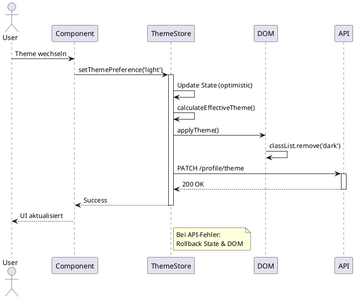

---

### 6.3 ⚙️ Settings Page (User Theme Preferences)

**Phase B24 - Theme Settings UI**

Die Settings-Seite ermöglicht Benutzern die Verwaltung ihrer UI-Präferenzen, insbesondere des Themes.

#### Seiten-Struktur

**Datei:** `frontend/src/pages/SettingsPage.vue`

**Route:** `/settings` (nur für authentifizierte Benutzer)

**Features:**
- Theme-Auswahl mit 3 Optionen (System, Hell, Dunkel)
- Live-Vorschau (sofortige Anwendung)
- Automatische Speicherung via API
- Erfolgs-/Fehlermeldungen
- Responsive Grid-Layout
- Dark Mode Support

#### UI-Komponenten

**Theme-Auswahl Buttons:**

```vue
<template>
  <div class="grid grid-cols-1 sm:grid-cols-3 gap-3">
    <!-- System Theme Button -->
    <button @click="selectTheme('system')">
      <div class="text-3xl">🖥️</div>
      <div class="font-semibold">System</div>
      <div class="text-xs">Folgt deinem Betriebssystem</div>
    </button>

    <!-- Light Theme Button -->
    <button @click="selectTheme('light')">
      <div class="text-3xl">☀️</div>
      <div class="font-semibold">Hell</div>
      <div class="text-xs">Heller Modus</div>
    </button>

    <!-- Dark Theme Button -->
    <button @click="selectTheme('dark')">
      <div class="text-3xl">🌙</div>
      <div class="font-semibold">Dunkel</div>
      <div class="text-xs">Dark Midnight</div>
    </button>
  </div>
</template>
```

**Features:**
- Aktives Theme wird visuell hervorgehoben (Border + Checkmark)
- Hover-States für bessere UX
- Disabled-State während Speichervorgang
- Responsive Grid (1 Spalte mobil, 3 Spalten Desktop)

#### Integration mit Theme Store

```typescript
import { useThemeStore } from '@/store/theme.store'

const themeStore = useThemeStore()

const selectTheme = async (theme: ThemePreference) => {
  try {
    // Optimistic update + API call
    await themeStore.setThemePreference(theme)

    // Show success message
    saveSuccess.value = true
  } catch (err) {
    // Handle error, rollback already done by store
    saveError.value = err.message
  }
}
```

#### Sidebar-Navigation

**Datei:** `frontend/src/layouts/BaseLayout.vue`

Der Einstellungen-Link wurde zur Sidebar hinzugefügt:

```vue
<router-link
  to="/settings"
  class="block px-4 py-2 rounded-lg hover:bg-gray-100 dark:hover:bg-gray-800"
  active-class="bg-primary-100 text-primary-700 dark:bg-primary-900 dark:text-primary-100"
>
  ⚙️ Einstellungen
</router-link>
```

**Position:** Nach "Profil", vor "Admin Panel"

**Sichtbarkeit:** Alle authentifizierten Benutzer

#### Dark Mode Support in BaseLayout

Das BaseLayout wurde um vollständigen Dark Mode Support erweitert:

**Header:**
```vue
<header class="bg-white dark:bg-gray-900 border-b border-gray-200 dark:border-gray-800">
```

**Sidebar:**
```vue
<aside class="bg-white dark:bg-gray-900 border-r border-gray-200 dark:border-gray-800">
```

**Navigation Links:**
```vue
<router-link
  class="text-gray-700 dark:text-gray-200 hover:bg-gray-100 dark:hover:bg-gray-800"
  active-class="bg-primary-100 dark:bg-primary-900 text-primary-700 dark:text-primary-100"
>
```

#### User Flow

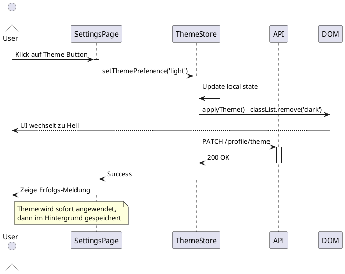

#### Error Handling

**Optimistic Update mit Rollback:**
- UI ändert sich sofort beim Klick
- Falls API-Call fehlschlägt: Automatischer Rollback zum vorherigen Theme
- Fehlermeldung wird angezeigt
- Benutzer kann erneut versuchen zu speichern

**Beispiel Fehlermeldung:**
```vue
<div class="bg-red-50 border border-red-200 text-red-700 px-4 py-3 rounded">
  Theme-Speicherung fehlgeschlagen. Bitte versuche es erneut.
</div>
```

#### Zukünftige Erweiterungen

Die SettingsPage ist erweiterbar für weitere Einstellungen:
- Sprache / Language
- Benachrichtigungen
- ADHD/Fokus-Modus
- Barrierefreiheit
- Datenschutz-Präferenzen

**Struktur ermöglicht einfaches Hinzufügen neuer Card-Sektionen:**

```vue
<Card title="Benachrichtigungen">
  <!-- Notification settings -->
</Card>

<Card title="Sprache">
  <!-- Language selection -->
</Card>
```

---

## 7. Services (API Layer)

### 🔌 Service-Architektur (Component Diagram)

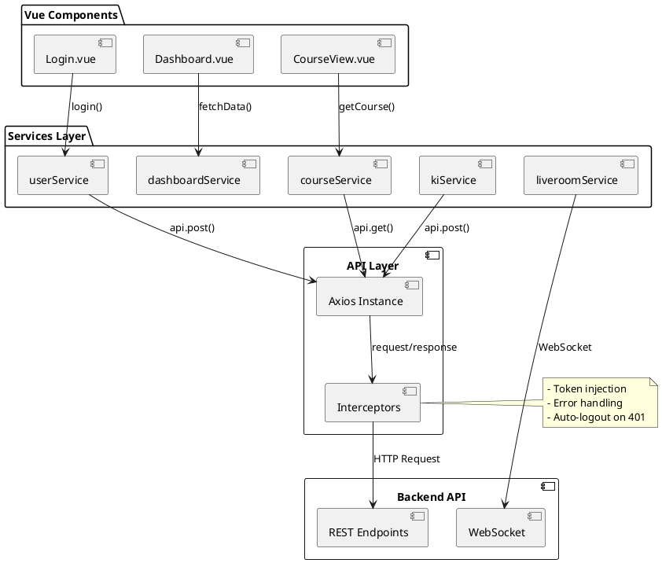

### 🔄 API Call Flow (Sequence Diagram)

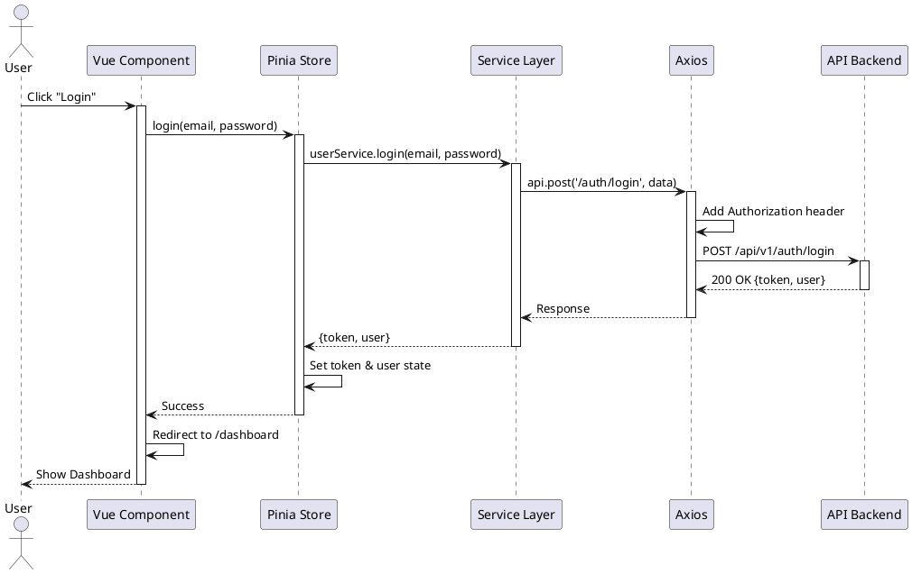

---

### 7.1 🛠️ `/api` Struktur (TypeScript)

```
/api
├── http.ts                    # Axios Instance + Interceptors
├── auth.api.ts                # Authentication
├── courses.api.ts             # Courses
├── dashboard.api.ts           # Dashboard
├── profile.api.ts             # User Profile
├── tutor.api.ts               # AI Tutor
├── admin.api.ts               # 🔄 Re-exports from admin/
│
└── /admin                     # 🆕 Admin API Module (14 files)
    ├── index.ts               # Re-exports
    ├── types.ts               # TypeScript Interfaces (750+ LOC)
    ├── users.api.ts           # User Management
    ├── organisations.api.ts   # Organisation Management
    ├── courses.api.ts         # Course CRUD
    ├── chapters.api.ts        # Chapter & Category
    ├── lessons.api.ts         # Lesson Management
    ├── analytics.api.ts       # System Analytics, Billing
    ├── ai-jobs.api.ts         # AI Job Management
    ├── exams.api.ts           # Exam Management
    ├── prompts.api.ts         # Course Prompts
    ├── files.api.ts           # Course Files
    ├── ai-models.api.ts       # AI Model Management
    ├── learning-methods.api.ts # Learning Methods
    └── lm-routing.api.ts      # LM Model Routing
```

> **Refactored (2025-12-29):** admin.api.ts (3024 LOC) → 14 focused modules

---

### 📡 Beispiel: `api.js` (Axios Wrapper)

```javascript
import axios from 'axios'
import { useUserStore } from '@/store/user'

const api = axios.create({
  baseURL: import.meta.env.VITE_API_URL || '/api/v1',
  headers: {
    'Content-Type': 'application/json'
  }
})

// Request Interceptor
api.interceptors.request.use(
  (config) => {
    const userStore = useUserStore()
    if (userStore.token) {
      config.headers.Authorization = `Bearer ${userStore.token}`
    }
    return config
  },
  (error) => {
    return Promise.reject(error)
  }
)

// Response Interceptor
api.interceptors.response.use(
  (response) => response,
  async (error) => {
    if (error.response?.status === 401) {
      const userStore = useUserStore()
      await userStore.logout()
      window.location.href = '/auth/login'
    }
    return Promise.reject(error)
  }
)

export default api
```

---

### 📝 Beispiel: `courseService.js`

```javascript
import api from './api'

export const getCourses = (params) => {
  return api.get('/courses', { params })
}

export const getCourseById = (id) => {
  return api.get(`/courses/${id}`)
}

export const createCourse = (data) => {
  return api.post('/courses', data)
}

export const updateCourse = (id, data) => {
  return api.patch(`/courses/${id}`, data)
}

export const publishCourse = (id) => {
  return api.post(`/courses/${id}/publish`)
}
```

---

## 8. Widgets

### 🧩 Widget-System (Component Diagram)

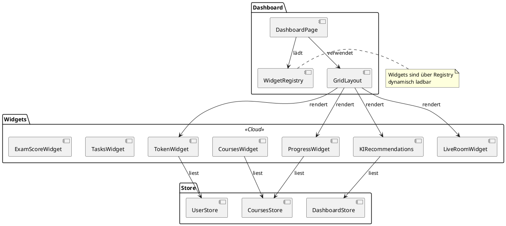

---

### 8.1 🎨 `/widgets` Struktur

```
/widgets
├── ProgressWidget.vue
├── ExamScoreWidget.vue
├── CoursesWidget.vue
├── KIRecommendations.vue
├── TokenWidget.vue
├── TasksWidget.vue
├── CalendarWidget.vue
├── LiveRoomWidget.vue
├── GroupsWidget.vue
├── LibraryWidget.vue
├── TheoryWidget.vue
├── ExamSimWidget.vue
└── KIQuickPanel.vue
```

> Widgets sind über **Registry dynamisch ladbar**.

---

### 💡 Beispiel: `ProgressWidget.vue`

```vue
<template>
  <Card class="progress-widget">
    <h3>{{ $t('widgets.progress.title') }}</h3>
    <div class="progress-data">
      <ProgressBar :value="progress" />
      <p>{{ progress }}% {{ $t('widgets.progress.complete') }}</p>
      <div class="stats">
        <span>{{ activeCourses }} {{ $t('widgets.progress.active') }}</span>
        <span>{{ completedModules }} / {{ totalModules }} {{ $t('widgets.progress.modules') }}</span>
      </div>
    </div>
  </Card>
</template>

<script setup>
import { ref, onMounted } from 'vue'
import { useCoursesStore } from '@/store/courses'

const coursesStore = useCoursesStore()
const progress = ref(0)
const activeCourses = ref(0)
const completedModules = ref(0)
const totalModules = ref(0)

onMounted(async () => {
  await coursesStore.fetchProgress()
  progress.value = coursesStore.overallProgress
  activeCourses.value = coursesStore.activeCourses
  completedModules.value = coursesStore.completedModules
  totalModules.value = coursesStore.totalModules
})
</script>
```

---

## 9. Module-Editor & Methoden-Editor

### 🎓 Editor-System

```
/modules
├── TheoryEditor.vue
├── FlashcardEditor.vue
├── QuizEditor.vue
├── MatchingEditor.vue
├── TimelineEditor.vue
├── CaseStudyEditor.vue
├── ProblemSolvingEditor.vue
├── StoryEditor.vue
├── WhiteboardAnalysis.vue
└── ExamGenerator.vue
```

> Für jede der **12 Content-Lernmethoden (Gruppen A-C)** existiert ein spezialisierter Editor.

---

### 💡 Beispiel: `QuizEditor.vue`

```vue
<template>
  <div class="quiz-editor">
    <h2>{{ $t('editor.quiz.title') }}</h2>
    
    <div v-for="(question, index) in questions" :key="index" class="question-block">
      <Input 
        v-model="question.q" 
        :label="$t('editor.quiz.question')" 
      />
      
      <div class="answers">
        <div v-for="(answer, aIndex) in question.a" :key="aIndex">
          <Input 
            v-model="question.a[aIndex]" 
            :label="`${$t('editor.quiz.answer')} ${aIndex + 1}`" 
          />
          <input 
            type="checkbox" 
            v-model="question.correct" 
            :value="aIndex"
          />
        </div>
      </div>
      
      <Button @click="addAnswer(index)">
        {{ $t('editor.quiz.addAnswer') }}
      </Button>
    </div>
    
    <Button @click="addQuestion">
      {{ $t('editor.quiz.addQuestion') }}
    </Button>
    
    <Button variant="primary" @click="save">
      {{ $t('common.save') }}
    </Button>
  </div>
</template>

<script setup>
import { ref } from 'vue'
import * as methodService from '@/services/methodService'

const questions = ref([
  {
    q: '',
    a: ['', '', ''],
    correct: []
  }
])

const addQuestion = () => {
  questions.value.push({
    q: '',
    a: ['', '', ''],
    correct: []
  })
}

const addAnswer = (qIndex) => {
  questions.value[qIndex].a.push('')
}

const save = async () => {
  const data = {
    method_type: 2, // Quiz
    data: { questions: questions.value }
  }
  await methodService.createMethod(data)
}
</script>
```

---

## 10. LiveRoom-Frontend

### 🎥 LiveRoom-Komponenten (Component Diagram)

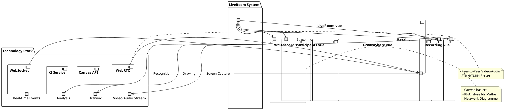

### 🔄 LiveRoom Session Flow (Activity Diagram)

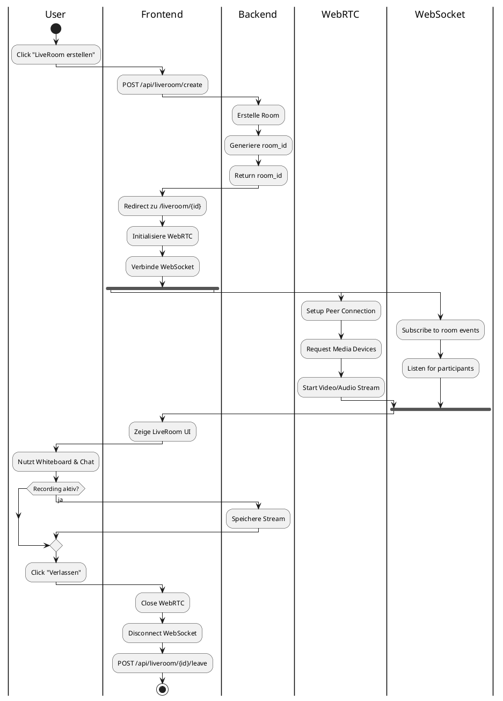

---

### 10.1 📂 `/liveroom` Struktur

```
/liveroom
├── LiveRoom.vue
├── Whiteboard.vue
├── Participants.vue
├── Chat.vue
├── ScreenShare.vue
├── Recording.vue
├── Breakouts.vue
└── ResourceShare.vue
```

**Diese Komponenten nutzen:**

- 🎥 **WebRTC** - Video/Audio Streaming
- 🔌 **WebSockets** - Real-time Communication
- 🎨 **Canvas-Whiteboard** - Zeichenfunktionen
- 🤖 **KI-Analyse** - Whiteboard-Erkennung

---

## 11. Internationalisierung

### 🌍 i18n-System (Component Diagram)

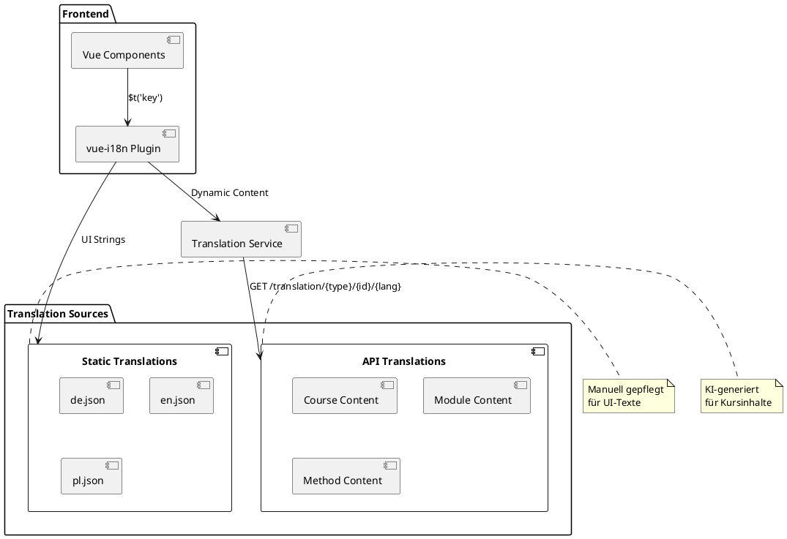

---

### 11.1 🗂️ `/i18n` Struktur

```
/i18n
├── index.js
├── de.json
├── en.json
└── pl.json
```

---

### 📝 Beispiel: `de.json`

```json
{
  "login": {
    "title": "Anmelden",
    "email": "E-Mail",
    "password": "Passwort",
    "submit": "Anmelden",
    "forgot": "Passwort vergessen?",
    "register": "Noch kein Konto? Registrieren"
  },
  "dashboard": {
    "title": "Dashboard",
    "welcome": "Willkommen zurück",
    "progress": "Dein Fortschritt",
    "courses": "Meine Kurse"
  },
  "widgets": {
    "progress": {
      "title": "Lernfortschritt",
      "complete": "abgeschlossen",
      "active": "aktive Kurse",
      "modules": "Module"
    }
  }
}
```

---

### ⚙️ i18n Setup (`/i18n/index.js`)

```javascript
import { createI18n } from 'vue-i18n'
import de from './de.json'
import en from './en.json'
import pl from './pl.json'

const i18n = createI18n({
  locale: localStorage.getItem('language') || 'de',
  fallbackLocale: 'en',
  messages: {
    de,
    en,
    pl
  }
})

export default i18n
```

> **Kursübersetzungen** kommen dynamisch aus der API via Translation-Service.

---

## 12. Styles & UI

### 🎨 Dark Mode Theme Variables (Phase B24)

**WICHTIG:** Alle Komponenten verwenden CSS-Variablen statt hard-coded Tailwind-Farben für konsistente Dark Mode Unterstützung.

**KRITISCH:** Theme wird AUSSCHLIESSLICH über CSS-Variablen gesteuert. NIEMALS CSS-Variablen mit Tailwind `dark:` Modifikatoren mischen, da dies zu visuellen Inkonsistenzen im Light Mode führt.

#### CSS-Variablen Definition

**Datei:** `frontend/src/style.css`

```css
:root {
  /* Light Theme (Default) */
  --color-bg: #f5f5f7;
  --color-surface: #ffffff;
  --color-surface-secondary: #f9fafb;
  --color-text-primary: #111827;
  --color-text-secondary: #4b5563;
  --color-text-tertiary: #6b7280;
  --color-border: #e5e7eb;
  --color-border-strong: #d1d5db;
  --color-accent: #4f46e5;
  --color-accent-hover: #4338ca;
  --color-success: #10b981;
  --color-warning: #f59e0b;
  --color-error: #ef4444;
  --color-info: #3b82f6;
}

.dark {
  /* Dark Midnight Theme */
  --color-bg: #050814;
  --color-surface: #0b1020;
  --color-surface-secondary: #111827;
  --color-text-primary: #e5e7eb;
  --color-text-secondary: #9ca3af;
  --color-text-tertiary: #6b7280;
  --color-border: #1f2937;
  --color-border-strong: #374151;
  --color-accent: #6366f1;
  --color-accent-hover: #818cf8;
  --color-success: #34d399;
  --color-warning: #fbbf24;
  --color-error: #f87171;
  --color-info: #60a5fa;
}
```

#### Refactoring Guidelines für Komponenten

**REGEL:** Ersetze alle hard-coded Tailwind-Farben durch CSS-Variablen.

**WICHTIG - Theme-Strategie:**
- ✅ **Richtig:** Ausschließlich CSS-Variablen verwenden (z.B. `bg-[var(--color-bg)]`)
- ❌ **Falsch:** CSS-Variablen mit `dark:` Modifikatoren mischen (z.B. `bg-[var(--color-bg)] dark:bg-gray-900`)
- **Grund:** Mischung führt im Light Mode zu inkorrekten Farben, da `dark:` Modifier die Variablen überschreibt

**Layout-Strategie:**
- **Outer Layouts** (BaseLayout, AdminLayout): IMMER `bg-[var(--color-bg)]` verwenden
- **Surface Elements** (Cards, Panels, Sidebar, Header): IMMER `bg-[var(--color-surface)]` verwenden
- **Borders**: IMMER `border-[var(--color-border)]` verwenden

**Mapping:**

| Hard-coded Tailwind | CSS-Variable | Anwendung |
|---------------------|--------------|-----------|
| `text-gray-900` | `text-[var(--color-text-primary)]` | Haupttext, Überschriften |
| `text-gray-800` | `text-[var(--color-text-primary)]` | Haupttext |
| `text-gray-600` | `text-[var(--color-text-secondary)]` | Sekundärtext, Labels |
| `text-gray-500` | `text-[var(--color-text-secondary)]` | Sekundärtext |
| `bg-white` | `bg-[var(--color-surface)]` | Karten, Panels |
| `bg-gray-50` | `bg-[var(--color-bg)]` | Hintergründe |
| `border-gray-200` | `border-[var(--color-border)]` | Standardränder |
| `border-gray-300` | `border-[var(--color-border)]` | Standardränder |

**Beispiel-Refactoring:**

**Vorher (Hard-coded):**
```vue
<h1 class="text-gray-900">Überschrift</h1>
<p class="text-gray-600">Beschreibung</p>
<div class="bg-white border border-gray-200">
  <!-- Content -->
</div>
```

**Nachher (CSS-Variablen):**
```vue
<h1 class="text-[var(--color-text-primary)]">Überschrift</h1>
<p class="text-[var(--color-text-secondary)]">Beschreibung</p>
<div class="bg-[var(--color-surface)] border border-[var(--color-border)]">
  <!-- Content -->
</div>
```

**Anti-Pattern (VERMEIDEN):**
```vue
<!-- ❌ FALSCH: Mischung von Variablen und dark: Modifikatoren -->
<div class="bg-gray-50 dark:bg-gray-950">
  <!-- Problem: Im Light Mode wird bg-gray-50 angezeigt (nicht #f5f5f7 aus --color-bg) -->
  <!-- Problem: Im Dark Mode wird bg-gray-950 angezeigt (nicht #050814 aus --color-bg) -->
  <!-- Lösung: bg-[var(--color-bg)] verwenden -->
</div>

<!-- ✅ RICHTIG: Nur CSS-Variablen -->
<div class="bg-[var(--color-bg)]">
  <!-- Light Mode: #f5f5f7, Dark Mode: #050814 -->
</div>
```

**Ausnahmen:**
- Accent-Farben: `primary-*`, `secondary-*` (bereits theme-aware via Tailwind config)
- Status-Farben: `green-*`, `red-*`, `yellow-*`, `blue-*` (semantisch korrekt, theme-agnostic)

#### Dashboard Header Ownership (Phase B24 Bugfix)

**Problem:** Doppelte Begrüßungstexte zwischen DashboardPage und WelcomeWidget

**Lösung:**

**DashboardPage.vue** - Verantwortlich für globalen Header:
```vue
<h1 class="text-3xl font-bold text-[var(--color-text-primary)] mb-2">
  Willkommen zurück, {{ authStore.user?.first_name }}! 👋
</h1>
<p class="text-[var(--color-text-secondary)]">
  Schön, dass du wieder da bist. Hier ist deine Übersicht.
</p>
```

**WelcomeWidget.vue** - Umbenannt zu "Schnellübersicht", nur Stats:
- ❌ NICHT: Begrüßungstext duplizieren
- ❌ NICHT: "Willkommen zurück" oder ähnliche Texte
- ✅ NUR: Quick Stats anzeigen (Rolle, Plan, Tokens, Kurse)
- ✅ Widget-Titel: "Schnellübersicht"

**Regel:**
- **Header-Texte** (Begrüßungen, Seitentitel, Beschreibungen) gehören auf die **Page-Ebene**
- **Widgets** zeigen NUR **Daten und Statistiken**, KEINE narrativen Texte
- **Kontext**: Der User sieht bereits die Begrüßung im Page-Header, Widgets müssen diese nicht wiederholen

---

### 🎨 TailwindCSS Konfiguration

#### 12.1 📄 `tailwind.config.js`

```javascript
module.exports = {
  darkMode: 'class', // Class-based dark mode (Phase B24 - Theme Support)
  content: [
    "./index.html",
    "./src/**/*.{vue,js,ts,jsx,tsx}",
  ],
  theme: {
    extend: {
      colors: {
        primary: {
          50: '#f0f9ff',
          100: '#e0f2fe',
          500: '#0ea5e9',
          600: '#0284c7',
          700: '#0369a1'
        },
        secondary: {
          500: '#8b5cf6',
          600: '#7c3aed'
        }
      },
      fontFamily: {
        sans: ['Inter', 'system-ui', 'sans-serif']
      }
    },
  },
  plugins: []
}
```

---

### 🎨 Design-Prinzipien

| Prinzip | Umsetzung |
|---------|-----------|
| 🎨 **Ruhige Farben** | Gedämpfte Palette |
| 📏 **Klare Abgrenzungen** | Whitespace & Borders |
| ♿ **Barrierefreiheit** | WCAG 2.1 AA |
| 🌙 **Dark Mode** | Theme-Toggle |
| 🧠 **ADHD-konform** | Reduzierte Animationen |

---

### 🧠 ADHD/ADHS-Theme

```css
/* ADHD-optimiertes Theme */
.adhd-mode {
  --animation-speed: 0s;
  --focus-highlight: 3px solid #0ea5e9;
  --spacing: 2rem;
}

.adhd-mode * {
  animation-duration: 0s !important;
  transition-duration: 0s !important;
}

.adhd-mode .widget {
  margin: var(--spacing);
  border: 2px solid #e5e7eb;
}
```

---

### 🔍 12.3 Theme Compliance Audit (Phase B24 Fix - Final)

**Status:** LSX Theme System wurde vollständig auf reine CSS-Variablen umgestellt.

#### ✅ Bereits refactored (Theme-compliant)

Die folgenden Komponenten und Seiten wurden vollständig auf CSS-Variablen umgestellt:

**Core Layouts:**
- `BaseLayout.vue` ✅
- `AdminLayout.vue` ✅
- `AuthLayout.vue` ⚠️ (teilweise)

**UI-Komponenten:**
- `Card.vue` ✅
- `Button.vue` ✅ (CSS in style.css)
- `Input.vue` ✅

**Seiten:**
- `DashboardPage.vue` ✅
- `ProfilePage.vue` ✅
- `SettingsPage.vue` ✅
- `LoginPage.vue` ✅
- `WelcomeWidget.vue` ✅
- `DashboardWidgetsArea.vue` ✅

**CSS-Klassen (style.css):**
- `body` ✅
- `.btn-outline` ✅
- `.input-field` ✅
- `.card` ✅
- `.card-header` ✅

#### ⚠️ Noch zu refactoren (52 Dateien)

**Admin Pages:**
- `AdminDashboardPage.vue`
- `AdminUsersPage.vue`
- `AdminUserDetailPage.vue`
- `AdminAuditLogsPage.vue`
- `AdminCoursesPage.vue`
- `AdminOrganisationsPage.vue`
- `AdminBillingPage.vue`
- `AdminAnalyticsPage.vue`

**Setup Wizard:**
- `SetupWizardPage.vue`
- `SetupLayout.vue`
- Alle Setup-Step-Komponenten (8 Dateien)

**Organisation Pages:**
- `OrgDashboardPage.vue`
- `OrgUsersPage.vue`
- `OrgCoursesPage.vue`
- `OrgSettingsPage.vue`
- `OrgAnalyticsPage.vue`

**Creator Pages:**
- `CreatorCoursesPage.vue`
- `CourseEditorPage.vue`
- Editor-Komponenten (3 Dateien)

**Lesson Player:**
- `LessonPlayerPage.vue`
- Lesson-Komponenten (7 Dateien)
- Quiz-Komponenten (4 Dateien)

**Dashboard Widgets:**
- `ProfileSummaryWidget.vue`
- `PlanTokensWidget.vue`
- `EnrolledCoursesWidget.vue`
- `CoursesProgressWidget.vue`
- `OrgOverviewWidget.vue`
- `WidgetConfigPanel.vue`

**Sonstige:**
- `RegisterPage.vue`
- `CoursesPage.vue`
- `CourseOverviewPage.vue`
- `NotFoundPage.vue`
- `AnalyticsKpiCard.vue`

#### 🚫 Verbotene Klassen (Theme-Breaking)

Diese Tailwind-Klassen dürfen **NICHT mehr** verwendet werden:

| Kategorie | Verbotene Klassen | Grund |
|-----------|-------------------|-------|
| **Text-Farben** | `text-gray-900`, `text-gray-800`, `text-gray-700`, `text-gray-600`, `text-gray-500`, `text-gray-400` | Hard-coded, nicht theme-aware |
| **Hintergründe** | `bg-white`, `bg-gray-50`, `bg-gray-100`, `bg-gray-200`, `bg-gray-800`, `bg-gray-900`, `bg-gray-950` | Hard-coded, nicht theme-aware |
| **Borders** | `border-gray-200`, `border-gray-300`, `border-gray-400`, `border-gray-600`, `border-gray-700` | Hard-coded, nicht theme-aware |
| **Shadows** | `shadow-md`, `shadow-lg`, `shadow-xl` MIT `dark:shadow-*` | Mischung problematisch |
| **dark: Modifikatoren** | `dark:bg-*`, `dark:text-*`, `dark:border-*`, `dark:hover:*` | Verhindert reine CSS-Variable-Logik |

#### ✅ Erlaubte CSS-Variablen (Theme-Safe)

**Alle Farben MÜSSEN über CSS-Variablen definiert werden:**

| Variable | Verwendung | Light Mode | Dark Mode |
|----------|------------|------------|-----------|
| `--color-bg` | Seiten-Hintergrund, Outer Layouts | `#f5f5f7` | `#050814` |
| `--color-surface` | Cards, Panels, Sidebar, Header | `#ffffff` | `#0b1020` |
| `--color-surface-secondary` | Hover, Info-Boxen | `#f9fafb` | `#111827` |
| `--color-text-primary` | Überschriften, Haupttext | `#111827` | `#e5e7eb` |
| `--color-text-secondary` | Labels, Sekundärtext | `#4b5563` | `#9ca3af` |
| `--color-text-tertiary` | Hints, Tertiary Text | `#6b7280` | `#6b7280` |
| `--color-border` | Standardränder | `#e5e7eb` | `#1f2937` |
| `--color-border-strong` | Betonte Ränder | `#d1d5db` | `#374151` |

**Verwendung in Templates:**
```vue
<!-- ✅ RICHTIG -->
<div class="bg-[var(--color-surface)] border border-[var(--color-border)]">
  <h2 class="text-[var(--color-text-primary)]">Titel</h2>
  <p class="text-[var(--color-text-secondary)]">Beschreibung</p>
</div>

<!-- ❌ FALSCH -->
<div class="bg-white dark:bg-gray-900 border border-gray-200 dark:border-gray-700">
  <h2 class="text-gray-900 dark:text-gray-100">Titel</h2>
  <p class="text-gray-600 dark:text-gray-400">Beschreibung</p>
</div>
```

#### 📝 Refactoring-Guidelines für neue Komponenten

**1. Text-Farben ersetzen:**
```vue
<!-- Vorher -->
<h1 class="text-gray-900">Überschrift</h1>
<p class="text-gray-600">Text</p>
<span class="text-gray-500">Hint</span>

<!-- Nachher -->
<h1 class="text-[var(--color-text-primary)]">Überschrift</h1>
<p class="text-[var(--color-text-secondary)]">Text</p>
<span class="text-[var(--color-text-tertiary)]">Hint</span>
```

**2. Hintergründe ersetzen:**
```vue
<!-- Vorher -->
<div class="bg-white">Card</div>
<div class="bg-gray-50">Page</div>
<div class="bg-gray-100">Info Box</div>

<!-- Nachher -->
<div class="bg-[var(--color-surface)]">Card</div>
<div class="bg-[var(--color-bg)]">Page</div>
<div class="bg-[var(--color-surface-secondary)]">Info Box</div>
```

**3. Borders ersetzen:**
```vue
<!-- Vorher -->
<div class="border border-gray-200">Content</div>

<!-- Nachher -->
<div class="border border-[var(--color-border)]">Content</div>
```

**4. dark: Modifikatoren entfernen:**
```vue
<!-- Vorher -->
<button class="bg-white dark:bg-gray-800 hover:bg-gray-50 dark:hover:bg-gray-700">
  Button
</button>

<!-- Nachher -->
<button class="bg-[var(--color-surface)] hover:bg-[var(--color-surface-secondary)]">
  Button
</button>
```

**5. Status-Farben (Ausnahmen):**
```vue
<!-- ✅ Diese dürfen bleiben (semantisch korrekt) -->
<div class="bg-red-50 border border-red-200 text-red-700">Error</div>
<div class="bg-green-50 border border-green-200 text-green-700">Success</div>
<div class="bg-yellow-50 border border-yellow-200 text-yellow-700">Warning</div>
<div class="bg-blue-50 border border-blue-200 text-blue-700">Info</div>

<!-- ✅ Primary/Secondary bleiben (theme-aware via Tailwind config) -->
<button class="bg-primary-600 hover:bg-primary-700">Primary</button>
<span class="bg-primary-100 text-primary-800">Badge</span>
```

#### 🔧 Automatisiertes Refactoring

**Script: `refactor-theme-colors.sh`**

Für Bulk-Refactoring der verbleibenden 52 Dateien wurde ein Script erstellt:

```bash
cd frontend
bash refactor-theme-colors.sh
```

**Was das Script macht:**
- Ersetzt ALLE `text-gray-*` → `text-[var(--color-text-*)]`
- Ersetzt ALLE `bg-gray-*` und `bg-white` → `bg-[var(--color-*)]`
- Ersetzt ALLE `border-gray-*` → `border-[var(--color-border*)]`
- Entfernt ALLE `dark:*` Modifikatoren für ersetzte Farben
- Erstellt `.bak` Backups aller geänderten Dateien

**Nach dem Script:**
1. Manuell prüfen: Semantische Farben (green, red, yellow, blue) ggf. wiederherstellen
2. Testen: Light Mode + Dark Mode in allen betroffenen Seiten
3. Backups löschen: `find . -name "*.bak" -delete`

#### 🎯 Qualitätskontrolle

**Checkliste für neue/geänderte Komponenten:**

- [ ] Keine `text-gray-*`, `bg-gray-*`, `border-gray-*` Klassen
- [ ] Keine `bg-white` Klassen
- [ ] Keine `dark:*` Modifikatoren für Grau-Farben
- [ ] Alle Farben über `var(--color-*)` definiert
- [ ] Light Mode getestet (visuell korrekt, lesbar)
- [ ] Dark Mode getestet (visuell korrekt, lesbar)
- [ ] Status-Farben (red, green, yellow, blue) semantisch korrekt verwendet
- [ ] Primary/Secondary Farben für Aktionen verwendet

**Manuelle Tests:**
```bash
# 1. Light Mode aktivieren
# Browser: Einstellungen → Theme → Hell

# 2. Folgende Seiten visuell prüfen:
- /dashboard
- /settings
- /profile
- /admin
- /login

# 3. Dark Mode aktivieren
# Browser: Einstellungen → Theme → Dunkel

# 4. Gleiche Seiten erneut prüfen
```

#### 📊 Fortschritt-Tracking

**Phase B24 Theme System:**
- ✅ CSS-Variablen definiert (style.css)
- ✅ Theme Store implementiert (theme.store.ts)
- ✅ Theme Selection UI (SettingsPage.vue)
- ✅ Core Layouts refactored (3/3)
- ✅ UI-Komponenten refactored (3/3)
- ⚠️ Pages refactored (6/65) - **9% complete**
- ⏳ **52 Pages verbleibend** → Bulk-Refactoring via Script empfohlen

**Nächste Schritte:**
1. `refactor-theme-colors.sh` ausführen für Bulk-Refactoring
2. Manuelle Nachbearbeitung für semantische Farben
3. Visuelle Tests für alle Pages (Light + Dark)
4. Alle `.bak` Dateien löschen

---

## 13. AI-Studio Komponenten-Struktur

### 🤖 AI-Studio Desktop-Anwendung

Das AI-Studio ist eine komplexe Admin-Oberfläche für KI-Konfiguration und Content-Generierung.

```
/components/desktop/windows/ai-studio/
├── AdminAiStudioProWindow.vue    # Hauptfenster (Tab-Navigation)
│
├── /tutor/                       # Tutor-Tab Sub-Komponenten
│   ├── ChapterTheoryView.vue     # Kapitel-Theorie Anzeige/Editor
│   └── LessonExplanationView.vue # Lektions-Erklärungen mit Steps
│
├── /kurs-builder/                # KursBuilder-Tab Sub-Komponenten
│   ├── ChatPanel.vue             # Chat-Nachrichten und Input
│   ├── WorkflowPanel.vue         # Kontext-Workflow (Analyze, Theory, LM)
│   ├── StructurePanel.vue        # Kursstruktur-Baum mit Drag&Drop
│   ├── MaterialsPanel.vue        # Materialien-Liste (PDF, Docs)
│   ├── ConfirmationPanel.vue     # Bestätigungs-Dialog für Content
│   └── index.ts                  # Re-exports
│
├── /exams/                       # Exams-Tab Sub-Komponenten
│   ├── FilesPanel.vue            # Datei-Browser mit Kategorien
│   ├── ActivityPanel.vue         # KI-Aktivitäts-Log und Settings
│   ├── ExamPreviewPanel.vue      # Prüfungs-Vorschau und Editor
│   └── index.ts                  # Re-exports
│
├── /global-settings/             # GlobalSettings-Tab Sub-Komponenten
│   ├── ProviderGrid.vue          # AI-Provider Karten (OpenAI, Anthropic)
│   ├── ProfileList.vue           # Liste der Modell-Profile
│   ├── ProfileEditor.vue         # Profil-Editor (Key, Name, Models)
│   ├── ApiKeyModal.vue           # API-Key Eingabe Modal
│   └── index.ts                  # Re-exports
│
├── TutorTab.vue                  # Tutor-Tab Orchestrierung (~140 LOC)
├── KursBuilderTab.vue            # KursBuilder-Tab (~500 LOC nach Refactoring)
├── ExamsTab.vue                  # Prüfungs-Tab
├── GlobalSettingsTab.vue         # Globale Einstellungen
├── ContentTab.vue                # Content-Tab
├── ModelsTab.vue                 # Modell-Verwaltung
├── SettingsTab.vue               # Tab-spezifische Settings
├── LernmethodenTab.vue           # Lernmethoden-Konfiguration
├── SystemFeaturesTab.vue         # System-Features
├── AnalyticsTab.vue              # Analytics Dashboard
├── StatsTab.vue                  # Statistiken
├── PromptsTab.vue                # Prompt-Verwaltung
├── AssetsTab.vue                 # Asset-Verwaltung
└── ChatPanel.vue                 # Globaler Chat-Panel
```

### 📦 Composables (Shared Logic)

Wiederverwendbare Composition-Functions für AI-Studio und andere Komponenten:

```
/composables/
├── useTheoryManagement.ts   # Kapitel-Theorien & Lektions-Erklärungen laden
├── useTTS.ts                # Text-to-Speech Management
├── useAiStudioSocket.ts     # WebSocket für AI-Studio Events
├── useLessonVideo.ts        # Video-Player Logik
└── useTeachingTimeline.ts   # Lehr-Timeline Steuerung
```

#### 💡 Beispiel: useTheoryManagement.ts

```typescript
import { ref, computed } from 'vue'
import { loadChapterTheories, loadLessonExplanations } from '@/api/tutor.api'

export function useTheoryManagement() {
  const chapterTheories = ref<ChapterTheory[]>([])
  const lessonExplanations = ref<LessonExplanation[]>([])
  const isLoading = ref(false)
  const selectedTheoryId = ref<string | null>(null)

  async function fetchChapterTheories(chapterId: string) {
    isLoading.value = true
    try {
      chapterTheories.value = await loadChapterTheories(chapterId)
    } finally {
      isLoading.value = false
    }
  }

  async function fetchLessonExplanations(lessonId: string) {
    isLoading.value = true
    try {
      lessonExplanations.value = await loadLessonExplanations(lessonId)
    } finally {
      isLoading.value = false
    }
  }

  return {
    // State (readonly)
    chapterTheories: computed(() => chapterTheories.value),
    lessonExplanations: computed(() => lessonExplanations.value),
    isLoading: computed(() => isLoading.value),
    selectedTheoryId,
    // Actions
    fetchChapterTheories,
    fetchLessonExplanations
  }
}
```

#### 💡 Beispiel: useTTS.ts

```typescript
import { ref, computed } from 'vue'

export function useTTS() {
  const isSpeaking = ref(false)
  const ttsEnabled = ref(true)
  const selectedModel = ref('nova')
  const selectedVoice = ref('default')
  const availableModels = ref<TTSModel[]>([])

  async function speak(text: string, options?: TTSOptions) {
    if (!ttsEnabled.value) return
    isSpeaking.value = true
    try {
      // TTS API call
      await playAudio(text, options)
    } finally {
      isSpeaking.value = false
    }
  }

  function stopSpeaking() {
    // Stop current audio
    isSpeaking.value = false
  }

  return {
    isSpeaking: computed(() => isSpeaking.value),
    ttsEnabled,
    selectedModel,
    selectedVoice,
    availableModels,
    speak,
    stopSpeaking
  }
}
```

### 🎯 Komponenten-Größenlimits

> **KRITISCH:** Alle Komponenten müssen diese Limits einhalten!

| Metrik | Maximum | Aktion bei Überschreitung |
|--------|---------|---------------------------|
| Zeilen pro Komponente | 500 | Sofort aufteilen |
| Template-Zeilen | 200 | UI in Sub-Komponenten |
| Script-Zeilen | 250 | Composables extrahieren |
| State-Variablen | 15 | In Stores oder Composables |

### 📊 Sub-Komponenten Pattern

**Hauptkomponente (Orchestrierung):**
```vue
<template>
  <div class="tab-content">
    <LeftPanel :data="leftData" @select="handleSelect" />
    <RightPanel :selected="selected" @save="handleSave" />
  </div>
</template>

<script setup lang="ts">
import { LeftPanel, RightPanel } from './subfolder'
import { useSharedLogic } from '@/composables/useSharedLogic'

const { data, selected, handleSelect, handleSave } = useSharedLogic()
</script>
```

**Sub-Komponente (fokussierte UI):**
```vue
<template>
  <div class="panel">
    <!-- Nur dieser Teil der UI -->
  </div>
</template>

<script setup lang="ts">
defineProps<{ data: DataType }>()
defineEmits<{ (e: 'select', item: Item): void }>()
</script>
```

---

## 14. Utility-Funktionen

### 🛠️ `/utils` Struktur

```
/utils
├── formatDate.js
├── computeScore.js
├── parseExam.js
├── validation.js
├── throttle.js
├── debounce.js
├── sanitize.js
└── storage.js
```

---

### 💡 Beispiele

#### `formatDate.js`

```javascript
export const formatDate = (date, format = 'DD.MM.YYYY') => {
  const d = new Date(date)
  const day = String(d.getDate()).padStart(2, '0')
  const month = String(d.getMonth() + 1).padStart(2, '0')
  const year = d.getFullYear()
  
  return format
    .replace('DD', day)
    .replace('MM', month)
    .replace('YYYY', year)
}
```

#### `validation.js`

```javascript
export const isValidEmail = (email) => {
  const regex = /^[^\s@]+@[^\s@]+\.[^\s@]+$/
  return regex.test(email)
}

export const isStrongPassword = (password) => {
  // Min 8 chars, 1 upper, 1 lower, 1 number
  return password.length >= 8 &&
         /[A-Z]/.test(password) &&
         /[a-z]/.test(password) &&
         /[0-9]/.test(password)
}
```

---

## 14. Sicherheit im Frontend

### 🔒 Security Flow (Activity Diagram)

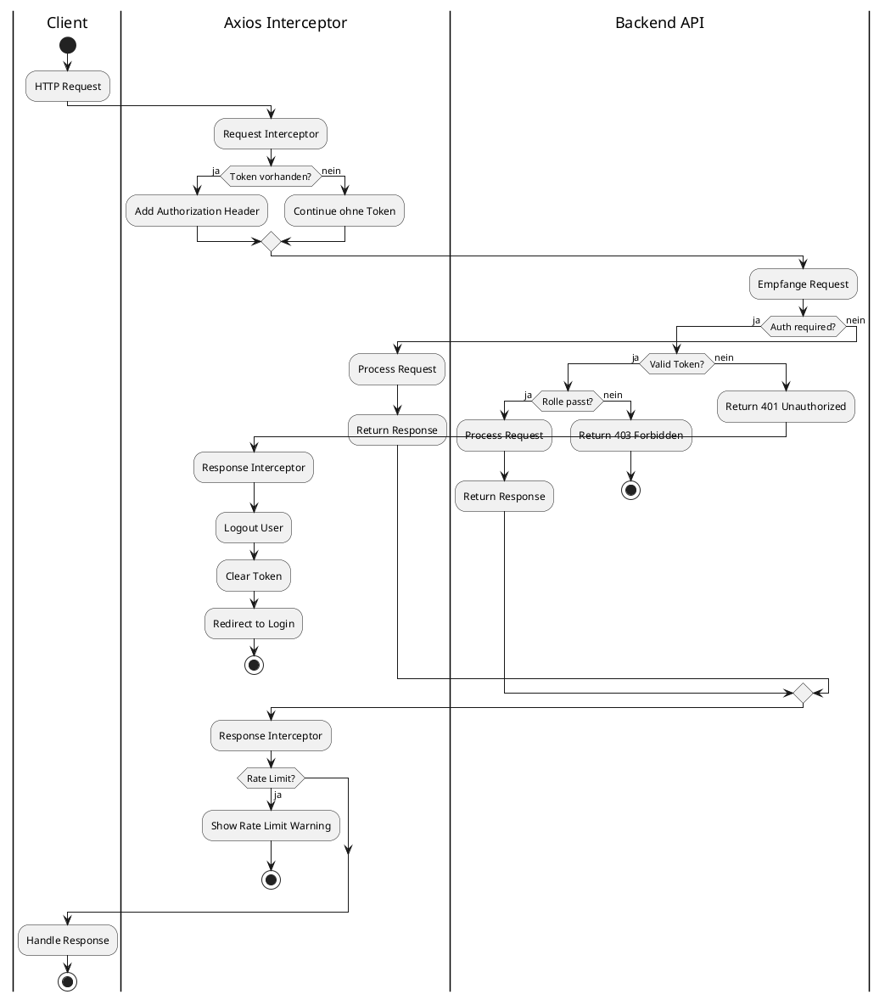

---

### 🛡️ Security Features

| Feature | Implementation |
|---------|---------------|
| 🔑 **Token Storage** | HTTP-only Cookies (preferred) |
| ⏱️ **Auto-Logout** | Token Expiry Detection |
| 🛣️ **Route Guards** | Rollenbasierte Navigation |
| ✅ **Input Validation** | Client & Server-side |
| 🚫 **XSS Protection** | Sanitization & CSP |
| 📤 **Upload Validation** | File Type & Size Checks |

---

### 🔐 Beispiel: Auto-Logout

```javascript
// In api.js Interceptor
api.interceptors.response.use(
  (response) => response,
  async (error) => {
    if (error.response?.status === 401) {
      const userStore = useUserStore()
      await userStore.logout()
      router.push('/auth/login')
    }
    return Promise.reject(error)
  }
)
```

---

### 🚫 XSS Protection

```javascript
import DOMPurify from 'dompurify'

export const sanitizeHtml = (dirty) => {
  return DOMPurify.sanitize(dirty, {
    ALLOWED_TAGS: ['b', 'i', 'em', 'strong', 'a'],
    ALLOWED_ATTR: ['href']
  })
}
```

---

## 15. Zusammenfassung

### ✅ Das LSX-Frontend ist:

| Feature | Status |
|---------|--------|
| 🧩 **Modular** | ✅ |
| 👥 **Rollenbasiert** | ✅ |
| 🎨 **Komponentengetrieben** | ✅ |
| ⚡ **Vue 3 Composition API** | ✅ |
| 🤖 **KI-Integration** | ✅ |
| ♿ **Barrierefrei** | ✅ |
| 🌍 **Multilingual** | ✅ |
| 🔄 **Erweiterbar** | ✅ |
| 🔒 **Sicher** | ✅ |
| 🚀 **Performant** | ✅ |

---

### 💡 Architektur-Highlights

```
┌─────────────────────────────────────┐
│  ⚡ Vue 3 + Vite                     │
│  📦 Pinia State Management           │
│  🎨 TailwindCSS                      │
│  🌍 vue-i18n                         │
│  🛣️ Vue Router                       │
│  🔌 Axios API Layer                  │
│  🎥 WebRTC LiveRoom                  │
│  🧩 15+ Widgets                      │
│  📝 12 Content-LM-Editoren (A-C)     │
└─────────────────────────────────────┘
```

---

### 🎯 Komponenten-Übersicht

| Kategorie | Anzahl | Beispiele |
|-----------|--------|-----------|
| 🧩 **Core Components** | 15+ | Button, Modal, Card |
| 🏗️ **Layouts** | 5 | Main, Dashboard, Admin |
| 📄 **Pages** | 30+ | Login, Dashboard, Courses |
| 🎨 **Widgets** | 13 | Progress, Token, KI |
| 📝 **Editoren** | 32 | Quiz, Flashcards, Timeline |
| 🎥 **LiveRoom** | 8 | Whiteboard, Chat, Recording |

> **Es bildet die komplette Benutzeroberfläche des LSX Lernsystems.**

---

## 📌 Dokument abgeschlossen

**Version:** 1.0  
**Status:** Final  
**Letzte Aktualisierung:** November 2024

---

> 💡 **Hinweis:** Dieses Dokument ist Teil der LSX-Systemdokumentation und beschreibt die vollständige Frontend-Architektur mit Vue.js 3, Komponenten-Struktur und Best Practices.