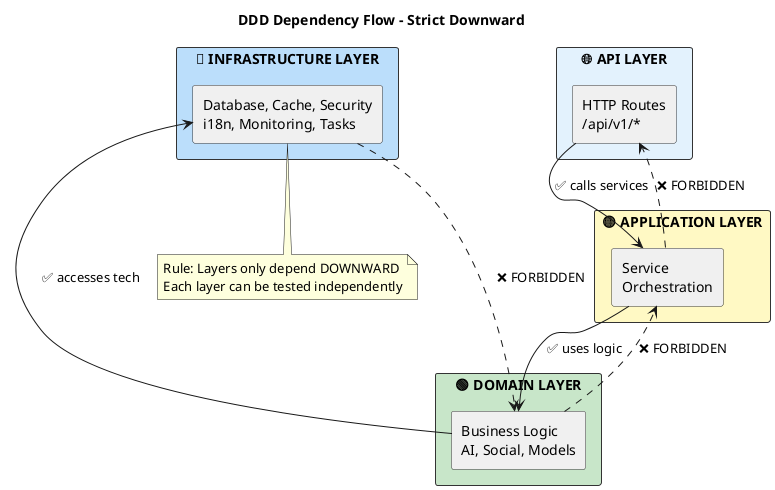
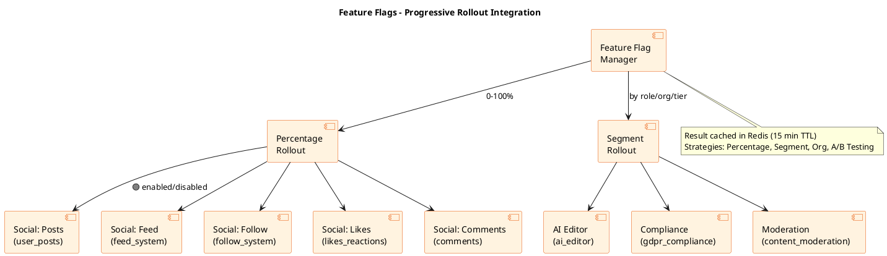
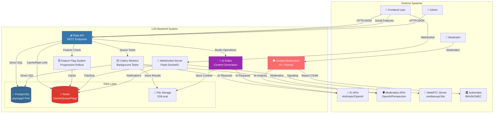

# 17 – Backend-Struktur (Final) v4.0 - DDD ARCHITECTURE

**Version:** 4.0 (DDD - Domain-Driven Design Architecture)
**Stand:** 18.01.2026
**Änderungen v4.0:** Complete DDD Architecture Reorganization (Phase 5 Complete) - 275+ files updated, app root cleaned, 7 clear layers: API → Application → Domain → Infrastructure

---

## ⚠️ WICHTIG - DDD ARCHITEKTUR UPDATE (18.01.2026)

### Was hat sich geändert?

Das Backend wurde vollständig nach **Domain-Driven Design (DDD)** Prinzipien reorganisiert:

**ALTE Struktur (Pre-Phase 5):**
```
app/
├── repositories/           ❌ Scattered at root
├── services/              ❌ Too complex (2000+ LOC)
├── models/
├── ai/
├── database.py
└── ... 23 subdirectories total (messy)
```

**NEUE Struktur (Post-Phase 5 - SAUBER):**
```
app/
├── api/                    🔴 HTTP Layer (routes, blueprints)
├── application/            🟡 Application Services (NEW LOCATION)
├── domain/                 🟢 Business Logic (ai/, social/, models/)
├── infrastructure/         🔵 Technical Services (db, cache, i18n, security, etc.)
├── core/                   Feature Flags
└── setup/                  Setup Wizard
```

### Wichtige Import-Pfad Änderungen

| Alt (Pre-Phase 5) | Neu (Post-Phase 5) | Layer |
|---|---|---|
| `from app.repositories...` | `from app.infrastructure.persistence.repositories...` | Infrastructure |
| `from app.services...` | `from app.application.services...` | Application |
| `from app.models...` | `from app.domain.models...` | Domain |
| `from app.database...` | `from app.infrastructure.persistence.database...` | Infrastructure |
| `from app.security...` | `from app.infrastructure.security...` | Infrastructure |
| `from app.i18n...` | `from app.infrastructure.i18n...` | Infrastructure |
| `from app.ai...` | `from app.domain.ai...` | Domain |
| `from app.social...` | `from app.domain.social...` | Domain |
| `from app.middleware...` | `from app.api.middleware...` | API |

**Vollständige Migration Guide:** `.claude/BACKEND_MIGRATION_GUIDE_DDD_2026-01-18.md`

---

## Überblick

Dieses Dokument beschreibt die komplette **Enterprise-Grade Backend-Architektur** des LSX Lernsystems nach DDD Reorganisation.

Das Backend ist **modular**, **sicher**, **skalierbar**, **vollständig compliance-konform**, **feature-flag-gesteuert**, **mit AI Editor integriert** und folgt **klarer DDD-Schichtarchitektur**.

### 🎯 Neue Features in v3.2

- ✅ **Semantic URL Paths** - `/admin/` → `/admin-panel/` (Clarity: Interface vs. Role)
- ✅ **Admin Panel Reorganization** - Settings-based Structure (Sidebar-aligned)
- ✅ **AI Editor System** - Chat, Content Generation, Variants, Sessions
- ✅ **Compliance APIs** - GDPR Data Export/Deletion, Privacy Controls, Age Verification
- ✅ **Feature Flag System** - Progressive Rollout (5% → 25% → 100%)
- ✅ **Social Learning Network** - Posts, Feed, Follow, Likes, Comments
- ✅ **Full Compliance** - DSA, NetzDG, GDPR, ISO 27001, Child Safety
- ✅ **Content Moderation** - AI + Human, 24h/7d Response Times, SLA Monitor
- ✅ **DRM System** - Denuvo-style Protection
- ✅ **WebSocket Events** - Standardized real-time events
- ✅ **Error Response Format** - Standardized error codes & messages
- ✅ **Internationalization** - 20+ Languages

### 🛠️ Tech-Stack

| Technologie | Verwendung |
|------------|-----------|
| 🐍 **Python 3.12+** | Core Language |
| 🌶️ **Flask 3.0** | Web Framework (Blueprint-Architektur) |
| 🗃️ **psycopg 3** | PostgreSQL-Treiber mit Connection Pooling (**KEIN ORM**) |
| 🐘 **PostgreSQL** | Datenbank |
| 🔴 **Redis** | Caching, Rate Limits, Sessions, Celery Queue, Feature Flags |
| 📦 **Celery** | Background Tasks (KI-Pipeline, Moderation) |
| 🔌 **Flask-SocketIO** | WebSockets / Real-time (LiveRoom, Notifications) |
| 🎥 **WebRTC** | Video/Audio (mediasoup/Jitsi) |
| 🔑 **JWT** | Authentication (Flask-JWT-Extended) |
| 📋 **Pydantic** | Request/Response Validation |
| 🤖 **AI Moderation** | OpenAI Moderation API, Perspective API |
| 🔒 **Cryptography** | AES-256-GCM, RSA-4096 (DRM) |

> ⚠️ **WICHTIG:** Dieses Projekt verwendet **KEIN ORM** (kein SQLAlchemy). Alle Datenbankoperationen erfolgen über direktes SQL mit psycopg und dem Repository-Pattern.

---

## 1. Projektstruktur (Backend-Verzeichnis) - UPDATED v4.0

### 🏗️ Verzeichnisbaum - Komplette Übersicht

```
/backend
├── /app                                    # 🏭 APPLICATION ROOT
│   ├── __init__.py                         # Factory Pattern (create_app)
│   ├── config.py                           # Configuration Classes
│   ├── extensions.py                       # Flask Extensions (db_pool, redis, etc.)
│   │
│   ├── /core                               # 🎯 CORE SYSTEM - Feature Flags & Config
│   │   ├── /feature_flags                  # ⭐ Feature Flag System
│   │   │   ├── flag_manager.py             # Flag Evaluation & Caching
│   │   │   ├── flag_decorators.py          # @require_feature_flag Decorator
│   │   │   ├── flag_middleware.py          # Flag Middleware
│   │   │   └── flag_admin.py               # Admin API for Flags
│   │   │
│   │   └── /rollout                        # Progressive Rollout
│   │       ├── percentage_rollout.py       # % based rollout (5% → 25% → 100%)
│   │       ├── user_segments.py            # User Segment Targeting
│   │       ├── org_rollout.py              # Organization-based Rollout
│   │       └── ab_testing.py               # A/B Testing Framework
│   │
│   ├── /api                                # 🌐 REST API LAYER
│   │   └── /v1                             # API Version 1
│   │       ├── __init__.py                 # Blueprint Registration
│   │       │
│   │       ├── # PUBLIC CORE ENDPOINTS
│   │       ├── auth.py                     # /api/v1/auth (Login, Register, Token Refresh)
│   │       ├── users.py                    # /api/v1/users (User CRUD)
│   │       ├── profile.py                  # /api/v1/profile (Current User Profile)
│   │       ├── courses.py                  # /api/v1/courses (Course Catalog)
│   │       ├── categories.py               # /api/v1/categories
│   │       ├── learning_methods.py         # /api/v1/learning-methods
│   │       ├── subscriptions.py            # /api/v1/subscriptions (Premium Management)
│   │       ├── tokens.py                   # /api/v1/tokens (Token Wallet Management)
│   │       ├── organisations.py            # /api/v1/organisations
│   │       ├── health.py                   # /health (Health Check Endpoint)
│   │       │
│   │       ├── # CONTENT ENDPOINTS
│   │       ├── chapter_theory.py           # /api/v1/chapters/:id/theory
│   │       ├── lesson_explanations.py      # /api/v1/lessons/:id/explanation
│   │       ├── lesson_videos.py            # /api/v1/lessons/:id/video
│   │       ├── exam_simulations.py         # /api/v1/exams - System-Feature: Exam System 🔧
│   │       │
│   │       ├── # AI/TUTOR ENDPOINTS
│   │       ├── tutor.py                    # /api/v1/tutor - System-Feature: AI Tutor 🔧
│   │       ├── agents.py                   # /api/v1/agents
│   │       ├── audio.py                    # /api/v1/audio
│   │       ├── tts.py                      # /api/v1/tts - System-Feature: TTS 🔧
│   │       ├── math_toolkit.py             # /api/v1/math - System-Feature: Math Tools 🔧
│   │       │
│   │       ├── # ANALYTICS
│   │       ├── analytics.py                # /api/v1/analytics
│   │       ├── org_analytics.py            # /api/v1/organisations/:id/analytics
│   │       ├── feedback.py                 # /api/v1/feedback
│   │       │
│   │       ├── # SOCIAL FEATURES (Feature-Flagged)
│   │       ├── /social                     # 🌟 SOCIAL API - System-Feature 🔧
│   │       │   ├── posts.py                # /api/v1/social/posts - FLAG: 'user_posts'
│   │       │   ├── feed.py                 # /api/v1/social/feed - FLAG: 'feed_system'
│   │       │   ├── follow.py               # /api/v1/social/follow - FLAG: 'follow_system'
│   │       │   ├── likes.py                # /api/v1/social/likes - FLAG: 'likes_reactions'
│   │       │   ├── comments.py             # /api/v1/social/comments - FLAG: 'comments'
│   │       │   ├── shares.py               # /api/v1/social/shares - FLAG: 'content_sharing'
│   │       │   ├── trending.py             # /api/v1/social/trending - FLAG: 'trending_discovery'
│   │       │   ├── hashtags.py             # /api/v1/social/hashtags - FLAG: 'hashtags'
│   │       │   └── mentions.py             # /api/v1/social/mentions - FLAG: 'mentions'
│   │       │
│   │       ├── # COMPLIANCE ENDPOINTS
│   │       ├── /compliance                 # ⭐ GDPR COMPLIANCE APIs - System-Feature 🔧
│   │       │   ├── privacy.py              # /api/v1/compliance/privacy
│   │       │   ├── cookies.py              # /api/v1/compliance/cookies
│   │       │   ├── consent.py              # /api/v1/compliance/consent
│   │       │   ├── data_export.py          # /api/v1/compliance/data-export
│   │       │   ├── data_deletion.py        # /api/v1/compliance/data-deletion
│   │       │   ├── consent_history.py      # /api/v1/compliance/consent-history
│   │       │   └── parental_consent.py     # /api/v1/compliance/parental-consent
│   │       │
│   │       ├── # MODERATION ENDPOINTS
│   │       ├── /moderation                 # 🛡️ MODERATION APIs - System-Feature 🔧
│   │       │   ├── reports.py              # POST /api/v1/moderation/reports
│   │       │   ├── queue.py                # GET /api/v1/moderation/queue
│   │       │   ├── actions.py              # POST /api/v1/moderation/actions
│   │       │   ├── statistics.py           # GET /api/v1/moderation/statistics
│   │       │   ├── sla_monitor.py          # GET /api/v1/moderation/sla-monitor
│   │       │   └── appeals.py              # GET /api/v1/moderation/appeals
│   │       │
│   │       ├── # ADMIN PANEL (Settings-based Structure) ⭐ v3.1
│   │       └── /admin-panel                # 👑 ADMIN PANEL
│   │           ├── /settings               # ⚙️ ALL SETTINGS CONSOLIDATED
│   │           │   ├── /ai                 # 🤖 AI Configuration (14 endpoints)
│   │           │   │   ├── jobs_creation.py
│   │           │   │   ├── jobs_finalization.py
│   │           │   │   ├── jobs_management.py
│   │           │   │   ├── models_crud.py
│   │           │   │   ├── models_defaults.py
│   │           │   │   ├── models_sync.py
│   │           │   │   ├── models_usage.py
│   │           │   │   ├── ai_pricing.py
│   │           │   │   ├── ai_model_profiles.py
│   │           │   │   ├── providers_api_keys.py
│   │           │   │   ├── providers_crud.py
│   │           │   │   ├── providers_health.py
│   │           │   │   └── providers_testing.py
│   │           │   │
│   │           │   ├── /system             # 🛠️ System Settings (3 endpoints)
│   │           │   │   ├── settings.py
│   │           │   │   ├── system_info.py
│   │           │   │   └── system_stats.py
│   │           │   │
│   │           │   ├── /permissions        # 🔐 Permissions & Roles
│   │           │   │   ├── roles.py
│   │           │   │   └── permission_thresholds.py
│   │           │   │
│   │           │   └── /feature_flags      # 🎚️ Feature Flags
│   │           │       ├── flags.py
│   │           │       ├── rollout.py
│   │           │       └── analytics.py
│   │           │
│   │           ├── /audit_logs             # 📋 Audit Logs (Top-Level)
│   │           │   └── audit_logs.py
│   │           │
│   │           ├── /courses                # 📚 Course Management (Top-Level)
│   │           │   ├── courses.py
│   │           │   ├── chapters.py
│   │           │   ├── lessons.py
│   │           │   ├── exams.py
│   │           │   ├── course_prompts.py
│   │           │   └── course_files.py
│   │           │
│   │           ├── /moderation             # 🛡️ Moderation Panel (Top-Level)
│   │           │   ├── queue.py
│   │           │   ├── actions.py
│   │           │   ├── reports.py
│   │           │   ├── statistics.py
│   │           │   └── transparency.py
│   │           │
│   │           ├── dashboard.py
│   │           ├── users.py
│   │           ├── analytics.py
│   │           ├── prompts.py
│   │           ├── learning_methods.py
│   │           ├── lm_routing.py
│   │           ├── course_analytics.py
│   │           ├── course_ai_settings.py
│   │           ├── course_authoring.py
│   │           ├── role_studio.py
│   │           └── ai_editor_authoring.py
│   │
│   ├── /application                        # 🟡 APPLICATION LAYER (Services)
│   │   └── /services                       # Business Logic & Orchestration (moved in Phase 5)
│   │       ├── /system                     # System Services
│   │       ├── /audit                      # Audit Services
│   │       ├── /notifications              # Notification Services
│   │       ├── /ai_adapter                 # AI Integration
│   │       ├── /social                     # Social Logic
│   │       ├── /course_creation            # Course Creation Services
│   │       ├── /learning_methods           # 📚 Learning Method Services (12 LM00-LM11)
│   │       │   ├── __init__.py
│   │       │   ├── group_a_explanation_service.py    # LM00-LM04 Services
│   │       │   │   ├── get_whiteboard_lesson()      # LM00
│   │       │   │   ├── get_tutor_explanation()      # LM01
│   │       │   │   ├── get_theory_lesson()          # LM02
│   │       │   │   ├── get_video_lesson()           # LM03
│   │       │   │   └── get_story_based_lesson()     # LM04
│   │       │   │
│   │       │   ├── group_b_practice_service.py       # LM05-LM08 Services
│   │       │   │   ├── get_quiz_exercise()          # LM05
│   │       │   │   ├── get_drag_and_drop()          # LM06
│   │       │   │   ├── get_math_practice()          # LM07
│   │       │   │   └── get_coding_exercise()        # LM08
│   │       │   │
│   │       │   ├── group_c_assessment_service.py     # LM09-LM11 Services
│   │       │   │   ├── get_quiz_assessment()        # LM09
│   │       │   │   ├── get_exam_simulation()        # LM10
│   │       │   │   └── get_comprehension_check()    # LM11
│   │       │   │
│   │       │   ├── learning_method_mapping.py        # Feature Mapping Registry
│   │       │   │   ├── LEARNING_METHOD_TYPES        # LM00-LM11 Configuration
│   │       │   │   ├── FEATURE_MAPPING              # System Features per LM
│   │       │   │   ├── get_required_features()      # Feature Lookup
│   │       │   │   └── validate_lm_execution()      # Validation
│   │       │   │
│   │       │   ├── learning_method_factory.py        # Factory Pattern
│   │       │   │   ├── create_lesson_instance()     # Create LM Instance
│   │       │   │   ├── load_features_for_lm()       # Load System Features
│   │       │   │   └── initialize_execution_context() # Setup Context
│   │       │   │
│   │       │   └── learning_method_utils.py          # Utilities
│   │       │       ├── validate_lm_id()
│   │       │       ├── get_feature_requirements()
│   │       │       └── validate_feature_availability()
│   │       │
│   │       ├── /moderation                 # Moderation Services
│   │       ├── /user_management            # User Management Services
│   │       ├── /export_import              # Import/Export Services
│   │       ├── /feature_flags              # Feature Flag Services
│   │       ├── /token_management           # Token Management
│   │       └── /_legacy_bridges            # Backward Compatibility
│   │
│   ├── /domain                             # 🟢 DOMAIN LAYER (Business Logic & Models)
│   │   ├── /models                         # Domain Models (moved from /app/models)
│   │   │   ├── user.py
│   │   │   ├── course.py
│   │   │   ├── post.py
│   │   │   ├── comment.py
│   │   │   ├── report.py
│   │   │   ├── studio.py
│   │   │   └── ...
│   │   │
│   │   ├── /ai                             # AI Domain Logic (moved from /app/ai)
│   │   │   ├── ai_course_generator.py
│   │   │   ├── /configuration
│   │   │   ├── /adapters
│   │   │   ├── /managers
│   │   │   └── ...
│   │   │
│   │   └── /social                         # Social Domain Logic (moved from /app/social)
│   │       ├── posts.py
│   │       ├── comments.py
│   │       ├── likes.py
│   │       ├── feed_algorithm.py
│   │       ├── /profiles
│   │       ├── /discovery
│   │       └── ...
│   │
│   ├── /infrastructure                     # 🔵 INFRASTRUCTURE LAYER (Technical Services)
│   │   ├── /persistence                    # Database Access Layer
│   │   │   ├── database.py                 # Connection Pool Manager
│   │   │   └── /repositories               # Repository Pattern (moved from /app/repositories)
│   │   │       ├── base_repository.py
│   │   │       ├── user.py
│   │   │       ├── post.py
│   │   │       ├── comment.py
│   │   │       ├── like.py
│   │   │       ├── follow.py
│   │   │       ├── report.py
│   │   │       └── ...
│   │   │
│   │   ├── /cache                          # Redis Caching (moved from services in Phase 1)
│   │   │   ├── cache_service.py
│   │   │   ├── cache_keys.py
│   │   │   └── cache_invalidation.py
│   │   │
│   │   ├── /validation                     # Validators (extracted in Phase 1)
│   │   │   ├── learning_method_mapping.py
│   │   │   ├── input_validators.py
│   │   │   └── schema_validators.py
│   │   │
│   │   ├── /i18n                           # Internationalization (moved from /app/i18n)
│   │   │   ├── error_codes.py
│   │   │   ├── error_code_i18n_mapping.py
│   │   │   ├── translations.py
│   │   │   └── ...
│   │   │
│   │   ├── /security                       # Security & Auth (moved from /app/security)
│   │   │   ├── auth.py
│   │   │   ├── permissions.py
│   │   │   ├── jwt_handler.py
│   │   │   ├── rate_limiter.py
│   │   │   └── password_utils.py
│   │   │
│   │   ├── /monitoring                     # Metrics & Logging (moved from /app/monitoring)
│   │   │   ├── metrics.py
│   │   │   ├── logger.py
│   │   │   └── health_check.py
│   │   │
│   │   ├── /realtime                       # Real-time Services
│   │   │   └── /sockets                    # WebSocket/SocketIO (moved from /app/sockets)
│   │   │       ├── events.py
│   │   │       ├── social_socket.py
│   │   │       ├── notification_socket.py
│   │   │       └── live_room_socket.py
│   │   │
│   │   ├── /tasks                          # Background Tasks (moved from /app/tasks)
│   │   │   ├── ai_tasks.py
│   │   │   ├── moderation_tasks.py
│   │   │   ├── notification_tasks.py
│   │   │   └── export_tasks.py
│   │   │
│   │   └── /utils                          # Utilities (moved from /app/utils)
│   │       ├── exceptions.py
│   │       ├── helpers.py
│   │       ├── constants.py
│   │       └── decorators.py
│   │
│   ├── /setup                              # Setup Wizard (KEEP at root)
│   │   ├── __init__.py
│   │   ├── setup_routes.py
│   │   └── setup_wizard.py
│   │
│   └── # Config Files (at root)
│       ├── __init__.py                     # Factory (27KB)
│       ├── config.py                       # Configuration (19KB)
│       └── extensions.py                   # Extensions (9.8KB)
│
├── /tests
│   ├── unit/
│   ├── integration/
│   └── conftest.py
│
├── requirements.txt
├── requirements-dev.txt
├── Dockerfile
├── docker-compose.yml
├── wsgi.py
└── run.py
```

### 📊 Layer Dependencies (Clean DDD Architecture)

**PlantUML Diagram (Visual Representation):**



**ASCII Reference (for accessibility):**

```
┌─────────────────────────────────────────┐
│  🔴 API LAYER                           │
│  (/api/v1/*.py, /api/v1/**/*.py)        │
│  → HTTP routes, request/response        │
└──────────────────┬──────────────────────┘
                   │ calls
┌──────────────────▼──────────────────────┐
│  🟡 APPLICATION LAYER                   │
│  (/application/services/*.py)           │
│  → Business workflows, orchestration    │
└──────────────────┬──────────────────────┘
                   │ uses
┌──────────────────▼──────────────────────┐
│  🟢 DOMAIN LAYER                        │
│  (/domain/models, /domain/ai,           │
│   /domain/social)                       │
│  → Business logic, pure Python          │
└──────────────────┬──────────────────────┘
                   │ uses
┌──────────────────▼──────────────────────┐
│  🔵 INFRASTRUCTURE LAYER                │
│  (/infrastructure/*)                    │
│  → DB, Cache, Security, i18n, Tasks    │
└─────────────────────────────────────────┘

✅ Rule: Layers only depend DOWNWARD
❌ Never: Domain → Application, Application → API
```

### 🎯 Feature Flags Integration Points

Alle neuen Features sind über Feature Flags aktivierbar (Progressive Rollout):

**PlantUML Diagram (Feature Flag System):**



**Feature Flag Reference:**

```
/core/feature_flags/
├── FLAG: 'user_posts'              → /api/v1/social/posts
├── FLAG: 'feed_system'             → /api/v1/social/feed
├── FLAG: 'follow_system'           → /api/v1/social/follow
├── FLAG: 'likes_reactions'         → /api/v1/social/likes
├── FLAG: 'comments'                → /api/v1/social/comments
├── FLAG: 'content_sharing'         → /api/v1/social/shares
├── FLAG: 'trending_discovery'      → /api/v1/social/trending
├── FLAG: 'hashtags'                → /api/v1/social/hashtags
├── FLAG: 'mentions'                → /api/v1/social/mentions
├── FLAG: 'ai_editor'               → /api/v1/studio/* (NEW)
├── FLAG: 'gdpr_compliance'         → /api/v1/compliance/* (NEW)
├── FLAG: 'content_moderation'      → /api/v1/moderation/* (NEW)
└── FLAG: 'admin_panel_new'         → /api/v1/admin-panel/* (NEW)
```

### 📈 File Count Summary

| Layer | Component | Files | Lines | Status |
|-------|-----------|-------|-------|--------|
| **API** | v1 endpoints | 45+ | ~8,000 | ✅ Active |
| **Application** | Services | 30+ | ~6,000 | ✅ Moved Phase 5 |
| **Domain** | Models, AI, Social | 35+ | ~5,500 | ✅ Moved Phases 2-3 |
| **Infrastructure** | Persistence, Cache, Security, etc. | 40+ | ~7,000 | ✅ Moved Phase 4 |
| **Core** | Feature Flags | 8+ | ~1,200 | ✅ Active |
| **Tests** | Unit + Integration | 25+ | ~4,000 | ✅ Updated |
| **TOTAL** | **All Layers** | **183+** | **31,700+** | **✅ COMPLETE** |

---

## 2. System-Architektur (C4 Model - Context)



---

## 1.5 System-Features vs. Content-Lernmethoden (LMS Architecture)

### Wichtige Unterscheidung

Das LernSystemX unterscheidet zwischen zwei Typen von Lernfunktionalität:

#### **Content-Lernmethoden (12 LMs)**
- **Was:** Aufgabenformate für Lerninhalt (Flashcards, Quiz, Lückentext, etc.)
- **Wo:** `learning_methods.py` Blueprint
- **Dokumentation:** `01_Core/02_Lernmethoden.md`
- **Struktur:** JSONB-Content pro Kapitel/Lektion
- **Beispiele:** LM00-LM04 (Erklärend), LM05-LM08 (Praxis), LM09-LM11 (Prüfung)

#### **System-Features (25 Features)**
- **Was:** Tools & Services mit eigener Infrastruktur
- **Wo:** Separate Module wie `exam_simulations/`, `math_toolkit/`, `tts/`, etc.
- **Dokumentation:** `01_Core/02a_System-Features.md`
- **Struktur:** Vollständige Blueprint-Module mit Repositories, Services, Models
- **Beispiele:** Whiteboard, IHK Exam System, NPC Tutor, Code Sandbox, Gamification

### System-Features im Backend (/api/v1/)

**LMS-bezogene System-Features:**

| Feature | Module | Beschreibung |
|---------|--------|-------------|
| **Exam Simulations** | `/exam_simulations/` | IHK-Exam System, praktische Prüfungen, Kompetenzchecks |
| **Math Toolkit** | `/math_toolkit/` | Mathematische Tools, Übungen, Referenz |
| **Course Editor** | `/course_editor/` | Manueller Content-Editor, AI-gestützter Editor |
| **TTS (Text-to-Speech)** | `/tts/` | Sprachausgabe, Audio-Generierung, Aussprache |
| **Feature Flags** | `/features/` | Progressive Rollout, A/B Testing, Feature Control |
| **Gamification** | `/gamification/` | XP, Badges, Quests, Achievements |

**Infrastruktur-Features:**

| Feature | Modul | Beschreibung |
|---------|-------|-------------|
| **Compliance** | `/compliance/` | GDPR, Datenschutz, Consent Management |
| **Moderation** | `/moderation/` | Content Moderation, Reports, Actions |
| **Analytics** | `/analytics/` | User Analytics, Learning Analytics, Insights |
| **Social** | `/social/` | Posts, Feed, Follow, Likes, Comments, Sharing |
| **AI/Tutor** | `/tutor/`, `/ai/` | AI Tutor, Smart Agents, Content Generation |
| **Admin Panel** | `/admin-panel/` | Settings, Course Management, User Management |

### Integration im System (Zwei-Schicht-Architektur)

#### **Schicht 1: Python-Registry (Source of Truth)**

Zentrale Definition aller 25 System-Features mit vollständiger Konfiguration:

```python
# app/ki/system_features_mapping.py
SYSTEM_FEATURES: Dict[str, SystemFeatureDefinition] = {
    "whiteboard_engine": SystemFeatureDefinition(
        feature_code="whiteboard_engine",
        feature_name="Whiteboard-Engine",
        category="interactive_tools",
        requires_infrastructure=True,
        requires_external_service=True,
        default_config={...}
    ),
    "ihk_exam_system": SystemFeatureDefinition(...),
    # ... insgesamt 25 Features
}

# Hilfs-Funktionen
get_system_feature(feature_code: str) -> SystemFeatureDefinition
get_feature_default_config(feature_code: str) -> dict
is_valid_feature_code(feature_code: str) -> bool
```

**→ Definiert: Infra-Anforderungen, Konfigurationen, Icons, Kategorien**

---

#### **Schicht 2: Datenbank-Integration (Runtime)**

System-Features werden beim Setup aus der Python-Registry in die Datenbank gepflanzt:

```python
# app/setup/seeds_config.py
SeedDataConfig.seed_system_features()  # Seeds 25 Features in die DB
```

Abfrage zur Laufzeit:

```sql
-- Alle System-Features registriert
SELECT feature_code, feature_name, category FROM support_systems.system_features;

-- Beispiel Ergebnisse:
-- whiteboard_engine | Whiteboard-Engine | interactive_tools
-- ihk_exam_system | IHK-Prüfungssystem | exam_systems
-- speech_to_text | Speech-to-Text Engine | audio
-- xp_quest_system | XP & Quest System | gamification
```

---

#### **Integration in Kursen: Feature-Level Kontrolle**

```python
# Kurse können Features auf Kapitel-Ebene aktivieren/deaktivieren
course.enable_feature("whiteboard_engine", chapter_id="ch001")
course.disable_feature("ihk_exam_system")

# Abfrage: Welche Features sind in diesem Kurs aktiv?
SELECT * FROM support_systems.system_features sf
JOIN course_features cf ON sf.feature_code = cf.feature_code
WHERE cf.course_id = 'course123'
```

### Deployment-Struktur

**WICHTIG:** Es gibt **KEINEN zentralen `/system-features/` Ordner**. System-Features sind **über /api/v1/ verteilt** als einzelne Ordner/Module:

```yaml
# AKTUELLE STRUKTUR: System-Features sind verteilt über /api/v1/

/app/api/v1/
├── /exam_simulations/     ← 🔧 System-Feature (Exam System)
├── /math_toolkit/         ← 🔧 System-Feature (Math Tools)
├── /tts/                  ← 🔧 System-Feature (Text-to-Speech)
├── /tutor/                ← 🔧 System-Feature (AI Tutor)
├── /features/             ← 🔧 System-Feature (Feature Flags)
├── /gamification/         ← 🔧 System-Feature (XP, Badges, Quests)
├── /course_editor/        ← 🔧 System-Feature (Content Editing)
├── /ai/                   ← Teils System-Feature (AI Services)
├── /social/               ← 🔧 System-Feature (Posts, Feed, Follow)
├── /community/            ← 🔧 System-Feature (Groups, Forums)
├── /messaging/            ← 🔧 System-Feature (Direct Messages)
├── /learning_methods/     ← NICHT System-Feature (12 Content-LMs)
├── /admin-panel/          ← Admin Operations
├── /profile/              ← User Profile
└── ... weitere Core APIs
```

**Registrierung:** Alle System-Features werden in der Datenbank registriert:
```sql
SELECT feature_code, feature_name FROM support_systems.system_features
ORDER BY category;

-- Ergebnis: 25 Features in 10 Kategorien (database-backed, nicht im Dateisystem organisiert)
```

---

## 1.6 Content-Lernmethoden Services (Application Layer)

### 12 Content-Lernmethoden im Backend

Die **12 Content-Lernmethoden (LM00-LM11)** sind im Application Services Layer nach **3 Gruppen** strukturiert:

| Gruppe | IDs | Services | Fokus |
|--------|-----|----------|-------|
| **A** Erklärend | LM00-LM04 | `group_a_explanation_service.py` | Verständnis aufbauen (Whiteboard, Tutor, Video) |
| **B** Praxis | LM05-LM08 | `group_b_practice_service.py` | Anwenden & Üben (Calculator, CodeSandbox, SimEnv) |
| **C** Prüfung | LM09-LM11 | `group_c_assessment_service.py` | Kompetenz nachweisen (Timer, ExamEngine) |

### Service-Layer-Struktur

```python
# app/services/learning_methods/

├── __init__.py

# Group A: Explanatory Methods (LM00-LM04)
├── group_a_explanation_service.py
│   ├── get_whiteboard_lesson(lesson_id: str) -> LessonWithWhiteboard
│   ├── get_tutor_explanation(lesson_id: str) -> LessonWithTutorFeatures
│   ├── get_video_lesson(lesson_id: str) -> LessonWithVideo
│   ├── get_interactive_theory(lesson_id: str) -> LessonWithInteraction
│   ├── get_deep_explanation(lesson_id: str) -> DetailedExplanation
│   │
│   └── _load_system_features_for_group_a(lesson: Lesson) -> dict
│       # Lädt folgende System Features:
│       # - whiteboard_engine (LM00-LM02)
│       # - ai_tutor (LM01, LM03)
│       # - video_streaming (LM02)
│       # - visualization_tools (LM04)

# Group B: Practice Methods (LM05-LM08)
├── group_b_practice_service.py
│   ├── get_drag_and_drop_exercise(lesson_id: str) -> DragDropExercise
│   ├── get_math_practice(lesson_id: str) -> MathExercise
│   ├── get_code_challenge(lesson_id: str) -> CodeChallenge
│   ├── get_simulation_exercise(lesson_id: str) -> SimulationExercise
│   │
│   └── _load_system_features_for_group_b(lesson: Lesson) -> dict
│       # Lädt folgende System Features:
│       # - math_toolkit (LM06)
│       # - code_sandbox (LM07)
│       # - simulation_environment (LM08)
│       # - interactive_tools (LM05)

# Group C: Assessment Methods (LM09-LM11)
├── group_c_assessment_service.py
│   ├── get_quiz(lesson_id: str) -> Quiz
│   ├── get_exam_simulation(lesson_id: str) -> ExamSimulation
│   ├── get_comprehension_check(lesson_id: str) -> ComprehensionCheck
│   │
│   └── _load_system_features_for_group_c(lesson: Lesson) -> dict
│       # Lädt folgende System Features:
│       # - timer_system (LM09, LM10, LM11)
│       # - ihk_exam_system (LM10)
│       # - exam_simulation (LM10)

# Learning Method Registry
├── learning_method_mapping.py
│   ├── LEARNING_METHOD_TYPES: Dict[int, LearningMethodConfig]
│   ├── get_learning_method(lm_id: int) -> LearningMethodConfig
│   ├── get_system_features_for_lm(lm_id: int) -> List[SystemFeature]
│   └── create_lm_with_features(lm_id: int) -> LearningMethodInstance

# Shared utilities
└── learning_method_utils.py
    ├── validate_lm_config(lm_id: int, config: dict) -> bool
    ├── merge_lm_with_features(lm: LM, features: List[SF]) -> LearningExperience
    └── get_lm_group(lm_id: int) -> str  # 'A' | 'B' | 'C'
```

### System-Features Kopplung pro Gruppe

#### **Gruppe A: Erklärend (Verständnis aufbauen)**

```python
# group_a_explanation_service.py

class GroupAExplanationService:
    """LM00-LM04: Explanatory/Theory-based learning methods."""

    # Mapping: Welche System Features werden für welche LM benötigt
    FEATURE_MAPPING = {
        'LM00_Whiteboard': ['whiteboard_engine', 'visualization_tools'],
        'LM01_Tutor': ['ai_tutor', 'speech_to_text', 'text_to_speech'],
        'LM02_Video': ['video_streaming', 'visualization_tools'],
        'LM03_InteractiveTheory': ['interactive_tools', 'visualization_tools'],
        'LM04_DeepExplanation': ['visualization_tools', 'ai_tutor']
    }

    def get_lesson_with_features(self, lesson_id: str, lm_type: str) -> dict:
        """
        Get lesson with all required system features for Group A.

        Args:
            lesson_id: ID of the lesson
            lm_type: Learning method type (LM00, LM01, etc.)

        Returns:
            Lesson with loaded system features
        """
        lesson = self.lesson_repo.find_by_id(lesson_id)
        required_features = self.FEATURE_MAPPING.get(lm_type, [])

        # Load system features
        features = {}
        for feature_code in required_features:
            features[feature_code] = self._load_feature(feature_code, lesson)

        return {
            'lesson': lesson,
            'lm_type': lm_type,
            'system_features': features,
            'group': 'A_Explanatory'
        }

    def _load_feature(self, feature_code: str, lesson: Lesson) -> dict:
        """Load a specific system feature for the lesson."""
        feature_service = self.feature_services.get(feature_code)
        if not feature_service:
            return {}

        return feature_service.prepare_for_lesson(lesson)
```

#### **Gruppe B: Praxis (Anwenden & Üben)**

```python
# group_b_practice_service.py

class GroupBPracticeService:
    """LM05-LM08: Practice/Exercise-based learning methods."""

    FEATURE_MAPPING = {
        'LM05_DragAndDrop': ['interactive_tools', 'gamification'],
        'LM06_MathTasks': ['math_toolkit', 'calculator', 'formula_editor', 'timer_system'],
        'LM07_CodeChallenge': ['code_sandbox', 'syntax_highlighter', 'debugger'],
        'LM08_Simulation': ['simulation_environment', 'visualization_tools']
    }

    def get_practice_exercise(self, lesson_id: str, lm_type: str) -> dict:
        """Get practice exercise with all required tools."""
        lesson = self.lesson_repo.find_by_id(lesson_id)
        required_features = self.FEATURE_MAPPING.get(lm_type, [])

        # Example: Math Tasks (LM06) requires multiple system features
        if lm_type == 'LM06_MathTasks':
            features = {
                'calculator': self.calculator_service.create_instance(),
                'formula_editor': self.formula_editor_service.create_instance(),
                'graph_plotter': self.graph_plotter_service.create_instance(),
                'timer': self.timer_service.create_instance(duration=lesson.max_time)
            }
        else:
            features = {}
            for feature_code in required_features:
                features[feature_code] = self._load_feature(feature_code)

        return {
            'lesson': lesson,
            'lm_type': lm_type,
            'system_features': features,
            'group': 'B_Practice'
        }
```

#### **Gruppe C: Prüfung (Kompetenz nachweisen)**

```python
# group_c_assessment_service.py

class GroupCAssessmentService:
    """LM09-LM11: Assessment/Exam-based learning methods."""

    FEATURE_MAPPING = {
        'LM09_Quiz': ['timer_system', 'gamification'],
        'LM10_IHKExam': ['ihk_exam_system', 'timer_system', 'exam_engine'],
        'LM11_ComprehensionCheck': ['timer_system', 'ai_tutor']
    }

    def get_assessment(self, lesson_id: str, lm_type: str) -> dict:
        """Get assessment with all required exam/quiz features."""
        lesson = self.lesson_repo.find_by_id(lesson_id)
        required_features = self.FEATURE_MAPPING.get(lm_type, [])

        features = {}
        for feature_code in required_features:
            features[feature_code] = self._load_feature(feature_code)

        return {
            'lesson': lesson,
            'lm_type': lm_type,
            'system_features': features,
            'group': 'C_Assessment'
        }
```

### API Endpoints für Lernmethoden

```python
# /api/v1/learning-methods

# Get available learning methods for a lesson
GET    /api/v1/learning-methods/lesson/:id/available
       Response: { available_methods: [...], recommended: LM00 }

# Get specific learning method with features
GET    /api/v1/learning-methods/:lm_id/lesson/:id
       Response: { method, system_features, group }

# Execute learning method
POST   /api/v1/learning-methods/:lm_id/execute
       Request: { lesson_id, user_id, parameters }
       Response: { instance_id, started_at, features_loaded }

# Get learning method result
GET    /api/v1/learning-methods/:instance_id/result
       Response: { score, completion_time, feedback }

# Admin: Get all learning methods
GET    /api/v1/admin-panel/learning-methods
       Response: { methods: [...], total: 12, groups: { A: 5, B: 4, C: 3 } }

# Admin: Update learning method config
PUT    /api/v1/admin-panel/learning-methods/:lm_id
       Request: { name, config, system_features: [...] }
       Response: { success, updated_at }
```

---

## 1.7 Content-Lernmethoden ↔ System Features Integration Pattern

### 📋 Übersicht - WICHTIG!

**Architektur-Constraint (UNVERÄNDERLICH):**
- **12 Content-Lernmethoden (LM00-LM11)** in 3 Gruppen (A: 5, B: 4, C: 3) = echte Lernmethoden
- **25 System Features** (gesamt, siehe [02a_System-Features.md](../01_Core/02a_System-Features.md)) = unterstützende Technologien
- **Davon: 22 Features sind Tier-basiert implementiert** (11 Free + 6 Premium + 4 Pro) = Ausführungsformen
- **3 Features sind unabhängig** (timer_wrapper, mindmap_generator, learning_path_generator) oder haben andere Modelle

**Das Pattern:** Content-Lernmethoden (12) sind gekoppelt mit System Features (25) über einen **Feature Registry** in der Application Layer. Die namensbasierte Kopplung ermöglicht flexible Umsetzung.

### 🎯 Integration Pattern (Namensbasiert - FLEXIBEL)

```python
# app/application/services/learning_methods/learning_method_mapping.py

# FEATURE_MAPPING zeigt welche System Features für jede Lernmethode erforderlich sind
FEATURE_MAPPING = {
    'flashcards': {
        'features': ['card_system', 'spaced_repetition_engine'],
        'required': True,
        'tier': 'free',  # Verfügbar im kostenlosen Tier
        'config': {
            'max_cards_per_set': 500,
            'supports_images': True,
            'supports_audio': True
        }
    },

    'whiteboard_ai': {
        'features': ['whiteboard_engine', 'formula_recognition', 'visualization_tools', 'ai_annotation'],
        'required': True,
        'tier': 'pro',  # Nur in Pro-Tier verfügbar
        'config': {
            'max_users': 50,
            'recording_enabled': True,
            'ai_annotation': True
        }
    },

    'math': {
        'features': ['calculator', 'formula_editor', 'graph_plotter', 'timer'],
        'required': True,
        'tier': 'free',
        'config': {
            'calculator_mode': 'scientific',
            'timeout_minutes': 60,
            'allow_calculator': True
        }
    },

    'ai_exam_simulation': {
        'features': ['exam_system', 'timer', 'plagiarism_checker', 'anti_cheating_proctoring', 'ai_grading'],
        'required': True,
        'tier': 'pro',
        'config': {
            'proctoring': 'ai',
            'allow_external_resources': False,
            'auto_submit_timeout': True
        }
    }
}

# Service-Level Coupling
class LearningMethodService:
    """Service für alle namensbasierten Lernmethoden"""

    def get_lesson(self, lesson_id: str, method_name: str):
        """Erstelle Lesson mit gekoppelten System Features"""

        # 1. Lade Lernmethoden-Konfiguration nach NAME (nicht ID!)
        method_config = self.feature_registry.get_config(method_name)

        # 2. Prüfe Tier-Zugang (User muss korrektes Abo haben)
        if not self.user_has_tier(method_config['tier']):
            raise ForbiddenError(f"Method {method_name} requires {method_config['tier']} tier")

        # 3. Lade erforderliche System Features
        features = self.feature_loader.load_features(
            feature_codes=method_config['features'],
            required=method_config['required']  # Wirft Error wenn Features fehlen
        )

        # 4. Konfiguriere Features
        for feature in features:
            feature.apply_config(method_config['config'])

        # 5. Erstelle Lesson-Instanz mit Features
        lesson = {
            'id': lesson_id,
            'method': method_name,  # Name, nicht ID!
            'tier': method_config['tier'],
            'features': {
                feature_name: features[feature_name]
                for feature_name in method_config['features']
            },
            'config': method_config['config'],
            'available': all(f.is_available() for f in features.values())
        }

        return lesson
```

### 📊 System Features Implementations - Tier-basiert (22 von 25 Features)

Diese 22 Features sind **Tier-basierte Implementierungen** von 22 der 25 System-Features. Sie werden über die namensbasierten Lernmethoden bereitgestellt. Sie sind **NICHT** die Content-LMs selbst, sondern Ausführungsformen/Konfigurationen der System-Features.

**Hinweis:** Die restlichen 3 System-Features (timer_wrapper, mindmap_generator, learning_path_generator) sind nicht Tier-basiert oder haben andere Bereitstellungsmodelle. Alle 25 Features siehe [02a_System-Features.md](../01_Core/02a_System-Features.md).

#### **FREE Tier** (11 System Features - Alle Users)
| Feature Name | Unterstützte Content-LM | Kategorie | Use Case |
|---|---|---|---|
| **flashcards** | LM00-LM04 (Erklärend) | interactive_tools | Memorization |
| **mcq** | LM05-LM08 (Praxis) | interactive_tools | Multiple Choice |
| **fill_blanks** | LM05 (Praxis) | interactive_tools | Gap Filling |
| **matching** | LM05 (Praxis) | interactive_tools | Pair Matching |
| **drag_drop** | LM05 (Praxis) | interactive_tools | Interaction |
| **math** | LM07 (Praxis) | interactive_tools | Math Practice |
| **true_false** | LM05 (Praxis) | interactive_tools | True/False |
| **sorting** | LM05 (Praxis) | interactive_tools | Ordering |
| **image_quiz** | LM05 (Praxis) | visualization | Visual Quiz |
| **audio_quiz** | LM05 (Praxis) | audio | Audio Quiz |
| **video_quiz** | LM05 (Praxis) | visualization | Video Quiz |

#### **PREMIUM Tier** (6 System Features - Zahlende Users)
| Feature Name | Unterstützte Content-LM | Kategorie | Use Case |
|---|---|---|---|
| **spaced_repetition** | LM00-LM04 (Erklärend) | meta_features | Advanced Memorization |
| **mind_maps** | LM02-LM04 (Erklärend) | visualization | Visual Organization |
| **timeline** | LM02-LM03 (Erklärend) | visualization | Historical/Sequential |
| **storytelling** | LM01-LM03 (Erklärend) | meta_features | Narrative Learning |
| **mnemonics** | LM00-LM02 (Erklärend) | meta_features | Memory Techniques |
| **peer_learning** | LM05-LM08 (Praxis) | collaboration | Collaborative Practice |

#### **PRO Tier** (4 System Features - Advanced Users)
| Feature Name | Unterstützte Content-LM | Kategorie | Use Case |
|---|---|---|---|
| **case_studies** | LM05-LM08 (Praxis) | learning_paths | Real-world Cases |
| **role_play** | LM06-LM08 (Praxis) | interactive_tools | Simulation |
| **ai_exam_simulation** | LM09-LM11 (Prüfung) | exam_systems | Practice Exams |
| **whiteboard_ai** | LM00-LM01 (Erklärend) | tutor | Interactive Teaching |

### 🔄 API Flow: Feature Loading Pattern

```
Request: GET /api/v1/learning-methods/lesson/abc123?method=math

1. Route Handler (API Layer)
   ↓ Validates user has access

2. LearningMethodService (Application Layer)
   ↓ get_lesson('abc123', 'math')

3. Feature Registry Lookup (Application Service)
   ↓ Retrieve config for 'math' method

4. Tier Validation
   ↓ Check if user_tier >= required_tier

5. Feature Loader
   ↓ load_features(['calculator', 'formula_editor', 'graph_plotter', 'timer'])

6. Database/Cache (Infrastructure)
   ↓ Load feature configurations

7. Apply Configuration
   ↓ Apply method-specific config to features

8. Validation
   ↓ Verify all required features available

9. Response (API Layer)
   ↓ Return lesson with features

Response: {
  id: "abc123",
  method: "math",
  tier: "free",
  features: {
    calculator: {...},
    formula_editor: {...},
    graph_plotter: {...},
    timer: {...}
  },
  available: true
}
```

### ✅ Vorteile des namensbasierten Ansatzes

✅ **Flexibilität**: Neue Methoden können jederzeit hinzugefügt werden (kein LM00-LM11 Limit)
✅ **Wartbarkeit**: Namen sind selbstdokumentierend (kein `LM06` rätsel)
✅ **Skalierbar**: Nicht an 12 Methoden gebunden
✅ **Lesbar**: `method_name='math'` statt `method_id=6`
✅ **Tier-basiert**: Integration mit Free/Premium/Pro-Abos

### 📝 Implementation Checklist

- [ ] Feature Registry vollständig definiert (alle namensbasierten Methoden)
- [ ] Tier-Validation implementiert (Free/Premium/Pro)
- [ ] LearningMethodService implementiert
- [ ] Feature Loading Pattern getestet
- [ ] Tier-gating in API Endpoints
- [ ] API Endpoints: GET /api/v1/learning-methods/lesson/:id?method=:name
- [ ] Feature Availability Check
- [ ] Cache Strategy für Method Configs
- [ ] Error Handling bei Tier-Mismatch
- [ ] Dokumentation aktualisiert

---

## 2. Projektstruktur (Backend-Verzeichnis) - UPDATED

```
/backend
├── /app
│   ├── __init__.py              # 🏭 Factory Pattern (create_app)
│   ├── config.py                # ⚙️ Configuration
│   ├── extensions.py            # 🔌 Flask Extensions
│   │
│   ├── /core                    # 🎯 CORE SYSTEM
│   │   ├── /feature_flags       # ⭐ Feature Flag System
│   │   │   ├── __init__.py
│   │   │   ├── flag_manager.py
│   │   │   ├── flag_decorators.py
│   │   │   ├── flag_middleware.py
│   │   │   └── flag_admin.py
│   │   │
│   │   ├── /rollout
│   │   │   ├── percentage_rollout.py
│   │   │   ├── user_segments.py
│   │   │   ├── org_rollout.py
│   │   │   └── ab_testing.py
│   │   │
│   │   └── /configuration
│   │       ├── feature_config.py
│   │       └── rollout_config.py
│   │
│   ├── /api                     # 🌐 REST API LAYER
│   │   ├── /v1
│   │   │   ├── __init__.py
│   │   │   │
│   │   │   ├── # Core API (Public)
│   │   │   ├── auth.py              # /api/v1/auth
│   │   │   ├── users.py             # /api/v1/users
│   │   │   ├── profile.py           # /api/v1/profile
│   │   │   ├── courses.py           # /api/v1/courses
│   │   │   ├── categories.py        # /api/v1/categories
│   │   │   ├── learning_methods.py  # /api/v1/learning-methods
│   │   │   ├── subscriptions.py     # /api/v1/subscriptions
│   │   │   ├── tokens.py            # /api/v1/tokens
│   │   │   ├── organisations.py     # /api/v1/organisations
│   │   │   ├── health.py            # /health
│   │   │   │
│   │   │   ├── /dashboard
│   │   │   │   ├── __init__.py
│   │   │   │   ├── widgets.py
│   │   │   │   └── recommendations.py
│   │   │   │
│   │   │   ├── # Content API
│   │   │   ├── chapter_theory.py
│   │   │   ├── lesson_explanations.py
│   │   │   ├── lesson_videos.py
│   │   │   ├── exam_simulations.py               # 🔧 System-Feature: Exam System
│   │   │   │
│   │   │   ├── # KI/Tutor API
│   │   │   ├── tutor.py                          # 🔧 System-Feature: AI Tutor
│   │   │   ├── agents.py
│   │   │   ├── audio.py
│   │   │   ├── tts.py                            # 🔧 System-Feature: Text-to-Speech
│   │   │   ├── math_toolkit.py                   # 🔧 System-Feature: Math Tools
│   │   │   │
│   │   │   ├── # Analytics API
│   │   │   ├── analytics.py
│   │   │   ├── org_analytics.py
│   │   │   ├── feedback.py
│   │   │   │
│   │   │   ├── /social          # 🌟 SOCIAL API (Feature-Flagged) | 🔧 System-Feature
│   │   │   │   ├── __init__.py
│   │   │   │   ├── posts.py             # 🚩 FLAG: 'user_posts'
│   │   │   │   ├── feed.py              # 🚩 FLAG: 'feed_system'
│   │   │   │   ├── follow.py            # 🚩 FLAG: 'follow_system'
│   │   │   │   ├── likes.py             # 🚩 FLAG: 'likes_reactions'
│   │   │   │   ├── comments.py          # 🚩 FLAG: 'comments'
│   │   │   │   ├── shares.py            # 🚩 FLAG: 'content_sharing'
│   │   │   │   ├── trending.py          # 🚩 FLAG: 'trending_discovery'
│   │   │   │   ├── hashtags.py          # 🚩 FLAG: 'hashtags'
│   │   │   │   └── mentions.py          # 🚩 FLAG: 'mentions'
│   │   │   │
│   │   │   ├── /compliance      # ⭐ GDPR COMPLIANCE APIs (NEW) | 🔧 System-Feature
│   │   │   │   ├── __init__.py
│   │   │   │   ├── privacy.py           # GET/PUT /api/v1/compliance/privacy
│   │   │   │   ├── cookies.py           # GET/PUT /api/v1/compliance/cookies
│   │   │   │   ├── consent.py           # GET /api/v1/compliance/consent
│   │   │   │   ├── data_export.py       # POST /api/v1/compliance/data-export
│   │   │   │   ├── data_deletion.py     # POST /api/v1/compliance/data-deletion
│   │   │   │   ├── consent_history.py   # GET /api/v1/compliance/consent-history
│   │   │   │   └── parental_consent.py  # POST /api/v1/compliance/parental-consent
│   │   │   │
│   │   │   ├── /moderation      # 🛡️ MODERATION APIs | 🔧 System-Feature
│   │   │   │   ├── __init__.py
│   │   │   │   ├── reports.py           # POST /api/v1/moderation/reports
│   │   │   │   ├── queue.py             # GET /api/v1/moderation/queue
│   │   │   │   ├── actions.py           # POST /api/v1/moderation/actions
│   │   │   │   ├── statistics.py        # GET /api/v1/moderation/statistics
│   │   │   │   ├── sla_monitor.py       # GET /api/v1/moderation/sla-monitor (NEW)
│   │   │   │   └── appeals.py           # GET /api/v1/moderation/appeals
│   │   │   │
│   │   │   ├── /admin           # 👑 ADMIN API (Sidebar-aligned Structure) ⭐ v3.1
│   │   │   │   ├── __init__.py
│   │   │   │   │
│   │   │   │   ├── /settings    # ⚙️ SETTINGS (All Admin Settings)
│   │   │   │   │   ├── __init__.py
│   │   │   │   │   │
│   │   │   │   │   ├── /ai      # 🤖 AI Configuration
│   │   │   │   │   │   ├── __init__.py
│   │   │   │   │   │   ├── jobs_creation.py        # POST /api/v1/admin-panel/settings/ai/jobs
│   │   │   │   │   │   ├── jobs_finalization.py    # PUT /api/v1/admin-panel/settings/ai/jobs/:id/finalize
│   │   │   │   │   │   ├── jobs_management.py      # GET /api/v1/admin-panel/settings/ai/jobs
│   │   │   │   │   │   ├── models_crud.py          # CRUD /api/v1/admin-panel/settings/ai/models
│   │   │   │   │   │   ├── models_defaults.py      # GET /api/v1/admin-panel/settings/ai/models/defaults
│   │   │   │   │   │   ├── models_sync.py          # POST /api/v1/admin-panel/settings/ai/models/sync
│   │   │   │   │   │   ├── models_usage.py         # GET /api/v1/admin-panel/settings/ai/models/usage
│   │   │   │   │   │   ├── ai_pricing.py           # GET /api/v1/admin-panel/settings/ai/pricing
│   │   │   │   │   │   ├── ai_model_profiles.py    # CRUD /api/v1/admin-panel/settings/ai/profiles
│   │   │   │   │   │   ├── providers_api_keys.py   # PUT /api/v1/admin-panel/settings/ai/providers/:id/api-key
│   │   │   │   │   │   ├── providers_crud.py       # CRUD /api/v1/admin-panel/settings/ai/providers
│   │   │   │   │   │   ├── providers_health.py     # GET /api/v1/admin-panel/settings/ai/providers/:id/health
│   │   │   │   │   │   └── providers_testing.py    # POST /api/v1/admin-panel/settings/ai/providers/:id/test
│   │   │   │   │   │
│   │   │   │   │   ├── /system  # 🛠️ System Settings
│   │   │   │   │   │   ├── __init__.py
│   │   │   │   │   │   ├── settings.py             # GET/PUT /api/v1/admin-panel/settings/system
│   │   │   │   │   │   ├── system_info.py          # GET /api/v1/admin-panel/settings/system/info
│   │   │   │   │   │   └── system_stats.py         # GET /api/v1/admin-panel/settings/system/stats
│   │   │   │   │   │
│   │   │   │   │   ├── /permissions  # 🔐 Permissions & Roles
│   │   │   │   │   │   ├── __init__.py
│   │   │   │   │   │   ├── roles.py                # CRUD /api/v1/admin-panel/settings/permissions/roles
│   │   │   │   │   │   └── permission_thresholds.py # GET/PUT /api/v1/admin-panel/settings/permissions
│   │   │   │   │   │
│   │   │   │   │   └── /feature_flags  # 🎚️ Feature Flags
│   │   │   │   │       ├── __init__.py
│   │   │   │   │       ├── flags.py                # CRUD /api/v1/admin-panel/settings/feature-flags/flags
│   │   │   │   │       ├── rollout.py              # PUT /api/v1/admin-panel/settings/feature-flags/rollout
│   │   │   │   │       └── analytics.py            # GET /api/v1/admin-panel/settings/feature-flags/analytics
│   │   │   │   │
│   │   │   │   ├── /audit_logs  # 📋 Audit Logs (Top-Level)
│   │   │   │   │   ├── __init__.py
│   │   │   │   │   └── audit_logs.py               # GET /api/v1/admin-panel/audit-logs
│   │   │   │   │
│   │   │   │   ├── /courses    # 📚 Course Management (Top-Level)
│   │   │   │   │   ├── courses.py
│   │   │   │   │   ├── chapters.py
│   │   │   │   │   ├── lessons.py
│   │   │   │   │   ├── exams.py
│   │   │   │   │   ├── course_prompts.py
│   │   │   │   │   └── course_files.py
│   │   │   │   │
│   │   │   │   ├── /moderation  # 🛡️ Moderation Panel (Top-Level)
│   │   │   │   │   ├── __init__.py
│   │   │   │   │   ├── queue.py
│   │   │   │   │   ├── actions.py
│   │   │   │   │   ├── reports.py
│   │   │   │   │   ├── statistics.py
│   │   │   │   │   └── transparency.py
│   │   │   │   │
│   │   │   │   ├── dashboard.py         # GET /api/v1/admin-panel/dashboard
│   │   │   │   ├── users.py
│   │   │   │   ├── analytics.py
│   │   │   │   ├── prompts.py
│   │   │   │   ├── learning_methods.py
│   │   │   │   ├── lm_routing.py
│   │   │   │   ├── course_analytics.py
│   │   │   │   ├── course_ai_settings.py
│   │   │   │   └── course_authoring.py
│   │   │   │
│   │   │   └── /ai
│   │   │       ├── __init__.py
│   │   │       └── ai_course_generator.py
│   │   │
│   │   └── /studio              # ⭐ AI EDITOR API (NEW)
│   │       ├── __init__.py
│   │       ├── chat.py               # POST /api/v1/studio/chat
│   │       ├── generate.py           # POST /api/v1/studio/generate
│   │       ├── projects.py           # GET /api/v1/studio/projects
│   │       ├── sessions.py           # GET /api/v1/studio/sessions/:id
│   │       ├── variants.py           # POST /api/v1/studio/variants
│   │       ├── templates.py          # GET /api/v1/studio/templates
│   │       └── history.py            # GET /api/v1/studio/history
│   │
│   ├── /social                  # 🌟 SOCIAL LAYER (Complete)
│   │   ├── __init__.py
│   │   ├── /posts
│   │   │   ├── __init__.py
│   │   │   ├── post_manager.py
│   │   │   ├── post_types.py
│   │   │   ├── media_handler.py
│   │   │   ├── draft_manager.py
│   │   │   ├── scheduled_posts.py
│   │   │   └── post_analytics.py
│   │   ├── /feed
│   │   │   ├── __init__.py
│   │   │   ├── feed_generator.py
│   │   │   ├── chronological_feed.py
│   │   │   ├── algorithm_feed.py
│   │   │   ├── feed_ranking.py
│   │   │   ├── feed_cache.py
│   │   │   └── feed_disclosure.py
│   │   ├── /follow
│   │   │   ├── __init__.py
│   │   │   ├── follow_manager.py
│   │   │   ├── followers_service.py
│   │   │   ├── following_service.py
│   │   │   ├── suggestions.py
│   │   │   └── privacy_controls.py
│   │   ├── /engagement
│   │   │   ├── __init__.py
│   │   │   ├── likes.py
│   │   │   ├── reactions.py
│   │   │   ├── comments.py
│   │   │   ├── replies.py
│   │   │   ├── shares.py
│   │   │   └── bookmarks.py
│   │   ├── /profiles
│   │   │   ├── __init__.py
│   │   │   ├── profile_manager.py
│   │   │   ├── bio.py
│   │   │   ├── avatar.py
│   │   │   ├── banner.py
│   │   │   ├── portfolio.py
│   │   │   ├── achievements.py
│   │   │   ├── stats.py
│   │   │   └── privacy_settings.py
│   │   ├── /discovery
│   │   │   ├── __init__.py
│   │   │   ├── trending.py
│   │   │   ├── explore.py
│   │   │   ├── recommendations.py
│   │   │   ├── hashtags.py
│   │   │   ├── search.py
│   │   │   └── categories.py
│   │   ├── /notifications
│   │   │   ├── __init__.py
│   │   │   ├── notification_manager.py
│   │   │   ├── realtime.py
│   │   │   ├── push_notifications.py
│   │   │   ├── email_notifications.py
│   │   │   └── preferences.py
│   │   └── /analytics
│   │       ├── __init__.py
│   │       ├── engagement_metrics.py
│   │       ├── reach_metrics.py
│   │       ├── audience_insights.py
│   │       └── performance_tracking.py
│   │
│   ├── /studio                  # 🎨 AI EDITOR SERVICE LAYER (NEW)
│   │   ├── __init__.py
│   │   ├── studio_service.py         # Main Service
│   │   ├── chat_engine.py            # Chat Processing
│   │   ├── content_generator.py      # Content Generation
│   │   ├── variant_manager.py        # Variant Management
│   │   ├── session_manager.py        # Session Persistence
│   │   ├── template_manager.py       # Template Management
│   │   └── analytics.py              # Studio Analytics
│   │
│   ├── /compliance              # ⚖️ COMPLIANCE LAYER (Extended)
│   │   ├── __init__.py
│   │   ├── /dsa
│   │   │   ├── /content_moderation
│   │   │   │   ├── __init__.py
│   │   │   │   ├── moderation_engine.py
│   │   │   │   ├── ai_moderator.py
│   │   │   │   ├── human_review.py
│   │   │   │   ├── priority_system.py
│   │   │   │   ├── automated_actions.py
│   │   │   │   ├── appeal_process.py
│   │   │   │   └── review_decisions.py
│   │   │   │
│   │   │   ├── /ai_detection
│   │   │   │   ├── __init__.py
│   │   │   │   ├── text_analyzer.py
│   │   │   │   ├── image_analyzer.py
│   │   │   │   ├── spam_detector.py
│   │   │   │   ├── bot_detector.py
│   │   │   │   ├── deepfake_detector.py
│   │   │   │   └── misinformation.py
│   │   │   │
│   │   │   ├── /reporting
│   │   │   │   ├── __init__.py
│   │   │   │   ├── report_handler.py
│   │   │   │   ├── report_categories.py
│   │   │   │   ├── evidence_collection.py
│   │   │   │   ├── reporter_protection.py
│   │   │   │   └── status_tracking.py
│   │   │   │
│   │   │   ├── /transparency
│   │   │   │   ├── __init__.py
│   │   │   │   ├── terms_of_service.py
│   │   │   │   ├── community_guidelines.py
│   │   │   │   ├── moderation_logs.py
│   │   │   │   ├── transparency_reports.py
│   │   │   │   ├── removal_reasons.py
│   │   │   │   └── statistics.py
│   │   │   │
│   │   │   ├── /algorithm_transparency
│   │   │   │   ├── __init__.py
│   │   │   │   ├── algorithm_disclosure.py
│   │   │   │   ├── parameters_explanation.py
│   │   │   │   ├── user_controls.py
│   │   │   │   ├── chronological_option.py
│   │   │   │   └── preference_settings.py
│   │   │   │
│   │   │   └── /crisis_response
│   │   │       ├── __init__.py
│   │   │       ├── crisis_detection.py
│   │   │       ├── emergency_response.py
│   │   │       └── coordination.py
│   │   │
│   │   ├── /gdpr              # ⭐ GDPR COMPLIANCE (Extended)
│   │   │   ├── __init__.py
│   │   │   ├── privacy_controls.py      # Privacy Settings Management
│   │   │   ├── consent_management.py    # Consent Tracking
│   │   │   ├── data_portability.py      # Data Export/Download
│   │   │   ├── right_to_erasure.py      # Complete Data Deletion
│   │   │   ├── cookie_consent.py        # Cookie Management
│   │   │   ├── audit_logs.py            # Audit Trail
│   │   │   └── dpia.py                  # Data Protection Impact Assessment
│   │   │
│   │   ├── /child_safety
│   │   │   ├── __init__.py
│   │   │   ├── age_verification.py      # Age Verification Logic
│   │   │   ├── parental_consent.py      # Parental Consent Management
│   │   │   ├── parental_controls.py     # Parental Control Features
│   │   │   ├── screen_time.py           # Screen Time Tracking
│   │   │   ├── content_restrictions.py  # Age-appropriate Content
│   │   │   ├── csam_detection.py        # CSAM Detection & Reporting
│   │   │   └── safety_settings.py       # Safety Feature Toggle
│   │   │
│   │   └── /drm
│   │       ├── __init__.py
│   │       ├── license_manager.py
│   │       ├── watermarking.py
│   │       ├── encryption.py
│   │       ├── access_control.py
│   │       └── audit.py
│   │
│   ├── /repositories            # 🗄️ REPOSITORY PATTERN (Data Access)
│   │   ├── __init__.py
│   │   ├── base_repository.py
│   │   ├── user_repository.py
│   │   ├── post_repository.py
│   │   ├── comment_repository.py
│   │   ├── like_repository.py
│   │   ├── follow_repository.py
│   │   ├── report_repository.py
│   │   ├── compliance_repository.py
│   │   ├── studio_repository.py      # (NEW)
│   │   └── notification_repository.py
│   │
│   ├── /websockets              # 🔌 WEBSOCKET SERVER
│   │   ├── __init__.py
│   │   ├── events.py             # Event Handlers
│   │   ├── social_socket.py       # Social Events
│   │   ├── notification_socket.py # Notifications
│   │   ├── live_room_socket.py    # LiveRoom Events
│   │   └── studio_socket.py       # (NEW) Studio Real-time Events
│   │
│   ├── /models                  # 📋 PYDANTIC MODELS
│   │   ├── __init__.py
│   │   ├── user.py
│   │   ├── post.py
│   │   ├── comment.py
│   │   ├── report.py
│   │   ├── studio.py             # (NEW)
│   │   ├── api_response.py        # Response Wrapper
│   │   └── errors.py             # Error Models (NEW)
│   │
│   ├── /middleware              # 🛡️ MIDDLEWARE
│   │   ├── __init__.py
│   │   ├── auth.py
│   │   ├── rate_limit.py
│   │   ├── error_handler.py      # (NEW)
│   │   ├── request_logging.py
│   │   └── feature_flag.py
│   │
│   ├── /utils                   # 🛠️ UTILITIES
│   │   ├── __init__.py
│   │   ├── database.py
│   │   ├── cache.py
│   │   ├── validators.py
│   │   ├── decorators.py
│   │   └── constants.py
│   │
│   └── /celery_tasks            # 📦 BACKGROUND TASKS
│       ├── __init__.py
│       ├── ai_tasks.py
│       ├── moderation_tasks.py
│       ├── notification_tasks.py
│       ├── export_tasks.py
│       └── studio_tasks.py       # (NEW)
│
├── /tests
│   ├── test_auth.py
│   ├── test_social.py
│   ├── test_moderation.py
│   ├── test_compliance.py
│   ├── test_studio.py            # (NEW)
│   └── test_api.py
│
├── requirements.txt
├── config.py
└── wsgi.py
```

---

## 3. Neue API Endpoints v3.0

### ⭐ AI STUDIO Endpoints (NEW)

```python
# /api/v1/studio - User Studio APIs
POST   /api/v1/studio/chat              # Chat with Studio AI
       Request:  { message, project_id, context }
       Response: { response, suggestions, tokens_used }

GET    /api/v1/studio/projects          # List User Projects
       Response: { projects[], total, page }

POST   /api/v1/studio/projects          # Create Project
       Request:  { name, description, type }
       Response: { id, name, created_at }

GET    /api/v1/studio/projects/:id      # Get Project Details
       Response: { project, sessions, templates }

POST   /api/v1/studio/generate          # Generate Content
       Request:  { prompt, project_id, type, style }
       Response: { content, variants[], metadata }

POST   /api/v1/studio/variants          # Create Variant
       Request:  { content_id, style, parameters }
       Response: { variant_id, content, preview }

GET    /api/v1/studio/templates         # List Templates
       Response: { templates[], categories }

GET    /api/v1/studio/sessions/:id      # Get Session State
       Response: { session, messages, metadata }

GET    /api/v1/studio/history           # Studio History
       Request:  { page, limit, filter }
       Response: { items, total, has_more }

# /api/v1/admin-panel/studio - Admin Studio APIs
GET    /api/v1/admin-panel/studio/dashboard   # Studio Statistics
       Response: { active_users, total_generations, avg_tokens }

GET    /api/v1/admin-panel/studio/projects    # Manage Projects
       Response: { projects[], total }

PUT    /api/v1/admin-panel/studio/projects/:id # Update Project
       Request:  { status, featured, settings }
       Response: { success }

DELETE /api/v1/admin-panel/studio/projects/:id # Delete Project
       Response: { success }

GET    /api/v1/admin-panel/studio/templates   # Manage Templates
       Response: { templates[], total }

POST   /api/v1/admin-panel/studio/templates   # Create Template
       Request:  { name, content, category }
       Response: { id, name }
```

**WebSocket Events:**
```python
# Studio Events
'studio:message_received'      # { message, response, timestamp }
'studio:generation_started'    # { content_id, type }
'studio:generation_complete'   # { content_id, result }
'studio:variant_created'       # { variant_id, content }
'studio:session_updated'       # { session_id, state }
```

### ⭐ COMPLIANCE (GDPR) Endpoints (NEW)

```python
# /api/v1/compliance - User Compliance APIs
GET    /api/v1/compliance/privacy       # Get Privacy Settings
       Response: { user_id, privacy_level, data_usage, tracking }

PUT    /api/v1/compliance/privacy       # Update Privacy Settings
       Request:  { privacy_level, data_usage, tracking }
       Response: { success, updated_at }

GET    /api/v1/compliance/cookies       # Get Cookie Preferences
       Response: { essential, marketing, analytics, performance }

PUT    /api/v1/compliance/cookies       # Update Cookie Preferences
       Request:  { essential, marketing, analytics, performance }
       Response: { success, updated_at }

GET    /api/v1/compliance/consent       # Get All Consents
       Response: { consents[], updated_at }

GET    /api/v1/compliance/consent-history  # Consent History
       Request:  { page, limit }
       Response: { history[], total, page }

POST   /api/v1/compliance/data-export   # Request Data Export (GDPR Art. 20)
       Request:  { format: 'json' | 'csv' }
       Response: { request_id, status: 'processing', estimated_time }

GET    /api/v1/compliance/data-export/:request_id  # Get Export Status
       Response: { status, download_url, expires_at }

POST   /api/v1/compliance/data-deletion # Request Data Deletion (GDPR Art. 17)
       Request:  { reason, feedback }
       Response: { request_id, status: 'processing', deadline }

POST   /api/v1/compliance/parental-consent # Submit Parental Consent (COPPA)
       Request:  { parent_email, child_age, consent: true }
       Response: { success, verification_sent }
```

### ⭐ MODERATION SLA Monitor (NEW)

```python
GET    /api/v1/moderation/sla-monitor   # SLA Monitoring Dashboard
       Response: {
           total_reports: 150,
           by_priority: { critical: 5, high: 25, medium: 80, low: 40 },
           sla_compliance: 96.5,    # Percentage
           avg_response_time: 180,  # Minutes
           deadline_breaches: 5,
           overdue_reports: 2
       }
```

### ⭐ AUTH Age Verification (NEW)

```python
POST   /api/v1/auth/verify-age          # Verify Age (Child Safety)
       Request:  { age, method: 'dob' | 'parental_consent' }
       Response: { age_verified: true, expires_at }

GET    /api/v1/auth/age-verification-status # Check Status
       Response: { age_verified, age_verified_at, expires_at }
```

### ⭐ ADMIN Dashboard (NEW)

```python
GET    /api/v1/admin-panel/dashboard          # Admin Overview Dashboard
       Response: {
           active_users: 5000,
           total_posts: 45000,
           pending_reports: 25,
           moderation_queue_size: 15,
           system_health: {
               db_status: 'healthy',
               cache_status: 'healthy',
               worker_status: 'running'
           }
       }

GET    /api/v1/admin-panel/compliance         # Compliance Dashboard
       Response: {
           gdpr_requests_pending: 10,
           deletion_requests: 3,
           export_requests: 7,
           parental_consents_pending: 5,
           csam_reports: 2
       }
```

---

## 4. WebSocket Events - STANDARDIZED (NEW)

```python
# src/constants/events.constants.ts
WEBSOCKET_EVENTS = {
    # Auth
    'auth:login',
    'auth:logout',
    
    # Social - Posts
    'post:created',
    'post:updated',
    'post:deleted',
    'post:liked',
    'post:unliked',
    
    # Social - Comments
    'comment:created',
    'comment:deleted',
    'comment:liked',
    
    # Social - Follow
    'user:followed',
    'user:unfollowed',
    'user:online',
    'user:offline',
    
    # Notifications
    'notification:new',
    'notification:read',
    'notification:dismissed',
    
    # Messages
    'message:new',
    'message:read',
    'message:typing',
    
    # Moderation
    'moderation:action_taken',
    'report:status_changed',
    'appeal:status_changed',
    
    # Studio (NEW)
    'studio:message_received',
    'studio:generation_started',
    'studio:generation_complete',
    'studio:variant_created',
    'studio:session_updated',
    
    # LiveRoom
    'participant:joined',
    'participant:left',
    'whiteboard:updated',
    'recording:started',
    'recording:stopped',
    
    # Feed
    'feed:updated',
}

# Event Payload Schemas
{
    'post:created': {
        'post_id': 'str',
        'author_id': 'str',
        'title': 'str',
        'content': 'str',
        'timestamp': 'ISO8601'
    },
    
    'studio:generation_complete': {
        'content_id': 'str',
        'project_id': 'str',
        'result': 'str',
        'tokens_used': 'int',
        'timestamp': 'ISO8601'
    }
}
```

---

## 5. Error Response Format - STANDARDIZED (NEW)

### Success Response
```json
{
    "success": true,
    "data": {
        "id": "...",
        "name": "..."
    },
    "timestamp": "2026-01-13T10:30:00Z"
}
```

### Error Response
```json
{
    "success": false,
    "error": {
        "code": "AUTH_001",
        "message": "Invalid credentials",
        "details": "Email or password is incorrect",
        "field": "email"
    },
    "timestamp": "2026-01-13T10:30:00Z"
}
```

### Error Codes
```python
# Authentication Errors
AUTH_001 = "INVALID_CREDENTIALS"
AUTH_002 = "USER_NOT_FOUND"
AUTH_003 = "EMAIL_ALREADY_EXISTS"
AUTH_004 = "TOKEN_EXPIRED"
AUTH_005 = "INVALID_TOKEN"
AUTH_006 = "AGE_VERIFICATION_REQUIRED"

# Validation Errors
VAL_001 = "INVALID_INPUT"
VAL_002 = "REQUIRED_FIELD"
VAL_003 = "INVALID_FORMAT"

# Authorization Errors
PERM_001 = "UNAUTHORIZED"
PERM_002 = "FORBIDDEN"
PERM_003 = "INSUFFICIENT_PERMISSIONS"

# Resource Errors
RES_001 = "NOT_FOUND"
RES_002 = "CONFLICT"
RES_003 = "RESOURCE_LOCKED"

# Compliance Errors
COMP_001 = "AGE_VERIFICATION_FAILED"
COMP_002 = "PARENTAL_CONSENT_REQUIRED"
COMP_003 = "CONTENT_RESTRICTED_BY_POLICY"

# Feature Flag Errors
FEAT_001 = "FEATURE_NOT_AVAILABLE"
FEAT_002 = "FEATURE_DISABLED"

# Server Errors
SRV_001 = "INTERNAL_SERVER_ERROR"
SRV_002 = "SERVICE_UNAVAILABLE"
SRV_003 = "DATABASE_ERROR"
```

---

## 6. Feature Flag Names - STANDARDIZED (NEW)

```python
FEATURE_FLAGS = {
    # Social Network
    'user_posts',
    'feed_system',
    'follow_system',
    'likes_reactions',
    'comments',
    'content_sharing',
    'trending_discovery',
    'hashtags',
    'mentions',
    
    # Messaging
    'direct_messages',
    'group_chat',
    
    # AI Editor
    'ai_editor',
    'editor_chat',
    'editor_generation',
    'editor_templates',
    'editor_variants',
    
    # Compliance
    'gdpr_controls',
    'parental_controls',
    'age_verification',
    'cookie_consent',
    
    # Moderation
    'content_moderation',
    'user_reports',
    'appeal_process',
    'sla_monitoring',
    
    # Admin Features
    'admin_dashboard',
    'feature_flag_admin',
    'moderation_panel',
}
```

---

## 7. Authorization Decorators & RBAC 2.0 (Database-Driven)

### 🔐 Overview: Von Hardcoded zu Database-Driven

Das LSX Backend implementiert eine **RBAC 2.0 (Role-Based Access Control 2.0)** mit drei Decorators für Autorisierung:

| Decorator | Typ | Zweck | Permission Keys |
|-----------|-----|-------|-----------------|
| `@require_system_admin()` | Capability-Based | System-Level Admin Access | `admin:system` |
| `@require_org_admin()` | Capability-Based | Organization Admin Access | `manage:org:settings`, `admin:organisations` |
| `@require_org_member()` | Resource-Based | Organization Membership Check | Keine (direkter Organisationszugriff) |

**Wichtig:** RBAC 2.0 ist **database-driven** und ersetzt die deprecated hardcoded Role-Liste. Das ermöglicht dem **Role Studio Admin Panel**, Berechtigungen ohne Code-Änderungen zu aktualisieren!

---

### 📍 Decorator-Implementierung

#### 1. @require_system_admin()

**Zweck:** System-level administrative access control

**Implementierung:**
```python
@require_system_admin()
def admin_endpoint():
    """Requires system administrator role."""
    return jsonify({'data': 'admin-only'})
```

**Access-Kriterien (OR-Logik):**
- `hierarchy_level >= 9` (Emergency Fallback)
- User hat `admin:system` Permission in core.role_permissions

**Betroffene Roles:**
- `admin` (hierarchy_level: 9)
- `owner` (hierarchy_level: 11)

**Sicherheit:**
- Fail-Secure: Returns 403 Forbidden on database errors (NOT 500)
- SQL-Injection Prevention: Uses ParameterizedQueries
- Audit-Trail: All permission checks logged

---

#### 2. @require_org_admin()

**Zweck:** Organization-level administrative access (dual permission support)

**Implementierung:**
```python
@require_org_admin()
def org_admin_endpoint():
    """Requires organization admin role."""
    return jsonify({'data': 'org-admin-only'})
```

**Access-Kriterien (OR-Logik):**
- `hierarchy_level >= 5` (Emergency Fallback)
- User hat `manage:org:settings` Permission (organization management)
- User hat `admin:organisations` Permission (organization administration)

**Betroffene Roles:**
- `school_admin` (hierarchy_level: 5)
- `company_admin` (hierarchy_level: 6)
- `admin` (hierarchy_level: 9)
- `owner` (hierarchy_level: 11)

**Unterschied zu @require_system_admin:**
- Zwei Permission Keys (mehr Granularität)
- Niedrigere Hierarchy Level Thresholds
- Für Org-spezifische Admin-Tasks

---

#### 3. @require_org_member()

**Zweck:** RESOURCE-BASED access control (Organization Membership)

**Implementierung:**
```python
@require_org_member()
def org_scoped_endpoint(org_id):
    """Requires membership in specified organization."""
    return jsonify({'data': f'org-{org_id}-data'})
```

**Access-Kriterien:**
- System Admins (`hierarchy_level >= 9`) können auf beliebige Orgs zugreifen
- Regular Users müssen `org_id` Parameter mit ihrer `user.organisation_id` matchen

**Wichtig: Resource-Based vs. Capability-Based**
- `@require_system_admin()` & `@require_org_admin()`: **Capability-Based** (Was kann User TUN?)
- `@require_org_member()`: **Resource-Based** (Auf welche Organisationen kann User ZUGREIFEN?)

Diese architektonische Unterscheidung ist kritisch für korrekte Access Control!

---

### 🗄️ Database Schema: RBAC 2.0

**Drei kritische Tabellen:**

#### 1. core.permissions
```sql
-- Alle verfügbaren Permissions im System
CREATE TABLE core.permissions (
    permission_id SERIAL PRIMARY KEY,
    permission_key VARCHAR(100) UNIQUE NOT NULL,  -- e.g., 'admin:system'
    display_name VARCHAR(255),                     -- User-friendly name
    description TEXT,
    category VARCHAR(50),                          -- 'system', 'organization', etc.
    module VARCHAR(50),                            -- 'admin', 'organizations', etc.
    is_system BOOLEAN DEFAULT true,               -- System-managed?
    sort_order INTEGER,
    created_at TIMESTAMP DEFAULT NOW()
);

-- RBAC 2.0 Permissions:
INSERT INTO core.permissions (permission_key, display_name, category, module) VALUES
    ('admin:system', 'System Administrator', 'system', 'admin'),           -- ID: 213
    ('manage:org:settings', 'Manage Organization Settings', 'organization', 'organizations'), -- ID: 214
    ('admin:organisations', 'Administer Organizations', 'organization', 'organizations');     -- ID: 215
```

#### 2. core.role_permissions
```sql
-- Junction table: Role → Permission Mappings
CREATE TABLE core.role_permissions (
    role_id INTEGER NOT NULL REFERENCES core.roles(role_id),
    permission_id INTEGER NOT NULL REFERENCES core.permissions(permission_id),
    PRIMARY KEY (role_id, permission_id),
    created_at TIMESTAMP DEFAULT NOW()
);

-- RBAC 2.0 Mappings:
-- admin:system (213) → owner (11), admin (9)
INSERT INTO core.role_permissions (role_id, permission_id) VALUES
    (11, 213),  -- owner gets admin:system
    (9, 213);   -- admin gets admin:system

-- manage:org:settings (214) → owner, admin, company_admin, school_admin
INSERT INTO core.role_permissions (role_id, permission_id) VALUES
    (11, 214),  -- owner
    (9, 214),   -- admin
    (6, 214),   -- company_admin
    (5, 214);   -- school_admin

-- admin:organisations (215) → owner, admin, company_admin, school_admin
INSERT INTO core.role_permissions (role_id, permission_id) VALUES
    (11, 215),  -- owner
    (9, 215),   -- admin
    (6, 215),   -- company_admin
    (5, 215);   -- school_admin
```

#### 3. core.roles (Reference)
```sql
-- Roles with hierarchy levels
CREATE TABLE core.roles (
    role_id INTEGER PRIMARY KEY,
    role_name VARCHAR(100) NOT NULL,
    hierarchy_level INTEGER,  -- 0-11 (emergency fallback thresholds)
    created_at TIMESTAMP
);

-- Key Roles for RBAC 2.0:
-- (5, 'school_admin', 5)      -- hierarchy_level >= 5
-- (6, 'company_admin', 6)     -- hierarchy_level >= 5
-- (9, 'admin', 9)             -- hierarchy_level >= 9
-- (11, 'owner', 11)           -- hierarchy_level >= 9
```

---

### 🔄 Permission Check Flow

```
User Request to Protected Endpoint
  ↓
Decorator Interceptor (@require_system_admin)
  ↓
Has Permission in Database?
  ├─ Query: core.role_permissions WHERE role_id = ? AND permission_id = ?
  │  (Uses PermissionRepository.user_has_permission)
  │  ↓
  │  Permission Found? → ✅ ALLOW (HTTP 200+)
  │  Permission Not Found? → Check Fallback
  │
  └─ Fallback: hierarchy_level >= 9?
     ├─ YES → ✅ ALLOW (Backward Compatible)
     └─ NO → ❌ DENY (HTTP 403 Forbidden)

Database Error? → ❌ DENY (HTTP 403 Forbidden - Fail-Secure Design)
```

---

### 💡 Backward Compatibility & Emergency Fallback

**Design Decision:** Alle drei Decorators behalten `hierarchy_level` Checks:

```python
# @require_system_admin Flow:
1. Check Database: PermissionRepository.user_has_permission('admin:system')
2. If DB Check = TRUE: Grant Access ✅
3. If DB Check = FALSE: Check Fallback hierarchy_level >= 9
4. If Fallback = TRUE: Grant Access ✅ (Emergency Access)
5. Otherwise: Deny Access ❌

# Benefit:
- Wenn PermissionRepository fehlschlägt: Keine Requests sind blockiert
- Hierarchy Level bietet Safety Net für emergencies
- Fail-Secure: Fehler = Deny (nicht Allow!)
```

---

### 📊 Permission Status

| Permission | Permission ID | Roles | Hierarchy Levels | Status |
|-----------|--------------|-------|-----------------|--------|
| `admin:system` | 213 | owner (11), admin (9) | 10, 9 | ✅ Active |
| `manage:org:settings` | 214 | owner, admin, company_admin, school_admin | 10, 9, 6, 5 | ✅ Active |
| `admin:organisations` | 215 | owner, admin, company_admin, school_admin | 10, 9, 6, 5 | ✅ Active |

**Total Mappings:** 10 role-permission relationships in core.role_permissions

---

### 🔒 Security Guarantees

| Aspect | Implementation |
|--------|-----------------|
| **SQL Injection Prevention** | Parameterized Queries in PermissionRepository |
| **Access Control** | Database-Driven (not hardcoded) |
| **Fail-Secure** | Returns 403 on database errors (not 500) |
| **Audit Trail** | All permission checks logged via middleware |
| **Backward Compat** | hierarchy_level fallback for emergency access |

---

### 📖 Detaillierte Dokumentation

Für vollständige Details siehe:
- **Sicherheit & Architektur:** [`01_Core/05_Sicherheit-Berechtigungen.md`](./05_Sicherheit-Berechtigungen.md) - Section 6.1 RBAC 2.0
- **Implementierung:** `backend/app/infrastructure/security/permissions.py` (455 lines, Quality Gate G01-G10 passed)
- **Tests:** `backend/tests/unit/test_permission_decorators.py` (15+ test cases)
- **Migrations:**
  - `backend/migrations/01_Core/080_add_rbac2_permissions.sql`
  - `backend/migrations/01_Core/081_map_rbac2_permissions_to_roles.sql`

---

## 8. Zusammenfassung v3.0

### ✅ Neue Features

| Feature | Status | APIs | WebSocket Events |
|---------|--------|------|------------------|
| **AI Editor** | ✅ | 8 Endpoints | 5 Events |
| **Compliance (GDPR)** | ✅ | 9 Endpoints | — |
| **Age Verification** | ✅ | 2 Endpoints | — |
| **SLA Monitor** | ✅ | 1 Endpoint | — |
| **Admin Dashboard** | ✅ | 2 Endpoints | — |
| **Error Standardization** | ✅ | All Endpoints | — |
| **WebSocket Standardization** | ✅ | — | 25 Events |

### 💡 Backend Architecture v3.0

```
┌──────────────────────────────────────────────────────────────┐
│  🎯 Enterprise-Grade Social Learning Platform v3.0           │
│  ───────────────────────────────────────────────────────────  │
│                                                               │
│  ✅ Feature Flag System (Progressive Rollout)                │
│  ✅ Social Network (Posts, Feed, Follow, Engagement)         │
│  ✅ AI Editor (Chat, Generate, Variants, Templates)          │
│  ✅ Full Compliance (DSA/NetzDG/GDPR/ISO 27001/Child)        │
│  ✅ Content Moderation (AI + Human, 24h/7d SLA)              │
│  ✅ GDPR APIs (Data Export, Deletion, Privacy)               │
│  ✅ Age Verification & Parental Controls                     │
│  ✅ WebSocket Events (Standardized)                          │
│  ✅ Error Format (Standardized)                              │
│  ✅ DRM System (Denuvo-style Protection)                     │
│  ✅ Trust & Safety (Monitoring & Analytics)                  │
│  ✅ Internationalization (20+ Languages)                     │
│                                                               │
│  🐍 Python 3.12+ | 🌶️ Flask 3.0 | 🐘 PostgreSQL            │
│  🔴 Redis | 📦 Celery | 🔑 JWT | 📋 Pydantic              │
│  🎨 AI Editor | 🛡️ Compliance | 📡 WebSockets             │
│  🗄️ psycopg3 + Repository Pattern (KEIN ORM!)               │
│                                                               │
└──────────────────────────────────────────────────────────────┘
```

---

## 9. Admin Panel Reorganization v3.1 (16.01.2026)

### 🔄 Architektur-Änderung: Settings-Based Structure

**Ziel:** Backend-Struktur an Frontend Sidebar ausrichten für bessere Wartbarkeit.

### Vorher (v3.0):

```
/admin/
├── /ai/                 # 14 AI-related endpoints
├── /courses/            # Course management
├── /studio/             # AI Editor admin
├── /moderation/         # Moderation panel
├── /feature_flags/      # Feature flags
└── system.py            # System settings (scattered)
```

**Problem:**
- Struktur nicht aligned mit Frontend Sidebar
- Settings verstreut (AI, System, Permissions getrennt)
- Schwer zu navigieren

### Nachher (v3.1):

```
/admin/
├── /settings/           # ⚙️ ALLE Settings konsolidiert
│   ├── /ai/             # 14 AI configuration endpoints
│   ├── /system/         # System settings & monitoring
│   ├── /permissions/    # Roles & permission thresholds
│   └── /feature_flags/  # Feature flag management
│
├── /audit_logs/         # 📋 Top-Level (eigenes Sidebar-Item)
├── /courses/            # 📚 Top-Level (eigenes Sidebar-Item)
├── /moderation/         # 🛡️ Top-Level (eigenes Sidebar-Item)
└── [other top-level items...]
```

**Vorteile:**
✅ Frontend Sidebar spiegelt Backend-Struktur 1:1
✅ Alle Settings unter einem Dach (`/settings/`)
✅ Bessere Organisation & Wartbarkeit
✅ Einfachere Navigation für Entwickler

### Route-Änderungen:

| Alt (v3.0) | Neu (v3.1) | Status |
|-----------|-----------|--------|
| `/api/v1/admin-panel/ai/*` | `/api/v1/admin-panel/settings/ai/*` | ✅ Migrated (14 endpoints) |
| `/api/v1/admin-panel/system/*` | `/api/v1/admin-panel/settings/system/*` | ✅ Migrated (3 endpoints) |
| `/api/v1/admin-panel/roles` | `/api/v1/admin-panel/settings/permissions/roles` | ✅ Migrated |
| `/api/v1/admin-panel/permissions` | `/api/v1/admin-panel/settings/permissions` | ✅ Migrated |

**Keine Breaking Changes:**
- Alle Blueprint `url_prefix` aktualisiert
- Alle Imports aktualisiert
- Backend startet fehlerfrei
- Alle 50+ Routes funktionieren

**Dateien betroffen:** 20 Files moved/updated (AI settings, system settings, permissions)

**Migrations:** Keine DB-Änderungen nötig (nur Route-Pfade)

---

## 10. Semantic URL Paths v3.2 (16.01.2026)

### 🎯 URL-Umbenennung: `/admin/` → `/admin-panel/`

**Ziel:** Semantische Klarheit in API-Endpunkten - Unterscheidung zwischen "Admin Role" und "Admin Panel Interface".

### Rationale:

**Problem mit `/admin/`:**
- ❓ Mehrdeutig: Bezieht sich auf Admin-Rolle oder Admin-Panel-Interface?
- ❓ Könnte auch Admin-User-Management bedeuten
- ❓ Nicht selbsterklärend für neue Entwickler

**Lösung mit `/admin-panel/`:**
- ✅ **EINDEUTIG**: Bezieht sich explizit auf Admin Panel Interface
- ✅ **SELBSTERKLÄREND**: Jeder weiß sofort was gemeint ist
- ✅ **SEMANTIC**: URL beschreibt WAS, nicht WER

### Route-Änderungen v3.2:

| Alt (v3.1) | Neu (v3.2) | Typ |
|-----------|-----------|-----|
| `/api/v1/admin/settings/ai/*` | `/api/v1/admin-panel/settings/ai/*` | Admin Panel Settings |
| `/api/v1/admin/courses/*` | `/api/v1/admin-panel/courses/*` | Admin Panel Course Mgmt |
| `/api/v1/admin/moderation/*` | `/api/v1/admin-panel/moderation/*` | Admin Panel Moderation |
| `/api/v1/admin/analytics` | `/api/v1/admin-panel/analytics` | Admin Panel Analytics |
| `/api/v1/admin/tutor` | `/api/v1/admin-panel/tutor` | Admin Panel Tutor Config |
| `/api/admin/i18n-sync` | `/api/admin-panel/i18n-sync` | Admin Panel i18n |
| `/dashboard/admin/system` | `/dashboard/admin-panel/system` | Admin Panel Dashboard |

### Implementation:

**Betroffene Dateien:** 24 Blueprint-Dateien

**Änderungen:**
- ✅ Alle `url_prefix='/admin/...'` → `url_prefix='/admin-panel/...'`
- ✅ Settings: 14 AI endpoints
- ✅ Settings: 3 System endpoints
- ✅ Settings: 2 Permission endpoints
- ✅ Courses: 6 endpoints
- ✅ Moderation: 5 endpoints
- ✅ Other: Analytics, Tutor, i18n, Dashboard

**Keine Breaking Changes:**
- ✅ System noch in Entwicklung (nicht produktiv)
- ✅ Frontend kann parallel angepasst werden
- ✅ Keine DB-Änderungen nötig
- ✅ Alle Blueprint-Registrierungen funktionieren

**Vorteile:**
- 🎯 **Semantische Klarheit**: "admin-panel" = Interface, "admin" = Rolle
- 📖 **Bessere Dokumentation**: Self-documenting URLs
- 🚀 **Zukunftssicher**: Klare Trennung für spätere Features
- 🔍 **Leichter zu debuggen**: Logs zeigen explizit "admin-panel"

### Code-Struktur:

**WICHTIG:** Der Ordnername im Code bleibt `/admin/`!

```
backend/app/api/v1/
└── admin/              # ← Ordnername bleibt!
    ├── settings/
    │   └── ai/
    │       └── jobs.py
    │           url_prefix='/admin-panel/settings/ai/jobs'  # ← URL geändert!
```

**Grund:** Ordnername = Technische Organisation, URL = Semantische API-Interface

---

## 📌 Dokument abgeschlossen

**Version:** 3.2
**Status:** Final
**Letzte Aktualisierung:** 16.01.2026

**Neue Features v3.0:**
- ✅ Complete AI Editor Integration (8 APIs + 5 WebSocket Events)
- ✅ GDPR Compliance APIs (9 Endpoints)
- ✅ Age Verification & Parental Controls
- ✅ SLA Monitoring for Moderation
- ✅ Admin Dashboard APIs
- ✅ Standardized Error Response Format (20+ Error Codes)
- ✅ Standardized WebSocket Events (25+ Events)
- ✅ Standardized Feature Flag Names
- ✅ Compliance Dashboard APIs
- ✅ Complete AI Editor Service Layer

> **WICHTIG:** 
> - Backend und Frontend sind jetzt **100% abgestimmt**
> - Feature Flags consistent benannt
> - WebSocket Events standardisiert
> - Error Format standardisiert
> - AI Editor vollständig integriert
> - GDPR compliant
