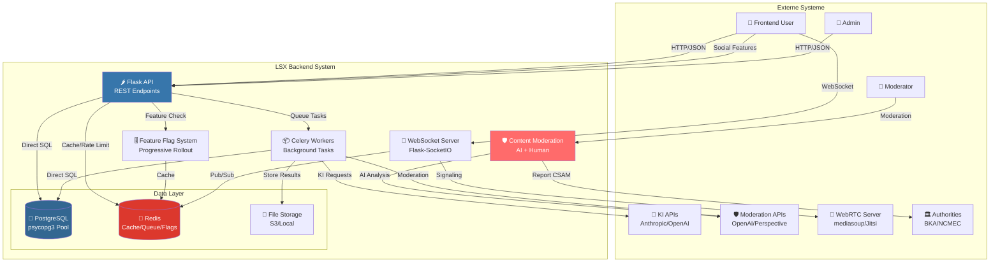
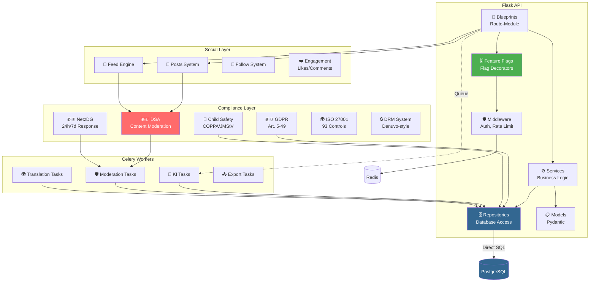
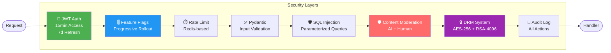

# 17 – Backend-Struktur (Final)

**Version:** 2.0  
**Stand:** 10.01.2026  
**Änderungen:** Complete Enterprise Architecture mit Feature Flags, Social Layer, Full Compliance (DSA/NetzDG/GDPR/ISO 27001/Child Safety/DRM)

---

## Überblick

Dieses Dokument beschreibt die komplette **Enterprise-Grade Backend-Architektur** des LSX Lernsystems.

Das Backend ist **modular**, **sicher**, **skalierbar**, **vollständig compliance-konform** und **feature-flag-gesteuert**.

### 🎯 Neue Features in v2.0

- ✅ **Feature Flag System** - Progressive Rollout (5% → 25% → 100%)
- ✅ **Social Learning Network** - Posts, Feed, Follow, Likes, Comments
- ✅ **Full Compliance** - DSA, NetzDG, GDPR, ISO 27001, Child Safety
- ✅ **Content Moderation** - AI + Human, 24h/7d Response Times
- ✅ **DRM System** - Denuvo-style Protection
- ✅ **Trust & Safety** - Comprehensive Monitoring
- ✅ **Internationalization** - 20+ Languages

### 🛠️ Tech-Stack

| Technologie | Verwendung |
|------------|-----------|
| 🐍 **Python 3.12+** | Core Language |
| 🌶️ **Flask 3.0** | Web Framework (Blueprint-Architektur) |
| 🗃️ **psycopg 3** | PostgreSQL-Treiber mit Connection Pooling (**KEIN ORM**) |
| 🐘 **PostgreSQL** | Datenbank |
| 🔴 **Redis** | Caching, Rate Limits, Sessions, Celery Queue, Feature Flags |
| 📦 **Celery** | Background Tasks (KI-Pipeline, Moderation) |
| 🔌 **Flask-SocketIO** | WebSockets / Real-time (LiveRoom) |
| 🎥 **WebRTC** | Video/Audio (mediasoup/Jitsi) |
| 🔑 **JWT** | Authentication (Flask-JWT-Extended) |
| 📋 **Pydantic** | Request/Response Validation |
| 🤖 **AI Moderation** | OpenAI Moderation API, Perspective API |
| 🔒 **Cryptography** | AES-256-GCM, RSA-4096 (DRM) |

> ⚠️ **WICHTIG:** Dieses Projekt verwendet **KEIN ORM** (kein SQLAlchemy). Alle Datenbankoperationen erfolgen über direktes SQL mit psycopg und dem Repository-Pattern.

---

## 1. System-Architektur (C4 Model - Context)



---

## 2. Backend-Container (C4 Model - Component)



---

## 3. Projektstruktur (Backend-Verzeichnis)

```
/backend
├── /app
│   ├── __init__.py              # 🏭 Factory Pattern (create_app)
│   ├── config.py                # ⚙️ Configuration
│   ├── extensions.py            # 🔌 Flask Extensions
│   │
│   ├── /core                    # 🎯 CORE SYSTEM
│   │   ├── /feature_flags       # ⭐ Feature Flag System
│   │   │   ├── __init__.py
│   │   │   ├── flag_manager.py          # Flag Management Engine
│   │   │   ├── flag_decorators.py       # @require_feature('posts')
│   │   │   ├── flag_middleware.py       # API Flag Check
│   │   │   └── flag_admin.py            # Admin Panel Integration
│   │   │
│   │   ├── /rollout             # Progressive Rollout
│   │   │   ├── percentage_rollout.py    # 10% -> 50% -> 100%
│   │   │   ├── user_segments.py         # Beta Users, Premium First
│   │   │   ├── org_rollout.py           # Per Organization
│   │   │   └── ab_testing.py            # A/B Tests
│   │   │
│   │   └── /configuration       # System Configuration
│   │       ├── feature_config.py
│   │       └── rollout_config.py
│   │
│   ├── /api                     # 🌐 REST API LAYER
│   │   ├── /v1                  # Current API Version
│   │   │   ├── __init__.py
│   │   │   │
│   │   │   ├── # Core API (Public)
│   │   │   ├── auth.py              # /api/v1/auth - Login, Register
│   │   │   ├── users.py             # /api/v1/users - User Management
│   │   │   ├── profile.py           # /api/v1/profile - User Profile
│   │   │   ├── courses.py           # /api/v1/courses - Kurs-Operationen
│   │   │   ├── categories.py        # /api/v1/categories - Kategorien
│   │   │   ├── learning_methods.py  # /api/v1/learning-methods
│   │   │   ├── subscriptions.py     # /api/v1/subscriptions - Premium
│   │   │   ├── tokens.py            # /api/v1/tokens - Token Wallet
│   │   │   ├── organisations.py     # /api/v1/organisations - Org Management
│   │   │   ├── health.py            # /health - Health Checks
│   │   │   │
│   │   │   ├── /dashboard       # Dashboard Package
│   │   │   │   ├── __init__.py
│   │   │   │   ├── widgets.py       # Widget management
│   │   │   │   └── recommendations.py # KI recommendations
│   │   │   │
│   │   │   ├── # Content API
│   │   │   ├── chapter_theory.py    # Kapitel-Theorien
│   │   │   ├── lesson_explanations.py # Lektions-Erklärungen
│   │   │   ├── lesson_videos.py     # Video-Lektionen
│   │   │   ├── exam_simulations.py  # Prüfungs-Simulationen
│   │   │   │
│   │   │   ├── # KI/Tutor API
│   │   │   ├── tutor.py             # /api/v1/tutor - KI-Tutor
│   │   │   ├── agents.py            # Smart Agents
│   │   │   ├── audio.py             # Audio-Processing
│   │   │   ├── tts.py               # Text-to-Speech
│   │   │   ├── math_toolkit.py      # Mathe-Werkzeuge
│   │   │   │
│   │   │   ├── # Analytics API
│   │   │   ├── analytics.py         # User Analytics
│   │   │   ├── org_analytics.py     # Organisation Analytics
│   │   │   │
│   │   │   └── feedback.py          # User Feedback
│   │   │
│   │   ├── /social              # 🌟 SOCIAL API (Feature-Flagged)
│   │   │   ├── __init__.py
│   │   │   ├── posts.py             # 🚩 FLAG: 'user_posts'
│   │   │   ├── feed.py              # 🚩 FLAG: 'feed_system'
│   │   │   ├── follow.py            # 🚩 FLAG: 'follow_system'
│   │   │   ├── likes.py             # 🚩 FLAG: 'likes_reactions'
│   │   │   ├── comments.py          # 🚩 FLAG: 'comments'
│   │   │   ├── shares.py            # 🚩 FLAG: 'content_sharing'
│   │   │   ├── trending.py          # 🚩 FLAG: 'trending_discovery'
│   │   │   ├── hashtags.py          # 🚩 FLAG: 'hashtags'
│   │   │   └── mentions.py          # 🚩 FLAG: 'mentions'
│   │   │
│   │   ├── /community           # Community Features
│   │   │   ├── __init__.py
│   │   │   ├── courses.py           # Course Publishing
│   │   │   ├── groups.py            # Study Groups
│   │   │   ├── forums.py            # Discussion Forums
│   │   │   └── events.py            # Community Events
│   │   │
│   │   ├── /messaging           # 💬 MESSAGING (Feature-Flagged)
│   │   │   ├── __init__.py
│   │   │   ├── direct_messages.py   # 🚩 FLAG: 'direct_messages'
│   │   │   ├── group_chat.py        # 🚩 FLAG: 'group_chat'
│   │   │   ├── notifications.py     # Always enabled
│   │   │   └── mentions.py          # 🚩 FLAG: 'mentions'
│   │   │
│   │   ├── /admin               # 👑 ADMIN API
│   │   │   ├── __init__.py
│   │   │   │
│   │   │   ├── /courses         # Course Management Package
│   │   │   │   ├── courses.py       # Course CRUD
│   │   │   │   ├── chapters.py      # Chapter management
│   │   │   │   ├── lessons.py       # Lesson management
│   │   │   │   ├── exams.py         # Exam management
│   │   │   │   ├── course_prompts.py # Prompt overrides
│   │   │   │   └── course_files.py  # File attachments
│   │   │   │
│   │   │   ├── /ai              # AI Management Package
│   │   │   │   ├── ai_jobs.py       # AI job management
│   │   │   │   ├── ai_models.py     # AI Model Management
│   │   │   │   ├── ai_model_profiles.py # Model Profile CRUD
│   │   │   │   ├── ai_tutor.py      # AI Tutor Functions
│   │   │   │   └── ai_authoring.py  # AI Authoring Pipeline
│   │   │   │
│   │   │   ├── /studio          # AI Studio Package
│   │   │   │   ├── ai_studio.py         # Studio Main
│   │   │   │   ├── ai_studio_chat.py    # Chat Functions
│   │   │   │   ├── ai_studio_generation.py # Content Generation
│   │   │   │   ├── ai_studio_sessions.py # Session Management
│   │   │   │   ├── ai_studio_utils.py    # Utils
│   │   │   │   └── ai_studio_variants.py # Variants Management
│   │   │   │
│   │   │   ├── /moderation      # ⭐ MODERATION PANEL
│   │   │   │   ├── __init__.py
│   │   │   │   ├── queue.py         # Moderation Queue
│   │   │   │   ├── actions.py       # Moderation Actions
│   │   │   │   ├── reports.py       # User Reports
│   │   │   │   ├── statistics.py    # Moderation Stats
│   │   │   │   └── transparency.py  # Transparency Reports
│   │   │   │
│   │   │   ├── /feature_flags   # ⭐ FEATURE FLAG ADMIN
│   │   │   │   ├── __init__.py
│   │   │   │   ├── flags.py         # Flag Management
│   │   │   │   ├── rollout.py       # Rollout Control
│   │   │   │   └── analytics.py     # Feature Analytics
│   │   │   │
│   │   │   ├── users.py             # User Management
│   │   │   ├── analytics.py         # System Analytics
│   │   │   ├── system.py            # System Configuration
│   │   │   ├── prompts.py           # Prompt Management
│   │   │   ├── learning_methods.py  # Learning Methods CRUD
│   │   │   ├── lm_routing.py        # LM Model Routing
│   │   │   ├── course_analytics.py  # Course Analytics
│   │   │   ├── course_ai_settings.py # Course AI Settings
│   │   │   └── course_authoring.py  # Course Authoring
│   │   │
│   │   └── /ai                  # AI Operations API
│   │       ├── __init__.py
│   │       └── ai_course_generator.py
│   │
│   ├── /social                  # 🌟 SOCIAL LAYER (Complete)
│   │   ├── __init__.py
│   │   │
│   │   ├── /posts               # ⭐ USER POSTS SYSTEM
│   │   │   ├── __init__.py
│   │   │   ├── post_manager.py      # Post CRUD
│   │   │   ├── post_types.py        # Course, Portfolio, Achievement, Text
│   │   │   ├── media_handler.py     # Image/Video Upload
│   │   │   ├── draft_manager.py     # Draft Posts
│   │   │   ├── scheduled_posts.py   # Schedule Publishing
│   │   │   └── post_analytics.py    # Post Performance
│   │   │
│   │   ├── /feed                # ⭐ FEED SYSTEM
│   │   │   ├── __init__.py
│   │   │   ├── feed_generator.py    # Personalized Feed
│   │   │   ├── chronological_feed.py # Non-algorithmic Option (DSA)
│   │   │   ├── algorithm_feed.py    # ML-based Ranking
│   │   │   ├── feed_ranking.py      # Ranking Engine
│   │   │   ├── feed_cache.py        # Redis Cache
│   │   │   └── feed_disclosure.py   # DSA: Algorithm Transparency
│   │   │
│   │   ├── /follow              # ⭐ FOLLOW SYSTEM
│   │   │   ├── __init__.py
│   │   │   ├── follow_manager.py    # Follow/Unfollow
│   │   │   ├── followers_service.py # Get Followers
│   │   │   ├── following_service.py # Get Following
│   │   │   ├── suggestions.py       # Who to Follow
│   │   │   └── privacy_controls.py  # Private/Public Profiles
│   │   │
│   │   ├── /engagement          # ⭐ ENGAGEMENT SYSTEM
│   │   │   ├── __init__.py
│   │   │   ├── likes.py             # Like System
│   │   │   ├── reactions.py         # Multiple Reactions (❤️😂👏)
│   │   │   ├── comments.py          # Comment System
│   │   │   ├── replies.py           # Nested Replies
│   │   │   ├── shares.py            # Share/Repost
│   │   │   └── bookmarks.py         # Save for Later
│   │   │
│   │   ├── /profiles            # ⭐ USER PROFILES
│   │   │   ├── __init__.py
│   │   │   ├── profile_manager.py   # Profile CRUD
│   │   │   ├── bio.py               # Bio & About
│   │   │   ├── avatar.py            # Profile Picture
│   │   │   ├── banner.py            # Cover Image
│   │   │   ├── portfolio.py         # Learning Portfolio
│   │   │   ├── achievements.py      # Badges & Certifications
│   │   │   ├── stats.py             # Profile Statistics
│   │   │   └── privacy_settings.py  # Profile Privacy
│   │   │
│   │   ├── /discovery           # ⭐ DISCOVERY SYSTEM
│   │   │   ├── __init__.py
│   │   │   ├── trending.py          # Trending Posts/Users/Courses
│   │   │   ├── explore.py           # Explore Page
│   │   │   ├── recommendations.py   # Content Recommendations
│   │   │   ├── hashtags.py          # Hashtag System
│   │   │   ├── search.py            # Full-text Search
│   │   │   └── categories.py        # Category Browser
│   │   │
│   │   ├── /notifications       # ⭐ NOTIFICATION SYSTEM
│   │   │   ├── __init__.py
│   │   │   ├── notification_manager.py # Notification Engine
│   │   │   ├── realtime.py          # WebSocket Notifications
│   │   │   ├── push_notifications.py # Mobile Push
│   │   │   ├── email_notifications.py # Email Digests
│   │   │   └── preferences.py       # User Preferences
│   │   │
│   │   └── /analytics           # ⭐ SOCIAL ANALYTICS
│   │       ├── __init__.py
│   │       ├── engagement_metrics.py # Likes, Comments, Shares
│   │       ├── reach_metrics.py     # Impressions, Reach
│   │       ├── audience_insights.py # Follower Demographics
│   │       └── performance_tracking.py # Post Performance
│   │
│   ├── /compliance              # ⚖️ COMPLIANCE LAYER (Complete)
│   │   ├── __init__.py
│   │   │
│   │   ├── /dsa                 # 🇪🇺 DIGITAL SERVICES ACT (Full)
│   │   │   ├── __init__.py
│   │   │   │
│   │   │   ├── /content_moderation # ⭐ CONTENT MODERATION (DSA Art. 14-16)
│   │   │   │   ├── __init__.py
│   │   │   │   ├── moderation_engine.py    # Main Engine
│   │   │   │   ├── ai_moderator.py         # AI Pre-screening
│   │   │   │   ├── human_review.py         # Human Moderator Queue
│   │   │   │   ├── priority_system.py      # Critical/High/Medium/Low
│   │   │   │   ├── automated_actions.py    # Auto-hide/delete
│   │   │   │   ├── appeal_process.py       # User Appeals (DSA Art. 17)
│   │   │   │   └── review_decisions.py     # Decision Tracking
│   │   │   │
│   │   │   ├── /ai_detection   # ⭐ AI CONTENT ANALYSIS
│   │   │   │   ├── __init__.py
│   │   │   │   ├── text_analyzer.py        # Toxicity, Hate Speech
│   │   │   │   ├── image_analyzer.py       # NSFW, Violence
│   │   │   │   ├── spam_detector.py        # Spam Detection
│   │   │   │   ├── bot_detector.py         # Bot/Fake Accounts
│   │   │   │   ├── deepfake_detector.py    # Deepfake Detection
│   │   │   │   └── misinformation.py       # Fact-checking
│   │   │   │
│   │   │   ├── /reporting      # ⭐ USER REPORTING (DSA Art. 14)
│   │   │   │   ├── __init__.py
│   │   │   │   ├── report_handler.py       # Report Processing
│   │   │   │   ├── report_categories.py    # Hate/Harassment/Spam
│   │   │   │   ├── evidence_collection.py  # Screenshots, Links
│   │   │   │   ├── reporter_protection.py  # Anonymous Reporting
│   │   │   │   └── status_tracking.py      # Report Status
│   │   │   │
│   │   │   ├── /transparency   # ⭐ TRANSPARENCY (DSA Art. 13, 15)
│   │   │   │   ├── __init__.py
│   │   │   │   ├── terms_of_service.py     # ToS Management
│   │   │   │   ├── community_guidelines.py # Content Policies
│   │   │   │   ├── moderation_logs.py      # Public Moderation Logs
│   │   │   │   ├── transparency_reports.py # Quarterly Reports
│   │   │   │   ├── removal_reasons.py      # Why content removed
│   │   │   │   └── statistics.py           # Public Statistics
│   │   │   │
│   │   │   ├── /algorithm_transparency # ⭐ RECOMMENDER (DSA Art. 24)
│   │   │   │   ├── __init__.py
│   │   │   │   ├── algorithm_disclosure.py # How Feed Works
│   │   │   │   ├── parameters_explanation.py # Main Parameters
│   │   │   │   ├── user_controls.py        # User Can Control Feed
│   │   │   │   ├── chronological_option.py # Non-algorithmic Option
│   │   │   │   └── preference_settings.py  # User Preferences
│   │   │   │
│   │   │   └── /crisis_response # ⭐ CRISIS PROTOCOL (VLOP only)
│   │   │       ├── __init__.py
│   │   │       ├── crisis_detection.py     # Viral Harmful Content
│   │   │       ├── emergency_response.py   # Immediate Actions
│   │   │       └── coordination.py         # Authorities Coordination
│   │   │
│   │   ├── /netzdg              # 🇩🇪 NETZWERKDURCHSETZUNGSGESETZ (Full)
│   │   │   ├── __init__.py
│   │   │   │
│   │   │   ├── /illegal_content # ⭐ GERMAN ILLEGAL CONTENT
│   │   │   │   ├── __init__.py
│   │   │   │   ├── hate_speech.py          # § 130 StGB - Volksverhetzung
│   │   │   │   ├── insult.py               # § 185 StGB - Beleidigung
│   │   │   │   ├── defamation.py           # § 186/187 StGB - Verleumdung
│   │   │   │   ├── threat.py               # § 241 StGB - Bedrohung
│   │   │   │   ├── violence.py             # § 131 StGB - Gewaltdarstellung
│   │   │   │   ├── csam_detection.py       # § 184b StGB - CSAM (CRITICAL!)
│   │   │   │   └── stgb_catalog.py         # Full StGB Catalog
│   │   │   │
│   │   │   ├── /response_times # ⭐ BEARBEITUNGSFRISTEN
│   │   │   │   ├── __init__.py
│   │   │   │   ├── sla_manager.py          # Service Level Agreement
│   │   │   │   ├── urgent_24h.py           # Offensichtlich illegal (24h)
│   │   │   │   ├── standard_7d.py          # Komplex illegal (7 Tage)
│   │   │   │   ├── escalation.py           # Escalation Process
│   │   │   │   └── monitoring.py           # SLA Monitoring
│   │   │   │
│   │   │   ├── /transparency_reports # ⭐ HALBJÄHRLICHE BERICHTE
│   │   │   │   ├── __init__.py
│   │   │   │   ├── report_generator.py     # Auto-generation
│   │   │   │   ├── statistics.py           # Report Statistics
│   │   │   │   ├── publication.py          # Public Publication
│   │   │   │   └── deadlines.py            # Jan 31 / Jul 31
│   │   │   │
│   │   │   ├── /reporting_mechanism # MELDEVERFAHREN
│   │   │   │   ├── __init__.py
│   │   │   │   ├── report_form.py          # Meldeformular
│   │   │   │   ├── documentation.py        # Dokumentation
│   │   │   │   ├── confirmation.py         # Eingangsbestätigung
│   │   │   │   └── tracking.py             # Fristen-Tracking
│   │   │   │
│   │   │   └── /representative # ⭐ ZUSTELLUNGSBEVOLLMÄCHTIGTER
│   │   │       ├── __init__.py
│   │   │       ├── contact_info.py         # German Representative
│   │   │       └── legal_requests.py       # Handle Legal Requests
│   │   │
│   │   ├── /child_safety        # 👶 CHILD PROTECTION (Multi-Country)
│   │   │   ├── __init__.py
│   │   │   │
│   │   │   ├── /age_verification # ⭐ ALTERSVERIFIKATION
│   │   │   │   ├── __init__.py
│   │   │   │   ├── age_gate.py             # Age Entry
│   │   │   │   ├── verification_methods.py # ID/Credit Card/Face
│   │   │   │   ├── parental_consent.py     # COPPA (< 13 USA)
│   │   │   │   ├── age_estimation.py       # AI Age Estimation
│   │   │   │   └── document_verification.py # ID Document Check
│   │   │   │
│   │   │   ├── /content_filtering # ⭐ AGE-APPROPRIATE CONTENT
│   │   │   │   ├── __init__.py
│   │   │   │   ├── age_rating.py           # Content Age Rating
│   │   │   │   ├── safe_search.py          # Safe Search Filter
│   │   │   │   ├── restricted_mode.py      # Kids Mode
│   │   │   │   ├── content_warnings.py     # Content Warnings
│   │   │   │   └── automatic_blur.py       # Auto-blur NSFW
│   │   │   │
│   │   │   ├── /parental_controls # ⭐ PARENTAL FEATURES
│   │   │   │   ├── __init__.py
│   │   │   │   ├── family_link.py          # Parent Dashboard
│   │   │   │   ├── screen_time.py          # Usage Limits
│   │   │   │   ├── content_approval.py     # Pre-approval
│   │   │   │   ├── activity_reports.py     # Activity Monitoring
│   │   │   │   ├── messaging_controls.py   # Who Can Message
│   │   │   │   └── notification_alerts.py  # Parent Alerts
│   │   │   │
│   │   │   ├── /grooming_prevention # ⭐ ONLINE GROOMING PROTECTION
│   │   │   │   ├── __init__.py
│   │   │   │   ├── pattern_detection.py    # Suspicious Patterns
│   │   │   │   ├── age_gap_limits.py       # Adult-Child Contact Limits
│   │   │   │   ├── private_messaging_rules.py # DM Restrictions
│   │   │   │   ├── keyword_monitoring.py   # Grooming Keywords
│   │   │   │   ├── alert_system.py         # Alert Parents/Authorities
│   │   │   │   └── reporting.py            # Report to NCMEC/BKA
│   │   │   │
│   │   │   └── /education      # Safety Education
│   │   │       ├── __init__.py
│   │   │       ├── safety_tips.py
│   │   │       ├── reporting_guide.py
│   │   │       └── resources.py
│   │   │
│   │   ├── /gdpr                # 🇪🇺 GDPR (Complete - Art. 5-49)
│   │   │   ├── __init__.py
│   │   │   │
│   │   │   ├── /principles      # Art. 5 - Grundsätze
│   │   │   │   ├── __init__.py
│   │   │   │   ├── lawfulness.py           # Rechtmäßigkeit
│   │   │   │   ├── purpose_limitation.py   # Zweckbindung
│   │   │   │   ├── data_minimization.py    # Datenminimierung
│   │   │   │   ├── accuracy.py             # Richtigkeit
│   │   │   │   ├── storage_limitation.py   # Speicherbegrenzung
│   │   │   │   └── integrity_confidentiality.py # Sicherheit
│   │   │   │
│   │   │   ├── /legal_basis     # Art. 6 - Rechtsgrundlagen
│   │   │   │   ├── __init__.py
│   │   │   │   ├── consent.py              # Einwilligung
│   │   │   │   ├── contract.py             # Vertragserfüllung
│   │   │   │   ├── legal_obligation.py     # Rechtliche Verpflichtung
│   │   │   │   └── legitimate_interest.py  # Berechtigtes Interesse
│   │   │   │
│   │   │   ├── /consent         # ⭐ Art. 7 - Einwilligungsverwaltung
│   │   │   │   ├── __init__.py
│   │   │   │   ├── consent_manager.py      # Hauptverwaltung
│   │   │   │   ├── consent_storage.py      # Dokumentation
│   │   │   │   ├── withdrawal.py           # Widerruf
│   │   │   │   ├── granular_consent.py     # Zweckspezifisch
│   │   │   │   └── consent_ui.py           # UI-Komponenten
│   │   │   │
│   │   │   ├── /children        # Art. 8 - Kinderschutz
│   │   │   │   ├── __init__.py
│   │   │   │   ├── age_verification.py
│   │   │   │   └── parental_consent.py
│   │   │   │
│   │   │   ├── /data_subject_rights # ⭐ Art. 15-22 - Betroffenenrechte
│   │   │   │   ├── __init__.py
│   │   │   │   ├── access.py               # Art. 15 - Auskunftsrecht
│   │   │   │   ├── rectification.py        # Art. 16 - Berichtigung
│   │   │   │   ├── erasure.py              # ⭐ Art. 17 - Löschung
│   │   │   │   ├── restriction.py          # Art. 18 - Einschränkung
│   │   │   │   ├── portability.py          # ⭐ Art. 20 - Datenübertragbarkeit
│   │   │   │   ├── objection.py            # Art. 21 - Widerspruch
│   │   │   │   └── automated_decision.py   # Art. 22 - Automatisierung
│   │   │   │
│   │   │   ├── /privacy_by_design # ⭐ Art. 25 - Privacy by Design
│   │   │   │   ├── __init__.py
│   │   │   │   ├── default_settings.py
│   │   │   │   ├── pseudonymization.py
│   │   │   │   ├── anonymization.py
│   │   │   │   └── minimization.py
│   │   │   │
│   │   │   ├── /processing_records # Art. 30 - Verarbeitungsverzeichnis
│   │   │   │   ├── __init__.py
│   │   │   │   ├── registry.py
│   │   │   │   ├── documentation.py
│   │   │   │   └── generator.py
│   │   │   │
│   │   │   ├── /breach_management # ⭐ Art. 33-34 - Datenpannen
│   │   │   │   ├── __init__.py
│   │   │   │   ├── breach_detector.py      # Automatische Erkennung
│   │   │   │   ├── breach_notification.py  # 72h Meldung
│   │   │   │   ├── authority_notification.py # Aufsichtsbehörde
│   │   │   │   ├── user_notification.py    # Betroffenen-Benachrichtigung
│   │   │   │   └── breach_log.py           # Dokumentation
│   │   │   │
│   │   │   ├── /dpia            # Art. 35 - Datenschutz-Folgenabschätzung
│   │   │   │   ├── __init__.py
│   │   │   │   ├── dpia_manager.py         # ⭐ DPIA Workflow
│   │   │   │   ├── risk_assessment.py      # Risikobewertung
│   │   │   │   ├── mitigation.py           # Abhilfemaßnahmen
│   │   │   │   └── documentation.py        # DPIA-Dokumentation
│   │   │   │
│   │   │   ├── /transfers       # Art. 44-49 - Internationale Übermittlungen
│   │   │   │   ├── __init__.py
│   │   │   │   ├── adequacy_decision.py    # EU-Angemessenheitsbeschluss
│   │   │   │   ├── standard_clauses.py     # SCC
│   │   │   │   └── bcr.py                  # Binding Corporate Rules
│   │   │   │
│   │   │   ├── /dpo             # Art. 37 - Datenschutzbeauftragter
│   │   │   │   ├── __init__.py
│   │   │   │   ├── dpo_tools.py
│   │   │   │   ├── monitoring.py
│   │   │   │   └── reporting.py
│   │   │   │
│   │   │   └── /social_data     # ⭐ Social Media spezifisch
│   │   │       ├── __init__.py
│   │   │       ├── post_deletion.py        # Alle Posts löschen
│   │   │       ├── comment_deletion.py     # Alle Kommentare löschen
│   │   │       ├── like_deletion.py        # Alle Likes löschen
│   │   │       ├── follower_deletion.py    # Social Graph löschen
│   │   │       ├── message_deletion.py     # Nachrichten löschen
│   │   │       └── social_export.py        # Social Data exportieren
│   │   │
│   │   ├── /iso27001            # 🌍 ISO 27001:2022 (Complete)
│   │   │   ├── __init__.py
│   │   │   │
│   │   │   ├── /isms            # ⭐ ISMS Core (Clauses 4-10)
│   │   │   │   ├── __init__.py
│   │   │   │   ├── isms_framework.py       # Main Framework
│   │   │   │   ├── context.py              # Clause 4 - Context
│   │   │   │   ├── scope.py                # ISMS Scope
│   │   │   │   ├── leadership.py           # Clause 5 - Leadership
│   │   │   │   ├── planning.py             # Clause 6 - Planning
│   │   │   │   ├── support.py              # Clause 7 - Support
│   │   │   │   ├── operation.py            # Clause 8 - Operation
│   │   │   │   ├── performance.py          # Clause 9 - Performance
│   │   │   │   └── improvement.py          # Clause 10 - Improvement
│   │   │   │
│   │   │   ├── /risk_management # ⭐ Risk Assessment & Treatment
│   │   │   │   ├── __init__.py
│   │   │   │   ├── risk_assessment.py      # Risk Identification
│   │   │   │   ├── risk_analysis.py        # Risk Analysis
│   │   │   │   ├── risk_evaluation.py      # Risk Evaluation
│   │   │   │   ├── risk_treatment.py       # Treatment Plan
│   │   │   │   ├── risk_register.py        # Risk Register
│   │   │   │   ├── risk_monitoring.py      # Monitoring
│   │   │   │   └── risk_reporting.py       # Reporting
│   │   │   │
│   │   │   ├── /controls        # Annex A Controls (93 controls)
│   │   │   │   ├── /a05_organizational
│   │   │   │   ├── /a06_people
│   │   │   │   ├── /a07_physical
│   │   │   │   ├── /a08_technological
│   │   │   │   ├── /a09_access_control  # ⭐ PRIORITY HIGH
│   │   │   │   ├── /a10_cryptography    # ⭐ PRIORITY HIGH
│   │   │   │   ├── /a11_physical_security
│   │   │   │   ├── /a12_operations      # ⭐ PRIORITY HIGH
│   │   │   │   ├── /a13_communications
│   │   │   │   ├── /a14_acquisition
│   │   │   │   ├── /a15_supplier
│   │   │   │   ├── /a16_incident        # ⭐ PRIORITY HIGH
│   │   │   │   ├── /a17_business_continuity # ⭐ PRIORITY MEDIUM
│   │   │   │   └── /a18_compliance
│   │   │   │
│   │   │   ├── /audit           # Internal Audits
│   │   │   │   ├── __init__.py
│   │   │   │   ├── audit_scheduler.py
│   │   │   │   ├── audit_execution.py
│   │   │   │   ├── audit_reporting.py
│   │   │   │   └── audit_logger.py         # ⭐ Audit Trail
│   │   │   │
│   │   │   └── /certification   # Certification Support
│   │   │       ├── __init__.py
│   │   │       ├── evidence_collector.py
│   │   │       ├── gap_analysis.py
│   │   │       ├── documentation.py
│   │   │       └── readiness_check.py
│   │   │
│   │   ├── /iso25010            # 📊 ISO 25010 - Software Quality
│   │   │   ├── __init__.py
│   │   │   ├── /characteristics
│   │   │   │   ├── functional_suitability.py
│   │   │   │   ├── performance_efficiency.py
│   │   │   │   ├── compatibility.py
│   │   │   │   ├── usability.py
│   │   │   │   ├── reliability.py
│   │   │   │   ├── security.py
│   │   │   │   ├── maintainability.py
│   │   │   │   └── portability.py
│   │   │   │
│   │   │   └── /metrics
│   │   │       ├── code_metrics.py         # Cyclomatic Complexity
│   │   │       ├── test_metrics.py         # Coverage, Pass Rate
│   │   │       ├── performance_metrics.py  # Response Time
│   │   │       └── quality_dashboard.py
│   │   │
│   │   ├── /iso29119            # 🧪 ISO 29119 - Testing
│   │   │   ├── __init__.py
│   │   │   ├── /strategies
│   │   │   │   ├── test_strategy.py
│   │   │   │   ├── test_planning.py
│   │   │   │   └── test_design.py
│   │   │   │
│   │   │   ├── /coverage
│   │   │   │   ├── code_coverage.py        # ⭐ 85%+ Target
│   │   │   │   ├── branch_coverage.py
│   │   │   │   └── mutation_testing.py
│   │   │   │
│   │   │   └── /reporting
│   │   │       ├── test_reports.py
│   │   │       └── quality_dashboard.py
│   │   │
│   │   ├── /owasp               # 🛡️ OWASP Top 10
│   │   │   ├── __init__.py
│   │   │   ├── a01_broken_access.py
│   │   │   ├── a02_crypto_failures.py
│   │   │   ├── a03_injection.py
│   │   │   ├── a04_insecure_design.py
│   │   │   ├── a05_misconfiguration.py
│   │   │   ├── a06_vulnerable_components.py
│   │   │   ├── a07_auth_failures.py
│   │   │   ├── a08_integrity_failures.py
│   │   │   ├── a09_logging_failures.py
│   │   │   └── a10_ssrf.py
│   │   │
│   │   └── /cert                # 🔐 CERT Secure Coding
│   │       ├── __init__.py
│   │       ├── input_validation.py
│   │       ├── expressions.py
│   │       ├── integers.py
│   │       ├── strings.py
│   │       └── memory_management.py
│   │
│   ├── /security                # 🔒 SECURITY LAYER
│   │   ├── __init__.py
│   │   │
│   │   ├── /drm                 # ⭐ DRM SYSTEM (Denuvo-Style)
│   │   │   ├── __init__.py
│   │   │   │
│   │   │   ├── /core
│   │   │   │   ├── __init__.py
│   │   │   │   ├── drm_engine.py           # Main DRM Engine
│   │   │   │   ├── protection_layer.py     # Protection Orchestration
│   │   │   │   ├── security_context.py     # Security Context Manager
│   │   │   │   └── drm_config.py           # DRM Configuration
│   │   │   │
│   │   │   ├── /encryption
│   │   │   │   ├── __init__.py
│   │   │   │   ├── aes_cipher.py           # AES-256-GCM
│   │   │   │   ├── rsa_cipher.py           # RSA-4096
│   │   │   │   ├── key_manager.py          # Key Rotation
│   │   │   │   ├── key_derivation.py       # PBKDF2 + HKDF
│   │   │   │   ├── hardware_crypto.py      # Hardware-bound Keys
│   │   │   │   └── crypto_primitives.py    # Low-level Crypto
│   │   │   │
│   │   │   ├── /license
│   │   │   │   ├── __init__.py
│   │   │   │   ├── license_generator.py    # License Generation
│   │   │   │   ├── license_validator.py    # Online + Offline
│   │   │   │   ├── license_server.py       # HA License Server
│   │   │   │   ├── license_types.py        # License Types
│   │   │   │   ├── hwid_generator.py       # Hardware ID
│   │   │   │   ├── device_manager.py       # Device Binding (Max 3)
│   │   │   │   ├── offline_license.py      # Offline Grace (7 days)
│   │   │   │   └── license_renewal.py      # Automatic Renewal
│   │   │   │
│   │   │   ├── /anti_tamper
│   │   │   │   ├── __init__.py
│   │   │   │   ├── integrity_checker.py    # Code Integrity (SHA-256)
│   │   │   │   ├── checksum_validator.py   # Runtime Validation
│   │   │   │   ├── debugger_detection.py   # Anti-Debug
│   │   │   │   ├── vm_detection.py         # VM Detection
│   │   │   │   ├── memory_protection.py    # Memory Encryption
│   │   │   │   ├── code_obfuscation.py     # Bytecode Obfuscation
│   │   │   │   ├── runtime_guard.py        # Runtime Integrity Monitor
│   │   │   │   └── tamper_response.py      # Tamper Response Actions
│   │   │   │
│   │   │   ├── /watermarking
│   │   │   │   ├── __init__.py
│   │   │   │   ├── visible_watermark.py    # Visible Username
│   │   │   │   ├── invisible_watermark.py  # Steganography (LSB)
│   │   │   │   ├── forensic_watermark.py   # User ID + Timestamp
│   │   │   │   ├── watermark_extractor.py  # Leak Source ID
│   │   │   │   ├── digital_signature.py    # RSA Content Signing
│   │   │   │   └── video_watermark.py      # Video Watermarking
│   │   │   │
│   │   │   ├── /access_control
│   │   │   │   ├── __init__.py
│   │   │   │   ├── drm_middleware.py       # DRM Check Middleware
│   │   │   │   ├── content_gate.py         # Content Access Gate
│   │   │   │   ├── session_validator.py    # Session-bound Access
│   │   │   │   ├── access_logger.py        # Audit Trail
│   │   │   │   └── rate_limiter.py         # DRM Rate Limiting
│   │   │   │
│   │   │   ├── /monitoring
│   │   │   │   ├── __init__.py
│   │   │   │   ├── drm_monitor.py          # Health Monitoring
│   │   │   │   ├── violation_detector.py   # Piracy Detection
│   │   │   │   ├── alert_manager.py        # Real-time Alerts
│   │   │   │   ├── analytics.py            # DRM Analytics
│   │   │   │   └── forensics.py            # Forensic Analysis
│   │   │   │
│   │   │   └── /streaming
│   │   │       ├── __init__.py
│   │   │       ├── hls_encryptor.py        # HLS AES-128
│   │   │       ├── dash_encryptor.py       # MPEG-DASH
│   │   │       └── token_generator.py      # Streaming Tokens
│   │   │
│   │   ├── /auth                # Authentication
│   │   │   ├── __init__.py
│   │   │   ├── jwt_handler.py
│   │   │   ├── password_hasher.py
│   │   │   └── token_manager.py
│   │   │
│   │   ├── /rbac                # Role-Based Access Control
│   │   │   ├── __init__.py
│   │   │   ├── role_manager.py
│   │   │   ├── permission_checker.py
│   │   │   └── decorators.py
│   │   │
│   │   ├── /middleware          # Security Middleware
│   │   │   ├── __init__.py
│   │   │   ├── auth_middleware.py
│   │   │   ├── rate_limiter.py
│   │   │   └── input_validator.py
│   │   │
│   │   └── /encryption          # General Encryption
│   │       ├── __init__.py
│   │       ├── field_encryption.py
│   │       └── token_encryption.py
│   │
│   ├── /ai                      # 🤖 AI LAYER (Extended)
│   │   ├── __init__.py
│   │   │
│   │   ├── /content_moderation  # ⭐ AI MODERATION
│   │   │   ├── __init__.py
│   │   │   ├── text_classifier.py      # Hate/Toxicity/NSFW
│   │   │   ├── image_classifier.py     # NSFW Images
│   │   │   ├── video_analyzer.py       # Video Content
│   │   │   ├── audio_analyzer.py       # Audio Content
│   │   │   ├── context_analyzer.py     # Context-aware
│   │   │   ├── multilingual.py         # Multi-language
│   │   │   └── false_positive_reduction.py
│   │   │
│   │   ├── /recommendation      # ⭐ FEED ALGORITHM
│   │   │   ├── __init__.py
│   │   │   ├── content_recommender.py  # Content Recommendations
│   │   │   ├── user_matching.py        # Follow Suggestions
│   │   │   ├── trending_detector.py    # Trending Detection
│   │   │   ├── personalization.py      # Personalized Feed
│   │   │   └── explainability.py       # "Why this content?"
│   │   │
│   │   ├── /safety              # ⭐ AI SAFETY
│   │   │   ├── __init__.py
│   │   │   ├── grooming_detector.py    # Grooming Detection
│   │   │   ├── crisis_detector.py      # Self-harm/Crisis
│   │   │   ├── radicalization.py       # Radicalization Patterns
│   │   │   └── intervention.py         # Proactive Intervention
│   │   │
│   │   └── /generation          # Content Generation (existing)
│   │       ├── __init__.py
│   │       └── ai_course_generator.py
│   │
│   ├── /monitoring              # 📊 MONITORING & OBSERVABILITY
│   │   ├── __init__.py
│   │   │
│   │   ├── /trust_safety        # ⭐ TRUST & SAFETY DASHBOARD
│   │   │   ├── __init__.py
│   │   │   ├── moderator_dashboard.py  # Moderation Dashboard
│   │   │   ├── queue_management.py     # Review Queue
│   │   │   ├── moderator_tools.py      # Moderator Actions
│   │   │   ├── user_history.py         # User Violation History
│   │   │   ├── pattern_detection.py    # Abuse Patterns
│   │   │   └── analytics.py            # T&S Analytics
│   │   │
│   │   ├── /feature_analytics   # ⭐ FEATURE USAGE TRACKING
│   │   │   ├── __init__.py
│   │   │   ├── feature_usage.py        # Track Feature Usage
│   │   │   ├── rollout_metrics.py      # Rollout Performance
│   │   │   ├── ab_testing.py           # A/B Test Results
│   │   │   └── user_feedback.py        # User Feedback
│   │   │
│   │   ├── /metrics             # Platform Metrics
│   │   │   ├── __init__.py
│   │   │   └── metrics_collector.py
│   │   │
│   │   ├── /logging             # Logging
│   │   │   ├── __init__.py
│   │   │   └── logger.py
│   │   │
│   │   ├── /tracing             # Distributed Tracing
│   │   │   ├── __init__.py
│   │   │   └── tracer.py
│   │   │
│   │   └── /alerting            # Alerting
│   │       ├── __init__.py
│   │       └── alert_manager.py
│   │
│   ├── /i18n                    # 🌍 Internationalization (existing)
│   │   ├── __init__.py
│   │   └── /locales
│   │
│   ├── /models                  # 📋 Pydantic Models (Validation)
│   │   ├── __init__.py
│   │   ├── user.py
│   │   ├── course.py
│   │   ├── learning_method.py
│   │   ├── social_post.py       # ⭐ NEW
│   │   ├── social_comment.py    # ⭐ NEW
│   │   ├── moderation_report.py # ⭐ NEW
│   │   └── ... (existing models)
│   │
│   ├── /repositories            # 🗄️ Database Access Layer
│   │   ├── __init__.py
│   │   ├── base_repository.py   # 🔧 Connection Pool Management
│   │   │
│   │   ├── # Existing Repositories (36 files)
│   │   ├── user_repository.py
│   │   ├── course_repository.py
│   │   ├── ... (all existing)
│   │   │
│   │   ├── # NEW: Social Repositories
│   │   ├── social_post_repository.py
│   │   ├── social_comment_repository.py
│   │   ├── social_like_repository.py
│   │   ├── social_follow_repository.py
│   │   ├── social_feed_repository.py
│   │   │
│   │   ├── # NEW: Compliance Repositories
│   │   ├── moderation_report_repository.py
│   │   ├── moderation_action_repository.py
│   │   ├── user_violation_repository.py
│   │   ├── gdpr_consent_repository.py
│   │   ├── gdpr_deletion_repository.py
│   │   ├── feature_flag_repository.py
│   │   └── ... (more repositories)
│   │
│   ├── /services                # ⚙️ Business Logic
│   │   ├── __init__.py
│   │   │
│   │   ├── # Existing Services
│   │   ├── auth_service.py
│   │   ├── course_service.py
│   │   ├── ... (all existing)
│   │   │
│   │   ├── # NEW: Social Services
│   │   ├── post_service.py
│   │   ├── feed_service.py
│   │   ├── follow_service.py
│   │   ├── engagement_service.py
│   │   │
│   │   ├── # NEW: Compliance Services
│   │   ├── moderation_service.py
│   │   ├── gdpr_service.py
│   │   ├── child_safety_service.py
│   │   └── feature_flag_service.py
│   │
│   ├── /tasks                   # 📦 Celery Background Tasks
│   │   ├── __init__.py
│   │   ├── ki_tasks.py          # Existing KI Tasks
│   │   ├── translation_tasks.py # Existing Translation Tasks
│   │   ├── moderation_tasks.py  # ⭐ NEW: Moderation Tasks
│   │   ├── cleanup_tasks.py     # ⭐ NEW: Data Cleanup Tasks
│   │   └── compliance_tasks.py  # ⭐ NEW: Compliance Tasks
│   │
│   ├── /websocket               # 🔌 WebSocket Handlers
│   │   ├── __init__.py
│   │   ├── liveroom_socket.py   # Existing LiveRoom
│   │   └── notification_socket.py # ⭐ NEW: Real-time Notifications
│   │
│   └── /utils                   # 🛠️ Utilities
│       ├── __init__.py
│       └── ... (existing utils)
│
├── /infrastructure              # 🏗️ Infrastructure Layer
│   ├── /docker
│   ├── /kubernetes
│   └── /terraform
│
├── /tests                       # 🧪 Complete Test Suite
│   ├── /unit
│   ├── /integration
│   ├── /e2e
│   ├── /compliance             # ⭐ NEW: Compliance Tests
│   ├── /security               # ⭐ NEW: Security Tests
│   └── /performance            # ⭐ NEW: Performance Tests
│
├── /scripts                     # 📜 Management Scripts
│   ├── /migration
│   ├── /deployment
│   └── /maintenance
│
├── /docs                        # 📚 Documentation
│   ├── /api
│   ├── /architecture
│   ├── /compliance
│   ├── /security
│   └── /deployment
│
├── /compliance_evidence         # ⭐ Evidence for Audits
│   ├── /gdpr
│   ├── /iso27001
│   ├── /dsa
│   ├── /netzdg
│   └── /audits
│
├── app.py                       # 🎯 Application Entry Point
├── wsgi.py                      # 🚀 WSGI Server Entry
├── manage.py                    # 🔧 Management CLI
├── requirements.txt             # 📦 Python Dependencies
└── README.md                    # 📖 Project README
```

---

## 4. Feature Flag System

### 🎚️ Feature Flags Implementation

```python
# app/core/feature_flags/flag_decorators.py

from functools import wraps
from flask import jsonify, g
from app.core.feature_flags.flag_manager import FeatureFlagManager

def require_feature(feature_name, user_segment=None):
    """
    Decorator to check if feature is enabled
    
    Usage:
        @require_feature('user_posts')
        def create_post():
            ...
    """
    def decorator(f):
        @wraps(f)
        def decorated_function(*args, **kwargs):
            flag_manager = FeatureFlagManager()
            
            is_enabled = flag_manager.is_enabled(
                feature_name,
                user_id=g.get('user_id'),
                organization_id=g.get('organization_id'),
                user_segment=user_segment
            )
            
            if not is_enabled:
                return jsonify({
                    'error': 'Feature not available',
                    'feature': feature_name,
                    'message': f'Feature "{feature_name}" is not yet available.'
                }), 403
            
            return f(*args, **kwargs)
        
        return decorated_function
    return decorator


# Example Usage in API:
from app.core.feature_flags.flag_decorators import require_feature

@bp.route('/api/social/posts', methods=['POST'])
@require_auth()
@require_feature('user_posts')  # ⭐ FEATURE FLAG CHECK
def create_post():
    """Create a new post - only if user_posts feature is enabled"""
    data = request.get_json()
    
    post = PostService.create_post(
        user_id=g.user_id,
        content=data.get('content'),
        post_type=data.get('type')
    )
    
    return jsonify(post), 201
```

### 🎚️ Feature Flags Overview

```python
# Initial State: ALL DISABLED
FEATURE_FLAGS = {
    # Social Core
    'user_posts': False,              # User can create posts
    'feed_system': False,             # Personalized feed
    'follow_system': False,           # Follow/Unfollow users
    'likes_reactions': False,         # Like/React to content
    'comments': True,                 # Comments (partially enabled for courses)
    'shares': False,                  # Share/Repost content
    'bookmarks': False,               # Save for later
    
    # Discovery
    'trending_discovery': False,      # Trending page
    'hashtags': False,                # Hashtag system
    'mentions': False,                # @mentions
    'explore_page': False,            # Explore feed
    
    # Messaging
    'direct_messages': False,         # 1-on-1 DMs
    'group_chat': True,               # Group chat (already enabled)
    
    # Moderation Features
    'ai_moderation': True,            # AI pre-screening (always on)
    'human_moderation': False,        # Human review queue
    'community_moderation': False,    # Community reporting
    
    # Analytics
    'social_analytics': False,        # Post analytics for users
    'audience_insights': False,       # Follower demographics
    
    # Compliance Features
    'dsa_transparency': False,        # DSA transparency features
    'netzdg_reporting': False,        # NetzDG reporting
    'child_safety_strict': True,      # Child safety (always on)
}
```

### 📊 Progressive Rollout Strategy

```
Month 3: Internal Beta (5% rollout)
  └─> 1 Moderator, 100-500 users

Month 4-5: Beta Expansion (25% rollout)
  └─> 2 Moderators, 1,000-5,000 users

Month 6+: Public Launch (100%)
  └─> 3-5 Moderators, 10,000+ users
```

---

## 5. Database Schema Extensions

### 📊 NEW: Social Tables

```sql
-- Feature Flags
CREATE TABLE feature_flags (
    flag_id UUID PRIMARY KEY DEFAULT gen_random_uuid(),
    name VARCHAR(100) UNIQUE NOT NULL,
    is_enabled BOOLEAN DEFAULT FALSE,
    description TEXT,
    category VARCHAR(50),
    created_at TIMESTAMP DEFAULT NOW()
);

CREATE TABLE feature_flag_rollouts (
    rollout_id UUID PRIMARY KEY DEFAULT gen_random_uuid(),
    feature_name VARCHAR(100) REFERENCES feature_flags(name),
    percentage INTEGER DEFAULT 0,  -- 0-100
    created_at TIMESTAMP DEFAULT NOW(),
    updated_at TIMESTAMP DEFAULT NOW()
);

-- Social Posts
CREATE TABLE social_posts (
    post_id UUID PRIMARY KEY DEFAULT gen_random_uuid(),
    user_id UUID REFERENCES users(user_id),
    post_type VARCHAR(50) NOT NULL,  -- 'course', 'portfolio', 'achievement', 'text'
    content TEXT,
    media_urls JSONB,
    visibility VARCHAR(20) DEFAULT 'public',  -- 'public', 'followers', 'private'
    
    -- Engagement Counters
    likes_count INTEGER DEFAULT 0,
    comments_count INTEGER DEFAULT 0,
    shares_count INTEGER DEFAULT 0,
    views_count INTEGER DEFAULT 0,
    
    -- Moderation
    moderation_status VARCHAR(20) DEFAULT 'pending',  -- 'pending', 'approved', 'flagged', 'removed'
    moderation_score FLOAT,
    
    created_at TIMESTAMP DEFAULT NOW(),
    updated_at TIMESTAMP DEFAULT NOW(),
    
    INDEX idx_user_posts (user_id, created_at DESC),
    INDEX idx_moderation (moderation_status, created_at)
);

-- Social Follows
CREATE TABLE social_follows (
    follow_id UUID PRIMARY KEY DEFAULT gen_random_uuid(),
    follower_id UUID REFERENCES users(user_id),
    following_id UUID REFERENCES users(user_id),
    created_at TIMESTAMP DEFAULT NOW(),
    
    UNIQUE(follower_id, following_id),
    INDEX idx_follower (follower_id),
    INDEX idx_following (following_id)
);

-- Social Likes
CREATE TABLE social_likes (
    like_id UUID PRIMARY KEY DEFAULT gen_random_uuid(),
    user_id UUID REFERENCES users(user_id),
    post_id UUID REFERENCES social_posts(post_id),
    reaction_type VARCHAR(20) DEFAULT 'like',
    created_at TIMESTAMP DEFAULT NOW(),
    
    UNIQUE(user_id, post_id),
    INDEX idx_post_likes (post_id, created_at DESC)
);

-- Content Reports (DSA/NetzDG)
CREATE TABLE content_reports (
    report_id UUID PRIMARY KEY DEFAULT gen_random_uuid(),
    reporter_id UUID REFERENCES users(user_id),
    content_id UUID NOT NULL,
    content_type VARCHAR(20) NOT NULL,  -- 'post', 'comment', 'message'
    
    -- Report Details
    report_category VARCHAR(50) NOT NULL,  -- 'hate_speech', 'harassment', 'spam'
    report_reason TEXT,
    priority VARCHAR(20) DEFAULT 'medium',  -- 'critical', 'high', 'medium', 'low'
    status VARCHAR(20) DEFAULT 'pending',  -- 'pending', 'reviewing', 'resolved'
    
    -- Assignment
    assigned_to UUID REFERENCES users(user_id),
    assigned_at TIMESTAMP,
    
    -- Resolution
    resolution VARCHAR(20),
    resolved_by UUID REFERENCES users(user_id),
    resolved_at TIMESTAMP,
    
    -- Legal (NetzDG)
    is_illegal_content BOOLEAN,
    stgb_paragraph VARCHAR(20),
    sla_deadline TIMESTAMP,  -- 24h or 7d
    
    created_at TIMESTAMP DEFAULT NOW(),
    updated_at TIMESTAMP DEFAULT NOW(),
    
    INDEX idx_status (status, priority, created_at),
    INDEX idx_sla (sla_deadline, status)
);

-- GDPR Consents
CREATE TABLE gdpr_consents (
    consent_id UUID PRIMARY KEY DEFAULT gen_random_uuid(),
    user_id UUID REFERENCES users(user_id),
    purpose VARCHAR(100) NOT NULL,  -- 'marketing', 'analytics', 'third_party'
    granted BOOLEAN DEFAULT FALSE,
    granted_at TIMESTAMP,
    revoked_at TIMESTAMP,
    created_at TIMESTAMP DEFAULT NOW(),
    
    INDEX idx_user_consents (user_id, purpose)
);

-- GDPR Data Deletion Logs
CREATE TABLE gdpr_deletion_logs (
    deletion_id UUID PRIMARY KEY DEFAULT gen_random_uuid(),
    user_id UUID,
    reason VARCHAR(255),
    deletion_results JSONB,
    completed_at TIMESTAMP DEFAULT NOW(),
    
    INDEX idx_deletions (completed_at DESC)
);
```

---

## 6. Repository Pattern (Updated)

### 🗄️ Base Repository with psycopg3

```python
# app/repositories/base_repository.py

import psycopg
from psycopg.rows import dict_row
from psycopg_pool import ConnectionPool
from app.config import Config

class BaseRepository:
    """
    Base Repository mit Connection Pooling (psycopg3)
    
    WICHTIG: Kein ORM - Direct SQL Only!
    """
    
    _pool = None
    
    @classmethod
    def init_pool(cls):
        """Initialize Connection Pool"""
        if cls._pool is None:
            cls._pool = ConnectionPool(
                Config.DATABASE_URL,
                min_size=5,
                max_size=20,
                timeout=30
            )
    
    @classmethod
    def get_connection(cls):
        """Get connection from pool"""
        if cls._pool is None:
            cls.init_pool()
        return cls._pool.connection()
    
    @classmethod
    def execute_query(cls, query: str, params: tuple = None):
        """Execute SELECT query"""
        with cls.get_connection() as conn:
            with conn.cursor(row_factory=dict_row) as cur:
                cur.execute(query, params)
                return cur.fetchall()
    
    @classmethod
    def execute_one(cls, query: str, params: tuple = None):
        """Execute SELECT query (single row)"""
        with cls.get_connection() as conn:
            with conn.cursor(row_factory=dict_row) as cur:
                cur.execute(query, params)
                return cur.fetchone()
    
    @classmethod
    def execute_write(cls, query: str, params: tuple = None):
        """Execute INSERT/UPDATE/DELETE"""
        with cls.get_connection() as conn:
            with conn.cursor(row_factory=dict_row) as cur:
                cur.execute(query, params)
                conn.commit()
                return cur.fetchone()


# Example: Social Post Repository
class SocialPostRepository(BaseRepository):
    
    @classmethod
    def create(cls, data: dict):
        """Create new post"""
        query = """
            INSERT INTO social_posts (
                user_id, post_type, content, media_urls, visibility
            ) VALUES (%s, %s, %s, %s, %s)
            RETURNING *
        """
        return cls.execute_write(query, (
            data['user_id'],
            data['post_type'],
            data.get('content'),
            data.get('media_urls'),
            data.get('visibility', 'public')
        ))
    
    @classmethod
    def find_by_id(cls, post_id: str):
        """Get post by ID"""
        query = """
            SELECT p.*, u.username, u.avatar_url
            FROM social_posts p
            JOIN users u ON p.user_id = u.user_id
            WHERE p.post_id = %s
        """
        return cls.execute_one(query, (post_id,))
    
    @classmethod
    def get_user_feed(cls, user_id: str, limit: int = 20):
        """Get personalized feed for user"""
        query = """
            SELECT p.*, u.username, u.avatar_url,
                   EXISTS(SELECT 1 FROM social_likes WHERE user_id = %s AND post_id = p.post_id) as user_liked
            FROM social_posts p
            JOIN users u ON p.user_id = u.user_id
            LEFT JOIN social_follows f ON f.following_id = p.user_id AND f.follower_id = %s
            WHERE p.moderation_status = 'approved'
              AND (p.visibility = 'public' OR f.follower_id IS NOT NULL)
            ORDER BY p.created_at DESC
            LIMIT %s
        """
        return cls.execute_query(query, (user_id, user_id, limit))
```

---

## 7. Celery Background Tasks (Extended)

### 📦 NEW: Moderation Tasks

```python
# app/tasks/moderation_tasks.py

from app.extensions import celery
from app.ai.content_moderation.text_classifier import TextModerator
from app.repositories.content_report_repository import ContentReportRepository
from app.repositories.social_post_repository import SocialPostRepository

@celery.task(name='moderation.analyze_post')
def analyze_post_task(post_id: str):
    """
    Background Task: AI Content Moderation
    
    Analyzes post for:
    - Toxicity
    - Hate Speech
    - NSFW Content
    - Spam
    """
    try:
        # Get post
        post = SocialPostRepository.find_by_id(post_id)
        
        if not post:
            return {'error': 'Post not found'}
        
        # AI Analysis
        moderator = TextModerator()
        result = moderator.analyze_text(post['content'])
        
        # Update moderation score
        SocialPostRepository.update_moderation_score(
            post_id,
            result['confidence']
        )
        
        # If flagged, create report
        if not result['safe']:
            ContentReportRepository.create_auto_report(
                content_id=post_id,
                content_type='post',
                violations=result['violations'],
                confidence=result['confidence']
            )
        
        return result
        
    except Exception as e:
        return {'error': str(e)}


@celery.task(name='moderation.process_report')
def process_report_task(report_id: str):
    """
    Background Task: Process User Report
    
    - Check SLA deadline (24h/7d)
    - Assign to moderator
    - Send notifications
    """
    try:
        report = ContentReportRepository.find_by_id(report_id)
        
        # Calculate SLA deadline
        if report['priority'] == 'critical':
            sla_hours = 0  # Immediate
        elif report['priority'] == 'high':
            sla_hours = 24  # 24 hours (NetzDG)
        else:
            sla_hours = 168  # 7 days (NetzDG)
        
        # Update SLA deadline
        ContentReportRepository.set_sla_deadline(report_id, sla_hours)
        
        # Assign to available moderator
        # ... (assignment logic)
        
        return {'status': 'processed', 'sla_hours': sla_hours}
        
    except Exception as e:
        return {'error': str(e)}
```

---

## 8. WebSockets für LiveRoom (Extended)

### 🎥 NEW: Social Notifications

```python
# app/websocket/notification_socket.py

from flask import request
from flask_socketio import emit, join_room
from flask_jwt_extended import decode_token
from app.extensions import socketio

@socketio.on('subscribe_notifications')
def handle_subscribe_notifications():
    """Subscribe to real-time notifications"""
    token = request.args.get('token')
    
    try:
        decoded = decode_token(token)
        user_id = decoded['sub']
        
        # Join personal notification room
        join_room(f'user_{user_id}')
        
        emit('subscribed', {'status': 'success'})
        
    except Exception as e:
        emit('error', {'message': str(e)})


def send_notification(user_id: str, notification: dict):
    """Send notification to user (called from services)"""
    socketio.emit('notification', notification, room=f'user_{user_id}')


# Example: New Like Notification
def notify_new_like(post_id: str, liker_username: str, post_owner_id: str):
    """Notify user that their post was liked"""
    notification = {
        'type': 'new_like',
        'post_id': post_id,
        'message': f'{liker_username} liked your post',
        'timestamp': datetime.now().isoformat()
    }
    send_notification(post_owner_id, notification)
```

---

## 9. Sicherheit (Extended)

### 🔒 Security Stack (Updated)



### 🛡️ Security Features (Complete)

| Feature | Implementation | Layer |
|---------|---------------|-------|
| 🔑 **JWT Rotation** | 15min Access Token, 7d Refresh Token | Authentication |
| 🎚️ **Feature Flags** | Progressive Rollout, Kill Switch | Core |
| ⏱️ **Rate Limits** | 100 req/min User, 10 req/min KI | Middleware |
| 🛡️ **SQL Injection** | Parameterized Queries (psycopg3) | Database |
| ✅ **Input Validation** | Pydantic Models | API |
| 👥 **RBAC** | Role-based Middleware | Authorization |
| 🛡️ **Content Moderation** | AI + Human, 24h/7d SLA | Compliance |
| 🔒 **DRM Protection** | AES-256-GCM, RSA-4096 | Security |
| 🔐 **Encryption at Rest** | Database-level encryption | Database |
| 📝 **Audit Logging** | Alle Admin & Moderation Actions | Monitoring |
| 🔒 **Password Hashing** | bcrypt (cost factor 12) | Authentication |
| 🚫 **XSS Protection** | Input Sanitization | Validation |
| 🔒 **CSRF Protection** | Token-based | Middleware |
| 👶 **Child Safety** | Age Verification, Parental Controls | Compliance |
| 🇪🇺 **GDPR Compliance** | Data Portability, Right to Erasure | Compliance |

---

## 10. Zusammenfassung

### ✅ LSX Backend Features v2.0

| Feature | Status | Technologie |
|---------|--------|-------------|
| 🧩 **Modular** | ✅ | Blueprint-Architektur |
| 🗄️ **Database** | ✅ | psycopg3 + Repository Pattern (**KEIN ORM**) |
| 👥 **Rollenbasiert** | ✅ | Middleware Decorators |
| 🔒 **Sicher** | ✅ | JWT, Rate Limit, Pydantic, DRM |
| ⚡ **Performant** | ✅ | Connection Pooling, Redis Cache |
| 🤖 **KI-integriert** | ✅ | Anthropic/OpenAI APIs |
| 🎚️ **Feature Flags** | ✅ | Progressive Rollout System |
| 🌟 **Social Network** | ✅ | Posts, Feed, Follow, Likes, Comments |
| ⚖️ **Compliance** | ✅ | DSA, NetzDG, GDPR, ISO 27001, Child Safety |
| 🛡️ **Content Moderation** | ✅ | AI + Human, 24h/7d Response |
| 🔒 **DRM System** | ✅ | Denuvo-style Protection |
| 📊 **Trust & Safety** | ✅ | Moderator Dashboard, Analytics |
| 🏗️ **Factory Pattern** | ✅ | Clean Architecture |
| 📦 **Async Tasks** | ✅ | Celery Workers |
| 🎥 **Real-time** | ✅ | Flask-SocketIO, WebRTC |
| 🔌 **REST API** | ✅ | Versioniert (/api/v1) |
| 🌍 **i18n** | ✅ | 20+ Sprachen |

### 💡 Enterprise Architecture Overview

```
┌──────────────────────────────────────────────────────────────┐
│  🎯 Enterprise-Grade Social Learning Platform                │
│  ───────────────────────────────────────────────────────────  │
│                                                               │
│  ✅ Feature Flag System (Progressive Rollout)                │
│  ✅ Social Network (Posts, Feed, Follow, Engagement)         │
│  ✅ Full Compliance (DSA/NetzDG/GDPR/ISO 27001/Child)        │
│  ✅ Content Moderation (AI + Human, 24h/7d SLA)              │
│  ✅ DRM System (Denuvo-style Protection)                     │
│  ✅ Trust & Safety (Monitoring & Analytics)                  │
│  ✅ Internationalization (20+ Languages)                     │
│                                                               │
│  🐍 Python 3.12+ | 🌶️ Flask 3.0 | 🐘 PostgreSQL            │
│  🔴 Redis | 📦 Celery | 🔑 JWT | 📋 Pydantic              │
│  🗄️ psycopg3 + Repository Pattern (KEIN ORM!)               │
│                                                               │
└──────────────────────────────────────────────────────────────┘
```

### 🎚️ Feature Flags - Progressive Rollout

```
Phase 0: Development (All Disabled)
  └─> Build everything, activate nothing

Phase 1: Internal Beta (5% rollout)
  └─> 1 Moderator, 100-500 users

Phase 2: Beta Expansion (25% rollout)
  └─> 2 Moderators, 1,000-5,000 users

Phase 3: Public Launch (100%)
  └─> 3-5 Moderators, 10,000+ users
```

### ⚖️ Compliance Standards

- 🇪🇺 **DSGVO/GDPR** - Art. 5-49 (Complete)
- 🇪🇺 **DSA** - Digital Services Act (Full Implementation)
- 🇩🇪 **NetzDG** - 24h/7d Response Times, Halbjährliche Berichte
- 👶 **Child Safety** - COPPA, JMStV, UK Age Appropriate Design Code
- 🌍 **ISO 27001:2022** - ISMS + 93 Annex A Controls
- 📊 **ISO 25010** - Software Quality Model
- 🧪 **ISO 29119** - Software Testing (85%+ Coverage)
- 🛡️ **OWASP Top 10** - Complete Protection
- 🔐 **CERT Secure Coding** - Python Standards
- 🔒 **DRM** - Denuvo-style Content Protection

---

## 📌 Dokument abgeschlossen

**Version:** 2.0  
**Status:** Final  
**Letzte Aktualisierung:** 10.01.2026  

**Änderungen v2.0:**
- ✅ Complete Enterprise Architecture
- ✅ Feature Flag System
- ✅ Social Learning Network Layer
- ✅ Full Compliance Layer (10+ Standards)
- ✅ Content Moderation System
- ✅ DRM System (Denuvo-style)
- ✅ Trust & Safety Monitoring
- ✅ Extended Database Schema
- ✅ Updated Tech Stack

---

> ⚠️ **WICHTIG:** 
> - Dieses Projekt verwendet **KEIN ORM** (kein SQLAlchemy)
> - Alle Datenbankoperationen über **psycopg3 + Repository Pattern**
> - **Feature Flags** steuern alle neuen Social Features
> - **Progressive Rollout**: 5% → 25% → 100%
> - **Compliance-Ready** für internationale Expansion
