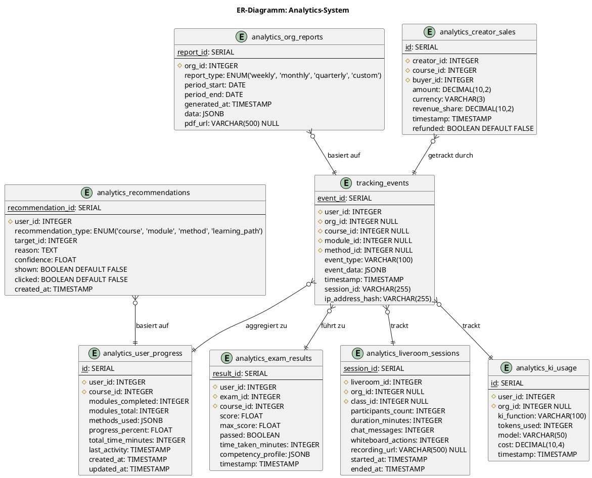
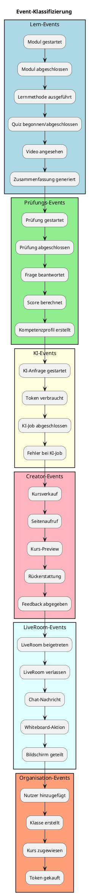
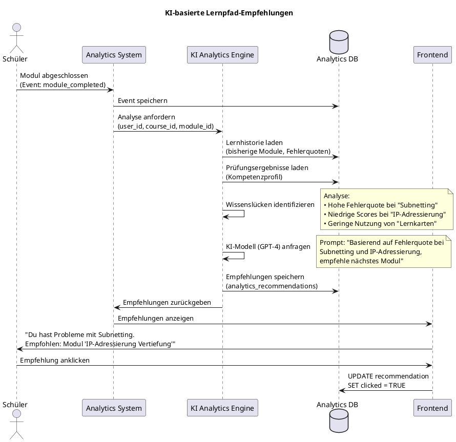
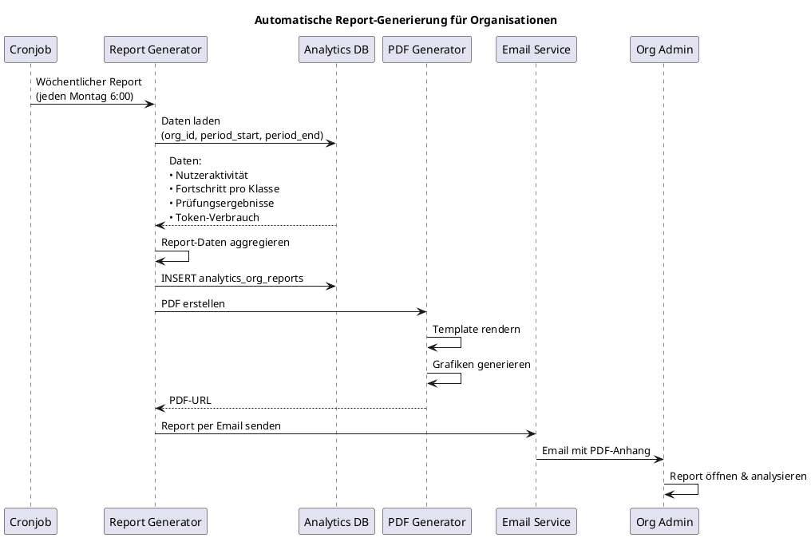
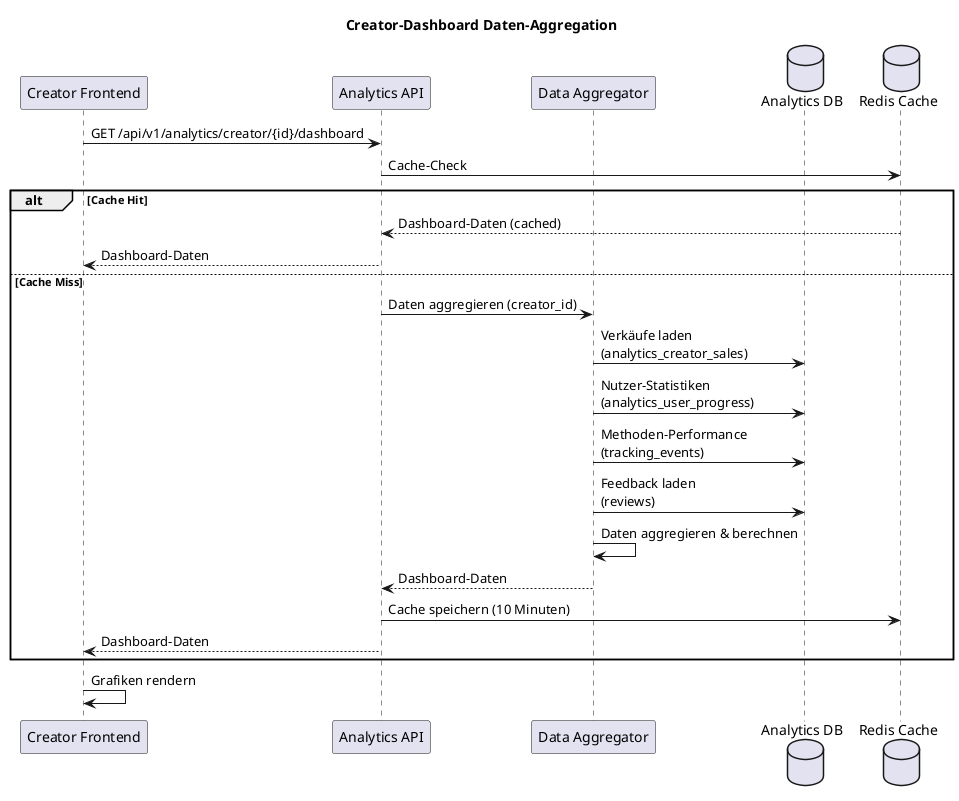
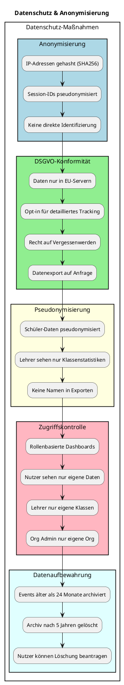

# 26_Analytics-System.md (Final)
Version: 1.0
Stand: Final

Dieses Dokument beschreibt das vollständige Analytics-System des LSX Lernsystems.
Analytics ist essenziell für:

- Lernfortschrittsanalyse
- Lehrer- und Unternehmensberichte
- Creator-Optimierung
- KI-basierte Lernpfade
- Abo-Conversion
- Systemüberwachung
- Fehlermanagement

Das System ist modular aufgebaut und liefert Echtzeitdaten für alle Rollen.

---

# 1. Architektur-Übersicht

## 1.1 C4 Context Diagramm – Analytics-System

```plantuml
@startuml
!include https://raw.githubusercontent.com/plantuml-stdlib/C4-PlantUML/master/C4_Context.puml

LAYOUT_WITH_LEGEND()

title C4 Context - Analytics-System im LSX Ökosystem

Person(student, "Schüler/Lerner", "Nutzt Kurse, erzeugt Lernaktivitäten")
Person(teacher, "Lehrer/Dozent", "Sieht Klassenfortschritt, Leistungsanalysen")
Person(creator, "Creator", "Analysiert Verkäufe, Nutzung, Performance")
Person(org_admin, "Org Admin", "Sieht Unternehmens-Reports, Nutzungsdaten")
Person(admin, "LSX Admin", "Überwacht System, Missbrauch, Performance")

System(analytics_system, "Analytics-System", "Sammelt, analysiert, visualisiert alle Daten aus LSX")

System_Ext(kurs_system, "Kurs-System", "Liefert Fortschrittsdaten")
System_Ext(ki_system, "KI-System", "Liefert Token-Usage, KI-Jobs")
System_Ext(org_system, "Organisation-System", "Liefert Klassen-, Nutzerdaten")
System_Ext(liveroom, "LiveRoom-System", "Liefert Teilnahme, Aktivitätsdaten")
System_Ext(exam_system, "Prüfungs-System", "Liefert Ergebnisse, Scores")
System_Ext(price_engine, "Price-Engine", "Liefert Verkaufsdaten, Revenue")

Rel(student, analytics_system, "Sieht eigenen Fortschritt", "HTTPS/REST")
Rel(teacher, analytics_system, "Sieht Klassen-Analytics", "HTTPS/REST")
Rel(creator, analytics_system, "Sieht Creator-Dashboard", "HTTPS/REST")
Rel(org_admin, analytics_system, "Sieht Org-Reports", "HTTPS/REST")
Rel(admin, analytics_system, "Sieht System-Monitoring", "HTTPS/REST")

Rel(kurs_system, analytics_system, "Sendet Events", "REST API")
Rel(ki_system, analytics_system, "Sendet KI-Metrics", "REST API")
Rel(org_system, analytics_system, "Sendet Org-Daten", "REST API")
Rel(liveroom, analytics_system, "Sendet LiveRoom-Events", "REST API")
Rel(exam_system, analytics_system, "Sendet Prüfungsergebnisse", "REST API")
Rel(price_engine, analytics_system, "Sendet Sales-Daten", "REST API")

@enduml
```

## 1.2 C4 Container Diagramm – Analytics-System

```plantuml
@startuml
!include https://raw.githubusercontent.com/plantuml-stdlib/C4-PlantUML/master/C4_Container.puml

LAYOUT_WITH_LEGEND()

title C4 Container - Analytics-System Komponenten

Person(user, "User", "Nutzer, Lehrer, Creator, Org Admin")

Container(analytics_frontend, "Analytics Frontend", "Vue.js 3", "Dashboards, Charts, Reports")
Container(analytics_api, "Analytics API", "Flask Blueprint", "REST API für Analytics-Daten")
Container(event_collector, "Event Collector", "Python", "Sammelt Events von allen Systemen")
Container(event_processor, "Event Processor", "Celery Worker", "Verarbeitet Events asynchron")
Container(aggregator, "Data Aggregator", "Python", "Aggregiert Daten für Reports")
Container(report_generator, "Report Generator", "Python", "Erstellt PDF/CSV Reports")
Container(ki_analyzer, "KI Analytics Engine", "Python + GPT-4", "Lernpfad-Empfehlungen, Wissenslücken")
Container(real_time_metrics, "Real-Time Metrics", "Python", "Live-Dashboards, WebSocket")

ContainerDb(analytics_db, "Analytics DB", "PostgreSQL", "Events, Progress, Reports, Sales")
ContainerDb(redis, "Redis Cache", "Redis", "Dashboard-Cache, Live-Metrics")
ContainerDb(timeseries_db, "TimeSeries DB", "InfluxDB", "Time-based Events, Performance-Metrics")

Rel(user, analytics_frontend, "Sieht Dashboards & Reports", "HTTPS")

Rel(analytics_frontend, analytics_api, "REST Calls", "HTTPS/JSON")
Rel(analytics_api, event_collector, "Query Events", "Python")
Rel(analytics_api, aggregator, "Query Aggregated Data", "Python")
Rel(analytics_api, report_generator, "Generate Reports", "Python")
Rel(analytics_api, ki_analyzer, "Get AI Insights", "Python")
Rel(analytics_api, real_time_metrics, "Get Live Metrics", "Python")

Rel(event_collector, analytics_db, "Store Events", "SQL")
Rel(event_collector, timeseries_db, "Store Time-Series", "InfluxQL")
Rel(event_collector, event_processor, "Queue Processing", "Celery")

Rel(event_processor, analytics_db, "Update Aggregates", "SQL")
Rel(event_processor, redis, "Update Cache", "Redis Protocol")

Rel(aggregator, analytics_db, "Query Data", "SQL")
Rel(aggregator, redis, "Cache Results", "Redis Protocol")

Rel(report_generator, analytics_db, "Fetch Report Data", "SQL")
Rel(ki_analyzer, analytics_db, "Analyze Patterns", "SQL")

Rel(real_time_metrics, redis, "Live Data", "Redis Protocol")
Rel(real_time_metrics, analytics_frontend, "WebSocket Stream", "WebSocket")

@enduml
```

---

# 2. Ziele des Analytics-Systems

Das Analytics-System soll:

- **detaillierte Nutzerdaten sammeln** – Jede Interaktion wird getrackt
- **Echtzeit-Auswertungen liefern** – Live-Dashboards für alle Rollen
- **datenschutzkonform sein** – DSGVO-compliant, Pseudonymisierung
- **personalisierte KI-Empfehlungen generieren** – Lernpfade, Wissenslücken erkennen
- **Organisationen leistungsstarke Reports geben** – Klassenfortschritt, Mitarbeiter-Performance
- **Creatorn Marktdaten liefern** – Verkäufe, Conversion, Nutzerverhalten
- **das LMS intern optimieren** – Performance-Monitoring, Fehleranalyse
- **Missbrauch frühzeitig erkennen** – Anomalie-Detection, Betrugsversuche

**Kernvorteile:**

✅ **Datengetrieben** – Alle Entscheidungen basieren auf echten Daten
✅ **Echtzeit** – Live-Updates via WebSocket
✅ **KI-gestützt** – Automatische Empfehlungen und Vorhersagen
✅ **Rollenbasiert** – Jede Rolle sieht nur relevante Daten
✅ **Skalierbar** – Millionen Events pro Tag verarbeitbar
✅ **DSGVO-konform** – Pseudonymisierung, Opt-in, Löschung

---

# 3. Datenquellen

```plantuml
@startuml
title Datenquellen für Analytics-System

rectangle "LSX Datenquellen" {
  rectangle "Kursaktivität" #LightBlue {
    + Modul gestartet/abgeschlossen
    + Lernzeit pro Modul
    + Lernmethoden-Nutzung
    + Fehlerquoten
    + Wiederholungen
  }

  rectangle "Prüfungen & Examen" #LightGreen {
    + Prüfung gestartet/abgeschlossen
    + Score & Ergebnisse
    + Zeit pro Aufgabe
    + Kompetenzprofil
    + IHK/CompTIA Simulationen
  }

  rectangle "KI-System" #LightYellow {
    + Token-Verbrauch
    + KI-Jobs (Glossar, Theorie, etc.)
    + Fehlerquote KI
    + Modell-Nutzung
  }

  rectangle "LiveRooms" #LightPink {
    + Teilnehmeranzahl
    + Dauer
    + Chataktivität
    + Whiteboardaktionen
    + Aufzeichnungen
  }

  rectangle "Organisationen" #LightCyan {
    + Klassen-Fortschritt
    + Nutzeraktivität
    + Tokenpool-Nutzung
    + Mitarbeiter-Performance
  }

  rectangle "Creator-Verkäufe" #LightSalmon {
    + Kursverkäufe
    + Seitenaufrufe
    + Conversion Rate
    + Rückerstattungen
    + Feedback
  }

  rectangle "Frontend-Events" #LightGray {
    + Seitenaufrufe
    + Klicks
    + Navigationspfade
    + Fehlerseiten
  }

  rectangle "Systemlogs" #White {
    + Server-Performance
    + API-Response-Times
    + Fehlerquoten
    + Datenbank-Queries
  }
}

@enduml
```

Analytics erhält Daten aus:

- **Kursaktivität** – Modul gestartet, abgeschlossen, Lernzeit
- **Lernmethoden-Nutzung** – 12 Content-Lernmethoden (A-C), Fehlerquoten
- **Prüfungen & Simulationen** – Ergebnisse, Scores, Zeitaufwand
- **PDFs / KI-generierten Inhalten** – Downloads, Nutzung
- **LiveRooms** – Teilnahme, Dauer, Chat, Whiteboard
- **Organisationen & Klassen** – Fortschritt pro Klasse, Mitarbeiter
- **Creator-Verkäufen** – Sales, Conversion, Feedback
- **Seitenaufrufen (Frontend)** – Navigation, Verweildauer
- **KI-Tokenverbrauch** – Pro Nutzer, Org, Funktion
- **Systemlogs** – Performance, Fehler, API-Calls

---

# 4. Datenmodell – Analytics-System

## 4.1 ER-Diagramm – Analytics-Entitäten



## 4.2 Schema-Details

### 4.2.1 tracking_events

| Feld | Typ | Beschreibung |
|------|-----|--------------|
| **event_id** | SERIAL PK | Eindeutige Event-ID |
| **user_id** | INTEGER FK | Verknüpfung zu users |
| **org_id** | INTEGER FK NULL | Optional: Organisation |
| **course_id** | INTEGER FK NULL | Optional: Kurs |
| **module_id** | INTEGER FK NULL | Optional: Modul |
| **method_id** | INTEGER FK NULL | Optional: Lernmethode |
| **event_type** | VARCHAR(100) | Art des Events (z.B. "module_completed") |
| **event_data** | JSONB | Zusätzliche Event-Daten |
| **timestamp** | TIMESTAMP | Zeitpunkt des Events |
| **session_id** | VARCHAR(255) | Session-Identifikator |
| **ip_address_hash** | VARCHAR(255) | Anonymisierte IP (Hash) |

**Event Types:**
- `module_started`
- `module_completed`
- `method_executed`
- `exam_started`
- `exam_completed`
- `liveroom_joined`
- `liveroom_left`
- `ki_job_started`
- `ki_job_completed`
- `course_purchased`
- `page_view`

**Event Data JSON Beispiel (module_completed):**
```json
{
  "module_id": 42,
  "course_id": 15,
  "time_spent_minutes": 45,
  "methods_used": ["flashcards", "quiz", "video"],
  "errors": 3,
  "retries": 1,
  "completion_rate": 100
}
```

### 4.2.2 analytics_user_progress

| Feld | Typ | Beschreibung |
|------|-----|--------------|
| **id** | SERIAL PK | Eindeutige ID |
| **user_id** | INTEGER FK | Verknüpfung zu users |
| **course_id** | INTEGER FK | Verknüpfung zu courses |
| **modules_completed** | INTEGER | Anzahl abgeschlossener Module |
| **modules_total** | INTEGER | Gesamtzahl Module im Kurs |
| **methods_used** | JSONB | Genutzte Lernmethoden mit Häufigkeit |
| **progress_percent** | FLOAT | Fortschritt in Prozent |
| **total_time_minutes** | INTEGER | Gesamte Lernzeit in Minuten |
| **last_activity** | TIMESTAMP | Letzte Aktivität |
| **created_at** | TIMESTAMP | Erstellungsdatum |
| **updated_at** | TIMESTAMP | Letzte Aktualisierung |

**Methods Used JSON Beispiel:**
```json
{
  "flashcards": 45,
  "quiz": 23,
  "video": 12,
  "mindmap": 8,
  "lernkarten": 34,
  "zusammenfassung": 15
}
```

### 4.2.3 analytics_org_reports

| Feld | Typ | Beschreibung |
|------|-----|--------------|
| **report_id** | SERIAL PK | Eindeutige Report-ID |
| **org_id** | INTEGER FK | Verknüpfung zu organisation |
| **report_type** | ENUM | weekly, monthly, quarterly, custom |
| **period_start** | DATE | Berichtszeitraum Start |
| **period_end** | DATE | Berichtszeitraum Ende |
| **generated_at** | TIMESTAMP | Erstellungszeitpunkt |
| **data** | JSONB | Report-Daten |
| **pdf_url** | VARCHAR(500) NULL | Link zum PDF-Report |

**Report Data JSON Beispiel:**
```json
{
  "total_users": 247,
  "active_users": 198,
  "avg_progress": 67.5,
  "total_time_minutes": 45230,
  "exams_completed": 89,
  "avg_exam_score": 82.4,
  "token_usage": 15430,
  "classes": [
    {
      "class_id": 10,
      "class_name": "10A",
      "avg_progress": 75.2,
      "active_students": 22
    }
  ]
}
```

### 4.2.4 analytics_creator_sales

| Feld | Typ | Beschreibung |
|------|-----|--------------|
| **id** | SERIAL PK | Eindeutige ID |
| **creator_id** | INTEGER FK | Verknüpfung zu users (Creator) |
| **course_id** | INTEGER FK | Verknüpfung zu courses |
| **buyer_id** | INTEGER FK | Verknüpfung zu users (Käufer) |
| **amount** | DECIMAL(10,2) | Verkaufsbetrag |
| **currency** | VARCHAR(3) | Währung (EUR, USD) |
| **revenue_share** | DECIMAL(10,2) | Creator-Anteil (75%) |
| **timestamp** | TIMESTAMP | Verkaufszeitpunkt |
| **refunded** | BOOLEAN | Wurde zurückerstattet? |

### 4.2.5 analytics_exam_results

| Feld | Typ | Beschreibung |
|------|-----|--------------|
| **result_id** | SERIAL PK | Eindeutige Ergebnis-ID |
| **user_id** | INTEGER FK | Verknüpfung zu users |
| **exam_id** | INTEGER FK | Verknüpfung zu exams |
| **course_id** | INTEGER FK | Verknüpfung zu courses |
| **score** | FLOAT | Erreichte Punkte |
| **max_score** | FLOAT | Maximale Punkte |
| **passed** | BOOLEAN | Bestanden? |
| **time_taken_minutes** | INTEGER | Benötigte Zeit |
| **competency_profile** | JSONB | Kompetenzen pro Thema |
| **timestamp** | TIMESTAMP | Prüfungszeitpunkt |

**Competency Profile JSON Beispiel:**
```json
{
  "subnetting": 85,
  "routing": 92,
  "switching": 78,
  "security": 88,
  "wireless": 65
}
```

### 4.2.6 analytics_liveroom_sessions

| Feld | Typ | Beschreibung |
|------|-----|--------------|
| **session_id** | SERIAL PK | Eindeutige Session-ID |
| **liveroom_id** | INTEGER FK | Verknüpfung zu liverooms |
| **org_id** | INTEGER FK NULL | Optional: Organisation |
| **class_id** | INTEGER FK NULL | Optional: Klasse |
| **participants_count** | INTEGER | Anzahl Teilnehmer |
| **duration_minutes** | INTEGER | Dauer in Minuten |
| **chat_messages** | INTEGER | Chat-Nachrichten |
| **whiteboard_actions** | INTEGER | Whiteboard-Aktionen |
| **recording_url** | VARCHAR(500) NULL | Aufzeichnungs-URL |
| **started_at** | TIMESTAMP | Start-Zeitpunkt |
| **ended_at** | TIMESTAMP | End-Zeitpunkt |

### 4.2.7 analytics_ki_usage

| Feld | Typ | Beschreibung |
|------|-----|--------------|
| **id** | SERIAL PK | Eindeutige ID |
| **user_id** | INTEGER FK | Verknüpfung zu users |
| **org_id** | INTEGER FK NULL | Optional: Organisation |
| **ki_function** | VARCHAR(100) | KI-Funktion (z.B. "glossar", "zusammenfassung") |
| **tokens_used** | INTEGER | Verbrauchte Tokens |
| **model** | VARCHAR(50) | KI-Modell (gpt-4, claude-3.5) |
| **cost** | DECIMAL(10,4) | Kosten in EUR |
| **timestamp** | TIMESTAMP | Zeitpunkt |

### 4.2.8 analytics_recommendations

| Feld | Typ | Beschreibung |
|------|-----|--------------|
| **recommendation_id** | SERIAL PK | Eindeutige ID |
| **user_id** | INTEGER FK | Verknüpfung zu users |
| **recommendation_type** | ENUM | course, module, method, learning_path |
| **target_id** | INTEGER | ID des empfohlenen Items |
| **reason** | TEXT | Begründung der Empfehlung |
| **confidence** | FLOAT | Konfidenz (0-1) |
| **shown** | BOOLEAN | Wurde angezeigt? |
| **clicked** | BOOLEAN | Wurde angeklickt? |
| **created_at** | TIMESTAMP | Erstellungszeitpunkt |

---

# 5. Event-Verarbeitung

## 5.1 Event-Verarbeitungs-Pipeline

```plantuml
@startuml
title Event-Verarbeitungs-Pipeline

actor "Frontend/Backend" as source
participant "Event Collector" as collector
queue "Event Queue" as queue
participant "Event Processor" as processor
database "Analytics DB" as db
database "Redis Cache" as redis
database "InfluxDB" as influx

source -> collector: Event senden\n(POST /api/v1/analytics/event)

collector -> collector: Event validieren
collector -> db: Event speichern (tracking_events)
collector -> influx: Time-Series speichern
collector -> queue: Event in Queue

note right of queue
  Asynchrone Verarbeitung
  via Celery Worker
end note

queue -> processor: Event verarbeiten

processor -> processor: Event-Typ analysieren

alt Modul abgeschlossen
  processor -> db: UPDATE analytics_user_progress\nSET modules_completed += 1
  processor -> db: Kompetenzprofil aktualisieren
  processor -> redis: Cache invalidieren

elseif Prüfung abgeschlossen
  processor -> db: INSERT analytics_exam_results
  processor -> processor: KI-Analyse für Wissenslücken
  processor -> db: INSERT analytics_recommendations

elseif KI-Job
  processor -> db: INSERT analytics_ki_usage
  processor -> db: UPDATE token_pool (Org)

elseif Creator-Verkauf
  processor -> db: INSERT analytics_creator_sales
  processor -> redis: UPDATE creator_dashboard_cache
end

processor -> redis: Dashboard-Daten aktualisieren
processor -> processor: Anomalie-Check

alt Anomalie erkannt
  processor -> processor: Admin-Warnung senden
end

@enduml
```

## 5.2 Event-Arten



**Lernereignisse:**
- Modul gestartet
- Modul abgeschlossen
- Lernmethode ausgeführt
- Quiz begonnen/abgeschlossen
- Fehlerquote
- Zeitaufwand

**Prüfungsevents:**
- Prüfung gestartet
- Prüfung abgeschlossen
- Score
- Zeit pro Aufgabe
- Fehlerverteilung
- Kompetenzprofil

**KI-Events:**
- KI-Anfrage gestartet
- Tokenverbrauch
- KI-Modell
- Fehlgeschlagene Jobs

**Creator-Events:**
- Kursverkauf
- Seitenaufrufe
- Conversion Rate
- Rückerstattungen

**LiveRoom Events:**
- Teilnehmeranzahl
- Chataktivität
- Dauer
- Whiteboardaktionen

---

# 6. Dashboards

## 6.1 Nutzer-Dashboard

```plantuml
@startuml
title Nutzer-Dashboard Layout

rectangle "Nutzer-Dashboard" {
  rectangle "Header" #LightBlue {
    :Begrüßung: "Hallo Max!";
    :Aktuelles Level & XP;
    :Streak (Tage in Folge);
  }

  rectangle "Fortschritts-Widgets" {
    card "Meine Kurse" #LightGreen {
      **3 aktive Kurse**
      --
      CCNA: ████████░░ 80%
      Python: ██████░░░░ 60%
      DevOps: ███░░░░░░░ 30%
    }

    card "Lernzeit" #LightYellow {
      **Diese Woche**
      --
      12,5 Stunden
      +2,5h vs. letzte Woche
    }

    card "Prüfungen" #LightPink {
      **Letzte Ergebnisse**
      --
      Python-Test: 92%
      CCNA-Simulation: 85%
    }

    card "Badges" #LightCyan {
      **Letzte Erfolge**
      --
      🏆 10 Module abgeschlossen
      ⭐ 7-Tage-Streak
    }
  }

  rectangle "KI-Empfehlungen" {
    card "Lernpfad" #White {
      === KI-Empfehlung ===
      "Du hast Schwierigkeiten mit Subnetting.
      Empfohlen: Modul 'IP-Adressierung'"
      [Starten]
    }

    card "Wissenslücken" #White {
      === Deine Schwächen ===
      • Routing-Protokolle
      • VLANs
      [Mehr erfahren]
    }
  }

  rectangle "Aktivitätsverlauf" {
    :Grafik: Lernzeit letzte 30 Tage;
    :Grafik: Fortschritt pro Kurs;
  }
}

@enduml
```

**Nutzer-Dashboard zeigt:**

📊 **Persönlicher Fortschritt**
- Kurse und Module
- Abschlussraten
- Lernzeit pro Kurs

⏱️ **Lernzeit**
- Heute, diese Woche, gesamt
- Durchschnitt pro Tag
- Streak (Tage in Folge)

📈 **Leistungsanalyse**
- Prüfungsergebnisse
- Fehlerquoten
- Kompetenzprofil

🤖 **KI-Empfehlungen**
- Nächste Module
- Lernpfade
- Wissenslücken

🏆 **Badges & Skills**
- Erreichte Badges
- Skill-Level
- Achievements

## 6.2 Creator-Dashboard

```plantuml
@startuml
title Creator-Dashboard Layout

rectangle "Creator-Dashboard" {
  rectangle "Header" #LightBlue {
    :Creator-Name;
    :Gesamtverkäufe;
    :Monatsumsatz;
  }

  rectangle "Verkaufs-Widgets" {
    card "Verkäufe" #LightGreen {
      **Dieser Monat**
      --
      142 Verkäufe
      +23% vs. letzter Monat
    }

    card "Umsatz" #LightYellow {
      **Dieser Monat**
      --
      4.260,00 €
      +18% vs. letzter Monat
    }

    card "Conversion Rate" #LightPink {
      **Aktuell**
      --
      3,2%
      +0,5% vs. letzter Monat
    }

    card "Nutzer" #LightCyan {
      **Aktive Lerner**
      --
      1.247
      +89 diese Woche
    }
  }

  rectangle "Kurs-Performance" {
    card "Top-Kurse" #White {
      === Meistverkaufte ===
      1. CCNA Komplettkurs: 45 Verkäufe
      2. Python für Anfänger: 38 Verkäufe
      3. DevOps Essentials: 27 Verkäufe
    }

    card "Abschlussraten" #White {
      === Fertigstellungsquote ===
      CCNA: ████████░░ 78%
      Python: ██████████ 92%
      DevOps: ████████░░ 65%
    }
  }

  rectangle "Methoden-Performance" {
    card "Beliebteste Methoden" #White {
      === In deinen Kursen ===
      1. Flashcards: 4.523 Nutzungen
      2. Quiz: 3.892 Nutzungen
      3. Video: 3.456 Nutzungen
    }

    card "Fehlerquoten" #White {
      === Schwierige Themen ===
      • Subnetting: 45% Fehler
      • Routing: 38% Fehler
      • VLANs: 32% Fehler
    }
  }

  rectangle "Feedback & Reviews" {
    :Durchschnittliche Bewertung: ⭐⭐⭐⭐⭐ 4,8;
    :Neueste Reviews;
  }
}

@enduml
```

**Creator-Dashboard zeigt:**

💰 **Verkäufe**
- Anzahl Verkäufe (Monat, Jahr, gesamt)
- Trend-Entwicklung
- Top-Verkaufstage

💵 **Umsatz & Revenue-Share**
- Brutto-Umsatz
- Creator-Anteil (75%)
- Auszahlungen

📊 **Conversion Rate**
- Seitenaufrufe → Verkäufe
- Kurs-Previews
- Absprungrate

👥 **Nutzerverhalten**
- Aktive Lerner
- Kursfortschritt
- Abschlussraten

📈 **Methoden-Performance**
- Welche Lernmethoden werden genutzt?
- Fehlerquoten pro Methode
- Beliebteste Module

🌍 **Länder & Sprachen**
- Geografische Verteilung
- Sprachen der Nutzer

⭐ **Feedback & Reviews**
- Bewertungen
- Kommentare
- Verbesserungsvorschläge

## 6.3 Lehrer-/Dozenten-Dashboard

```plantuml
@startuml
title Lehrer-Dashboard Layout

rectangle "Lehrer-Dashboard" {
  rectangle "Header" #LightBlue {
    :Lehrer-Name;
    :Anzahl Klassen;
    :Anzahl Schüler;
  }

  rectangle "Klassen-Übersicht" {
    card "Klasse 10A" #LightGreen {
      **22 Schüler**
      --
      Ø Fortschritt: 75%
      Aktiv: 18/22
    }

    card "Klasse 10B" #LightYellow {
      **20 Schüler**
      --
      Ø Fortschritt: 68%
      Aktiv: 15/20
    }

    card "Klasse 11A" #LightPink {
      **25 Schüler**
      --
      Ø Fortschritt: 82%
      Aktiv: 23/25
    }
  }

  rectangle "Leistungsanalyse" {
    card "Top-Performer" #White {
      === Beste Schüler ===
      1. Anna Schmidt: 95%
      2. Max Müller: 92%
      3. Tom Weber: 88%
    }

    card "Hilfe benötigt" #White {
      === Schwache Leistung ===
      • Lisa Meyer: 42%
      • Jan Klein: 38%
      [Kontaktieren]
    }
  }

  rectangle "Prüfungsergebnisse" {
    card "Letzte Prüfung" #White {
      === Python-Test (10A) ===
      Ø Score: 82%
      Bestanden: 18/22
      Durchgefallen: 4
    }

    card "Kommende Prüfungen" #White {
      === Geplant ===
      CCNA-Simulation: 15.02.2025
      DevOps-Test: 22.02.2025
    }
  }

  rectangle "Aktivität" {
    :Grafik: Klassenaktivität letzte 30 Tage;
    :LiveRoom-Teilnahme;
  }
}

@enduml
```

**Lehrer-Dashboard zeigt:**

📚 **Fortschritt pro Klasse**
- Durchschnittlicher Fortschritt
- Aktive vs. inaktive Schüler
- Kursabschlussraten

👨‍🎓 **Fortschritt pro Schüler**
- Individuelle Fortschrittsanalyse
- Lernzeit pro Schüler
- Schwache Performer

📊 **Fehlerprofile**
- Häufige Fehler
- Themen mit hoher Fehlerquote
- Wissenslücken der Klasse

📝 **Prüfungsergebnisse**
- Scores pro Prüfung
- Bestanden/Durchgefallen
- Kompetenzprofile

🎥 **LiveRoom-Aktivität**
- Anwesenheit
- Teilnahme-Statistiken
- Aufzeichnungen

⚠️ **Leistungswarnungen**
- Schüler mit niedrigem Fortschritt
- Inaktive Schüler
- Prüfungen nicht bestanden

## 6.4 Organisations-Dashboard

```plantuml
@startuml
title Organisations-Dashboard Layout

rectangle "Org-Dashboard" {
  rectangle "Header" #LightBlue {
    :Org-Name;
    :Aktive Nutzer;
    :Token-Pool;
  }

  rectangle "Übersichts-Widgets" {
    card "Nutzer" #LightGreen {
      **247 aktive**
      --
      +12 diese Woche
    }

    card "Klassen" #LightYellow {
      **18 Klassen**
      --
      Ø 22 Schüler/Klasse
    }

    card "Kurse" #LightPink {
      **56 Kurse**
      --
      42 zugewiesen
    }

    card "Tokens" #LightCyan {
      **45.230**
      --
      -1.200 heute
    }
  }

  rectangle "Performance pro Abteilung" {
    card "Abteilungen" #White {
      === Fortschritt ===
      IT: ████████░░ 80%
      HR: ██████░░░░ 65%
      Sales: █████████░ 88%
    }

    card "Aktivität" #White {
      === Letzte 30 Tage ===
      IT: 2.450h Lernzeit
      HR: 1.320h Lernzeit
      Sales: 1.890h Lernzeit
    }
  }

  rectangle "KI-Nutzung" {
    card "Token-Verbrauch" #White {
      === Pro Abteilung ===
      IT: 8.500 Tokens
      HR: 4.200 Tokens
      Sales: 2.730 Tokens
    }

    card "Top-Funktionen" #White {
      === Meistgenutzt ===
      1. Zusammenfassung: 4.523
      2. Glossar: 3.892
      3. Theorie-Blatt: 2.456
    }
  }

  rectangle "Abrechnung" {
    :Nächste Rechnung: 01.03.2025;
    :Geschätzte Kosten: 1.240,00 €;
  }
}

@enduml
```

**Organisations-Dashboard zeigt:**

👥 **Gruppen-Performance**
- Fortschritt pro Abteilung/Klasse
- Aktive Nutzer
- Inaktive Nutzer

📈 **Fortschrittsdaten pro Abteilung**
- Durchschnittlicher Fortschritt
- Lernzeit
- Abschlussraten

🎯 **KI-Tokenverbrauch**
- Pro Abteilung
- Pro Nutzer
- Pro Klasse

📊 **Aktivitätenübersicht**
- Lernzeit gesamt
- Prüfungen abgeschlossen
- LiveRoom-Teilnahme

👥 **Nutzeranzahl**
- Aktive vs. inaktive
- Neu hinzugefügte
- Deaktivierte

💳 **Lizenzstatus**
- Lizenzierte Kurse
- Ablaufende Lizenzen
- Nutzungsstatistiken

## 6.5 Admin-Dashboard

```plantuml
@startuml
title Admin-Dashboard (LSX System-Monitoring)

rectangle "Admin-Dashboard" {
  rectangle "Header" #LightBlue {
    :LSX System-Monitoring;
    :Server-Status;
    :Aktive Nutzer (gesamt);
  }

  rectangle "System-Metriken" {
    card "Nutzer" #LightGreen {
      **12.450 aktiv**
      --
      +234 heute
    }

    card "KI-Jobs" #LightYellow {
      **1.523 heute**
      --
      Ø 2,3 min/Job
    }

    card "API-Calls" #LightPink {
      **245.678 heute**
      --
      Ø 85ms Response
    }

    card "Fehlerquote" #LightCyan {
      **0,3%**
      --
      45 Fehler heute
    }
  }

  rectangle "Performance" {
    card "Server-Last" #White {
      === CPU & RAM ===
      CPU: ████░░░░░░ 40%
      RAM: ██████░░░░ 65%
    }

    card "Datenbank" #White {
      === DB Performance ===
      Query Time: Ø 12ms
      Connections: 145/200
    }
  }

  rectangle "Sicherheit & Missbrauch" {
    card "Anomalien" #White {
      === Auffälligkeiten ===
      • 3 IPs mit hoher Request-Rate
      • 2 Nutzer mit verdächtigen Prüfungsergebnissen
      [Details]
    }

    card "Rate-Limiting" #White {
      === Blockierte Requests ===
      45 IPs blockiert
      128 Requests abgelehnt
    }
  }

  rectangle "Conversion & Revenue" {
    :Conversion Rate: 2,8%;
    :Umsatz heute: 4.567,00 €;
  }
}

@enduml
```

**Admin-Dashboard zeigt:**

🌐 **Systemweite Nutzerdaten**
- Aktive Nutzer gesamt
- Neue Registrierungen
- Abo-Conversions

🤖 **KI-Auslastung**
- KI-Jobs pro Tag
- Token-Verbrauch gesamt
- Fehlerquote KI

🖥️ **Serverlast**
- CPU, RAM, Disk
- API Response Times
- Datenbank-Performance

⚠️ **Fehlerquote**
- API-Fehler
- Frontend-Fehler
- Backend-Fehler

🚨 **Missbrauchsindikatoren**
- Verdächtige IPs
- Anomalien im Nutzerverhalten
- Rate-Limiting Aktivitäten

💰 **Globale Conversion**
- Free → Premium
- Kursverkäufe
- Org-Lizenzen

---

# 7. KI-basierte Analytics



Analytics + KI erzeugen:

## 7.1 Lernpfad-Empfehlungen

**Beispiele:**

🎯 **Basierend auf Fehlerquoten:**
- "Du hast Probleme mit Subnetting → neues Modul empfohlen"
- "Dein Fehlerprofil ist in Layer 4 → prüfe diese Videos"

📊 **Basierend auf Lernverhalten:**
- "Du lernst gut mit Flashcards → mehr Flashcard-Module empfohlen"
- "Du schaust Videos ungern → textbasierte Module bevorzugt"

🏆 **Basierend auf Kompetenzprofil:**
- "Du bist stark in Routing → CompTIA Security+ könnte passen"
- "CCNA-Wissen vorhanden → CCNP als Nächstes?"

## 7.2 Schwierigkeitseinschätzung

- Module werden automatisch **leichtere** oder **schwerere Stufen** empfehlen
- KI passt Schwierigkeitsgrad basierend auf Performance an
- "Du bestehst Quizze mit 95% → härtere Fragen werden vorgeschlagen"

## 7.3 Prüfungsvorhersagen

**KI berechnet:**

✅ **Wahrscheinlichkeit in IHK/CompTIA zu bestehen**
- Basierend auf Übungs-Prüfungsergebnissen
- Lernfortschritt vs. verbleibende Zeit
- Fehlerquoten pro Thema

📊 **Empfohlene Lernzeit bis zur Prüfung:**
- "Du brauchst noch 20 Stunden, um IHK zu bestehen"
- "Empfohlener Lernplan: 2h/Tag in den nächsten 10 Tagen"

## 7.4 Erkennung von Wissenslücken

**KI erkennt:**

⚠️ **Themen, die oft falsch beantwortet werden**
- "Subnetting: 45% Fehlerquote → Wiederholung empfohlen"
- "VLANs: 38% Fehlerquote → Zusatzmodul empfohlen"

📉 **Module, die wenig genutzt werden**
- "Du hast 'Routing-Protokolle' übersprungen → wichtig für Prüfung"

📊 **Unterdurchschnittliche Leistungen**
- "Dein Score bei Security ist 20% unter dem Durchschnitt"

---

# 8. Organisation Reports



Organisationen erhalten **automatische Reports**:

## 8.1 Wöchentlicher Klassenreport

**Inhalt:**

📊 **Lernzeit**
- Gesamt-Lernzeit pro Klasse
- Durchschnitt pro Schüler
- Top 3 aktivste Schüler

📈 **Fortschrittsverlauf**
- Durchschnittlicher Fortschritt
- Wöchentliche Veränderung
- Module abgeschlossen

📝 **Prüfungsresultate**
- Anzahl Prüfungen
- Durchschnittlicher Score
- Bestanden/Durchgefallen

⚠️ **Ausfälle**
- Inaktive Schüler (letzte 7 Tage)
- Schüler mit niedrigem Fortschritt

🎯 **Kompetenzmatrix**
- Stärken der Klasse
- Schwächen der Klasse

## 8.2 Monatlicher Unternehmensreport

**Inhalt:**

👥 **Mitarbeiteraktivität**
- Aktive vs. inaktive Mitarbeiter
- Lernzeit gesamt
- Abschlussraten

📊 **Fortschrittsübersicht**
- Pro Abteilung
- Pro Kurs
- Trends

🤖 **KI-Nutzung**
- Token-Verbrauch gesamt
- Top KI-Funktionen
- Kosten

🎓 **Kurslizenzbedarf**
- Genutzte Kurse
- Ungenutzte Lizenzen
- Empfehlungen für neue Kurse

## 8.3 Risiken & Auffälligkeiten

**Report enthält Warnungen für:**

⚠️ **Inaktive Nutzer**
- Schüler/Mitarbeiter ohne Aktivität > 14 Tage
- Empfohlene Maßnahmen

🚨 **Extrem hohe KI-Nutzung**
- Nutzer mit ungewöhnlich hohem Token-Verbrauch
- Möglicher Missbrauch

📉 **Sehr schlechte Fortschrittswerte**
- Klassen/Abteilungen < 40% Durchschnitt
- Hilfe benötigt

🔍 **Verdacht auf Betrug bei Prüfungen**
- Ungewöhnlich schnelle Prüfungsergebnisse
- Perfekte Scores ohne Fehler
- Identische Antwortmuster

---

# 9. Creator-Reports



Creator sehen:

💰 **Verkäufe pro Plattform**
- LSX Academy
- B2B (Organisationen)
- Direktverkäufe

👥 **Nutzeranzahl**
- Aktive Lerner pro Kurs
- Neu registrierte
- Churned Users

✅ **Fertigstellungsquote**
- Wie viele Nutzer schließen Kurse ab?
- Durchschnitt pro Kurs
- Vergleich mit anderen Creators

📊 **Methoden-Success-Rate**
- Welche Lernmethoden werden am häufigsten genutzt?
- Fehlerquoten pro Methode
- Beliebteste Module

🔁 **Wiederkaufrate**
- Nutzer, die mehrere Kurse kaufen
- Durchschnittlicher Lifetime Value

🌍 **Länder & Sprache**
- Geografische Verteilung
- Sprachen der Nutzer
- Potenzial für Übersetzungen

---

# 10. API-Endpunkte – Analytics

## 10.1 Event senden

**POST** `/api/v1/analytics/event`

**Request:**
```json
{
  "user_id": 123,
  "event_type": "module_completed",
  "event_data": {
    "course_id": 15,
    "module_id": 42,
    "time_spent_minutes": 45,
    "methods_used": ["flashcards", "quiz", "video"],
    "errors": 3,
    "retries": 1,
    "completion_rate": 100
  },
  "timestamp": "2025-02-15T14:30:00Z"
}
```

**Response:**
```json
{
  "status": "success",
  "event_id": 98765,
  "message": "Event erfolgreich getrackt"
}
```

**Backend:**
```python
@analytics_bp.route('/event', methods=['POST'])
@jwt_required()
def track_event():
    data = request.get_json()

    # Validierung
    if 'user_id' not in data or 'event_type' not in data:
        return jsonify({'status': 'error', 'message': 'user_id und event_type erforderlich'}), 400

    # Event speichern
    event = TrackingEvent(
        user_id=data['user_id'],
        org_id=data.get('org_id'),
        course_id=data.get('course_id'),
        module_id=data.get('module_id'),
        method_id=data.get('method_id'),
        event_type=data['event_type'],
        event_data=data.get('event_data', {}),
        timestamp=data.get('timestamp', datetime.utcnow()),
        session_id=request.headers.get('X-Session-ID'),
        ip_address_hash=hashlib.sha256(request.remote_addr.encode()).hexdigest()
    )
    db.session.add(event)
    db.session.commit()

    # Event in Queue für Verarbeitung
    process_event.delay(event.event_id)

    return jsonify({
        'status': 'success',
        'event_id': event.event_id,
        'message': 'Event erfolgreich getrackt'
    }), 201
```

---

## 10.2 Nutzerstatistik abrufen

**GET** `/api/v1/analytics/user/{user_id}`

**Response:**
```json
{
  "status": "success",
  "data": {
    "user_id": 123,
    "total_courses": 5,
    "completed_courses": 2,
    "in_progress_courses": 3,
    "total_time_minutes": 2450,
    "total_modules_completed": 87,
    "avg_exam_score": 85.4,
    "badges": [
      {"badge_id": 1, "name": "10 Module abgeschlossen"},
      {"badge_id": 5, "name": "7-Tage-Streak"}
    ],
    "recommendations": [
      {
        "type": "module",
        "target_id": 156,
        "reason": "Du hast Probleme mit Subnetting. Dieses Modul hilft dir.",
        "confidence": 0.85
      }
    ],
    "progress_per_course": [
      {
        "course_id": 15,
        "course_name": "CCNA Komplettkurs",
        "progress_percent": 80,
        "modules_completed": 32,
        "modules_total": 40
      }
    ]
  }
}
```

**Backend:**
```python
@analytics_bp.route('/user/<int:user_id>', methods=['GET'])
@jwt_required()
def get_user_analytics(user_id):
    # Prüfen ob User berechtigt ist
    current_user_id = get_jwt_identity()
    if current_user_id != user_id and not is_admin():
        return jsonify({'status': 'error', 'message': 'Nicht berechtigt'}), 403

    # Cache-Check
    cache_key = f"CACHE:ANALYTICS:USER:{user_id}"
    cached = cache.get(cache_key)
    if cached:
        return jsonify({'status': 'success', 'data': json.loads(cached)}), 200

    # Daten aggregieren
    progress_data = AnalyticsUserProgress.query.filter_by(user_id=user_id).all()
    exam_results = AnalyticsExamResult.query.filter_by(user_id=user_id).all()
    recommendations = AnalyticsRecommendation.query.filter_by(user_id=user_id, shown=False).all()

    # Aggregieren
    total_time = sum([p.total_time_minutes for p in progress_data])
    total_modules = sum([p.modules_completed for p in progress_data])
    avg_score = sum([e.score for e in exam_results]) / len(exam_results) if exam_results else 0

    result = {
        'user_id': user_id,
        'total_courses': len(progress_data),
        'completed_courses': len([p for p in progress_data if p.progress_percent == 100]),
        'in_progress_courses': len([p for p in progress_data if 0 < p.progress_percent < 100]),
        'total_time_minutes': total_time,
        'total_modules_completed': total_modules,
        'avg_exam_score': round(avg_score, 1),
        'badges': get_user_badges(user_id),
        'recommendations': [r.to_dict() for r in recommendations],
        'progress_per_course': [p.to_dict() for p in progress_data]
    }

    # In Cache speichern (5 Minuten)
    cache.setex(cache_key, 300, json.dumps(result))

    return jsonify({'status': 'success', 'data': result}), 200
```

---

## 10.3 Organisationsreport generieren

**POST** `/api/v1/analytics/org/{org_id}/generate`

**Request:**
```json
{
  "report_type": "weekly",
  "period_start": "2025-02-01",
  "period_end": "2025-02-07",
  "include_pdf": true
}
```

**Response:**
```json
{
  "status": "success",
  "report_id": 456,
  "message": "Report wird generiert",
  "data": {
    "total_users": 247,
    "active_users": 198,
    "avg_progress": 67.5,
    "total_time_minutes": 45230,
    "exams_completed": 89,
    "avg_exam_score": 82.4,
    "token_usage": 15430,
    "classes": [
      {
        "class_id": 10,
        "class_name": "10A",
        "avg_progress": 75.2,
        "active_students": 22
      }
    ]
  },
  "pdf_url": "https://lsx.de/reports/org-42-weekly-2025-02-07.pdf"
}
```

**Backend:**
```python
@analytics_bp.route('/org/<int:org_id>/generate', methods=['POST'])
@jwt_required()
@org_admin_required()
def generate_org_report(org_id):
    data = request.get_json()

    report_type = data.get('report_type', 'weekly')
    period_start = datetime.strptime(data['period_start'], '%Y-%m-%d').date()
    period_end = datetime.strptime(data['period_end'], '%Y-%m-%d').date()
    include_pdf = data.get('include_pdf', False)

    # Daten sammeln
    users = OrganisationUser.query.filter_by(org_id=org_id, status='active').all()
    user_ids = [u.user_id for u in users]

    # Fortschritt
    progress = AnalyticsUserProgress.query.filter(
        AnalyticsUserProgress.user_id.in_(user_ids),
        AnalyticsUserProgress.last_activity.between(period_start, period_end)
    ).all()

    # Prüfungen
    exams = AnalyticsExamResult.query.filter(
        AnalyticsExamResult.user_id.in_(user_ids),
        AnalyticsExamResult.timestamp.between(period_start, period_end)
    ).all()

    # Token-Verbrauch
    token_usage = db.session.query(func.sum(AnalyticsKIUsage.tokens_used)).filter(
        AnalyticsKIUsage.org_id == org_id,
        AnalyticsKIUsage.timestamp.between(period_start, period_end)
    ).scalar() or 0

    # Aggregieren
    report_data = {
        'total_users': len(users),
        'active_users': len(progress),
        'avg_progress': sum([p.progress_percent for p in progress]) / len(progress) if progress else 0,
        'total_time_minutes': sum([p.total_time_minutes for p in progress]),
        'exams_completed': len(exams),
        'avg_exam_score': sum([e.score for e in exams]) / len(exams) if exams else 0,
        'token_usage': token_usage,
        'classes': get_class_stats(org_id, period_start, period_end)
    }

    # Report speichern
    report = AnalyticsOrgReport(
        org_id=org_id,
        report_type=report_type,
        period_start=period_start,
        period_end=period_end,
        generated_at=datetime.utcnow(),
        data=report_data
    )
    db.session.add(report)
    db.session.commit()

    # Optional: PDF generieren
    pdf_url = None
    if include_pdf:
        pdf_url = generate_report_pdf(report.report_id)
        report.pdf_url = pdf_url
        db.session.commit()

    return jsonify({
        'status': 'success',
        'report_id': report.report_id,
        'message': 'Report wurde generiert',
        'data': report_data,
        'pdf_url': pdf_url
    }), 201
```

---

## 10.4 Creator-Verkäufe abrufen

**GET** `/api/v1/analytics/creator/{creator_id}/sales`

**Query-Parameter:**
- `period` – `month`, `quarter`, `year`, `all`
- `course_id` – Optional: Filter nach Kurs

**Response:**
```json
{
  "status": "success",
  "data": {
    "creator_id": 89,
    "total_sales": 142,
    "total_revenue": 4260.00,
    "revenue_share": 3195.00,
    "avg_sale_price": 30.00,
    "conversion_rate": 3.2,
    "sales_per_course": [
      {
        "course_id": 15,
        "course_name": "CCNA Komplettkurs",
        "sales": 45,
        "revenue": 1349.55
      },
      {
        "course_id": 23,
        "course_name": "Python für Anfänger",
        "sales": 38,
        "revenue": 1139.62
      }
    ],
    "sales_timeline": [
      {"date": "2025-02-01", "sales": 5},
      {"date": "2025-02-02", "sales": 8},
      {"date": "2025-02-03", "sales": 12}
    ]
  }
}
```

**Backend:**
```python
@analytics_bp.route('/creator/<int:creator_id>/sales', methods=['GET'])
@jwt_required()
def get_creator_sales(creator_id):
    # Prüfen ob User berechtigt ist
    current_user_id = get_jwt_identity()
    if current_user_id != creator_id and not is_admin():
        return jsonify({'status': 'error', 'message': 'Nicht berechtigt'}), 403

    period = request.args.get('period', 'month')
    course_id = request.args.get('course_id', type=int)

    # Zeitraum berechnen
    if period == 'month':
        start_date = datetime.utcnow() - timedelta(days=30)
    elif period == 'quarter':
        start_date = datetime.utcnow() - timedelta(days=90)
    elif period == 'year':
        start_date = datetime.utcnow() - timedelta(days=365)
    else:
        start_date = datetime(2020, 1, 1)

    # Query
    query = AnalyticsCreatorSales.query.filter(
        AnalyticsCreatorSales.creator_id == creator_id,
        AnalyticsCreatorSales.timestamp >= start_date,
        AnalyticsCreatorSales.refunded == False
    )

    if course_id:
        query = query.filter(AnalyticsCreatorSales.course_id == course_id)

    sales = query.all()

    # Aggregieren
    total_sales = len(sales)
    total_revenue = sum([s.amount for s in sales])
    revenue_share = sum([s.revenue_share for s in sales])
    avg_sale_price = total_revenue / total_sales if total_sales > 0 else 0

    # Pro Kurs
    sales_per_course = db.session.query(
        AnalyticsCreatorSales.course_id,
        func.count(AnalyticsCreatorSales.id).label('sales'),
        func.sum(AnalyticsCreatorSales.amount).label('revenue')
    ).filter(
        AnalyticsCreatorSales.creator_id == creator_id,
        AnalyticsCreatorSales.timestamp >= start_date,
        AnalyticsCreatorSales.refunded == False
    ).group_by(AnalyticsCreatorSales.course_id).all()

    # Timeline
    sales_timeline = db.session.query(
        func.date(AnalyticsCreatorSales.timestamp).label('date'),
        func.count(AnalyticsCreatorSales.id).label('sales')
    ).filter(
        AnalyticsCreatorSales.creator_id == creator_id,
        AnalyticsCreatorSales.timestamp >= start_date
    ).group_by(func.date(AnalyticsCreatorSales.timestamp)).all()

    return jsonify({
        'status': 'success',
        'data': {
            'creator_id': creator_id,
            'total_sales': total_sales,
            'total_revenue': float(total_revenue),
            'revenue_share': float(revenue_share),
            'avg_sale_price': round(avg_sale_price, 2),
            'conversion_rate': calculate_conversion_rate(creator_id, period),
            'sales_per_course': [
                {
                    'course_id': s.course_id,
                    'course_name': get_course_name(s.course_id),
                    'sales': s.sales,
                    'revenue': float(s.revenue)
                } for s in sales_per_course
            ],
            'sales_timeline': [
                {'date': str(s.date), 'sales': s.sales} for s in sales_timeline
            ]
        }
    }), 200
```

---

## 10.5 Live-Metrics (WebSocket)

**WebSocket** `wss://lsx.de/ws/analytics/live`

**Subscribe:**
```json
{
  "action": "subscribe",
  "channels": ["system_metrics", "user_activity"]
}
```

**Live-Updates:**
```json
{
  "channel": "system_metrics",
  "data": {
    "active_users": 12450,
    "api_calls_per_second": 145,
    "avg_response_time_ms": 85,
    "ki_jobs_running": 23
  },
  "timestamp": "2025-02-15T14:35:12Z"
}
```

---

# 11. Performance & Caching

Analytics nutzt:

✅ **Redis für schnelles Caching**
- Dashboard-Daten werden für 5-10 Minuten gecached
- Live-Metrics in Redis gespeichert
- Cache-Invalidierung bei neuen Events

⚡ **Hintergrundjobs zur Aggregation**
- Celery Workers verarbeiten Events asynchron
- Aggregationen werden vorberechnet
- Reports werden nachts generiert

📦 **Komprimierte JSON-Felder**
- Event-Daten in JSONB gespeichert
- Indexierung auf häufig abgefragte Felder

🗂️ **Partitionierte Tabellen bei großen Datenmengen**
- `tracking_events` wird monatlich partitioniert
- Alte Events werden archiviert
- Performance-Optimierung für Queries

📊 **Streaming-Verarbeitung von Events**
- Events werden in Echtzeit verarbeitet
- WebSocket-Streaming für Live-Dashboards

---

# 12. Datenschutz & Sicherheit



**Datenschutz-Features:**

🔒 **IP-Adressen anonymisiert**
- IPs werden gehasht (SHA256)
- Keine Rückverfolgung zu Nutzern möglich

📋 **DSGVO-konforme Speicherung**
- Alle Daten nur in EU-Servern
- Datenexport auf Anfrage
- Recht auf Vergessenwerden

✅ **Opt-in Pflicht für detailliertes Tracking**
- Nutzer müssen Tracking zustimmen
- Basis-Tracking immer aktiv (Fortschritt)
- Detailliertes Tracking optional

👤 **Pseudonymisierung bei Schülern**
- Lehrer sehen keine Namen in Reports
- Nur Klassen-Durchschnitte
- Identifizierbarkeit nur für Org Admin

🚫 **Keine Identifizierbarkeit in Exporten**
- CSV-Exporte enthalten keine Namen
- Nur anonymisierte IDs

---

# 13. Zusammenfassung

Das LSX Analytics-System ist:

✅ **Tief integriert** – Daten aus allen LSX-Systemen
✅ **Vollständig skalierbar** – Millionen Events pro Tag
✅ **KI-gestützt** – Empfehlungen, Vorhersagen, Wissenslücken
✅ **Datenschutzkonform** – DSGVO, Anonymisierung, Opt-in
✅ **Unverzichtbar** – Für Creator, Lehrer, Firmen, Schüler
✅ **Grundlage für intelligenten Lernfortschritt** – Personalisierung

**Kernfunktionen:**

📊 **Event-Tracking** – Jede Interaktion wird getrackt
📈 **Dashboards** – Für alle Rollen (Nutzer, Creator, Lehrer, Org, Admin)
🤖 **KI-Analytics** – Lernpfad-Empfehlungen, Wissenslücken
📄 **Reports** – Automatische wöchentliche/monatliche Reports
🔍 **Missbrauchserkennung** – Anomalie-Detection
⚡ **Echtzeit** – Live-Dashboards via WebSocket

**Zielgruppen:**

- **Schüler/Lerner** – Persönlicher Fortschritt, Empfehlungen
- **Lehrer/Dozenten** – Klassenfortschritt, Leistungsanalysen
- **Creator** – Verkäufe, Nutzerverhalten, Performance
- **Organisationen** – Mitarbeiter-Performance, Token-Verbrauch
- **LSX Admins** – System-Monitoring, Fehleranalyse

Das Analytics-System ist das **Herzstück** der Datenanalyse in LSX und ermöglicht datengetriebene Entscheidungen auf allen Ebenen.

---

# 14. Phase B10 – Advanced Analytics Endpoints (NEU)

**Status:** ✅ Implementiert
**Backend-Phase:** B10
**Frontend-Phase:** F8

## 14.1 System-Admin Analytics API

Neue REST-Endpoints für System-Administratoren (`VIEW_SYSTEM_ANALYTICS` permission):

### Endpoints

```
GET /api/v1/admin/analytics/events/time-series
GET /api/v1/admin/analytics/active-users/time-series
GET /api/v1/admin/analytics/top-courses
GET /api/v1/admin/analytics/top-methods
```

### Features

- **Time Series:** Systemweite Events und aktive User pro Tag
- **Top Lists:** Beliebteste Kurse und Lernmethoden (mit Token-Nutzung)
- **Flexible Filter:** Range-Parameter (7d, 30d, 90d) oder custom Dates
- **Performance:** Optimierte Queries mit Indexes, optional Caching (TTL 5-10 Min)

### Beispiel-Response

```json
// GET /admin/analytics/events/time-series?range=7d
{
  "success": true,
  "data": [
    {"date": "2025-01-15", "value": 245},
    {"date": "2025-01-16", "value": 312}
  ],
  "total": 846
}
```

**Dokumentation:** `backend/docs/api/admin-analytics-api.md`

## 14.2 Organisation Analytics API

Neue REST-Endpoints für Organisations-Admins (`VIEW_ORG_ANALYTICS` permission):

### Endpoints

```
GET /api/v1/organisations/<org_id>/analytics/events/time-series
GET /api/v1/organisations/<org_id>/analytics/active-members/time-series
GET /api/v1/organisations/<org_id>/analytics/top-courses
GET /api/v1/organisations/<org_id>/analytics/top-modules
```

### Multi-Tenancy

- User kann **nur** Daten der eigenen Organisation abrufen
- Admin/Superadmin können **alle** Organisationen einsehen
- Versuch, fremde Org-Daten abzurufen: `403 Forbidden`

### Features

- **Time Series:** Org-Events und aktive Mitglieder pro Tag
- **Top Lists:** Beliebteste Kurse und Module innerhalb der Organisation
- **Progress Tracking:** Avg. Progress & Completion Rates pro Kurs
- **Performance:** Org-scoped Indexes, optional Caching (TTL 3-5 Min)

### Beispiel-Response

```json
// GET /organisations/5/analytics/top-courses?limit=5&range=30d
{
  "success": true,
  "courses": [
    {
      "course_id": 42,
      "title": "Python Basics",
      "enrolled_count": 25,
      "avg_progress": 68.5,
      "completion_rate": 44.0,
      "events_count": 320
    }
  ],
  "total": 5
}
```

**Dokumentation:** `backend/docs/api/org-analytics-api.md`

## 14.3 Frontend-Integration (F8)

Die Endpoints sind direkt kompatibel mit Frontend Phase F8:

- **AdminAnalyticsPage.vue** nutzt Admin-Endpoints
- **OrgAnalyticsPage.vue** nutzt Org-Endpoints
- **Vue-Chartjs-Komponenten** visualisieren Time-Series-Daten
- **Pinia Stores** (admin.store.ts, orgAdmin.store.ts) cachen Daten

## 14.4 Technische Details

### Repository-Erweiterungen

**Datei:** `backend/app/repositories/analytics_repository.py`

Neue Methoden:
- `get_events_time_series(from_date, to_date, org_id?)`
- `get_active_users_time_series(from_date, to_date, org_id?)`
- `get_top_courses(limit, from_date?, to_date?, org_id?)`
- `get_top_methods(limit, from_date?, to_date?)`
- `get_org_top_courses(org_id, limit, from_date?, to_date?)`
- `get_org_top_modules(org_id, limit, from_date?, to_date?)`

### Models-Erweiterungen

**Datei:** `backend/app/models/analytics.py`

Neue Pydantic-Models:
- `TimeSeriesDataPoint`
- `TimeSeriesResponse`
- `TopCourseAnalytics`, `TopMethodAnalytics`
- `OrgTopCourseAnalytics`, `OrgTopModuleAnalytics`
- Response-Models: `TopCoursesResponse`, `TopMethodsResponse`, etc.

### Security & RBAC

**Permissions:**
- System-Admin: `Permissions.VIEW_SYSTEM_ANALYTICS`
- Org-Admin: `Permissions.VIEW_ORG_ANALYTICS`

**Decorators:**
- `@token_required`
- `@require_permission(Permissions.VIEW_SYSTEM_ANALYTICS)`
- Multi-Tenancy Check via `check_org_access(user, org_id)`

### Performance

**Query-Optimierung:**
- Indexes auf `(created_at)`, `(organisation_id, created_at)`, `(resource_type, resource_id)`
- Aggregation auf DB-Level (GROUP BY DATE)
- Limit-Parameter zur Begrenzung

**Caching-Empfehlung:**
- System Time-Series: TTL 5-10 Min
- Org Time-Series: TTL 3-5 Min
- Top-Lists: TTL 10-15 Min

## 14.5 Zusammenfassung

✅ **8 neue Analytics-Endpoints** (4 System, 4 Org)
✅ **Frontend F8 kompatibel** (AdminAnalyticsPage, OrgAnalyticsPage)
✅ **RBAC-gesichert** mit Permissions & Multi-Tenancy
✅ **Performant** mit optimierten Queries & Caching
✅ **Voll dokumentiert** (API-Docs + Technische Docs)

**Phase B10 abgeschlossen.**

---

**Dokument abgeschlossen.**
Stand: Final (mit B10-Ergänzung)
Version: 1.1
