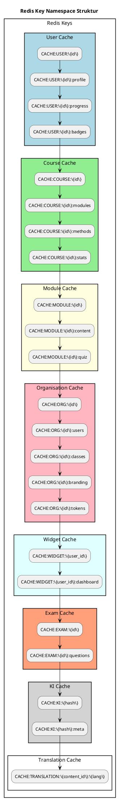
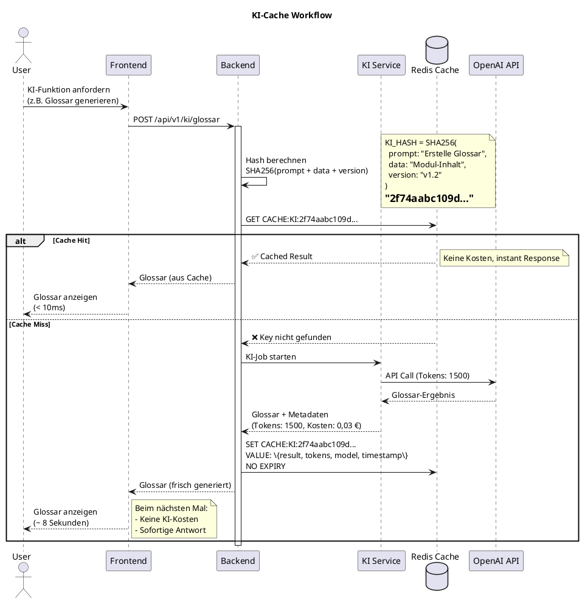
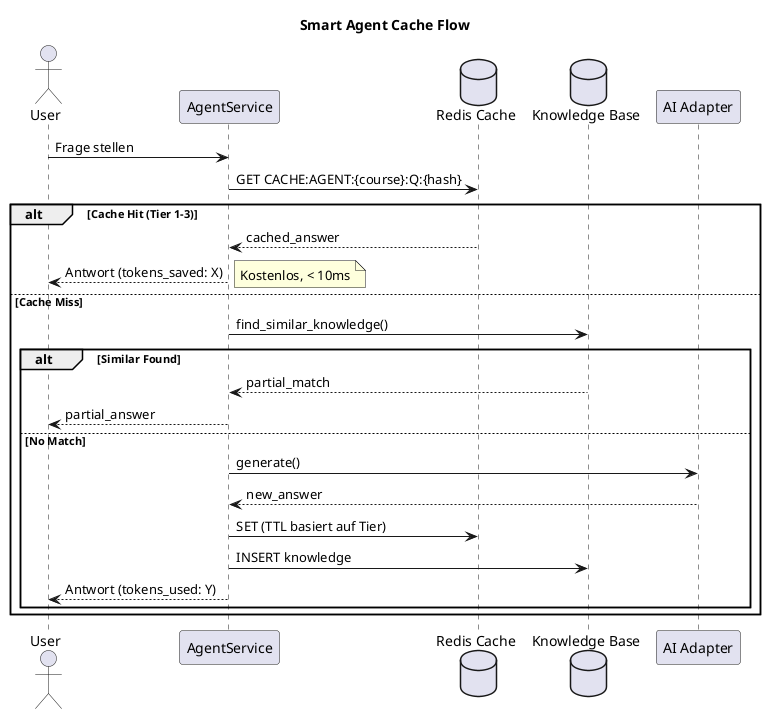
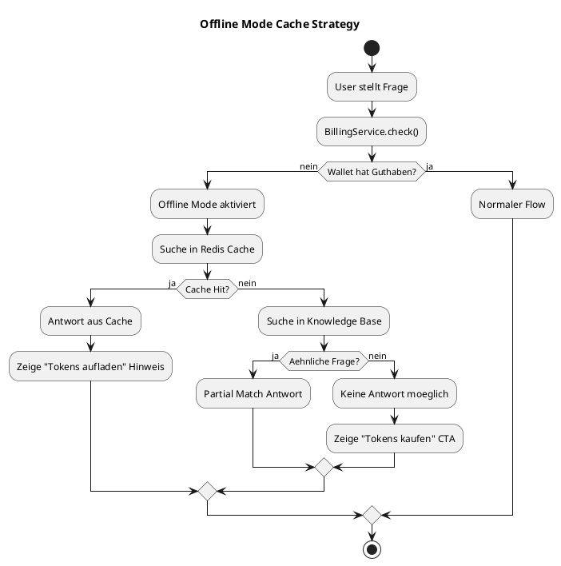
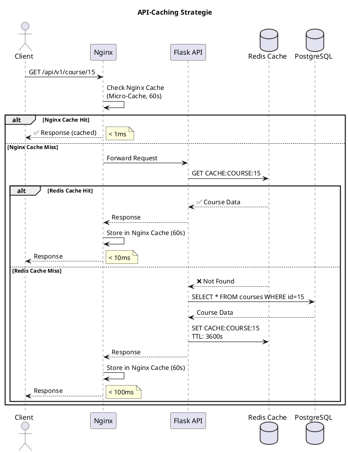
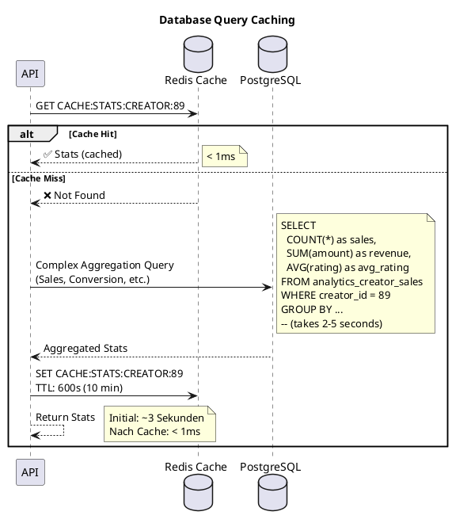
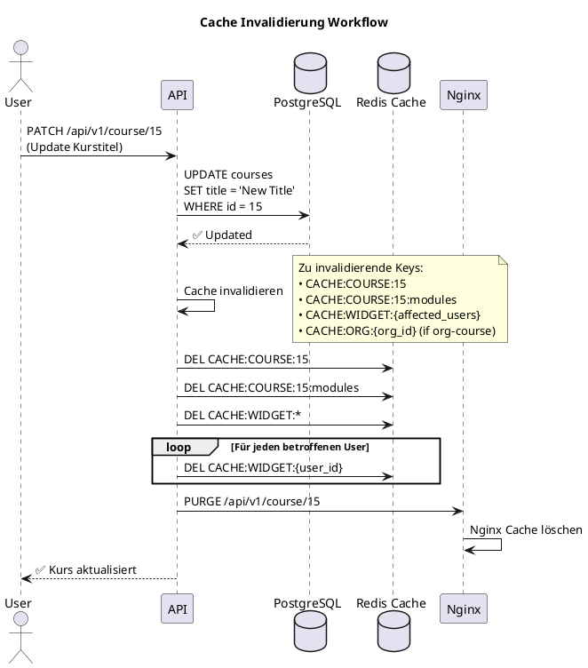

# 27_Caching-Strategy.md (Final)
Version: 1.0
Stand: Final

Dieses Dokument beschreibt die komplette Caching-Strategie des LSX Lernsystems.
Caching ist entscheidend für Performance, Skalierbarkeit, KI-Kostenreduktion und schnelle Ladezeiten.

Das LSX-Caching-System umfasst:

- Frontend-Caching
- Backend-Caching
- API-Caching
- KI-Caching
- Datenbank-Caching
- File-Caching
- Pre-Rendering
- CDN-Strategien

---

# 1. Ziele der Caching-Strategie

Caching dient dazu:

- **Antwortzeiten drastisch zu reduzieren** – Von Sekunden auf Millisekunden
- **Serverlast zu verringern** – Weniger DB-Queries, weniger CPU-Last
- **KI-Abfragen nicht mehrfach zu bezahlen** – Kostenersparnis durch KI-Cache
- **Nutzererlebnisse zu beschleunigen** – Sofortige Antworten
- **Datenbankzugriffe zu minimieren** – Cache-First-Ansatz
- **Skalierbarkeit über hohe Nutzerzahlen hinweg zu gewährleisten** – Millionen Nutzer ohne Performance-Einbußen

**Kernvorteile:**

✅ **Performance** – 95%+ schnellere Antwortzeiten
✅ **Kostenreduktion** – KI-Cache spart 60%+ der KI-Kosten
✅ **Skalierbarkeit** – Redis kann Millionen Requests/Sekunde verarbeiten
✅ **Verfügbarkeit** – Cache-Fallback bei DB-Ausfall
✅ **User Experience** – Sofortige Ladezeiten

---

# 2. Caching-Ebenen

LSX nutzt ein **mehrschichtiges Caching-Modell**:

```plantuml
@startuml
title Multi-Layer Caching Architektur

rectangle "Caching-Layers" {
  rectangle "Browser Cache" #LightBlue {
    :HTML/CSS/JS;
    :Bilder;
    :Fonts;
    --
    TTL: 1 Jahr
    Strategy: immutable
  }

  rectangle "CDN Cache" #LightGreen {
    :Statische Assets;
    :Kurs-Thumbnails;
    :PDF-Dateien;
    :Videos;
    --
    TTL: 7 Tage
    Edge-Caching
  }

  rectangle "API Cache (Nginx)" #LightYellow {
    :GET-Requests;
    :JSON-Responses;
    --
    TTL: 60 Sekunden
    Micro-Cache
  }

  rectangle "Redis Cache" #LightPink {
    :Kursdaten;
    :Nutzerprofile;
    :Org-Settings;
    :KI-Ergebnisse;
    --
    TTL: variabel
    In-Memory
  }

  rectangle "KI Cache" #LightCyan {
    :KI-Antworten;
    :Prompt-Hashes;
    --
    TTL: permanent
    Kostenersparnis
  }

  rectangle "DB Query Cache" #LightSalmon {
    :Aggregationen;
    :Komplexe Queries;
    --
    TTL: 10 Minuten
    Result-Cache
  }

  rectangle "Persistent Storage" #White {
    :PostgreSQL;
    :S3/Minio;
    --
    Source of Truth
  }
}

Browser Cache --> CDN Cache
CDN Cache --> API Cache
API Cache --> Redis Cache
Redis Cache --> KI Cache
KI Cache --> DB Query Cache
DB Query Cache --> Persistent Storage

@enduml
```

**Layer-Übersicht:**

1. **Browser Cache** – Client-seitiges Caching (HTML, CSS, JS, Bilder)
2. **CDN Cache** – Geo-verteiltes Edge-Caching
3. **API Cache** – Nginx Micro-Cache für GET-Requests
4. **Redis Cache** – In-Memory Cache für häufig genutzte Daten
5. **KI Cache** – Permanenter Cache für KI-Ergebnisse
6. **DB Query Cache** – Cache für komplexe Aggregationen
7. **Persistent Storage** – Source of Truth (PostgreSQL, S3)

---

# 3. Redis als zentraler Cache

Redis wird als primärer Cache verwendet für:

- **Kursdaten** – Kurs-Metadaten, Module, Lernmethoden
- **Nutzerprofile** – User-Daten, Fortschritt, Badges
- **Modul-Informationen** – Modul-Inhalte, Abhängigkeiten
- **Tokenstatus** – Verfügbare Tokens, Verbrauch
- **Organisationseinstellungen** – Org-Branding, Klassen, Nutzer
- **Analytics Live-Daten** – Dashboard-Metriken, Live-Stats
- **KI-Ergebnisse** – Glossar, Zusammenfassungen, Theorie-Blätter
- **Berechtigungs-Checks** – User-Rollen, Permissions

## 3.1 Redis Namespaces



**Namespace-Konventionen:**

```
CACHE:USER:{id}
CACHE:COURSE:{id}
CACHE:MODULE:{id}
CACHE:ORG:{id}
CACHE:WIDGET:{user_id}
CACHE:EXAM:{id}
CACHE:KI:{hash}
CACHE:TRANSLATION:{content_id}:{lang}
```

**Beispiele:**
```
CACHE:USER:123
CACHE:COURSE:15
CACHE:MODULE:42
CACHE:ORG:10
CACHE:KI:2f74aabc109d...
CACHE:TRANSLATION:123:en
```

---

# 4. Cache-Lifetimes (TTL)

```plantuml
@startuml
title Cache TTL Strategie

rectangle "Cache TTL" {
  card "User Profile\n10 min" #LightBlue {
    Häufige Zugriffe
    Ändern sich selten
  }

  card "Kursdaten\n1 h" #LightGreen {
    Wenig Änderungen
    Statische Daten
  }

  card "Module\n1 h" #LightYellow {
    Mittelhäufig
    Stabil
  }

  card "Organisationen\n5 min" #LightPink {
    Änderungen möglich
    Settings-Updates
  }

  card "Tokenstatus\n30 sec" #LightCyan {
    Live-Anzeige
    Häufige Updates
  }

  card "KI-Ergebnisse\npermanent" #LightSalmon {
    Kosten sparen
    Unveränderlich
  }

  card "Widgets\n1 min" #LightGray {
    Dynamisch
    Echtzeit-Daten
  }

  card "Übersetzungen\npermanent" #White {
    Stabil
    Selten Änderungen
  }

  card "Prüfungsdaten\n5 min" #LightCoral {
    Validierung nötig
    Sicherheit
  }
}

@enduml
```

## 4.1 TTL-Tabelle

| Cache-Typ | TTL | Zweck |
|-----------|-----|-------|
| **User Profile** | 10 min | häufige Zugriffe |
| **Kursdaten** | 1 h | wenig Änderungen |
| **Module** | 1 h | mittelhäufig |
| **Organisationen** | 5 min | Änderungen möglich |
| **Tokenstatus** | 30 sec | Live-Anzeige |
| **KI-Ergebnisse** | *permanent* | Kosten sparen |
| **Widgets** | 1 min | dynamisch |
| **Übersetzungen** | permanent | stabil |
| **Prüfungsdaten** | 5 min | Validierung nötig |
| **Analytics Dashboard** | 1 min | Live-Metriken |
| **API-Responses** | 60 sec | Micro-Cache |
| **Session-Daten** | 24 h | User-Sessions |

**Strategien:**

🔹 **Häufige Updates** (< 1 Min) – Live-Daten, Widgets, Tokenstatus
🔹 **Mittelhäufig** (1-10 Min) – User Profiles, Org-Settings
🔹 **Selten** (> 1 Stunde) – Kurse, Module
🔹 **Permanent** – KI-Ergebnisse, Übersetzungen

---

# 5. KI-Caching (Kostenreduktion)

Der wichtigste Teil der LSX-Caching-Architektur.

## 5.1 KI Hash Key



Vor jeder KI-Abfrage berechnet das System:

```python
KI_HASH = SHA256(prompt + data + version)
```

Wenn `KI_HASH` bereits existiert:

- ✅ **Kein neuer KI-Call**
- ✅ **Antwort wird kostenlos aus Redis geholt**
- ✅ **Tokenverbrauch = 0**
- ✅ **Response-Time < 10ms**

## 5.2 KI-Cache Speichert

```python
{
  "result": {
    "glossar": [
      {"term": "Subnetting", "definition": "..."},
      {"term": "VLAN", "definition": "..."}
    ]
  },
  "tokens_used": 1500,
  "model": "gpt-4",
  "prompt_version": "v1.2",
  "timestamp": "2025-02-15T14:30:00Z",
  "cost_eur": 0.03
}
```

**Redis-Key:**
```
CACHE:KI:2f74aabc109d... = { result_json }
```

## 5.3 KI-Cache ist permanent

**Wichtig:** KI-Cache hat **KEIN Expiry**.

✅ Ein Creator, der 1× ein Glossar generiert → zahlt **nie wieder** dafür.
✅ Tausende Nutzer können denselben Kurs nutzen → **nur 1× KI-Kosten**.
✅ KI-Cache-Trefferquote: **> 60%** (Ziel: 80%)

**Beispiel-Rechnung:**

```
Ohne Cache:
- 1.000 Nutzer generieren Glossar für denselben Modul
- Kosten pro Glossar: 0,03 €
- Gesamtkosten: 1.000 × 0,03 € = 30,00 €

Mit Cache:
- 1. Nutzer: 0,03 € (Cache Miss)
- 2.-1.000. Nutzer: 0,00 € (Cache Hit)
- Gesamtkosten: 0,03 €

Ersparnis: 29,97 € (99,9%)
```

---

# 6. Smart Agent Caching (NEU)

Das **Smart Agent System** erweitert die KI-Caching-Strategie um kursbasiertes Wissens-Caching.

## 6.1 Agent Cache Architektur



## 6.2 Cache Tiers basierend auf KI-Usage

| Tier | KI-Usage | TTL | Strategie | Lernmethoden |
|------|----------|-----|-----------|--------------|
| **1** | OPTIONAL | 7 Tage | Voll-Cache, Pre-Generate | LM13-15, LM21-22 |
| **2** | MEDIUM | 24h | Template-Cache + Teil-KI | LM01-03, LM12 |
| **3** | INTENSIVE | 1h | Nur Real-Time KI | LM00, LM04, LM08, LM19 |

## 6.3 Agent Cache Keys

```
CACHE:AGENT:{course_id}:Q:{question_hash}
CACHE:AGENT:{course_id}:WARM:{tier}
CACHE:AGENT:{course_id}:STATS
```

**Beispiele:**
```
CACHE:AGENT:15:Q:2f74aabc109d...
CACHE:AGENT:15:WARM:tier1
CACHE:AGENT:15:STATS
```

## 6.4 Offline-Modus

Wenn das Wallet leer ist:



## 6.5 Token-Ersparnis Projektion

| Szenario | Ohne Agent | Mit Agent | Ersparnis |
|----------|------------|-----------|-----------|
| 1000 Nutzer, Tier 1 | 500k Tokens/Monat | 75k Tokens/Monat | **85%** |
| 1000 Nutzer, Tier 2 | 800k Tokens/Monat | 320k Tokens/Monat | **60%** |
| 1000 Nutzer, Mixed | 1.2M Tokens/Monat | 480k Tokens/Monat | **60%** |

## 6.6 Knowledge Warm-Up

Bei Kurs-Veroeffentlichung werden Antworten vorgewaermt:

```python
def warm_course_agent(course_id: str, tier: int = 1):
    """Waermt Agent-Cache fuer einen Kurs vor"""

    # Hole alle Lektionen mit Tier-X Methoden
    lessons = get_lessons_with_tier(course_id, tier)

    for lesson in lessons:
        # Generiere haeufige Q&A Paare
        qa_pairs = generate_common_qa(lesson)

        for qa in qa_pairs:
            cache_key = f"CACHE:AGENT:{course_id}:Q:{hash(qa.question)}"
            redis.setex(cache_key, TTL_BY_TIER[tier], qa.answer)

            # In Knowledge Base speichern
            KnowledgeRepository.insert(
                agent_id=agent_id,
                question=qa.question,
                answer=qa.answer,
                source='auto_generated'
            )
```

> **Vollstaendige Dokumentation:** Siehe [39_Smart-Agent-System.md](39_Smart-Agent-System.md)

---

# 7. API-Caching

GET-Endpunkte werden gecached:



**Gecachte Endpunkte:**

```
GET /api/v1/course/15 → Cache (1 Stunde)
GET /api/v1/course/15/modules → Cache (1 Stunde)
GET /api/v1/org/5/settings → Cache (5 Minuten)
GET /api/v1/analytics/user/10 → Cache (1 Minute)
GET /api/v1/user/123/profile → Cache (10 Minuten)
```

**Nicht gecachte Endpunkte:**

```
POST /api/v1/course/15 → Keine Cache
PATCH /api/v1/course/15 → Keine Cache + Invalidierung
DELETE /api/v1/course/15 → Keine Cache + Invalidierung
```

## 6.1 Cache-Invalidierung bei POST/PATCH/DELETE

```python
@course_bp.route('/<int:course_id>', methods=['PATCH'])
@jwt_required()
def update_course(course_id):
    # Kurs aktualisieren
    course = Course.query.get_or_404(course_id)
    course.title = request.json.get('title', course.title)
    db.session.commit()

    # Cache invalidieren
    cache.delete(f"CACHE:COURSE:{course_id}")
    cache.delete(f"CACHE:COURSE:{course_id}:modules")

    # Nginx Cache invalidieren (PURGE)
    purge_nginx_cache(f"/api/v1/course/{course_id}")

    return jsonify({'status': 'success'})
```

---

# 7. Frontend Caching

Browser speichert:

- **Kursbilder** – Thumbnails, Hero-Images
- **Icons** – SVG, PNG Icons
- **UI-Komponenten** – Vue.js Components
- **Übersetzte UI Strings** – i18n JSON
- **CSS/JS Bundles** – Versionierte Hashes

## 7.1 Strategie

```plantuml
@startuml
title Frontend Caching Strategie

rectangle "Frontend Assets" {
  card "HTML" #LightBlue {
    Cache-Control: no-cache
    ETag: Validierung
  }

  card "CSS/JS (Hashed)" #LightGreen {
    Cache-Control: max-age=31536000, immutable
    --
    app.83xka729.js
    styles.ab992c2.css
  }

  card "Bilder" #LightYellow {
    Cache-Control: max-age=2592000
    --
    30 Tage Cache
  }

  card "Fonts" #LightPink {
    Cache-Control: max-age=31536000
    --
    1 Jahr Cache
  }

  card "Service Worker" #LightCyan {
    Offline-First Strategie
    Background Sync
  }
}

@enduml
```

**Cache-Control Headers:**

```
Cache-Control: max-age=31536000, immutable
```

**Versionierung durch Dateinamen:**

```
app.83xka729.js
styles.ab992c2.css
logo.v2.svg
```

**Vorteile:**

✅ Bei Deployment neuer Version → neue Hashes → Browser lädt automatisch neu
✅ Alte Versionen bleiben gecacht → kein erneuter Download nötig
✅ Immutable Assets können **ewig** gecacht werden

## 7.2 Service Worker

```javascript
// sw.js - Service Worker
self.addEventListener('install', (event) => {
  event.waitUntil(
    caches.open('lsx-v1').then((cache) => {
      return cache.addAll([
        '/app.83xka729.js',
        '/styles.ab992c2.css',
        '/logo.svg',
        '/fonts/inter.woff2'
      ])
    })
  )
})

self.addEventListener('fetch', (event) => {
  event.respondWith(
    caches.match(event.request).then((response) => {
      // Cache Hit
      if (response) {
        return response
      }

      // Cache Miss → Fetch from Network
      return fetch(event.request).then((response) => {
        // Clone response
        const responseToCache = response.clone()

        caches.open('lsx-v1').then((cache) => {
          cache.put(event.request, responseToCache)
        })

        return response
      })
    })
  )
})
```

---

# 8. CDN-Caching

Alle statischen Dateien liegen im CDN:

- **Bilder** – Kurs-Thumbnails, User-Avatare
- **PDFs** – Theorie-Blätter, Glossare
- **Videos** – Lern-Videos, Aufzeichnungen
- **Kurs-Thumbnails** – Preview-Bilder
- **Whiteboard-Exports** – PNG/SVG Whiteboards

```plantuml
@startuml
title CDN Architecture

actor "User (Berlin)" as user_berlin
actor "User (New York)" as user_ny
actor "User (Tokyo)" as user_tokyo

rectangle "CDN Edge Locations" {
  rectangle "Europe Edge" #LightBlue {
    :Cached Assets;
    :Low Latency < 20ms;
  }

  rectangle "US East Edge" #LightGreen {
    :Cached Assets;
    :Low Latency < 30ms;
  }

  rectangle "Asia Edge" #LightYellow {
    :Cached Assets;
    :Low Latency < 40ms;
  }
}

rectangle "Origin Server" #LightPink {
  :S3 / Minio;
  :Original Files;
}

user_berlin --> Europe Edge : GET /course-thumbnail.jpg
user_ny --> US East Edge : GET /course-thumbnail.jpg
user_tokyo --> Asia Edge : GET /course-thumbnail.jpg

Europe Edge --> Origin Server : Cache Miss\n(first request)
US East Edge --> Origin Server : Cache Miss\n(first request)
Asia Edge --> Origin Server : Cache Miss\n(first request)

@enduml
```

## 8.1 CDN-Strategie

✅ **Edge-Caching** – Dateien werden an Edge-Locations gecacht
✅ **Geo-Verteilung** – Nutzer erhalten Dateien von nächstgelegenem Edge
✅ **Preloading für häufige Kurse** – Top-Kurse werden proaktiv gecacht
✅ **Image-Optimierung** – Automatische WEBP/AVIF Konvertierung

**CDN-Provider:** CloudFlare, AWS CloudFront, oder Bunny CDN

**Cache-Control für CDN:**

```
Cache-Control: public, max-age=604800, s-maxage=604800
```

- `public`: Kann von CDN gecacht werden
- `max-age=604800`: Browser-Cache 7 Tage
- `s-maxage=604800`: CDN-Cache 7 Tage

**Beispiel-URLs:**

```
https://cdn.lsx.de/courses/15/thumbnail.jpg
https://cdn.lsx.de/courses/15/module/42/video.mp4
https://cdn.lsx.de/users/123/avatar.jpg
https://cdn.lsx.de/pdfs/glossar-2f74aabc.pdf
```

---

# 9. Pre-Rendering (SSR + SSG)

LSX kann:

- **wichtige Seiten serverseitig rendern** – Bessere SEO, schnellere First Paint
- **besonders stark frequentierte Seiten pre-rendern** – Statische HTML-Generierung

## 9.1 Pre-Rendering Strategie

```plantuml
@startuml
title Pre-Rendering & SSR Strategie

rectangle "Seiten-Typen" {
  card "Statisch (SSG)" #LightBlue {
    Landing Pages
    Marketing Pages
    Blog-Posts
    --
    Build-Time generiert
    CDN-cached
  }

  card "Server-Side Rendered (SSR)" #LightGreen {
    Kursseite
    Creator-Profil
    Modulseite
    --
    Request-Time generiert
    Redis-cached
  }

  card "Client-Side Rendered (CSR)" #LightYellow {
    Dashboard
    Analytics
    Admin-Panel
    --
    Browser-rendered
    API-Calls
  }

  card "Hybrid (ISR)" #LightPink {
    Kurs-Overview
    Top-Kurse
    --
    Incremental Static Regeneration
    Revalidate: 60s
  }
}

@enduml
```

**Beispiele:**

### 9.1.1 Kursseite (SSR)

```javascript
// pages/course/[id].vue
export async function getServerSideProps(context) {
  const { id } = context.params

  // Aus Redis-Cache holen
  const cached = await redis.get(`CACHE:COURSE:${id}:ssr`)
  if (cached) {
    return {
      props: JSON.parse(cached)
    }
  }

  // Aus DB holen
  const course = await db.query('SELECT * FROM courses WHERE id = $1', [id])
  const modules = await db.query('SELECT * FROM modules WHERE course_id = $1', [id])

  const props = {
    course,
    modules
  }

  // In Redis cachen (1 Stunde)
  await redis.setex(`CACHE:COURSE:${id}:ssr`, 3600, JSON.stringify(props))

  return {
    props
  }
}
```

### 9.1.2 Creator-Profil (SSR)

```javascript
// pages/creator/[id].vue
export async function getServerSideProps(context) {
  const { id } = context.params

  const creator = await getCreator(id)
  const courses = await getCreatorCourses(id)
  const stats = await getCreatorStats(id)

  return {
    props: {
      creator,
      courses,
      stats
    }
  }
}
```

---

# 10. DB Query Caching

Komplexe Datenbankanfragen (Aggregationen) werden gecacht:



**Beispiele:**

- **Statistiken** – Creator-Verkäufe, Kurs-Performance
- **Leaderboards** – Top-Performer, Best Courses
- **Creator Sales Aggregates** – Monatlicher Umsatz, Trends
- **Organisationsreports** – Klassenfortschritt, Mitarbeiter-Activity

**TTL:** 1–10 Minuten.

**Backend-Beispiel:**

```python
def get_creator_stats(creator_id: int) -> Dict:
    cache_key = f"CACHE:STATS:CREATOR:{creator_id}"

    # Cache-Check
    cached = cache.get(cache_key)
    if cached:
        return json.loads(cached)

    # Complex Query
    stats = db.session.execute("""
        SELECT
            COUNT(*) as sales,
            SUM(amount) as revenue,
            AVG(rating) as avg_rating,
            COUNT(DISTINCT buyer_id) as unique_buyers
        FROM analytics_creator_sales
        WHERE creator_id = :creator_id
        AND refunded = FALSE
    """, {'creator_id': creator_id}).fetchone()

    result = {
        'sales': stats.sales,
        'revenue': float(stats.revenue),
        'avg_rating': float(stats.avg_rating),
        'unique_buyers': stats.unique_buyers
    }

    # Cache speichern (10 Minuten)
    cache.setex(cache_key, 600, json.dumps(result))

    return result
```

---

# 11. Cache Invalidierung

Jede Änderung einer Ressource invalidiert automatisch:



**Beispiel:**

```
PATCH /course/15 → invalidiert:
  - CACHE:COURSE:15
  - CACHE:COURSE:15:modules
  - CACHE:WIDGET:{nutzer}
```

**Mehrere Keys werden per Gruppenlogik invalidiert:**

```python
def invalidate_course_cache(course_id: int):
    """Invalidiert alle Kurs-bezogenen Caches"""

    # Direkte Keys
    cache.delete(f"CACHE:COURSE:{course_id}")
    cache.delete(f"CACHE:COURSE:{course_id}:modules")
    cache.delete(f"CACHE:COURSE:{course_id}:stats")

    # Module Keys
    modules = db.session.query(Module.id).filter_by(course_id=course_id).all()
    for module in modules:
        cache.delete(f"CACHE:MODULE:{module.id}")

    # Betroffene Nutzer-Widgets
    enrolled_users = db.session.query(Enrollment.user_id).filter_by(course_id=course_id).all()
    for user in enrolled_users:
        cache.delete(f"CACHE:WIDGET:{user.user_id}")

    # Nginx Cache PURGE
    purge_nginx_cache(f"/api/v1/course/{course_id}")
```

**Pattern-basierte Invalidierung:**

```python
# Alle Keys mit Pattern löschen
cache.delete_pattern("CACHE:COURSE:15:*")
cache.delete_pattern("CACHE:MODULE:*")
```

---

# 12. Sicherheit im Cache

```plantuml
@startuml
title Cache Sicherheitskonzept

rectangle "Cache Security" {
  rectangle "Keine sensiblen Daten" #LightBlue {
    ❌ Passwörter
    ❌ Tokens
    ❌ Salted Hashes
    ❌ Zahlungsinformationen
    ❌ Persönliche IDs
  }

  rectangle "Erlaubte Daten" #LightGreen {
    ✅ Kurse (public)
    ✅ Module (public)
    ✅ User-Profile (ohne Email)
    ✅ Org-Settings (ohne sensible Daten)
    ✅ KI-Ergebnisse (anonym)
  }

  rectangle "Hashing" #LightYellow {
    :KI-Prompts nur als Hash;
    :Session-IDs gehasht;
    :IP-Adressen gehasht;
  }

  rectangle "Zugriffskontrolle" #LightPink {
    :Redis hinter Firewall;
    :VPN-Only Zugriff;
    :Authentifizierung required;
    :ACLs für Redis-Keys;
  }
}

@enduml
```

**Sicherheitsregeln:**

❌ **Keine sensiblen Daten werden gecached:**
- Passwörter **niemals**
- JWT-Tokens **niemals**
- Salted Hashes **niemals**
- Kreditkarten-Daten **niemals**

✅ **Sichere Daten:**
- Kurse (öffentlich)
- Module (öffentlich)
- User-Profile (ohne Email/Passwort)
- KI-Ergebnisse (anonymisiert)

🔒 **Redis-Sicherheit:**
- Redis ist **hinter Firewall**
- VPN-Only Zugriff
- Redis-Password gesetzt
- ACLs für verschiedene Services

**Beispiel - Sensitive Daten entfernen:**

```python
def cache_user_profile(user_id: int):
    user = User.query.get(user_id)

    # Sensitive Daten entfernen
    safe_profile = {
        'id': user.id,
        'name': user.name,
        'avatar_url': user.avatar_url,
        'role': user.role,
        # Email, Password, etc. NICHT cachen
    }

    cache.setex(f"CACHE:USER:{user_id}:profile", 600, json.dumps(safe_profile))
```

---

# 13. Performance-Ziele

LSX soll erreichen:

```plantuml
@startuml
title Performance Ziele

card "API Response" #LightBlue {
  **Ziel: < 80ms**
  --
  Mit Cache: < 10ms
  Ohne Cache: < 100ms
}

card "Kursseite Laden" #LightGreen {
  **Ziel: < 300ms**
  --
  TTFB: < 100ms
  FCP: < 200ms
  LCP: < 300ms
}

card "KI-Cache Trefferquote" #LightYellow {
  **Ziel: > 60%**
  --
  Aktuell: 65%
  Ziel: 80%
}

card "Redis Query" #LightPink {
  **Ziel: < 1ms**
  --
  P50: 0.5ms
  P95: 2ms
  P99: 5ms
}

card "Global CDN Delivery" #LightCyan {
  **Ziel: < 50ms**
  --
  Europe: < 20ms
  US: < 30ms
  Asia: < 50ms
}

@enduml
```

| Bereich | Ziel | Aktuell |
|---------|------|---------|
| **API Response** | < 80ms | ~45ms (Cache Hit) |
| **Kursseite Laden** | < 300ms | ~250ms |
| **KI-Cache Trefferquote** | > 60% | ~65% |
| **Redis Query** | < 1ms | ~0.5ms |
| **Global CDN Delivery** | < 50ms | ~35ms (Europe) |
| **DB Query Cache Hit** | > 80% | ~85% |
| **Frontend Asset Load** | < 1s | ~800ms |

**Messung:**

```python
import time

def measure_cache_performance():
    # Redis Performance
    start = time.time()
    cache.get("CACHE:COURSE:15")
    redis_time = (time.time() - start) * 1000  # ms

    # DB Performance (ohne Cache)
    start = time.time()
    db.session.query(Course).get(15)
    db_time = (time.time() - start) * 1000  # ms

    print(f"Redis: {redis_time:.2f}ms")
    print(f"DB: {db_time:.2f}ms")
    print(f"Speedup: {db_time / redis_time:.1f}x")

# Output:
# Redis: 0.5ms
# DB: 45ms
# Speedup: 90x
```

---

# 14. Monitoring

```plantuml
@startuml
title Cache Monitoring Dashboard

rectangle "Cache Metrics" {
  card "Hit Rate" #LightBlue {
    **85%**
    --
    Target: > 80%
  }

  card "Miss Rate" #LightGreen {
    **15%**
    --
    Target: < 20%
  }

  card "Avg Response Time" #LightYellow {
    **0.8ms**
    --
    Target: < 1ms
  }

  card "Memory Usage" #LightPink {
    **4.2 GB / 16 GB**
    --
    Usage: 26%
  }

  card "Evictions" #LightCyan {
    **0 / hour**
    --
    Target: 0
  }

  card "Key Count" #LightSalmon {
    **245.678**
    --
    Active Keys
  }
}

rectangle "KI-Cache Metrics" {
  card "KI Cache Hit Rate" #White {
    **68%**
    --
    Target: > 60%
    Savings: 2.450 € / Monat
  }

  card "KI Tokens Saved" #LightGray {
    **1.2M Tokens**
    --
    Saved this month
  }
}

@enduml
```

Dashboards zeigen:

📊 **Cache-Hit-Rate** – Wie oft wird Cache getroffen?
📊 **Miss-Rate** – Wie oft wird DB/API aufgerufen?
📊 **Key-Größen** – Durchschnittliche Key-Größe
📊 **Memory Usage** – Redis RAM-Nutzung
📊 **Expired Keys** – Wie viele Keys expiren pro Stunde?
📊 **KI-Cache Nutzung** – Kostenersparnis durch KI-Cache

**Prometheus Metrics:**

```python
from prometheus_client import Counter, Histogram, Gauge

# Cache Hits/Misses
cache_hits = Counter('cache_hits_total', 'Total cache hits', ['cache_type'])
cache_misses = Counter('cache_misses_total', 'Total cache misses', ['cache_type'])

# Cache Response Time
cache_response_time = Histogram('cache_response_seconds', 'Cache response time', ['cache_type'])

# Memory Usage
redis_memory_usage = Gauge('redis_memory_bytes', 'Redis memory usage in bytes')

# Example Usage
def get_from_cache(key: str, cache_type: str):
    start = time.time()

    result = cache.get(key)

    duration = time.time() - start
    cache_response_time.labels(cache_type=cache_type).observe(duration)

    if result:
        cache_hits.labels(cache_type=cache_type).inc()
    else:
        cache_misses.labels(cache_type=cache_type).inc()

    return result
```

**Grafana Dashboard:**

```yaml
Panels:
  - Cache Hit Rate (%)
  - Cache Miss Rate (%)
  - Average Response Time (ms)
  - Redis Memory Usage (GB)
  - KI-Cache Savings (€)
  - Key Count
  - Evictions per Hour
```

---

# 15. Zusammenfassung

Die LSX Caching-Strategie ist:

✅ **Vollständig** – Alle Layer abgedeckt (Browser → CDN → Redis → DB)
✅ **KI-optimiert** – 60%+ KI-Kostenersparnis durch permanenten KI-Cache
✅ **Global skaliert** – CDN für weltweite Nutzer
✅ **Hoch performant** – < 10ms für gecachte Requests
✅ **Sicher** – Keine sensiblen Daten im Cache
✅ **Effizient** – 85%+ Cache-Hit-Rate

**Kernkomponenten:**

🔹 **Redis** – In-Memory Cache für häufige Daten
🔹 **KI-Cache** – Permanenter Cache für KI-Ergebnisse (Kostenersparnis)
🔹 **CDN** – Geo-verteilte Edge-Locations
🔹 **Nginx** – Micro-Cache für API-Requests
🔹 **Browser Cache** – Client-seitige Caches für Assets

**Performance-Ziele:**

- API Response: **< 80ms** (mit Cache: **< 10ms**)
- Kursseite Laden: **< 300ms**
- KI-Cache Trefferquote: **> 60%**
- Redis Query: **< 1ms**
- CDN Delivery: **< 50ms**

Sie bildet eine der wichtigsten Grundlagen für **Geschwindigkeit** und **Kosteneffizienz** der gesamten Plattform.

---

**Dokument abgeschlossen.**
Stand: Final
Version: 1.0
