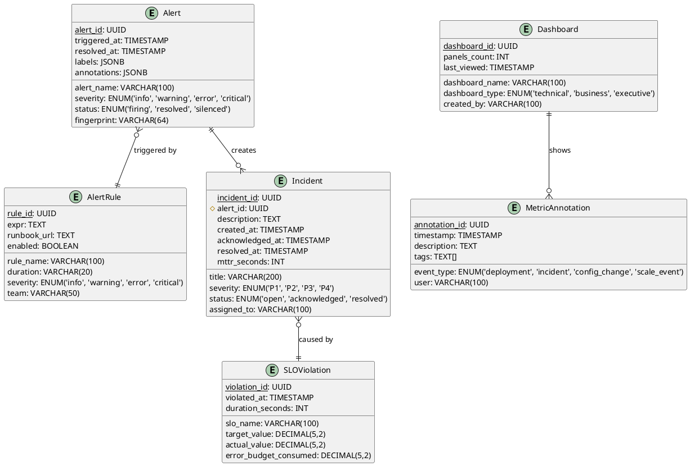
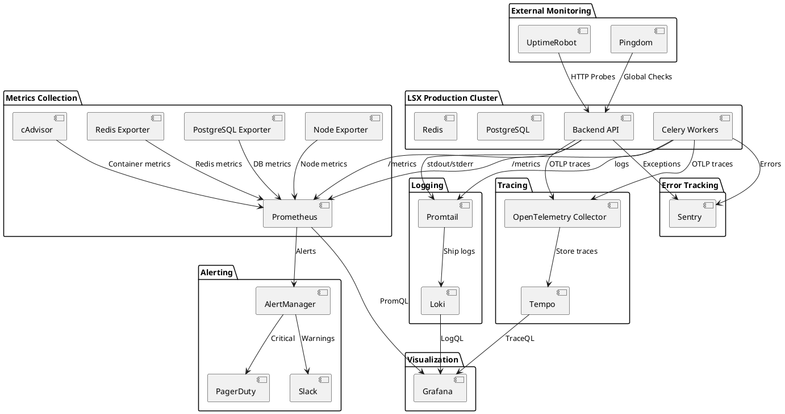
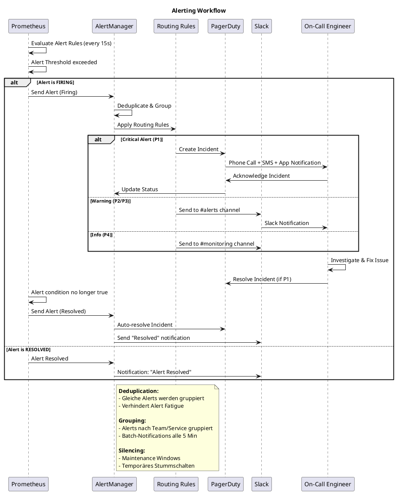
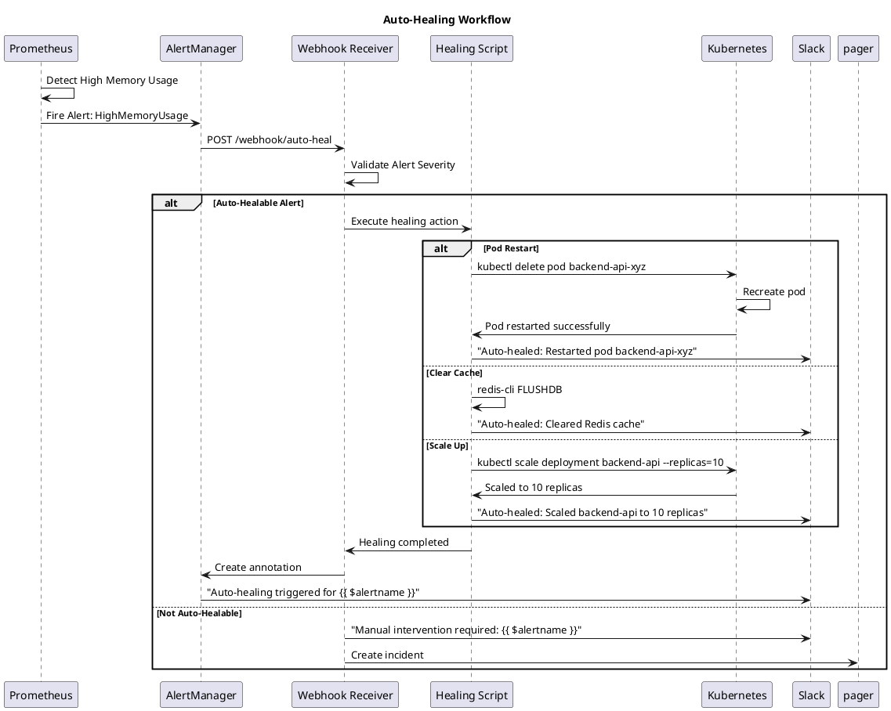

# 30 | Monitoring & Alerting System

**Version:** 1.0
**Status:** Final
**Zuletzt aktualisiert:** 2025-11-15

## Übersicht

Das Monitoring & Alerting System des LSX Lernsystems überwacht **alle Services, Worker, Datenbanken, APIs, Queues, Performance-Werte und Security-Ereignisse in Echtzeit**. Es gewährleistet **24/7 Verfügbarkeit**, **frühzeitige Fehlererkennung** und **automatische Reaktionen** auf Probleme.

**Wichtige Metriken:**
• **Uptime-Ziel:** 99.9% (SLA)
• **MTTD (Mean Time To Detect):** < 2 Minuten
• **MTTR (Mean Time To Recover):** < 15 Minuten
• **Alert Fatigue Rate:** < 5% False Positives
• **Dashboard Count:** 15+ spezialisierte Dashboards
• **Metrics Collected:** ~5000+ unique metrics

---

## C4 Context Diagram: Monitoring System

```plantuml
@startuml
!include https://raw.githubusercontent.com/plantuml-stdlib/C4-PlantUML/master/C4_Context.puml

title C4 Context Diagram - LSX Monitoring & Alerting System

Person(devops, "DevOps Engineer", "Überwacht System-Health")
Person(admin, "System Administrator", "Reagiert auf Alerts")
Person(developer, "Developer", "Analysiert Fehler und Performance")
Person(business, "Business Analyst", "Überwacht KPIs")

System(lsx, "LSX Lernsystem", "Produktions-System mit allen Services")

System_Boundary(monitoring, "Monitoring & Alerting System") {
    System(prometheus, "Prometheus", "Metrics Collection & Storage")
    System(grafana, "Grafana", "Visualization & Dashboards")
    System(alertmanager, "AlertManager", "Alert Routing & Deduplication")
    System(loki, "Loki", "Log Aggregation")
    System(sentry, "Sentry", "Error Tracking")
}

System_Ext(pagerduty, "PagerDuty", "Incident Management")
System_Ext(slack, "Slack", "Team Notifications")
System_Ext(uptimerobot, "UptimeRobot", "External Uptime Monitoring")

Rel(lsx, prometheus, "Exposes metrics", "/metrics endpoint")
Rel(lsx, loki, "Ships logs", "Promtail")
Rel(lsx, sentry, "Reports errors", "Sentry SDK")

Rel(prometheus, grafana, "Data source")
Rel(loki, grafana, "Data source")
Rel(prometheus, alertmanager, "Sends alerts")

Rel(alertmanager, pagerduty, "Critical alerts")
Rel(alertmanager, slack, "Warnings & notifications")

Rel(uptimerobot, lsx, "Health checks", "HTTPS")
Rel(uptimerobot, slack, "Downtime alerts")

Rel(devops, grafana, "Views dashboards")
Rel(admin, pagerduty, "Responds to incidents")
Rel(developer, sentry, "Analyzes errors")
Rel(business, grafana, "Views KPI dashboards")

@enduml
```

---

## C4 Container Diagram: Monitoring Infrastructure

```plantuml
@startuml
!include https://raw.githubusercontent.com/plantuml-stdlib/C4-PlantUML/master/C4_Container.puml

title C4 Container Diagram - Monitoring Infrastructure

Person(devops, "DevOps Engineer")

System_Boundary(lsx_prod, "LSX Production") {
    Container(backend_api, "Backend API", "Python Flask", "REST API")
    Container(workers, "Celery Workers", "Python", "Background Jobs")
    Container(postgres, "PostgreSQL", "Database", "Primary Data Store")
    Container(redis, "Redis", "Cache", "Sessions & Cache")
}

System_Boundary(monitoring_stack, "Monitoring Stack") {
    Container(prometheus, "Prometheus", "Time-Series DB", "Metrics Storage & Queries")
    Container(node_exporter, "Node Exporter", "Exporter", "Server Metrics")
    Container(postgres_exporter, "PostgreSQL Exporter", "Exporter", "DB Metrics")
    Container(redis_exporter, "Redis Exporter", "Exporter", "Cache Metrics")
    Container(blackbox_exporter, "Blackbox Exporter", "Exporter", "Endpoint Probing")
}

System_Boundary(logging_stack, "Logging Stack") {
    Container(promtail, "Promtail", "Log Collector", "Collects & Ships Logs")
    Container(loki, "Loki", "Log Storage", "Aggregates Logs")
}

System_Boundary(visualization, "Visualization & Alerting") {
    Container(grafana, "Grafana", "Dashboards", "15+ Dashboards")
    Container(alertmanager, "AlertManager", "Alert Router", "Routes & Deduplicates Alerts")
}

System_Boundary(error_tracking, "Error Tracking") {
    Container(sentry, "Sentry", "Error Monitor", "Exception Tracking")
}

System_Ext(pagerduty, "PagerDuty")
System_Ext(slack, "Slack")

' Production to Exporters
Rel(backend_api, prometheus, "Metrics endpoint", ":8000/metrics")
Rel(workers, prometheus, "Metrics endpoint", ":9100/metrics")
Rel(node_exporter, prometheus, "Node metrics")
Rel(postgres_exporter, prometheus, "DB metrics")
Rel(redis_exporter, prometheus, "Redis metrics")
Rel(blackbox_exporter, prometheus, "Probe results")

' Logging
Rel(backend_api, promtail, "Application logs", "stdout/stderr")
Rel(workers, promtail, "Worker logs", "stdout/stderr")
Rel(promtail, loki, "Ships logs", "HTTP")

' Error Tracking
Rel(backend_api, sentry, "Exceptions", "Sentry SDK")
Rel(workers, sentry, "Worker errors", "Sentry SDK")

' Visualization
Rel(prometheus, grafana, "PromQL queries")
Rel(loki, grafana, "LogQL queries")
Rel(prometheus, alertmanager, "Firing alerts")

' Alerting
Rel(alertmanager, pagerduty, "Critical incidents", "Integration API")
Rel(alertmanager, slack, "Notifications", "Webhook")

Rel(devops, grafana, "Views dashboards")

@enduml
```

---

## 1. Ziele des Monitoring & Alerting Systems

### 1.1 Primäre Ziele

| Ziel | Beschreibung | Metrik |
|------|--------------|--------|
| **Früherkennung von Fehlern** | Probleme erkennen bevor Nutzer betroffen sind | MTTD < 2 Min |
| **Schnelle Reaktion** | Automatisches Incident Management | MTTR < 15 Min |
| **Performance-Überwachung** | Latenzen, Durchsatz, Fehlerraten | SLA 99.9% |
| **Ressourcen-Optimierung** | CPU, RAM, Disk, Network optimal nutzen | Utilization < 70% |
| **Kosten-Transparenz** | KI-Kosten, Storage, Infrastructure tracking | Budget Alerts |
| **Business KPIs** | Nutzeraktivität, Umsatz, Conversions | Real-time Dashboards |

### 1.2 SLIs, SLOs und SLAs

**Service Level Indicators (SLIs):**
• API Request Success Rate
• API Response Time (p95, p99)
• Worker Job Success Rate
• Database Query Latency
• Cache Hit Rate

**Service Level Objectives (SLOs):**

| Service | SLO | Measurement Window |
|---------|-----|-------------------|
| **API Availability** | 99.9% uptime | 30 Tage rollierend |
| **API Response Time (p95)** | < 200ms | 1 Stunde |
| **Worker Job Success Rate** | > 99% | 24 Stunden |
| **Database Query Latency (p99)** | < 50ms | 1 Stunde |
| **Cache Hit Rate** | > 80% | 24 Stunden |

**Service Level Agreements (SLAs):**
• **Uptime:** 99.9% monatlich (erlaubt ~43 Minuten Downtime/Monat)
• **Response Time:** p95 < 300ms (zahlende Nutzer)
• **Support Response:** < 4 Stunden (Premium), < 24 Stunden (Free)

### 1.3 Observability Pillars

LSX implementiert die drei Säulen der Observability:

**1. Metrics (Metriken)**
• Quantitative Daten über Systemverhalten
• Prometheus Time-Series Database
• ~5000+ unique metrics

**2. Logs (Protokolle)**
• Strukturierte JSON Logs
• Loki Log Aggregation
• ~10 GB Logs/Tag

**3. Traces (Verteilte Traces)**
• Request-Flow über Microservices
• Jaeger/Tempo für Distributed Tracing
• End-to-End Latency Analysis

---

## 2. ER-Diagramm: Monitoring Metadata



---

## 3. Monitoring-Architektur

### 3.1 Monitoring Stack



### 3.2 Überwachungskomponenten

#### 3.2.1 Backend API Monitoring

**Metriken:**
• Request Rate (requests/second)
• Response Time (p50, p95, p99)
• Error Rate (4xx, 5xx)
• Concurrent Connections
• CPU/RAM Utilization
• Database Query Count
• Cache Hit/Miss Ratio

**Prometheus Metrics Beispiel:**
```python
from prometheus_client import Counter, Histogram, Gauge

# Request Counter
http_requests_total = Counter(
    'lsx_http_requests_total',
    'Total HTTP requests',
    ['method', 'endpoint', 'status_code']
)

# Response Time Histogram
http_request_duration_seconds = Histogram(
    'lsx_http_request_duration_seconds',
    'HTTP request latency',
    ['method', 'endpoint'],
    buckets=[.005, .01, .025, .05, .1, .25, .5, 1, 2.5, 5, 10]
)

# Active Connections
http_active_connections = Gauge(
    'lsx_http_active_connections',
    'Number of active HTTP connections'
)

# Database Connection Pool
db_connection_pool_usage = Gauge(
    'lsx_db_connection_pool_usage',
    'Database connection pool usage',
    ['pool_name']
)

# Usage in Flask
@app.route('/api/courses')
def get_courses():
    start_time = time.time()
    try:
        courses = Course.query.all()
        http_requests_total.labels(method='GET', endpoint='/api/courses', status_code=200).inc()
        return jsonify([c.to_dict() for c in courses]), 200
    except Exception as e:
        http_requests_total.labels(method='GET', endpoint='/api/courses', status_code=500).inc()
        raise
    finally:
        duration = time.time() - start_time
        http_request_duration_seconds.labels(method='GET', endpoint='/api/courses').observe(duration)
```

#### 3.2.2 Worker & Queue Monitoring

**Celery Metrics:**
```python
from prometheus_client import Counter, Gauge, Histogram

# Worker Metrics
celery_tasks_total = Counter(
    'lsx_celery_tasks_total',
    'Total Celery tasks',
    ['task_name', 'status']  # status: success, failure, retry
)

celery_task_duration_seconds = Histogram(
    'lsx_celery_task_duration_seconds',
    'Celery task execution time',
    ['task_name'],
    buckets=[1, 5, 10, 30, 60, 120, 300, 600]
)

celery_queue_length = Gauge(
    'lsx_celery_queue_length',
    'Number of tasks in queue',
    ['queue_name']
)

celery_active_workers = Gauge(
    'lsx_celery_active_workers',
    'Number of active Celery workers'
)

# Custom Task Decorator
def monitored_task(task_func):
    @wraps(task_func)
    def wrapper(*args, **kwargs):
        start_time = time.time()
        try:
            result = task_func(*args, **kwargs)
            celery_tasks_total.labels(task_name=task_func.__name__, status='success').inc()
            return result
        except Exception as e:
            celery_tasks_total.labels(task_name=task_func.__name__, status='failure').inc()
            raise
        finally:
            duration = time.time() - start_time
            celery_task_duration_seconds.labels(task_name=task_func.__name__).observe(duration)
    return wrapper

# Usage
@celery.task
@monitored_task
def generate_glossary_task(module_id):
    # ... KI-Generierung
    pass
```

#### 3.2.3 KI Monitoring

**KI-spezifische Metriken:**
```python
from prometheus_client import Counter, Histogram, Gauge

# KI Request Metrics
ki_api_requests_total = Counter(
    'lsx_ki_api_requests_total',
    'Total KI API requests',
    ['provider', 'model', 'status']  # provider: openai, anthropic
)

ki_api_duration_seconds = Histogram(
    'lsx_ki_api_duration_seconds',
    'KI API request duration',
    ['provider', 'model'],
    buckets=[0.5, 1, 2, 5, 10, 20, 30, 60]
)

ki_tokens_consumed = Counter(
    'lsx_ki_tokens_consumed_total',
    'Total tokens consumed',
    ['provider', 'model', 'token_type']  # token_type: prompt, completion
)

ki_cost_usd = Counter(
    'lsx_ki_cost_usd_total',
    'Total KI costs in USD',
    ['provider', 'model']
)

ki_cache_hit_ratio = Gauge(
    'lsx_ki_cache_hit_ratio',
    'KI cache hit ratio (0-1)',
    ['cache_type']  # cache_type: glossary, summary, quiz
)

# KI Service Monitoring
class MonitoredKIService:
    def __init__(self):
        self.openai_client = OpenAI(api_key=OPENAI_API_KEY)

    def call_gpt4(self, prompt: str, model: str = "gpt-4") -> dict:
        start_time = time.time()
        try:
            response = self.openai_client.chat.completions.create(
                model=model,
                messages=[{"role": "user", "content": prompt}]
            )

            # Track success
            ki_api_requests_total.labels(provider='openai', model=model, status='success').inc()

            # Track tokens
            prompt_tokens = response.usage.prompt_tokens
            completion_tokens = response.usage.completion_tokens
            ki_tokens_consumed.labels(provider='openai', model=model, token_type='prompt').inc(prompt_tokens)
            ki_tokens_consumed.labels(provider='openai', model=model, token_type='completion').inc(completion_tokens)

            # Track cost (GPT-4: $0.03/1K prompt, $0.06/1K completion)
            cost = (prompt_tokens / 1000 * 0.03) + (completion_tokens / 1000 * 0.06)
            ki_cost_usd.labels(provider='openai', model=model).inc(cost)

            return response
        except Exception as e:
            ki_api_requests_total.labels(provider='openai', model=model, status='failure').inc()
            raise
        finally:
            duration = time.time() - start_time
            ki_api_duration_seconds.labels(provider='openai', model=model).observe(duration)
```

#### 3.2.4 Datenbank Monitoring

**PostgreSQL Exporter Metriken:**
```yaml
# PostgreSQL Monitoring Queries
pg_stat_activity_connections:
  query: "SELECT state, count(*) FROM pg_stat_activity GROUP BY state"
  metrics:
    - state:
        usage: "LABEL"
        description: "Connection state"
    - count:
        usage: "GAUGE"
        description: "Number of connections"

pg_stat_database_size:
  query: "SELECT datname, pg_database_size(datname) as size_bytes FROM pg_database"
  metrics:
    - datname:
        usage: "LABEL"
        description: "Database name"
    - size_bytes:
        usage: "GAUGE"
        description: "Database size in bytes"

pg_slow_queries:
  query: |
    SELECT query, mean_exec_time, calls
    FROM pg_stat_statements
    WHERE mean_exec_time > 100
    ORDER BY mean_exec_time DESC
    LIMIT 10
  metrics:
    - query:
        usage: "LABEL"
        description: "Query text"
    - mean_exec_time:
        usage: "GAUGE"
        description: "Mean execution time (ms)"
    - calls:
        usage: "COUNTER"
        description: "Number of times executed"

pg_replication_lag:
  query: |
    SELECT application_name,
           EXTRACT(EPOCH FROM (now() - pg_last_xact_replay_timestamp())) as lag_seconds
    FROM pg_stat_replication
  metrics:
    - application_name:
        usage: "LABEL"
        description: "Replication application"
    - lag_seconds:
        usage: "GAUGE"
        description: "Replication lag in seconds"
```

#### 3.2.5 Redis Monitoring

**Redis Exporter Metriken:**
```bash
# redis_exporter automatisch exportierte Metriken:
redis_connected_clients                    # Anzahl verbundener Clients
redis_used_memory_bytes                    # Genutzter RAM
redis_used_memory_rss_bytes               # Resident Set Size
redis_keyspace_hits_total                 # Cache Hits
redis_keyspace_misses_total               # Cache Misses
redis_evicted_keys_total                  # Evicted Keys
redis_expired_keys_total                  # Expired Keys
redis_commands_processed_total            # Total Commands
redis_instantaneous_ops_per_sec          # Operations/Sekunde

# Hit Rate Berechnung in PromQL
rate(redis_keyspace_hits_total[5m]) /
(rate(redis_keyspace_hits_total[5m]) + rate(redis_keyspace_misses_total[5m])) * 100
```

---

## 4. Grafana Dashboards

### 4.1 API Performance Dashboard

```json
{
  "dashboard": {
    "title": "LSX API Performance",
    "tags": ["api", "performance"],
    "panels": [
      {
        "title": "Request Rate",
        "targets": [{
          "expr": "sum(rate(lsx_http_requests_total[5m])) by (endpoint)"
        }],
        "type": "graph"
      },
      {
        "title": "Response Time (p95)",
        "targets": [{
          "expr": "histogram_quantile(0.95, sum(rate(lsx_http_request_duration_seconds_bucket[5m])) by (le, endpoint))"
        }],
        "type": "graph",
        "fieldConfig": {
          "defaults": {
            "unit": "s",
            "thresholds": {
              "steps": [
                { "value": 0, "color": "green" },
                { "value": 0.2, "color": "yellow" },
                { "value": 0.5, "color": "red" }
              ]
            }
          }
        }
      },
      {
        "title": "Error Rate",
        "targets": [{
          "expr": "sum(rate(lsx_http_requests_total{status_code=~'5..'}[5m])) / sum(rate(lsx_http_requests_total[5m])) * 100"
        }],
        "type": "stat",
        "fieldConfig": {
          "defaults": {
            "unit": "percent",
            "thresholds": {
              "steps": [
                { "value": 0, "color": "green" },
                { "value": 1, "color": "yellow" },
                { "value": 5, "color": "red" }
              ]
            }
          }
        }
      },
      {
        "title": "Top 10 Slowest Endpoints",
        "targets": [{
          "expr": "topk(10, histogram_quantile(0.99, sum(rate(lsx_http_request_duration_seconds_bucket[30m])) by (le, endpoint)))"
        }],
        "type": "table"
      },
      {
        "title": "Database Connection Pool",
        "targets": [{
          "expr": "lsx_db_connection_pool_usage"
        }],
        "type": "graph"
      }
    ]
  }
}
```

### 4.2 Worker & Queue Dashboard

```json
{
  "dashboard": {
    "title": "LSX Worker & Queue Monitoring",
    "panels": [
      {
        "title": "Queue Length",
        "targets": [{
          "expr": "lsx_celery_queue_length"
        }],
        "type": "graph",
        "alert": {
          "conditions": [{
            "evaluator": { "params": [200], "type": "gt" },
            "query": { "params": ["A", "5m", "now"] }
          }]
        }
      },
      {
        "title": "Task Success Rate",
        "targets": [{
          "expr": "sum(rate(lsx_celery_tasks_total{status='success'}[5m])) / sum(rate(lsx_celery_tasks_total[5m])) * 100"
        }],
        "type": "stat"
      },
      {
        "title": "Task Duration by Type",
        "targets": [{
          "expr": "histogram_quantile(0.95, sum(rate(lsx_celery_task_duration_seconds_bucket[5m])) by (le, task_name))"
        }],
        "type": "graph"
      },
      {
        "title": "Active Workers",
        "targets": [{
          "expr": "lsx_celery_active_workers"
        }],
        "type": "stat"
      },
      {
        "title": "Failed Tasks (Last Hour)",
        "targets": [{
          "expr": "sum(increase(lsx_celery_tasks_total{status='failure'}[1h])) by (task_name)"
        }],
        "type": "table"
      }
    ]
  }
}
```

### 4.3 KI Costs & Token Dashboard

```json
{
  "dashboard": {
    "title": "LSX KI Monitoring",
    "panels": [
      {
        "title": "KI Costs (Daily)",
        "targets": [{
          "expr": "sum(increase(lsx_ki_cost_usd_total[24h])) by (provider, model)"
        }],
        "type": "piechart"
      },
      {
        "title": "KI Costs Trend",
        "targets": [{
          "expr": "sum(rate(lsx_ki_cost_usd_total[1h])) by (provider) * 24 * 30"
        }],
        "type": "graph",
        "fieldConfig": {
          "defaults": {
            "unit": "currencyUSD"
          }
        }
      },
      {
        "title": "Tokens Consumed (Hourly)",
        "targets": [{
          "expr": "sum(rate(lsx_ki_tokens_consumed_total[1h]) * 3600) by (provider, model)"
        }],
        "type": "graph"
      },
      {
        "title": "KI Cache Hit Ratio",
        "targets": [{
          "expr": "lsx_ki_cache_hit_ratio * 100"
        }],
        "type": "stat",
        "fieldConfig": {
          "defaults": {
            "unit": "percent",
            "thresholds": {
              "steps": [
                { "value": 0, "color": "red" },
                { "value": 50, "color": "yellow" },
                { "value": 80, "color": "green" }
              ]
            }
          }
        }
      },
      {
        "title": "KI Request Duration (p95)",
        "targets": [{
          "expr": "histogram_quantile(0.95, sum(rate(lsx_ki_api_duration_seconds_bucket[5m])) by (le, provider, model))"
        }],
        "type": "graph"
      },
      {
        "title": "KI API Error Rate",
        "targets": [{
          "expr": "sum(rate(lsx_ki_api_requests_total{status='failure'}[5m])) / sum(rate(lsx_ki_api_requests_total[5m])) * 100"
        }],
        "type": "stat"
      }
    ]
  }
}
```

### 4.4 Business KPI Dashboard

```json
{
  "dashboard": {
    "title": "LSX Business KPIs",
    "panels": [
      {
        "title": "Daily Active Users (DAU)",
        "targets": [{
          "expr": "count(lsx_user_last_active_timestamp > (time() - 86400))"
        }],
        "type": "stat"
      },
      {
        "title": "New Courses Created (Last 7 Days)",
        "targets": [{
          "expr": "sum(increase(lsx_courses_created_total[7d]))"
        }],
        "type": "stat"
      },
      {
        "title": "Revenue (Monthly)",
        "targets": [{
          "expr": "sum(lsx_revenue_usd_total{period='monthly'})"
        }],
        "type": "graph",
        "fieldConfig": {
          "defaults": {
            "unit": "currencyUSD"
          }
        }
      },
      {
        "title": "Conversion Rate (Free → Premium)",
        "targets": [{
          "expr": "lsx_conversion_rate{from='free', to='premium'} * 100"
        }],
        "type": "stat",
        "fieldConfig": {
          "defaults": {
            "unit": "percent"
          }
        }
      },
      {
        "title": "Churn Rate",
        "targets": [{
          "expr": "lsx_churn_rate * 100"
        }],
        "type": "gauge",
        "fieldConfig": {
          "defaults": {
            "unit": "percent",
            "max": 10,
            "thresholds": {
              "steps": [
                { "value": 0, "color": "green" },
                { "value": 3, "color": "yellow" },
                { "value": 5, "color": "red" }
              ]
            }
          }
        }
      }
    ]
  }
}
```

---

## 5. Alerting System

### 5.1 Alerting Workflow



### 5.2 AlertManager Configuration

```yaml
# /etc/alertmanager/alertmanager.yml
global:
  resolve_timeout: 5m
  slack_api_url: 'https://hooks.slack.com/services/T00000000/B00000000/XXXXXXXXXXXX'
  pagerduty_url: 'https://events.pagerduty.com/v2/enqueue'

# Routing Tree
route:
  receiver: 'default'
  group_by: ['alertname', 'cluster', 'service']
  group_wait: 10s        # Warte 10s auf weitere Alerts vor Versand
  group_interval: 5m     # Neue Alerts zu existierender Gruppe alle 5min
  repeat_interval: 4h    # Wiederhole Alarm alle 4h wenn nicht resolved

  routes:
  # Critical Alerts → PagerDuty
  - match:
      severity: critical
    receiver: 'pagerduty-critical'
    continue: true  # Send auch zu Slack

  # Critical → auch Slack
  - match:
      severity: critical
    receiver: 'slack-critical'

  # Warnings → Slack
  - match:
      severity: warning
    receiver: 'slack-warnings'

  # Info → Low-Priority Slack
  - match:
      severity: info
    receiver: 'slack-info'

  # Database Alerts → DB Team
  - match:
      team: database
    receiver: 'slack-db-team'

  # Business Alerts → Business Slack
  - match_re:
      alertname: '(ChurnRate|ConversionDrop|RevenueDrop)'
    receiver: 'slack-business'

# Inhibition Rules (verhindert redundante Alerts)
inhibit_rules:
  # Wenn API Down, ignoriere API HighLatency Alerts
  - source_match:
      alertname: 'APIDown'
    target_match:
      alertname: 'APIHighLatency'
    equal: ['cluster', 'service']

  # Wenn Node Down, ignoriere alle Node-Metrics
  - source_match:
      severity: 'critical'
      alertname: 'NodeDown'
    target_match_re:
      alertname: '(HighCPU|HighMemory|DiskFull)'
    equal: ['instance']

receivers:
- name: 'default'
  slack_configs:
  - channel: '#alerts-default'
    title: 'LSX Alert'
    text: '{{ range .Alerts }}{{ .Annotations.description }}{{ end }}'

- name: 'pagerduty-critical'
  pagerduty_configs:
  - service_key: 'YOUR_PAGERDUTY_INTEGRATION_KEY'
    severity: '{{ .CommonLabels.severity }}'
    description: '{{ .CommonAnnotations.summary }}'
    details:
      firing: '{{ .Alerts.Firing | len }}'
      resolved: '{{ .Alerts.Resolved | len }}'

- name: 'slack-critical'
  slack_configs:
  - channel: '#alerts-critical'
    color: 'danger'
    title: ':rotating_light: CRITICAL: {{ .CommonLabels.alertname }}'
    text: |
      *Summary:* {{ .CommonAnnotations.summary }}
      *Description:* {{ .CommonAnnotations.description }}
      *Runbook:* {{ .CommonAnnotations.runbook_url }}
    actions:
    - type: button
      text: 'Runbook :book:'
      url: '{{ .CommonAnnotations.runbook_url }}'
    - type: button
      text: 'Silence :no_bell:'
      url: '{{ template "__alert_silence_link" . }}'

- name: 'slack-warnings'
  slack_configs:
  - channel: '#alerts-warnings'
    color: 'warning'
    title: ':warning: Warning: {{ .CommonLabels.alertname }}'

- name: 'slack-info'
  slack_configs:
  - channel: '#monitoring'
    color: 'good'
    title: 'Info: {{ .CommonLabels.alertname }}'

- name: 'slack-db-team'
  slack_configs:
  - channel: '#team-database'
    color: '{{ if eq .Status "firing" }}danger{{ else }}good{{ end }}'
    title: 'Database Alert: {{ .CommonLabels.alertname }}'

- name: 'slack-business'
  slack_configs:
  - channel: '#business-alerts'
    title: ':chart_with_downwards_trend: Business Alert: {{ .CommonLabels.alertname }}'
```

### 5.3 Prometheus Alert Rules

```yaml
# /etc/prometheus/rules/api_alerts.yml
groups:
- name: api_alerts
  interval: 15s
  rules:

  # Critical: API Down
  - alert: APIDown
    expr: up{job="backend-api"} == 0
    for: 1m
    labels:
      severity: critical
      team: backend
    annotations:
      summary: "API instance {{ $labels.instance }} is down"
      description: "API instance {{ $labels.instance }} has been down for more than 1 minute."
      runbook_url: "https://wiki.lsx.de/runbooks/api-down"

  # Critical: High Error Rate
  - alert: HighErrorRate
    expr: |
      (
        sum(rate(lsx_http_requests_total{status_code=~"5.."}[5m])) by (endpoint)
        /
        sum(rate(lsx_http_requests_total[5m])) by (endpoint)
      ) > 0.05
    for: 3m
    labels:
      severity: critical
      team: backend
    annotations:
      summary: "High error rate on {{ $labels.endpoint }}"
      description: "Endpoint {{ $labels.endpoint }} has error rate above 5% (current: {{ $value | humanizePercentage }})"
      runbook_url: "https://wiki.lsx.de/runbooks/high-error-rate"

  # Warning: High Latency
  - alert: HighLatency
    expr: |
      histogram_quantile(0.95,
        sum(rate(lsx_http_request_duration_seconds_bucket[5m])) by (le, endpoint)
      ) > 0.5
    for: 5m
    labels:
      severity: warning
      team: backend
    annotations:
      summary: "High latency on {{ $labels.endpoint }}"
      description: "Endpoint {{ $labels.endpoint }} p95 latency is {{ $value }}s (threshold: 0.5s)"
      runbook_url: "https://wiki.lsx.de/runbooks/high-latency"

  # Warning: High CPU Usage
  - alert: HighCPUUsage
    expr: |
      100 - (avg by (instance) (rate(node_cpu_seconds_total{mode="idle"}[5m])) * 100) > 80
    for: 10m
    labels:
      severity: warning
      team: devops
    annotations:
      summary: "High CPU usage on {{ $labels.instance }}"
      description: "CPU usage on {{ $labels.instance }} is {{ $value | humanize }}%"

  # Critical: High Memory Usage
  - alert: HighMemoryUsage
    expr: |
      (node_memory_MemTotal_bytes - node_memory_MemAvailable_bytes) / node_memory_MemTotal_bytes > 0.9
    for: 5m
    labels:
      severity: critical
      team: devops
    annotations:
      summary: "High memory usage on {{ $labels.instance }}"
      description: "Memory usage on {{ $labels.instance }} is {{ $value | humanizePercentage }}"
      runbook_url: "https://wiki.lsx.de/runbooks/high-memory"

---
# /etc/prometheus/rules/worker_alerts.yml
groups:
- name: worker_alerts
  interval: 15s
  rules:

  # Critical: Queue Too Long
  - alert: QueueTooLong
    expr: lsx_celery_queue_length > 200
    for: 10m
    labels:
      severity: critical
      team: backend
    annotations:
      summary: "Celery queue {{ $labels.queue_name }} is too long"
      description: "Queue {{ $labels.queue_name }} has {{ $value }} tasks (threshold: 200)"
      runbook_url: "https://wiki.lsx.de/runbooks/queue-too-long"

  # Warning: High Task Failure Rate
  - alert: HighTaskFailureRate
    expr: |
      (
        sum(rate(lsx_celery_tasks_total{status="failure"}[10m])) by (task_name)
        /
        sum(rate(lsx_celery_tasks_total[10m])) by (task_name)
      ) > 0.1
    for: 5m
    labels:
      severity: warning
      team: backend
    annotations:
      summary: "High failure rate for task {{ $labels.task_name }}"
      description: "Task {{ $labels.task_name }} has {{ $value | humanizePercentage }} failure rate"

  # Critical: No Active Workers
  - alert: NoActiveWorkers
    expr: lsx_celery_active_workers == 0
    for: 2m
    labels:
      severity: critical
      team: backend
    annotations:
      summary: "No active Celery workers"
      description: "All Celery workers are down. No background jobs are being processed."
      runbook_url: "https://wiki.lsx.de/runbooks/no-workers"

---
# /etc/prometheus/rules/database_alerts.yml
groups:
- name: database_alerts
  interval: 15s
  rules:

  # Critical: Database Down
  - alert: PostgreSQLDown
    expr: pg_up == 0
    for: 1m
    labels:
      severity: critical
      team: database
    annotations:
      summary: "PostgreSQL instance {{ $labels.instance }} is down"
      description: "PostgreSQL has been down for more than 1 minute."
      runbook_url: "https://wiki.lsx.de/runbooks/postgres-down"

  # Warning: Slow Queries
  - alert: SlowQueries
    expr: pg_stat_statements_mean_exec_time_seconds > 0.5
    for: 10m
    labels:
      severity: warning
      team: database
    annotations:
      summary: "Slow queries detected"
      description: "Query {{ $labels.query }} has mean execution time {{ $value }}s"

  # Critical: Replication Lag
  - alert: ReplicationLagHigh
    expr: pg_replication_lag_seconds > 10
    for: 5m
    labels:
      severity: critical
      team: database
    annotations:
      summary: "Replication lag is high"
      description: "Replication lag on {{ $labels.application_name }} is {{ $value }}s (threshold: 10s)"
      runbook_url: "https://wiki.lsx.de/runbooks/replication-lag"

  # Warning: High Connection Count
  - alert: HighConnectionCount
    expr: pg_stat_activity_count > 80
    for: 10m
    labels:
      severity: warning
      team: database
    annotations:
      summary: "High number of database connections"
      description: "Database has {{ $value }} active connections (max: 100)"

---
# /etc/prometheus/rules/ki_alerts.yml
groups:
- name: ki_alerts
  interval: 30s
  rules:

  # Warning: KI Costs High
  - alert: KICostsHigh
    expr: sum(rate(lsx_ki_cost_usd_total[1h]) * 24 * 30) > 5000
    for: 30m
    labels:
      severity: warning
      team: backend
    annotations:
      summary: "KI costs projected to exceed $5000/month"
      description: "Current KI cost trend: ${{ $value | humanize }}/month"

  # Critical: KI API Down
  - alert: KIAPIDown
    expr: |
      (
        sum(rate(lsx_ki_api_requests_total{status="failure"}[5m])) by (provider)
        /
        sum(rate(lsx_ki_api_requests_total[5m])) by (provider)
      ) > 0.5
    for: 3m
    labels:
      severity: critical
      team: backend
    annotations:
      summary: "KI API {{ $labels.provider }} has high failure rate"
      description: "{{ $labels.provider }} API failure rate: {{ $value | humanizePercentage }}"
      runbook_url: "https://wiki.lsx.de/runbooks/ki-api-down"

  # Warning: Low Cache Hit Rate
  - alert: LowKICacheHitRate
    expr: lsx_ki_cache_hit_ratio < 0.5
    for: 30m
    labels:
      severity: warning
      team: backend
    annotations:
      summary: "KI cache hit rate is low"
      description: "Cache hit rate for {{ $labels.cache_type }}: {{ $value | humanizePercentage }}"

---
# /etc/prometheus/rules/business_alerts.yml
groups:
- name: business_alerts
  interval: 5m
  rules:

  # Warning: Churn Rate High
  - alert: ChurnRateHigh
    expr: lsx_churn_rate > 0.05
    for: 1h
    labels:
      severity: warning
      team: business
    annotations:
      summary: "Monthly churn rate is high"
      description: "Churn rate is {{ $value | humanizePercentage }} (threshold: 5%)"

  # Warning: Conversion Drop
  - alert: ConversionDrop
    expr: |
      (
        lsx_conversion_rate{from="free",to="premium"}
        <
        (lsx_conversion_rate{from="free",to="premium"} offset 7d) * 0.7
      )
    for: 2h
    labels:
      severity: warning
      team: business
    annotations:
      summary: "Conversion rate dropped significantly"
      description: "Free→Premium conversion dropped by >30% compared to last week"

  # Critical: Revenue Drop
  - alert: RevenueDrop
    expr: |
      (
        sum(rate(lsx_revenue_usd_total[24h]))
        <
        (sum(rate(lsx_revenue_usd_total[24h] offset 7d)) * 0.5)
      )
    for: 4h
    labels:
      severity: critical
      team: business
    annotations:
      summary: "Daily revenue dropped significantly"
      description: "Revenue is 50% lower than same day last week"
```

---

## 6. Log Aggregation mit Loki

### 6.1 Promtail Configuration

```yaml
# /etc/promtail/promtail.yml
server:
  http_listen_port: 9080
  grpc_listen_port: 0

positions:
  filename: /tmp/positions.yaml

clients:
  - url: http://loki:3100/loki/api/v1/push

scrape_configs:
  # Backend API Logs
  - job_name: backend-api
    static_configs:
    - targets:
        - localhost
      labels:
        job: backend-api
        __path__: /var/log/lsx/backend-api/*.log

    pipeline_stages:
    # Parse JSON logs
    - json:
        expressions:
          level: level
          timestamp: timestamp
          message: message
          user_id: user_id
          endpoint: endpoint
          method: method
          status_code: status_code
          duration_ms: duration_ms

    # Extract labels
    - labels:
        level:
        endpoint:
        method:
        status_code:

    # Add timestamp
    - timestamp:
        source: timestamp
        format: RFC3339

  # Worker Logs
  - job_name: celery-workers
    static_configs:
    - targets:
        - localhost
      labels:
        job: celery-workers
        __path__: /var/log/lsx/workers/*.log

    pipeline_stages:
    - json:
        expressions:
          level: level
          task_name: task_name
          task_id: task_id
          status: status
          duration_seconds: duration_seconds

    - labels:
        level:
        task_name:
        status:

  # Kubernetes Logs
  - job_name: kubernetes-pods
    kubernetes_sd_configs:
    - role: pod

    relabel_configs:
    # Only scrape LSX namespace
    - source_labels: [__meta_kubernetes_namespace]
      regex: lsx-prod
      action: keep

    # Add pod labels
    - source_labels: [__meta_kubernetes_pod_label_app]
      target_label: app

    - source_labels: [__meta_kubernetes_pod_name]
      target_label: pod

    - source_labels: [__meta_kubernetes_namespace]
      target_label: namespace
```

### 6.2 LogQL Queries (Loki Query Language)

```logql
# 1. All ERROR logs in last hour
{job="backend-api"} |= "ERROR" | json | level="ERROR"

# 2. 5xx errors by endpoint
sum by (endpoint) (rate({job="backend-api", status_code=~"5.."} [5m]))

# 3. Slow requests (> 1s)
{job="backend-api"}
  | json
  | duration_ms > 1000
  | line_format "{{ .endpoint }} took {{ .duration_ms }}ms"

# 4. Failed Celery tasks
{job="celery-workers", status="failure"}
  | json
  | line_format "Task {{ .task_name }} ({{ .task_id }}) failed"

# 5. Count errors by user
sum by (user_id) (count_over_time({job="backend-api", level="ERROR"} [1h]))

# 6. Search for specific error message
{job="backend-api"} |~ "(?i)database connection.*timeout"

# 7. KI API errors
{job="backend-api"}
  | json
  | endpoint =~ "/api/ki/.*"
  | status_code =~ "5.."

# 8. Logs from specific pod
{namespace="lsx-prod", pod=~"backend-api-.*"}

# 9. Pattern detection
{job="backend-api"}
  | pattern `<_> <level> <_> [<endpoint>] <message>`
  | endpoint =~ "/api/.*"

# 10. Top 10 error messages
topk(10, sum by (message) (count_over_time({level="ERROR"} [24h])))
```

---

## 7. Error Tracking mit Sentry

### 7.1 Sentry Integration (Backend)

```python
import sentry_sdk
from sentry_sdk.integrations.flask import FlaskIntegration
from sentry_sdk.integrations.celery import CeleryIntegration
from sentry_sdk.integrations.psycopg3 import Psycopg3Integration
from sentry_sdk.integrations.redis import RedisIntegration

sentry_sdk.init(
    dsn="https://examplePublicKey@o0.ingest.sentry.io/0",
    integrations=[
        FlaskIntegration(),
        CeleryIntegration(),
        Psycopg3Integration(),
        RedisIntegration(),
    ],
    environment="production",
    release="lsx@1.2.3",

    # Performance Monitoring
    traces_sample_rate=0.1,  # 10% aller Transactions tracen

    # Profiling
    profiles_sample_rate=0.1,

    # Error Sampling
    sample_rate=1.0,  # Alle Errors erfassen

    # Before Send Hook (PII entfernen)
    before_send=strip_sensitive_data,
)

def strip_sensitive_data(event, hint):
    """Entfernt sensible Daten vor Sentry Upload"""
    # Entferne Authorization Headers
    if 'request' in event and 'headers' in event['request']:
        headers = event['request']['headers']
        if 'Authorization' in headers:
            headers['Authorization'] = '[Filtered]'
        if 'Cookie' in headers:
            headers['Cookie'] = '[Filtered]'

    # Entferne Passwörter aus Request Data
    if 'request' in event and 'data' in event['request']:
        data = event['request']['data']
        if isinstance(data, dict):
            for key in ['password', 'token', 'api_key']:
                if key in data:
                    data[key] = '[Filtered]'

    return event

# Custom Context für bessere Fehleranalyse
@app.before_request
def add_sentry_context():
    if current_user.is_authenticated:
        sentry_sdk.set_user({
            "id": current_user.user_id,
            "email": current_user.email,
            "username": current_user.username,
            "role": current_user.role
        })

    sentry_sdk.set_context("request", {
        "endpoint": request.endpoint,
        "method": request.method,
        "url": request.url,
        "user_agent": request.user_agent.string,
    })

# Custom Error Capturing
@app.errorhandler(500)
def handle_500(error):
    # Capture Exception mit Extra Context
    sentry_sdk.capture_exception(error, extras={
        "sql_query_count": db.session.query_count,
        "cache_hit_ratio": cache.get_hit_ratio(),
    })
    return jsonify({"error": "Internal Server Error"}), 500

# Performance Tracking
@app.route('/api/courses/<int:course_id>')
def get_course(course_id):
    # Sentry Transaction für Performance Monitoring
    with sentry_sdk.start_transaction(op="http.server", name="GET /api/courses/:id"):
        with sentry_sdk.start_span(op="db.query", description="Fetch course"):
            course = Course.query.get(course_id)

        with sentry_sdk.start_span(op="db.query", description="Fetch modules"):
            modules = Module.query.filter_by(course_id=course_id).all()

        return jsonify(course.to_dict(include_modules=modules))
```

### 7.2 Sentry Configuration

**Issue Grouping:**
```python
# Sentry Issue Fingerprinting
def custom_fingerprint(event, hint):
    """Custom Fingerprinting für bessere Gruppierung"""
    if 'exception' in event:
        exception = event['exception']['values'][0]
        error_type = exception['type']

        # Gruppiere Database Errors nach Query Type
        if error_type == 'OperationalError':
            if 'deadlock' in exception['value'].lower():
                return ['database', 'deadlock']
            elif 'timeout' in exception['value'].lower():
                return ['database', 'timeout']

        # Gruppiere KI API Errors nach Provider
        if 'OpenAIError' in error_type:
            return ['ki', 'openai', exception['value'][:50]]

        # Default Fingerprint
        return ['{{ default }}']

    return event

sentry_sdk.init(
    dsn="...",
    before_send=custom_fingerprint,
)
```

**Alert Rules:**
```yaml
# Sentry Alert Rules Configuration
alerts:
  - name: "High Error Rate"
    conditions:
      - filter:
          match: event.type
          value: error
      - filter:
          match: event.level
          value: error
    frequency: 5  # minutes
    threshold: 100  # errors
    actions:
      - service: slack
        workspace: lsx-team
        channel: "#alerts-critical"
      - service: pagerduty
        integration_key: "..."

  - name: "New Error Type"
    conditions:
      - filter:
          match: event.type
          value: error
      - condition: first_seen_event
    actions:
      - service: slack
        channel: "#new-errors"

  - name: "Performance Degradation"
    conditions:
      - filter:
          match: event.type
          value: transaction
      - condition: event.duration.ms > 1000
      - condition: percent_change > 50  # 50% slower than baseline
    actions:
      - service: slack
        channel: "#performance"
```

---

## 8. Auto-Healing & Self-Recovery

### 8.1 Auto-Healing Workflow



### 8.2 Healing Script

```python
# /opt/lsx/auto-healing/heal.py
import logging
import subprocess
from flask import Flask, request, jsonify
import hmac
import hashlib

app = Flask(__name__)

WEBHOOK_SECRET = os.getenv("WEBHOOK_SECRET")
SLACK_WEBHOOK = os.getenv("SLACK_WEBHOOK_URL")

logger = logging.getLogger(__name__)

def verify_signature(payload, signature):
    """Verify AlertManager webhook signature"""
    expected = hmac.new(
        WEBHOOK_SECRET.encode(),
        payload,
        hashlib.sha256
    ).hexdigest()
    return hmac.compare_digest(signature, expected)

def send_slack_notification(message):
    """Send Slack notification"""
    import requests
    requests.post(SLACK_WEBHOOK, json={"text": message})

@app.route('/webhook/auto-heal', methods=['POST'])
def auto_heal():
    """Auto-healing webhook endpoint"""
    # Verify signature
    signature = request.headers.get('X-AlertManager-Signature', '')
    if not verify_signature(request.data, signature):
        return jsonify({"error": "Invalid signature"}), 401

    alerts = request.json.get('alerts', [])

    for alert in alerts:
        if alert['status'] != 'firing':
            continue

        alertname = alert['labels'].get('alertname')
        instance = alert['labels'].get('instance')

        logger.info(f"Processing alert: {alertname} for {instance}")

        # Route to appropriate healing action
        if alertname == 'HighMemoryUsage':
            restart_pod(instance)
        elif alertname == 'HighCPUUsage':
            scale_deployment(instance)
        elif alertname == 'QueueTooLong':
            scale_workers()
        elif alertname == 'RedisHighMemory':
            evict_redis_keys()
        elif alertname == 'DatabaseConnectionPoolFull':
            restart_connection_pool()
        else:
            logger.warning(f"No auto-healing action for {alertname}")
            send_slack_notification(f":warning: Manual intervention needed: {alertname}")
            continue

        send_slack_notification(f":white_check_mark: Auto-healed: {alertname} on {instance}")

    return jsonify({"status": "ok"}), 200

def restart_pod(instance):
    """Restart Kubernetes pod"""
    pod_name = instance.split(':')[0]  # Extract pod name from instance label
    try:
        subprocess.run([
            'kubectl', 'delete', 'pod', pod_name, '-n', 'lsx-prod'
        ], check=True, capture_output=True)
        logger.info(f"Restarted pod: {pod_name}")
    except subprocess.CalledProcessError as e:
        logger.error(f"Failed to restart pod {pod_name}: {e.stderr.decode()}")

def scale_deployment(instance):
    """Scale deployment up"""
    deployment = instance.split('-')[0]  # Extract deployment name
    try:
        # Get current replicas
        result = subprocess.run([
            'kubectl', 'get', 'deployment', deployment, '-n', 'lsx-prod',
            '-o', 'jsonpath={.spec.replicas}'
        ], check=True, capture_output=True)
        current_replicas = int(result.stdout.decode())

        # Scale up by 50%
        new_replicas = int(current_replicas * 1.5)

        subprocess.run([
            'kubectl', 'scale', 'deployment', deployment,
            f'--replicas={new_replicas}', '-n', 'lsx-prod'
        ], check=True)
        logger.info(f"Scaled {deployment} from {current_replicas} to {new_replicas}")
    except subprocess.CalledProcessError as e:
        logger.error(f"Failed to scale {deployment}: {e.stderr.decode()}")

def scale_workers():
    """Scale up Celery workers"""
    try:
        subprocess.run([
            'kubectl', 'scale', 'deployment', 'celery-worker',
            '--replicas=20', '-n', 'lsx-prod'
        ], check=True)
        logger.info("Scaled celery-worker to 20 replicas")
    except subprocess.CalledProcessError as e:
        logger.error(f"Failed to scale workers: {e.stderr.decode()}")

def evict_redis_keys():
    """Evict least recently used Redis keys"""
    try:
        subprocess.run([
            'redis-cli', '-h', 'redis-master', 'MEMORY', 'PURGE'
        ], check=True)
        logger.info("Evicted Redis keys")
    except subprocess.CalledProcessError as e:
        logger.error(f"Failed to evict Redis keys: {e.stderr.decode()}")

def restart_connection_pool():
    """Restart database connection pool"""
    # Send SIGHUP to backend API pods to reload connection pool
    try:
        result = subprocess.run([
            'kubectl', 'get', 'pods', '-n', 'lsx-prod',
            '-l', 'app=backend-api',
            '-o', 'jsonpath={.items[*].metadata.name}'
        ], check=True, capture_output=True)

        pods = result.stdout.decode().split()
        for pod in pods:
            subprocess.run([
                'kubectl', 'exec', pod, '-n', 'lsx-prod', '--',
                'kill', '-HUP', '1'
            ], check=True)
        logger.info(f"Restarted connection pool for {len(pods)} pods")
    except subprocess.CalledProcessError as e:
        logger.error(f"Failed to restart connection pool: {e.stderr.decode()}")

if __name__ == '__main__':
    app.run(host='0.0.0.0', port=5000)
```

---

## 9. Uptime Monitoring (External)

### 9.1 UptimeRobot Configuration

**Monitored Endpoints:**

| Endpoint | Type | Interval | Alert Contacts |
|----------|------|----------|----------------|
| https://app.lsx.de | HTTP(s) | 5 Min | Slack, PagerDuty |
| https://api.lsx.de/health | HTTP(s) | 1 Min | PagerDuty |
| PostgreSQL (pg-primary:5432) | Port | 5 Min | PagerDuty |
| Redis (redis-master:6379) | Port | 5 Min | Slack |
| https://lsx.de | Keyword | 5 Min | Slack |

**Health Check Endpoint:**
```python
@app.route('/health')
def health_check():
    """
    Comprehensive health check für UptimeRobot & Load Balancer.
    Returns 200 OK wenn System healthy, sonst 503.
    """
    checks = {
        "database": check_database(),
        "redis": check_redis(),
        "celery": check_celery_workers(),
        "disk_space": check_disk_space(),
    }

    all_healthy = all(checks.values())
    status_code = 200 if all_healthy else 503

    return jsonify({
        "status": "healthy" if all_healthy else "unhealthy",
        "checks": checks,
        "timestamp": datetime.utcnow().isoformat(),
    }), status_code

def check_database():
    """Check database connectivity"""
    try:
        db.session.execute('SELECT 1')
        return True
    except:
        return False

def check_redis():
    """Check Redis connectivity"""
    try:
        redis_client.ping()
        return True
    except:
        return False

def check_celery_workers():
    """Check if Celery workers are active"""
    try:
        inspect = celery.control.inspect()
        active_workers = inspect.active()
        return active_workers is not None and len(active_workers) > 0
    except:
        return False

def check_disk_space():
    """Check if disk space > 10% free"""
    import shutil
    stat = shutil.disk_usage('/')
    free_percent = (stat.free / stat.total) * 100
    return free_percent > 10
```

### 9.2 Global Monitoring Locations

**Pingdom Checks (von 5 globalen Standorten):**
• North America (USA - New York)
• Europe (Deutschland - Frankfurt)
• Europe (UK - London)
• Asia (Japan - Tokyo)
• South America (Brasilien - São Paulo)

**Monitored Metrics:**
• Uptime %
• Response Time
• Page Load Time
• Transaction Tests (Login, Kurs erstellen)

---

## 10. Zusammenfassung

Das LSX Monitoring & Alerting System bietet **vollständige Observability** über alle Systemkomponenten:

### Kerneigenschaften

✓ **Multi-Layer Monitoring** – Metrics, Logs, Traces
✓ **MTTD < 2 Minuten** – Früherkennung von Problemen
✓ **MTTR < 15 Minuten** – Schnelle Wiederherstellung
✓ **15+ Grafana Dashboards** – Technical & Business KPIs
✓ **Auto-Healing** – Automatische Problembehebung
✓ **Intelligentes Alerting** – Deduplication, Grouping, Routing
✓ **Global Monitoring** – 5 Standorte weltweit
✓ **99.9% SLA** – Guaranteed Uptime

### Monitoring Stack

• **Prometheus:** Metrics Collection (~5000 metrics)
• **Grafana:** 15+ Dashboards (Technical + Business)
• **Loki:** Log Aggregation (~10 GB/Tag)
• **Tempo:** Distributed Tracing
• **Sentry:** Error Tracking
• **AlertManager:** Alert Routing & Deduplication
• **PagerDuty:** Incident Management
• **UptimeRobot:** External Monitoring

### Alert Severities

• **P1 (Critical):** System down, hohe Error Rate → PagerDuty + Slack
• **P2 (Warning):** Performance-Probleme, hohe Latenz → Slack
• **P3 (Info):** Hinweise, Empfehlungen → Slack (#monitoring)
• **P4 (Business):** KPI-Änderungen, Trends → Slack (#business-alerts)

Mit diesem umfassenden Monitoring & Alerting System ist LSX **jederzeit überwacht**, **Probleme werden frühzeitig erkannt** und **automatisch behoben**.

---

**Dokument abgeschlossen.**
**Letzte Aktualisierung:** 2025-11-15
**Nächstes Review:** 2025-12-15
