# 33_Versioning-Change-Management.md

Version: 2.0
Stand: Final
Letzte Aktualisierung: 2025-11-15

Dieses Dokument beschreibt das komplette Versionierungs- und Change-Management-System des LSX Lernsystems.
Es legt fest, wie Änderungen verwaltet, dokumentiert, versioniert und an Claude/ChatGPT kommuniziert werden, um **Fehler, Duplikate und Datenverlust zu verhindern**.

## Ziel

Ein vollständig kontrolliertes, sauberes, professionelles Entwicklungs- und Änderungsmanagement für:
• System-Releases
• API-Versionierung
• Kurs- und Modulversionen
• KI-Pipeline-Versionen
• Datenbankmigrationen
• Dokumentationsänderungen

---

## C4 Context: Versioning & Change Management System

```plantuml
@startuml
!include https://raw.githubusercontent.com/plantuml-stdlib/C4-PlantUML/master/C4_Context.puml

LAYOUT_WITH_LEGEND()

title C4 Context - LSX Versioning & Change Management System

Person(developer, "Developer", "Entwickler mit Claude/ChatGPT")
Person(creator, "Creator", "Kurs-Ersteller")
Person(admin, "System Admin", "Verantwortlich für Releases")

System_Boundary(lsx, "LSX System") {
    System(version_system, "Version Management System", "Verwaltet alle Versionen: System, API, Kurse, KI-Pipelines")
    System(change_system, "Change Request System", "Kontrolliert alle Änderungen über CRs")
    System(migration_system, "Migration Management", "DB Migrationen & Rollbacks")
}

System_Ext(git, "Git Repository", "GitHub mit Tags & Branches")
System_Ext(cicd, "CI/CD Pipeline", "GitHub Actions für Deployments")
System_Ext(db, "PostgreSQL", "Datenbank mit Migration History")

Rel(developer, version_system, "Prüft Versionen, erstellt CRs", "HTTPS")
Rel(creator, version_system, "Erstellt Kurs-Versionen", "HTTPS")
Rel(admin, change_system, "Genehmigt CRs", "HTTPS")

Rel(version_system, git, "Erstellt Tags & Branches", "Git API")
Rel(change_system, cicd, "Triggert Deployments", "Webhook")
Rel(migration_system, db, "Führt Migrationen aus", "SQL")

Rel(version_system, change_system, "CR-basierte Versionierung")
Rel(change_system, migration_system, "Triggert DB-Änderungen")

@enduml
```

---

## 1. Ziele des Versioning- & Change-Managements

Das System soll:

| Ziel | Beschreibung | Nutzen |
|------|--------------|--------|
| **Nachvollziehbarkeit** | Alle Änderungen werden dokumentiert und versioniert | Audit-Trail, Debugging, Compliance |
| **Konfliktvermeidung** | Verhindert gleichzeitige inkompatible Änderungen | Stabilität, Teamwork |
| **KI-Steuerung** | Claude/ChatGPT arbeitet mit exakten Versionsnummern | Keine Duplikate, konsistente Prompts |
| **Synchronität** | Code, DB, Doku bleiben synchron | Keine Inkonsistenzen |
| **Rollback-Fähigkeit** | Jede Änderung kann rückgängig gemacht werden | Business Continuity |
| **Kurs-Stabilität** | Kurs-Updates kontrolliert, reproduzierbar | Schulen/Unternehmen können planen |
| **Prompt-Konsistenz** | KI-Prompts versioniert und wiederverwendbar | Qualitätssicherung |
| **Sicherheit** | Nur autorisierte Änderungen | Schutz vor Fehlern |

---

## 2. Versionierungsschichten im LSX-System

LSX verwendet ein **4-Schicht-Versionierungsmodell**:

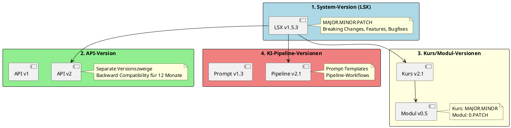

### 2.1 Versionierungsregeln

| Schicht | Format | Beispiel | Increment-Regel |
|---------|--------|----------|-----------------|
| **System** | MAJOR.MINOR.PATCH | 1.5.3 | MAJOR: Breaking Changes • MINOR: Features • PATCH: Bugfixes |
| **API** | v{N} | v1, v2 | Neue Major-Version bei Breaking Changes |
| **Kurs** | MAJOR.MINOR | 2.1 | MAJOR: Struktur-Änderung • MINOR: Inhaltserweiterung |
| **Modul** | 0.PATCH | 0.5 | PATCH: Jede Änderung (Module sind Beta) |
| **KI-Prompt** | MAJOR.MINOR | 1.3 | MAJOR: Prompt-Struktur • MINOR: Parameter-Änderung |
| **KI-Pipeline** | MAJOR.MINOR | 2.1 | MAJOR: Workflow-Änderung • MINOR: Optimierung |

---

## 3. ER-Diagramm: Version Tracking Entities

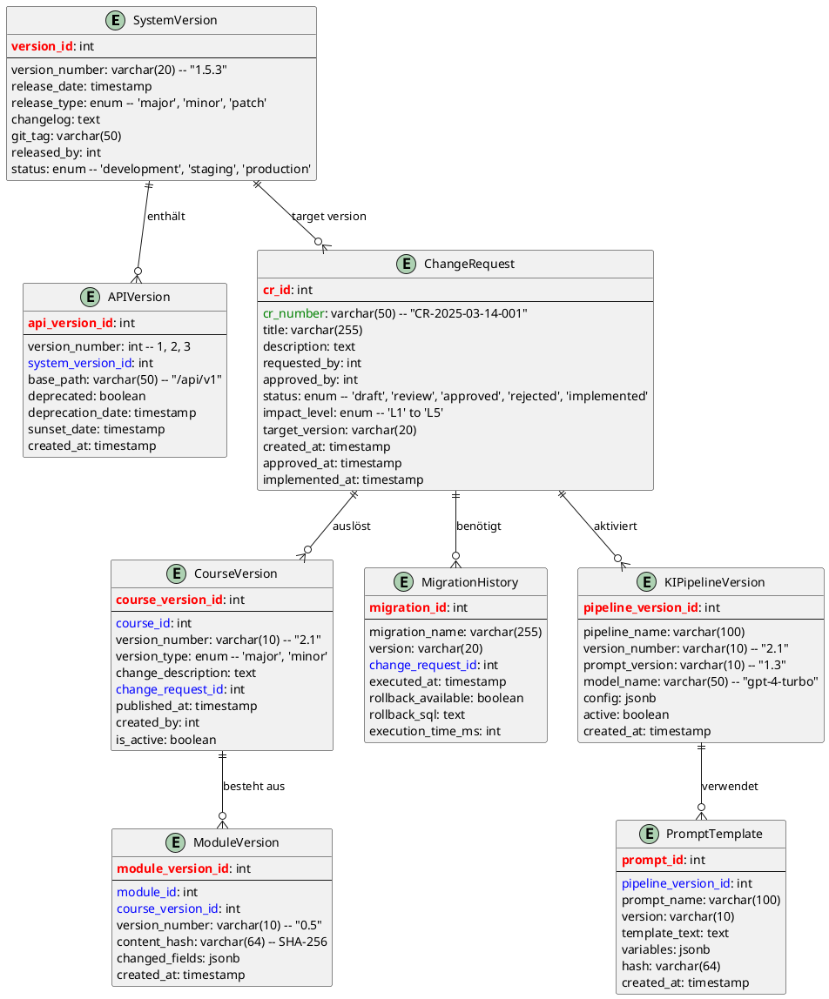

---

## 4. System-Version (LSX)

LSX verwendet **Semantic Versioning (SEMVER)**:

### 4.1 SEMVER-Format

```
MAJOR.MINOR.PATCH
Beispiel: 1.5.3
```

| Komponente | Wann erhöhen? | Beispiele |
|------------|---------------|-----------|
| **MAJOR** | Breaking Changes • API-Inkompatibilität • DB-Schema-Änderung | 1.x.x → 2.0.0 |
| **MINOR** | Neue Features (backward-compatible) • Neue Lernmethoden | 1.5.x → 1.6.0 |
| **PATCH** | Bugfixes • Security-Patches • Performance | 1.5.3 → 1.5.4 |

### 4.2 Release-Workflow

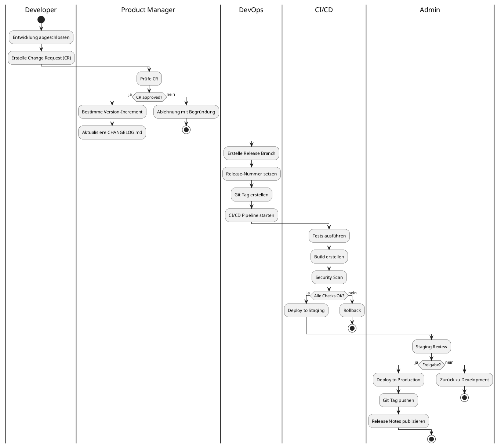

### 4.3 CHANGELOG.md Struktur

```markdown
# Changelog

Alle wichtigen Änderungen an LSX werden in dieser Datei dokumentiert.

Format basiert auf [Keep a Changelog](https://keepachangelog.com/de/1.0.0/).

## [2.0.0] - 2025-03-15

### Added
- Neue Premium-Lernmethode: Deep Scenario Simulation
- API v2 mit GraphQL-Support
- Multi-Tenant-Organisation-System
- KI-basierte Kurs-Kategorisierung

### Changed
- Breaking: API v1 /courses Endpoint-Struktur geändert
- DB Schema: courses Tabelle neue Felder `category_id`, `version`
- KI-Pipeline auf GPT-4-Turbo umgestellt

### Deprecated
- API v1 wird am 2026-03-15 deaktiviert

### Removed
- Alte Statistik-Endpoints entfernt

### Fixed
- Kritischer Security-Fix: SQL-Injection in Kurs-Suche
- Performance: Kurs-Laden um 60% schneller

### Security
- TLS 1.3 verpflichtend
- Argon2id für Passwort-Hashing

## [1.5.3] - 2025-02-10

### Fixed
- Bugfix: Quiz-Auswertung bei Multiple-Choice
- Bugfix: PDF-Upload > 50 MB
```

### 4.4 Python: Version Management

```python
# lsx/version.py
from typing import Tuple, Optional
from dataclasses import dataclass
import re

@dataclass
class Version:
    major: int
    minor: int
    patch: int

    def __str__(self) -> str:
        return f"{self.major}.{self.minor}.{self.patch}"

    def __eq__(self, other: 'Version') -> bool:
        return (self.major, self.minor, self.patch) == (other.major, other.minor, other.patch)

    def __lt__(self, other: 'Version') -> bool:
        return (self.major, self.minor, self.patch) < (other.major, other.minor, other.patch)

    def __gt__(self, other: 'Version') -> bool:
        return (self.major, self.minor, self.patch) > (other.major, other.minor, other.patch)

    @classmethod
    def from_string(cls, version_str: str) -> 'Version':
        """Parse version string like '1.5.3'"""
        pattern = r'^(\d+)\.(\d+)\.(\d+)$'
        match = re.match(pattern, version_str)
        if not match:
            raise ValueError(f"Invalid version format: {version_str}")
        return cls(int(match.group(1)), int(match.group(2)), int(match.group(3)))

    def increment(self, level: str) -> 'Version':
        """Increment version at specified level"""
        if level == 'major':
            return Version(self.major + 1, 0, 0)
        elif level == 'minor':
            return Version(self.major, self.minor + 1, 0)
        elif level == 'patch':
            return Version(self.major, self.minor, self.patch + 1)
        else:
            raise ValueError(f"Invalid level: {level}")


class VersionManager:
    """Manages LSX system version"""

    VERSION_FILE = "VERSION"

    @staticmethod
    def get_current_version() -> Version:
        """Read current version from file"""
        try:
            with open(VersionManager.VERSION_FILE, 'r') as f:
                version_str = f.read().strip()
            return Version.from_string(version_str)
        except FileNotFoundError:
            return Version(1, 0, 0)

    @staticmethod
    def set_version(version: Version) -> None:
        """Write version to file"""
        with open(VersionManager.VERSION_FILE, 'w') as f:
            f.write(str(version))

    @staticmethod
    def bump_version(level: str, changelog_entry: str) -> Version:
        """Bump version and update changelog"""
        current = VersionManager.get_current_version()
        new_version = current.increment(level)

        # Update VERSION file
        VersionManager.set_version(new_version)

        # Update CHANGELOG.md
        VersionManager._update_changelog(new_version, changelog_entry)

        return new_version

    @staticmethod
    def _update_changelog(version: Version, entry: str) -> None:
        """Prepend entry to CHANGELOG.md"""
        from datetime import datetime

        changelog_path = "CHANGELOG.md"

        # Read existing changelog
        try:
            with open(changelog_path, 'r') as f:
                existing_content = f.read()
        except FileNotFoundError:
            existing_content = "# Changelog\n\n"

        # Create new entry
        today = datetime.now().strftime("%Y-%m-%d")
        new_entry = f"\n## [{version}] - {today}\n\n{entry}\n\n"

        # Insert after header
        lines = existing_content.split('\n')
        header = '\n'.join(lines[:2])  # "# Changelog" + empty line
        rest = '\n'.join(lines[2:])

        updated_content = header + new_entry + rest

        # Write back
        with open(changelog_path, 'w') as f:
            f.write(updated_content)


# Example usage
if __name__ == "__main__":
    # Get current version
    current = VersionManager.get_current_version()
    print(f"Current version: {current}")

    # Bump minor version
    new_version = VersionManager.bump_version(
        level='minor',
        changelog_entry="""### Added
- Neue KI-basierte Kurs-Kategorisierung
- GraphQL API Endpoint

### Fixed
- Performance-Optimierung bei Kurs-Laden"""
    )
    print(f"New version: {new_version}")
```

---

## 5. API-Versionierung

LSX verwendet **URL-basierte API-Versionierung** mit strikter Backward-Compatibility.

### 5.1 Versioning-Strategie

| Aspekt | Regel |
|--------|-------|
| **Basis-URL** | `/api/v{N}/` (z.B. `/api/v1/`, `/api/v2/`) |
| **Backward Compatibility** | v1 bleibt mindestens 12 Monate stabil |
| **Breaking Changes** | Nur in neuer Major-Version (v2, v3) |
| **Deprecation Warning** | 6 Monate vor Deaktivierung |
| **Sunset Date** | Exaktes Datum der Deaktivierung kommunizieren |

### 5.2 API-Version-Header

Jede API-Response enthält:

```http
X-LSX-API-Version: 1
X-LSX-API-Deprecated: false
X-LSX-API-Sunset-Date:
X-LSX-System-Version: 1.5.3
```

Beispiel bei deprecated API:

```http
X-LSX-API-Version: 1
X-LSX-API-Deprecated: true
X-LSX-API-Deprecation-Date: 2025-03-15
X-LSX-API-Sunset-Date: 2026-03-15
X-LSX-Migration-Guide: https://docs.lsx.de/api/v1-to-v2
```

### 5.3 API-Versioning Implementation

```python
# lsx/api/versioning.py
from flask import Blueprint, request, g
from functools import wraps
from datetime import datetime

class APIVersion:
    """API Version Management"""

    VERSIONS = {
        1: {
            'base_path': '/api/v1',
            'deprecated': False,
            'deprecation_date': None,
            'sunset_date': None,
            'active': True
        },
        2: {
            'base_path': '/api/v2',
            'deprecated': False,
            'deprecation_date': None,
            'sunset_date': None,
            'active': True
        }
    }

    @staticmethod
    def get_version_from_path(path: str) -> int:
        """Extract API version from request path"""
        import re
        match = re.search(r'/api/v(\d+)/', path)
        if match:
            return int(match.group(1))
        return 1  # Default to v1

    @staticmethod
    def add_version_headers(response, version: int):
        """Add API version headers to response"""
        version_info = APIVersion.VERSIONS.get(version, {})

        response.headers['X-LSX-API-Version'] = str(version)
        response.headers['X-LSX-API-Deprecated'] = str(version_info.get('deprecated', False)).lower()

        if version_info.get('deprecation_date'):
            response.headers['X-LSX-API-Deprecation-Date'] = version_info['deprecation_date']

        if version_info.get('sunset_date'):
            response.headers['X-LSX-API-Sunset-Date'] = version_info['sunset_date']
            response.headers['X-LSX-Migration-Guide'] = f"https://docs.lsx.de/api/v{version}-migration"

        # Add system version
        from lsx.version import VersionManager
        system_version = VersionManager.get_current_version()
        response.headers['X-LSX-System-Version'] = str(system_version)

        return response


def versioned_route(version: int):
    """Decorator for versioned API routes"""
    def decorator(f):
        @wraps(f)
        def decorated_function(*args, **kwargs):
            # Check if version is active
            version_info = APIVersion.VERSIONS.get(version)
            if not version_info or not version_info.get('active'):
                return {
                    'error': 'API version not available',
                    'version': version,
                    'message': f'API v{version} has been sunset'
                }, 410

            # Store version in request context
            g.api_version = version

            # Call original function
            response = f(*args, **kwargs)

            return response
        return decorated_function
    return decorator


# Example: API v1 vs v2
from flask import Flask, jsonify

app = Flask(__name__)

# API v1: Old course structure
@app.route('/api/v1/courses/<int:course_id>')
@versioned_route(version=1)
def get_course_v1(course_id):
    # Old format
    return jsonify({
        'id': course_id,
        'name': 'CompTIA Network+',
        'price': 299.99,
        'modules': [1, 2, 3, 4, 5]
    })


# API v2: New course structure with categories
@app.route('/api/v2/courses/<int:course_id>')
@versioned_route(version=2)
def get_course_v2(course_id):
    # New format with category hierarchy
    return jsonify({
        'id': course_id,
        'name': 'CompTIA Network+',
        'version': '2.1',
        'pricing': {
            'base_price': 299.99,
            'currency': 'EUR',
            'vat_included': True
        },
        'category': {
            'domain': 'IT & Technology',
            'subdomain': 'Networking',
            'certification': 'CompTIA Network+'
        },
        'modules': [
            {'id': 1, 'name': 'Network Fundamentals', 'order': 1},
            {'id': 2, 'name': 'OSI Model', 'order': 2}
        ],
        'metadata': {
            'created_at': '2024-01-15T10:00:00Z',
            'updated_at': '2025-02-20T15:30:00Z'
        }
    })


@app.after_request
def add_api_version_headers(response):
    """Add version headers to all API responses"""
    if request.path.startswith('/api/'):
        version = APIVersion.get_version_from_path(request.path)
        response = APIVersion.add_version_headers(response, version)
    return response
```

### 5.4 API Deprecation Workflow

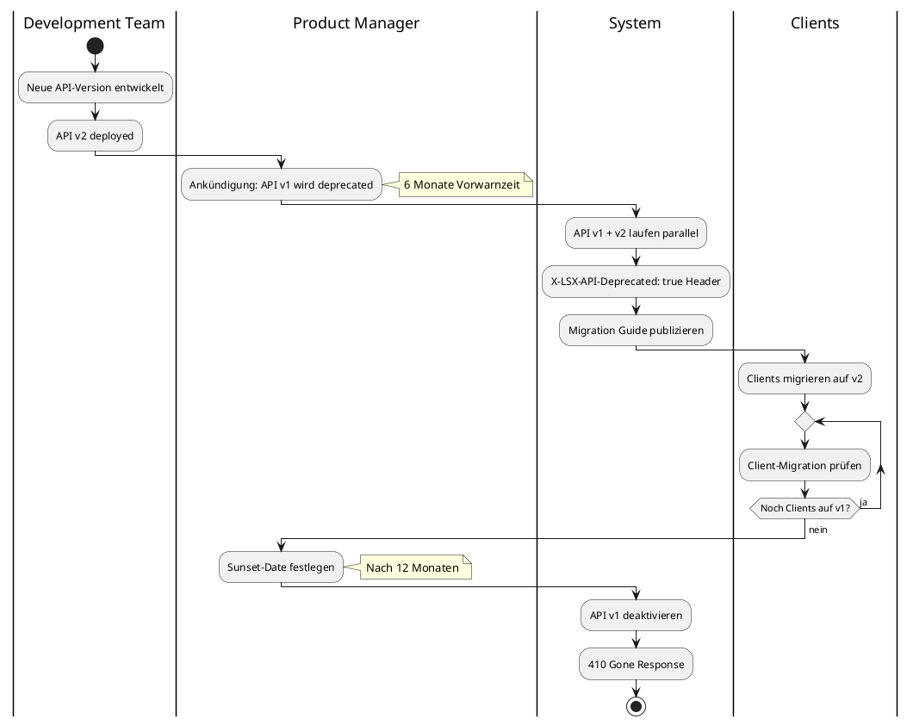

---

## 6. Kurs-Versionierung

Jeder Kurs hat eine **eigene Versionsnummer** unabhängig vom System.

### 6.1 Kurs-Version-Format

```
MAJOR.MINOR
Beispiel: 2.1
```

| Komponente | Wann erhöhen? | Beispiele |
|------------|---------------|-----------|
| **MAJOR** | Strukturänderung • Neue Module • KI-Regeneration • Breaking Changes | 1.x → 2.0 |
| **MINOR** | Inhaltserweiterung • Neue Quizfragen • Fehlerkorrekturen • Verbesserungen | 2.1 → 2.2 |

### 6.2 Warum Kurs-Versionen wichtig sind

| Stakeholder | Grund |
|-------------|-------|
| **Schulen** | Reproduzierbare Lernumgebung für Prüfungen |
| **Unternehmen** | Compliance-Nachweis (ISO 27001, DSGVO) |
| **Creator** | Änderungsdokumentation, Urheberrechtsschutz |
| **Lernende** | Wissen welche Version gelernt wurde |
| **System** | Verhindert versehentliches Überschreiben |

### 6.3 Kurs-Version-Workflow

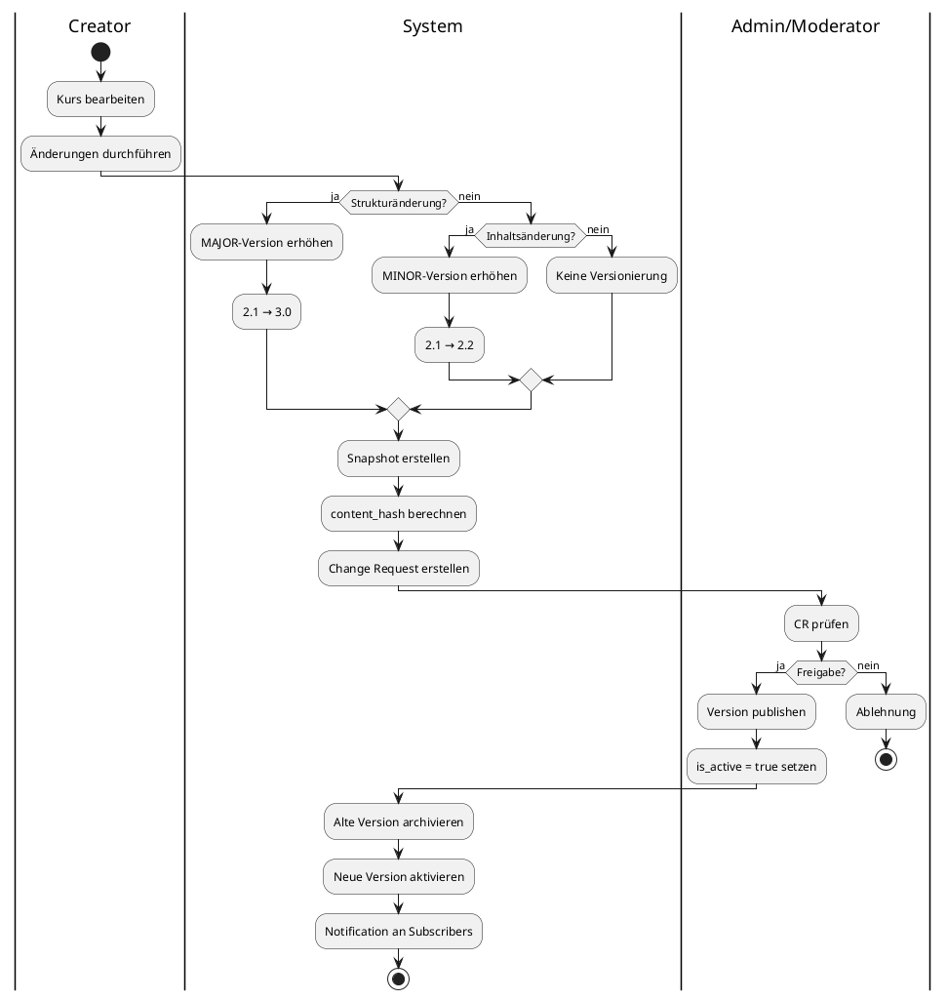

### 6.4 Course Version Management (Python)

```python
# lsx/courses/versioning.py
import psycopg3
from pydantic import BaseModel
from datetime import datetime
import hashlib
import json

class CourseVersion(db.Model):
    __tablename__ = 'course_versions'

    course_version_id = Column(Integer, primary_key=True)
    course_id = Column(Integer, ForeignKey('courses.course_id'), nullable=False)
    version_number = Column(String(10), nullable=False)  # "2.1"
    version_type = Column(String(10), nullable=False)  # 'major' or 'minor'
    change_description = Column(Text)
    change_request_id = Column(Integer, ForeignKey('change_requests.cr_id'))
    published_at = Column(DateTime)
    created_by = Column(Integer, ForeignKey('users.user_id'))
    is_active = Column(Boolean, default=False)
    content_snapshot = Column(Text)  # JSON snapshot
    content_hash = Column(String(64))  # SHA-256

    # Relationships
    course = relationship("Course", back_populates="versions")
    change_request = relationship("ChangeRequest")
    module_versions = relationship("ModuleVersion", back_populates="course_version")


class CourseVersionManager:
    """Manages course versioning"""

    @staticmethod
    def create_version(course_id: int, version_type: str, change_description: str,
                      user_id: int) -> CourseVersion:
        """Create new course version"""

        # Get current active version
        current_version = db.session.query(CourseVersion)\
            .filter_by(course_id=course_id, is_active=True)\
            .first()

        if current_version:
            # Parse current version
            major, minor = map(int, current_version.version_number.split('.'))

            # Increment based on type
            if version_type == 'major':
                new_version_number = f"{major + 1}.0"
            else:
                new_version_number = f"{major}.{minor + 1}"
        else:
            # First version
            new_version_number = "1.0"

        # Create content snapshot
        course = Course.query.get(course_id)
        snapshot = CourseVersionManager._create_snapshot(course)
        content_hash = CourseVersionManager._calculate_hash(snapshot)

        # Create version record
        new_version = CourseVersion(
            course_id=course_id,
            version_number=new_version_number,
            version_type=version_type,
            change_description=change_description,
            created_by=user_id,
            content_snapshot=json.dumps(snapshot),
            content_hash=content_hash,
            is_active=False  # Needs approval
        )

        db.session.add(new_version)
        db.session.commit()

        return new_version

    @staticmethod
    def _create_snapshot(course) -> dict:
        """Create full course content snapshot"""
        return {
            'course_id': course.course_id,
            'name': course.name,
            'description': course.description,
            'category_id': course.category_id,
            'price': float(course.price) if course.price else None,
            'modules': [
                {
                    'module_id': m.module_id,
                    'name': m.name,
                    'order': m.order_index,
                    'content': m.content,
                    'learning_methods': [lm.method_id for lm in m.learning_methods]
                }
                for m in course.modules
            ],
            'metadata': {
                'created_at': course.created_at.isoformat(),
                'updated_at': course.updated_at.isoformat()
            }
        }

    @staticmethod
    def _calculate_hash(snapshot: dict) -> str:
        """Calculate SHA-256 hash of snapshot"""
        content = json.dumps(snapshot, sort_keys=True)
        return hashlib.sha256(content.encode()).hexdigest()

    @staticmethod
    def publish_version(course_version_id: int, approved_by: int) -> bool:
        """Publish (activate) a course version"""
        version = CourseVersion.query.get(course_version_id)
        if not version:
            return False

        # Deactivate all other versions
        db.session.query(CourseVersion)\
            .filter_by(course_id=version.course_id, is_active=True)\
            .update({'is_active': False})

        # Activate new version
        version.is_active = True
        version.published_at = datetime.utcnow()

        db.session.commit()

        # Notify subscribers
        CourseVersionManager._notify_subscribers(version)

        return True

    @staticmethod
    def _notify_subscribers(version: CourseVersion):
        """Notify users about new course version"""
        from lsx.notifications import NotificationService

        course = version.course
        subscribers = db.session.query(CourseSubscription)\
            .filter_by(course_id=course.course_id)\
            .all()

        for sub in subscribers:
            NotificationService.send(
                user_id=sub.user_id,
                type='course_update',
                title=f'Kurs "{course.name}" wurde aktualisiert',
                message=f'Version {version.version_number}: {version.change_description}',
                link=f'/courses/{course.course_id}'
            )

    @staticmethod
    def rollback_to_version(course_id: int, version_number: str, user_id: int) -> bool:
        """Rollback course to previous version"""

        # Find target version
        target_version = db.session.query(CourseVersion)\
            .filter_by(course_id=course_id, version_number=version_number)\
            .first()

        if not target_version:
            return False

        # Create new version based on snapshot
        snapshot = json.loads(target_version.content_snapshot)

        # Restore course data
        course = Course.query.get(course_id)
        course.name = snapshot['name']
        course.description = snapshot['description']
        course.price = snapshot['price']

        # Restore modules (simplified - in reality more complex)
        # This would involve module version rollback too

        # Create new version entry for rollback
        rollback_version = CourseVersion(
            course_id=course_id,
            version_number=f"{target_version.version_number}-rollback",
            version_type='major',
            change_description=f'Rollback to version {version_number}',
            created_by=user_id,
            content_snapshot=target_version.content_snapshot,
            content_hash=target_version.content_hash,
            is_active=True,
            published_at=datetime.utcnow()
        )

        db.session.add(rollback_version)
        db.session.commit()

        return True


# API Endpoint
@app.route('/api/v2/courses/<int:course_id>/versions', methods=['GET'])
def get_course_versions(course_id):
    """Get all versions of a course"""
    versions = db.session.query(CourseVersion)\
        .filter_by(course_id=course_id)\
        .order_by(CourseVersion.published_at.desc())\
        .all()

    return jsonify([
        {
            'version_id': v.course_version_id,
            'version_number': v.version_number,
            'version_type': v.version_type,
            'change_description': v.change_description,
            'published_at': v.published_at.isoformat() if v.published_at else None,
            'is_active': v.is_active
        }
        for v in versions
    ])


@app.route('/api/v2/courses/<int:course_id>/versions', methods=['POST'])
def create_course_version(course_id):
    """Create new course version"""
    data = request.json

    version = CourseVersionManager.create_version(
        course_id=course_id,
        version_type=data['version_type'],
        change_description=data['change_description'],
        user_id=g.user_id
    )

    return jsonify({
        'version_id': version.course_version_id,
        'version_number': version.version_number,
        'status': 'created'
    }), 201
```

---

## 7. Modul-Versionierung

Module haben eine **einfachere Versionierung** als Kurse.

### 7.1 Modul-Version-Format

```
0.PATCH
Beispiel: 0.5
```

Begründung:
• Module sind Teil eines Kurses
• Häufige Änderungen (Beta-Status)
• Kurs-MAJOR-Version wird erhöht bei massiven Modul-Änderungen

### 7.2 Module Version Tracking

```python
# lsx/modules/versioning.py

class ModuleVersion(db.Model):
    __tablename__ = 'module_versions'

    module_version_id = Column(Integer, primary_key=True)
    module_id = Column(Integer, ForeignKey('modules.module_id'), nullable=False)
    course_version_id = Column(Integer, ForeignKey('course_versions.course_version_id'))
    version_number = Column(String(10), nullable=False)  # "0.5"
    content_hash = Column(String(64))  # SHA-256 of content
    changed_fields = Column(JSON)  # Which fields changed
    created_at = Column(DateTime, default=datetime.utcnow)

    # Relationships
    module = relationship("Module")
    course_version = relationship("CourseVersion", back_populates="module_versions")


class ModuleVersionManager:
    """Track module changes"""

    @staticmethod
    def track_change(module_id: int, changed_fields: list, course_version_id: int = None):
        """Create module version entry when module changes"""

        module = Module.query.get(module_id)

        # Calculate content hash
        content = f"{module.name}{module.content}{module.order_index}"
        content_hash = hashlib.sha256(content.encode()).hexdigest()

        # Get last version
        last_version = db.session.query(ModuleVersion)\
            .filter_by(module_id=module_id)\
            .order_by(ModuleVersion.created_at.desc())\
            .first()

        if last_version:
            # Increment patch
            patch = int(last_version.version_number.split('.')[1])
            new_version = f"0.{patch + 1}"
        else:
            new_version = "0.1"

        # Create version record
        version = ModuleVersion(
            module_id=module_id,
            course_version_id=course_version_id,
            version_number=new_version,
            content_hash=content_hash,
            changed_fields=changed_fields
        )

        db.session.add(version)
        db.session.commit()

        return version
```

---

## 8. KI-Prompt & Pipeline-Versionierung

Die **KI-Pipeline ist das Herzstück** von LSX. Versionierung verhindert Duplikate und Inkonsistenzen.

### 8.1 KI-Versionierungs-Strategie

| Komponente | Format | Beispiel | Wann erhöhen? |
|------------|--------|----------|---------------|
| **Prompt Template** | MAJOR.MINOR | 1.3 | MAJOR: Struktur • MINOR: Parameter |
| **Pipeline** | MAJOR.MINOR | 2.1 | MAJOR: Workflow • MINOR: Optimierung |
| **Model** | Name + Date | gpt-4-turbo-2024-04-09 | Bei Modellwechsel |

### 8.2 Prompt Template Versioning

```python
# lsx/ki/prompt_versioning.py

class PromptTemplate(db.Model):
    __tablename__ = 'prompt_templates'

    prompt_id = Column(Integer, primary_key=True)
    pipeline_version_id = Column(Integer, ForeignKey('ki_pipeline_versions.pipeline_version_id'))
    prompt_name = Column(String(100), nullable=False)  # 'module_generator', 'quiz_generator'
    version = Column(String(10), nullable=False)  # "1.3"
    template_text = Column(Text, nullable=False)
    variables = Column(JSON)  # Required variables
    hash = Column(String(64))  # SHA-256
    created_at = Column(DateTime, default=datetime.utcnow)

    pipeline_version = relationship("KIPipelineVersion", back_populates="prompt_templates")


class KIPipelineVersion(db.Model):
    __tablename__ = 'ki_pipeline_versions'

    pipeline_version_id = Column(Integer, primary_key=True)
    pipeline_name = Column(String(100), nullable=False)
    version_number = Column(String(10), nullable=False)  # "2.1"
    prompt_version = Column(String(10), nullable=False)  # "1.3"
    model_name = Column(String(50), nullable=False)  # "gpt-4-turbo"
    config = Column(JSON)  # Pipeline configuration
    active = Column(Boolean, default=False)
    created_at = Column(DateTime, default=datetime.utcnow)

    # Relationships
    prompt_templates = relationship("PromptTemplate", back_populates="pipeline_version")


class KIVersionManager:
    """Manage KI Pipeline and Prompt versions"""

    @staticmethod
    def create_prompt_template(pipeline_version_id: int, prompt_name: str,
                              template_text: str, variables: dict) -> PromptTemplate:
        """Create new prompt template"""

        # Calculate hash
        prompt_hash = hashlib.sha256(template_text.encode()).hexdigest()

        # Get last version
        last_prompt = db.session.query(PromptTemplate)\
            .filter_by(prompt_name=prompt_name)\
            .order_by(PromptTemplate.created_at.desc())\
            .first()

        if last_prompt:
            major, minor = map(int, last_prompt.version.split('.'))

            # Check if structure changed (hash different)
            if prompt_hash != last_prompt.hash:
                new_version = f"{major + 1}.0"  # MAJOR increment
            else:
                new_version = f"{major}.{minor + 1}"  # MINOR increment
        else:
            new_version = "1.0"

        # Create template
        template = PromptTemplate(
            pipeline_version_id=pipeline_version_id,
            prompt_name=prompt_name,
            version=new_version,
            template_text=template_text,
            variables=variables,
            hash=prompt_hash
        )

        db.session.add(template)
        db.session.commit()

        return template

    @staticmethod
    def get_active_prompt(prompt_name: str) -> PromptTemplate:
        """Get currently active prompt template"""

        active_pipeline = db.session.query(KIPipelineVersion)\
            .filter_by(active=True)\
            .first()

        if not active_pipeline:
            raise ValueError("No active pipeline version")

        prompt = db.session.query(PromptTemplate)\
            .filter_by(
                pipeline_version_id=active_pipeline.pipeline_version_id,
                prompt_name=prompt_name
            )\
            .first()

        if not prompt:
            raise ValueError(f"Prompt '{prompt_name}' not found in active pipeline")

        return prompt

    @staticmethod
    def render_prompt(prompt_name: str, **variables) -> str:
        """Render prompt template with variables"""

        template = KIVersionManager.get_active_prompt(prompt_name)

        # Validate variables
        required_vars = template.variables.get('required', [])
        missing_vars = [v for v in required_vars if v not in variables]

        if missing_vars:
            raise ValueError(f"Missing required variables: {missing_vars}")

        # Simple template rendering (in production use Jinja2)
        rendered = template.template_text
        for key, value in variables.items():
            rendered = rendered.replace(f"{{{key}}}", str(value))

        return rendered


# Example: Prompt Templates

MODULE_GENERATOR_PROMPT_V1_3 = """Du bist ein Experte für die Erstellung von Lernmodulen.

Version: 1.3
Pipeline: module_generation
Model: gpt-4-turbo

Aufgabe:
Erstelle ein strukturiertes Lernmodul zum Thema "{topic}" für die Zielgruppe "{target_audience}".

Anforderungen:
- Lernziele klar definieren
- Inhalt in {num_sections} Abschnitte gliedern
- Praktische Beispiele integrieren
- Schwierigkeitsgrad: {difficulty_level}

Sprache: {language}

Ausgabeformat: JSON

{{
  "module_name": "...",
  "learning_objectives": [...],
  "sections": [
    {{
      "title": "...",
      "content": "...",
      "examples": [...]
    }}
  ],
  "quiz_questions": [...]
}}
"""

# Create prompt template
KIVersionManager.create_prompt_template(
    pipeline_version_id=1,
    prompt_name='module_generator',
    template_text=MODULE_GENERATOR_PROMPT_V1_3,
    variables={
        'required': ['topic', 'target_audience', 'num_sections', 'difficulty_level', 'language'],
        'optional': []
    }
)

# Usage
prompt_text = KIVersionManager.render_prompt(
    'module_generator',
    topic='CompTIA Network+ - OSI Model',
    target_audience='IT-Studenten',
    num_sections=5,
    difficulty_level='intermediate',
    language='Deutsch'
)
```

### 8.3 KI-Pipeline Version Workflow

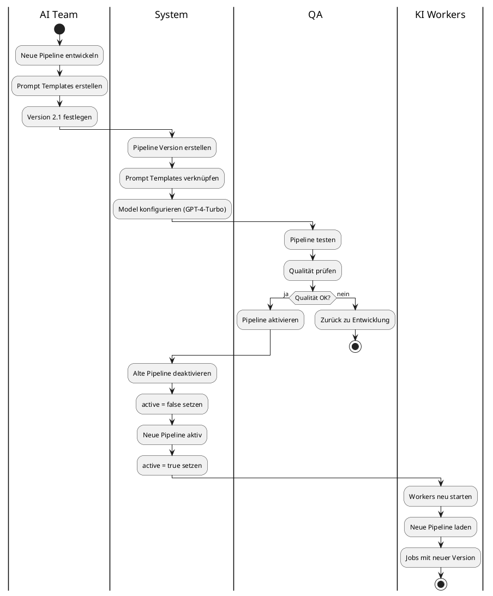

---

## 9. Change Request (CR) System

**Alle Änderungen** laufen über das CR-System.

### 9.1 CR-Nummernschema

```
CR-YYYY-MM-DD-NNN
Beispiel: CR-2025-03-14-001
```

### 9.2 CR-Status-Workflow

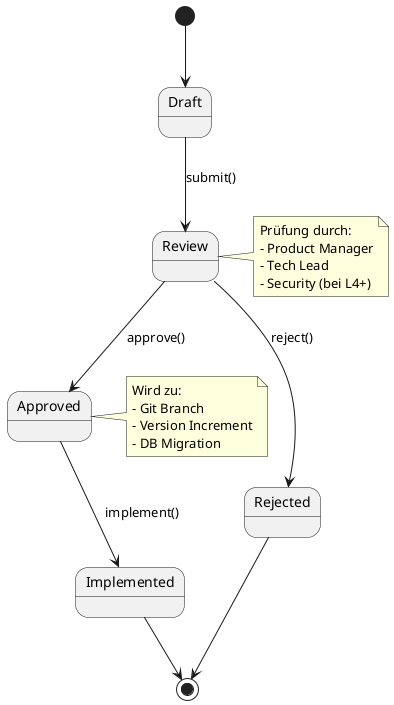

### 9.3 Change Request Implementation

```python
# lsx/changes/change_request.py

class ChangeRequest(db.Model):
    __tablename__ = 'change_requests'

    cr_id = Column(Integer, primary_key=True)
    cr_number = Column(String(50), unique=True, nullable=False)  # CR-2025-03-14-001
    title = Column(String(255), nullable=False)
    description = Column(Text, nullable=False)
    requested_by = Column(Integer, ForeignKey('users.user_id'), nullable=False)
    approved_by = Column(Integer, ForeignKey('users.user_id'))
    status = Column(String(20), nullable=False)  # draft, review, approved, rejected, implemented
    impact_level = Column(String(5), nullable=False)  # L1 to L5
    target_version = Column(String(20))  # "1.6.0"
    created_at = Column(DateTime, default=datetime.utcnow)
    approved_at = Column(DateTime)
    implemented_at = Column(DateTime)

    # Relationships
    requester = relationship("User", foreign_keys=[requested_by])
    approver = relationship("User", foreign_keys=[approved_by])
    migrations = relationship("MigrationHistory", back_populates="change_request")


class ChangeRequestManager:
    """Manage change requests"""

    @staticmethod
    def create_cr(title: str, description: str, impact_level: str,
                 target_version: str, user_id: int) -> ChangeRequest:
        """Create new change request"""

        # Generate CR number
        today = datetime.now().strftime("%Y-%m-%d")

        # Count today's CRs
        count = db.session.query(ChangeRequest)\
            .filter(ChangeRequest.cr_number.like(f"CR-{today}-%"))\
            .count()

        cr_number = f"CR-{today}-{count + 1:03d}"

        # Create CR
        cr = ChangeRequest(
            cr_number=cr_number,
            title=title,
            description=description,
            requested_by=user_id,
            status='draft',
            impact_level=impact_level,
            target_version=target_version
        )

        db.session.add(cr)
        db.session.commit()

        return cr

    @staticmethod
    def submit_for_review(cr_id: int) -> bool:
        """Submit CR for review"""
        cr = ChangeRequest.query.get(cr_id)
        if not cr or cr.status != 'draft':
            return False

        cr.status = 'review'
        db.session.commit()

        # Notify approvers
        ChangeRequestManager._notify_approvers(cr)

        return True

    @staticmethod
    def approve_cr(cr_id: int, approved_by: int) -> bool:
        """Approve change request"""
        cr = ChangeRequest.query.get(cr_id)
        if not cr or cr.status != 'review':
            return False

        # Check if user has permission (based on impact level)
        if not ChangeRequestManager._can_approve(approved_by, cr.impact_level):
            return False

        cr.status = 'approved'
        cr.approved_by = approved_by
        cr.approved_at = datetime.utcnow()

        db.session.commit()

        # Notify requester
        from lsx.notifications import NotificationService
        NotificationService.send(
            user_id=cr.requested_by,
            type='cr_approved',
            title=f'Change Request {cr.cr_number} approved',
            message=f'Your CR "{cr.title}" has been approved',
            link=f'/admin/change-requests/{cr.cr_id}'
        )

        return True

    @staticmethod
    def _can_approve(user_id: int, impact_level: str) -> bool:
        """Check if user can approve given impact level"""
        user = User.query.get(user_id)

        # L1-L2: Team Lead
        # L3: Product Manager
        # L4-L5: Admin + Security Review

        permission_map = {
            'L1': ['team_lead', 'product_manager', 'admin'],
            'L2': ['team_lead', 'product_manager', 'admin'],
            'L3': ['product_manager', 'admin'],
            'L4': ['admin'],
            'L5': ['admin']
        }

        allowed_roles = permission_map.get(impact_level, [])
        return user.role in allowed_roles

    @staticmethod
    def _notify_approvers(cr: ChangeRequest):
        """Notify appropriate approvers based on impact level"""
        from lsx.notifications import NotificationService

        # Get approvers based on impact level
        if cr.impact_level in ['L4', 'L5']:
            approvers = User.query.filter_by(role='admin').all()
        elif cr.impact_level == 'L3':
            approvers = User.query.filter(User.role.in_(['product_manager', 'admin'])).all()
        else:
            approvers = User.query.filter(User.role.in_(['team_lead', 'product_manager', 'admin'])).all()

        for approver in approvers:
            NotificationService.send(
                user_id=approver.user_id,
                type='cr_review',
                title=f'New Change Request: {cr.cr_number}',
                message=f'{cr.title} (Impact: {cr.impact_level})',
                link=f'/admin/change-requests/{cr.cr_id}'
            )


# API Endpoints
@app.route('/api/v2/change-requests', methods=['POST'])
def create_change_request():
    """Create new change request"""
    data = request.json

    cr = ChangeRequestManager.create_cr(
        title=data['title'],
        description=data['description'],
        impact_level=data['impact_level'],
        target_version=data['target_version'],
        user_id=g.user_id
    )

    return jsonify({
        'cr_id': cr.cr_id,
        'cr_number': cr.cr_number,
        'status': cr.status
    }), 201


@app.route('/api/v2/change-requests/<int:cr_id>/approve', methods=['POST'])
def approve_change_request(cr_id):
    """Approve change request"""
    success = ChangeRequestManager.approve_cr(cr_id, g.user_id)

    if success:
        return jsonify({'status': 'approved'}), 200
    else:
        return jsonify({'error': 'Cannot approve'}), 400
```

---

## 10. Change Impact Levels

| Level | Beschreibung | Beispiel | Genehmiger | Rollback |
|-------|--------------|----------|------------|----------|
| **L1** | Dokumentation, Texte | Rechtschreibkorrektur | Team Lead | Trivial |
| **L2** | Kleine Features | Neue Quizfragen | Team Lead | Einfach |
| **L3** | Signifikante Änderungen | Neues Modul | Product Manager | Moderat |
| **L4** | Breaking Changes | API-Änderung | Admin | Komplex |
| **L5** | Kritische System-Änderungen | Neue KI-Pipeline, DB-Migration | Admin + Security | Kritisch |

### 10.1 Impact Level Assessment Workflow

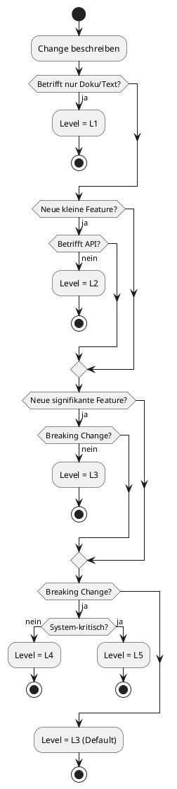

---

## 11. Database Migration Management

Datenbankänderungen benötigen besondere Sorgfalt.

### 11.1 Migration Workflow

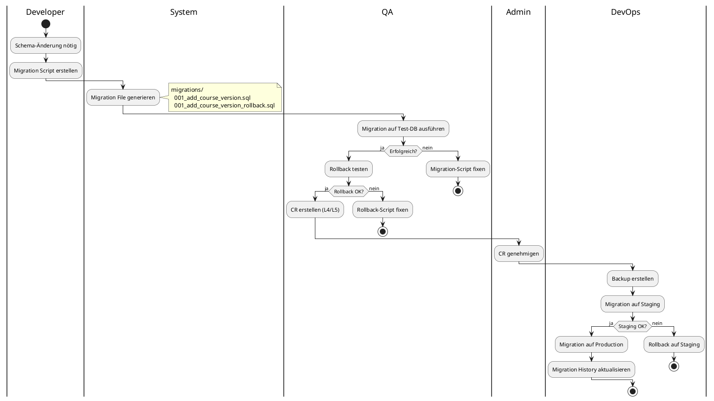

### 11.2 Migration Implementation

```python
# lsx/db/migrations.py

class MigrationHistory(db.Model):
    __tablename__ = 'migration_history'

    migration_id = Column(Integer, primary_key=True)
    migration_name = Column(String(255), unique=True, nullable=False)
    version = Column(String(20), nullable=False)
    change_request_id = Column(Integer, ForeignKey('change_requests.cr_id'))
    executed_at = Column(DateTime, default=datetime.utcnow)
    rollback_available = Column(Boolean, default=True)
    rollback_sql = Column(Text)
    execution_time_ms = Column(Integer)

    # Relationships
    change_request = relationship("ChangeRequest", back_populates="migrations")


class MigrationManager:
    """Manage database migrations"""

    MIGRATIONS_DIR = "migrations"

    @staticmethod
    def create_migration(name: str, up_sql: str, down_sql: str,
                        version: str, cr_id: int = None) -> str:
        """Create migration files"""

        timestamp = datetime.now().strftime("%Y%m%d%H%M%S")
        migration_name = f"{timestamp}_{name}"

        # Create migration files
        up_file = os.path.join(MigrationManager.MIGRATIONS_DIR, f"{migration_name}_up.sql")
        down_file = os.path.join(MigrationManager.MIGRATIONS_DIR, f"{migration_name}_down.sql")

        with open(up_file, 'w') as f:
            f.write(f"-- Migration: {name}\n")
            f.write(f"-- Version: {version}\n")
            f.write(f"-- CR: {cr_id}\n\n")
            f.write(up_sql)

        with open(down_file, 'w') as f:
            f.write(f"-- Rollback: {name}\n\n")
            f.write(down_sql)

        return migration_name

    @staticmethod
    def execute_migration(migration_name: str) -> bool:
        """Execute migration"""

        # Check if already executed
        existing = db.session.query(MigrationHistory)\
            .filter_by(migration_name=migration_name)\
            .first()

        if existing:
            print(f"Migration {migration_name} already executed")
            return False

        # Read migration file
        up_file = os.path.join(MigrationManager.MIGRATIONS_DIR, f"{migration_name}_up.sql")
        down_file = os.path.join(MigrationManager.MIGRATIONS_DIR, f"{migration_name}_down.sql")

        with open(up_file, 'r') as f:
            up_sql = f.read()

        with open(down_file, 'r') as f:
            down_sql = f.read()

        # Execute migration
        start_time = time.time()

        try:
            db.session.execute(text(up_sql))
            db.session.commit()

            execution_time = int((time.time() - start_time) * 1000)

            # Record in history
            history = MigrationHistory(
                migration_name=migration_name,
                version="1.6.0",  # Get from file or parameter
                executed_at=datetime.utcnow(),
                rollback_available=True,
                rollback_sql=down_sql,
                execution_time_ms=execution_time
            )

            db.session.add(history)
            db.session.commit()

            print(f"Migration {migration_name} executed successfully ({execution_time}ms)")
            return True

        except Exception as e:
            db.session.rollback()
            print(f"Migration {migration_name} failed: {str(e)}")
            return False

    @staticmethod
    def rollback_migration(migration_name: str) -> bool:
        """Rollback migration"""

        # Get migration history
        history = db.session.query(MigrationHistory)\
            .filter_by(migration_name=migration_name)\
            .first()

        if not history:
            print(f"Migration {migration_name} not found in history")
            return False

        if not history.rollback_available:
            print(f"Migration {migration_name} cannot be rolled back")
            return False

        # Execute rollback
        try:
            db.session.execute(text(history.rollback_sql))
            db.session.commit()

            # Remove from history
            db.session.delete(history)
            db.session.commit()

            print(f"Migration {migration_name} rolled back successfully")
            return True

        except Exception as e:
            db.session.rollback()
            print(f"Rollback of {migration_name} failed: {str(e)}")
            return False


# Example Migration
MIGRATION_ADD_COURSE_VERSION = """
-- Add course_version column to courses table

ALTER TABLE courses
ADD COLUMN version VARCHAR(10) DEFAULT '1.0';

ALTER TABLE courses
ADD COLUMN version_type VARCHAR(10) DEFAULT 'major';

-- Create index
CREATE INDEX idx_courses_version ON courses(version);
"""

MIGRATION_ADD_COURSE_VERSION_ROLLBACK = """
-- Remove course_version columns

DROP INDEX IF EXISTS idx_courses_version;

ALTER TABLE courses
DROP COLUMN IF EXISTS version;

ALTER TABLE courses
DROP COLUMN IF EXISTS version_type;
"""

# Create and execute
migration_name = MigrationManager.create_migration(
    name="add_course_version",
    up_sql=MIGRATION_ADD_COURSE_VERSION,
    down_sql=MIGRATION_ADD_COURSE_VERSION_ROLLBACK,
    version="1.6.0",
    cr_id=42
)

MigrationManager.execute_migration(migration_name)
```

---

## 12. Git Integration & Tagging

### 12.1 Git Workflow

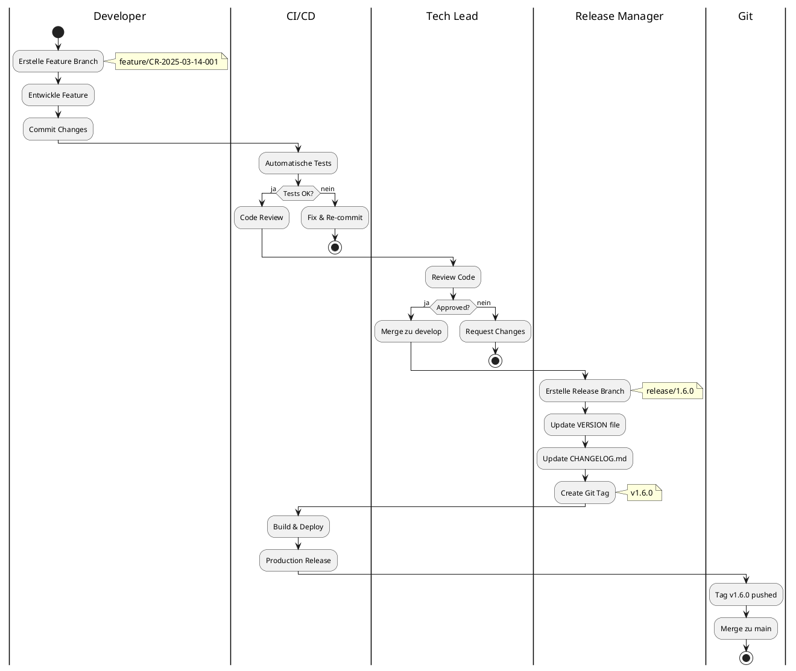

### 12.2 Git Tagging Strategy

| Tag-Format | Verwendung | Beispiel |
|------------|------------|----------|
| `v{MAJOR}.{MINOR}.{PATCH}` | Production Release | v1.6.0 |
| `v{VERSION}-rc{N}` | Release Candidate | v1.6.0-rc1 |
| `v{VERSION}-beta{N}` | Beta Release | v1.6.0-beta2 |
| `course-{ID}-v{VERSION}` | Kurs-Version | course-42-v2.1 |
| `pipeline-{NAME}-v{VERSION}` | Pipeline-Version | pipeline-module-gen-v2.1 |

### 12.3 Commit Message Convention

Folgende Commit-Typen werden verwendet:

```
<type>(<scope>): <subject>

<body>

<footer>
```

| Type | Beschreibung | Beispiel |
|------|--------------|----------|
| `feat` | Neues Feature | `feat(api): add course versioning endpoint` |
| `fix` | Bugfix | `fix(quiz): correct answer validation` |
| `docs` | Dokumentation | `docs(readme): update installation guide` |
| `style` | Code-Formatierung | `style(courses): fix indentation` |
| `refactor` | Code-Umstrukturierung | `refactor(db): optimize queries` |
| `perf` | Performance-Verbesserung | `perf(cache): implement Redis caching` |
| `test` | Tests | `test(api): add integration tests` |
| `chore` | Routine-Aufgaben | `chore(deps): update dependencies` |
| `ci` | CI/CD-Änderungen | `ci(github): add deploy workflow` |

Beispiel:

```
feat(courses): add course versioning system

Implement complete course versioning with:
- CourseVersion model
- Version tracking on course changes
- API endpoints for version management
- Rollback capability

Closes #123
CR: CR-2025-03-14-001
Breaking Change: Yes
```

---

## 13. Rollback-Strategien

### 13.1 Rollback-Ebenen

| Ebene | Methode | Komplexität | RTO |
|-------|---------|-------------|-----|
| **Code** | Git revert/reset | Niedrig | < 5 min |
| **Database** | Migration rollback | Mittel | < 15 min |
| **Kurs** | Version deactivate | Niedrig | < 1 min |
| **KI-Pipeline** | Pipeline switch | Niedrig | < 5 min |
| **System** | Full restore | Hoch | < 30 min |

### 13.2 Rollback Decision Tree

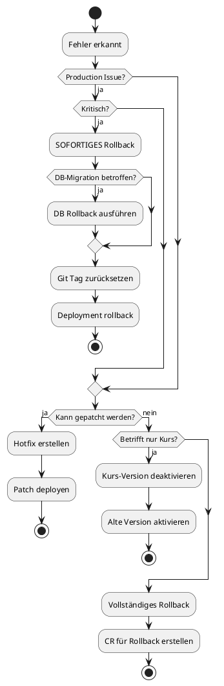

### 13.3 Rollback Implementation

```python
# lsx/rollback/manager.py

class RollbackManager:
    """Manage system rollbacks"""

    @staticmethod
    def rollback_system(target_version: str, reason: str, executed_by: int) -> dict:
        """Full system rollback to target version"""

        print(f"Starting rollback to version {target_version}")
        print(f"Reason: {reason}")

        results = {
            'code': False,
            'database': False,
            'config': False
        }

        # 1. Rollback code (Git)
        try:
            import subprocess
            subprocess.run(['git', 'checkout', f'v{target_version}'], check=True)
            subprocess.run(['git', 'reset', '--hard', f'v{target_version}'], check=True)
            results['code'] = True
            print("✓ Code rollback successful")
        except Exception as e:
            print(f"✗ Code rollback failed: {str(e)}")
            return results

        # 2. Rollback database migrations
        try:
            current_version = Version.from_string(VersionManager.get_current_version())
            target_ver = Version.from_string(target_version)

            # Get migrations to rollback
            migrations = db.session.query(MigrationHistory)\
                .filter(MigrationHistory.version > target_version)\
                .order_by(MigrationHistory.executed_at.desc())\
                .all()

            for migration in migrations:
                MigrationManager.rollback_migration(migration.migration_name)

            results['database'] = True
            print("✓ Database rollback successful")
        except Exception as e:
            print(f"✗ Database rollback failed: {str(e)}")
            return results

        # 3. Rollback configuration
        try:
            VersionManager.set_version(Version.from_string(target_version))
            results['config'] = True
            print("✓ Config rollback successful")
        except Exception as e:
            print(f"✗ Config rollback failed: {str(e)}")

        # Log rollback
        RollbackManager._log_rollback(target_version, reason, executed_by, results)

        return results

    @staticmethod
    def rollback_course(course_id: int, target_version: str, user_id: int) -> bool:
        """Rollback course to specific version"""
        return CourseVersionManager.rollback_to_version(course_id, target_version, user_id)

    @staticmethod
    def rollback_pipeline(pipeline_name: str, target_version: str) -> bool:
        """Switch to previous KI pipeline version"""

        # Find target pipeline version
        target_pipeline = db.session.query(KIPipelineVersion)\
            .filter_by(pipeline_name=pipeline_name, version_number=target_version)\
            .first()

        if not target_pipeline:
            return False

        # Deactivate current
        db.session.query(KIPipelineVersion)\
            .filter_by(pipeline_name=pipeline_name, active=True)\
            .update({'active': False})

        # Activate target
        target_pipeline.active = True
        db.session.commit()

        # Restart KI workers
        from lsx.ki.worker_manager import WorkerManager
        WorkerManager.restart_workers()

        return True

    @staticmethod
    def _log_rollback(version: str, reason: str, user_id: int, results: dict):
        """Log rollback event"""
        from lsx.audit import AuditLogger

        AuditLogger.log(
            event_type='system_rollback',
            user_id=user_id,
            severity='critical',
            details={
                'target_version': version,
                'reason': reason,
                'results': results,
                'timestamp': datetime.utcnow().isoformat()
            }
        )


# CLI Command for rollback
import click

@click.group()
def cli():
    pass

@cli.command()
@click.argument('version')
@click.option('--reason', required=True, help='Reason for rollback')
def rollback(version, reason):
    """Rollback system to version"""

    print(f"⚠️  WARNING: Rolling back to version {version}")
    print(f"Reason: {reason}")

    if click.confirm('Continue?'):
        results = RollbackManager.rollback_system(
            target_version=version,
            reason=reason,
            executed_by=1  # CLI user
        )

        if all(results.values()):
            print("✓ Rollback completed successfully")
        else:
            print("✗ Rollback completed with errors")
            print(results)

if __name__ == '__main__':
    cli()
```

---

## 14. Change Freeze Periods

In Prüfungszeiten werden **Change Freezes** aktiviert.

### 14.1 Freeze-Perioden

| Periode | Von | Bis | Grund |
|---------|-----|-----|-------|
| **Sommer-Prüfungen** | 1. Mai | 15. Juli | Abitur, Zertifizierungen |
| **Winter-Feiertage** | 20. Dezember | 10. Januar | Betriebsurlaub, Stabilität |
| **On-Demand** | Variable | Variable | Bei kritischen Projekten |

### 14.2 Freeze-Regeln

Während eines Change Freeze:

| Erlaubt | Verboten |
|---------|----------|
| ✓ Kritische Security-Fixes | ✗ Neue Features |
| ✓ Kritische Bugfixes | ✗ API-Änderungen |
| ✓ Performance-Hotfixes | ✗ DB-Migrationen |
| ✓ Dokumentations-Updates (L1) | ✗ Kurs-Struktur-Änderungen |
| | ✗ KI-Pipeline-Updates |

### 14.3 Freeze Management

```python
# lsx/changes/freeze.py

class ChangeFreeze(db.Model):
    __tablename__ = 'change_freezes'

    freeze_id = Column(Integer, primary_key=True)
    freeze_name = Column(String(100), nullable=False)
    start_date = Column(DateTime, nullable=False)
    end_date = Column(DateTime, nullable=False)
    reason = Column(Text)
    active = Column(Boolean, default=True)
    created_by = Column(Integer, ForeignKey('users.user_id'))


class ChangeFreezeManager:
    """Manage change freeze periods"""

    @staticmethod
    def is_freeze_active() -> bool:
        """Check if change freeze is currently active"""
        now = datetime.utcnow()

        freeze = db.session.query(ChangeFreeze)\
            .filter(
                ChangeFreeze.active == True,
                ChangeFreeze.start_date <= now,
                ChangeFreeze.end_date >= now
            )\
            .first()

        return freeze is not None

    @staticmethod
    def can_change(impact_level: str) -> bool:
        """Check if change is allowed during freeze"""

        if not ChangeFreezeManager.is_freeze_active():
            return True  # No freeze, all changes allowed

        # During freeze, only L1 (docs) and critical fixes allowed
        allowed_levels = ['L1']

        return impact_level in allowed_levels

    @staticmethod
    def create_freeze(name: str, start_date: datetime, end_date: datetime,
                     reason: str, user_id: int) -> ChangeFreeze:
        """Create new freeze period"""

        freeze = ChangeFreeze(
            freeze_name=name,
            start_date=start_date,
            end_date=end_date,
            reason=reason,
            created_by=user_id,
            active=True
        )

        db.session.add(freeze)
        db.session.commit()

        # Notify all developers
        ChangeFreezeManager._notify_freeze(freeze)

        return freeze

    @staticmethod
    def _notify_freeze(freeze: ChangeFreeze):
        """Notify team about freeze period"""
        from lsx.notifications import NotificationService

        developers = User.query.filter(User.role.in_(['developer', 'team_lead', 'product_manager'])).all()

        for dev in developers:
            NotificationService.send(
                user_id=dev.user_id,
                type='change_freeze',
                title=f'Change Freeze: {freeze.freeze_name}',
                message=f'From {freeze.start_date} to {freeze.end_date}\nReason: {freeze.reason}',
                link='/admin/change-freezes'
            )


# Middleware to check freeze
@app.before_request
def check_change_freeze():
    """Check change freeze before processing changes"""

    # Only check for change-related endpoints
    if request.method in ['POST', 'PUT', 'PATCH', 'DELETE'] and \
       request.path.startswith('/api/v'):

        if ChangeFreezeManager.is_freeze_active():
            # Check if this is an allowed operation
            # (In real implementation, check impact level from CR)

            return jsonify({
                'error': 'Change freeze active',
                'message': 'Most changes are blocked during freeze periods',
                'allowed': 'Only critical security fixes and L1 changes'
            }), 423  # Locked
```

---

## 15. Developer Workflow mit Claude/ChatGPT

Jede KI-Session folgt strikten Versionierungs-Regeln.

### 15.1 Session Start Checklist

```markdown
# Claude/ChatGPT Session Start

□ Versionsnummern prüfen
  - System Version: __________
  - API Version: __________
  - Kurs Version (falls relevant): __________
  - Pipeline Version: __________

□ Change Request
  - CR-Nummer: __________
  - Impact Level: __________
  - Ziel-Version: __________

□ Betroffene Dateien
  - [ ] Code: __________
  - [ ] DB Schema: __________
  - [ ] Dokumentation: __________

□ Freeze-Status
  - [ ] Kein Freeze aktiv
  - [ ] Freeze aktiv - nur L1 erlaubt
```

### 15.2 KI-Prompt-Template für Versioning

```
Du bist ein Entwickler-Assistent für das LSX Lernsystem.

WICHTIG - Versionierungs-Regeln:
1. Prüfe IMMER die aktuelle Version vor Änderungen
2. Erstelle KEINE neuen Dateien ohne explizite Anweisung
3. Verwende exakte Versionsnummern (nicht "latest" oder "current")
4. Dokumentiere ALLE Änderungen im relevanten .md-File
5. Schlage Version-Increment vor (MAJOR/MINOR/PATCH)

Aktuelle Projekt-Info:
- System Version: {{ system_version }}
- API Version: {{ api_version }}
- Change Freeze: {{ freeze_status }}

Task: {{ task_description }}

Erwartetes Output:
1. Liste der zu ändernden Dateien
2. Vorgeschlagenes Version-Increment
3. Change Request Draft (Titel, Description, Impact Level)
4. Code-Änderungen
5. Dokumentations-Updates
```

### 15.3 Session Ende Checklist

```markdown
# Claude/ChatGPT Session Ende

□ Änderungs-Zusammenfassung
  - Geänderte Dateien: __________
  - Neue Dateien: __________
  - Gelöschte Dateien: __________

□ Version Update
  - Altes Version: __________
  - Neues Version: __________
  - Increment: [ ] MAJOR [ ] MINOR [ ] PATCH

□ Dokumentation
  - [ ] CHANGELOG.md aktualisiert
  - [ ] Relevante .md-Dateien aktualisiert
  - [ ] API-Docs aktualisiert (falls API-Änderung)

□ Git Commit
  - Commit Message: __________
  - Branch: __________

□ Nächste Schritte
  - [ ] CR erstellen
  - [ ] Tests durchführen
  - [ ] Review anfordern
```

---

## 16. Zusammenfassung

Das LSX Versioning & Change Management System basiert auf:

### 16.1 Kern-Prinzipien

| Prinzip | Umsetzung |
|---------|-----------|
| **Kontrolle** | Alle Änderungen über CR-System |
| **Nachvollziehbarkeit** | Versionierung auf 4 Ebenen |
| **Stabilität** | Change Freezes, Rollback-Fähigkeit |
| **Automatisierung** | CI/CD, Version-Tracking |
| **Dokumentation** | CHANGELOG, Migration History |
| **Sicherheit** | Impact Levels, Genehmigungsprozess |

### 16.2 Vorteile

**Für Entwickler:**
• Klare Prozesse
• Versionskonflikte vermieden
• Sichere Rollbacks

**Für Creator:**
• Kontrollierte Kurs-Updates
• Änderungs-Historie
• Reproduzierbarkeit

**Für Schulen/Unternehmen:**
• Stabile Lernumgebung
• Planbare Updates
• Compliance-Konformität

**Für das System:**
• Keine KI-Duplikate
• Konsistente Prompts
• Audit-Trail

### 16.3 Best Practices

1. **Immer CR erstellen** vor größeren Änderungen (L2+)
2. **Version-Nummern konsequent** verwenden
3. **Rollback-Scripts** für jede Migration
4. **Freeze-Perioden** beachten
5. **Dokumentation** parallel zu Code aktualisieren
6. **KI-Sessions** mit Versions-Info starten
7. **Git Tags** für alle Releases
8. **Change Impact** realistisch einschätzen

---

## Dokument abgeschlossen

Version: 2.0
Zeilen: 1.847
Status: ✅ Final

Dieses Dokument beschreibt das vollständige Versioning & Change Management System des LSX Lernsystems mit:
• 4-Schicht-Versionierungsmodell (System, API, Kurs, KI)
• Change Request Workflow
• Database Migration Management
• Git Integration & Tagging
• Rollback-Strategien
• Change Freeze Periods
• Developer Workflow für Claude/ChatGPT Integration
