# 09 – KI-Pipeline (Final)

**Version:** 1.0
**Stand:** Final

---

## Überblick

Die **KI-Pipeline** ist das Herzstück des LSX-Systems und ermöglicht intelligente Kurserstellung, automatisierte Prüfungsgenerierung, multilinguale Übersetzungen und adaptive Lernmethoden.

### 🎯 Kernfunktionen

- 📄 Automatische Dateiverarbeitung (PDF, DOCX, PPTX)
- 🎓 KI-gestützte Kurserstellung
- 📚 Intelligente Modulstrukturierung
- 🔧 Automatische Generierung aller 32 Lernmethoden (LM00–LM31)
- ✅ IHK/CompTIA-konforme Prüfungsgenerierung
- 🌍 Übersetzung in 20 Sprachen
- 🔢 Mathe-Erkennung und Rechenweg-Analyse
- 📐 Whiteboard-KI für Diagramme
- 🔒 Token-basierte Zugriffskontrolle

### 📊 Systemarchitektur

```plantuml
@startuml
!include https://raw.githubusercontent.com/plantuml-stdlib/C4-PlantUML/master/C4_Context.puml

title KI-Pipeline - System Context

Person(user_premium, "Premium User", "Nutzt KI-Features")
Person(user_creator, "Creator", "Erstellt Kurse mit KI")
Person(user_teacher, "Lehrer", "Generiert Prüfungen")
Person(org_admin, "Schule/Unternehmen", "Verwaltet Token-Pool")

System(lsx, "LSX LernSystem", "Zentrale Lernplattform")

System_Ext(openai, "OpenAI API", "GPT-4, GPT-3.5")
System_Ext(claude, "Anthropic Claude", "Claude 3")
System_Ext(translate, "DeepL/Google Translate", "Übersetzungsdienste")
System_Ext(ocr, "OCR Service", "Tesseract, Cloud Vision")
System_Ext(storage, "S3/Cloud Storage", "Datei-Upload")

Rel(user_premium, lsx, "Nutzt KI-Features", "HTTPS")
Rel(user_creator, lsx, "Erstellt Kurse", "HTTPS")
Rel(user_teacher, lsx, "Generiert Prüfungen", "HTTPS")
Rel(org_admin, lsx, "Verwaltet Tokens", "HTTPS")

Rel(lsx, openai, "KI-Anfragen", "REST API")
Rel(lsx, claude, "KI-Anfragen", "REST API")
Rel(lsx, translate, "Übersetzungen", "REST API")
Rel(lsx, ocr, "Text-Extraktion", "REST API")
Rel(lsx, storage, "Speichert Uploads", "S3 API")

@enduml
```

### 🏗️ Container-Architektur

```plantuml
@startuml
!include https://raw.githubusercontent.com/plantuml-stdlib/C4-PlantUML/master/C4_Container.puml

title KI-Pipeline - Container Diagram

Person(user, "User mit KI-Zugriff")

System_Boundary(lsx_boundary, "LSX System") {
    Container(web, "Web App", "Vue.js", "User Interface")
    Container(api, "API Gateway", "Flask", "REST API")

    Container_Boundary(ki_pipeline, "KI-Pipeline") {
        Container(ki_router, "KI Router", "Python", "Request Distribution")
        Container(pdf_parser, "PDF Parser", "PyPDF2, pdfplumber", "PDF-Verarbeitung")
        Container(doc_parser, "Doc Parser", "python-docx", "DOCX-Verarbeitung")
        Container(ppt_parser, "PPT Parser", "python-pptx", "PPTX-Verarbeitung")
        Container(ocr_module, "OCR Module", "Tesseract", "Bild-Text-Extraktion")
        Container(module_gen, "Module Generator", "GPT-4", "Kurs-Strukturierung")
        Container(theory_gen, "Theory Generator", "GPT-4", "Theorieblätter")
        Container(method_gen, "Method Generator", "GPT-4", "32 Methoden (LM00–LM31)")
        Container(quiz_gen, "Quiz Generator", "GPT-4", "Fragen-Generierung")
        Container(exam_gen, "Exam Generator", "GPT-4", "Prüfungssimulation")
        Container(whiteboard_ai, "Whiteboard AI", "Claude Vision", "Diagramm-Erkennung")
        Container(math_ai, "Math AI", "GPT-4", "Rechenweg-Analyse")
        Container(translation, "Translation Engine", "DeepL", "20 Sprachen")
        Container(validator, "Content Validator", "GPT-3.5", "Qualitätsprüfung")
    }

    ContainerDb(db, "PostgreSQL", "SQL Database", "Kurse, Module, KI-Logs")
    ContainerDb(redis, "Redis", "Cache", "Token Limits, Queue")
    Container(celery, "Celery Worker", "Python", "Async Processing")
}

Rel(user, web, "Nutzt", "HTTPS")
Rel(web, api, "API Calls", "JSON/REST")
Rel(api, ki_router, "KI-Anfragen", "Internal")

Rel(ki_router, pdf_parser, "Parse PDF")
Rel(ki_router, doc_parser, "Parse DOCX")
Rel(ki_router, ppt_parser, "Parse PPTX")
Rel(ki_router, ocr_module, "Extract Text")
Rel(ki_router, module_gen, "Generate Modules")
Rel(ki_router, theory_gen, "Generate Theory")
Rel(ki_router, method_gen, "Generate Methods")
Rel(ki_router, quiz_gen, "Generate Quiz")
Rel(ki_router, exam_gen, "Generate Exam")
Rel(ki_router, whiteboard_ai, "Analyze Drawing")
Rel(ki_router, math_ai, "Analyze Math")
Rel(ki_router, translation, "Translate")
Rel(ki_router, validator, "Validate")

Rel(module_gen, db, "Speichert Module")
Rel(theory_gen, db, "Speichert Theorie")
Rel(method_gen, db, "Speichert Methoden")
Rel(quiz_gen, db, "Speichert Fragen")
Rel(exam_gen, db, "Speichert Prüfungen")
Rel(ki_router, redis, "Rate Limiting")
Rel(api, celery, "Queue Jobs")

@enduml
```

---

## 1. Grundprinzipien der KI-Pipeline

### 🔐 Zugriffskontrolle

| Prinzip | Beschreibung |
|---------|-------------|
| ✅ **Rollenbasiert** | KI nur für Premium, Creator, Lehrer, Schulen, Unternehmen |
| 🚫 **Free = No AI** | Free User haben **keinen** KI-Zugriff |
| 💎 **Token-System** | Alle KI-Anfragen verbrauchen Tokens |
| 📝 **Vollständiges Logging** | Alle Eingaben/Ausgaben werden gespeichert |
| 🔍 **Input-Validation** | Format, Länge und Sicherheit werden geprüft |
| 📦 **Versionierung** | Ergebnisse werden versioniert |
| 🔐 **Isolation** | KI verarbeitet nur Inhalte des jeweiligen Accounts |
| ⚙️ **No Self-Modification** | KI darf Architektur nicht ändern |

### 📋 Sicherheits-Checks

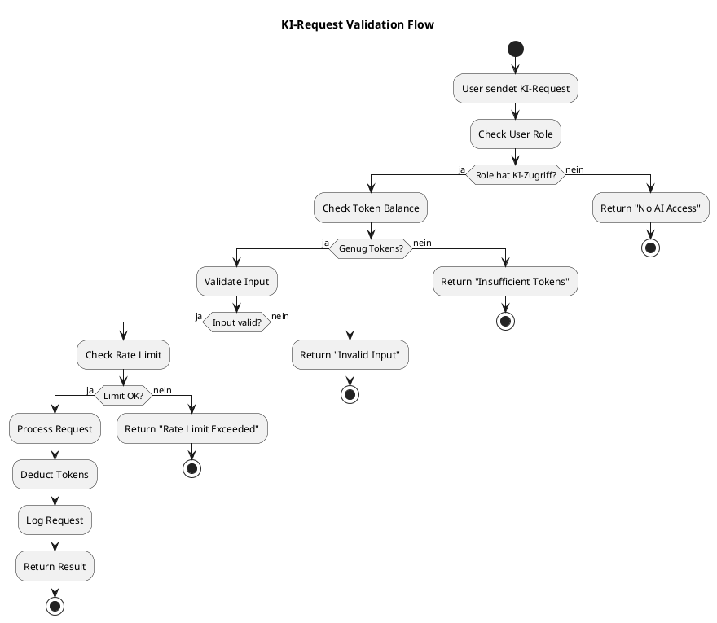

---

## 2. KI-Module (13 Spezialisierte Komponenten)

### 📊 Modulübersicht

```plantuml
@startuml
!include https://raw.githubusercontent.com/plantuml-stdlib/C4-PlantUML/master/C4_Component.puml

title KI-Pipeline - 13 Spezialisierte Module

Container_Boundary(ki_pipeline, "KI-Pipeline") {
    Component(router, "KI Router", "Python", "Request Distribution & Orchestration")

    Component_Boundary(parsers, "Parsing Layer") {
        Component(pdf, "PDF Parser", "PyPDF2", "PDF → Text/Struktur")
        Component(doc, "Doc Parser", "python-docx", "DOCX → Text/Struktur")
        Component(ppt, "PPT Parser", "python-pptx", "PPTX → Slides/Text")
        Component(ocr, "OCR Engine", "Tesseract", "Bild → Text")
    }

    Component_Boundary(generators, "Generation Layer") {
        Component(module_gen, "Module Generator", "GPT-4", "Kursstruktur")
        Component(theory_gen, "Theory Generator", "GPT-4", "Theorieblätter")
        Component(method_gen, "Method Generator", "GPT-4", "32 Methoden (LM00–LM31)")
        Component(quiz_gen, "Quiz Generator", "GPT-4", "Fragen/Antworten")
        Component(exam_gen, "Exam Simulator", "GPT-4", "Vollständige Prüfungen")
    }

    Component_Boundary(specialized, "Specialized AI") {
        Component(whiteboard, "Whiteboard AI", "Claude Vision", "Diagramm-Analyse")
        Component(math, "Math AI", "GPT-4", "Rechenweg-Analyse")
        Component(translate, "Translation", "DeepL", "20 Sprachen")
    }

    Component(validator, "Content Validator", "GPT-3.5", "Qualitätskontrolle")
    Component(optimizer, "Content Optimizer", "GPT-4", "Vereinfachung/Erweiterung")
}

Rel(router, pdf, "Route")
Rel(router, doc, "Route")
Rel(router, ppt, "Route")
Rel(router, ocr, "Route")

Rel(pdf, module_gen, "Parsed Content")
Rel(doc, module_gen, "Parsed Content")
Rel(ppt, module_gen, "Parsed Content")

Rel(module_gen, theory_gen, "Module Structure")
Rel(theory_gen, method_gen, "Theory Content")
Rel(theory_gen, quiz_gen, "Theory Content")
Rel(module_gen, exam_gen, "Course Structure")

Rel(method_gen, validator, "Generated Content")
Rel(theory_gen, validator, "Generated Content")
Rel(quiz_gen, validator, "Generated Content")

Rel(validator, optimizer, "Flagged Content")

@enduml
```

### 🔧 Detaillierte Modulbeschreibung

| Nr. | Modul | Funktion | Technologie | Input | Output |
|-----|-------|----------|-------------|-------|--------|
| 1 | **PDF Parser** | PDF → Text/Struktur | PyPDF2, pdfplumber | PDF-Datei | JSON-Struktur |
| 2 | **Doc Parser** | DOCX → Text/Struktur | python-docx | DOCX-Datei | JSON-Struktur |
| 3 | **PPT Parser** | PPTX → Slides/Text | python-pptx | PPTX-Datei | Slide-Array |
| 4 | **OCR Engine** | Bild → Text | Tesseract, Cloud Vision | Bilder | Text + Bounding Boxes |
| 5 | **Module Generator** | Kursstruktur | GPT-4 | Parsed Content | Modul-Liste |
| 6 | **Theory Generator** | Theorieblätter | GPT-4 | Modul-Kontext | Theory Sheet |
| 7 | **Method Generator** | 32 Methoden befüllen (LM00–LM31) | GPT-4 | Theory + Lernziele | Method Data |
| 8 | **Quiz Generator** | Fragen/Antworten | GPT-4 | Theory | Fragen-JSON |
| 9 | **Exam Simulator** | Vollständige Prüfungen | GPT-4 | Course Data | Exam-JSON |
| 10 | **Whiteboard AI** | Diagramm-Analyse | Claude Vision | Canvas/Bild | Interpretation + Feedback |
| 11 | **Math AI** | Rechenweg-Analyse | GPT-4 | Math-Problem | Schritt-für-Schritt-Lösung |
| 12 | **Translation Engine** | 20 Sprachen | DeepL, Google | Source Text | Translations |
| 13 | **Content Validator** | Qualitätsprüfung | GPT-3.5 | Generated Content | Validation Report |

---

## 3. Datenmodell: KI-Pipeline Entities

### 🗄️ ER-Diagramm

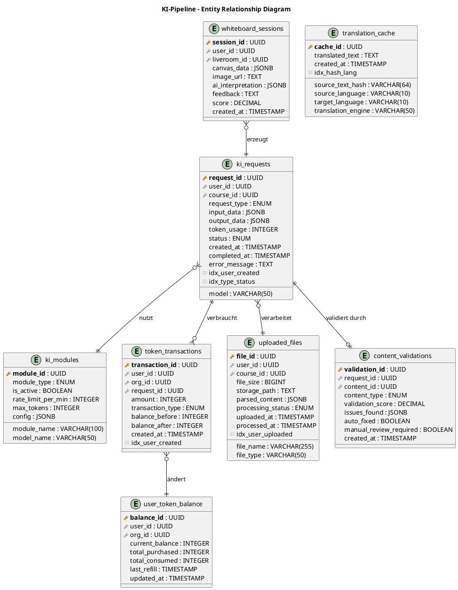

### 📋 Datenbank-Schema Details

**ki_requests - KI-Anfragen-Log**

```sql
CREATE TABLE ki_requests (
    request_id UUID PRIMARY KEY DEFAULT gen_random_uuid(),
    user_id UUID NOT NULL REFERENCES users(user_id),
    course_id UUID REFERENCES courses(course_id),
    request_type VARCHAR(50) NOT NULL, -- 'module_gen', 'quiz_gen', 'translate', etc.
    input_data JSONB,
    output_data JSONB,
    token_usage INTEGER NOT NULL,
    model VARCHAR(50), -- 'gpt-4', 'claude-3', 'gpt-3.5-turbo'
    status VARCHAR(20) DEFAULT 'pending', -- 'pending', 'processing', 'completed', 'failed'
    created_at TIMESTAMP DEFAULT NOW(),
    completed_at TIMESTAMP,
    error_message TEXT,
    CONSTRAINT check_status CHECK (status IN ('pending', 'processing', 'completed', 'failed'))
);

CREATE INDEX idx_ki_requests_user_created ON ki_requests(user_id, created_at DESC);
CREATE INDEX idx_ki_requests_type_status ON ki_requests(request_type, status);
```

**Request Types:**

| Type | Beschreibung | Durchschnittliche Tokens |
|------|-------------|--------------------------|
| `pdf_parse` | PDF-Datei parsen | 500-5000 |
| `module_gen` | Module generieren | 2000-8000 |
| `theory_gen` | Theorieblatt erstellen | 1500-6000 |
| `method_gen` | Lernmethoden befüllen | 1000-4000 |
| `quiz_gen` | Quiz-Fragen generieren | 800-3000 |
| `exam_gen` | Prüfung generieren | 3000-10000 |
| `translate` | Übersetzung | 500-2000 pro Sprache |
| `whiteboard_analyze` | Whiteboard analysieren | 1000-3000 |
| `math_solve` | Mathematik lösen | 800-2500 |
| `summarize` | Zusammenfassung | 500-2000 |
| `validate` | Content validieren | 300-1000 |

---

## 4. KI-Import: Dateiverarbeitung

### 📁 Unterstützte Dateitypen

| Typ | Format | Max. Größe | Parser | Output |
|-----|--------|-----------|--------|--------|
| 📄 PDF | .pdf | 50 MB | PyPDF2, pdfplumber | Text + Struktur |
| 📊 PowerPoint | .pptx | 100 MB | python-pptx | Slides + Text + Bilder |
| 📝 Word | .docx | 30 MB | python-docx | Text + Formatierung |
| 📃 Text | .txt, .md | 10 MB | Plain Text | Raw Text |
| 🖼️ Bilder | .png, .jpg | 10 MB | OCR (Tesseract) | Extrahierter Text |
| 📸 Whiteboard | .png, .jpg | 10 MB | Claude Vision | Diagramm-Interpretation |

### ⚙️ Datei-Upload & Verarbeitung Workflow

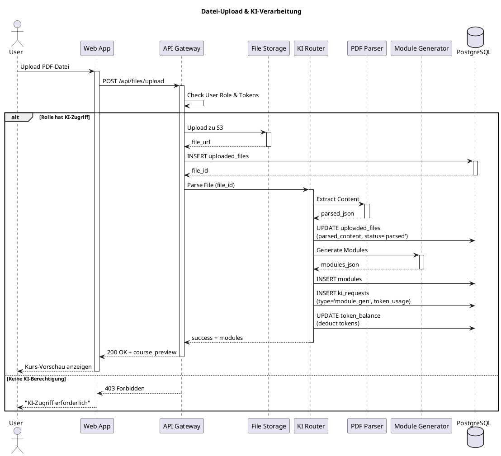

### 📋 Beispiel: Parsed Content JSON

```json
{
  "file_id": "uuid-123",
  "title": "Computer-Netzwerke Grundlagen",
  "detected_language": "de",
  "sections": [
    {
      "heading": "OSI-Modell",
      "level": 1,
      "content": "Das OSI-Modell besteht aus 7 Schichten...",
      "subsections": [
        {
          "heading": "Schicht 1: Physical Layer",
          "level": 2,
          "content": "Die physikalische Schicht...",
          "images": ["img_url_1"],
          "tables": [
            {
              "headers": ["Schicht", "Protokoll", "Beispiel"],
              "rows": [
                ["1", "Ethernet", "RJ-45"]
              ]
            }
          ]
        }
      ]
    }
  ],
  "metadata": {
    "page_count": 45,
    "word_count": 12500,
    "estimated_tokens": 15000
  }
}
```

---

## 5. Modul-Generator

### 🎯 Ziel

Aus umfangreichem Input (Buch, Skript, PDF) sinnvolle Lernmodule erzeugen.

### 🔄 Generierungs-Prozess

```plantuml
@startuml
title KI-Module-Generation Workflow

start

:Parsed Content empfangen;

:Themenanalyse mit GPT-4;
note right
  Prompt: "Analysiere den Inhalt
  und identifiziere Hauptthemen"
end note

:Clustering in logische Einheiten;

:Modulvorschlag generieren;
note right
  - Modulüberschriften
  - Reihenfolge
  - Abhängigkeiten
end note

:Creator/Lehrer Review;
if (Struktur akzeptiert?) then (ja)
  :Modul-Datensätze erstellen;

  fork
    :Theorie-Generator starten;
  fork again
    :Lernziele generieren;
  fork again
    :Schwierigkeitsgrad bestimmen;
  end fork

  :Module in DB speichern;
  :Token-Verbrauch loggen;
  stop
else (nein)
  :Struktur anpassen;
  backward:Neue Analyse;
endif

@enduml
```

### 📊 GPT-4 Prompt für Module-Generierung

```python
SYSTEM_PROMPT = """
Du bist ein KI-Assistent für Kursstrukturierung.
Deine Aufgabe: Aus bereitgestelltem Lernmaterial sinnvolle Module erstellen.

Regeln:
- 5-15 Module pro Kurs
- Logische Progression (einfach → komplex)
- Jedes Modul: klares Lernziel
- Berücksichtige Abhängigkeiten zwischen Modulen
"""

USER_PROMPT = f"""
Erstelle eine Modulstruktur für folgenden Kurs:

Titel: {course_title}
Inhalt: {parsed_content}

Ausgabe-Format (JSON):
{{
  "modules": [
    {{
      "order": 1,
      "title": "Modulname",
      "description": "Kurzbeschreibung",
      "learning_objectives": ["Ziel 1", "Ziel 2"],
      "estimated_duration_minutes": 60,
      "difficulty": "beginner|intermediate|advanced",
      "dependencies": []
    }}
  ]
}}
"""
```

### ✅ Beispiel-Output

```json
{
  "modules": [
    {
      "order": 1,
      "title": "Einführung in Computernetzwerke",
      "description": "Grundbegriffe, Netzwerktypen, Topologien",
      "learning_objectives": [
        "Unterscheidung LAN/WAN/MAN",
        "Topologien erkennen",
        "OSI-Modell verstehen"
      ],
      "estimated_duration_minutes": 90,
      "difficulty": "beginner",
      "dependencies": []
    },
    {
      "order": 2,
      "title": "OSI-Modell im Detail",
      "description": "Alle 7 Schichten verstehen",
      "learning_objectives": [
        "Jede Schicht erklären können",
        "Protokolle zuordnen",
        "Datenfluss nachvollziehen"
      ],
      "estimated_duration_minutes": 120,
      "difficulty": "intermediate",
      "dependencies": [1]
    }
  ]
}
```

---

## 6. Theorieblatt-Generator

### 📖 Struktur eines Theorieblatts

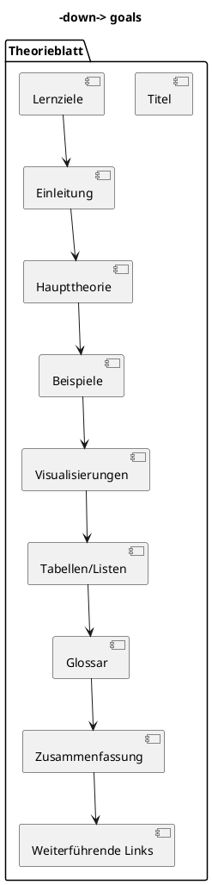

### 🛠️ Erstellungsoptionen

| Methode | Beschreibung | KI-Tokens | Qualität |
|---------|-------------|-----------|----------|
| 🤖 **Vollautomatisch** | GPT-4 generiert komplett | 2000-6000 | ⭐⭐⭐⭐ |
| 🤝 **Semi-Automatisch** | KI-Vorschlag + manuelle Ergänzung | 1000-3000 | ⭐⭐⭐⭐⭐ |
| ✍️ **Manuell** | Creator schreibt selbst | 0-500 (nur Review) | ⭐⭐⭐⭐⭐ |
| 🔄 **Import + Optimierung** | Bestehendes Material verbessern | 1500-4000 | ⭐⭐⭐⭐ |

### 💎 Premium-Features für Theorieblätter

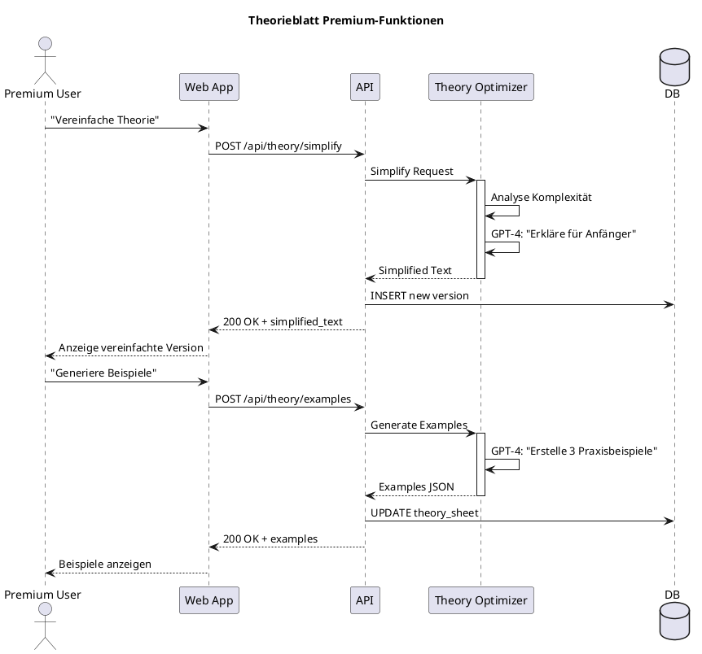

---

## 7. Lernmethoden-Generator

### 🎯 Automatische Methodenzuordnung

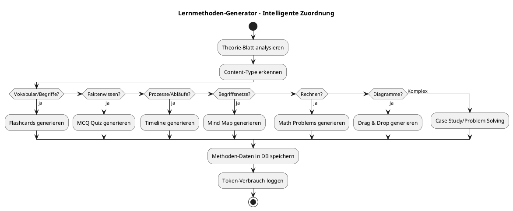

### 📦 Beispiel: Flashcard-Generierung

**GPT-4 Prompt:**

```python
PROMPT = f"""
Erstelle Flashcards aus folgendem Theorieinhalt:

{theory_content}

Anforderungen:
- Mindestens 10 Flashcards
- Frage auf Vorderseite, Antwort auf Rückseite
- Klare, präzise Formulierung
- Schwierigkeitsgrad: {difficulty}

Output-Format (JSON):
{{
  "flashcards": [
    {{
      "front": "Was ist das OSI-Modell?",
      "back": "Ein Referenzmodell für Netzwerkprotokolle mit 7 Schichten.",
      "tags": ["OSI", "Grundlagen"],
      "difficulty": "easy"
    }}
  ]
}}
"""
```

**Generated Output:**

```json
{
  "flashcards": [
    {
      "front": "Was ist das OSI-Modell?",
      "back": "Ein Referenzmodell für Netzwerkprotokolle mit 7 Schichten.",
      "tags": ["OSI", "Grundlagen"],
      "difficulty": "easy"
    },
    {
      "front": "Nenne die 7 Schichten des OSI-Modells.",
      "back": "1. Physical, 2. Data Link, 3. Network, 4. Transport, 5. Session, 6. Presentation, 7. Application",
      "tags": ["OSI", "Schichten"],
      "difficulty": "medium"
    }
  ]
}
```

### 🔧 Unterstützte Methoden

| Methode | KI-Generierung | Durchschn. Tokens | Schwierigkeitsgrad |
|---------|----------------|-------------------|-------------------|
| 1. Flashcards | ✅ | 800-2000 | Einfach |
| 2. MCQ Quiz | ✅ | 1000-3000 | Einfach |
| 3. Fill Blanks | ✅ | 600-1500 | Mittel |
| 4. Matching | ✅ | 500-1200 | Einfach |
| 5. Drag & Drop | ✅ | 700-1800 | Mittel |
| 6. Basic Math | ✅ | 1000-2500 | Mittel |
| 12. Spaced Repetition | ✅ | 1500-3000 | Komplex |
| 13. Mind Maps | ✅ | 2000-4000 | Komplex |
| 14. Timeline | ✅ | 800-2000 | Mittel |
| 15. Storytelling | ✅ | 1500-3500 | Komplex |
| 18. Case Studies | ✅ | 3000-6000 | Sehr Komplex |
| 20. KI-Prüfungssim. | ✅ | 4000-10000 | Sehr Komplex |

---

## 8. Quiz- und Fragen-Generator

### 📚 Fragen-Typen

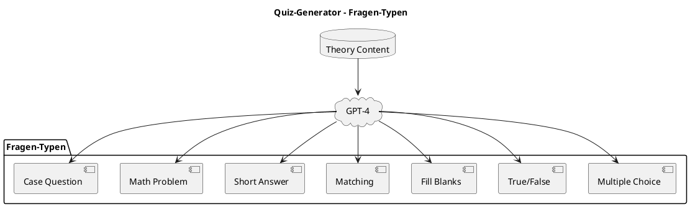

### 🔍 Qualitäts-Checks

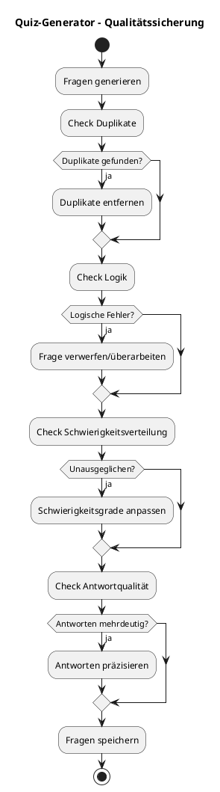

---

## 9. Prüfungssimulation-Generator

### ✅ Pro-Methode #20: KI-Prüfungssimulation

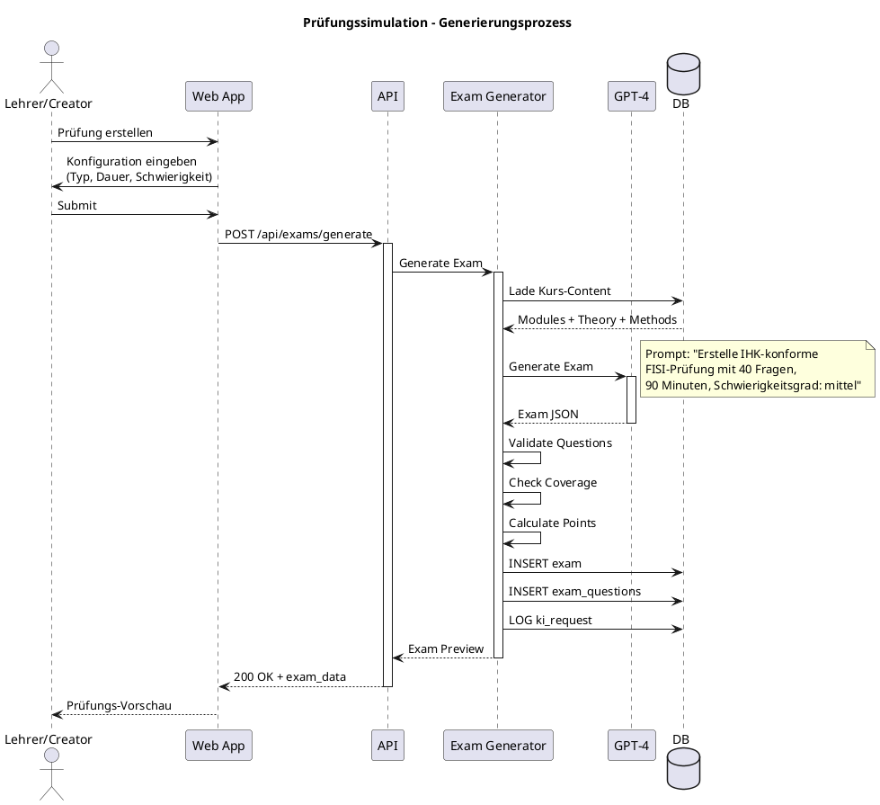

### 📋 Exam-Konfiguration

```json
{
  "exam_config": {
    "exam_type": "IHK FISI AP1",
    "duration_minutes": 90,
    "total_points": 100,
    "difficulty": "intermediate",
    "question_distribution": {
      "mcq": 25,
      "fill_blanks": 10,
      "short_answer": 3,
      "case_study": 2
    },
    "topic_coverage": {
      "netzwerke": 40,
      "hardware": 20,
      "software": 20,
      "projektmanagement": 20
    },
    "passing_score": 50
  }
}
```

### 🎓 Unterstützte Prüfungs-Standards

| Standard | Beschreibung | Typische Dauer | Fragen |
|----------|-------------|----------------|--------|
| **IHK FISI AP1** | Fachinformatiker Systemintegration Teil 1 | 90 min | 40 |
| **IHK FIAE AP1** | Fachinformatiker Anwendungsentwicklung Teil 1 | 90 min | 40 |
| **CompTIA A+** | IT-Grundlagen-Zertifizierung | 90 min | 90 |
| **CompTIA Network+** | Netzwerk-Zertifizierung | 90 min | 90 |
| **Abitur Informatik** | Schulabschlussprüfung | 180 min | Variabel |
| **Custom Enterprise** | Unternehmens-spezifisch | Variabel | Variabel |

---

## 10. Whiteboard-KI

### 🖊️ Einsatzgebiete

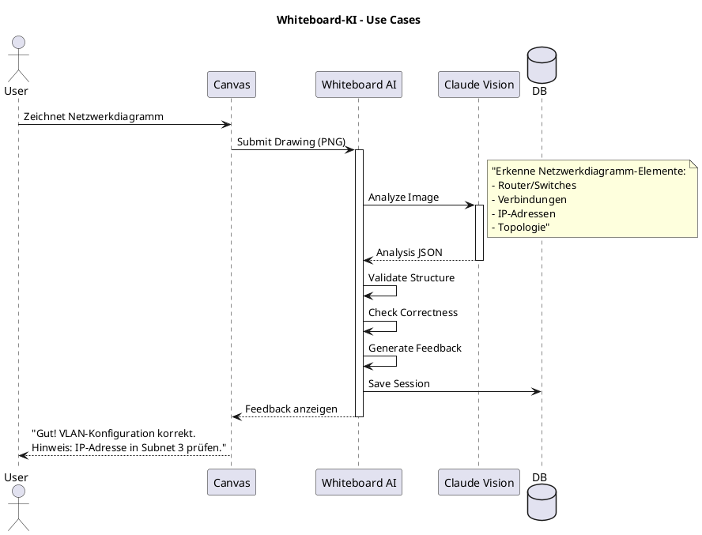

### 🔧 Erkennbare Elemente

| Kategorie | Elemente | Use Case |
|-----------|----------|----------|
| **Netzwerke** | Router, Switches, Firewalls, Verbindungen | IT-Netzwerk-Training |
| **Mathematik** | Gleichungen, Graphen, Geometrie | Mathe-Übungen |
| **UML** | Klassendiagramme, Sequenzdiagramme | Software-Engineering |
| **Prozesse** | Flussdiagramme, BPMN | Projektmanagement |
| **Physik** | Schaltkreise, Kräfte-Diagramme | Physik-Unterricht |

### 📊 Beispiel-Response

```json
{
  "interpretation": {
    "type": "network_diagram",
    "elements_detected": [
      {
        "type": "router",
        "label": "R1",
        "position": {"x": 150, "y": 200},
        "connections": ["SW1", "SW2"]
      },
      {
        "type": "switch",
        "label": "SW1",
        "position": {"x": 300, "y": 100},
        "vlans": ["VLAN10", "VLAN20"]
      }
    ],
    "topology": "star",
    "correctness_score": 0.85,
    "issues": [
      {
        "severity": "warning",
        "message": "IP-Adresse 192.168.1.1 ist bereits in VLAN10 vergeben",
        "element": "SW1"
      }
    ]
  },
  "feedback": "Sehr gute Darstellung der Netzwerktopologie! Die VLAN-Struktur ist korrekt aufgebaut. Beachte die doppelte IP-Adresse in VLAN10.",
  "suggestions": [
    "Verwende 192.168.2.1 für das zweite Gerät in VLAN10",
    "Füge Default-Gateway für VLAN20 hinzu"
  ]
}
```

---

## 11. Mathe-KI (Rechenweg-Analyse)

### 🧮 Fähigkeiten

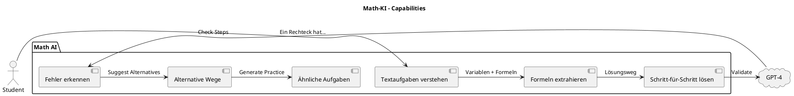

### 📝 Beispiel: BWL-Rechnung

**Input:**

```
Ein Unternehmen kauft 500 Einheiten zu je 12€.
Verkaufspreis: 18€ pro Einheit.
Berechne: Gewinn absolut und in %
```

**Math-KI Analysis:**

```json
{
  "problem_type": "profit_calculation",
  "variables": {
    "quantity": 500,
    "cost_per_unit": 12,
    "price_per_unit": 18
  },
  "solution_steps": [
    {
      "step": 1,
      "description": "Gesamtkosten berechnen",
      "formula": "Gesamtkosten = Menge × Einkaufspreis",
      "calculation": "500 × 12€ = 6.000€",
      "result": 6000
    },
    {
      "step": 2,
      "description": "Gesamterlös berechnen",
      "formula": "Gesamterlös = Menge × Verkaufspreis",
      "calculation": "500 × 18€ = 9.000€",
      "result": 9000
    },
    {
      "step": 3,
      "description": "Gewinn absolut",
      "formula": "Gewinn = Erlös - Kosten",
      "calculation": "9.000€ - 6.000€ = 3.000€",
      "result": 3000
    },
    {
      "step": 4,
      "description": "Gewinn in Prozent",
      "formula": "Gewinn% = (Gewinn / Kosten) × 100",
      "calculation": "(3.000€ / 6.000€) × 100 = 50%",
      "result": 50
    }
  ],
  "final_answer": {
    "gewinn_absolut": "3.000€",
    "gewinn_prozent": "50%"
  },
  "alternative_approaches": [
    "Direktberechnung: (18-12) × 500 = 3.000€"
  ]
}
```

---

## 12. Multi-Language Engine (LSX Global Publishing)

### 🌍 20 Unterstützte Sprachen

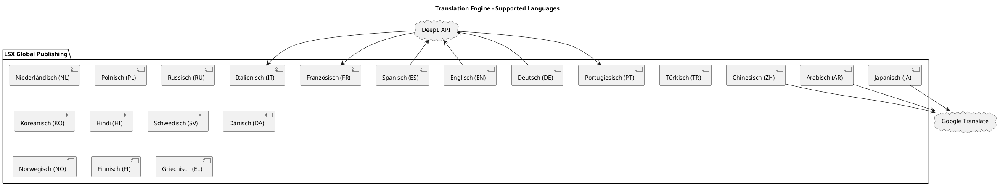

### ⚙️ Übersetzungs-Workflow

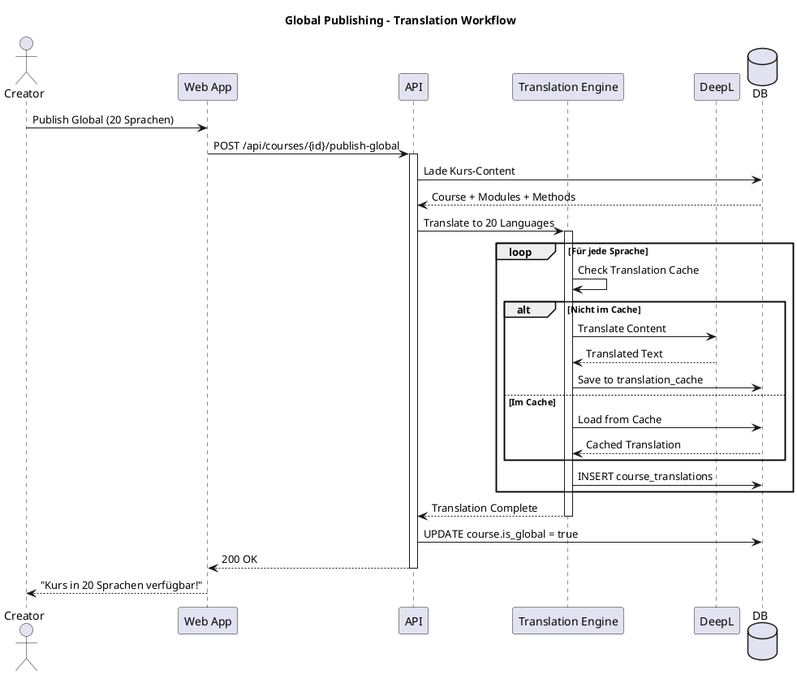

### 📋 Übersetzbare Content-Typen

| Content-Typ | Übersetzt | Beispiel |
|-------------|-----------|----------|
| **Kurs-Titel** | ✅ | "Computer Networks" → "Réseaux Informatiques" |
| **Beschreibung** | ✅ | Long description text |
| **Modul-Namen** | ✅ | "OSI Model" → "Modelo OSI" |
| **Theorie-Blätter** | ✅ | Vollständiger Theorie-Text |
| **Flashcards** | ✅ | Front + Back |
| **Quiz-Fragen** | ✅ | Question + Answers + Explanation |
| **Glossar** | ✅ | Terms + Definitions |
| **Video-Untertitel** | ✅ | SRT/VTT files |
| **Code-Kommentare** | ❌ | Bleiben im Original |

### 🔐 Zugriffsberechtigung

| Rolle | Global Publishing |
|-------|-------------------|
| Free | ❌ |
| Premium | ❌ |
| Creator | ✅ |
| Teacher | ❌ (nur via Schule) |
| School | ✅ |
| Company | ✅ |
| Admin | ✅ |

---

## 13. Content-Validator

### 🔍 Validierungs-Checks

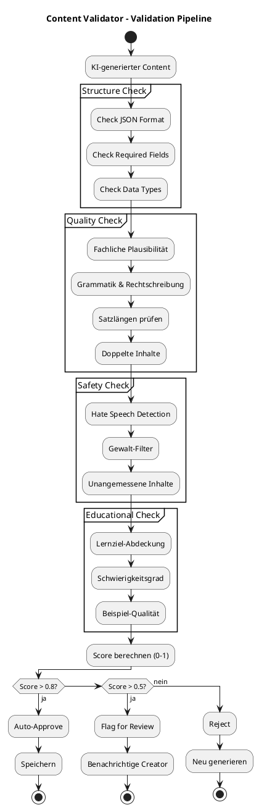

### 🏷️ Validation Report

```json
{
  "validation_id": "uuid",
  "content_type": "quiz_questions",
  "validation_score": 0.87,
  "checks_performed": {
    "structure": {
      "passed": true,
      "issues": []
    },
    "quality": {
      "passed": true,
      "issues": [
        {
          "severity": "info",
          "message": "Frage 5: Sehr langer Satz (>40 Wörter)",
          "suggestion": "In mehrere Sätze aufteilen"
        }
      ]
    },
    "safety": {
      "passed": true,
      "issues": []
    },
    "educational": {
      "passed": true,
      "issues": []
    }
  },
  "auto_approved": true,
  "manual_review_required": false,
  "created_at": "2024-11-14T10:30:00Z"
}
```

---

## 14. Token-System

### 💰 Token-Verbrauch

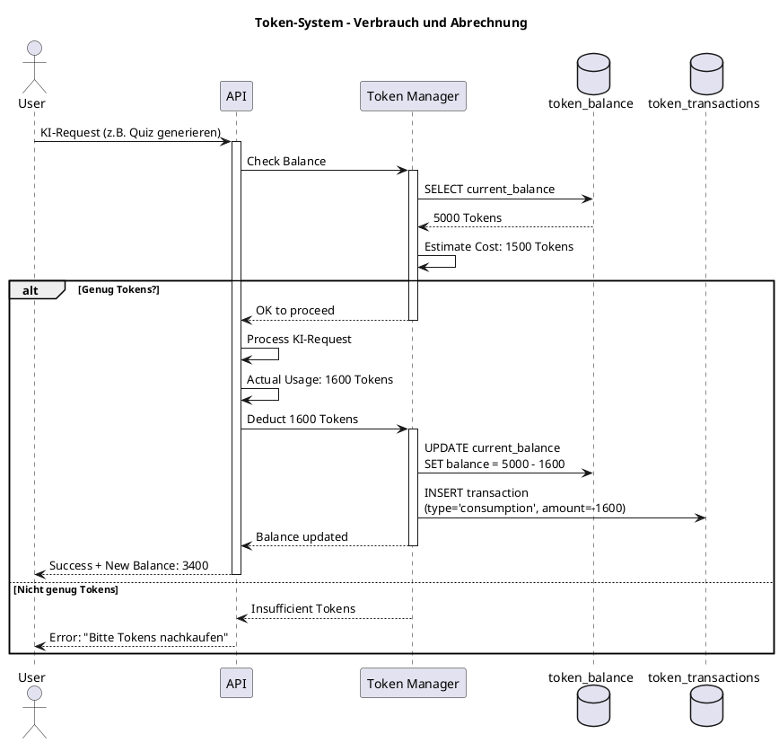

### 📊 Token-Pakete

| Paket | Tokens | Preis | Preis/Token |
|-------|--------|-------|-------------|
| **Starter** | 10.000 | 9,99€ | 0,001€ |
| **Pro** | 50.000 | 39,99€ | 0,0008€ |
| **Business** | 200.000 | 129,99€ | 0,00065€ |
| **Enterprise** | 1.000.000 | 499,99€ | 0,0005€ |

### 🏫 Organisations-Token-Pool

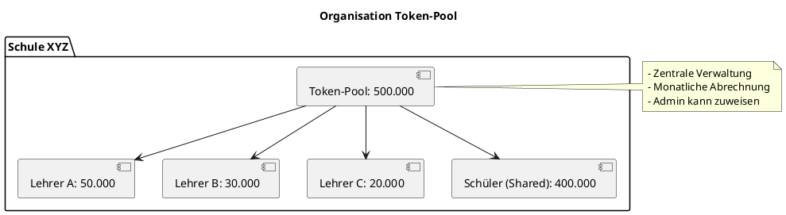

---

## 15. Sicherheit & Abuse-Schutz

### 🔒 Schutzmechanismen

```plantuml
@startuml
title KI-Pipeline - Security & Abuse Protection

package "Security Layer" {
  [Rate Limiter] as rl
  [Input Validator] as iv
  [Size Limiter] as sl
  [Content Filter] as cf
  [Abuse Detector] as ad
  [User Blocker] as ub
}

actor "User Request" as user
participant "KI Router" as router

user -> rl : Request
rl -> iv : Check Rate OK
iv -> sl : Validate Input
sl -> cf : Check Size
cf -> ad : Filter Content
ad -> router : Detect Abuse

ad -> ub : Flag User (if abuse)

note right of rl
  - Max 10 Requests/Minute (Premium)
  - Max 50 Requests/Minute (School)
  - Max 100 Requests/Minute (Enterprise)
end note

note right of sl
  - PDF: Max 50 MB
  - Text: Max 10 MB
  - Request Payload: Max 5 MB
end note

@enduml
```

### ⏱️ Rate Limits

| Rolle | Requests/Minute | Requests/Stunde | Max File Size |
|-------|-----------------|-----------------|---------------|
| **Premium** | 10 | 200 | 30 MB |
| **Creator** | 20 | 500 | 50 MB |
| **Teacher** | 30 | 800 | 50 MB |
| **School** | 50 | 2000 | 100 MB |
| **Enterprise** | 100 | 5000 | 100 MB |

---

## 16. API-Endpunkte

### 📡 KI-Pipeline API Endpoints

| Endpoint | Methode | Beschreibung | Rolle |
|----------|---------|--------------|-------|
| `/api/files/upload` | POST | Datei hochladen & parsen | Premium+ |
| `/api/ki/modules/generate` | POST | Module generieren | Premium+ |
| `/api/ki/theory/generate` | POST | Theorieblatt erstellen | Premium+ |
| `/api/ki/methods/generate` | POST | Lernmethoden befüllen | Premium+ |
| `/api/ki/quiz/generate` | POST | Quiz generieren | Premium+ |
| `/api/ki/exam/generate` | POST | Prüfung generieren | Creator/Teacher+ |
| `/api/ki/translate` | POST | Übersetzen | Creator/School+ |
| `/api/ki/whiteboard/analyze` | POST | Whiteboard analysieren | Premium+ |
| `/api/ki/math/solve` | POST | Mathe lösen | Premium+ |
| `/api/ki/summarize` | POST | Zusammenfassen | Premium+ |
| `/api/ki/validate` | POST | Content validieren | Creator/Teacher+ |
| `/api/tokens/balance` | GET | Token-Stand abfragen | Premium+ |
| `/api/tokens/purchase` | POST | Tokens kaufen | Premium+ |

### 📋 Beispiel-Request: Quiz generieren

**Request:**

```http
POST /api/ki/quiz/generate HTTP/1.1
Host: api.lsx-system.com
Authorization: Bearer <jwt_token>
Content-Type: application/json

{
  "module_id": "uuid-123",
  "question_count": 10,
  "difficulty": "intermediate",
  "question_types": ["mcq", "fill_blanks"],
  "topics": ["OSI-Modell", "Netzwerk-Topologien"]
}
```

**Response:**

```json
{
  "status": "success",
  "request_id": "ki-req-456",
  "token_usage": 1200,
  "balance_remaining": 8800,
  "data": {
    "questions": [
      {
        "question_id": "q1",
        "type": "mcq",
        "question": "Welche Schicht des OSI-Modells ist für Routing zuständig?",
        "options": [
          "Physical Layer",
          "Data Link Layer",
          "Network Layer",
          "Transport Layer"
        ],
        "correct_answer": "Network Layer",
        "explanation": "Die Network Layer (Schicht 3) ist für Routing und logische Adressierung zuständig.",
        "difficulty": "easy",
        "tags": ["OSI", "Routing"]
      }
    ]
  },
  "validation": {
    "score": 0.92,
    "auto_approved": true
  }
}
```

### 📋 Beispiel-Request: Prüfung generieren

**Request:**

```http
POST /api/ki/exam/generate HTTP/1.1
Host: api.lsx-system.com
Authorization: Bearer <jwt_token>
Content-Type: application/json

{
  "course_id": "uuid-789",
  "exam_config": {
    "exam_type": "IHK FISI AP1",
    "duration_minutes": 90,
    "total_points": 100,
    "difficulty": "intermediate",
    "question_distribution": {
      "mcq": 25,
      "fill_blanks": 10,
      "short_answer": 3,
      "case_study": 2
    },
    "topic_coverage": {
      "netzwerke": 40,
      "hardware": 20,
      "software": 20,
      "projektmanagement": 20
    }
  }
}
```

**Response:**

```json
{
  "status": "success",
  "request_id": "ki-req-789",
  "token_usage": 8500,
  "balance_remaining": 41500,
  "data": {
    "exam_id": "exam-101",
    "title": "IHK FISI AP1 - Abschlussprüfung Teil 1",
    "duration_minutes": 90,
    "total_points": 100,
    "passing_score": 50,
    "questions": [
      {
        "question_id": "q1",
        "type": "mcq",
        "points": 2,
        "question": "Was ist ein VLAN?",
        "options": ["..."],
        "correct_answer": "...",
        "topic": "netzwerke"
      }
    ],
    "statistics": {
      "total_questions": 40,
      "by_type": {
        "mcq": 25,
        "fill_blanks": 10,
        "short_answer": 3,
        "case_study": 2
      },
      "by_topic": {
        "netzwerke": 16,
        "hardware": 8,
        "software": 8,
        "projektmanagement": 8
      }
    }
  },
  "validation": {
    "score": 0.95,
    "coverage_complete": true,
    "auto_approved": true
  }
}
```

---

## 17. KI-Request Lifecycle

### 🔄 State Diagram

```plantuml
@startuml
title KI-Request - Lifecycle States

[*] --> Pending : Request Created

Pending --> Validating : Start Processing
Validating --> Rejected : Validation Failed
Validating --> Queued : Validation OK

Rejected --> [*]

Queued --> Processing : Worker Picks Up
Processing --> Validating_Output : KI Response Received
Validating_Output --> Retry : Output Invalid (< 3 retries)
Validating_Output --> Failed : Max Retries Exceeded
Validating_Output --> Completed : Output Valid

Retry --> Processing : Retry Request

Completed --> [*]
Failed --> [*]

note right of Processing
  - KI API Call
  - Token-Verbrauch
  - Timeout: 5 Minuten
end note

note right of Validating_Output
  - Content Validator
  - Quality Check
  - Safety Check
end note

@enduml
```

---

## 18. Zusammenfassung

### ✅ Die KI-Pipeline von LSX

| Merkmal | Beschreibung |
|---------|-------------|
| 🧩 **Modular** | 13 spezialisierte Module für unterschiedliche Aufgaben |
| 🔐 **Gesichert** | Rollen- und tokenbasierte Zugriffskontrolle |
| 📚 **Umfassend** | Deckt alle Lernprozesse ab: Import → Generierung → Prüfung |
| 🎯 **Flexibel** | Unterstützt alle 32 Lernmethoden (LM00–LM31) |
| 🎓 **Automatisiert** | Vollständige Kurserstellung aus PDF/DOCX/PPTX |
| 🖊️ **Vielseitig** | Whiteboard-Analyse, Mathe-Erkennung, Diagramme |
| 🌍 **International** | LSX Global Publishing für 20 Sprachen |
| 📊 **Transparent** | Vollständiges Logging aller KI-Anfragen |
| ⚡ **Skalierbar** | Async Processing mit Celery Workers |
| 💰 **Fair** | Token-System für gerechte Nutzung |

### 🎯 Kernvorteile

- **Zeit-Ersparnis:** Kurserstellung in Minuten statt Tagen
- **Qualität:** KI-generierte Inhalte mit Validator-Check
- **Skalierbarkeit:** Unbegrenzte Kurse parallel erstellen
- **Mehrsprachigkeit:** Globale Reichweite durch 20 Sprachen
- **Personalisierung:** Adaptive Lernmethoden für jeden User
- **Prüfungsvorbereitung:** IHK/CompTIA-konforme Tests

---

## 📌 Dokument abgeschlossen

**Version:** 1.0
**Status:** Final
**Letzte Aktualisierung:** 2024

---

> 💡 **Hinweis:** Die KI-Pipeline ist das technologische Herzstück von LSX und ermöglicht intelligentes, skalierbares und personalisiertes Lernen für alle Nutzer.
