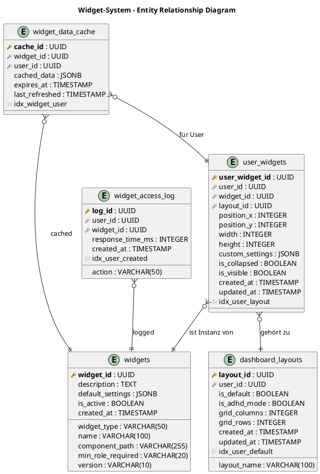
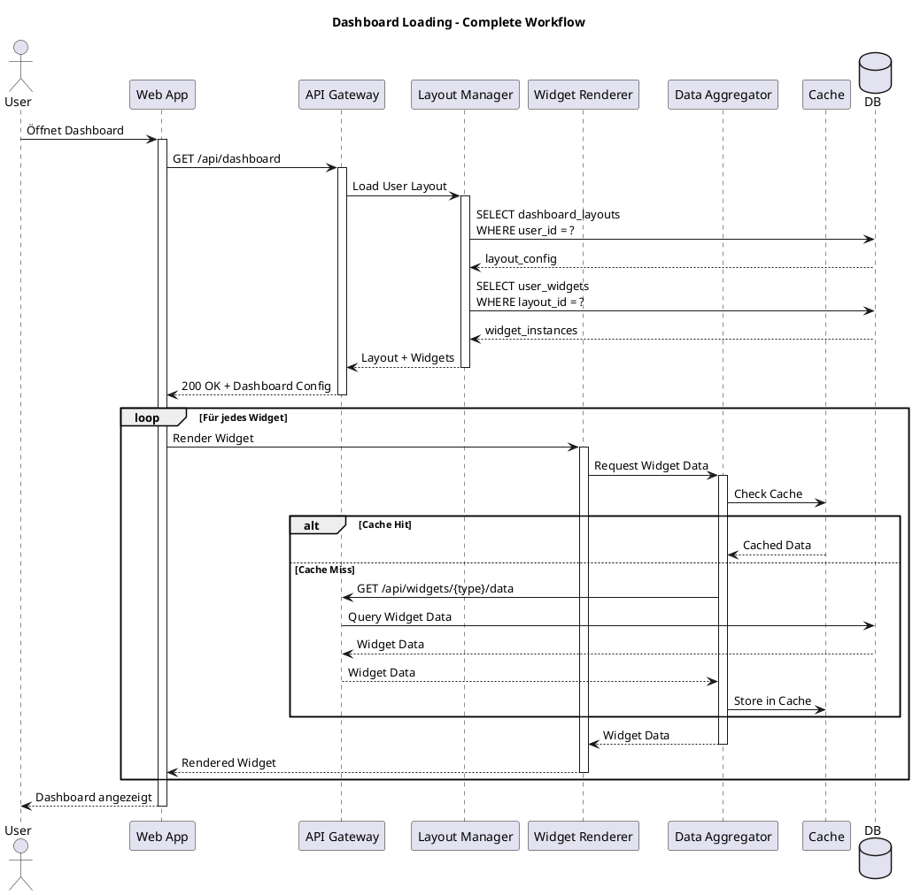
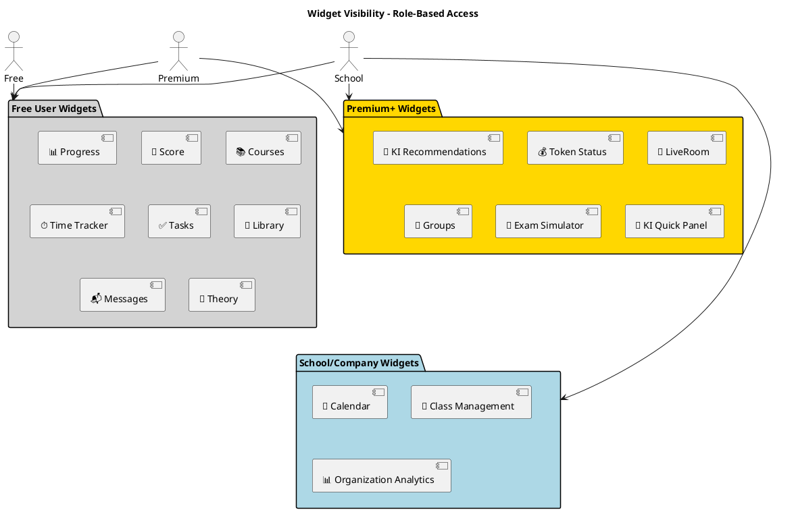
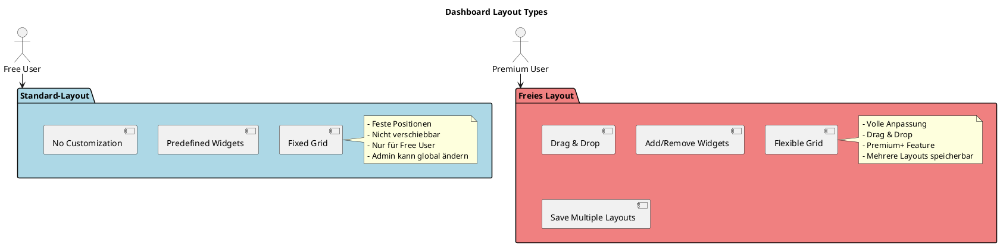
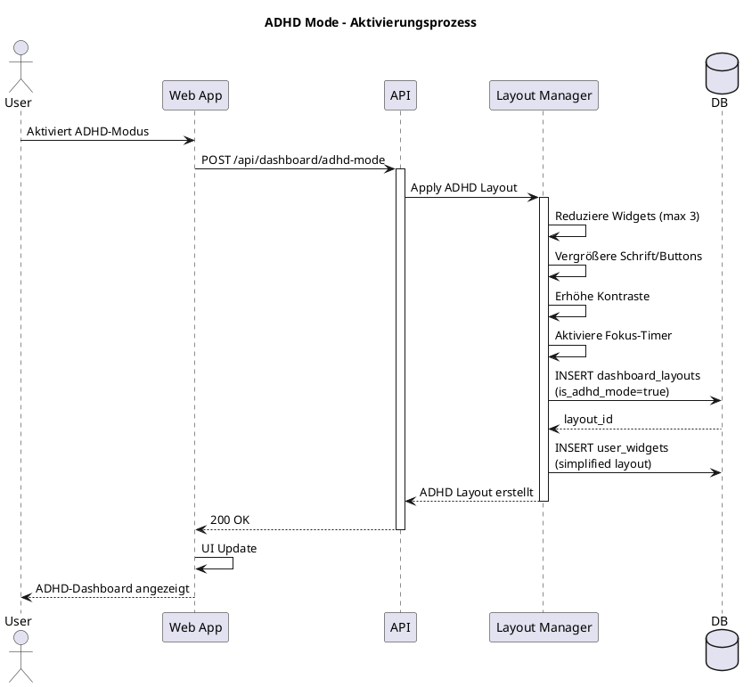
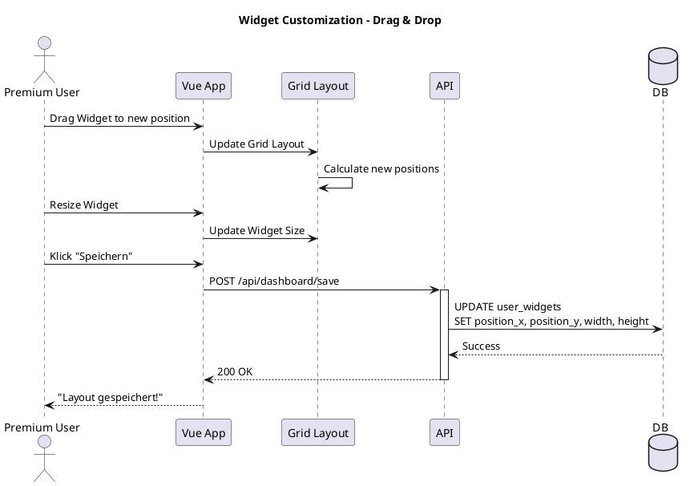
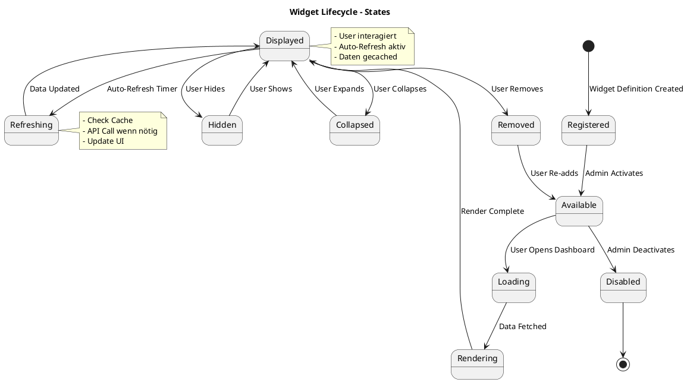
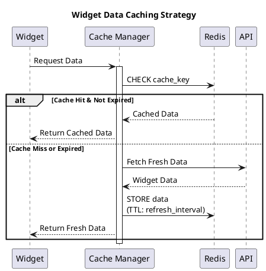

# 11 – Widget-System (Final)

**Version:** 1.0
**Stand:** Final

---

## Überblick

Das **LSX Widget-System** ermöglicht dynamische, personalisierbare Dashboard-Komponenten, die jedem Nutzer eine individuell angepasste Lernübersicht bieten.

### 🎯 Kernfunktionen

- 📊 Individuell anpassbare Dashboards
- 👥 Rollenbasierte Widget-Sichtbarkeit
- 🎨 Drag & Drop Layout-Editor (Premium)
- 🧠 ADHD/ADHS-Support-Modus
- 🤖 KI-gestützte Widgets
- ⚡ Schnellzugriffe auf Lernfunktionen
- 📈 Echtzeit-Datenvisualisierung
- 🧩 Modulares, erweiterbares System

### 📊 Systemarchitektur

```plantuml
@startuml
!include https://raw.githubusercontent.com/plantuml-stdlib/C4-PlantUML/master/C4_Context.puml

title Widget-System - System Context

Person(free_user, "Free User", "Standard Dashboard")
Person(premium_user, "Premium User", "Anpassbares Dashboard")
Person(teacher, "Lehrer", "Dashboard mit Klassen-Widgets")
Person(admin, "Admin", "Verwaltet Widget-Konfiguration")

System(lsx, "LSX LernSystem", "Zentrale Lernplattform")

System_Ext(analytics, "Analytics Service", "Fortschritts-Daten")
System_Ext(ki_service, "KI Service", "KI-Empfehlungen")

Rel(free_user, lsx, "Nutzt Standard Widgets", "HTTPS")
Rel(premium_user, lsx, "Customized Dashboard", "HTTPS")
Rel(teacher, lsx, "Klassen-Übersicht", "HTTPS")
Rel(admin, lsx, "Konfiguriert Widgets", "HTTPS")

Rel(lsx, analytics, "Lädt Statistiken", "REST API")
Rel(lsx, ki_service, "KI-Empfehlungen", "REST API")

@enduml
```

### 🏗️ Container-Architektur

```plantuml
@startuml
!include https://raw.githubusercontent.com/plantuml-stdlib/C4-PlantUML/master/C4_Container.puml

title Widget-System - Container Diagram

Person(user, "User")

System_Boundary(lsx_boundary, "LSX System") {
    Container(web, "Web App", "Vue.js", "User Interface")
    Container(api, "API Gateway", "Flask", "REST API")

    Container_Boundary(widget_system, "Widget System") {
        Container(widget_renderer, "Widget Renderer", "Vue 3", "Dynamic Widgets")
        Container(layout_manager, "Layout Manager", "Python", "Dashboard Layouts")
        Container(data_aggregator, "Data Aggregator", "Python", "Widget Data Sources")
        Container(widget_registry, "Widget Registry", "Python", "Available Widgets")
        Container(adhd_mode, "ADHD Mode", "Python", "Accessibility Features")
    }

    ContainerDb(db, "PostgreSQL", "SQL Database", "Widget Configs, Layouts")
    ContainerDb(redis, "Redis", "Cache", "Widget Data Cache")
}

Rel(user, web, "Nutzt Dashboard", "HTTPS")
Rel(web, api, "API Calls", "JSON/REST")
Rel(api, layout_manager, "Load User Layout")
Rel(layout_manager, db, "Read/Write Layouts")

Rel(widget_renderer, data_aggregator, "Request Widget Data")
Rel(data_aggregator, api, "Fetch from Services")
Rel(data_aggregator, redis, "Cache Data")

Rel(widget_registry, db, "Load Widget Definitions")
Rel(adhd_mode, layout_manager, "Apply ADHD Layout")

@enduml
```

---

## 1. Ziele des Widget-Systems

### 🎯 Hauptziele

| Nr. | Ziel | Beschreibung |
|-----|------|-------------|
| 1 | **Personalisierung** | Individuelles Dashboard pro Nutzer |
| 2 | **Rollenbasiert** | Unterschiedliche Widgets je Rolle |
| 3 | **Modular** | Einfache Erweiterbarkeit |
| 4 | **ADHD-Support** | Spezielle Modi für Aufmerksamkeitsprobleme |
| 5 | **KI-Integration** | Intelligente Empfehlungen |
| 6 | **Kompakte Daten** | Alle Lern-/Kursdaten übersichtlich |
| 7 | **Performance** | Schnelle Ladezeiten durch Caching |
| 8 | **Responsive** | Optimiert für Desktop, Tablet, Mobile |

---

## 2. Widget-Grundarchitektur

### 🏗️ Widget-Komponenten

```plantuml
@startuml
!include https://raw.githubusercontent.com/plantuml-stdlib/C4-PlantUML/master/C4_Component.puml

title Widget-System - Component Architecture

Container_Boundary(widget_system, "Widget System") {
    Component(renderer, "Widget Renderer", "Vue 3", "Renders Widgets")
    Component(loader, "Widget Loader", "JavaScript", "Lazy Loading")
    Component(config, "Config Manager", "Python", "Widget Settings")
    Component(cache, "Cache Manager", "Redis", "Data Caching")

    Component_Boundary(widget_types, "Widget Types") {
        Component(progress, "Progress Widget", "Vue", "Lernfortschritt")
        Component(score, "Score Widget", "Vue", "Prüfungsergebnisse")
        Component(courses, "Courses Widget", "Vue", "Kursliste")
        Component(ki, "KI Widget", "Vue", "KI-Empfehlungen")
        Component(token, "Token Widget", "Vue", "Token-Status")
        Component(timer, "Timer Widget", "Vue", "Zeit-Tracking")
        Component(tasks, "Tasks Widget", "Vue", "Aufgaben")
        Component(calendar, "Calendar Widget", "Vue", "Termine")
        Component(liveroom, "LiveRoom Widget", "Vue", "LiveRoom-Zugriff")
        Component(groups, "Groups Widget", "Vue", "Gruppen")
    }

    Component_Boundary(data_sources, "Data Sources") {
        Component(user_data, "User Data API", "REST", "User-Statistiken")
        Component(course_data, "Course Data API", "REST", "Kurs-Daten")
        Component(exam_data, "Exam Data API", "REST", "Prüfungs-Daten")
        Component(ki_data, "KI Data API", "REST", "KI-Empfehlungen")
    }
}

Rel(renderer, loader, "Load Widgets")
Rel(loader, config, "Load Config")
Rel(loader, cache, "Check Cache")

Rel(progress, user_data, "Fetch Progress")
Rel(score, exam_data, "Fetch Scores")
Rel(courses, course_data, "Fetch Courses")
Rel(ki, ki_data, "Fetch Recommendations")

@enduml
```

### 📋 Widget-Definition Schema

```typescript
interface Widget {
  widget_id: string;
  type: WidgetType;
  title: string;
  role_visibility: Role[];
  size: 'small' | 'medium' | 'large' | 'xlarge';
  position: {
    x: number;
    y: number;
    w: number;
    h: number;
  };
  settings: WidgetSettings;
  data_source: string;
  refresh_interval: number; // seconds
  is_active: boolean;
  created_at: Date;
  updated_at: Date;
}

interface WidgetSettings {
  theme?: 'light' | 'dark';
  show_header?: boolean;
  custom_colors?: {
    primary: string;
    secondary: string;
  };
  data_filters?: Record<string, any>;
}
```

---

## 3. Widget-Typen (15 Standard-Widgets)

### 📦 Vollständige Übersicht

| Nr. | Widget | Icon | Funktion | Rollen |
|-----|--------|------|----------|--------|
| 1 | **Progress Widget** | 📊 | Lernfortschritt über alle Kurse | Alle |
| 2 | **Score Widget** | 📝 | Prüfungsergebnisse & Trendanalyse | Alle |
| 3 | **Courses Widget** | 📚 | Aktive Kurse | Alle |
| 4 | **KI Recommendations** | 🤖 | Personalisierte Vorschläge | Premium+ |
| 5 | **Token Status** | 💰 | Token-Stand & Verbrauch | Premium+ |
| 6 | **Time Tracker** | ⏱️ | Lernzeit-Statistiken | Alle |
| 7 | **Tasks Widget** | ✅ | ToDo-Liste | Alle |
| 8 | **Calendar Widget** | 📅 | Termine & Deadlines | School+ |
| 9 | **LiveRoom Widget** | 🎥 | LiveRoom-Zugriff | Premium+ |
| 10 | **Groups Widget** | 👥 | Private & Team-Gruppen | Premium+ |
| 11 | **Library Widget** | 📖 | Gespeicherte Kurse | Alle |
| 12 | **Messages Widget** | 📬 | System & Community News | Alle |
| 13 | **Theory Access** | 📄 | Schnellzugriff Theorieblätter | Alle |
| 14 | **Exam Simulator** | 🎯 | Prüfungssimulationen | Premium+ |
| 15 | **KI Quick Panel** | 💬 | KI-Assistent Mini-Panel | Premium+ |

---

## 4. Datenmodell: Widget Entities

### 🗄️ ER-Diagramm



### 📋 Datenbank-Schema

**widgets - Widget-Definitionen**

```sql
CREATE TABLE widgets (
    widget_id UUID PRIMARY KEY DEFAULT gen_random_uuid(),
    widget_type VARCHAR(50) NOT NULL UNIQUE,
    name VARCHAR(100) NOT NULL,
    description TEXT,
    component_path VARCHAR(255) NOT NULL,
    default_settings JSONB DEFAULT '{}',
    min_role_required VARCHAR(20) DEFAULT 'free', -- 'free', 'premium', 'creator', etc.
    is_active BOOLEAN DEFAULT true,
    version VARCHAR(10) DEFAULT '1.0.0',
    created_at TIMESTAMP DEFAULT NOW()
);

INSERT INTO widgets (widget_type, name, component_path, min_role_required) VALUES
('progress', 'Lernfortschritt', '/widgets/ProgressWidget.vue', 'free'),
('score', 'Prüfungsergebnisse', '/widgets/ScoreWidget.vue', 'free'),
('courses', 'Meine Kurse', '/widgets/CoursesWidget.vue', 'free'),
('ki_recommendations', 'KI-Empfehlungen', '/widgets/KIWidget.vue', 'premium'),
('token_status', 'Token-Status', '/widgets/TokenWidget.vue', 'premium');
```

**user_widgets - User-spezifische Widget-Instanzen**

```sql
CREATE TABLE user_widgets (
    user_widget_id UUID PRIMARY KEY DEFAULT gen_random_uuid(),
    user_id UUID NOT NULL REFERENCES users(user_id) ON DELETE CASCADE,
    widget_id UUID NOT NULL REFERENCES widgets(widget_id) ON DELETE CASCADE,
    layout_id UUID REFERENCES dashboard_layouts(layout_id) ON DELETE CASCADE,
    position_x INTEGER DEFAULT 0,
    position_y INTEGER DEFAULT 0,
    width INTEGER DEFAULT 1,
    height INTEGER DEFAULT 1,
    custom_settings JSONB DEFAULT '{}',
    is_collapsed BOOLEAN DEFAULT false,
    is_visible BOOLEAN DEFAULT true,
    created_at TIMESTAMP DEFAULT NOW(),
    updated_at TIMESTAMP DEFAULT NOW(),
    CONSTRAINT unique_user_widget_layout UNIQUE (user_id, widget_id, layout_id)
);

CREATE INDEX idx_user_widgets_user_layout ON user_widgets(user_id, layout_id);
```

**dashboard_layouts - Dashboard-Layouts**

```sql
CREATE TABLE dashboard_layouts (
    layout_id UUID PRIMARY KEY DEFAULT gen_random_uuid(),
    user_id UUID NOT NULL REFERENCES users(user_id) ON DELETE CASCADE,
    layout_name VARCHAR(100) NOT NULL,
    is_default BOOLEAN DEFAULT false,
    is_adhd_mode BOOLEAN DEFAULT false,
    grid_columns INTEGER DEFAULT 12,
    grid_rows INTEGER DEFAULT 6,
    created_at TIMESTAMP DEFAULT NOW(),
    updated_at TIMESTAMP DEFAULT NOW(),
    CONSTRAINT unique_user_layout_name UNIQUE (user_id, layout_name)
);

CREATE INDEX idx_layouts_user_default ON dashboard_layouts(user_id, is_default);
```

---

## 5. Widget Loading Workflow

### 🔄 Dashboard Load Sequence



---

## 6. Rollenbasierte Widget-Sichtbarkeit

### 👥 Widget-Verfügbarkeit nach Rolle



### 📋 Detaillierte Rechte-Matrix

| Widget | Free | Premium | Creator | Teacher | School | Company | Admin |
|--------|:----:|:-------:|:-------:|:-------:|:------:|:-------:|:-----:|
| 📊 **Progress** | ✅ | ✅ | ✅ | ✅ | ✅ | ✅ | ✅ |
| 📝 **Score** | ✅ | ✅ | ✅ | ✅ | ✅ | ✅ | ✅ |
| 📚 **Courses** | ✅ | ✅ | ✅ | ✅ | ✅ | ✅ | ✅ |
| 🤖 **KI Recommendations** | ❌ | ✅ | ✅ | ✅ | ✅ | ✅ | ✅ |
| 💰 **Token Status** | ❌ | ✅ | ✅ | ✅ | ✅ | ✅ | ✅ |
| ⏱️ **Time Tracker** | ✅ | ✅ | ✅ | ✅ | ✅ | ✅ | ✅ |
| ✅ **Tasks** | ✅ | ✅ | ✅ | ✅ | ✅ | ✅ | ✅ |
| 📅 **Calendar** | ❌ | ❌ | ❌ | ✅ | ✅ | ✅ | ✅ |
| 🎥 **LiveRoom** | ❌ | ✅ | ✅ | ✅ | ✅ | ✅ | ✅ |
| 👥 **Groups** | ❌ | ✅ | ✅ | ✅ | ✅ | ✅ | ✅ |
| 📖 **Library** | ✅ | ✅ | ✅ | ✅ | ✅ | ✅ | ✅ |
| 📬 **Messages** | ✅ | ✅ | ✅ | ✅ | ✅ | ✅ | ✅ |
| 📄 **Theory Access** | ✅ | ✅ | ✅ | ✅ | ✅ | ✅ | ✅ |
| 🎯 **Exam Simulator** | ❌ | ✅ | ✅ | ✅ | ✅ | ✅ | ✅ |
| 💬 **KI Quick Panel** | ❌ | ✅ | ✅ | ✅ | ✅ | ✅ | ✅ |
| **Drag & Drop** | ❌ | ✅ | ✅ | ✅ | ✅ | ✅ | ✅ |
| **Layout-Speichern** | ❌ | ✅ | ✅ | ✅ | ✅ | ✅ | ✅ |

---

## 7. Dashboard-Layouts

### 📐 Zwei Layout-Varianten



### 📋 Layout-Features Vergleich

| Feature | Standard-Layout | Freies Layout |
|---------|-----------------|---------------|
| **Zielgruppe** | Free, Schulen (Admin-gesteuert) | Premium, Creator |
| **Widgets verschieben** | ❌ | ✅ |
| **Widgets hinzufügen/entfernen** | ❌ | ✅ |
| **Größe ändern** | ❌ | ✅ |
| **Mehrere Layouts speichern** | ❌ | ✅ |
| **Export/Import** | ❌ | ✅ (JSON) |
| **Responsive Grid** | ✅ | ✅ |

---

## 8. ADHD/ADHS-Modus

### 🧠 Accessibility-Features



### ⚙️ ADHD-Modus Features

| Feature | Normal | ADHD-Modus |
|---------|--------|------------|
| **Widgets pro Seite** | 10-15 | 1-3 |
| **Button-Größe** | Normal | 150% |
| **Schriftgröße** | Normal | 120% |
| **Kontrast** | Standard | Erhöht |
| **Ablenkungen** | Vorhanden | Minimiert |
| **Fokus-Timer** | Optional | ✅ Integriert |
| **Step-by-Step Guide** | ❌ | ✅ |
| **KI-Erinnerungen** | ❌ | ✅ |
| **Pomodoro-Timer** | ❌ | ✅ |

### 📊 ADHD-Layout Beispiel

```json
{
  "layout_name": "ADHD Mode",
  "is_adhd_mode": true,
  "grid_columns": 1,
  "widgets": [
    {
      "type": "progress",
      "position": { "x": 0, "y": 0 },
      "size": "xlarge"
    },
    {
      "type": "tasks",
      "position": { "x": 0, "y": 1 },
      "size": "large",
      "settings": {
        "show_only_next_task": true,
        "font_size": "large"
      }
    },
    {
      "type": "focus_timer",
      "position": { "x": 0, "y": 2 },
      "size": "medium",
      "settings": {
        "pomodoro_enabled": true,
        "work_duration": 25,
        "break_duration": 5
      }
    }
  ]
}
```

---

## 9. Widget-Customization Workflow

### 🎨 Drag & Drop Anpassung



---

## 10. API-Endpunkte

### 📡 Widget API Endpoints

| Endpoint | Methode | Beschreibung | Rolle |
|----------|---------|--------------|-------|
| `/api/dashboard` | GET | Lade User Dashboard | Alle |
| `/api/dashboard/save` | POST | Speichere Layout | Premium+ |
| `/api/dashboard/reset` | POST | Reset auf Standard | Premium+ |
| `/api/dashboard/adhd-mode` | POST | Aktiviere ADHD-Modus | Alle |
| `/api/widgets` | GET | Liste aller verfügbaren Widgets | Alle |
| `/api/widgets/{id}/data` | GET | Lade Widget-Daten | Alle |
| `/api/widgets/{id}/settings` | PUT | Update Widget-Settings | Premium+ |
| `/api/widgets/{id}/add` | POST | Widget zum Dashboard hinzufügen | Premium+ |
| `/api/widgets/{id}/remove` | DELETE | Widget entfernen | Premium+ |
| `/api/layouts` | GET | Alle Layouts eines Users | Premium+ |
| `/api/layouts/{id}` | GET | Spezifisches Layout laden | Premium+ |
| `/api/layouts` | POST | Neues Layout erstellen | Premium+ |
| `/api/layouts/{id}` | DELETE | Layout löschen | Premium+ |

### 📋 Beispiel-Request: Dashboard laden

**Request:**

```http
GET /api/dashboard HTTP/1.1
Host: api.lsx-system.com
Authorization: Bearer <jwt_token>
```

**Response:**

```json
{
  "status": "success",
  "user_id": "uuid-123",
  "layout": {
    "layout_id": "layout-456",
    "layout_name": "Mein Dashboard",
    "is_default": true,
    "is_adhd_mode": false,
    "grid_columns": 12,
    "grid_rows": 6
  },
  "widgets": [
    {
      "user_widget_id": "uw-789",
      "widget_id": "widget-1",
      "widget_type": "progress",
      "name": "Lernfortschritt",
      "position": { "x": 0, "y": 0, "w": 6, "h": 2 },
      "is_visible": true,
      "is_collapsed": false,
      "data": {
        "overall_progress": 65,
        "active_courses": 5,
        "completed_modules": 23,
        "total_modules": 45
      }
    },
    {
      "user_widget_id": "uw-790",
      "widget_id": "widget-2",
      "widget_type": "score",
      "name": "Prüfungsergebnisse",
      "position": { "x": 6, "y": 0, "w": 6, "h": 2 },
      "is_visible": true,
      "is_collapsed": false,
      "data": {
        "recent_exams": [
          {
            "exam_id": "exam-101",
            "title": "IT-Grundlagen",
            "score": 85,
            "passed": true,
            "date": "2024-11-10"
          }
        ],
        "average_score": 82,
        "trend": "up"
      }
    },
    {
      "user_widget_id": "uw-791",
      "widget_id": "widget-4",
      "widget_type": "ki_recommendations",
      "name": "KI-Empfehlungen",
      "position": { "x": 0, "y": 2, "w": 12, "h": 2 },
      "is_visible": true,
      "data": {
        "recommendations": [
          {
            "type": "course",
            "title": "Netzwerk-Sicherheit",
            "reason": "Basierend auf deinem Interesse an IT-Netzwerken",
            "confidence": 0.92
          },
          {
            "type": "method",
            "title": "Spaced Repetition für OSI-Modell",
            "reason": "Wiederholung verbessert Langzeitgedächtnis",
            "confidence": 0.87
          }
        ]
      }
    }
  ]
}
```

### 📋 Beispiel-Request: Layout speichern

**Request:**

```http
POST /api/dashboard/save HTTP/1.1
Host: api.lsx-system.com
Authorization: Bearer <jwt_token>
Content-Type: application/json

{
  "layout_name": "Mein Custom Layout",
  "is_default": true,
  "widgets": [
    {
      "widget_id": "widget-1",
      "position": { "x": 0, "y": 0, "w": 6, "h": 2 },
      "is_visible": true,
      "is_collapsed": false
    },
    {
      "widget_id": "widget-4",
      "position": { "x": 6, "y": 0, "w": 6, "h": 2 },
      "is_visible": true,
      "custom_settings": {
        "theme": "dark",
        "show_header": false
      }
    }
  ]
}
```

**Response:**

```json
{
  "status": "success",
  "message": "Dashboard layout saved",
  "layout_id": "layout-new-123"
}
```

---

## 11. Widget Lifecycle

### 🔄 State Diagram



---

## 12. Performance & Caching

### ⚡ Caching-Strategie



### 📊 Refresh-Intervalle

| Widget-Typ | Refresh-Intervall | Caching |
|------------|-------------------|---------|
| **Progress** | 5 Minuten | ✅ |
| **Score** | 10 Minuten | ✅ |
| **Courses** | 30 Minuten | ✅ |
| **KI Recommendations** | 1 Stunde | ✅ |
| **Token Status** | 1 Minute | ✅ |
| **Time Tracker** | Echtzeit | ❌ |
| **Tasks** | 5 Minuten | ✅ |
| **Calendar** | 15 Minuten | ✅ |
| **Messages** | 2 Minuten | ✅ |

---

## 13. Zusammenfassung

### ✅ Das Widget-System von LSX

| Merkmal | Beschreibung |
|---------|-------------|
| 🎨 **Personalisierung** | Individuelles Dashboard pro Nutzer |
| 👥 **Rollenbasiert** | 15 verschiedene Widgets mit Zugriffsrechten |
| 🧩 **Modular** | Einfach erweiterbar durch Widget-Registry |
| 🧠 **ADHD-Support** | Spezieller Barrierefreiheits-Modus |
| 🤖 **KI-Integration** | Intelligente Empfehlungen |
| ⚡ **Performance** | Redis-Caching für schnelle Ladezeiten |
| 🔄 **Auto-Refresh** | Automatische Daten-Aktualisierung |
| 📱 **Responsive** | Optimiert für alle Geräte |
| 🎯 **Drag & Drop** | Intuitive Anpassung (Premium) |
| 💾 **Multi-Layout** | Mehrere Layouts speicherbar |

### 🎯 Kernvorteile

- **Individualisierung:** Jeder Nutzer sieht relevante Informationen
- **Effizienz:** Schnellzugriff auf häufig genutzte Funktionen
- **Übersicht:** Alle wichtigen Metriken auf einen Blick
- **Barrierefreiheit:** ADHD-Modus für bessere Nutzbarkeit
- **Skalierbarkeit:** Einfache Erweiterung um neue Widgets

---

## 📌 Dokument abgeschlossen

**Version:** 1.0
**Status:** Final
**Letzte Aktualisierung:** 2024

---

> 💡 **Hinweis:** Das Widget-System ist ein zentraler Bestandteil der User Experience und ermöglicht personalisierte, rollenbasierte Dashboards für alle LSX-Nutzer.
