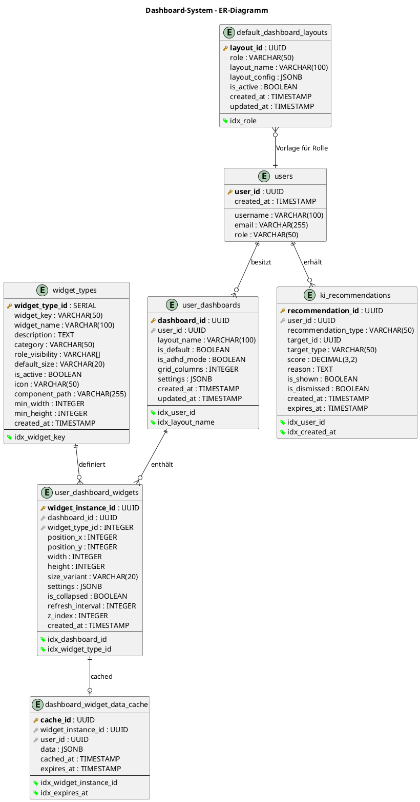
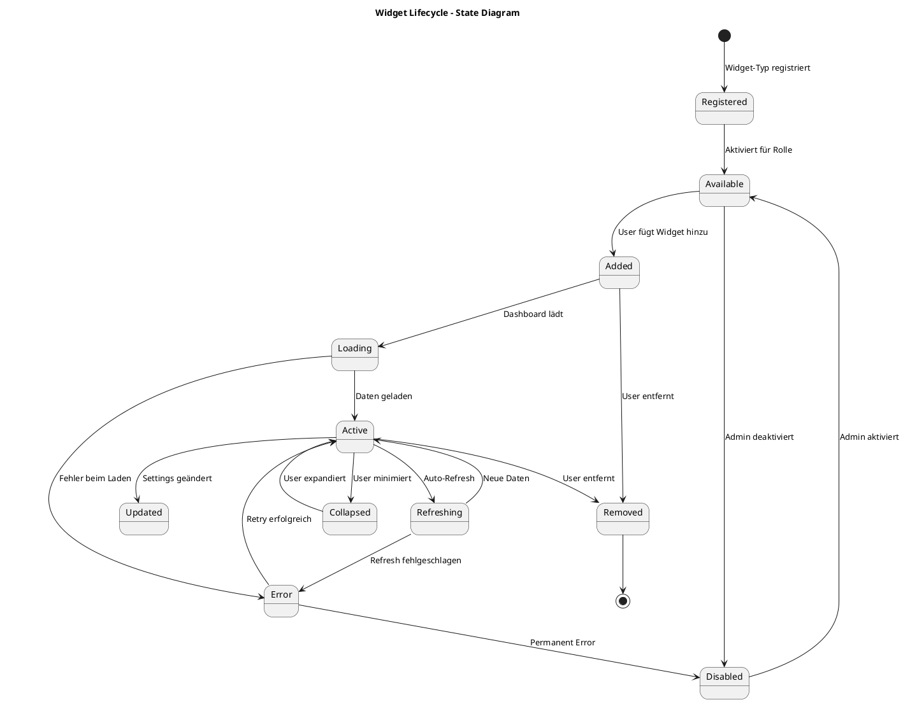
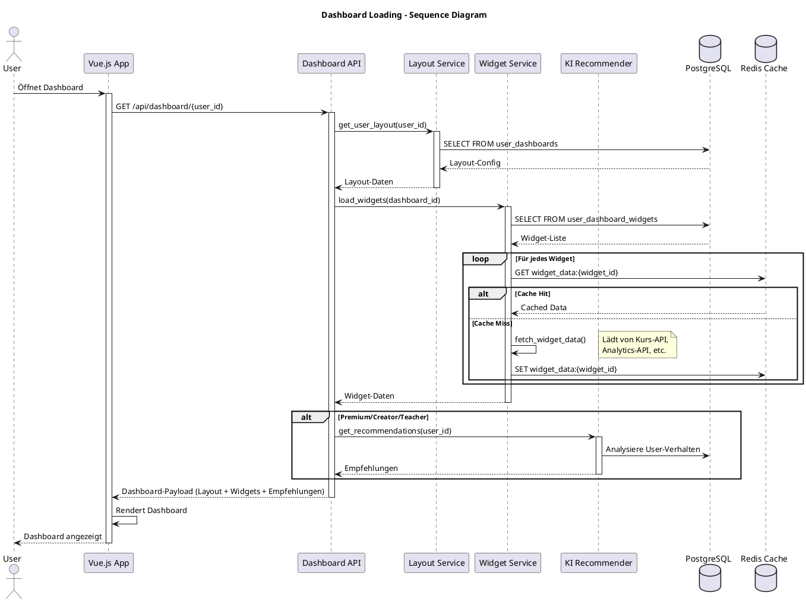
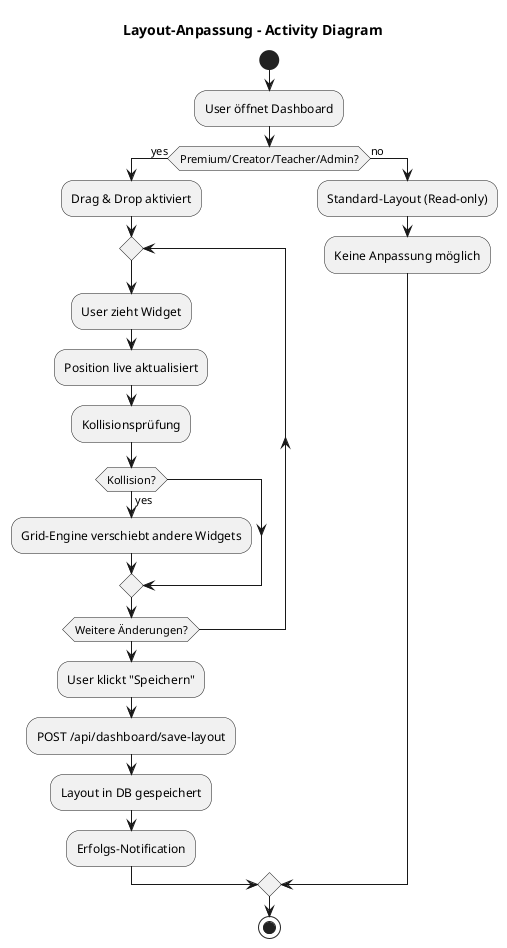
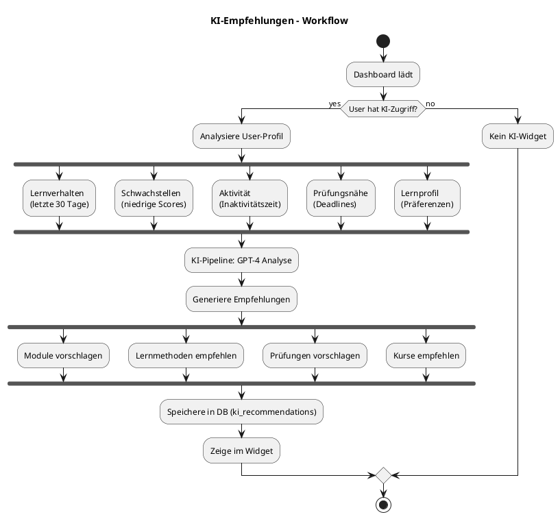
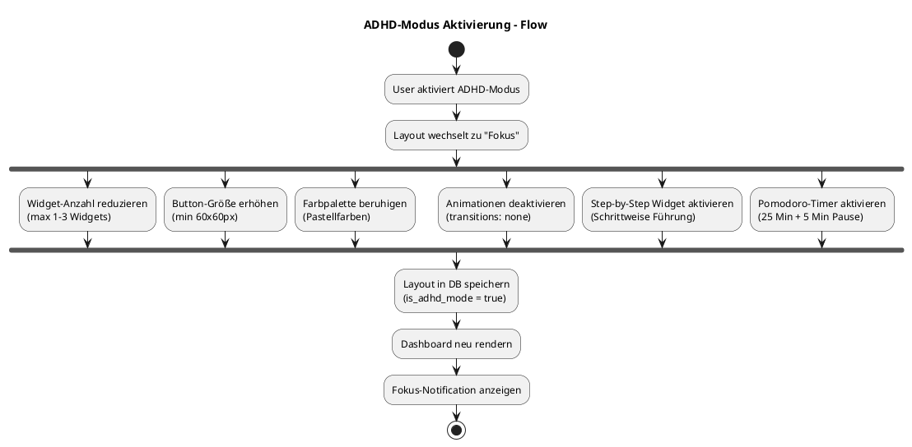
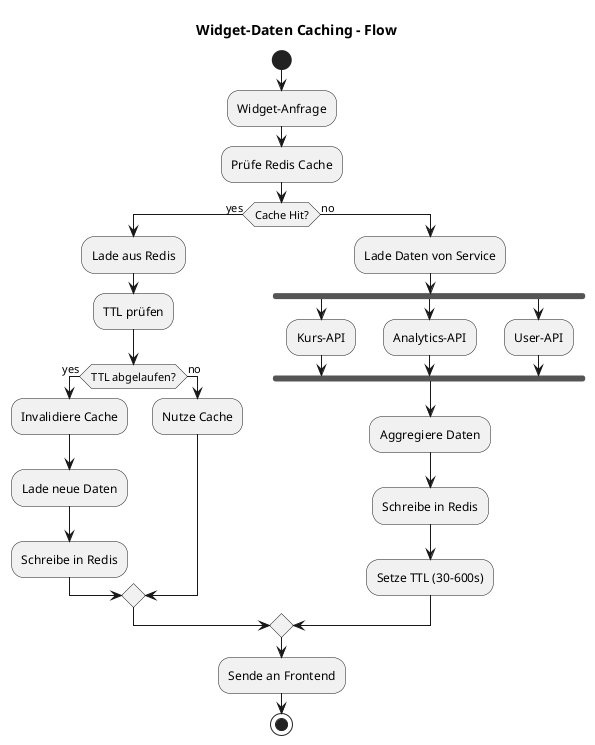
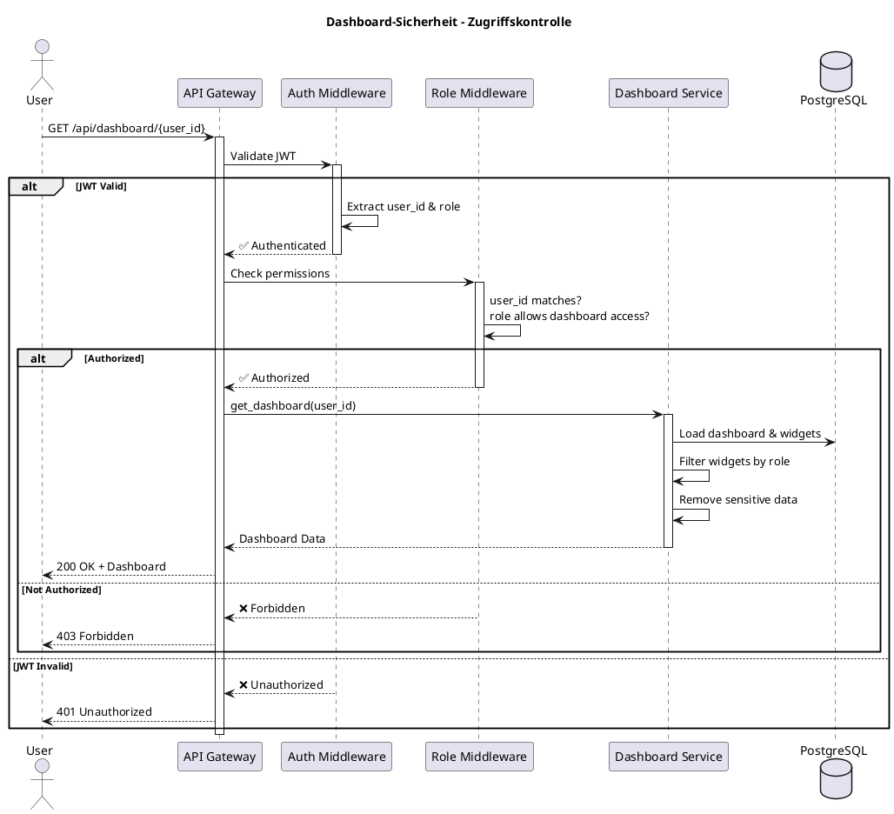

# 13 – Dashboard-System (Final)

**Version:** 1.0
**Stand:** Final

---

## Überblick

Das **Dashboard-System** ist das zentrale Kontrollzentrum des LSX-Lernsystems und dient als personalisiertes Einstiegsportal für alle Nutzerrollen.

### 🎯 Kernfunktionen

- 📊 **Personalisierte Informationen** – Rollenspezifische Widgets
- 🧩 **Modulares Widget-System** – 15+ vordefinierte Widget-Typen
- 🤖 **KI-Empfehlungen** – Intelligente Lernvorschläge
- 🎨 **Anpassbare Layouts** – Drag & Drop für Premium+
- 📬 **Systemmeldungen** – Notifications & Updates
- 🧠 **ADHD/ADHS-Modus** – Barrierefreie Fokus-Ansicht
- 👥 **Rollenbasierte Ansichten** – 9 verschiedene Dashboard-Varianten

---

## Systemarchitektur

### 🏗️ C4 Context Diagram

```plantuml
@startuml
!include https://raw.githubusercontent.com/plantuml-stdlib/C4-PlantUML/master/C4_Context.puml

LAYOUT_WITH_LEGEND()

title C4 Context - Dashboard-System im LSX-Ökosystem

Person(user, "LSX User", "Alle Nutzerrollen")
Person(admin, "Admin", "System Administrator")

System(dashboard, "Dashboard-System", "Zentrale Steuerungszentrale mit personalisierten Widgets und KI-Empfehlungen")

System_Ext(kurs_system, "Kurs-System", "Kurse, Module, Lernmethoden")
System_Ext(ki_pipeline, "KI-Pipeline", "Empfehlungen, Analysen")
System_Ext(user_system, "User-System", "Authentifizierung, Profile")
System_Ext(analytics, "Analytics-System", "Fortschritt, Statistiken")
System_Ext(liveroom, "LiveRoom-System", "WebRTC-Sessions")
System_Ext(notifications, "Notification-System", "Push, Email, In-App")
System_Ext(widget_registry, "Widget-Registry", "Widget-Definitionen")

Rel(user, dashboard, "Nutzt", "HTTPS")
Rel(admin, dashboard, "Verwaltet Layouts", "HTTPS")

Rel(dashboard, kurs_system, "Lädt Kurse/Module", "REST API")
Rel(dashboard, ki_pipeline, "Holt Empfehlungen", "gRPC")
Rel(dashboard, user_system, "Authentifiziert", "JWT")
Rel(dashboard, analytics, "Zeigt Fortschritt", "REST API")
Rel(dashboard, liveroom, "Startet Sessions", "WebSocket")
Rel(dashboard, notifications, "Zeigt Benachrichtigungen", "WebSocket")
Rel(dashboard, widget_registry, "Lädt Widget-Definitionen", "REST API")

@enduml
```

---

### 📦 C4 Container Diagram

```plantuml
@startuml
!include https://raw.githubusercontent.com/plantuml-stdlib/C4-PlantUML/master/C4_Container.puml

LAYOUT_WITH_LEGEND()

title C4 Container - Dashboard-System Komponenten

Person(user, "User", "Alle Rollen")

System_Boundary(dashboard_system, "Dashboard-System") {
    Container(web_app, "Dashboard Web App", "Vue.js 3, Pinia", "SPA mit Drag & Drop Grid")
    Container(dashboard_api, "Dashboard API", "Flask Blueprint", "REST API für Layouts & Widgets")
    Container(widget_service, "Widget Service", "Python", "Widget-Daten-Aggregation")
    Container(layout_service, "Layout Service", "Python", "Layout-Management")
    Container(ki_recommender, "KI-Recommender", "Python, GPT-4", "Personalisierte Empfehlungen")
    ContainerDb(dashboard_db, "Dashboard DB", "PostgreSQL", "Layouts, Widgets, Positionen")
    ContainerDb(cache, "Redis Cache", "Redis", "Widget-Daten, Sessions")
}

System_Ext(kurs_api, "Kurs-API")
System_Ext(analytics_api, "Analytics-API")
System_Ext(ki_pipeline, "KI-Pipeline")

Rel(user, web_app, "Nutzt", "HTTPS")
Rel(web_app, dashboard_api, "API Calls", "JSON/HTTPS")

Rel(dashboard_api, widget_service, "Lädt Widgets", "Function Call")
Rel(dashboard_api, layout_service, "Speichert/Lädt Layouts", "Function Call")
Rel(dashboard_api, ki_recommender, "Holt Empfehlungen", "Function Call")

Rel(widget_service, kurs_api, "Holt Kurse", "REST")
Rel(widget_service, analytics_api, "Holt Stats", "REST")
Rel(ki_recommender, ki_pipeline, "Analysiert User", "gRPC")

Rel(layout_service, dashboard_db, "Liest/Schreibt", "SQL")
Rel(widget_service, dashboard_db, "Liest Widgets", "SQL")
Rel(widget_service, cache, "Cached Daten", "Redis Protocol")

@enduml
```

---

## Datenbankmodell

### 🗄️ ER-Diagramm



**Kardinalitäten:**
- **1 User → N Dashboards** (Layouts: Standard, Fokus, Detail, etc.)
- **1 Dashboard → N Widgets** (Widget-Instanzen mit Positionen)
- **1 Widget-Type → N Widgets** (Wiederverwendbare Definitionen)
- **1 Widget → 0..1 Cache** (Optional gecachte Daten)
- **1 User → N KI-Recommendations** (Personalisierte Empfehlungen)

---

## Dashboard-Varianten

### 📊 Zwei Haupttypen

| Typ | Zugriff | Layout-Anpassung | Widget-Kontrolle | KI-Empfehlungen |
|-----|---------|------------------|------------------|-----------------|
| 🔒 **Standard Dashboard** | Free, Schulen, Unternehmen | ❌ Fest | ❌ Vordefiniert | ❌ Keine |
| 🎨 **Individuelles Dashboard** | Premium, Creator, Teacher, Admin | ✅ Drag & Drop | ✅ Hinzufügen/Entfernen | ✅ Aktiv |

---

### 🔒 Standard Dashboard

**Verfügbar für:** Free User, Schulen (Org-View), Unternehmen (Org-View)

#### Features

| Feature | Status |
|---------|--------|
| 📍 Feste Widget-Anordnung | ✅ |
| 🔒 Limitierte Widget-Auswahl | ✅ (5-8 Widgets) |
| 🚫 Keine Drag & Drop Funktion | ❌ |
| 🎯 Vordefiniertes Layout pro Rolle | ✅ |
| 🤖 Keine KI-Empfehlungen | ❌ |

#### Default Widgets für Free User

```
┌──────────────────────────────────────┐
│  📊 Fortschrittsanzeige               │
│  📚 Meine Kurse (max 5)               │
│  📝 Letzte Prüfungsergebnisse         │
│  📬 Benachrichtigungen                │
│  📖 Bibliothek                        │
└──────────────────────────────────────┘
```

---

### 🎨 Individuelles Dashboard

**Verfügbar für:** Premium, Creator, Lehrer, Admin

#### Features

| Feature | Status |
|---------|--------|
| 🔄 Drag & Drop Grid | ✅ |
| ➕ Widgets hinzufügen/entfernen | ✅ |
| 💾 Mehrere Layouts speicherbar | ✅ (bis zu 5) |
| 📏 Widget-Größen anpassbar | ✅ |
| 🤖 KI-basierte Layoutvorschläge | ✅ |
| 🎨 Custom Themes | ✅ |

#### Verfügbare Layout-Templates

| Layout | Beschreibung | Widgets |
|--------|-------------|---------|
| 🏠 **Standard** | Ausgewogene Übersicht | 8-12 |
| 🧠 **Fokus (ADHD)** | Reduzierte Ansicht | 1-3 |
| 📊 **Detail** | Alle Statistiken | 12-15 |
| 🎨 **Creator** | Analytics-fokussiert | 10-14 |
| 📝 **Prüfung** | Prüfungsvorbereitung | 6-8 |

---

## Widget-System

### 🧩 Standard-Widgets (15 Typen)

```plantuml
@startuml
!include https://raw.githubusercontent.com/plantuml-stdlib/C4-PlantUML/master/C4_Component.puml

title Widget-Typen im Dashboard-System

Component(w1, "📊 Fortschritt-Widget", "Lernfortschritt visualisieren")
Component(w2, "📚 Meine Kurse", "Aktive Kurse anzeigen")
Component(w3, "🤖 KI-Empfehlungen", "Personalisierte Vorschläge")
Component(w4, "💰 Tokenstatus", "Token-Verbrauch & Guthaben")
Component(w5, "🎥 LiveRoom-Widget", "Schnellstart LiveRooms")
Component(w6, "✅ Aufgaben", "To-Do-Liste & Deadlines")
Component(w7, "📝 Prüfungen", "Anstehende & abgeschlossene Tests")
Component(w8, "📊 Analytics", "Creator/Teacher Analytics")
Component(w9, "💰 Einnahmen", "Creator Revenue Tracking")
Component(w10, "👥 Klassenübersicht", "Teacher: Klassen-Management")
Component(w11, "🏫 Organisation", "Schulen/Unternehmen Dashboard")
Component(w12, "📬 Benachrichtigungen", "System-Notifications")
Component(w13, "📖 Bibliothek", "Gespeicherte Inhalte")
Component(w14, "🎯 Lernstreak", "Tägliche Aktivität")
Component(w15, "🖥️ System-Status", "Admin: Server-Health")

@enduml
```

---

### 📋 Widget-Typen im Detail

| Nr. | Widget | Kategorie | Rollen | Größe | Refresh | KI |
|-----|--------|-----------|--------|-------|---------|-----|
| 1 | **Fortschritt** | Lernen | Alle | Medium | 60s | ❌ |
| 2 | **Meine Kurse** | Lernen | Alle | Large | 120s | ❌ |
| 3 | **KI-Empfehlungen** | KI | Premium+ | Large | 300s | ✅ |
| 4 | **Tokenstatus** | Account | Premium+ | Small | 30s | ❌ |
| 5 | **LiveRoom** | Kommunikation | Premium+ | Medium | Real-time | ❌ |
| 6 | **Aufgaben** | Lernen | Alle | Medium | 60s | ❌ |
| 7 | **Prüfungen** | Lernen | Alle | Medium | 120s | ❌ |
| 8 | **Analytics** | Creator | Creator, Teacher | XLarge | 300s | ✅ |
| 9 | **Einnahmen** | Creator | Creator | Large | 600s | ❌ |
| 10 | **Klassenübersicht** | Teacher | Teacher, School | XLarge | 180s | ❌ |
| 11 | **Organisation** | Organisation | School, Company | XLarge | 300s | ❌ |
| 12 | **Benachrichtigungen** | System | Alle | Small | Real-time | ❌ |
| 13 | **Bibliothek** | Lernen | Alle | Medium | 180s | ❌ |
| 14 | **Lernstreak** | Gamification | Alle | Small | 600s | ❌ |
| 15 | **System-Status** | Admin | Admin | XLarge | 10s | ❌ |

**Widget-Größen:**
- **Small:** 1x1 Grid (300x300px)
- **Medium:** 2x1 Grid (600x300px)
- **Large:** 2x2 Grid (600x600px)
- **XLarge:** 3x2 oder 4x2 Grid (900x600px / 1200x600px)

---

### 🔄 Widget Lifecycle



---

## Dashboard Loading Workflow

### 🔄 Sequenzdiagramm



---

## Layout-Anpassung Workflow

### 🎨 Drag & Drop Flow



---

## Rollenspezifische Dashboards

### 👥 Dashboard-Ansichten pro Rolle

#### 🆓 Free User Dashboard

**Widgets (Read-only):**

```
┌─────────────────────────────────────────────┐
│ 📊 Fortschritt         📚 Meine Kurse        │
├─────────────────────────────────────────────┤
│ 📝 Prüfungen           📬 Benachrichtigungen │
├─────────────────────────────────────────────┤
│ 📖 Bibliothek          🎯 Lernstreak         │
└─────────────────────────────────────────────┘
```

**Einschränkungen:**
- ❌ Keine KI-Empfehlungen
- ❌ Kein Token-Widget
- ❌ Keine Layoutanpassung
- ❌ Kein LiveRoom-Widget

---

#### 💎 Premium User Dashboard

**Widgets (Anpassbar):**

```
┌─────────────────────────────────────────────────┐
│ 🤖 KI-Empfehlungen           📊 Fortschritt     │
├─────────────────────────────────────────────────┤
│ 💰 Tokenstatus  🎥 LiveRoom  📚 Meine Kurse     │
├─────────────────────────────────────────────────┤
│ ✅ Aufgaben                  📝 Prüfungen       │
├─────────────────────────────────────────────────┤
│ 📬 Benachrichtigungen        🎯 Lernstreak      │
└─────────────────────────────────────────────────┘
```

**Features:**
- ✅ KI-Empfehlungen aktiv
- ✅ Token-Verwaltung
- ✅ LiveRoom Basic
- ✅ Drag & Drop Layout

---

#### 🎨 Creator Dashboard

**Spezielle Widgets:**

| Widget | Beschreibung | Datenquelle |
|--------|-------------|-------------|
| 📊 **Creator Analytics** | Kursperformance, Verkäufe, Bewertungen | Analytics-API |
| 💰 **Einnahmen-Widget** | Revenue, Transaktionen, Auszahlungen | Billing-API |
| 📝 **Kursstatus** | Draft/Published/Review Status | Course-API |
| ⭐ **Bewertungstrends** | Rating-Entwicklung pro Kurs | Review-API |
| 📈 **Traffic-Statistiken** | Page-Views, Enrollments | Analytics-API |

**Dashboard-Layout:**

```
┌────────────────────────────────────────────────────────┐
│ 📊 Creator Analytics (XLarge)                          │
├────────────────────────────┬───────────────────────────┤
│ 💰 Einnahmen               │ 📝 Kursstatus             │
├────────────────────────────┼───────────────────────────┤
│ ⭐ Bewertungstrends        │ 📈 Traffic-Statistiken    │
├────────────────────────────┴───────────────────────────┤
│ 🤖 KI-Empfehlungen (Content-Optimierung)              │
└────────────────────────────────────────────────────────┘
```

---

#### 👨‍🏫 Lehrer/Dozenten Dashboard

**Spezielle Widgets:**

| Widget | Beschreibung | Funktion |
|--------|-------------|----------|
| 👥 **Klassenübersicht** | Alle Klassen mit Schüleranzahl | Klassen-Management |
| 📊 **Schülerleistung** | Fortschritt, Tests, Noten | Performance-Tracking |
| 🎥 **LiveRoom-Start** | Schnellzugriff auf LiveRoom Pro | Session-Steuerung |
| 📝 **Prüfungspläne** | Anstehende Tests, Deadlines | Exam-Management |
| 🏫 **Gruppenmanagement** | Private Gruppen verwalten | Gruppen-Admin |

**Dashboard-Layout:**

```
┌────────────────────────────────────────────────────────┐
│ 👥 Klassenübersicht (XLarge)                           │
├────────────────────────────┬───────────────────────────┤
│ 📊 Schülerleistung         │ 🎥 LiveRoom-Start         │
├────────────────────────────┼───────────────────────────┤
│ 📝 Prüfungspläne           │ 🏫 Gruppenmanagement      │
├────────────────────────────┴───────────────────────────┤
│ 🤖 KI-Empfehlungen (Schwachstellen-Analyse)           │
└────────────────────────────────────────────────────────┘
```

---

#### 🏫 Schulen Dashboard

**Organisation-Widgets:**

| Widget | Beschreibung | Funktion |
|--------|-------------|----------|
| 🏢 **Organisation Dashboard** | Zentrale Übersicht (Schüler, Lehrer, Klassen) | Org-Management |
| 🎓 **Aktive Klassen** | Klassen-Liste mit Lehreranzahl | Klassen-Admin |
| 👨‍🏫 **Lehrerrollen** | Personal-Übersicht, Zugriffsrechte | User-Management |
| 💰 **Tokenpool** | Budget-Tracking, Verbrauch pro Klasse | Token-Verwaltung |
| 💳 **Rechnungsübersicht** | Billing, Zahlungen, Lizenzen | Billing-Dashboard |

---

#### 🏢 Unternehmen Dashboard

**Enterprise-Widgets:**

| Widget | Beschreibung | Funktion |
|--------|-------------|----------|
| 📈 **Mitarbeiterfortschritt** | Employee-Progress, Skills | HR-Analytics |
| 🏢 **Abteilungsübersicht** | Department-View, Zuordnungen | Org-Structure |
| 🎯 **Skillprofile** | Kompetenz-Matrix, Zertifizierungen | Skill-Management |
| 💰 **Tokenpool** | Budget-Management, Abteilungszuteilung | Token-Admin |
| 💳 **Rechnungs-Widget** | Billing-Overview, Kostenverursacher | Billing-Dashboard |

---

#### 👮 Admin Dashboard

**System-Management-Widgets:**

| Widget | Beschreibung | Funktion |
|--------|-------------|----------|
| 🖥️ **Systemstatus** | Server-Health, CPU, RAM, Disk | Monitoring |
| 📋 **Logs** | System-Logs, Error-Logs | Debugging |
| 📊 **Monitoring** | Performance-Tracking, API-Response-Times | Performance |
| 👥 **Userverwaltung** | User-Management, Rollenzuweisung | User-Admin |
| 🧩 **Widget-Registry** | Widget-Verwaltung, Aktivierung | Widget-Admin |
| 🔐 **Rollenmanagement** | Permissions, Feature-Flags | Security |

---

## KI-Empfehlungssystem

### 🤖 KI-Recommendation Workflow



---

### 📊 KI basiert auf

| Faktor | Gewichtung | Datenquelle | Beispiel |
|--------|-----------|-------------|----------|
| 📚 **Lernverhalten** | 30% | user_activity | Letzte 7 Tage inaktiv → Wiederholung vorschlagen |
| ⚠️ **Schwächen** | 25% | quiz_results | Mathe-Score < 60% → Mathe-Module empfehlen |
| ⏱️ **Inaktivität** | 15% | last_login | 14 Tage inaktiv → Erinnerung + einfaches Modul |
| 📝 **Prüfungsnähe** | 20% | exam_deadlines | Prüfung in 7 Tagen → Prüfungssimulation |
| 🎯 **Lernprofil** | 10% | user_preferences | Präferiert Videos → Video-Content vorschlagen |

**KI-Recommendation-Schema:**

```json
{
  "recommendation_id": "uuid",
  "user_id": "uuid",
  "recommendation_type": "module",
  "target_id": "module-uuid",
  "target_type": "module",
  "score": 0.89,
  "reason": "Niedrige Mathematik-Scores erkannt. Dieses Modul hilft bei Grundlagen.",
  "is_shown": false,
  "is_dismissed": false,
  "created_at": "2024-11-14T10:30:00Z",
  "expires_at": "2024-11-21T10:30:00Z"
}
```

---

## ADHD/ADHS-Modus

### 🧠 Fokus-Dashboard



---

### ⚙️ ADHD-Modus Features im Detail

| Feature | Beschreibung | Technische Umsetzung |
|---------|-------------|---------------------|
| 📉 **Reduzierte Ansicht** | Nur 1-3 Widgets gleichzeitig | Grid: 1x1 oder 2x1 max |
| 🔘 **Große Buttons** | Mindestgröße 60x60px | CSS: min-width/height |
| 🎨 **Ruhige Farbpalette** | Pastellfarben, weniger Kontrast | CSS: custom color scheme |
| 🚫 **Weniger Animationen** | Keine Transitions, Fades | CSS: transition: none |
| 🎯 **Step-by-Step Widget** | Schrittweise Aufgabenführung | Vue.js Component |
| ⏱️ **Pomodoro-Timer** | 25 Min Arbeiten + 5 Min Pause | Timer-Widget mit Notification |
| 📚 **Ein Modul-Fokus** | Nur aktuelles Modul sichtbar | Filter auf course_module |

**ADHD-Layout-Beispiel:**

```
┌──────────────────────────────┐
│                              │
│   🎯 Aktuelles Modul         │
│                              │
│   [Weiter]                   │
│                              │
├──────────────────────────────┤
│                              │
│   ⏱️ Pomodoro-Timer          │
│      25:00                   │
│                              │
│   [Start]                    │
│                              │
└──────────────────────────────┘
```

---

## Performance & Caching

### ⚡ Caching-Strategie



---

### 📊 Cache-TTL pro Widget-Typ

| Widget | TTL | Grund |
|--------|-----|-------|
| Fortschritt | 60s | Ändert sich moderat |
| Meine Kurse | 120s | Relativ stabil |
| KI-Empfehlungen | 300s | Rechenintensiv |
| Tokenstatus | 30s | Hochdynamisch |
| LiveRoom | Real-time | WebSocket |
| Aufgaben | 60s | Ändert sich moderat |
| Prüfungen | 120s | Relativ stabil |
| Analytics | 300s | Rechenintensiv |
| Einnahmen | 600s | Täglich aktualisiert |
| Klassenübersicht | 180s | Moderate Änderungen |
| Organisation | 300s | Selten geändert |
| Benachrichtigungen | Real-time | WebSocket |
| Bibliothek | 180s | Relativ stabil |
| Lernstreak | 600s | Täglich aktualisiert |
| System-Status | 10s | Hochdynamisch |

---

## API-Dokumentation

### 🔌 Dashboard-Endpoints

#### 1. Dashboard laden

```http
GET /api/dashboard/{user_id}
Authorization: Bearer {jwt_token}
```

**Response:**

```json
{
  "dashboard_id": "uuid",
  "user_id": "uuid",
  "layout_name": "Standard",
  "is_default": true,
  "is_adhd_mode": false,
  "grid_columns": 12,
  "widgets": [
    {
      "widget_instance_id": "uuid",
      "widget_type_id": 1,
      "widget_key": "progress",
      "position_x": 0,
      "position_y": 0,
      "width": 2,
      "height": 1,
      "size_variant": "medium",
      "is_collapsed": false,
      "data": {
        "total_progress": 67,
        "courses_active": 3,
        "modules_completed": 15
      }
    }
  ],
  "recommendations": [
    {
      "recommendation_id": "uuid",
      "recommendation_type": "module",
      "target_id": "module-uuid",
      "score": 0.89,
      "reason": "Niedrige Mathe-Scores"
    }
  ]
}
```

---

#### 2. Layout speichern

```http
POST /api/dashboard/save-layout
Authorization: Bearer {jwt_token}
Content-Type: application/json
```

**Request Body:**

```json
{
  "layout_name": "Fokus",
  "is_adhd_mode": true,
  "widgets": [
    {
      "widget_type_id": 3,
      "position_x": 0,
      "position_y": 0,
      "width": 4,
      "height": 2,
      "size_variant": "xlarge",
      "settings": {
        "show_details": true
      }
    }
  ]
}
```

**Response:**

```json
{
  "status": "success",
  "dashboard_id": "uuid",
  "message": "Layout gespeichert"
}
```

---

#### 3. Widget hinzufügen

```http
POST /api/dashboard/add-widget
Authorization: Bearer {jwt_token}
Content-Type: application/json
```

**Request Body:**

```json
{
  "dashboard_id": "uuid",
  "widget_type_id": 5,
  "position_x": 4,
  "position_y": 2,
  "width": 2,
  "height": 1,
  "size_variant": "medium"
}
```

**Response:**

```json
{
  "status": "success",
  "widget_instance_id": "uuid"
}
```

---

#### 4. Widget entfernen

```http
DELETE /api/dashboard/widget/{widget_instance_id}
Authorization: Bearer {jwt_token}
```

**Response:**

```json
{
  "status": "success",
  "message": "Widget entfernt"
}
```

---

#### 5. Widget-Daten aktualisieren

```http
GET /api/dashboard/widget/{widget_instance_id}/refresh
Authorization: Bearer {jwt_token}
```

**Response:**

```json
{
  "widget_instance_id": "uuid",
  "data": {
    "updated_at": "2024-11-14T11:00:00Z",
    "payload": { }
  }
}
```

---

#### 6. Default-Layout laden

```http
GET /api/dashboard/default/{role}
Authorization: Bearer {jwt_token}
```

**Beispiel:** `GET /api/dashboard/default/premium`

**Response:**

```json
{
  "layout_id": "uuid",
  "role": "premium",
  "layout_name": "Premium Standard",
  "layout_config": {
    "grid_columns": 12,
    "widgets": [ ]
  }
}
```

---

#### 7. ADHD-Modus aktivieren

```http
POST /api/dashboard/toggle-adhd-mode
Authorization: Bearer {jwt_token}
Content-Type: application/json
```

**Request Body:**

```json
{
  "is_adhd_mode": true
}
```

**Response:**

```json
{
  "status": "success",
  "is_adhd_mode": true,
  "message": "ADHD-Modus aktiviert"
}
```

---

#### 8. KI-Empfehlungen laden

```http
GET /api/dashboard/recommendations/{user_id}
Authorization: Bearer {jwt_token}
```

**Query Parameters:**
- `limit` (optional, default: 10)
- `type` (optional: module, course, exam, method)

**Response:**

```json
{
  "recommendations": [
    {
      "recommendation_id": "uuid",
      "recommendation_type": "module",
      "target_id": "module-uuid",
      "target_name": "Grundlagen Mathematik",
      "score": 0.89,
      "reason": "Niedrige Scores in Mathematik-Modulen",
      "created_at": "2024-11-14T10:00:00Z",
      "expires_at": "2024-11-21T10:00:00Z"
    }
  ]
}
```

---

#### 9. Empfehlung ablehnen

```http
POST /api/dashboard/recommendations/{recommendation_id}/dismiss
Authorization: Bearer {jwt_token}
```

**Response:**

```json
{
  "status": "success",
  "message": "Empfehlung abgelehnt"
}
```

---

#### 10. Widget-Typen abrufen

```http
GET /api/dashboard/widget-types
Authorization: Bearer {jwt_token}
```

**Query Parameters:**
- `role` (optional: free, premium, creator, teacher, etc.)

**Response:**

```json
{
  "widget_types": [
    {
      "widget_type_id": 1,
      "widget_key": "progress",
      "widget_name": "Fortschritt",
      "description": "Lernfortschritt visualisieren",
      "category": "learning",
      "role_visibility": ["free", "premium", "creator", "teacher"],
      "default_size": "medium",
      "is_active": true,
      "icon": "📊",
      "min_width": 2,
      "min_height": 1
    }
  ]
}
```

---

#### 11. Layouts auflisten

```http
GET /api/dashboard/layouts
Authorization: Bearer {jwt_token}
```

**Response:**

```json
{
  "layouts": [
    {
      "dashboard_id": "uuid",
      "layout_name": "Standard",
      "is_default": true,
      "is_adhd_mode": false,
      "widget_count": 8,
      "created_at": "2024-10-01T08:00:00Z",
      "updated_at": "2024-11-10T12:30:00Z"
    },
    {
      "dashboard_id": "uuid",
      "layout_name": "Fokus",
      "is_default": false,
      "is_adhd_mode": true,
      "widget_count": 3,
      "created_at": "2024-11-01T14:00:00Z",
      "updated_at": "2024-11-12T09:15:00Z"
    }
  ]
}
```

---

#### 12. Layout wechseln

```http
POST /api/dashboard/switch-layout
Authorization: Bearer {jwt_token}
Content-Type: application/json
```

**Request Body:**

```json
{
  "dashboard_id": "uuid"
}
```

**Response:**

```json
{
  "status": "success",
  "dashboard_id": "uuid",
  "layout_name": "Fokus"
}
```

---

#### 13. Layout löschen

```http
DELETE /api/dashboard/layout/{dashboard_id}
Authorization: Bearer {jwt_token}
```

**Response:**

```json
{
  "status": "success",
  "message": "Layout gelöscht"
}
```

---

#### 14. Widget-Settings aktualisieren

```http
PATCH /api/dashboard/widget/{widget_instance_id}/settings
Authorization: Bearer {jwt_token}
Content-Type: application/json
```

**Request Body:**

```json
{
  "settings": {
    "show_details": true,
    "chart_type": "bar",
    "time_range": "30d"
  }
}
```

**Response:**

```json
{
  "status": "success",
  "widget_instance_id": "uuid",
  "settings": { }
}
```

---

#### 15. Admin: Widget-Typ registrieren

```http
POST /api/admin/widget-types
Authorization: Bearer {jwt_token}
Content-Type: application/json
```

**Request Body:**

```json
{
  "widget_key": "custom_widget",
  "widget_name": "Custom Widget",
  "description": "Ein benutzerdefiniertes Widget",
  "category": "custom",
  "role_visibility": ["admin"],
  "default_size": "medium",
  "is_active": true,
  "icon": "🧩",
  "component_path": "/widgets/CustomWidget.vue",
  "min_width": 2,
  "min_height": 1
}
```

**Response:**

```json
{
  "status": "success",
  "widget_type_id": 16,
  "message": "Widget-Typ registriert"
}
```

---

## Code-Beispiele

### 🐍 Python: Dashboard Service

```python
# dashboard_service.py

from typing import Dict, Optional
from app.repositories.dashboard_repository import DashboardRepository
from app.models.dashboard import DashboardLayout, DashboardWidgetInstance, get_default_layout_for_role

class DashboardService:
    """
    Dashboard service layer

    Implements business logic for dashboard operations using pure psycopg3
    """

    # Roles that can customize their dashboard
    CUSTOMIZABLE_ROLES = [
        'premium', 'creator', 'teacher',
        'school_admin', 'company_admin',
        'admin', 'superadmin'
    ]

    # Roles that cannot customize (use fixed defaults)
    FIXED_ROLES = ['user', 'moderator', 'support']

    @classmethod
    def get_effective_layout(cls, user: Dict) -> DashboardLayout:
        """
        Get effective dashboard layout for user

        Logic:
        1. Try to load user's custom layout from DB
        2. If not found, return default layout for user's role
        3. Default layouts are defined in dashboard.py models
        """
        user_id = user['user_id']
        role = user.get('role', 'user')

        # Try to load custom layout
        db_layout = DashboardRepository.get_user_layout(user_id)

        if db_layout:
            # User has custom layout - convert from DB format
            layout_json = db_layout['layout_json']

            widgets = [
                DashboardWidgetInstance(**widget_data)
                for widget_data in layout_json.get('widgets', [])
            ]

            return DashboardLayout(
                userId=user_id,
                role=role,
                widgets=widgets,
                presetId=layout_json.get('presetId'),
                updatedAt=db_layout['updated_at'].isoformat() if db_layout.get('updated_at') else None,
                version=layout_json.get('version', 1),
                source=db_layout.get('source', 'user'),
                isDefault=db_layout.get('is_default', False)
            )
        else:
            # No custom layout - return role default
            return get_default_layout_for_role(user_id, role)

    @classmethod
    def save_layout(cls, user: Dict, layout: DashboardLayout) -> DashboardLayout:
        """
        Save user's dashboard layout

        Permission checks:
        - Only customizable roles can save layouts
        - Free users get 403
        """
        user_id = user['user_id']
        role = user.get('role', 'user')

        # Permission check
        if not cls.can_customize_dashboard(role):
            raise PermissionError(
                f"Role '{role}' cannot customize dashboard. "
                f"Upgrade to Premium or higher to customize your dashboard."
            )

        # Build layout JSON for storage
        layout_json = {
            'widgets': [widget.model_dump() for widget in layout.widgets],
            'presetId': layout.presetId,
            'version': layout.version or 1
        }

        # Save to database using pure psycopg3
        db_result = DashboardRepository.save_user_layout(
            user_id=user_id,
            role=role,
            layout_json=layout_json,
            organisation_id=user.get('organisation_id'),
            source='user'
        )

        # Convert back to DashboardLayout
        saved_layout_json = db_result['layout_json']
        widgets = [
            DashboardWidgetInstance(**widget_data)
            for widget_data in saved_layout_json.get('widgets', [])
        ]

        return DashboardLayout(
            userId=user_id,
            role=role,
            widgets=widgets,
            presetId=saved_layout_json.get('presetId'),
            updatedAt=db_result['updated_at'].isoformat() if db_result.get('updated_at') else None,
            version=saved_layout_json.get('version', 1),
            source=db_result.get('source', 'user'),
            isDefault=False
        )

    @classmethod
    def can_customize_dashboard(cls, role: str) -> bool:
        """Check if role can customize dashboard"""
        return role in cls.CUSTOMIZABLE_ROLES
```

---

### 🎨 Vue.js: Dashboard Component

```vue
<!-- Dashboard.vue -->

<template>
  <div class="dashboard-container">
    <DashboardHeader
      :layouts="layouts"
      :current-layout="currentLayout"
      @switch-layout="switchLayout"
      @toggle-adhd="toggleADHDMode"
    />

    <GridLayout
      v-model:layout="widgetLayout"
      :col-num="12"
      :row-height="100"
      :is-draggable="isDraggable"
      :is-resizable="isResizable"
      :vertical-compact="true"
      :use-css-transforms="true"
      @layout-updated="saveLayout"
    >
      <GridItem
        v-for="widget in widgets"
        :key="widget.widget_instance_id"
        :x="widget.position_x"
        :y="widget.position_y"
        :w="widget.width"
        :h="widget.height"
        :i="widget.widget_instance_id"
      >
        <WidgetContainer
          :widget="widget"
          :is-collapsed="widget.is_collapsed"
          @refresh="refreshWidget"
          @remove="removeWidget"
          @toggle-collapse="toggleCollapse"
        />
      </GridItem>
    </GridLayout>

    <AddWidgetButton
      v-if="canCustomize"
      @add="showWidgetPicker"
    />
  </div>
</template>

<script setup lang="ts">
import { ref, computed, onMounted } from 'vue'
import { useDashboardStore } from '@/stores/dashboard'
import { GridLayout, GridItem } from 'vue-grid-layout'
import DashboardHeader from '@/components/dashboard/DashboardHeader.vue'
import WidgetContainer from '@/components/widgets/WidgetContainer.vue'
import AddWidgetButton from '@/components/dashboard/AddWidgetButton.vue'

const dashboardStore = useDashboardStore()

const widgets = ref([])
const layouts = ref([])
const currentLayout = ref('Standard')

const isDraggable = computed(() => {
  return dashboardStore.userRole !== 'free' &&
         dashboardStore.userRole !== 'school' &&
         dashboardStore.userRole !== 'company'
})

const isResizable = computed(() => isDraggable.value)
const canCustomize = computed(() => isDraggable.value)

const widgetLayout = computed({
  get: () => widgets.value.map(w => ({
    x: w.position_x,
    y: w.position_y,
    w: w.width,
    h: w.height,
    i: w.widget_instance_id
  })),
  set: (newLayout) => {
    // Update widget positions
    newLayout.forEach(item => {
      const widget = widgets.value.find(w => w.widget_instance_id === item.i)
      if (widget) {
        widget.position_x = item.x
        widget.position_y = item.y
        widget.width = item.w
        widget.height = item.h
      }
    })
  }
})

onMounted(async () => {
  await loadDashboard()
  await loadLayouts()

  // WebSocket für Real-time Widgets
  dashboardStore.connectWebSocket()
})

async function loadDashboard() {
  const data = await dashboardStore.fetchDashboard()
  widgets.value = data.widgets
  currentLayout.value = data.layout_name
}

async function loadLayouts() {
  layouts.value = await dashboardStore.fetchLayouts()
}

async function switchLayout(layoutName: string) {
  await dashboardStore.switchLayout(layoutName)
  await loadDashboard()
}

async function saveLayout() {
  await dashboardStore.saveLayout({
    layout_name: currentLayout.value,
    widgets: widgets.value
  })
}

async function refreshWidget(widgetId: string) {
  const data = await dashboardStore.refreshWidget(widgetId)
  const widget = widgets.value.find(w => w.widget_instance_id === widgetId)
  if (widget) {
    widget.data = data
  }
}

async function removeWidget(widgetId: string) {
  await dashboardStore.removeWidget(widgetId)
  widgets.value = widgets.value.filter(w => w.widget_instance_id !== widgetId)
}

function toggleCollapse(widgetId: string) {
  const widget = widgets.value.find(w => w.widget_instance_id === widgetId)
  if (widget) {
    widget.is_collapsed = !widget.is_collapsed
  }
}

function toggleADHDMode() {
  dashboardStore.toggleADHDMode()
  loadDashboard()
}

function showWidgetPicker() {
  // Zeige Modal mit verfügbaren Widgets
}
</script>

<style scoped>
.dashboard-container {
  width: 100%;
  min-height: 100vh;
  padding: 20px;
  background: #f5f5f5;
}
</style>
```

---

## Sicherheit

### 🔒 Sicherheitsmechanismen



---

### 🛡️ Sicherheitsregeln

| Regel | Beschreibung | Implementierung |
|-------|-------------|-----------------|
| 🔐 **JWT-Authentication** | Alle Requests benötigen gültiges JWT | `@jwt_required()` Decorator |
| 👤 **User-Ownership** | User darf nur eigenes Dashboard laden | `if user_id != jwt_user_id: raise Forbidden` |
| 🎫 **Rollenbasierte Widgets** | Widgets werden nach Rolle gefiltert | `widget.role_visibility.contains(user.role)` |
| 🔒 **Sensitive Daten** | Passwörter, Tokens werden ausgeblendet | Data-Sanitization |
| 🏢 **Organisation-Scope** | Org-Daten nur innerhalb Org sichtbar | `if user.org_id != data.org_id: filter` |
| 🚫 **Rate-Limiting** | Max 60 Requests/Minute pro User | Redis-basiertes Rate-Limiting |

---

## Zusammenfassung

### ✅ Dashboard-System Features

| Feature | Status | Beschreibung |
|---------|--------|-------------|
| 🧩 **Modulares Widget-System** | ✅ | 15+ vordefinierte Widget-Typen |
| 🎨 **Personalisierbar** | ✅ | Drag & Drop für Premium+ |
| 👥 **Rollenbasiert** | ✅ | 9 verschiedene Dashboard-Varianten |
| 🤖 **KI-integriert** | ✅ | Personalisierte Empfehlungen für Premium+ |
| 🧠 **ADHD-Modus** | ✅ | Barrierefreie Fokus-Ansicht |
| 🔌 **API-gesteuert** | ✅ | 15+ REST-Endpoints |
| 🔄 **Erweiterbar** | ✅ | Admin kann neue Widget-Typen registrieren |
| ⚡ **Performance** | ✅ | Redis-Caching, TTL-basiert |
| 🔒 **Sicherheit** | ✅ | JWT, Rollenfilter, Data-Sanitization |

---

### 💡 Kernaussage

> Das Dashboard ist das **zentrale Einstiegsportal** des LSX-Systems und bietet eine **rollenspezifische, personalisierbare und KI-gestützte** Übersicht für alle Nutzer.

---

### 🎯 Vorteile auf einen Blick

```
┌─────────────────────────────────────────┐
│  📊 Zentrale Übersicht für alle Rollen  │
│  🎨 Individuell anpassbar (Premium+)    │
│  🤖 KI-gestützte Empfehlungen           │
│  👥 9 rollenspezifische Varianten       │
│  🧠 Barrierefrei mit ADHD-Modus         │
│  ⚡ Schneller Zugriff auf Funktionen    │
│  🔄 Echtzeit-Updates via WebSocket      │
│  🔒 Sicher durch JWT & Rollenfilter     │
└─────────────────────────────────────────┘
```

---

## 📌 Dokument abgeschlossen

**Version:** 1.0
**Status:** Final
**Letzte Aktualisierung:** November 2024

---

> 💡 **Hinweis:** Dieses Dokument beschreibt das Dashboard-System als zentrale Steuerungszentrale für alle Nutzerrollen im LSX-Lernsystem. Es bildet die Grundlage für Frontend-Entwicklung (Vue.js), Backend-API (Flask), Datenbank-Design (PostgreSQL) und Caching-Strategien (Redis).
