# 14 – DB-Struktur (Final)

**Version:** 1.0  
**Stand:** Final

---

## Überblick

Dieses Dokument definiert die vollständige Datenbankstruktur des LSX Lernsystems.

Die Struktur ist **modular**, **skalierbar** und unterstützt:

- 👥 Rollen & Berechtigungen
- 📚 Kurse, Module, Lernmethoden (32 Stück, LM00–LM31)
- 🤖 KI-Generierung & Tokenverbrauch
- 🌐 Community, Creator & Academy
- 🏫 Schulen, Unternehmen, Lehrer, Dozenten
- 📊 Dashboard & Widgets
- 🎥 LiveRooms
- 🌍 Global Publishing (Mehrsprachigkeit)
- 💰 Zahlungs- & Abrechnungssystem

> Die Datenbank ist **relational aufgebaut** (PostgreSQL) mit **JSON-Feldern** für flexible Strukturen.

---

## 1. Übersicht der Haupttabellen

### 🗄️ 13 Kernbereiche

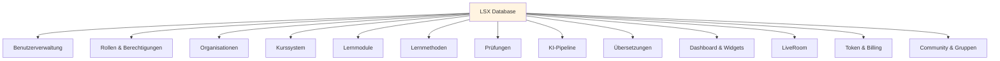

### 📋 Bereiche im Detail

| Nr. | Bereich | Tabellen |
|-----|---------|----------|
| 1 | 👥 **Benutzerverwaltung** | users, roles, permissions |
| 2 | 🔐 **Rollen & Berechtigungen** | roles, role_permissions |
| 3 | 🏢 **Organisationen** | organizations, organization_members |
| 4 | 📚 **Kurssystem** | courses, course_categories, course_access |
| 5 | 📖 **Lernmodule** | modules, module_theory |
| 6 | 🎯 **Lernmethoden** | learning_methods |
| 7 | 📝 **Prüfungen** | exams, exam_questions, exam_results |
| 8 | 🤖 **KI-Pipeline** | ki_requests, ki_raw_inputs |
| 9 | 🌍 **Übersetzungen** | translations |
| 10 | 📊 **Dashboard** | dashboards, dashboard_widgets, widget_registry |
| 11 | 🎥 **LiveRoom** | liverooms, liveroom_participants, recordings |
| 12 | 💰 **Token & Billing** | tokens, billing, billing_items |
| 13 | 👥 **Community** | groups, group_members, group_resources |
| 14 | 🤖 **Smart Agent System** | course_agents, agent_knowledge_base, agent_query_log, agent_org_extensions |

> **Alle Tabellen sind klar getrennt** - keine ungewollten Abhängigkeiten.

---

## 2. Benutzer & Rollen

### 👥 ER-Diagramm: Benutzerverwaltung

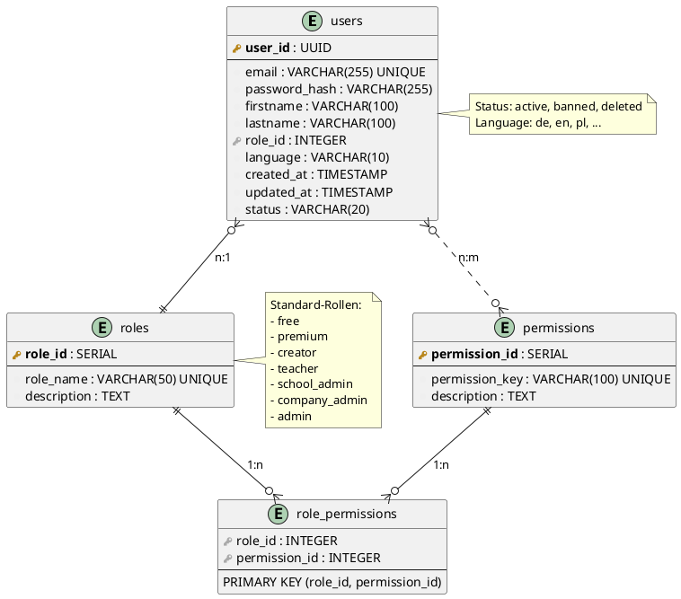

---

### 2.1 📊 Tabelle: `users`

```sql
CREATE TABLE users (
    user_id UUID PRIMARY KEY DEFAULT gen_random_uuid(),
    email VARCHAR(255) UNIQUE NOT NULL,
    password_hash VARCHAR(255) NOT NULL,
    firstname VARCHAR(100),
    lastname VARCHAR(100),
    role_id INTEGER REFERENCES roles(role_id),
    language VARCHAR(10) DEFAULT 'de',
    created_at TIMESTAMP DEFAULT CURRENT_TIMESTAMP,
    updated_at TIMESTAMP DEFAULT CURRENT_TIMESTAMP,
    status VARCHAR(20) DEFAULT 'active' CHECK (status IN ('active', 'banned', 'deleted'))
);

CREATE INDEX idx_users_email ON users(email);
CREATE INDEX idx_users_role ON users(role_id);
```

---

### 2.2 🎭 Tabelle: `roles`

```sql
CREATE TABLE roles (
    role_id SERIAL PRIMARY KEY,
    role_name VARCHAR(50) UNIQUE NOT NULL,
    description TEXT
);

-- Standard-Rollen
INSERT INTO roles (role_name, description) VALUES
    ('free', 'Kostenloser Basis-Zugang'),
    ('premium', 'Premium-Mitgliedschaft'),
    ('creator', 'Kurs-Ersteller'),
    ('teacher', 'Lehrer/Dozent'),
    ('school_admin', 'Schul-Administrator'),
    ('company_admin', 'Unternehmens-Administrator'),
    ('admin', 'System-Administrator'),
    ('support', 'Support-Team'),
    ('moderator', 'Community-Moderator');
```

---

### 2.3 🔐 Tabelle: `permissions`

```sql
CREATE TABLE permissions (
    permission_id SERIAL PRIMARY KEY,
    permission_key VARCHAR(100) UNIQUE NOT NULL,
    description TEXT
);
```

---

### 2.4 🔗 Tabelle: `role_permissions`

```sql
CREATE TABLE role_permissions (
    role_id INTEGER REFERENCES roles(role_id),
    permission_id INTEGER REFERENCES permissions(permission_id),
    PRIMARY KEY (role_id, permission_id)
);
```

---

## 3. Organisationen (Schule, Unternehmen)

### 🏢 ER-Diagramm: Organisationen

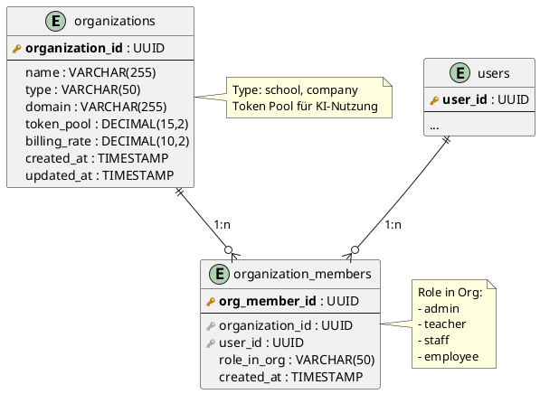

---

### 3.1 🏫 Tabelle: `organizations`

```sql
CREATE TABLE organizations (
    organization_id UUID PRIMARY KEY DEFAULT gen_random_uuid(),
    name VARCHAR(255) NOT NULL,
    type VARCHAR(50) CHECK (type IN ('school', 'company')),
    domain VARCHAR(255),
    token_pool DECIMAL(15,2) DEFAULT 0,
    billing_rate DECIMAL(10,2),
    created_at TIMESTAMP DEFAULT CURRENT_TIMESTAMP,
    updated_at TIMESTAMP DEFAULT CURRENT_TIMESTAMP
);

CREATE INDEX idx_org_type ON organizations(type);
```

---

### 3.2 👥 Tabelle: `organization_members`

```sql
CREATE TABLE organization_members (
    org_member_id UUID PRIMARY KEY DEFAULT gen_random_uuid(),
    organization_id UUID REFERENCES organizations(organization_id),
    user_id UUID REFERENCES users(user_id),
    role_in_org VARCHAR(50) CHECK (role_in_org IN ('admin', 'teacher', 'staff', 'employee')),
    created_at TIMESTAMP DEFAULT CURRENT_TIMESTAMP
);

CREATE INDEX idx_org_members_org ON organization_members(organization_id);
CREATE INDEX idx_org_members_user ON organization_members(user_id);
```

---

## 4. Kurssystem (Academy, Creator, Community)

### 📚 ER-Diagramm: Kurse

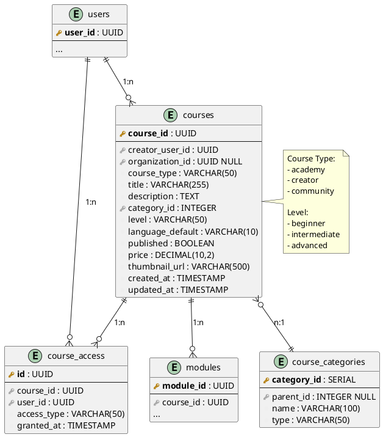

---

### 4.1 📖 Tabelle: `courses`

```sql
CREATE TABLE courses (
    course_id UUID PRIMARY KEY DEFAULT gen_random_uuid(),
    creator_user_id UUID REFERENCES users(user_id),
    organization_id UUID REFERENCES organizations(organization_id) NULL,
    course_type VARCHAR(50) CHECK (course_type IN ('academy', 'creator', 'community')),
    title VARCHAR(255) NOT NULL,
    description TEXT,
    category_id INTEGER REFERENCES course_categories(category_id),
    level VARCHAR(50) CHECK (level IN ('beginner', 'intermediate', 'advanced')),
    language_default VARCHAR(10) DEFAULT 'de',
    published BOOLEAN DEFAULT false,
    price DECIMAL(10,2) DEFAULT 0,
    thumbnail_url VARCHAR(500),
    created_at TIMESTAMP DEFAULT CURRENT_TIMESTAMP,
    updated_at TIMESTAMP DEFAULT CURRENT_TIMESTAMP
);

CREATE INDEX idx_courses_creator ON courses(creator_user_id);
CREATE INDEX idx_courses_type ON courses(course_type);
CREATE INDEX idx_courses_category ON courses(category_id);
CREATE INDEX idx_courses_published ON courses(published);
```

---

### 4.2 🗂️ Tabelle: `course_categories` (Flexibles Hierarchie-System)

> **Hinweis:** Das ehemalige 5-Stufen-Modell wurde durch ein flexibles System mit unbegrenzter Tiefe (praktisches Limit: 20 Ebenen) ersetzt. Siehe [12_Kurs-Kategorisierung-Flexibles-System.md](12_Kurs-Kategorisierung-Flexibles-System.md) für Details.

```sql
CREATE TABLE course_categories (
    category_id SERIAL PRIMARY KEY,
    parent_id INTEGER REFERENCES course_categories(category_id),

    -- Basis-Felder
    name VARCHAR(100) NOT NULL,
    slug VARCHAR(100) NOT NULL UNIQUE,
    description TEXT,

    -- Hierarchie-Felder (automatisch via Trigger)
    level INTEGER NOT NULL DEFAULT 1 CHECK (level BETWEEN 1 AND 20),
    path VARCHAR(1000),           -- z.B. "IT/Netzwerk/Cisco/CCNA"
    path_ids INTEGER[],           -- z.B. [1, 5, 12, 45] für schnelle Abfragen
    root_id INTEGER REFERENCES course_categories(category_id),

    -- UI-Felder
    icon VARCHAR(10),             -- Emoji: "💻"
    color VARCHAR(7),             -- Hex: "#3B82F6"
    order_index INTEGER DEFAULT 0,

    -- Multi-Language
    name_en VARCHAR(100),
    name_es VARCHAR(100),
    name_fr VARCHAR(100),
    name_pl VARCHAR(100),

    -- Status
    active BOOLEAN DEFAULT TRUE,

    -- Timestamps
    created_at TIMESTAMP DEFAULT NOW(),
    updated_at TIMESTAMP DEFAULT NOW()
);

-- Performance-Indizes
CREATE INDEX idx_categories_parent ON course_categories(parent_id);
CREATE INDEX idx_categories_level ON course_categories(level);
CREATE INDEX idx_categories_path ON course_categories(path);
CREATE INDEX idx_categories_path_ids ON course_categories USING GIN (path_ids);
CREATE INDEX idx_categories_root ON course_categories(root_id);
CREATE INDEX idx_categories_active ON course_categories(active) WHERE active = TRUE;
```

**Wichtige Features:**
- **Selbstreferenzierend:** Eine Tabelle für alle Ebenen
- **Automatische Pfad-Berechnung:** Trigger aktualisiert `path`, `path_ids`, `root_id`
- **GIN-Index:** Schnelle Abfragen mit `path_ids @> ARRAY[5]`
- **Multi-Language:** Übersetzbare Namen (DE, EN, ES, FR, PL)

---

### 4.3 🔑 Tabelle: `course_access`

```sql
CREATE TABLE course_access (
    id UUID PRIMARY KEY DEFAULT gen_random_uuid(),
    course_id UUID REFERENCES courses(course_id),
    user_id UUID REFERENCES users(user_id),
    access_type VARCHAR(50) CHECK (access_type IN ('purchased', 'assigned', 'free', 'premium')),
    granted_at TIMESTAMP DEFAULT CURRENT_TIMESTAMP
);

CREATE INDEX idx_course_access_course ON course_access(course_id);
CREATE INDEX idx_course_access_user ON course_access(user_id);
```

---

## 5. Lernmodule

### 📖 ER-Diagramm: Module

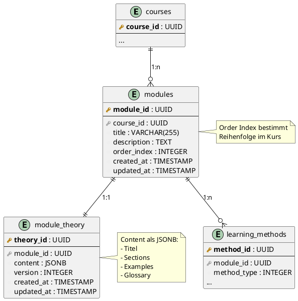

---

### 5.1 📚 Tabelle: `modules`

```sql
CREATE TABLE modules (
    module_id UUID PRIMARY KEY DEFAULT gen_random_uuid(),
    course_id UUID REFERENCES courses(course_id) ON DELETE CASCADE,
    title VARCHAR(255) NOT NULL,
    description TEXT,
    order_index INTEGER NOT NULL,
    created_at TIMESTAMP DEFAULT CURRENT_TIMESTAMP,
    updated_at TIMESTAMP DEFAULT CURRENT_TIMESTAMP
);

CREATE INDEX idx_modules_course ON modules(course_id);
CREATE INDEX idx_modules_order ON modules(course_id, order_index);
```

---

### 5.2 📄 Tabelle: `module_theory`

```sql
CREATE TABLE module_theory (
    theory_id UUID PRIMARY KEY DEFAULT gen_random_uuid(),
    module_id UUID REFERENCES modules(module_id) ON DELETE CASCADE,
    content JSONB NOT NULL,
    version INTEGER DEFAULT 1,
    created_at TIMESTAMP DEFAULT CURRENT_TIMESTAMP,
    updated_at TIMESTAMP DEFAULT CURRENT_TIMESTAMP
);

CREATE INDEX idx_module_theory_module ON module_theory(module_id);
```

**Beispiel `content` JSON:**

```json
{
  "title": "OSI-Modell Grundlagen",
  "sections": [
    {
      "heading": "Einleitung",
      "content": "Das OSI-Modell besteht aus 7 Schichten..."
    }
  ],
  "examples": [],
  "glossary": []
}
```

---

## 6. Lernmethoden (32 Methoden, LM00–LM31)

> **Master-Dokument:** Die vollständige Spezifikation aller 32 Lernmethoden befindet sich in [02_Lernmethoden.md](02_Lernmethoden.md).

### 🎯 Tabelle: `learning_methods`

```sql
CREATE TABLE learning_methods (
    method_id UUID PRIMARY KEY DEFAULT gen_random_uuid(),
    module_id UUID REFERENCES modules(module_id) ON DELETE CASCADE,
    method_type INTEGER CHECK (method_type BETWEEN 0 AND 31),
    title VARCHAR(255) NOT NULL,
    instructions TEXT,
    data JSONB NOT NULL,
    solution JSONB,
    tier VARCHAR(20) CHECK (tier IN ('basic', 'premium', 'pro')),
    difficulty VARCHAR(20) CHECK (difficulty IN ('easy', 'medium', 'hard')),
    duration_minutes INTEGER,
    order_index INTEGER DEFAULT 0,
    published BOOLEAN DEFAULT FALSE,
    created_at TIMESTAMP DEFAULT CURRENT_TIMESTAMP,
    updated_at TIMESTAMP DEFAULT CURRENT_TIMESTAMP
);

CREATE INDEX idx_methods_module ON learning_methods(module_id);
CREATE INDEX idx_methods_type ON learning_methods(method_type);
CREATE INDEX idx_methods_data ON learning_methods USING GIN (data);
CREATE INDEX idx_methods_tier ON learning_methods(tier);
CREATE INDEX idx_methods_published ON learning_methods(published) WHERE published = TRUE;
```

> **Migration 052 (Phase D3 – abgeschlossen):** Der Constraint wurde von `method_type BETWEEN 1 AND 21` auf `method_type BETWEEN 0 AND 31` erweitert. Die ID-Zuordnung ist: LM00 = 0, LM01 = 1, ..., LM31 = 31.

### 🎴 Beispiel: Flashcards (LM13)

```json
{
  "cards": [
    {
      "front": "TCP",
      "back": "Transmission Control Protocol"
    },
    {
      "front": "UDP",
      "back": "User Datagram Protocol"
    }
  ]
}
```

### ❓ Beispiel: Quiz (LM22)

```json
{
  "questions": [
    {
      "q": "Was ist eine IP-Adresse?",
      "a": ["Netzwerkadresse", "MAC-Adresse", "DNS-Server"],
      "correct": [0]
    }
  ]
}
```

### 📋 32 Lernmethoden-Typen (LM00–LM31)

> **Hinweis:** Die folgende Tabelle zeigt die alten 21 Methoden-IDs. Die vollständige Liste der 32 neuen Methoden (LM00–LM31) ist in [02_Lernmethoden.md](02_Lernmethoden.md) definiert.

**Gruppe A – Erklärende Methoden (LM00–LM07):**

| ID | Name | Beschreibung |
|----|------|-------------|
| LM00 | Deep Explanation | KI-generierte tiefgehende Erklärungen |
| LM01 | Schritt-für-Schritt-Erklärung | Sequenzielle Anleitungen |
| LM02 | Interaktive Theorie | Theorie mit Rückfragen |
| LM03 | Diagramm/Visualisierung | Visuelle Darstellungen |
| LM04 | Glossar-Autogenerator | Automatische Glossare |
| LM05 | Mindmap-Generator | Wissenslandkarten |
| LM06 | Beispiel-Szenario-Erklärung | Real-World-Cases |
| LM07 | NPC-Tutor-Lecture | Virtueller Tutor (Text/Audio/Video) |

**Gruppe B – Praxis/Übung (LM08–LM17):**

| ID | Name | Beschreibung |
|----|------|-------------|
| LM08 | Whiteboard-Aufgabe | Zeichnen, Skizzieren, KI-Bewertung |
| LM09 | Code/IT-Config Sandbox | Code-Editor mit Feedback |
| LM10 | Netzwerk-Aufbau Simulation | Netzwerktopologien |
| LM11 | IT-Szenario lösen | Mehrstufige Case Studies |
| LM12 | Mathe-Interaktiv | Schritt-für-Schritt-Rechnung |
| LM13 | Flashcards | Karteikarten mit Spaced-Repetition |
| LM14 | Drag & Drop Aufgaben | Interaktive Zuordnung |
| LM15 | Lückentext-Aufgaben | Fill in the Blanks |
| LM16 | Fehleranalyse | Finde den Fehler |
| LM17 | Hands-on Lab | Geführte Praxislabs |

**Gruppe C – Prüfungsorientiert (LM18–LM25):**

| ID | Name | Beschreibung |
|----|------|-------------|
| LM18 | Freitext-Langantwort | Essay, IHK-Stil |
| LM19 | IHK-Stil Aufgaben | Standardkonforme Prüfungen |
| LM20 | Multi-Step Praxisprüfung | Mehrstufige Prüfungen |
| LM21 | Zeitlimit-Training | Prüfungssimulation mit Timer |
| LM22 | Prüfungs-Quiz | MC, Single Choice, Matching |
| LM23 | Verständnis-Checks | Micro-Questions |
| LM24 | Mündliche Erklärung | User erklärt, KI bewertet |
| LM25 | Kapitel-Endprüfung | Abschlussprüfung pro Kapitel |

**Gruppe D – Pro/Premium/Gamification (LM26–LM31):**

| ID | Name | Beschreibung |
|----|------|-------------|
| LM26 | Adaptive Difficulty | Dynamische Schwierigkeit |
| LM27 | Lernpfad-Autogenerator | KI-generierte Lernpfade |
| LM28 | Persona-Tutor | Tutor mit Persönlichkeit |
| LM29 | Sokratischer Dialog | KI-Gegenfragen |
| LM30 | Daily Recall / Spaced Repetition | Wiederholungsalgorithmus |
| LM31 | Quest-/XP-Verknüpfung | Gamification-Hooks |

---

## 7. Prüfungen & Simulationen

### 📝 ER-Diagramm: Prüfungen

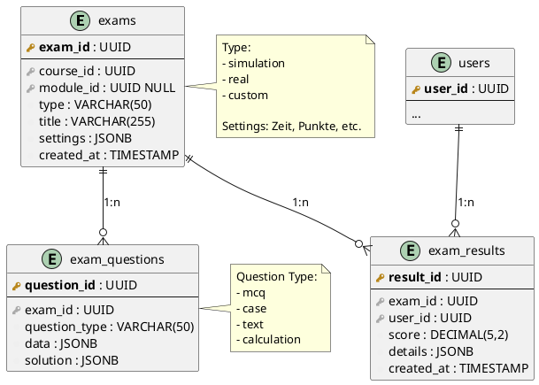

---

### 7.1 📋 Tabelle: `exams`

```sql
CREATE TABLE exams (
    exam_id UUID PRIMARY KEY DEFAULT gen_random_uuid(),
    course_id UUID REFERENCES courses(course_id),
    module_id UUID REFERENCES modules(module_id) NULL,
    type VARCHAR(50) CHECK (type IN ('simulation', 'real', 'custom')),
    title VARCHAR(255) NOT NULL,
    settings JSONB,
    created_at TIMESTAMP DEFAULT CURRENT_TIMESTAMP
);

CREATE INDEX idx_exams_course ON exams(course_id);
CREATE INDEX idx_exams_module ON exams(module_id);
```

---

### 7.2 ❓ Tabelle: `exam_questions`

```sql
CREATE TABLE exam_questions (
    question_id UUID PRIMARY KEY DEFAULT gen_random_uuid(),
    exam_id UUID REFERENCES exams(exam_id) ON DELETE CASCADE,
    question_type VARCHAR(50) CHECK (question_type IN ('mcq', 'case', 'text', 'calculation')),
    data JSONB NOT NULL,
    solution JSONB
);

CREATE INDEX idx_exam_questions_exam ON exam_questions(exam_id);
```

---

### 7.3 📊 Tabelle: `exam_results`

```sql
CREATE TABLE exam_results (
    result_id UUID PRIMARY KEY DEFAULT gen_random_uuid(),
    exam_id UUID REFERENCES exams(exam_id),
    user_id UUID REFERENCES users(user_id),
    score DECIMAL(5,2),
    details JSONB,
    created_at TIMESTAMP DEFAULT CURRENT_TIMESTAMP
);

CREATE INDEX idx_exam_results_exam ON exam_results(exam_id);
CREATE INDEX idx_exam_results_user ON exam_results(user_id);
```

---

## 8. KI-Pipeline

### 🤖 ER-Diagramm: KI-System

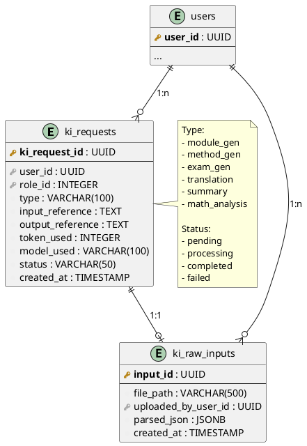

---

### 8.1 🤖 Tabelle: `ki_requests`

```sql
CREATE TABLE ki_requests (
    ki_request_id UUID PRIMARY KEY DEFAULT gen_random_uuid(),
    user_id UUID REFERENCES users(user_id),
    role_id INTEGER REFERENCES roles(role_id),
    type VARCHAR(100) NOT NULL,
    input_reference TEXT,
    output_reference TEXT,
    token_used INTEGER DEFAULT 0,
    model_used VARCHAR(100),
    status VARCHAR(50) CHECK (status IN ('pending', 'processing', 'completed', 'failed')),
    created_at TIMESTAMP DEFAULT CURRENT_TIMESTAMP
);

CREATE INDEX idx_ki_requests_user ON ki_requests(user_id);
CREATE INDEX idx_ki_requests_type ON ki_requests(type);
CREATE INDEX idx_ki_requests_status ON ki_requests(status);
```

**KI-Request Typen:**
- `module_gen` - Modul-Generierung
- `method_gen` - Methoden-Generierung
- `exam_gen` - Prüfungs-Generierung
- `translation` - Übersetzungen
- `summary` - Zusammenfassungen
- `math_analysis` - Mathe-Analyse
- `whiteboard_analysis` - Whiteboard-Erkennung

---

### 8.2 📥 Tabelle: `ki_raw_inputs`

```sql
CREATE TABLE ki_raw_inputs (
    input_id UUID PRIMARY KEY DEFAULT gen_random_uuid(),
    file_path VARCHAR(500) NOT NULL,
    uploaded_by_user_id UUID REFERENCES users(user_id),
    parsed_json JSONB,
    created_at TIMESTAMP DEFAULT CURRENT_TIMESTAMP
);

CREATE INDEX idx_ki_inputs_user ON ki_raw_inputs(uploaded_by_user_id);
```

---

## 9. Global Publishing – Übersetzungen

### 🌍 Tabelle: `translations`

```sql
CREATE TABLE translations (
    translation_id UUID PRIMARY KEY DEFAULT gen_random_uuid(),
    content_type VARCHAR(50) CHECK (content_type IN ('course', 'module', 'theory', 'method', 'exam')),
    content_id UUID NOT NULL,
    language VARCHAR(10) NOT NULL,
    translated_json JSONB NOT NULL,
    source_language VARCHAR(10),
    version INTEGER DEFAULT 1,
    created_at TIMESTAMP DEFAULT CURRENT_TIMESTAMP
);

CREATE INDEX idx_translations_content ON translations(content_type, content_id);
CREATE INDEX idx_translations_language ON translations(language);
CREATE UNIQUE INDEX idx_translations_unique ON translations(content_type, content_id, language);
```

**Beispiel:**

```json
{
  "title": "Subnetting Basics",
  "description": "Learn how to subnet IPv4 networks",
  "content": "..."
}
```

---

## 10. Dashboard & Widgets

### 📊 ER-Diagramm: Dashboard

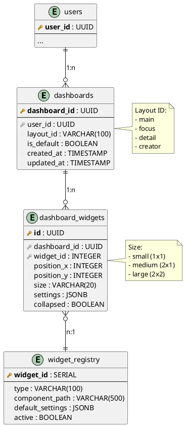

---

### 10.1 📊 Tabelle: `dashboards`

```sql
CREATE TABLE dashboards (
    dashboard_id UUID PRIMARY KEY DEFAULT gen_random_uuid(),
    user_id UUID REFERENCES users(user_id) ON DELETE CASCADE,
    layout_id VARCHAR(100),
    is_default BOOLEAN DEFAULT false,
    created_at TIMESTAMP DEFAULT CURRENT_TIMESTAMP,
    updated_at TIMESTAMP DEFAULT CURRENT_TIMESTAMP
);

CREATE INDEX idx_dashboards_user ON dashboards(user_id);
```

---

### 10.2 🧩 Tabelle: `dashboard_widgets`

```sql
CREATE TABLE dashboard_widgets (
    id UUID PRIMARY KEY DEFAULT gen_random_uuid(),
    dashboard_id UUID REFERENCES dashboards(dashboard_id) ON DELETE CASCADE,
    widget_id INTEGER NOT NULL,
    position_x INTEGER NOT NULL,
    position_y INTEGER NOT NULL,
    size VARCHAR(20) CHECK (size IN ('small', 'medium', 'large')),
    settings JSONB,
    collapsed BOOLEAN DEFAULT false
);

CREATE INDEX idx_dashboard_widgets_dashboard ON dashboard_widgets(dashboard_id);
```

---

### 10.3 🎨 Tabelle: `widget_registry`

```sql
CREATE TABLE widget_registry (
    widget_id SERIAL PRIMARY KEY,
    type VARCHAR(100) UNIQUE NOT NULL,
    component_path VARCHAR(500),
    default_settings JSONB,
    active BOOLEAN DEFAULT true
);
```

---

## 11. LiveRoom System

### 🎥 ER-Diagramm: LiveRoom

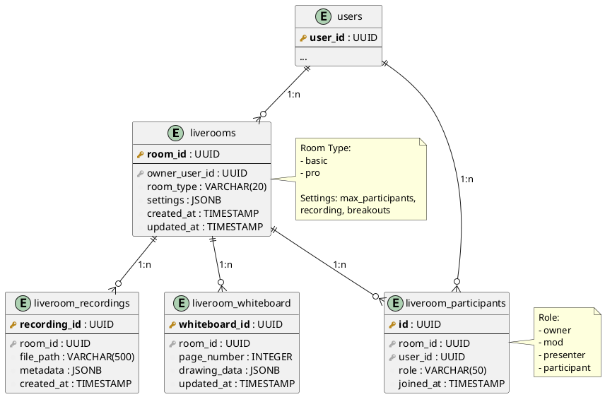

---

### 11.1 🎥 Tabelle: `liverooms`

```sql
CREATE TABLE liverooms (
    room_id UUID PRIMARY KEY DEFAULT gen_random_uuid(),
    owner_user_id UUID REFERENCES users(user_id),
    room_type VARCHAR(20) CHECK (room_type IN ('basic', 'pro')),
    settings JSONB,
    created_at TIMESTAMP DEFAULT CURRENT_TIMESTAMP,
    updated_at TIMESTAMP DEFAULT CURRENT_TIMESTAMP
);

CREATE INDEX idx_liverooms_owner ON liverooms(owner_user_id);
```

---

### 11.2 👥 Tabelle: `liveroom_participants`

```sql
CREATE TABLE liveroom_participants (
    id UUID PRIMARY KEY DEFAULT gen_random_uuid(),
    room_id UUID REFERENCES liverooms(room_id) ON DELETE CASCADE,
    user_id UUID REFERENCES users(user_id),
    role VARCHAR(50) CHECK (role IN ('owner', 'mod', 'presenter', 'participant')),
    joined_at TIMESTAMP DEFAULT CURRENT_TIMESTAMP
);

CREATE INDEX idx_liveroom_participants_room ON liveroom_participants(room_id);
CREATE INDEX idx_liveroom_participants_user ON liveroom_participants(user_id);
```

---

### 11.3 📹 Tabelle: `liveroom_recordings`

```sql
CREATE TABLE liveroom_recordings (
    recording_id UUID PRIMARY KEY DEFAULT gen_random_uuid(),
    room_id UUID REFERENCES liverooms(room_id),
    file_path VARCHAR(500) NOT NULL,
    metadata JSONB,
    created_at TIMESTAMP DEFAULT CURRENT_TIMESTAMP
);

CREATE INDEX idx_liveroom_recordings_room ON liveroom_recordings(room_id);
```

---

### 11.4 🖊️ Tabelle: `liveroom_whiteboard`

```sql
CREATE TABLE liveroom_whiteboard (
    whiteboard_id UUID PRIMARY KEY DEFAULT gen_random_uuid(),
    room_id UUID REFERENCES liverooms(room_id) ON DELETE CASCADE,
    page_number INTEGER NOT NULL,
    drawing_data JSONB NOT NULL,
    updated_at TIMESTAMP DEFAULT CURRENT_TIMESTAMP
);

CREATE INDEX idx_liveroom_whiteboard_room ON liveroom_whiteboard(room_id);
```

---

## 12. Token- & Abrechnungssystem

### 💰 ER-Diagramm: Billing

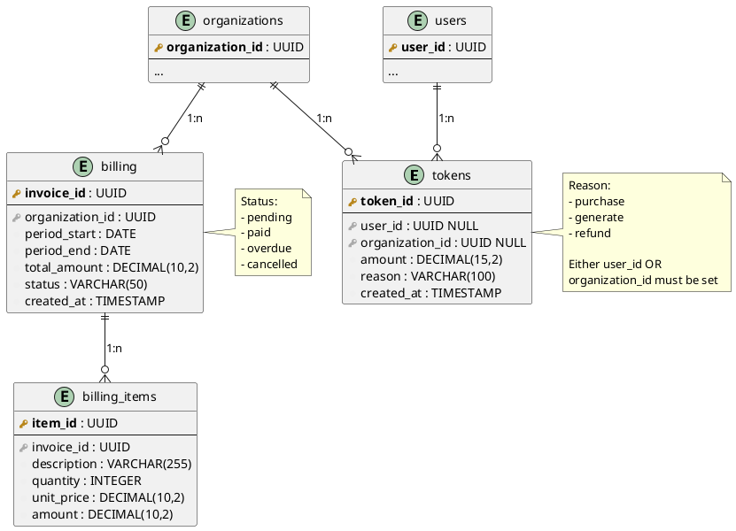

---

### 12.1 💎 Tabelle: `tokens`

```sql
CREATE TABLE tokens (
    token_id UUID PRIMARY KEY DEFAULT gen_random_uuid(),
    user_id UUID REFERENCES users(user_id) NULL,
    organization_id UUID REFERENCES organizations(organization_id) NULL,
    amount DECIMAL(15,2) NOT NULL,
    reason VARCHAR(100),
    created_at TIMESTAMP DEFAULT CURRENT_TIMESTAMP,
    CHECK ((user_id IS NOT NULL) OR (organization_id IS NOT NULL))
);

CREATE INDEX idx_tokens_user ON tokens(user_id);
CREATE INDEX idx_tokens_org ON tokens(organization_id);
```

---

### 12.2 💳 Tabelle: `billing`

```sql
CREATE TABLE billing (
    invoice_id UUID PRIMARY KEY DEFAULT gen_random_uuid(),
    organization_id UUID REFERENCES organizations(organization_id),
    period_start DATE NOT NULL,
    period_end DATE NOT NULL,
    total_amount DECIMAL(10,2) NOT NULL,
    status VARCHAR(50) CHECK (status IN ('pending', 'paid', 'overdue', 'cancelled')),
    created_at TIMESTAMP DEFAULT CURRENT_TIMESTAMP
);

CREATE INDEX idx_billing_org ON billing(organization_id);
CREATE INDEX idx_billing_status ON billing(status);
```

---

### 12.3 📋 Tabelle: `billing_items`

```sql
CREATE TABLE billing_items (
    item_id UUID PRIMARY KEY DEFAULT gen_random_uuid(),
    invoice_id UUID REFERENCES billing(invoice_id) ON DELETE CASCADE,
    description VARCHAR(255),
    quantity INTEGER DEFAULT 1,
    unit_price DECIMAL(10,2),
    amount DECIMAL(10,2)
);

CREATE INDEX idx_billing_items_invoice ON billing_items(invoice_id);
```

---

## 13. Community & Gruppen

### 👥 ER-Diagramm: Community

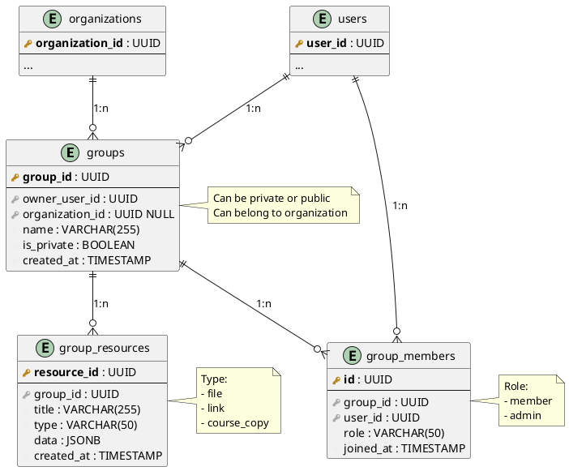

---

### 13.1 👥 Tabelle: `groups`

```sql
CREATE TABLE groups (
    group_id UUID PRIMARY KEY DEFAULT gen_random_uuid(),
    owner_user_id UUID REFERENCES users(user_id),
    organization_id UUID REFERENCES organizations(organization_id) NULL,
    name VARCHAR(255) NOT NULL,
    is_private BOOLEAN DEFAULT false,
    created_at TIMESTAMP DEFAULT CURRENT_TIMESTAMP
);

CREATE INDEX idx_groups_owner ON groups(owner_user_id);
CREATE INDEX idx_groups_org ON groups(organization_id);
```

---

### 13.2 👤 Tabelle: `group_members`

```sql
CREATE TABLE group_members (
    id UUID PRIMARY KEY DEFAULT gen_random_uuid(),
    group_id UUID REFERENCES groups(group_id) ON DELETE CASCADE,
    user_id UUID REFERENCES users(user_id),
    role VARCHAR(50) CHECK (role IN ('member', 'admin')),
    joined_at TIMESTAMP DEFAULT CURRENT_TIMESTAMP
);

CREATE INDEX idx_group_members_group ON group_members(group_id);
CREATE INDEX idx_group_members_user ON group_members(user_id);
```

---

### 13.3 📎 Tabelle: `group_resources`

```sql
CREATE TABLE group_resources (
    resource_id UUID PRIMARY KEY DEFAULT gen_random_uuid(),
    group_id UUID REFERENCES groups(group_id) ON DELETE CASCADE,
    title VARCHAR(255) NOT NULL,
    type VARCHAR(50) CHECK (type IN ('file', 'link', 'course_copy')),
    data JSONB NOT NULL,
    created_at TIMESTAMP DEFAULT CURRENT_TIMESTAMP
);

CREATE INDEX idx_group_resources_group ON group_resources(group_id);
```

---

## 14. LiveRoom-System (Detaillierte Struktur)

**Version:** 1.0
**Stand:** Final

Das **LiveRoom-System** bildet die Echtzeit-Lernräume des LSX-Ökosystems ab.
Die Datenstruktur ist modular, mandantenfähig und für Schulen, Unternehmen sowie Premium-User ausgelegt.
Sie integriert Audio-/Video-Räume, Whiteboards, KI-Transkriptionen, Aufzeichnungen und Teilnehmerverwaltung.

### 14.1 Tabellenübersicht

| Tabelle | Zweck |
|----------|--------|
| **rooms** | Haupttabelle für LiveRooms |
| **room_participants** | Teilnehmer eines LiveRooms |
| **room_whiteboards** | Whiteboard-Daten, Skizzen & KI-Ergebnisse |
| **room_transcripts** | KI-generierte Transkriptionen & Zusammenfassungen |
| **room_recordings** | Video-/Audio-Aufzeichnungen |
| **room_logs** | Moderationsaktionen, Ereignisse |
| **room_ai_stats** | Tokenverbrauch & KI-Aktivität je Sitzung |

---

### 14.2 Tabellenstruktur (SQL)

#### 📋 Tabelle: `rooms`

```sql
CREATE TABLE rooms (
    id SERIAL PRIMARY KEY,
    org_id INTEGER NOT NULL REFERENCES organisations(organization_id) ON DELETE CASCADE,
    course_id UUID REFERENCES courses(course_id) ON DELETE SET NULL,
    module_id UUID REFERENCES modules(module_id) ON DELETE SET NULL,
    created_by UUID REFERENCES users(user_id) ON DELETE SET NULL,
    room_type VARCHAR(50) NOT NULL,         -- classroom, seminar, study, exam, ai
    name VARCHAR(255) NOT NULL,
    description TEXT,
    status VARCHAR(20) DEFAULT 'active',    -- active, closed, archived
    max_participants INTEGER DEFAULT 50,
    start_time TIMESTAMP,
    end_time TIMESTAMP,
    duration_minutes INTEGER,
    enable_ai BOOLEAN DEFAULT FALSE,
    enable_recording BOOLEAN DEFAULT FALSE,
    ai_model VARCHAR(50),                   -- gpt-4o, claude-3.5, ollama-mistral, etc.
    ai_pipeline_version VARCHAR(20),
    access_code VARCHAR(10),
    created_at TIMESTAMP DEFAULT NOW(),
    updated_at TIMESTAMP DEFAULT NOW()
);

CREATE INDEX idx_rooms_org_id ON rooms(org_id);
CREATE INDEX idx_rooms_course_id ON rooms(course_id);
CREATE INDEX idx_rooms_status ON rooms(status);
CREATE INDEX idx_rooms_created_by ON rooms(created_by);
```

---

#### 👥 Tabelle: `room_participants`

```sql
CREATE TABLE room_participants (
    id SERIAL PRIMARY KEY,
    room_id INTEGER REFERENCES rooms(id) ON DELETE CASCADE,
    user_id UUID REFERENCES users(user_id) ON DELETE CASCADE,
    role VARCHAR(20) DEFAULT 'student',     -- host, teacher, student, guest
    joined_at TIMESTAMP DEFAULT NOW(),
    left_at TIMESTAMP,
    active BOOLEAN DEFAULT TRUE,
    participation_score DECIMAL(5,2) DEFAULT 0.00
);

CREATE INDEX idx_room_participants_room_id ON room_participants(room_id);
CREATE INDEX idx_room_participants_user_id ON room_participants(user_id);
CREATE INDEX idx_room_participants_active ON room_participants(room_id, active);
```

**Rollen-Beschreibung:**
- **host** - Raum-Ersteller mit vollen Rechten
- **teacher** - Lehrer/Dozent mit Moderationsrechten
- **student** - Regulärer Teilnehmer
- **guest** - Gast ohne Account (falls erlaubt)

---

#### 🎨 Tabelle: `room_whiteboards`

```sql
CREATE TABLE room_whiteboards (
    id SERIAL PRIMARY KEY,
    room_id INTEGER REFERENCES rooms(id) ON DELETE CASCADE,
    user_id UUID REFERENCES users(user_id) ON DELETE SET NULL,
    content JSONB,                           -- Whiteboard-Zeichnungen, Shapes, Pfade
    ai_recognition JSONB,                    -- KI-Erkannte Inhalte (Formeln, Netze, Begriffe)
    updated_at TIMESTAMP DEFAULT NOW()
);

CREATE INDEX idx_room_whiteboards_room_id ON room_whiteboards(room_id);
CREATE INDEX idx_room_whiteboards_content ON room_whiteboards USING GIN (content);
```

**Beispiel `content` JSONB:**
```json
{
  "version": "1.0",
  "pages": [
    {
      "page_id": 1,
      "elements": [
        {
          "type": "path",
          "points": [[10, 20], [30, 40], [50, 60]],
          "color": "#000000",
          "width": 2
        },
        {
          "type": "text",
          "content": "OSI Model",
          "position": [100, 100],
          "fontSize": 24
        }
      ]
    }
  ]
}
```

**Beispiel `ai_recognition` JSONB:**
```json
{
  "recognized_formulas": [
    "E = mc²"
  ],
  "recognized_diagrams": [
    {
      "type": "network_topology",
      "confidence": 0.95,
      "elements": ["router", "switch", "host"]
    }
  ],
  "keywords": ["subnetting", "CIDR", "network"]
}
```

---

#### 📝 Tabelle: `room_transcripts`

```sql
CREATE TABLE room_transcripts (
    id SERIAL PRIMARY KEY,
    room_id INTEGER REFERENCES rooms(id) ON DELETE CASCADE,
    language VARCHAR(10) DEFAULT 'de',
    transcript TEXT,
    summary TEXT,
    keywords TEXT[],
    ai_model VARCHAR(50),
    token_used INTEGER DEFAULT 0,
    created_at TIMESTAMP DEFAULT NOW()
);

CREATE INDEX idx_room_transcripts_room_id ON room_transcripts(room_id);
CREATE INDEX idx_room_transcripts_language ON room_transcripts(language);
```

**Workflow:**
1. Audio-Stream wird aufgezeichnet
2. Whisper/Deepgram erstellt Transkript
3. GPT-4/Claude generiert Zusammenfassung
4. Keywords werden extrahiert
5. Token-Verbrauch wird geloggt

---

#### 🎥 Tabelle: `room_recordings`

```sql
CREATE TABLE room_recordings (
    id SERIAL PRIMARY KEY,
    room_id INTEGER REFERENCES rooms(id) ON DELETE CASCADE,
    file_url TEXT NOT NULL,
    duration_seconds INTEGER,
    storage_location VARCHAR(100),           -- Cloud Path / Local
    transcription_id INTEGER REFERENCES room_transcripts(id) ON DELETE SET NULL,
    created_at TIMESTAMP DEFAULT NOW()
);

CREATE INDEX idx_room_recordings_room_id ON room_recordings(room_id);
CREATE INDEX idx_room_recordings_transcription ON room_recordings(transcription_id);
```

**Storage-Strategie:**
- **Hot Storage** (S3 Standard): Aufzeichnungen der letzten 30 Tage
- **Warm Storage** (S3 IA): 30-90 Tage
- **Cold Storage** (S3 Glacier): > 90 Tage
- **Auto-Deletion**: Nach Organisation-Policy (z.B. 1 Jahr)

---

#### 📜 Tabelle: `room_logs`

```sql
CREATE TABLE room_logs (
    id SERIAL PRIMARY KEY,
    room_id INTEGER REFERENCES rooms(id) ON DELETE CASCADE,
    actor_id UUID REFERENCES users(user_id) ON DELETE SET NULL,
    action VARCHAR(100),
    details TEXT,
    timestamp TIMESTAMP DEFAULT NOW()
);

CREATE INDEX idx_room_logs_room_id ON room_logs(room_id);
CREATE INDEX idx_room_logs_timestamp ON room_logs(timestamp);
```

**Geloggte Aktionen:**
- `room_created` - Raum wurde erstellt
- `participant_joined` - Teilnehmer beigetreten
- `participant_left` - Teilnehmer verlassen
- `participant_muted` - Teilnehmer stummgeschaltet
- `participant_kicked` - Teilnehmer entfernt
- `recording_started` - Aufzeichnung gestartet
- `recording_stopped` - Aufzeichnung gestoppt
- `whiteboard_edited` - Whiteboard bearbeitet
- `ai_transcription_completed` - KI-Transkription fertig

---

#### 💰 Tabelle: `room_ai_stats`

```sql
CREATE TABLE room_ai_stats (
    id SERIAL PRIMARY KEY,
    room_id INTEGER REFERENCES rooms(id) ON DELETE CASCADE,
    ai_model VARCHAR(50),
    token_input INTEGER DEFAULT 0,
    token_output INTEGER DEFAULT 0,
    cost_usd DECIMAL(8,4) DEFAULT 0.0000,
    created_at TIMESTAMP DEFAULT NOW()
);

CREATE INDEX idx_room_ai_stats_room_id ON room_ai_stats(room_id);
CREATE INDEX idx_room_ai_stats_created_at ON room_ai_stats(created_at);
```

**Verwendung:**
Diese Tabelle erfasst die KI-Kosten pro LiveRoom-Session und ermöglicht:
- Transparente Abrechnung für Schulen/Unternehmen
- Dashboard-Widget "KI-Nutzung"
- Monatsreports mit Kostenaufschlüsselung
- Budget-Warnungen bei Überschreitung

---

### 14.3 Beziehungen (ER-Diagramm)

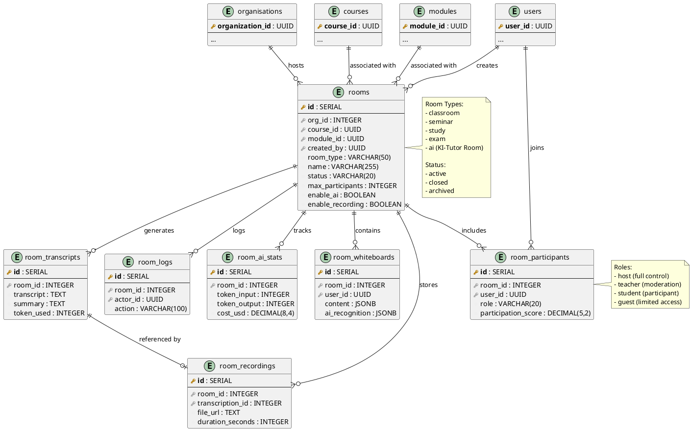

---

### 14.4 Seeds (Initiale Einträge)

```sql
-- Beispiel-Room für Setup-Wizard
INSERT INTO rooms (org_id, room_type, name, description, enable_ai, enable_recording)
VALUES
(1, 'classroom', 'Beispielraum – Netzwerktechnik 2B', 'Demoraum für Setup-Wizard', TRUE, TRUE);

-- Log-Eintrag für Raum-Erstellung
INSERT INTO room_logs (room_id, action, details)
VALUES (1, 'room_created', 'Initial Setup Wizard Raum erstellt');
```

---

### 14.5 Sicherheit & Mandantenfähigkeit

**Organisationsisolierung:**
- Jede `org_id` ist mandantenisoliert
- Kein Zugriff auf fremde Räume durch Cross-Org Queries
- Alle Daten verknüpft mit `organisations`

**Datenschutz:**
- Aufzeichnungen, Transkripte & KI-Daten sind ausschließlich für die jeweilige Organisation sichtbar
- API-Layer überprüft `org_id`-Token-Zuordnung bei jedem Request
- DSGVO-konforme Löschung: Alle verknüpften Daten werden kaskadiert gelöscht

**Access Control:**
```sql
-- Row-Level Security Policy für rooms
CREATE POLICY room_org_isolation ON rooms
FOR SELECT
USING (
    org_id = current_setting('app.current_org_id', true)::int
    OR current_setting('app.user_role', true) = 'admin'
);

ALTER TABLE rooms ENABLE ROW LEVEL SECURITY;
```

---

### 14.6 KI-Aktivitätsverfolgung

Die `room_ai_stats`-Tabelle erfasst:

| Feld | Beschreibung |
|------|--------------|
| **token_input** | Anzahl Tokens für Prompts |
| **token_output** | Tokens für Antwort |
| **cost_usd** | Kosten der Sitzung |
| **ai_model** | Genutztes Modell (GPT, Claude, Ollama etc.) |
| **created_at** | Zeitpunkt der Verarbeitung |

**Dashboard-Integration:**
Diese Daten fließen in:
- Dashboard-Widget „KI-Nutzung"
- Monatsreport für Schulen/Unternehmen
- Budget-Warnungen
- Abrechnungs-System

**Beispiel-Query: Monatliche KI-Kosten pro Organisation**
```sql
SELECT
    o.name AS organisation,
    SUM(ras.cost_usd) AS total_cost,
    SUM(ras.token_input + ras.token_output) AS total_tokens,
    COUNT(DISTINCT r.id) AS rooms_with_ai
FROM room_ai_stats ras
JOIN rooms r ON r.id = ras.room_id
JOIN organisations o ON o.organization_id = r.org_id
WHERE ras.created_at >= DATE_TRUNC('month', CURRENT_DATE)
  AND ras.created_at < DATE_TRUNC('month', CURRENT_DATE) + INTERVAL '1 month'
GROUP BY o.organization_id, o.name
ORDER BY total_cost DESC;
```

---

### 14.7 LiveRoom-Typen & Use Cases

| Room Type | Beschreibung | Enable AI | Enable Recording | Max Participants |
|-----------|--------------|-----------|------------------|------------------|
| **classroom** | Standard-Unterricht | Optional | Ja | 50 |
| **seminar** | Workshop/Seminar | Optional | Ja | 30 |
| **study** | Lerngruppen | Nein | Optional | 10 |
| **exam** | Prüfungssimulation | Nein | Ja (Proctoring) | 100 |
| **ai** | KI-Tutor Room | Ja | Ja | 5 |

**Use Case Beispiele:**

**1. Klassenzimmer (Classroom)**
- Lehrer erstellt Raum für „Netzwerktechnik 2B"
- 25 Schüler treten bei
- KI-Transkription läuft live mit
- Whiteboard-Zeichnungen werden KI-analysiert (Netzwerk-Topologien)
- Aufzeichnung wird automatisch nach 90 Tagen archiviert

**2. KI-Tutor Room**
- Student erstellt 1:1 KI-Raum
- GPT-4o beantwortet Fragen live
- Transkript wird gespeichert für späteres Lernen
- Token-Verbrauch wird vom Student-Account abgezogen

**3. Prüfungssimulation (Exam)**
- Schule erstellt Prüfungsraum für CompTIA Network+
- 100 Schüler zeitgleich
- Kein Whiteboard, nur Prüfungsfragen
- Aufzeichnung für Proctoring (Betrugsverhinderung)
- Keine KI-Features

---

### 14.8 Zusammenfassung

Die LiveRoom-Tabellen bilden ein skalierbares Fundament für:

✅ Unterricht, Seminare, StudyRooms & Prüfungen
✅ Echtzeit-KI-Transkriptionen & Lernanalysen
✅ Sichere Aufzeichnungen & Whiteboard-Daten
✅ Transparente Token- & Kostenverfolgung
✅ Vollständige Mandanten-Trennung

Dieses Datenmodell stellt sicher, dass jede Organisation ihre LiveRooms unabhängig verwalten, analysieren und KI-gestützt optimieren kann.

---

## 15. Smart Agent System (Migration 065)

**Version:** 1.0
**Stand:** Final
**Migration:** 065_smart_agent_system.sql

Das **Smart Agent System** ermoeglicht intelligentes Wissens-Caching pro Kurs mit 50-70% Token-Ersparnis.

### 15.1 Tabellenuebersicht

| Tabelle | Zweck |
|---------|-------|
| **course_agents** | Agent-Konfiguration pro Kurs |
| **agent_knowledge_base** | Wissens-Eintraege (Q&A Paare) |
| **agent_cache_entries** | Redis Cache Metadaten |
| **agent_query_log** | Alle Anfragen tracken |
| **agent_org_extensions** | Org-spezifische Anpassungen |
| **agent_warm_jobs** | Background Warm-Up Jobs |

### 15.2 ER-Diagramm: Smart Agent

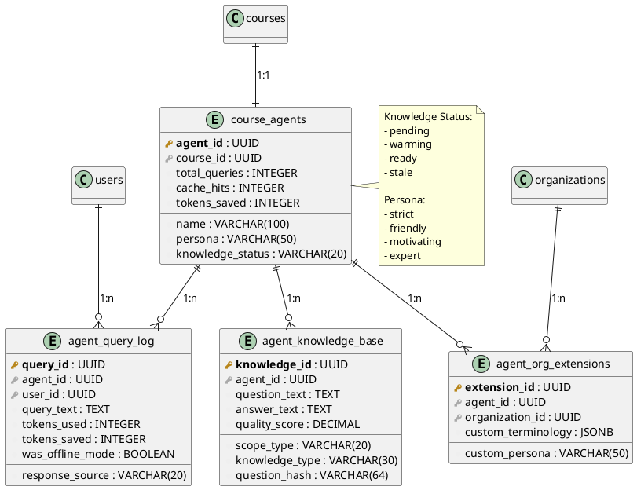

### 15.3 Tabelle: `course_agents`

```sql
CREATE TABLE course_agents (
    agent_id UUID PRIMARY KEY DEFAULT gen_random_uuid(),
    course_id UUID NOT NULL REFERENCES courses(course_id) ON DELETE CASCADE,

    -- Agent Settings
    name VARCHAR(100) DEFAULT 'KI-Tutor',
    persona VARCHAR(50) DEFAULT 'friendly',
    language VARCHAR(5) DEFAULT 'de',

    -- Knowledge Status
    knowledge_status VARCHAR(20) DEFAULT 'pending',
    last_warmed_at TIMESTAMPTZ,
    knowledge_version INTEGER DEFAULT 1,

    -- AI Configuration
    primary_provider VARCHAR(50) DEFAULT 'openai',
    primary_model VARCHAR(100) DEFAULT 'gpt-4o-mini',
    temperature DECIMAL(3,2) DEFAULT 0.7,
    max_tokens INTEGER DEFAULT 2000,

    -- Statistics
    total_queries INTEGER DEFAULT 0,
    cache_hits INTEGER DEFAULT 0,
    tokens_saved INTEGER DEFAULT 0,

    created_at TIMESTAMPTZ DEFAULT NOW(),
    updated_at TIMESTAMPTZ DEFAULT NOW(),

    UNIQUE(course_id),
    CONSTRAINT chk_agent_knowledge_status CHECK (
        knowledge_status IN ('pending', 'warming', 'ready', 'stale')
    ),
    CONSTRAINT chk_agent_persona CHECK (
        persona IN ('strict', 'friendly', 'motivating', 'expert')
    )
);

CREATE INDEX idx_course_agents_course ON course_agents(course_id);
CREATE INDEX idx_course_agents_status ON course_agents(knowledge_status);
```

### 15.4 Tabelle: `agent_knowledge_base`

```sql
CREATE TABLE agent_knowledge_base (
    knowledge_id UUID PRIMARY KEY DEFAULT gen_random_uuid(),
    agent_id UUID NOT NULL REFERENCES course_agents(agent_id) ON DELETE CASCADE,

    -- Scope
    scope_type VARCHAR(20) NOT NULL,
    scope_id UUID,

    -- Content
    knowledge_type VARCHAR(30) NOT NULL,
    method_type INTEGER,
    question_hash VARCHAR(64),
    question_text TEXT,
    answer_text TEXT NOT NULL,
    answer_html TEXT,

    -- Source
    source VARCHAR(20) NOT NULL,
    generated_by VARCHAR(50),

    -- Quality Metrics
    quality_score DECIMAL(5,2) DEFAULT 0.00,
    usage_count INTEGER DEFAULT 0,
    positive_feedback INTEGER DEFAULT 0,
    negative_feedback INTEGER DEFAULT 0,

    created_at TIMESTAMPTZ DEFAULT NOW(),
    updated_at TIMESTAMPTZ DEFAULT NOW(),

    CONSTRAINT chk_knowledge_scope_type CHECK (
        scope_type IN ('course', 'chapter', 'lesson', 'method')
    ),
    CONSTRAINT chk_knowledge_type CHECK (
        knowledge_type IN ('qa_pair', 'explanation', 'example', 'definition', 'summary', 'flashcard', 'quiz_item')
    ),
    CONSTRAINT chk_knowledge_source CHECK (
        source IN ('auto_generated', 'user_interaction', 'manual', 'imported')
    )
);

-- Full-text search index for German
CREATE INDEX idx_agent_knowledge_question_fts ON agent_knowledge_base
    USING GIN (to_tsvector('german', COALESCE(question_text, '')));
```

### 15.5 Tabelle: `agent_query_log`

```sql
CREATE TABLE agent_query_log (
    query_id UUID PRIMARY KEY DEFAULT gen_random_uuid(),
    agent_id UUID NOT NULL REFERENCES course_agents(agent_id) ON DELETE CASCADE,
    user_id UUID NOT NULL REFERENCES users(user_id) ON DELETE CASCADE,

    -- Query Details
    query_text TEXT NOT NULL,
    query_hash VARCHAR(64) NOT NULL,
    context_scope VARCHAR(20),
    context_id UUID,
    method_type INTEGER,

    -- Response
    response_text TEXT,
    response_source VARCHAR(20) NOT NULL,
    cache_key VARCHAR(200),

    -- Token Economics
    tokens_used INTEGER DEFAULT 0,
    tokens_saved INTEGER DEFAULT 0,
    cost_eur DECIMAL(10,6) DEFAULT 0,

    -- Performance
    latency_ms INTEGER,
    ai_provider VARCHAR(50),
    ai_model VARCHAR(100),

    -- Quality
    user_rating INTEGER,
    user_feedback TEXT,
    was_helpful BOOLEAN,

    -- Offline Mode
    was_offline_mode BOOLEAN DEFAULT FALSE,

    created_at TIMESTAMPTZ DEFAULT NOW(),

    CONSTRAINT chk_query_response_source CHECK (
        response_source IN ('cache_hit', 'partial_cache', 'ai_generated', 'offline_fallback', 'error')
    ),
    CONSTRAINT chk_query_rating CHECK (user_rating IS NULL OR user_rating BETWEEN 1 AND 5)
);

CREATE INDEX idx_agent_query_agent ON agent_query_log(agent_id);
CREATE INDEX idx_agent_query_user ON agent_query_log(user_id);
CREATE INDEX idx_agent_query_hash ON agent_query_log(query_hash);
CREATE INDEX idx_agent_query_source ON agent_query_log(response_source);
```

### 15.6 Tabelle: `agent_org_extensions`

```sql
CREATE TABLE agent_org_extensions (
    extension_id UUID PRIMARY KEY DEFAULT gen_random_uuid(),
    agent_id UUID NOT NULL REFERENCES course_agents(agent_id) ON DELETE CASCADE,
    organization_id UUID NOT NULL REFERENCES organizations(organization_id) ON DELETE CASCADE,

    -- Custom Settings
    custom_persona VARCHAR(50),
    custom_language VARCHAR(5),
    custom_terminology JSONB DEFAULT '{}',
    custom_examples JSONB DEFAULT '[]',

    -- Knowledge Extensions
    additional_context TEXT,

    -- Restrictions
    blocked_topics JSONB DEFAULT '[]',

    enabled BOOLEAN DEFAULT TRUE,

    created_at TIMESTAMPTZ DEFAULT NOW(),
    updated_at TIMESTAMPTZ DEFAULT NOW(),

    UNIQUE(agent_id, organization_id)
);
```

### 15.7 View: `v_agent_stats`

```sql
CREATE OR REPLACE VIEW v_agent_stats AS
SELECT
    ca.agent_id,
    ca.course_id,
    c.title as course_title,
    ca.name as agent_name,
    ca.knowledge_status,
    ca.total_queries,
    ca.cache_hits,
    ca.tokens_saved,
    CASE
        WHEN ca.total_queries > 0
        THEN ROUND((ca.cache_hits::DECIMAL / ca.total_queries) * 100, 2)
        ELSE 0
    END as cache_hit_rate,
    COUNT(DISTINCT akb.knowledge_id) as knowledge_count,
    COUNT(DISTINCT aql.query_id) FILTER (WHERE aql.created_at > NOW() - INTERVAL '24 hours') as queries_24h,
    ca.last_warmed_at,
    ca.created_at
FROM course_agents ca
JOIN courses c ON ca.course_id = c.course_id
LEFT JOIN agent_knowledge_base akb ON ca.agent_id = akb.agent_id
LEFT JOIN agent_query_log aql ON ca.agent_id = aql.agent_id
GROUP BY ca.agent_id, ca.course_id, c.title, ca.name, ca.knowledge_status,
         ca.total_queries, ca.cache_hits, ca.tokens_saved, ca.last_warmed_at, ca.created_at;
```

### 15.8 Funktionen

**increment_agent_stats** - Atomares Update der Agent-Statistiken:

```sql
CREATE OR REPLACE FUNCTION increment_agent_stats(
    p_agent_id UUID,
    p_cache_hit BOOLEAN,
    p_tokens_saved INTEGER DEFAULT 0
) RETURNS VOID AS $$
BEGIN
    UPDATE course_agents
    SET
        total_queries = total_queries + 1,
        cache_hits = cache_hits + CASE WHEN p_cache_hit THEN 1 ELSE 0 END,
        tokens_saved = tokens_saved + COALESCE(p_tokens_saved, 0),
        updated_at = NOW()
    WHERE agent_id = p_agent_id;
END;
$$ LANGUAGE plpgsql;
```

**find_similar_knowledge** - Full-Text-Suche fuer aehnliche Fragen:

```sql
CREATE OR REPLACE FUNCTION find_similar_knowledge(
    p_agent_id UUID,
    p_query_text TEXT,
    p_limit INTEGER DEFAULT 5
) RETURNS TABLE (
    knowledge_id UUID,
    question_text TEXT,
    answer_text TEXT,
    similarity_rank REAL
) AS $$
BEGIN
    RETURN QUERY
    SELECT
        akb.knowledge_id,
        akb.question_text,
        akb.answer_text,
        ts_rank(
            to_tsvector('german', COALESCE(akb.question_text, '')),
            plainto_tsquery('german', p_query_text)
        ) as similarity_rank
    FROM agent_knowledge_base akb
    WHERE akb.agent_id = p_agent_id
      AND akb.question_text IS NOT NULL
      AND to_tsvector('german', akb.question_text) @@ plainto_tsquery('german', p_query_text)
    ORDER BY similarity_rank DESC
    LIMIT p_limit;
END;
$$ LANGUAGE plpgsql;
```

> **Vollstaendige Dokumentation:** Siehe [39_Smart-Agent-System.md](39_Smart-Agent-System.md)

---

## 16. Indizes & Performance

### 🚀 Wichtige Indizes

```sql
-- Benutzer
CREATE INDEX idx_users_email ON users(email);
CREATE INDEX idx_users_role ON users(role_id);

-- Kurse
CREATE INDEX idx_courses_creator ON courses(creator_user_id);
CREATE INDEX idx_courses_type ON courses(course_type);
CREATE INDEX idx_courses_category ON courses(category_id);
CREATE INDEX idx_courses_published ON courses(published);

-- Module
CREATE INDEX idx_modules_course ON modules(course_id);
CREATE INDEX idx_modules_order ON modules(course_id, order_index);

-- Lernmethoden
CREATE INDEX idx_methods_module ON learning_methods(module_id);
CREATE INDEX idx_methods_type ON learning_methods(method_type);
CREATE INDEX idx_methods_data ON learning_methods USING GIN (data);

-- Übersetzungen
CREATE INDEX idx_translations_content ON translations(content_type, content_id);
CREATE INDEX idx_translations_language ON translations(language);
CREATE UNIQUE INDEX idx_translations_unique ON translations(content_type, content_id, language);

-- LiveRoom
CREATE INDEX idx_liveroom_participants_room ON liveroom_participants(room_id);

-- KI
CREATE INDEX idx_ki_requests_user ON ki_requests(user_id);
CREATE INDEX idx_ki_requests_type ON ki_requests(type);
```

### ⚡ Zusätzliche Optimierungen

| Optimierung | Beschreibung |
|------------|-------------|
| 🔍 **JSONB-Indizes** | GIN-Indizes für Methoden-Daten |
| 📝 **Volltext-Suche** | Für Kurs- & Modultexte |
| 🗜️ **Partitionierung** | Bei sehr großen Tabellen (z.B. ki_requests) |
| 🔄 **Connection Pooling** | PgBouncer für Performance |
| 💾 **Caching** | Redis für häufig abgerufene Daten |

---

## 15. Zusammenfassung

### ✅ Die LSX-Datenbank

| Feature | Status |
|---------|--------|
| 📈 **Skalierbar** | ✅ |
| 🎯 **Alle Rollen unterstützt** | ✅ |
| 📚 **Kurse, Methoden, KI** | ✅ |
| 🏗️ **Logisch getrennt** | ✅ |
| 🌐 **Community, Academy, Enterprise** | ✅ |
| 📊 **Dashboard, Token, LiveRoom** | ✅ |
| 🌍 **Übersetzungen** | ✅ |
| 🔒 **Sicher & DSGVO-konform** | ✅ |

### 💡 Architektur-Highlights

```
┌─────────────────────────────────────┐
│  🗄️ PostgreSQL + JSONB              │
│  🔍 Optimierte Indizes               │
│  🔗 Klare Relationen                 │
│  📊 13 Kernbereiche                  │
│  🎯 Modular & erweiterbar            │
│  ⚡ Performance-optimiert            │
└─────────────────────────────────────┘
```

> **Sie ist das komplette Rückgrat des Systems.**

---

## 15. Datenbank-Migration & Setup

### 📊 Migrations-System

**Migration 042 (Seed Data):** `backend/migrations/042_seed_initial_data.sql`

Nach vollständiger Migration (Version 042):

| Metrik | Anzahl | Details |
|--------|--------|---------|
| **Tabellen** | 114 | Komplette Systemtabellen |
| **Indizes** | ~560 | Performance-optimierte Indizes |
| **Migrationen** | 42 | Versionierte SQL-Migrationen |
| **Learning Methods** | 32 | Gruppe A: 8, Gruppe B: 10, Gruppe C: 8, Gruppe D: 6 (LM00–LM31) |
| **Rollen** | 10 | Hierarchie Level 1-9 + Superadmin |
| **Kategorien** | Flexibel | Unbegrenzte Tiefe (max 20 Level) |

### 🎯 Learning Methods (32 Stück, LM00–LM31)

#### Basic Methods (11) - Kostenlos für alle

1. **Flashcards** - Klassische Lernkarten
2. **Quiz** - Multiple-Choice Quiz
3. **Lückentext** - Texte mit Lücken
4. **Multiple Choice** - Mehrere Antworten
5. **True/False** - Wahr/Falsch Fragen
6. **Zuordnung** - Matching-Aufgaben
7. **Sortierung** - Reihenfolge
8. **Mindmap** - Visuelles Mindmapping
9. **Video** - Video-Lernen
10. **Audio** - Audio-Material
11. **PDF** - PDF mit Annotationen

#### Premium Methods (6) - Premium-Abo erforderlich

12. **KI-Tutor** - Persönlicher KI-Tutor
13. **KI-Glossar** - Automatisches Glossar
14. **Braindump** - Freies Schreiben mit KI-Feedback
15. **Zertifikatsprüfung** - Offizielle Prüfung
16. **Lernpfad-KI** - KI-optimierte Pfade
17. **Live-Raum** - Video-Sessions

#### Pro Methods (4) - Pro-Abo erforderlich

18. **Deep Praxis** - KI-bewertete Übungen
19. **Deep Scenario** - Szenarien-Simulationen
20. **Projekt-Simulation** - Realistische Projekte
21. **Echtzeit-Debugging** - Live-Code-Debugging

### 👥 Rollen (10 Stück)

| Rolle | Level | Beschreibung |
|-------|-------|--------------|
| `user` | 1 | Standard-Nutzer |
| `premium` | 2 | Premium-Abonnent |
| `creator` | 3 | Content Creator |
| `teacher` | 4 | Lehrer |
| `school_admin` | 5 | Schul-Administrator |
| `company_admin` | 5 | Firmen-Administrator |
| `moderator` | 6 | Content-Moderator |
| `support` | 7 | Support-Team |
| `admin` | 8 | System-Admin |
| `superadmin` | 9 | Voller Zugriff |

### 📂 Kategorien (Flexibles Hierarchie-System)

> **Hinweis:** Das Kategorie-System unterstützt jetzt unbegrenzte Tiefe (max 20 Ebenen).
> Siehe [12_Kurs-Kategorisierung-Flexibles-System.md](12_Kurs-Kategorisierung-Flexibles-System.md).

**Beispiel-Hierarchie:**
```
IT & Technologie (Level 1)
├── Netzwerke (Level 2)
│   ├── Cisco (Level 3)
│   │   └── CCNA (Level 4)
│   └── CompTIA (Level 3)
│       └── Network+ (Level 4)
├── Programmierung (Level 2)
│   ├── Python (Level 3)
│   └── JavaScript (Level 3)
└── Cloud (Level 2)
    ├── AWS (Level 3)
    └── Azure (Level 3)
```

**Features:**
- Selbstreferenzierende Tabelle `course_categories`
- Automatische Pfad-Berechnung via Trigger
- Path-basierte Navigation (z.B. "IT/Netzwerk/Cisco/CCNA")
- Multi-Language Support (DE, EN, ES, FR, PL)

---
## 📌 Dokument abgeschlossen
---

> 💡 **Hinweis:** Dieses Dokument ist Teil der LSX-Systemdokumentation und beschreibt die vollständige Datenbankstruktur mit allen Tabellen, Relationen, Indizes sowie das komplette Migrations- und Seed-System.