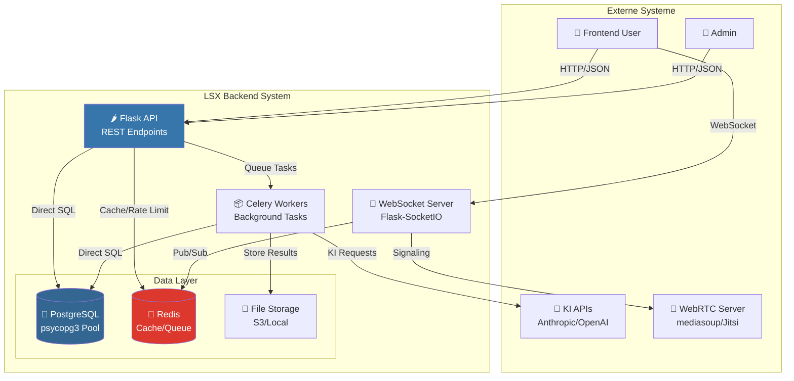
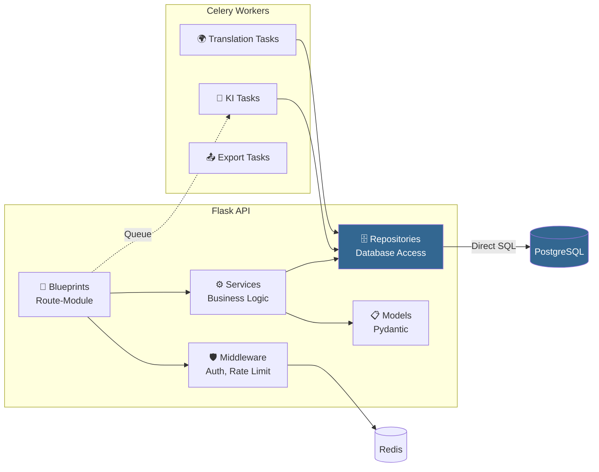
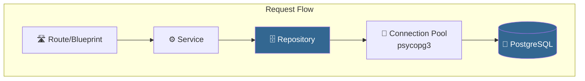
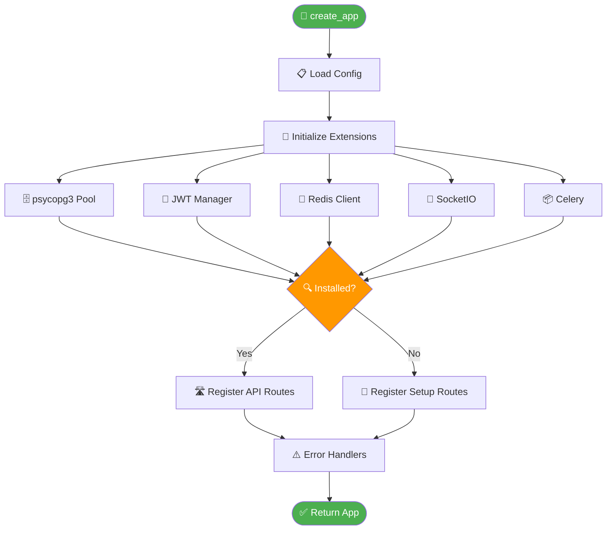
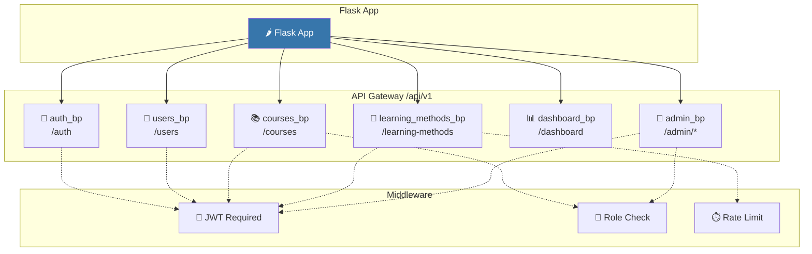
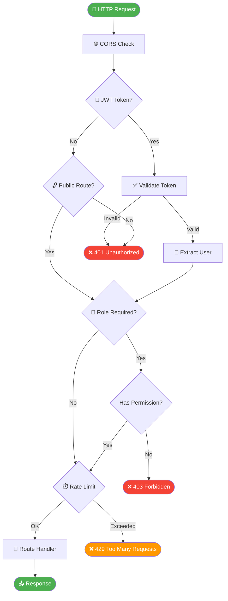
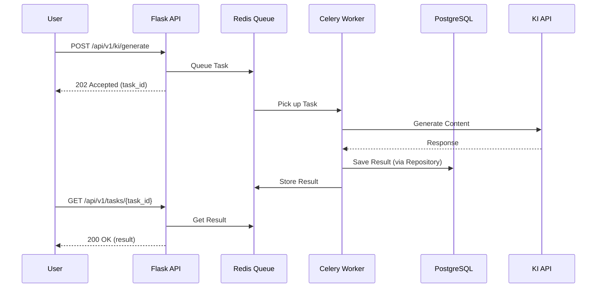
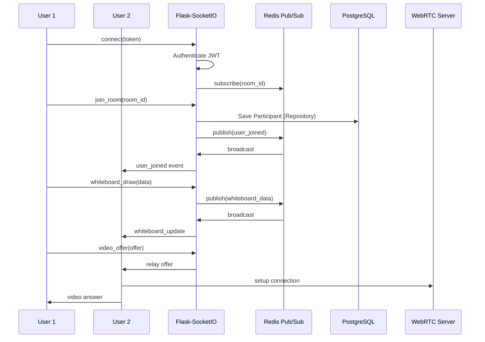
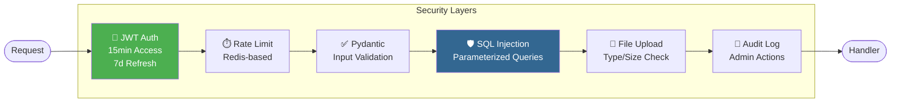

# 17 – Backend-Struktur (Final)

**Version:** 1.1
**Stand:** 01.12.2025

---

## Überblick

Dieses Dokument beschreibt die komplette Backend-Architektur des LSX Lernsystems.

Das Backend ist **modular**, **sicher**, **skalierbar** und **vollständig API-gesteuert**.

### 🛠️ Tech-Stack

| Technologie | Verwendung |
|------------|-----------|
| 🐍 **Python 3.12+** | Core Language |
| 🌶️ **Flask 3.0** | Web Framework (Blueprint-Architektur) |
| 🗃️ **psycopg 3** | PostgreSQL-Treiber mit Connection Pooling (**KEIN ORM**) |
| 🐘 **PostgreSQL** | Datenbank |
| 🔴 **Redis** | Caching, Rate Limits, Sessions, Celery Queue |
| 📦 **Celery** | Background Tasks (KI-Pipeline) |
| 🔌 **Flask-SocketIO** | WebSockets / Real-time (LiveRoom) |
| 🎥 **WebRTC** | Video/Audio (mediasoup/Jitsi) |
| 🔑 **JWT** | Authentication (Flask-JWT-Extended) |
| 📋 **Pydantic** | Request/Response Validation |

> ⚠️ **WICHTIG:** Dieses Projekt verwendet **KEIN ORM** (kein SQLAlchemy). Alle Datenbankoperationen erfolgen über direktes SQL mit psycopg und dem Repository-Pattern.

---

## 1. System-Architektur (C4 Model - Context)



---

## 2. Backend-Container (C4 Model - Component)



---

## 3. Projektstruktur (Backend-Verzeichnis)

```
/backend
├── /app
│   ├── __init__.py              # 🏭 Factory Pattern (create_app)
│   ├── config.py                # ⚙️ Configuration
│   ├── extensions.py            # 🔌 Flask Extensions
│   │
│   ├── /api                     # 🛣️ Flask Blueprints (Routes)
│   │   ├── __init__.py
│   │   ├── auth.py              # /api/v1/auth
│   │   ├── users.py             # /api/v1/users
│   │   ├── courses.py           # /api/v1/courses
│   │   ├── learning_methods.py  # /api/v1/learning-methods
│   │   ├── admin_*.py           # /api/v1/admin/*
│   │   ├── dashboard.py         # /api/v1/dashboard
│   │   └── ...
│   │
│   ├── /models                  # 📋 Pydantic Models (Validation)
│   │   ├── user.py
│   │   ├── course.py
│   │   ├── learning_method.py
│   │   └── ...
│   │
│   ├── /repositories            # 🗄️ Database Access Layer (Direct SQL)
│   │   ├── base_repository.py   # 🔧 Connection Pool Management
│   │   ├── user_repository.py
│   │   ├── course_repository.py
│   │   ├── learning_method_instance_repository.py
│   │   └── ...
│   │
│   ├── /services                # ⚙️ Business Logic
│   │   ├── ai_adapter.py
│   │   ├── billing_service.py
│   │   └── ...
│   │
│   ├── /ki                      # 🤖 KI/AI System
│   │   ├── learning_method_mapping.py  # 32 Lernmethoden (LM00-LM31)
│   │   ├── prompts/             # KI Prompt Templates
│   │   └── ...
│   │
│   ├── /middleware              # 🛡️ Custom Middleware
│   │   ├── auth.py
│   │   └── ...
│   │
│   ├── /gateway                 # 🚪 API Gateway
│   │   └── routes.py
│   │
│   ├── /security                # 🔒 Security
│   │   └── rate_limiting.py
│   │
│   └── /monitoring              # 📊 Monitoring
│       └── prometheus.py
│
├── /setup                       # 🧙 Setup Wizard
│   ├── routes.py
│   ├── db_init.py
│   ├── admin_setup.py
│   └── seeds.py
│
├── /database                    # 📁 SQL Migration Files
│   ├── 001_initial.sql
│   ├── 002_roles.sql
│   ├── ...
│   └── 046_xxx.sql
│
├── /storage                     # 📁 File Storage
│   ├── /uploads
│   ├── /liveroom
│   └── /ki
│
├── run.py                       # 🚀 Development Server Entry
├── wsgi.py                      # 🏭 Production Server Entry
├── requirements.txt
└── .env
```

---

## 4. Kern-Architektur: Repository Pattern (KEIN ORM)

### ⚠️ Wichtig: Dieses Projekt verwendet KEIN ORM

Alle Datenbankoperationen erfolgen über das **Repository Pattern** mit direktem SQL.



### 🔧 BaseRepository

```python
# app/repositories/base_repository.py
from typing import Optional, List, Dict, Any
from psycopg_pool import ConnectionPool
from app.config import Config

class BaseRepository:
    """
    Basis-Repository mit Connection Pool Management.
    ALLE Repositories erben von dieser Klasse.
    """

    _pool: Optional[ConnectionPool] = None

    @classmethod
    def get_pool(cls) -> ConnectionPool:
        """Gibt den Connection Pool zurück (Singleton)"""
        if cls._pool is None:
            cls._pool = ConnectionPool(
                conninfo=Config.DATABASE_URL,
                min_size=Config.DB_POOL_MIN_SIZE,
                max_size=Config.DB_POOL_MAX_SIZE
            )
        return cls._pool

    @classmethod
    def fetch_one(cls, query: str, params: tuple = ()) -> Optional[Dict[str, Any]]:
        """Führt Query aus und gibt ein Ergebnis zurück"""
        with cls.get_pool().connection() as conn:
            with conn.cursor() as cur:
                cur.execute(query, params)
                row = cur.fetchone()
                if row:
                    columns = [desc[0] for desc in cur.description]
                    return dict(zip(columns, row))
                return None

    @classmethod
    def fetch_all(cls, query: str, params: tuple = ()) -> List[Dict[str, Any]]:
        """Führt Query aus und gibt alle Ergebnisse zurück"""
        with cls.get_pool().connection() as conn:
            with conn.cursor() as cur:
                cur.execute(query, params)
                rows = cur.fetchall()
                columns = [desc[0] for desc in cur.description]
                return [dict(zip(columns, row)) for row in rows]

    @classmethod
    def execute(cls, query: str, params: tuple = ()) -> int:
        """Führt INSERT/UPDATE/DELETE aus und gibt affected rows zurück"""
        with cls.get_pool().connection() as conn:
            with conn.cursor() as cur:
                cur.execute(query, params)
                conn.commit()
                return cur.rowcount

    @classmethod
    def execute_returning(cls, query: str, params: tuple = ()) -> Optional[Dict[str, Any]]:
        """Führt INSERT/UPDATE mit RETURNING aus"""
        with cls.get_pool().connection() as conn:
            with conn.cursor() as cur:
                cur.execute(query, params)
                conn.commit()
                row = cur.fetchone()
                if row:
                    columns = [desc[0] for desc in cur.description]
                    return dict(zip(columns, row))
                return None
```

---

### 💡 Beispiel: UserRepository

```python
# app/repositories/user_repository.py
from typing import Optional, List, Dict, Any
from werkzeug.security import generate_password_hash, check_password_hash
import uuid
from app.repositories.base_repository import BaseRepository

class UserRepository(BaseRepository):
    """
    Repository für User-Datenbankoperationen.
    Verwendet direktes SQL - KEIN ORM!
    """

    @classmethod
    def find_by_id(cls, user_id: str) -> Optional[Dict[str, Any]]:
        """Findet User anhand der ID"""
        query = """
            SELECT u.*, r.role_name
            FROM users u
            LEFT JOIN roles r ON u.role_id = r.role_id
            WHERE u.user_id = %s AND u.status != 'deleted'
        """
        return cls.fetch_one(query, (user_id,))

    @classmethod
    def find_by_email(cls, email: str) -> Optional[Dict[str, Any]]:
        """Findet User anhand der E-Mail"""
        query = """
            SELECT u.*, r.role_name
            FROM users u
            LEFT JOIN roles r ON u.role_id = r.role_id
            WHERE u.email = %s AND u.status != 'deleted'
        """
        return cls.fetch_one(query, (email.lower(),))

    @classmethod
    def create(cls, data: Dict[str, Any]) -> Dict[str, Any]:
        """Erstellt einen neuen User"""
        user_id = str(uuid.uuid4())
        password_hash = generate_password_hash(data['password'])

        query = """
            INSERT INTO users (user_id, email, password_hash, firstname, lastname, role_id, language)
            VALUES (%s, %s, %s, %s, %s, %s, %s)
            RETURNING user_id, email, firstname, lastname, role_id, language, created_at
        """
        params = (
            user_id,
            data['email'].lower(),
            password_hash,
            data.get('firstname'),
            data.get('lastname'),
            data.get('role_id', 1),  # Default: free
            data.get('language', 'de')
        )
        return cls.execute_returning(query, params)

    @classmethod
    def verify_password(cls, email: str, password: str) -> Optional[Dict[str, Any]]:
        """Verifiziert User-Credentials"""
        user = cls.find_by_email(email)
        if user and check_password_hash(user['password_hash'], password):
            # Entferne password_hash aus dem Rückgabewert
            user.pop('password_hash', None)
            return user
        return None

    @classmethod
    def update(cls, user_id: str, data: Dict[str, Any]) -> Optional[Dict[str, Any]]:
        """Aktualisiert User-Daten"""
        # Dynamisches UPDATE mit nur übergebenen Feldern
        allowed_fields = ['firstname', 'lastname', 'language', 'role_id']
        updates = []
        params = []

        for field in allowed_fields:
            if field in data:
                updates.append(f"{field} = %s")
                params.append(data[field])

        if not updates:
            return cls.find_by_id(user_id)

        params.append(user_id)
        query = f"""
            UPDATE users
            SET {', '.join(updates)}, updated_at = NOW()
            WHERE user_id = %s
            RETURNING user_id, email, firstname, lastname, role_id, language, updated_at
        """
        return cls.execute_returning(query, tuple(params))
```

---

## 5. Factory Pattern

### 🏭 Application Factory

```python
# app/__init__.py
from flask import Flask
from app.config import config
from app.extensions import jwt, redis_client, socketio, celery
from setup.install_check import InstallationChecker

def create_app(config_name: str = 'development') -> Flask:
    """
    Application Factory Pattern.
    Erstellt und konfiguriert die Flask-Anwendung.
    """
    app = Flask(__name__)

    # Load Configuration
    app.config.from_object(config[config_name])

    # Initialize Extensions
    register_extensions(app)

    # Check Installation Status
    if InstallationChecker.is_installed():
        # Normal Mode: Register all API routes
        register_api_routes(app)
    else:
        # Setup Mode: Only setup routes available
        register_setup_routes(app)

    # Register Error Handlers
    register_error_handlers(app)

    return app

def register_extensions(app: Flask) -> None:
    """Initialisiert Flask Extensions"""
    jwt.init_app(app)
    redis_client.init_app(app)
    socketio.init_app(app, message_queue=app.config.get('REDIS_URL'))
    celery.conf.update(app.config)

def register_api_routes(app: Flask) -> None:
    """Registriert alle API Blueprints"""
    from app.api.auth import auth_bp
    from app.api.users import users_bp
    from app.api.courses import courses_bp
    from app.api.learning_methods import learning_methods_bp
    from app.api.dashboard import dashboard_bp
    # ... weitere Blueprints

    app.register_blueprint(auth_bp)
    app.register_blueprint(users_bp)
    app.register_blueprint(courses_bp)
    app.register_blueprint(learning_methods_bp)
    app.register_blueprint(dashboard_bp)
```

### 🔄 Factory Pattern Flow



---

## 6. Routes / Blueprints

### 🛣️ Blueprint-Architektur



### 📂 API Endpoints

| Blueprint | Prefix | Beschreibung |
|-----------|--------|--------------|
| `auth_bp` | `/api/v1/auth` | Login, Register, Refresh Token |
| `users_bp` | `/api/v1/users` | User Management |
| `profile_bp` | `/api/v1/profile` | User Profile |
| `courses_bp` | `/api/v1/courses` | Course CRUD |
| `learning_methods_bp` | `/api/v1/learning-methods` | 32 Lernmethoden (LM00-LM31) |
| `dashboard_bp` | `/api/v1/dashboard` | Dashboard Widgets |
| `tokens_bp` | `/api/v1/tokens` | Token Wallet |
| `subscriptions_bp` | `/api/v1/subscriptions` | Premium Subscriptions |
| `organisations_bp` | `/api/v1/organisations` | School/Company Management |
| `admin_*_bp` | `/api/v1/admin/*` | Admin Endpoints |

---

### 💡 Beispiel: auth.py (mit Repository Pattern)

```python
# app/api/auth.py
from flask import Blueprint, request, jsonify
from flask_jwt_extended import (
    create_access_token,
    create_refresh_token,
    jwt_required,
    get_jwt_identity
)
from pydantic import BaseModel, EmailStr, validator
from app.repositories.user_repository import UserRepository

auth_bp = Blueprint('auth', __name__, url_prefix='/api/v1/auth')

# Pydantic Models für Validierung
class RegisterRequest(BaseModel):
    email: EmailStr
    password: str
    firstname: str = None
    lastname: str = None

    @validator('password')
    def validate_password(cls, v):
        if len(v) < 8:
            raise ValueError('Passwort muss mindestens 8 Zeichen haben')
        return v

class LoginRequest(BaseModel):
    email: EmailStr
    password: str


@auth_bp.route('/register', methods=['POST'])
def register():
    """Registriert einen neuen User"""
    try:
        data = RegisterRequest(**request.get_json())
    except Exception as e:
        return jsonify({'success': False, 'error': str(e)}), 400

    # Prüfe ob Email bereits existiert
    existing = UserRepository.find_by_email(data.email)
    if existing:
        return jsonify({
            'success': False,
            'error': {'code': 'EMAIL_EXISTS', 'message': 'E-Mail bereits registriert'}
        }), 409

    # Erstelle User via Repository
    user = UserRepository.create({
        'email': data.email,
        'password': data.password,
        'firstname': data.firstname,
        'lastname': data.lastname
    })

    return jsonify({
        'success': True,
        'data': user
    }), 201


@auth_bp.route('/login', methods=['POST'])
def login():
    """Login mit Email und Passwort"""
    try:
        data = LoginRequest(**request.get_json())
    except Exception as e:
        return jsonify({'success': False, 'error': str(e)}), 400

    # Verifiziere Credentials via Repository
    user = UserRepository.verify_password(data.email, data.password)

    if not user:
        return jsonify({
            'success': False,
            'error': {'code': 'INVALID_CREDENTIALS', 'message': 'Ungültige Zugangsdaten'}
        }), 401

    # Erstelle JWT Tokens
    access_token = create_access_token(identity=user['user_id'])
    refresh_token = create_refresh_token(identity=user['user_id'])

    return jsonify({
        'success': True,
        'data': {
            'access_token': access_token,
            'refresh_token': refresh_token,
            'user': user
        }
    }), 200


@auth_bp.route('/refresh', methods=['POST'])
@jwt_required(refresh=True)
def refresh():
    """Erneuert Access Token"""
    user_id = get_jwt_identity()
    access_token = create_access_token(identity=user_id)

    return jsonify({
        'success': True,
        'data': {'access_token': access_token}
    }), 200
```

---

## 7. Middleware

### 🛡️ Middleware Stack



### 💡 Role Middleware (mit Repository)

```python
# app/middleware/auth.py
from functools import wraps
from flask import jsonify
from flask_jwt_extended import get_jwt_identity, verify_jwt_in_request
from app.repositories.user_repository import UserRepository

def require_role(allowed_roles: list):
    """
    Decorator zur Rollenprüfung.
    Verwendet Repository statt ORM!
    """
    def decorator(func):
        @wraps(func)
        def wrapper(*args, **kwargs):
            verify_jwt_in_request()
            user_id = get_jwt_identity()

            # User via Repository laden
            user = UserRepository.find_by_id(user_id)

            if not user:
                return jsonify({
                    'success': False,
                    'error': {'code': 'USER_NOT_FOUND', 'message': 'User nicht gefunden'}
                }), 404

            if user['role_name'] not in allowed_roles:
                return jsonify({
                    'success': False,
                    'error': {'code': 'FORBIDDEN', 'message': 'Keine Berechtigung'}
                }), 403

            return func(*args, **kwargs)
        return wrapper
    return decorator


def rate_limit(max_requests: int = 100, window: int = 60):
    """
    Rate Limiting Decorator mit Redis.
    """
    def decorator(func):
        @wraps(func)
        def wrapper(*args, **kwargs):
            from flask import request
            from app.extensions import redis_client

            client_id = request.remote_addr
            key = f"rate_limit:{func.__name__}:{client_id}"

            current = redis_client.get(key)

            if current and int(current) >= max_requests:
                return jsonify({
                    'success': False,
                    'error': {
                        'code': 'RATE_LIMIT_EXCEEDED',
                        'message': 'Zu viele Anfragen',
                        'retry_after': window
                    }
                }), 429

            pipe = redis_client.pipeline()
            pipe.incr(key)
            pipe.expire(key, window)
            pipe.execute()

            return func(*args, **kwargs)
        return wrapper
    return decorator
```

---

## 8. Background Tasks (Celery)

### 📦 Celery Architecture



### 💡 Beispiel: KI Tasks (mit Repository)

```python
# app/tasks/ki_tasks.py
from app.extensions import celery
from app.repositories.ki_request_repository import KIRequestRepository
from app.services.ai_adapter import AIAdapter
import anthropic

@celery.task(bind=True)
def generate_content_task(self, ki_request_id: str, prompt: str, user_id: str):
    """
    Background Task für KI-Generierung.
    Verwendet Repository Pattern - KEIN ORM!
    """
    try:
        self.update_state(state='PROGRESS', meta={'status': 'Generiere Inhalt...'})

        # KI Request Status aktualisieren
        KIRequestRepository.update_status(ki_request_id, 'processing')

        # Anthropic API Call
        client = anthropic.Anthropic()
        response = client.messages.create(
            model="claude-sonnet-4-20250514",
            max_tokens=4000,
            messages=[{"role": "user", "content": prompt}]
        )

        # Ergebnis speichern via Repository
        KIRequestRepository.complete(
            ki_request_id=ki_request_id,
            output=response.content[0].text,
            tokens_used=response.usage.input_tokens + response.usage.output_tokens
        )

        return {
            'status': 'completed',
            'ki_request_id': ki_request_id,
            'tokens_used': response.usage.input_tokens + response.usage.output_tokens
        }

    except Exception as e:
        KIRequestRepository.update_status(ki_request_id, 'failed', error=str(e))
        self.update_state(state='FAILURE', meta={'error': str(e)})
        raise


@celery.task
def translate_content_task(content_type: str, content_id: str, target_language: str):
    """Background Task für Übersetzungen"""
    from app.services.translation_service import TranslationService

    result = TranslationService.translate_content(
        content_type=content_type,
        content_id=content_id,
        target_language=target_language
    )

    return result
```

---

## 9. WebSockets für LiveRoom

### 🎥 WebSocket Architektur



### 💡 LiveRoom WebSocket Handler (mit Repository)

```python
# app/api/liveroom_socket.py
from flask import request
from flask_socketio import emit, join_room, leave_room
from flask_jwt_extended import decode_token
from app.extensions import socketio
from app.repositories.liveroom_repository import LiveRoomRepository
from app.repositories.liveroom_participant_repository import LiveRoomParticipantRepository

@socketio.on('connect')
def handle_connect():
    """WebSocket Verbindung"""
    token = request.args.get('token')

    try:
        decoded = decode_token(token)
        request.user_id = decoded['sub']
        emit('connected', {'status': 'success'})
    except Exception:
        return False  # Reject connection


@socketio.on('join_room')
def handle_join_room(data):
    """User tritt LiveRoom bei"""
    room_id = data['room_id']
    user_id = request.user_id

    # Raum prüfen via Repository
    room = LiveRoomRepository.find_by_id(room_id)
    if not room:
        emit('error', {'message': 'Raum nicht gefunden'})
        return

    # Socket.IO Room beitreten
    join_room(room_id)

    # Teilnehmer speichern via Repository
    LiveRoomParticipantRepository.create({
        'room_id': room_id,
        'user_id': user_id,
        'role': data.get('role', 'participant')
    })

    # Andere benachrichtigen
    emit('user_joined', {
        'user_id': user_id,
        'username': data.get('username')
    }, room=room_id, skip_sid=request.sid)


@socketio.on('whiteboard_draw')
def handle_whiteboard_draw(data):
    """Whiteboard Zeichnung"""
    room_id = data['room_id']

    # An alle im Raum senden
    emit('whiteboard_update', {
        'user_id': request.user_id,
        'drawing_data': data['drawing_data']
    }, room=room_id, skip_sid=request.sid)

    # Async speichern
    from app.tasks.liveroom_tasks import save_whiteboard_task
    save_whiteboard_task.delay(room_id, data['drawing_data'])


@socketio.on('leave_room')
def handle_leave_room(data):
    """User verlässt LiveRoom"""
    room_id = data['room_id']
    user_id = request.user_id

    leave_room(room_id)

    # Teilnehmer entfernen via Repository
    LiveRoomParticipantRepository.remove(room_id, user_id)

    emit('user_left', {'user_id': user_id}, room=room_id)
```

---

## 10. Sicherheit

### 🔒 Security Stack



### 🛡️ Security Features

| Feature | Implementation |
|---------|---------------|
| 🔑 **JWT Rotation** | 15min Access Token, 7d Refresh Token |
| ⏱️ **Rate Limits** | 100 req/min User, 10 req/min KI |
| 🛡️ **SQL Injection** | Parameterized Queries (psycopg3) |
| ✅ **Input Validation** | Pydantic Models |
| 👥 **RBAC** | Role-based Middleware |
| 📝 **Audit Logging** | Alle Admin-Aktionen |
| 🔒 **Password Hashing** | bcrypt (cost factor 12) |
| 🚫 **XSS Protection** | Input Sanitization |

---

## 11. Zusammenfassung

### ✅ LSX Backend Features

| Feature | Status | Technologie |
|---------|--------|-------------|
| 🧩 **Modular** | ✅ | Blueprint-Architektur |
| 🗄️ **Database** | ✅ | psycopg3 + Repository Pattern (**KEIN ORM**) |
| 👥 **Rollenbasiert** | ✅ | Middleware Decorators |
| 🔒 **Sicher** | ✅ | JWT, Rate Limit, Pydantic |
| ⚡ **Performant** | ✅ | Connection Pooling, Redis Cache |
| 🤖 **KI-integriert** | ✅ | Anthropic/OpenAI APIs |
| 🏗️ **Factory Pattern** | ✅ | Clean Architecture |
| 📦 **Async Tasks** | ✅ | Celery Workers |
| 🎥 **Real-time** | ✅ | Flask-SocketIO, WebRTC |
| 🔌 **REST API** | ✅ | Versioniert (/api/v1) |

### 💡 Architektur-Übersicht

```
┌─────────────────────────────────────────────────────────────┐
│  🐍 Python 3.12+                                            │
│  🌶️ Flask 3.0 (Blueprint Pattern)                          │
│  🗄️ psycopg3 + Repository Pattern (KEIN ORM!)              │
│  🐘 PostgreSQL (Connection Pooling)                         │
│  🔴 Redis (Cache/Queue/Sessions)                            │
│  📦 Celery (Background Tasks)                               │
│  🔌 Flask-SocketIO (WebSockets)                             │
│  🔑 JWT Authentication (Flask-JWT-Extended)                 │
│  📋 Pydantic (Validation)                                   │
│  🤖 Anthropic/OpenAI APIs                                   │
└─────────────────────────────────────────────────────────────┘
```

---

## 📌 Dokument abgeschlossen

**Version:** 1.1
**Status:** Final
**Letzte Aktualisierung:** 01.12.2025

---

> ⚠️ **WICHTIG:** Dieses Projekt verwendet **KEIN ORM** (kein SQLAlchemy). Alle Datenbankoperationen erfolgen über direktes SQL mit psycopg3 und dem Repository Pattern. Siehe `app/repositories/base_repository.py` für die Implementierung.
