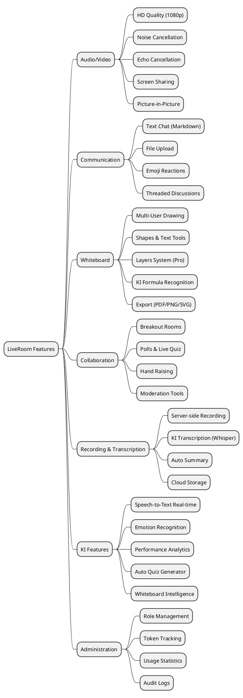
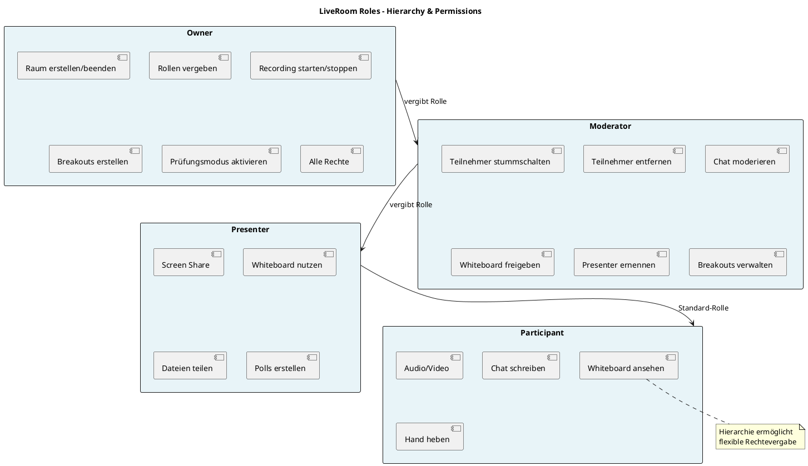
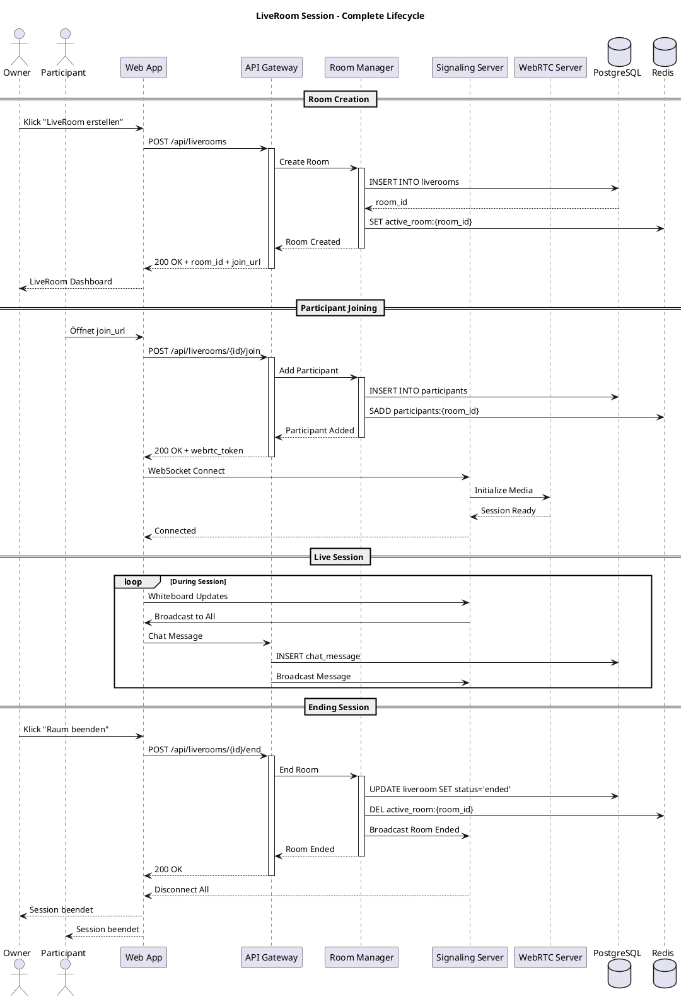
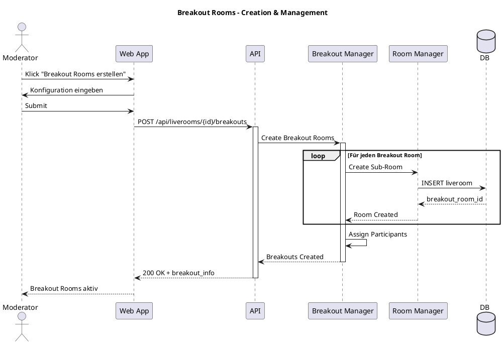
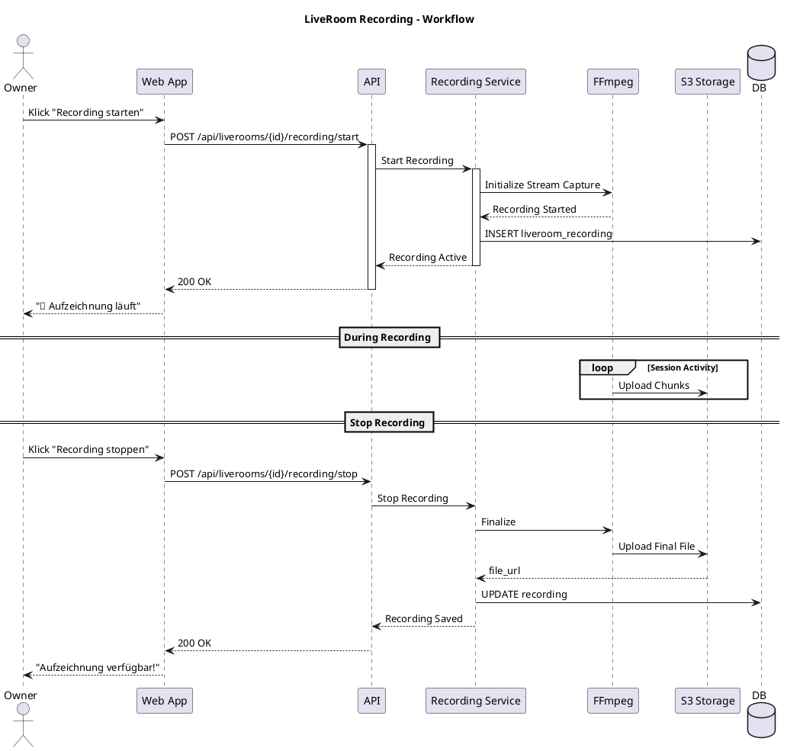

# 21 – LiveRoom-System (Final)

**Version:** 2.0
**Stand:** Vollständig

---

## Überblick

Das **LSX LiveRoom-System** ist eine vollständig integrierte **WebRTC-basierte Lösung** für:

- 🎥 **Synchrone Online-Lernumgebungen**
- 🏫 **Digitale Klassenräume**
- 👥 **Interaktive Gruppensessions**
- 📝 **Online-Prüfungen**
- 🤖 **KI-gestützte Live-Analyse**

---

## 1. Ziele des LiveRoom-Systems

### 🎯 Hauptziele

| Nr. | Ziel | Beschreibung |
|-----|------|-------------|
| 1 | 🎥 **Virtuelle Lernräume** | Online-Lernsessions in Echtzeit |
| 2 | 💬 **Synchrone Kommunikation** | Audio, Video, Chat |
| 3 | 🤖 **KI-Unterstützung** | Live-Analyse & Feedback |
| 4 | 👥 **Skalierbare Umgebung** | Von 1-zu-1 bis 500+ Teilnehmer |
| 5 | 🖊️ **Interaktive Zusammenarbeit** | Kollaboratives Whiteboard |
| 6 | 📹 **Aufzeichnungen** | Session-Recording für spätere Nutzung |
| 7 | ♿ **Barrierefrei** | WCAG 2.1 AA konform |
| 8 | 🔒 **Sicher & DSGVO-konform** | Ende-zu-Ende verschlüsselt |

---

## 2. System-Architektur

### 🏗️ LiveRoom System Context (C4 Model)

```plantuml
@startuml
!include https://raw.githubusercontent.com/plantuml-stdlib/C4-PlantUML/master/C4_Context.puml

title LiveRoom-System - System Context

Person(teacher, "Lehrer/Dozent", "Unterrichtet online & hostet")
Person(student, "Schüler/Teilnehmer", "Nimmt an Klasse teil")
Person(creator, "Creator", "Hosting für Gruppen")
Person(company, "Unternehmen", "Team-Meetings & Training")
Person(admin, "Org Admin", "Verwaltet Räume & Statistiken")

System(lsx, "LSX LernSystem", "Zentrale Lernplattform")

System_Ext(webrtc, "WebRTC Server", "mediasoup/Jitsi")
System_Ext(storage, "Cloud Storage", "S3 für Recordings")
System_Ext(ki_service, "KI Services", "Anthropic/OpenAI")

Rel(teacher, lsx, "Erstellt LiveRoom", "HTTPS")
Rel(student, lsx, "Tritt bei", "HTTPS")
Rel(creator, lsx, "Hostet Session", "HTTPS")
Rel(company, lsx, "Team-Meeting", "HTTPS")
Rel(admin, lsx, "Verwaltet", "HTTPS")

Rel(lsx, webrtc, "Video/Audio Streaming", "WebRTC")
Rel(lsx, storage, "Speichert Aufzeichnungen", "S3 API")
Rel(lsx, ki_service, "Analysiert Whiteboard & Audio", "REST API")

note right of lsx
  Zentrale Platform für:
  - Room Management
  - Participant Control
  - Recording
  - Analytics
end note

@enduml
```

---

### 🧩 Container-Architektur (C4 Model)

```plantuml
@startuml
!include https://raw.githubusercontent.com/plantuml-stdlib/C4-PlantUML/master/C4_Container.puml

title LiveRoom-System - Container Diagram

Person(user, "User")

System_Boundary(lsx_boundary, "LSX System") {
    Container(web, "Web App", "Vue.js", "User Interface")
    Container(api, "API Gateway", "Flask", "REST API")

    Container_Boundary(liveroom_system, "LiveRoom System") {
        Container(room_manager, "Room Manager", "Python", "Session Management")
        Container(signaling, "Signaling Server", "WebSocket", "WebRTC Signaling")
        Container(whiteboard_sync, "Whiteboard Sync", "WebSocket", "Real-time Collaboration")
        Container(recording_service, "Recording Service", "FFmpeg", "Video Recording")
        Container(ki_analyzer, "KI Analyzer", "Python", "Whiteboard & Audio AI")
        Container(breakout_manager, "Breakout Manager", "Python", "Group Rooms")
        Container(transcript_service, "Transcript Service", "Whisper", "Speech-to-Text")
    }

    ContainerDb(db, "PostgreSQL", "SQL Database", "Rooms, Recordings, Analytics")
    ContainerDb(redis, "Redis", "Cache & Pub/Sub", "Active Sessions, Real-time State")
    ContainerDb(storage, "S3 Storage", "Object Storage", "Recordings, Whiteboards")
}

System_Ext(webrtc_server, "WebRTC Media Server", "mediasoup")
System_Ext(ki_api, "KI APIs", "Anthropic/OpenAI")

Rel(user, web, "Nutzt LiveRoom", "HTTPS/WebRTC")
Rel(web, api, "API Calls", "JSON/REST")
Rel(web, signaling, "WebSocket Connection", "WSS")
Rel(web, whiteboard_sync, "Whiteboard Updates", "WSS")

Rel(api, room_manager, "Manage Rooms", "Internal")
Rel(room_manager, db, "Store Room Data", "SQL")
Rel(room_manager, redis, "Active Sessions", "Redis Protocol")

Rel(signaling, webrtc_server, "Media Streaming", "WebRTC")
Rel(whiteboard_sync, ki_analyzer, "Analyze Drawings", "Internal")
Rel(ki_analyzer, ki_api, "AI Analysis", "HTTPS")
Rel(recording_service, storage, "Store Recordings", "S3 API")
Rel(transcript_service, ki_api, "Transcribe Audio", "HTTPS")
Rel(breakout_manager, room_manager, "Create Sub-Rooms", "Internal")

note right of liveroom_system
  Microservices Architecture:
  - Scalable
  - Fault-tolerant
  - Real-time capable
end note

@enduml
```

---

### 🔧 Technologie-Stack

| Komponente | Technologie | Verwendung |
|------------|-------------|-----------|
| 🎨 **Frontend** | Vue.js, WebRTC, Canvas | UI & Real-time Communication |
| 🐍 **Backend** | Flask, FastAPI | API & Async Event Processing |
| 📡 **Kommunikation** | WebSocket, WebRTC | Chat, Whiteboard, A/V Streaming |
| 💾 **Cache & Queue** | Redis Pub/Sub | Real-time State, Event Distribution |
| 🗄️ **Datenbank** | PostgreSQL | Rooms, Participants, Analytics |
| 📦 **Speicher** | S3 Compatible | Recordings, Whiteboards |
| 🤖 **KI** | Whisper, Claude, GPT-4, Ollama | Transcription, Analysis |

---

## 3. Hauptfunktionen

### 🎯 Feature-Übersicht (Mindmap)



---

### 📋 Detaillierte Feature-Liste

| Kategorie | Features | Details |
|-----------|----------|---------|
| 🎥 **Video/Audio** | HD Konferenz | Bis zu 500 Teilnehmer, 1080p |
| | Rauschunterdrückung | KI-basierte Audio-Optimierung |
| | Echo-Cancellation | Automatisch |
| | Screen Sharing | Multiple Streams gleichzeitig |
| 💬 **Chat** | Markdown Support | Formatierter Text |
| | File Upload | Bis 100MB (Org-abhängig) |
| | Reactions | Emoji, Thumbs-up |
| | Threads | Strukturierte Diskussionen |
| 🎨 **Whiteboard** | Multi-User Drawing | Echtzeit-Synchronisation |
| | Tools | Pen, Shapes, Text, Eraser |
| | Layers (Pro) | Komplexe Diagramme |
| | KI-Erkennung | Formeln, Diagramme, Netzwerke |
| | Export | PDF, PNG, SVG |
| 🚪 **Breakout Rooms** | Auto/Manual | Automatische oder manuelle Zuweisung |
| | Broadcast | Nachrichten an alle Räume |
| | Timer | Automatisches Zusammenführen |
| 📹 **Recording** | Server-side | Keine Client-Last |
| | Format | MP4 (H.264 + AAC) |
| | Storage | Cloud S3 |

---

## 4. Feature-Vergleich nach Tarifen

### 💎 Tarif-Matrix: Free vs Premium vs Organizations

| Feature | Free | Premium | Schule BASIC | Schule PRO | Unternehmen |
|---------|:----:|:-------:|:------------:|:----------:|:-----------:|
| 👥 **Max. Teilnehmer** | ❌ | 4 | 50 | 500+ | Unbegrenzt |
| ⏱️ **Max. Dauer** | – | 2h | 4h | Unbegrenzt | Unbegrenzt |
| 🎥 **Video Quality** | – | 720p | 1080p | 1080p | 1080p |
| 💬 **Chat** | ❌ | ✅ | ✅ | ✅ | ✅ |
| 🖥️ **Screen Share** | ❌ | ✅ | ✅ | ✅ | ✅ |
| 🎨 **Whiteboard Basic** | ❌ | ✅ | ✅ | ✅ | ✅ |
| 🖊️ **Whiteboard Pro** | ❌ | ❌ | ⚠️ Limited | ✅ | ✅ |
| 🤖 **KI Whiteboard** | ❌ | ❌ | Basis | Voll | Voll |
| 📁 **File Upload** | ❌ | 10 MB | 50 MB | 100 MB | 100 MB |
| 🚪 **Breakout Rooms** | ❌ | ❌ | 5/Raum | 20+/Raum | Unbegrenzt |
| 📹 **Recording** | ❌ | ❌ | ✅ Manual | ✅ Auto | ✅ Auto |
| 🎯 **KI Transcription** | ❌ | ❌ | Nachträglich | Echtzeit | Echtzeit |
| 📊 **Analytics** | ❌ | Basic | Standard | Extended + KI | Full + Custom |
| 📝 **Prüfungsmodus** | ❌ | ❌ | ✅ | ✅ | ✅ |
| 🎨 **Branding** | ❌ | ❌ | Logo + Farben | Domain + Full | Domain + Full |
| 🔌 **API Access** | ❌ | ❌ | ❌ | ✅ | ✅ |
| 🪙 **Token Pool** | – | – | 10k/Monat | 50k/Monat | Custom |
| 🎥 **Gleichzeitige Räume** | – | 1 | 3 | Unbegrenzt | Unbegrenzt |

---

### 🏢 Organisations-Tarife: BASIC vs PRO

```plantuml
@startuml
title Organization Tiers - Feature Comparison

package "Organization BASIC" #LightBlue {
  card "Limits" {
    :🎥 Max 3 Räume gleichzeitig;
    :👥 50 Teilnehmer/Raum;
    :⏱️ 4h Max. Dauer;
    :📹 2 Prüfungsräume;
  }
  
  card "Features" {
    :🎨 Whiteboard Basis;
    :🤖 KI Nachträglich;
    :📹 Recording Manuell;
    :📊 Standard Analytics;
    :🚪 5 Breakouts/Raum;
  }
  
  card "Branding" {
    :Logo + Farben;
  }
}

package "Organization PRO" #Gold {
  card "Limits" {
    :🎥 Unbegrenzte Räume;
    :👥 500+ Teilnehmer/Raum;
    :⏱️ Unbegrenzte Dauer;
    :📹 Unbegrenzte Prüfungen;
  }
  
  card "Features" {
    :🎨 Whiteboard Pro + AI;
    :🤖 KI Echtzeit + Summary;
    :📹 Recording Auto + Cloud;
    :📊 Extended Analytics + KI;
    :🚪 20+ Breakouts/Raum;
  }
  
  card "Branding" {
    :Domain + Full Branding;
    :Custom Theme;
  }
  
  card "Advanced" {
    :🔌 API Access;
    :🪙 50k Token Pool;
    :📈 Custom Reports;
  }
}

note bottom
  PRO Tier für:
  - Große Schulen
  - Universitäten
  - Unternehmen
  - Bildungsträger
end note

@enduml
```

---

## 5. Rollen & Berechtigungen (RBAC)

### 👥 Rollen-Hierarchie



---

### 🔐 Detaillierte Berechtigungs-Matrix

| Funktion | Owner | Moderator | Presenter | Participant |
|----------|:-----:|:---------:|:---------:|:-----------:|
| 🚀 **Raum erstellen** | ✅ | ❌ | ❌ | ❌ |
| 🏁 **Raum beenden** | ✅ | ✅ | ❌ | ❌ |
| 👤 **Rollen vergeben** | ✅ | ⚠️ Limited | ❌ | ❌ |
| 🔇 **User muten** | ✅ | ✅ | ❌ | ❌ |
| 🚪 **User entfernen** | ✅ | ✅ | ❌ | ❌ |
| 🖥️ **Screen Share** | ✅ | ✅ | ✅ | ❌ |
| 🖊️ **Whiteboard nutzen** | ✅ | ✅ | ✅ | ⚠️ Optional |
| 🎨 **Whiteboard löschen** | ✅ | ✅ | ❌ | ❌ |
| 👥 **Breakouts erstellen** | ✅ | ✅ | ❌ | ❌ |
| 📹 **Recording starten** | ✅ | ✅ | ❌ | ❌ |
| 📎 **Dateien teilen** | ✅ | ✅ | ✅ | ❌ |
| 📊 **Polls erstellen** | ✅ | ✅ | ✅ | ❌ |
| 💬 **Chat** | ✅ | ✅ | ✅ | ✅ |
| 💬 **Chat moderieren** | ✅ | ✅ | ❌ | ❌ |
| 🎤 **Audio/Video** | ✅ | ✅ | ✅ | ✅ |
| ✋ **Hand heben** | ✅ | ✅ | ✅ | ✅ |
| 📝 **Prüfung starten** | ✅ | ✅ | ❌ | ❌ |
| 📊 **Analytics einsehen** | ✅ | ✅ | ⚠️ Eigene | ⚠️ Eigene |

---

## 6. LiveRoom Session Workflow

### 🔄 Komplett-Workflow: Von Erstellung bis Ende



---

## 7. Whiteboard-System

### 🎨 Whiteboard-Architektur

```plantuml
@startuml
!include https://raw.githubusercontent.com/plantuml-stdlib/C4-PlantUML/master/C4_Component.puml

title Whiteboard System - Component Architecture

Container_Boundary(whiteboard, "Whiteboard System") {
    Component(canvas, "Canvas Renderer", "HTML5 Canvas", "Drawing Surface")
    Component(tools, "Tool Manager", "Vue", "Drawing Tools & Controls")
    Component(sync, "Sync Engine", "WebSocket", "Real-time Delta Sync")
    Component(history, "History Manager", "JavaScript", "Undo/Redo Stack")
    Component(ki_integration, "KI Integration", "Python", "AI Analysis Service")
    Component(export, "Export Manager", "Python", "PDF/PNG/SVG Export")
    Component(layers, "Layer Manager", "JavaScript", "Layer System (Pro)")

    Component_Boundary(tools_panel, "Drawing Tools") {
        Component(pen, "Pen Tool", "Freehand Drawing")
        Component(shapes, "Shapes Tool", "Geometric Shapes")
        Component(text, "Text Tool", "Text Insertion")
        Component(eraser, "Eraser Tool", "Delete Elements")
        Component(colors, "Color Picker", "Color Selection")
        Component(marker, "Marker Tool", "Highlighter")
    }
}

ContainerDb(redis, "Redis", "Pub/Sub", "Whiteboard State")
System_Ext(ki_api, "KI APIs", "Claude Vision, GPT-4")

Rel(tools, canvas, "Draw Commands")
Rel(canvas, sync, "Delta Updates")
Rel(sync, redis, "Publish Changes")
Rel(sync, history, "Log Actions")
Rel(canvas, ki_integration, "Analyze Drawing")
Rel(ki_integration, ki_api, "AI Requests")
Rel(canvas, export, "Export Board")
Rel(layers, canvas, "Manage Layers")

@enduml
```

---

### 📋 Whiteboard-Features

#### Basic Features (alle Varianten)

| Tool | Beschreibung | Shortcut | Features |
|------|-------------|----------|----------|
| ✏️ **Pen** | Freihand-Zeichnen | P | Variable Strichstärke, Glättung |
| 📝 **Text** | Text einfügen | T | Fonts, Größen, Farben |
| 🔷 **Shapes** | Geometrische Formen | S | Rechteck, Kreis, Linie, Polygon |
| 🖍️ **Marker** | Hervorheben | M | Transparente Farben |
| 🧹 **Eraser** | Löschen | E | Präzise oder Bereich-Löschen |
| 🎨 **Colors** | Farbpalette | C | RGB, Hex, Favoriten |
| 📄 **Pages** | Mehrere Seiten | +/- | Unbegrenzt viele Seiten |
| ↩️ **Undo/Redo** | Rückgängig | Ctrl+Z/Y | 100 Schritte History |
| 💾 **Auto-Save** | Automatisch | – | Alle 30s in Redis |

#### Pro Features (LiveRoom Pro)

| Feature | Beschreibung | Use Case |
|---------|-------------|----------|
| 🎭 **Layers** | Ebenen-System | Komplexe Diagramme, Überlagern |
| 🖼️ **Image Upload** | Bilder einfügen | Präsentationen, Referenzen |
| 📊 **Diagram Tools** | Flowcharts, UML, Wireframes | IT-Unterricht, Design |
| 📋 **Tables** | Strukturierte Tabellen | BWL, Mathe, Datenanalyse |
| 🔢 **Formula Recognition** | LaTeX Auto-Erkennung | Mathematik, Physik |
| 🌐 **Network Diagrams** | IT-Infrastruktur | Netzwerk-Training, DevOps |
| 🤖 **KI-Feedback** | Intelligente Analyse | Alle Fächer |
| 💾 **Export** | PDF, PNG, SVG | Dokumentation, Archivierung |
| 🎨 **Templates** | Vorgefertigte Layouts | Schnellstart |
| 📐 **Grid & Snap** | Raster & Snapping | Präzise Diagramme |

---

## 8. Breakout Rooms

### 👥 Breakout Room Management



---

### 📋 Breakout Room Features

| Feature | Beschreibung | BASIC | PRO |
|---------|-------------|:-----:|:---:|
| **Max. Breakouts** | Anzahl gleichzeitiger Räume | 5 | 20+ |
| **Auto-Zuweisung** | Gleichmäßige Verteilung | ✅ | ✅ |
| **Manuelle Zuweisung** | Owner wählt Gruppen | ✅ | ✅ |
| **Eigenes Whiteboard** | Pro Breakout Room | ✅ | ✅ |
| **Broadcast Messages** | An alle Räume | ✅ | ✅ |
| **Timer** | Auto-Rückkehr nach Zeit | ✅ | ✅ |
| **Räume zusammenführen** | Merge Breakouts | ❌ | ✅ |
| **Pre-Assignment** | Vor Session zuweisen | ❌ | ✅ |

---

## 9. Recording-System

### 📹 Recording Workflow



---

### 📊 Recording-Spezifikationen

| Option | Wert | Beschreibung |
|--------|------|-------------|
| **Format** | MP4 | Container-Format |
| **Video Codec** | H.264 | High Compatibility |
| **Audio Codec** | AAC | 128 kbps |
| **Auflösung** | 1920x1080 | Full HD |
| **Framerate** | 30 FPS | Smooth Playback |
| **Bitrate Video** | 2500 kbps | Hohe Qualität |
| **Speicherort** | S3 Bucket | Encrypted |
| **Retention** | 365 Tage | Standard |

---

## 10. Zusammenfassung

### ✅ LiveRoom-System Basis

| Feature | Status |
|---------|--------|
| 🏗️ **Architektur** | ✅ Microservices, C4 Model |
| 🎥 **WebRTC** | ✅ mediasoup Server |
| 🎨 **Whiteboard** | ✅ Real-time Collaboration |
| 👥 **Rollen** | ✅ RBAC System |
| 🚪 **Breakouts** | ✅ Auto & Manual |
| 📹 **Recording** | ✅ Server-side MP4 |
| 📊 **Analytics** | ✅ Participation Tracking |

---

## 📌 Dokument abgeschlossen

**Version:** 2.0
**Stand:** Final
**Teil:** Vollständig

---

> 💡 **Hinweis:** Dieses Dokument beschreibt die vollständige Architektur und Features des LiveRoom-Systems inklusive KI-Integration, Prüfungsmodus, API-Details und Sicherheit.