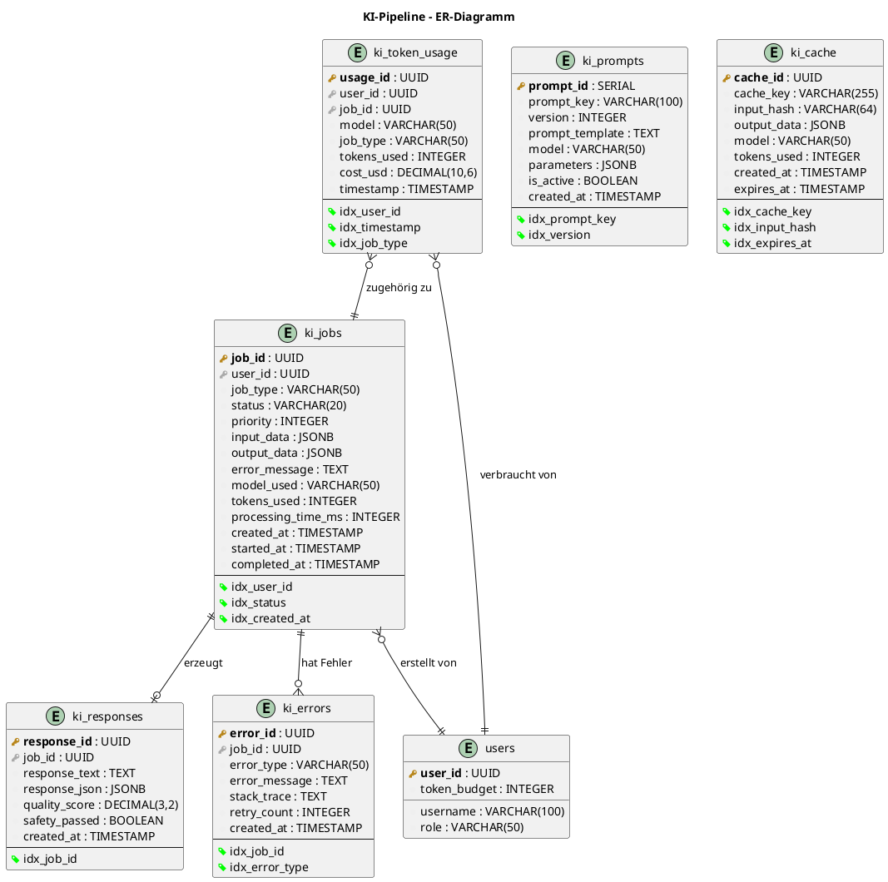
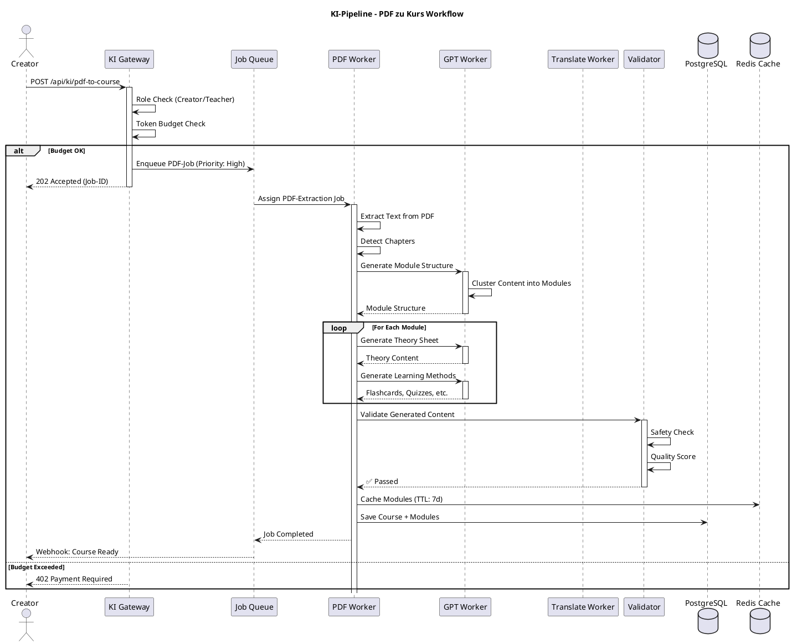
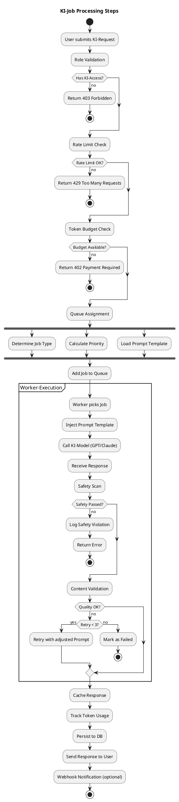
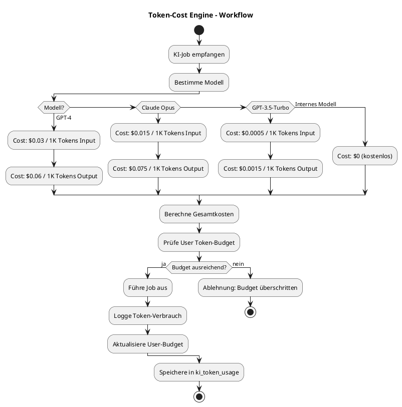
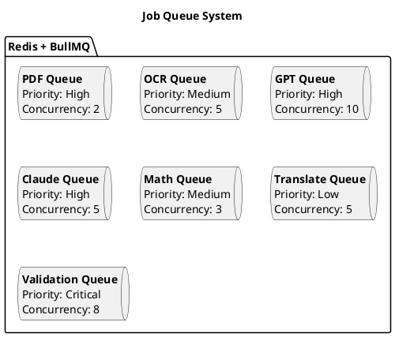
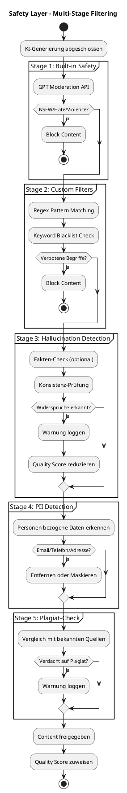

# 22 – KI-Pipeline-Deep (Final)

**Version:** 1.0
**Stand:** Final

---

## Überblick

Das **KI-Backend** ist das Herzstück des LSX-Lernsystems und verantwortlich für alle intelligenten Funktionen wie Content-Generierung, Übersetzungen, Prüfungssimulationen, Whiteboard-Erkennung und personalisierte Empfehlungen.

### 🎯 Kernziele

- 🎨 **Hochpräzise Inhalte** – Qualitativ hochwertige KI-Generierung
- ⚡ **Skalierbar & Fehlertolerant** – Job-Queue-basierte Verarbeitung
- 🤖 **Multi-Modell-Orchestrierung** – GPT-4, Claude, lokale Modelle
- 💰 **Kostenkontrolle** – Token-Tracking & Budget-Management
- 🌍 **Mehrsprachig** – 20 Sprachen unterstützt
- 📄 **Multi-Format** – PDF, Video, Text, Bilder
- 🎓 **Domänenwissen** – IT, IHK, CompTIA, Schulfächer
- 📝 **Standardisierte Prompts** – Versionierte Prompt-Templates
- 🔒 **Missbrauchssicher** – Content-Filter & Safety-Layer

---

## Systemarchitektur

### 🏗️ C4 Context Diagram

```plantuml
@startuml
!include https://raw.githubusercontent.com/plantuml-stdlib/C4-PlantUML/master/C4_Context.puml

LAYOUT_WITH_LEGEND()

title C4 Context - KI-Pipeline im LSX-Ökosystem

Person(user, "LSX User", "Nutzer mit KI-Zugriff")
Person(creator, "Creator", "Content-Ersteller")
Person(admin, "Admin", "System Administrator")

System(ki_pipeline, "KI-Pipeline", "Orchestriert alle KI-Operationen: Generierung, Übersetzung, Analyse, Validierung")

System_Ext(openai, "OpenAI API", "GPT-4, GPT-4-Turbo")
System_Ext(anthropic, "Anthropic API", "Claude 3 Opus/Sonnet")
System_Ext(deepl, "DeepL API", "Übersetzungen")
System_Ext(ocr_service, "OCR Service", "Tesseract, Cloud Vision")
System_Ext(course_system, "Kurs-System", "Kurse, Module, Lernmethoden")
System_Ext(user_system, "User-System", "Token-Budget, Rollen")
System_Ext(storage, "Storage", "S3, PDF, Videos")

Rel(user, ki_pipeline, "Nutzt KI-Funktionen", "HTTPS")
Rel(creator, ki_pipeline, "Generiert Content", "HTTPS")
Rel(admin, ki_pipeline, "Überwacht", "HTTPS")

Rel(ki_pipeline, openai, "Generiert Text", "REST API")
Rel(ki_pipeline, anthropic, "Analysiert komplex", "REST API")
Rel(ki_pipeline, deepl, "Übersetzt", "REST API")
Rel(ki_pipeline, ocr_service, "Extrahiert Text", "REST API")
Rel(ki_pipeline, course_system, "Speichert Content", "REST API")
Rel(ki_pipeline, user_system, "Prüft Token-Budget", "REST API")
Rel(ki_pipeline, storage, "Lädt Dateien", "S3 Protocol")

@enduml
```

---

### 📦 C4 Container Diagram

```plantuml
@startuml
!include https://raw.githubusercontent.com/plantuml-stdlib/C4-PlantUML/master/C4_Container.puml

LAYOUT_WITH_LEGEND()

title C4 Container - KI-Pipeline Komponenten

Person(user, "User", "KI-Nutzer")

System_Boundary(ki_system, "KI-Pipeline System") {
    Container(ki_gateway, "KI Gateway API", "Flask Blueprint", "Entry Point für KI-Requests")
    Container(job_queue, "Job Queue", "Redis + BullMQ", "Verteilt KI-Jobs")
    Container(gpt_worker, "GPT Worker", "Python, OpenAI SDK", "Text-Generierung")
    Container(claude_worker, "Claude Worker", "Python, Anthropic SDK", "Komplexe Analysen")
    Container(pdf_worker, "PDF Worker", "Python, PyPDF2", "PDF → Text Extraktion")
    Container(ocr_worker, "OCR Worker", "Tesseract", "Bild → Text")
    Container(math_worker, "Math Worker", "SymPy, LaTeX", "Mathematik-Erkennung")
    Container(video_worker, "Video Worker", "Whisper", "Transkription")
    Container(translate_worker, "Translate Worker", "DeepL, GPT", "Übersetzungen")
    Container(validator_worker, "Validator Worker", "Python", "Qualitätsprüfung")
    Container(safety_layer, "Safety Layer", "Content Filter", "Missbrauchsschutz")
    Container(prompt_engine, "Prompt Template Engine", "Jinja2", "Versionierte Prompts")
    Container(token_tracker, "Token Tracker", "Python", "Cost-Tracking")
    ContainerDb(ki_db, "KI DB", "PostgreSQL", "Jobs, Cache, Token-Usage")
    ContainerDb(cache, "Redis Cache", "Redis", "KI-Response-Cache")
}

System_Ext(openai_api, "OpenAI")
System_Ext(anthropic_api, "Anthropic")

Rel(user, ki_gateway, "KI-Request", "JSON/HTTPS")

Rel(ki_gateway, job_queue, "Enqueue Job", "Redis Protocol")
Rel(ki_gateway, token_tracker, "Check Budget", "Function Call")
Rel(ki_gateway, prompt_engine, "Load Prompt", "Function Call")

Rel(job_queue, gpt_worker, "Assign Job")
Rel(job_queue, claude_worker, "Assign Job")
Rel(job_queue, pdf_worker, "Assign Job")
Rel(job_queue, ocr_worker, "Assign Job")
Rel(job_queue, math_worker, "Assign Job")
Rel(job_queue, video_worker, "Assign Job")
Rel(job_queue, translate_worker, "Assign Job")

Rel(gpt_worker, openai_api, "API Call", "REST")
Rel(claude_worker, anthropic_api, "API Call", "REST")

Rel(gpt_worker, safety_layer, "Validate Output")
Rel(claude_worker, safety_layer, "Validate Output")
Rel(translate_worker, safety_layer, "Validate Output")

Rel(safety_layer, validator_worker, "Deep Check")

Rel(validator_worker, cache, "Store Result", "Redis Protocol")
Rel(token_tracker, ki_db, "Log Usage", "SQL")
Rel(prompt_engine, ki_db, "Load Templates", "SQL")

@enduml
```

---

## Datenbankmodell

### 🗄️ ER-Diagramm



**Kardinalitäten:**
- **1 Job → 0..1 Response** (erfolgreich abgeschlossene Jobs)
- **1 Job → 0..N Errors** (fehlgeschlagene oder retry Jobs)
- **1 User → N Jobs** (User erstellt KI-Jobs)
- **1 User → N Token-Usage** (Token-Verbrauch tracking)
- **1 Job → N Token-Usage** (Job kann mehrere Tokens verbrauchen)

---

## KI-Worker-Typen

### 🤖 Spezialisierte Worker

| Worker | Aufgabe | Modell | Durchschn. Tokens | TTL Cache |
|--------|---------|--------|-------------------|-----------|
| **PDF-Worker** | PDF → Text → Kapitel → Module | GPT-4 | 3.000-20.000 | 7 Tage |
| **OCR-Worker** | Bilder, Diagramme, Whiteboard | Tesseract + GPT-4V | 50-500 | 3 Tage |
| **GPT-Worker** | Textgenerierung, Theorieblätter | GPT-4-Turbo | 200-2.000 | 24 Std |
| **Claude-Worker** | Komplexe Analysen, strukturiertes Denken | Claude 3 Opus | 500-5.000 | 24 Std |
| **Math-Worker** | LaTeX, Formeln, Rechenwege | GPT-4 + SymPy | 200-800 | 7 Tage |
| **Video-Worker** | Transkription + Zusammenfassung | Whisper + GPT-4 | ~1.000/Min | 14 Tage |
| **Translate-Worker** | Mehrsprachige Übersetzungen | DeepL + GPT-4 | 1.000-10.000 | 30 Tage |
| **Validator-Worker** | Qualitätsprüfung + Safety | Internal + GPT-4 | 100-500 | - |

---

## KI-Pipeline Workflow

### 🔄 Sequenzdiagramm: PDF → Kurs



---

### 🔄 Activity Diagram: KI-Job Processing



---

## Prompt Template Engine

### 📝 Prompt-Struktur

Alle Prompts folgen einem standardisierten 4-Block-Format:

```json
{
  "prompt_key": "quiz_generation_v3",
  "version": 3,
  "model": "gpt-4-turbo",
  "parameters": {
    "temperature": 0.7,
    "max_tokens": 2000
  },
  "template": {
    "system": "Du bist ein LSX-KI-Modul zur Erstellung von Multiple-Choice-Quizfragen.",
    "user_input": "{{theory_sheet_content}}",
    "task": "Erstelle {{num_questions}} präzise Multiple-Choice-Fragen basierend auf dem Theorieblatt.",
    "output_format": {
      "type": "json",
      "schema": {
        "questions": [
          {
            "question": "string",
            "answers": ["string", "string", "string", "string"],
            "correct_index": "integer",
            "explanation": "string"
          }
        ]
      }
    }
  }
}
```

---

### 📂 Prompt-Repository Struktur

```
/prompts
├── pdf_extraction_v2.json
├── module_generation_v3.json
├── quiz_generation_v4.json
├── flashcard_generation_v2.json
├── translation_v3.json
├── evaluation_v2.json
├── ihk_exam_generator_v2.json
├── math_solver_v3.json
├── whiteboard_analysis_v1.json
└── theory_sheet_generator_v4.json
```

**Versionierung:**
- Alle Prompts sind versioniert (`v1`, `v2`, etc.)
- Alte Versionen bleiben verfügbar (Rollback)
- A/B-Testing möglich

---

## Token-Verbrauchs-System

### 💰 Token-Cost-Engine



---

### 📊 Token-Budget pro Rolle

| Rolle | Monatliches Budget | Zusatzkauf | Preis |
|-------|-------------------|-----------|-------|
| Free | 0 | ❌ | - |
| Premium | 300 Tokens | ✅ | 1.000 Tokens = 1,20 € |
| Creator | Unbegrenzt für Übersetzungen | ✅ | LSX übernimmt Kosten |
| Teacher | Via Schule | ✅ | Schul-Tokenpool |
| School | Tokenpool | ✅ | Custom |
| Company | Tokenpool | ✅ | Custom |
| Admin | Unbegrenzt | - | Kostenlos |

---

## Queue-System

### 🔄 Job-Queue Architektur



---

### ⚡ Prioritäten

| Quelle | Priorität | Grund |
|--------|-----------|-------|
| Organisation (Schulen/Unternehmen) | **1 (Highest)** | Bezahlende Kunden |
| Creator | **2 (High)** | Content-Produktion |
| Premium | **3 (Medium)** | Abonnenten |
| Community | **4 (Low)** | Kostenlose Nutzer |

---

## Safety Layer

### 🛡️ Content-Filter Pipeline



---

### 🔍 Safety-Regeln

| Check | Beschreibung | Aktion |
|-------|-------------|--------|
| **NSFW** | Sexuell expliziter Content | Block |
| **Hate Speech** | Beleidigungen, Diskriminierung | Block |
| **Violence** | Gewaltverherrlichung | Block |
| **Misinformation** | Offensichtliche Falschinformationen | Warnung |
| **Hallucination** | KI-Fantasien, erfundene Fakten | Quality-Score Reduktion |
| **PII** | Personenbezogene Daten | Maskierung |
| **Plagiat** | Urheberrechtsverletzung | Warnung + Review |

---

## KI-Cache System

### ⚡ Caching-Strategie

```python
# ki_cache_service.py

import hashlib
import json
from typing import Optional, Dict
from redis import Redis

class KICacheService:
    def __init__(self, cache: Redis):
        self.cache = cache

    def get_cache_key(self, job_type: str, input_data: Dict) -> str:
        """Generiert eindeutigen Cache-Key"""
        input_str = json.dumps(input_data, sort_keys=True)
        input_hash = hashlib.sha256(input_str.encode()).hexdigest()
        return f"KI:{job_type}:{input_hash}"

    def get_cached_response(self, job_type: str, input_data: Dict) -> Optional[Dict]:
        """Lädt gecachte KI-Response"""
        cache_key = self.get_cache_key(job_type, input_data)
        cached = self.cache.get(cache_key)

        if cached:
            return json.loads(cached)
        return None

    def cache_response(
        self,
        job_type: str,
        input_data: Dict,
        output_data: Dict,
        ttl: int = 86400  # 24 Stunden
    ):
        """Speichert KI-Response im Cache"""
        cache_key = self.get_cache_key(job_type, input_data)
        self.cache.setex(
            cache_key,
            ttl,
            json.dumps(output_data)
        )

    def invalidate_cache(self, job_type: str, input_data: Dict):
        """Löscht Cache-Eintrag"""
        cache_key = self.get_cache_key(job_type, input_data)
        self.cache.delete(cache_key)
```

---

### 📊 Cache-TTL pro Job-Typ

| Job-Typ | TTL | Grund |
|---------|-----|-------|
| PDF-Extraktion | 7 Tage | Stabil, ändertsich nicht |
| Quiz-Generierung | 24 Stunden | Content kann variieren |
| Übersetzungen | 30 Tage | Sehr stabil |
| Theorieblatt | 3 Tage | Iterative Verbesserungen |
| Math-Solving | 7 Tage | Rechenweg bleibt gleich |
| Prüfungssimulation | 12 Stunden | Dynamisch |
| Whiteboard-Analyse | 1 Stunde | Einmalig, nicht wiederverwendbar |

---

## API-Dokumentation

### 🔌 KI-Gateway Endpoints

#### 1. PDF → Kurs generieren

```http
POST /api/ki/pdf-to-course
Authorization: Bearer {jwt_token}
Content-Type: multipart/form-data
```

**Request:**

```
file: [PDF-Datei]
language: "de"
target_modules: 10
```

**Response:**

```json
{
  "status": "queued",
  "job_id": "uuid",
  "estimated_time": "5-10 minutes",
  "estimated_tokens": 15000
}
```

---

#### 2. Theorieblatt generieren

```http
POST /api/ki/generate-theory-sheet
Authorization: Bearer {jwt_token}
Content-Type: application/json
```

**Request:**

```json
{
  "module_id": "uuid",
  "topic": "Grundlagen Netzwerktechnik",
  "target_audience": "IHK Fachinformatiker",
  "language": "de",
  "complexity": "medium"
}
```

**Response:**

```json
{
  "job_id": "uuid",
  "status": "processing",
  "estimated_tokens": 2000
}
```

---

#### 3. Quiz generieren

```http
POST /api/ki/generate-quiz
Authorization: Bearer {jwt_token}
Content-Type: application/json
```

**Request:**

```json
{
  "theory_sheet_id": "uuid",
  "num_questions": 20,
  "difficulty": "medium",
  "question_types": ["multiple_choice", "true_false"]
}
```

**Response:**

```json
{
  "job_id": "uuid",
  "status": "processing"
}
```

---

#### 4. Übersetzung starten

```http
POST /api/ki/translate
Authorization: Bearer {jwt_token}
Content-Type: application/json
```

**Request:**

```json
{
  "course_id": "uuid",
  "source_language": "de",
  "target_languages": ["en", "es", "fr"],
  "translate_all": true
}
```

**Response:**

```json
{
  "job_id": "uuid",
  "status": "queued",
  "estimated_tokens": 50000,
  "estimated_cost_usd": 1.50
}
```

---

#### 5. Job-Status abrufen

```http
GET /api/ki/job/{job_id}/status
Authorization: Bearer {jwt_token}
```

**Response:**

```json
{
  "job_id": "uuid",
  "status": "completed",
  "progress": 100,
  "tokens_used": 1850,
  "cost_usd": 0.11,
  "result": {
    "theory_sheet_id": "uuid",
    "content": "..."
  },
  "created_at": "2024-11-14T10:00:00Z",
  "completed_at": "2024-11-14T10:02:30Z"
}
```

---

#### 6. Whiteboard analysieren

```http
POST /api/ki/whiteboard-analyze
Authorization: Bearer {jwt_token}
Content-Type: multipart/form-data
```

**Request:**

```
image: [Whiteboard-Bild]
analysis_type: "math" | "diagram" | "text"
```

**Response:**

```json
{
  "job_id": "uuid",
  "status": "processing"
}
```

---

#### 7. Token-Verbrauch abrufen

```http
GET /api/ki/token-usage
Authorization: Bearer {jwt_token}
```

**Query Parameters:**
- `from_date` (optional, ISO 8601)
- `to_date` (optional, ISO 8601)
- `job_type` (optional)

**Response:**

```json
{
  "total_tokens_used": 45000,
  "total_cost_usd": 2.70,
  "remaining_budget": 5000,
  "usage_by_type": {
    "quiz_generation": 15000,
    "translation": 25000,
    "theory_sheet": 5000
  },
  "usage_by_model": {
    "gpt-4-turbo": 30000,
    "claude-3-opus": 15000
  }
}
```

---

#### 8. KI-Job abbrechen

```http
POST /api/ki/job/{job_id}/cancel
Authorization: Bearer {jwt_token}
```

**Response:**

```json
{
  "status": "cancelled",
  "message": "Job cancelled successfully"
}
```

---

## Monitoring & Logging

### 📊 Admin-Dashboard Metriken

| Metrik | Beschreibung | Update-Intervall |
|--------|-------------|------------------|
| **Jobs/Minute** | Durchsatz der Queue | Real-time |
| **Token/Stunde** | Verbrauch pro Stunde | Real-time |
| **Avg. Processing Time** | Durchschnittliche Jobdauer | 5 Min |
| **Error Rate** | Fehlerquote (%) | Real-time |
| **Cache Hit Rate** | Cache-Trefferquote (%) | 5 Min |
| **Cost/Day** | Tageskosten (USD) | Real-time |
| **Model Distribution** | Modellnutzung (%) | 15 Min |
| **Safety Blocks** | Geblockte Inhalte/Tag | Real-time |

---

### 🔍 Logging-Beispiel

```python
# ki_logger.py

import logging
from datetime import datetime

class KILogger:
    def __init__(self):
        self.logger = logging.getLogger('KI-Pipeline')
        self.logger.setLevel(logging.INFO)

    def log_job_started(self, job_id: str, job_type: str, user_id: str):
        self.logger.info(f"[JOB-START] {job_id} | Type: {job_type} | User: {user_id}")

    def log_job_completed(
        self,
        job_id: str,
        tokens_used: int,
        processing_time_ms: int
    ):
        self.logger.info(
            f"[JOB-COMPLETE] {job_id} | "
            f"Tokens: {tokens_used} | "
            f"Time: {processing_time_ms}ms"
        )

    def log_job_failed(self, job_id: str, error: str):
        self.logger.error(f"[JOB-FAILED] {job_id} | Error: {error}")

    def log_safety_violation(
        self,
        job_id: str,
        violation_type: str,
        content_snippet: str
    ):
        self.logger.warning(
            f"[SAFETY-VIOLATION] {job_id} | "
            f"Type: {violation_type} | "
            f"Snippet: {content_snippet[:100]}"
        )

    def log_token_usage(
        self,
        user_id: str,
        tokens: int,
        cost_usd: float
    ):
        self.logger.info(
            f"[TOKEN-USAGE] User: {user_id} | "
            f"Tokens: {tokens} | "
            f"Cost: ${cost_usd:.4f}"
        )
```

---

## Zusammenfassung

### ✅ KI-Pipeline Features

| Feature | Status | Beschreibung |
|---------|--------|-------------|
| 🤖 **Multi-Modell** | ✅ | GPT-4, Claude, interne Modelle |
| ⚡ **Skalierbar** | ✅ | Job-Queue mit Worker-Pool |
| 💰 **Kostenkontrolle** | ✅ | Token-Tracking & Budget-Management |
| 🌍 **Mehrsprachig** | ✅ | 20 Sprachen via DeepL + GPT |
| 📄 **Multi-Format** | ✅ | PDF, Video, Bilder, Text |
| 🔒 **Safety** | ✅ | Multi-Stage Content-Filter |
| ⚡ **Caching** | ✅ | Redis-basiertes Response-Caching |
| 📝 **Standardisierte Prompts** | ✅ | Versionierte Templates |
| 📊 **Monitoring** | ✅ | Real-time Dashboards |

---

### 💡 Kernaussage

> Die KI-Pipeline ist das **technische Herz** des LSX-Systems und ermöglicht **intelligente Content-Generierung**, **Übersetzungen**, **Analysen** und **Personalisierung** für alle Nutzerrollen.

---

### 🎯 Vorteile auf einen Blick

```
┌────────────────────────────────────────┐
│  🤖 Multi-Modell-Orchestrierung        │
│  ⚡ Skalierbare Job-Queue-Architektur  │
│  💰 Präzise Kostenkontrolle            │
│  🌍 Globale Mehrsprachigkeit           │
│  🔒 Robuste Safety-Layer               │
│  📊 Umfassendes Monitoring             │
│  ⚡ Intelligentes Caching               │
│  📝 Versionierte Prompt-Templates      │
└────────────────────────────────────────┘
```

---

## 📌 Dokument abgeschlossen

**Version:** 1.0
**Status:** Final
**Letzte Aktualisierung:** November 2024

---

> 💡 **Hinweis:** Dieses Dokument beschreibt die vollständige KI-Pipeline-Architektur des LSX-Systems. Es bildet die Grundlage für KI-Integration, Worker-Implementierung, Prompt-Engineering und Cost-Management.
