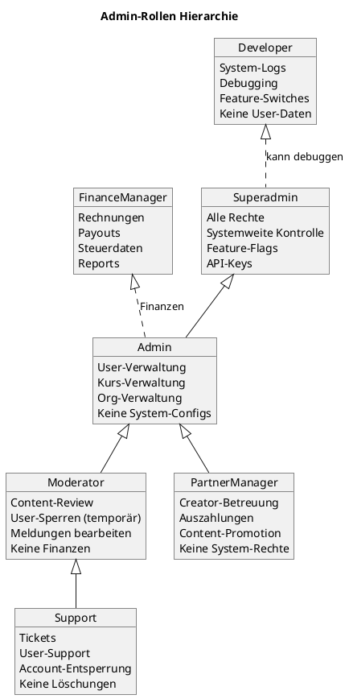
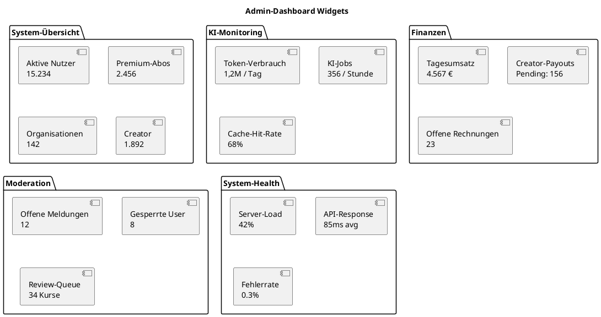
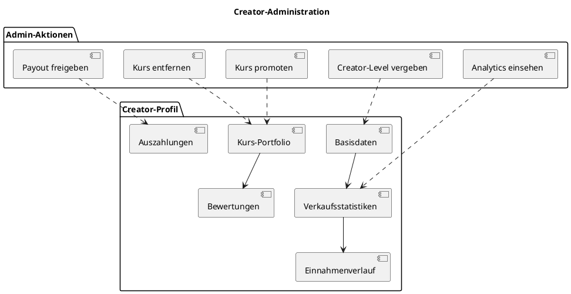
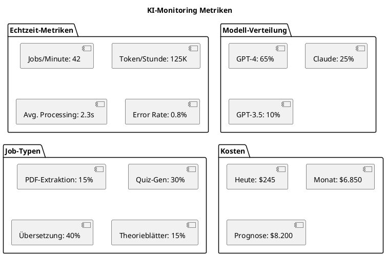
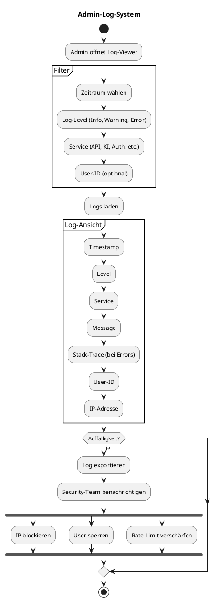

# 24 – Admin-System (Final)

**Version:** 1.0
**Stand:** Final

---

## Überblick

Das **Admin-System** ist die zentrale Verwaltungskonsole für LSX-Mitarbeiter und ermöglicht vollständige Kontrolle über Nutzer, Inhalte, Organisationen, Sicherheit und System-Performance.

### 🎯 Kernziele

- 👥 **Vollständige Kontrolle** – User, Kurse, Organisationen verwalten
- 🔒 **Sicherheit** – Moderation, Missbrauchserkennung, Sperrungen
- 📊 **Monitoring** – System-Health, KI-Verbrauch, Performance
- 💰 **Finanzen** – Rechnungen, Payouts, Revenue-Tracking
- 🎨 **Creator-Support** – Content-Review, Promotion, Analytics
- 🏢 **Enterprise-Management** – Schulen/Unternehmen betreuen
- 🛠️ **System-Tools** – Feature-Flags, Debugging, Logs

---

## Systemarchitektur

### 🏗️ C4 Context Diagram

```plantuml
@startuml
!include https://raw.githubusercontent.com/plantuml-stdlib/C4-PlantUML/master/C4_Context.puml

LAYOUT_WITH_LEGEND()

title C4 Context - Admin-System im LSX-Ökosystem

Person(admin, "Admin", "System Administrator")
Person(support, "Support", "User Support Team")
Person(moderator, "Moderator", "Content Moderator")
Person(finance, "Finance Manager", "Billing & Payouts")

System(admin_system, "Admin-System", "Zentrale Verwaltungskonsole für alle LSX-Funktionen")

System_Ext(user_system, "User-System", "User-Daten, Rollen")
System_Ext(course_system, "Kurs-System", "Kurse, Module")
System_Ext(org_system, "Org-System", "Schulen, Unternehmen")
System_Ext(ki_pipeline, "KI-Pipeline", "KI-Jobs, Tokens")
System_Ext(billing, "Billing-System", "Zahlungen, Rechnungen")
System_Ext(monitoring, "Monitoring", "Logs, Metrics, Alerts")

Rel(admin, admin_system, "Verwaltet System", "HTTPS")
Rel(support, admin_system, "Unterstützt User", "HTTPS")
Rel(moderator, admin_system, "Moderiert Content", "HTTPS")
Rel(finance, admin_system, "Verwaltet Finanzen", "HTTPS")

Rel(admin_system, user_system, "Verwaltet User", "REST API")
Rel(admin_system, course_system, "Verwaltet Kurse", "REST API")
Rel(admin_system, org_system, "Verwaltet Orgs", "REST API")
Rel(admin_system, ki_pipeline, "Überwacht KI", "REST API")
Rel(admin_system, billing, "Verwaltet Billing", "REST API")
Rel(admin_system, monitoring, "Lädt Metrics", "Prometheus/Grafana")

@enduml
```

---

### 📦 C4 Container Diagram

```plantuml
@startuml
!include https://raw.githubusercontent.com/plantuml-stdlib/C4-PlantUML/master/C4_Container.puml

LAYOUT_WITH_LEGEND()

title C4 Container - Admin-System Komponenten

Person(admin, "Admin")

System_Boundary(admin_system, "Admin-System") {
    Container(admin_dashboard, "Admin Dashboard", "Vue.js 3", "Web-Interface")
    Container(admin_api, "Admin API", "Flask Blueprint", "REST API")
    Container(user_mgmt, "User Management", "Python", "User-Verwaltung")
    Container(content_moderation, "Content Moderation", "Python", "Kurs-/Community-Moderation")
    Container(org_mgmt, "Org Management", "Python", "Schulen/Unternehmen")
    Container(finance_mgmt, "Finance Management", "Python", "Billing, Payouts")
    Container(system_tools, "System Tools", "Python", "Feature-Flags, Debugging")
    Container(analytics_viewer, "Analytics Viewer", "Python", "System-Metriken")
    ContainerDb(admin_db, "Admin DB", "PostgreSQL", "Admin-Logs, Aktionen")
}

System_Ext(user_db, "User DB")
System_Ext(course_db, "Course DB")
System_Ext(billing_db, "Billing DB")

Rel(admin, admin_dashboard, "Nutzt", "HTTPS")
Rel(admin_dashboard, admin_api, "API Calls", "JSON/HTTPS")

Rel(admin_api, user_mgmt, "User-Aktionen")
Rel(admin_api, content_moderation, "Moderation")
Rel(admin_api, org_mgmt, "Org-Verwaltung")
Rel(admin_api, finance_mgmt, "Finanzen")
Rel(admin_api, system_tools, "System-Kontrolle")
Rel(admin_api, analytics_viewer, "Metriken")

Rel(user_mgmt, user_db, "Liest/Schreibt", "SQL")
Rel(content_moderation, course_db, "Liest/Schreibt", "SQL")
Rel(finance_mgmt, billing_db, "Liest/Schreibt", "SQL")
Rel(admin_api, admin_db, "Loggt Aktionen", "SQL")

@enduml
```

---

## Admin-Rollen

### 👮 Interne Rollen



---

## Admin-Dashboard Übersicht

### 📊 Hauptmetriken



---

## Benutzerverwaltung

### 👥 User-Management Features

```plantuml
@startuml
title User-Management Workflow

start

:Admin sucht User;

partition "User-Profil" {
  :Basisdaten anzeigen;
  :Rolle & Berechtigungen;
  :Abo & Token-Status;
  :Zahlungsverlauf;
  :Logs & Aktivität;
  :Meldungen gegen User;
}

if (Aktion wählen?) then (Rolle ändern)
  :Neue Rolle zuweisen;
  :In DB speichern;
  :User-Session invalidieren;
else (Sperren)
  :Grund eingeben;
  :Sperrdauer wählen;
  :User sperren;
  :Email-Benachrichtigung;
else (Tokens vergeben)
  :Anzahl eingeben;
  :Tokens hinzufügen;
  :Log erstellen;
else (Passwort-Reset)
  :Reset-Link generieren;
  :Email versenden;
endif

:Aktion geloggt;

stop

@enduml
```

---

### 📋 User-Profil Bereiche

| Bereich | Informationen | Aktionen |
|---------|--------------|----------|
| **Basisdaten** | Name, Email, Erstelldatum | Editieren, Löschen |
| **Rolle & Rechte** | Aktuelle Rolle, Berechtigungen | Rolle ändern |
| **Abo-Status** | Premium, Tokens, Ablaufdatum | Abo verlängern, Tokens vergeben |
| **Zahlungsverlauf** | Transaktionen, Rechnungen | Rechnungen ansehen |
| **Aktivitätslogs** | Logins, API-Calls, IP-Adressen | Verdächtige Aktivität prüfen |
| **Meldungen** | Reports gegen User | Meldungen bearbeiten |
| **Creator-Status** | Verkäufe, Kurse, Auszahlungen | Creator-Tools |
| **Organisation** | Mitgliedschaft, Klassen | Org zuweisen |

---

## Kursverwaltung

### 📚 Course-Management

```plantuml
@startuml
title Kurs-Verwaltung Flow

start

:Admin durchsucht Kurse;

partition "Filter" {
  :Nach Typ (Academy/Creator/Community);
  :Nach Status (Published/Draft/Banned);
  :Nach Rating;
  :Nach Creator;
}

:Kurs auswählen;

partition "Kurs-Details" {
  :Grunddaten;
  :Module & Lernmethoden;
  :Creator-Info;
  :Verkaufszahlen;
  :Bewertungen;
  :KI-generierte Teile markiert;
  :Revisionshistorie;
}

if (Aktion?) then (Prüfen)
  :Quality-Check durchführen;
  :Freigeben oder ablehnen;
else (Sperren)
  :Grund angeben;
  :Kurs deaktivieren;
  :Creator benachrichtigen;
else (Promoten)
  :Als Featured markieren;
  :In Homepage einbinden;
else (Löschen)
  :Bestätigung einholen;
  :Kurs archivieren;
  :Käufer-Rückerstattung?;
endif

:Aktion loggen;

stop

@enduml
```

---

### 🔍 KI-Content-Erkennung

| Feature | Beschreibung | Zweck |
|---------|-------------|-------|
| **KI-generiert Flag** | Zeigt an, welche Teile von KI erstellt wurden | Transparenz |
| **Manuelle Edits** | Markiert nachträgliche Änderungen | Qualitätskontrolle |
| **Qualitätswarnungen** | Validator-Ergebnisse anzeigen | Review-Bedarf |
| **Prompt-Version** | Welche Prompt-Version verwendet wurde | Nachvollziehbarkeit |

---

## Community-Moderation

### 🛡️ Moderations-Panel

```plantuml
@startuml
title Moderation-Workflow

actor Moderator

start

:Moderator öffnet Moderation-Panel;

partition "Meldungen-Liste" {
  :Offene Meldungen anzeigen;
  :Nach Typ filtern;
  :Nach Dringlichkeit sortieren;
}

:Meldung auswählen;

partition "Meldungs-Details" {
  :Gemeldeter Inhalt;
  :Melder-Info;
  :Kategorie (Spam, Hate, Copyright, etc.);
  :Zeitstempel;
  :Vorherige Meldungen gegen denselben User;
}

if (Entscheidung?) then (Ablehnen)
  :Meldung unbegründet;
  :Status: Abgelehnt;
else (Verwarnung)
  :Warnung an User senden;
  :Log erstellen;
else (Inhalt löschen)
  :Content entfernen;
  :User benachrichtigen;
else (Temporäre Sperre)
  :Sperrdauer: 7/14/30 Tage;
  :Sperre aktivieren;
else (Permanente Sperre)
  :Account dauerhaft sperren;
  :Alle Inhalte deaktivieren;
endif

:Meldung schließen;
:Log-Eintrag erstellen;

stop

@enduml
```

---

### 📋 Community-Richtlinien

| Verstoß-Kategorie | Aktion | Beispiel |
|-------------------|--------|----------|
| **Spam** | Warnung → Löschen | Werbung, irrelevante Links |
| **Urheberrecht** | Sofort löschen | Kopierter Content ohne Erlaubnis |
| **Hate Speech** | Temporäre Sperre | Beleidigungen, Diskriminierung |
| **Falschinformation** | Warnung + Review | Offensichtlich falsche Fakten |
| **NSFW** | Sofort löschen + Sperre | Sexueller/gewalttätiger Content |
| **KI-Missbrauch** | Tokens entziehen | Excessive Token-Farming |

---

## Organisationen-Verwaltung

### 🏢 Org-Management

```plantuml
@startuml
title Organisations-Management

start

:Admin öffnet Org-Verwaltung;

:Organisationen auflisten;

:Organisation auswählen;

partition "Org-Details" {
  :Name, Typ, Domain;
  :Admin-User;
  :Anzahl Nutzer (aktiv/inaktiv);
  :Tokenpools;
  :Abrechnungsmodell;
  :Branding-Settings;
  :Klassen/Gruppen;
}

if (Aktion?) then (Nutzer hinzufügen)
  :CSV-Import oder manuell;
  :Rollen zuweisen;
else (Tokens zuweisen)
  :Tokenpool erhöhen;
  :Kostenlos oder kostenpflichtig;
else (Domain validieren)
  :CNAME prüfen;
  :TLS-Zertifikat ausstellen;
  :Domain aktivieren;
else (Rechnung generieren)
  :Sammelrechnung erstellen;
  :PDF generieren;
  :Email versenden;
else (Deaktivieren)
  :Alle User sperren;
  :Zugriff entziehen;
  :Benachrichtigung;
endif

:Aktion loggen;

stop

@enduml
```

---

### 📊 Org-Einstellungen

| Einstellung | Beschreibung | Bearbeiten |
|-------------|-------------|------------|
| **Name** | Organisationsname | ✅ |
| **Domain** | Custom Domain (z.B. schule.de) | ✅ (mit Validierung) |
| **Branding** | Logo, Farben | ✅ |
| **Klassen-Struktur** | Klassen, Gruppen | ✅ |
| **Kurslizenzen** | Zugewiesene Kurse | ✅ |
| **Abrechnungsmodell** | Per-User, Flat, Hybrid | ✅ |
| **Tokenpool** | KI-Budget | ✅ |
| **Nutzer-Limit** | Max. Anzahl User | ✅ |

---

## Creator-Administration

### 🎨 Creator-Support Tools



---

### 💰 Payout-Verwaltung

| Schritt | Beschreibung | Admin-Aktion |
|---------|-------------|--------------|
| 1. **Pending** | Creator hat Auszahlung beantragt | Prüfen |
| 2. **Review** | Automatische Prüfung (Betrug, Minimum) | Manuell prüfen bei Auffälligkeiten |
| 3. **Approved** | Admin gibt frei | Freigabe-Button |
| 4. **Processing** | Zahlung wird ausgeführt (Stripe/PayPal) | Warten |
| 5. **Completed** | Geld überwiesen | Bestätigung |
| 6. **Failed** | Fehler bei Überweisung | Retry oder Creator kontaktieren |

---

## KI-Überwachung

### 🤖 KI-Monitoring Dashboard



---

### 📊 KI-Statistiken

| Metrik | Wert (Beispiel) | Beschreibung |
|--------|-----------------|-------------|
| **Total Jobs (24h)** | 12.456 | Alle KI-Jobs |
| **Erfolgsrate** | 97,2% | Abgeschlossene Jobs |
| **Cache-Hit-Rate** | 68% | Kosten gespart |
| **Durchschn. Token/Job** | 1.850 | Durchschnitt |
| **Teuerster Job** | 42.000 Tokens | PDF → Kurs (umfangreich) |
| **Top-User (Token)** | Creator #12 | 250K Tokens/Monat |
| **Kosten/Tag** | $245 | Aktuelle KI-Kosten |

---

## Logs & Sicherheit

### 🔍 Log-Viewer



---

### 🛡️ Security-Tools

| Tool | Beschreibung | Verwendung |
|------|-------------|------------|
| **IP-Blockierung** | IPs sperren bei Missbrauch | Manuelle Liste + Auto-Ban |
| **Rate-Limit-Kontrolle** | API-Limits anpassen | Per User/IP |
| **Session-Invalidierung** | Alle Sessions beenden | Bei Hack-Verdacht |
| **Token-Reset** | JWT-Tokens ungültig machen | Security-Incident |
| **Notfallmodus** | System-weite Sperre (außer Admins) | DDoS, kritische Bugs |
| **Audit-Log** | Alle Admin-Aktionen tracken | Compliance |

---

## Finanzen & Rechnungen

### 💶 Finance-Manager Tools

```plantuml
@startuml
title Finance-Management Workflow

start

:Finance-Manager öffnet Billing;

partition "Übersicht" {
  :Tagesumsatz;
  :Monatsumsatz;
  :Offene Rechnungen;
  :Pending Payouts;
  :Rückerstattungen;
}

if (Aktion?) then (Rechnung erstellen)
  :Organisation auswählen;
  :Zeitraum wählen;
  :Rechnungsposten generieren;
  :PDF erstellen;
  :Email versenden;
else (Payout genehmigen)
  :Payout-Liste öffnen;
  :Details prüfen;
  :Freigeben;
  :An Stripe/PayPal senden;
else (Rückerstattung)
  :Transaktions-ID eingeben;
  :Grund angeben;
  :Betrag bestätigen;
  :Rückerstattung ausführen;
else (Report exportieren)
  :Zeitraum wählen;
  :Format (CSV, PDF, Excel);
  :Export generieren;
  :Download;
endif

:Aktion loggen;

stop

@enduml
```

---

### 📋 Rechnungs-Typen

| Typ | Empfänger | Inhalt | Turnus |
|-----|-----------|--------|--------|
| **Abo-Rechnung** | Premium-User | Monatliches Abo | Monatlich |
| **Token-Rechnung** | Premium/Creator | Token-Käufe | Bei Kauf |
| **Kursverkauf** | Käufer | Kurs-Lizenz | Bei Kauf |
| **Org-Sammelrechnung** | Schulen/Unternehmen | Nutzer + Tokens + Extras | Monatlich |
| **Creator-Payout** | Creator | Auszahlung | Monatlich (15.) |

---

## Feature-Flags & System-Kontrolle

### 🚀 Developer-Panel

```plantuml
@startuml
title Feature-Flag Management

start

:Developer öffnet System-Tools;

partition "Feature-Flags" {
  :Liste aller Features anzeigen;
  :Status (aktiv/inaktiv);
  :Rollout-% (0-100%);
  :Whitelist (User-IDs);
}

:Feature auswählen;

if (Aktion?) then (Aktivieren)
  :Feature global aktivieren;
else (Deaktivieren)
  :Feature global deaktivieren;
else (Rollout)
  :Prozent eingeben (z.B. 10%);
  :Zufällige User erhalten Zugriff;
else (Beta-User)
  :User-IDs eingeben;
  :Nur diese User haben Zugriff;
endif

:Änderung speichern;
:Cache invalidieren;
:Live-Config neu laden;

stop

@enduml
```

---

### 🛠️ System-Tools

| Tool | Funktion | Verwendung |
|------|----------|------------|
| **Feature-Flags** | Features aktivieren/deaktivieren | Beta-Tests, Rollouts |
| **Cache löschen** | Redis-Cache invalidieren | Nach Deployment |
| **KI-Modell umschalten** | GPT-4 → GPT-3.5 | Kostensenkung |
| **API-Keys rotieren** | Neue Keys generieren | Security |
| **Cronjobs triggern** | Manuell ausführen | Testing |
| **DB-Migrationen** | Schema-Updates | Deployment |
| **Backup erstellen** | Manuelles Backup | Vor großen Changes |

---

## Support-Center

### 🎫 Ticket-System

```plantuml
@startuml
title Support-Ticket Workflow

actor User
actor Support

User -> Support : Erstellt Ticket
activate Support

Support -> Support : Ticket-Details lesen

partition "Ticket-Bearbeitung" {
  Support -> Support : Kategorie zuweisen
  Support -> Support : Priorität setzen

  alt Einfaches Problem
    Support -> User : Standardantwort
  else Komplexes Problem
    Support -> Support : Recherche
    Support -> User : Individuelle Antwort
  end

  Support -> Support : Status: In Bearbeitung
}

alt Problem gelöst
  Support -> User : Lösung mitteilen
  User -> Support : Bestätigung
  Support -> Support : Ticket schließen
else Problem nicht lösbar
  Support -> Support : An Admin eskalieren
  Support -> User : Eskalation mitteilen
end

deactivate Support

@enduml
```

---

### 📋 Support-Funktionen

| Funktion | Beschreibung | Zugriff |
|----------|-------------|---------|
| **Ticket-System** | User-Anfragen bearbeiten | Support, Admin |
| **Live-Chat** | Echtzeit-Support | Support |
| **User-Simulation** | In User-Account einloggen (mit Erlaubnis) | Support (mit Logging) |
| **FAQ-Generator** | Häufige Fragen dokumentieren | Support |
| **Bug-Reproduktion** | User-Aktionen nachstellen | Developer, Support |
| **Account-Entsperrung** | Gesperrte Accounts freischalten | Support, Admin |

---

## API-Dokumentation

### 🔌 Admin-Endpoints

#### 1. User abrufen

```http
GET /api/admin/users
Authorization: Bearer {admin_jwt_token}
```

**Query Parameters:**
- `page` (default: 1)
- `limit` (default: 50)
- `role` (optional: free, premium, creator, etc.)
- `search` (optional: Email, Username)

**Response:**

```json
{
  "total": 15234,
  "page": 1,
  "limit": 50,
  "users": [
    {
      "user_id": "uuid",
      "username": "johndoe",
      "email": "john@example.com",
      "role": "premium",
      "created_at": "2024-01-15T10:00:00Z",
      "last_login": "2024-11-14T08:30:00Z",
      "is_banned": false
    }
  ]
}
```

---

#### 2. User sperren

```http
POST /api/admin/user/{user_id}/ban
Authorization: Bearer {admin_jwt_token}
Content-Type: application/json
```

**Request:**

```json
{
  "reason": "Verstoß gegen Community-Richtlinien",
  "duration_days": 30,
  "permanent": false
}
```

**Response:**

```json
{
  "status": "success",
  "user_id": "uuid",
  "banned_until": "2024-12-14T00:00:00Z"
}
```

---

#### 3. Tokens hinzufügen

```http
POST /api/admin/user/{user_id}/tokens/add
Authorization: Bearer {admin_jwt_token}
Content-Type: application/json
```

**Request:**

```json
{
  "amount": 5000,
  "reason": "Goodwill-Gesture"
}
```

**Response:**

```json
{
  "status": "success",
  "new_balance": 6200
}
```

---

#### 4. Kurs sperren

```http
POST /api/admin/course/{course_id}/ban
Authorization: Bearer {admin_jwt_token}
Content-Type: application/json
```

**Request:**

```json
{
  "reason": "Urheberrechtsverletzung",
  "notify_creator": true
}
```

**Response:**

```json
{
  "status": "success",
  "course_id": "uuid",
  "status": "banned"
}
```

---

#### 5. Organisation erstellen

```http
POST /api/admin/org/create
Authorization: Bearer {admin_jwt_token}
Content-Type: application/json
```

**Request:**

```json
{
  "name": "Muster-Schule GmbH",
  "type": "school",
  "admin_user_id": "uuid",
  "domain": "muster-schule.de",
  "max_users": 500
}
```

**Response:**

```json
{
  "status": "success",
  "org_id": "uuid",
  "domain_verification_required": true
}
```

---

#### 6. KI-Statistiken abrufen

```http
GET /api/admin/ki/stats
Authorization: Bearer {admin_jwt_token}
```

**Query Parameters:**
- `from_date` (optional, ISO 8601)
- `to_date` (optional, ISO 8601)

**Response:**

```json
{
  "total_jobs": 125456,
  "total_tokens": 245000000,
  "total_cost_usd": 14700.50,
  "jobs_by_type": {
    "pdf_extraction": 15234,
    "quiz_generation": 45678,
    "translation": 52341,
    "theory_sheet": 12203
  },
  "jobs_by_model": {
    "gpt-4": 85000,
    "claude-3": 30000,
    "gpt-3.5": 10456
  },
  "cache_hit_rate": 0.68,
  "avg_processing_time_ms": 2340
}
```

---

#### 7. System-Logs abrufen

```http
GET /api/admin/logs
Authorization: Bearer {admin_jwt_token}
```

**Query Parameters:**
- `level` (optional: info, warning, error)
- `service` (optional: api, ki, auth)
- `from_date` (optional)
- `limit` (default: 100)

**Response:**

```json
{
  "logs": [
    {
      "timestamp": "2024-11-14T10:30:00Z",
      "level": "error",
      "service": "ki-pipeline",
      "message": "PDF extraction failed",
      "user_id": "uuid",
      "ip_address": "192.168.1.1",
      "stack_trace": "..."
    }
  ]
}
```

---

#### 8. Feature-Flag setzen

```http
POST /api/admin/feature-flags/{flag_name}
Authorization: Bearer {admin_jwt_token}
Content-Type: application/json
```

**Request:**

```json
{
  "enabled": true,
  "rollout_percentage": 50,
  "whitelist_user_ids": ["uuid1", "uuid2"]
}
```

**Response:**

```json
{
  "status": "success",
  "flag_name": "new_dashboard_widget",
  "enabled": true
}
```

---

## Zusammenfassung

### ✅ Admin-System Features

| Feature | Status | Beschreibung |
|---------|--------|-------------|
| 👥 **User-Management** | ✅ | Vollständige Kontrolle |
| 📚 **Kurs-Verwaltung** | ✅ | Review, Moderation, Promotion |
| 🛡️ **Moderation** | ✅ | Content-Filter, Sperrungen |
| 🏢 **Org-Management** | ✅ | Schulen/Unternehmen betreuen |
| 🎨 **Creator-Support** | ✅ | Payouts, Analytics, Promotion |
| 🤖 **KI-Monitoring** | ✅ | Jobs, Tokens, Kosten |
| 💰 **Finanzen** | ✅ | Rechnungen, Payouts, Reports |
| 🔍 **Logs & Security** | ✅ | System-Logs, IP-Blocking |
| 🛠️ **System-Tools** | ✅ | Feature-Flags, Debugging |

---

### 💡 Kernaussage

> Das Admin-System ist die **zentrale Kommandozentrale** für LSX und ermöglicht **vollständige Kontrolle**, **Sicherheit** und **effizientes Management** aller Plattform-Aspekte.

---

### 🎯 Vorteile auf einen Blick

```
┌────────────────────────────────────────┐
│  👥 Vollständige User-Kontrolle        │
│  📚 Umfassendes Kurs-Management        │
│  🛡️ Professionelle Moderation          │
│  🏢 Enterprise-Management              │
│  🤖 KI-Überwachung & Kostenkontrolle   │
│  💰 Finanz-Management & Payouts        │
│  🔍 Umfassende Logs & Security         │
│  🛠️ Flexible System-Kontrolle          │
└────────────────────────────────────────┘
```

---

## 📌 Dokument abgeschlossen

**Version:** 1.0
**Status:** Final
**Letzte Aktualisierung:** November 2024

---

> 💡 **Hinweis:** Dieses Dokument beschreibt das vollständige Admin-System des LSX-Lernsystems. Es bildet die Grundlage für Administration, Moderation, Support und System-Kontrolle.
