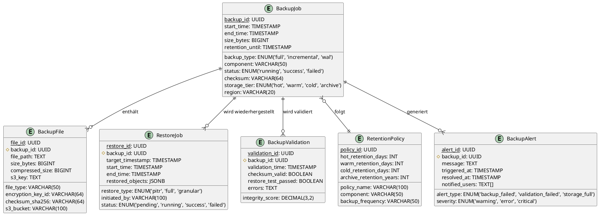
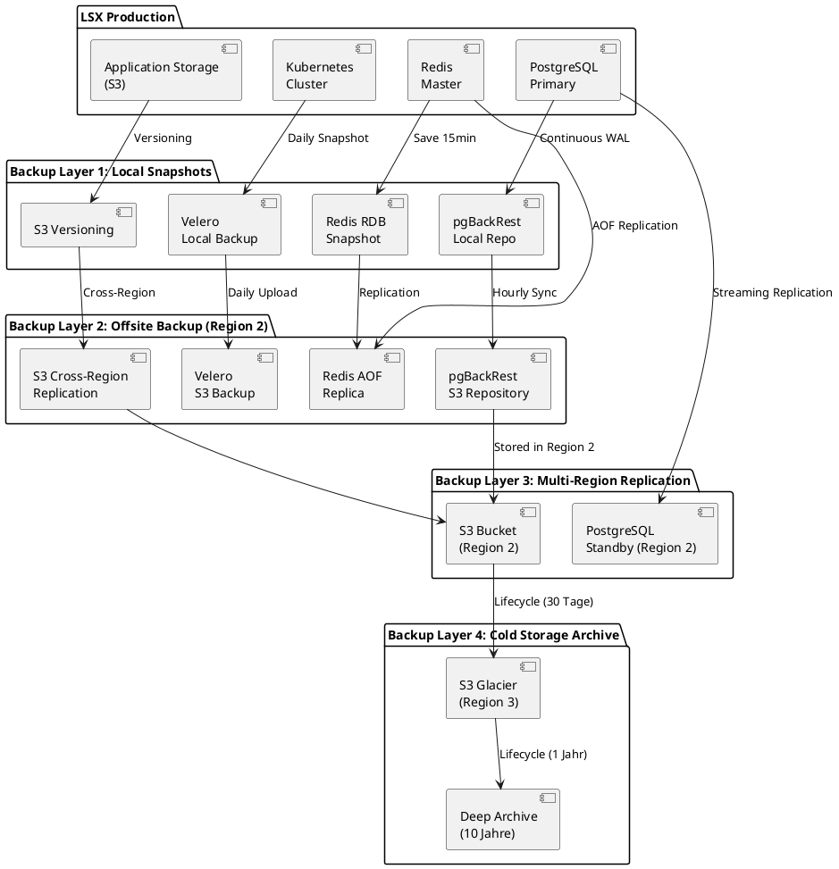
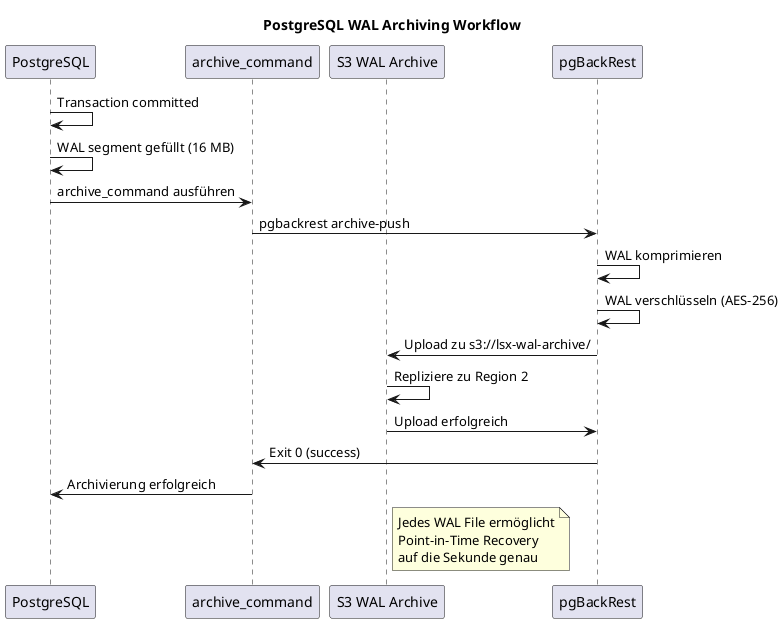
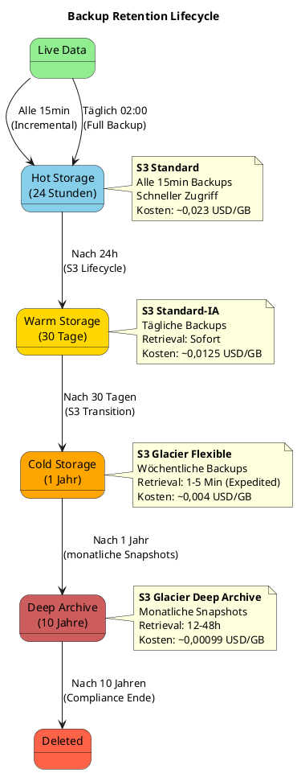
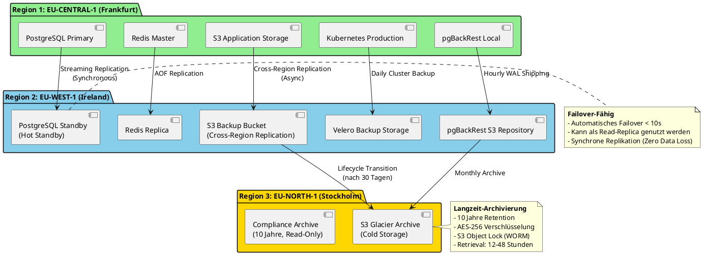
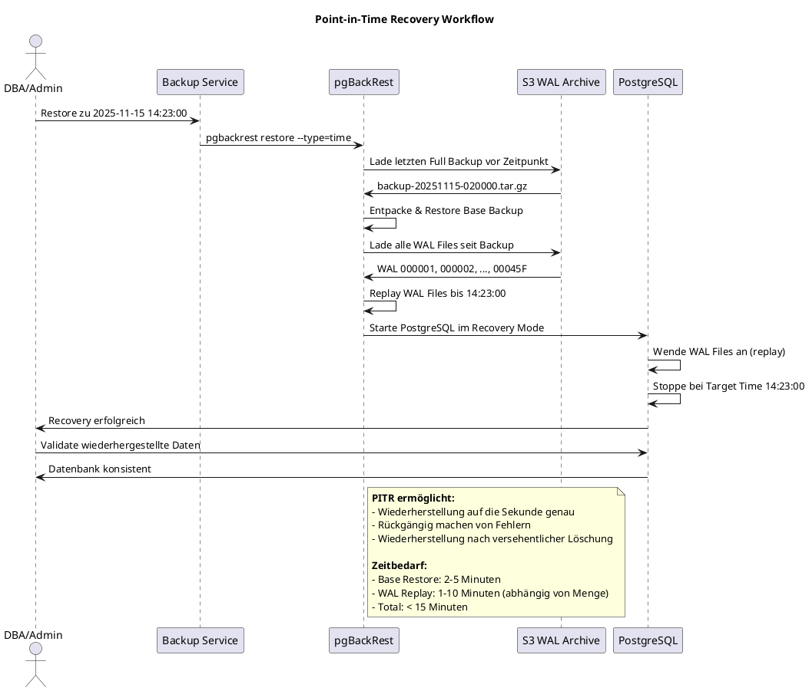
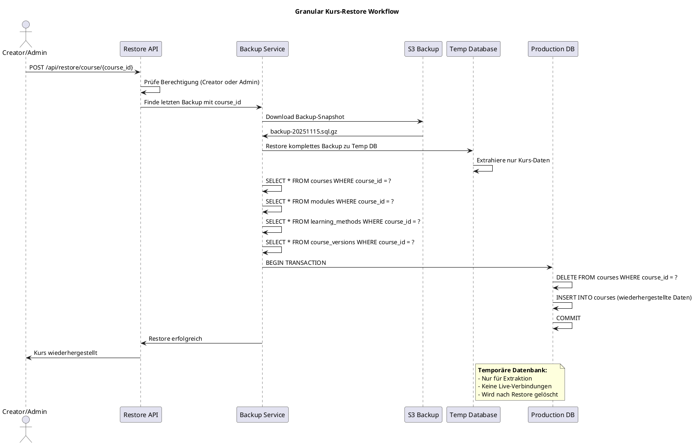
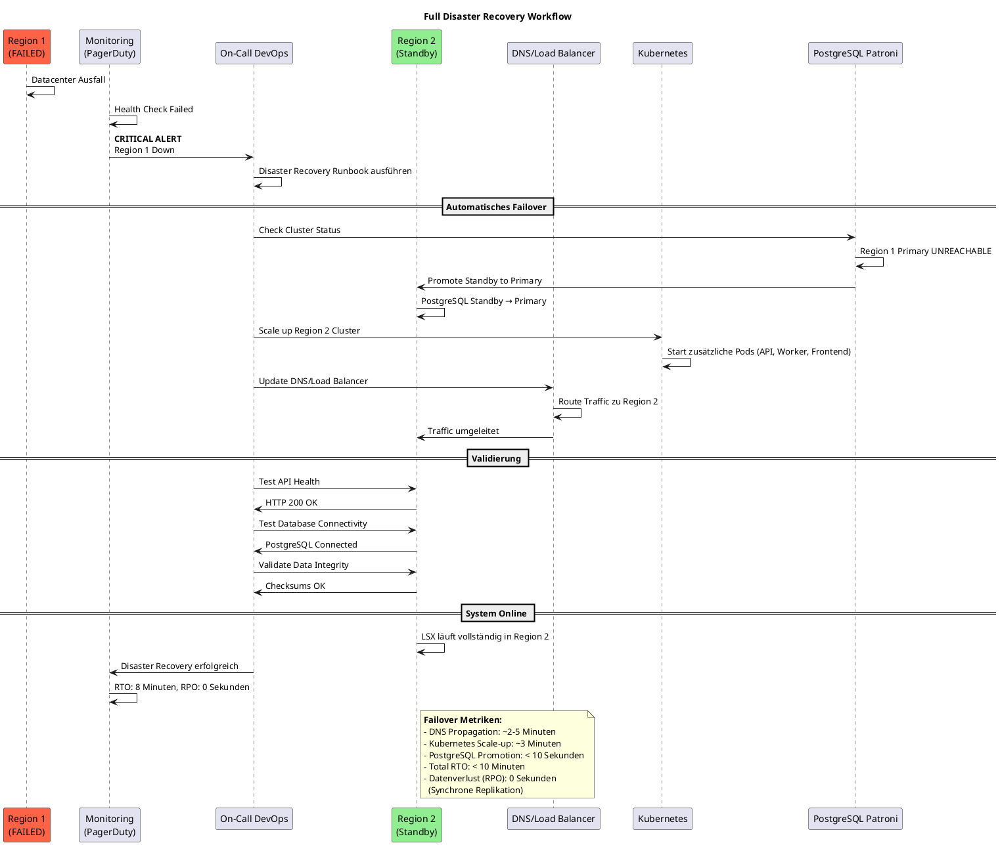
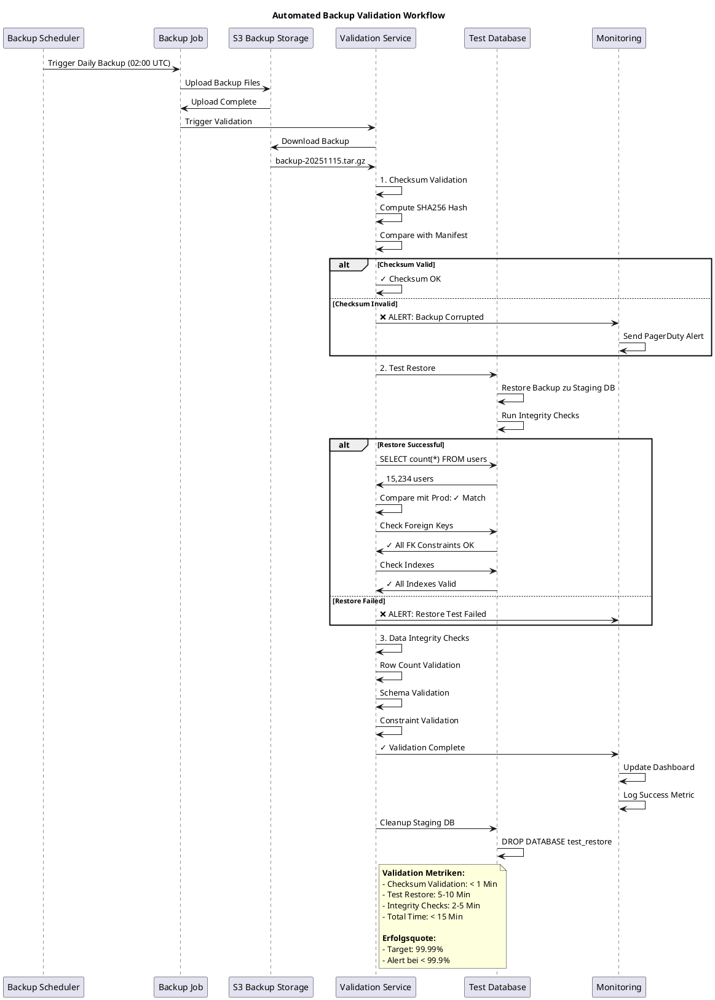

# 29 | Backup & Recovery System

**Version:** 1.0
**Status:** Final
**Zuletzt aktualisiert:** 2025-11-15

## Übersicht

Das Backup & Recovery System des LSX Lernsystems gewährleistet **vollständige Datensicherheit**, **24/7 Wiederherstellbarkeit** und **Schutz vor Datenverlust, Korruption oder Angriffen**. Es implementiert eine mehrschichtige Backup-Strategie mit automatisierter Validierung, Point-in-Time Recovery und Disaster Recovery Capabilities.

**Wichtige Metriken:**
• **RTO (Recovery Time Objective):** < 15 Minuten
• **RPO (Recovery Point Objective):** < 5 Minuten
• **Backup Success Rate:** 99.99%
• **Retention:** 10 Jahre (monatliche Archivierung)
• **Verschlüsselung:** AES-256 at rest, TLS 1.3 in transit
• **Multi-Region:** 3 geografisch getrennte Regionen

---

## C4 Context Diagram: Backup System

```plantuml
@startuml
!include https://raw.githubusercontent.com/plantuml-stdlib/C4-PlantUML/master/C4_Context.puml

title C4 Context Diagram - LSX Backup & Recovery System

Person(admin, "System Administrator", "Verwaltet Backups und Recovery")
Person(devops, "DevOps Engineer", "Führt Disaster Recovery durch")
Person(auditor, "Compliance Auditor", "Prüft Backup-Protokolle")

System(lsx, "LSX Lernsystem", "Hauptsystem mit allen Services")

System_Ext(backup_primary, "Primary Backup Region", "Region 1: Hot Storage, tägliche Backups")
System_Ext(backup_secondary, "Secondary Backup Region", "Region 2: Offsite Replication")
System_Ext(backup_archive, "Archive Region", "Region 3: Cold Storage, Langzeitarchivierung")

System_Ext(monitoring, "Monitoring System", "Prometheus, Grafana, Alerting")
System_Ext(vault, "HashiCorp Vault", "Verschlüsselungskeys, Secrets")

Rel(lsx, backup_primary, "Kontinuierliche Backups", "pgBackRest, WAL Archiving")
Rel(backup_primary, backup_secondary, "Tägliche Replikation", "S3 Cross-Region Replication")
Rel(backup_primary, backup_archive, "Monatliche Archivierung", "S3 Glacier")

Rel(admin, lsx, "Initiiert manuelles Backup/Restore")
Rel(devops, backup_primary, "Disaster Recovery")
Rel(auditor, monitoring, "Prüft Backup-Logs")

Rel(monitoring, backup_primary, "Überwacht Backup-Status")
Rel(backup_primary, vault, "Abruft Encryption Keys")

@enduml
```

---

## C4 Container Diagram: Backup Infrastructure

```plantuml
@startuml
!include https://raw.githubusercontent.com/plantuml-stdlib/C4-PlantUML/master/C4_Container.puml

title C4 Container Diagram - Backup Infrastructure

Person(admin, "Administrator")

System_Boundary(lsx_system, "LSX Production") {
    Container(postgres, "PostgreSQL", "PostgreSQL 16", "Primary Database")
    Container(redis, "Redis", "Redis 7", "Cache & Sessions")
    Container(s3_app, "Application Storage", "MinIO/S3", "PDFs, Videos, Uploads")
    Container(backup_service, "Backup Service", "Python, Celery", "Koordiniert Backup-Jobs")
}

System_Boundary(backup_infra, "Backup Infrastructure") {
    Container(pgbackrest, "pgBackRest", "Backup Tool", "PostgreSQL Backup & WAL Archiving")
    Container(wal_archive, "WAL Archive", "S3 Bucket", "Write-Ahead Logs")
    Container(snapshot_service, "Snapshot Service", "AWS Backup/Velero", "Kubernetes Volume Snapshots")
    Container(backup_scheduler, "Backup Scheduler", "Kubernetes CronJob", "Zeitgesteuerte Backups")
    Container(validation_service, "Validation Service", "Python Script", "Backup-Validierung")
}

System_Boundary(storage, "Storage Tiers") {
    ContainerDb(hot_storage, "Hot Storage", "S3 Standard", "24h Backups, alle 15min")
    ContainerDb(warm_storage, "Warm Storage", "S3 IA", "30 Tage, tägliche Backups")
    ContainerDb(cold_storage, "Cold Storage", "S3 Glacier", "1 Jahr, wöchentliche Backups")
    ContainerDb(archive, "Deep Archive", "S3 Glacier Deep", "10 Jahre, monatliche Backups")
}

System_Ext(monitoring, "Prometheus/Grafana")
System_Ext(alerting, "PagerDuty/Slack")

Rel(backup_service, pgbackrest, "Triggert Backup", "REST API")
Rel(postgres, pgbackrest, "Streaming Backup", "pg_basebackup")
Rel(postgres, wal_archive, "Kontinuierliches WAL Shipping", "archive_command")
Rel(pgbackrest, wal_archive, "Archiviert WAL Files")

Rel(backup_scheduler, snapshot_service, "Triggert Volume Snapshots")
Rel(snapshot_service, s3_app, "Snapshots Application Data")
Rel(backup_service, redis, "Redis RDB/AOF Backup")

Rel(pgbackrest, hot_storage, "Full & Incremental Backups")
Rel(hot_storage, warm_storage, "Lifecycle Policy (nach 24h)")
Rel(warm_storage, cold_storage, "Lifecycle Policy (nach 30 Tagen)")
Rel(cold_storage, archive, "Lifecycle Policy (nach 1 Jahr)")

Rel(validation_service, hot_storage, "Testet Backups täglich")
Rel(validation_service, monitoring, "Sendet Metriken")
Rel(monitoring, alerting, "Alarm bei Fehler")

Rel(admin, backup_service, "Manuelles Backup/Restore")

@enduml
```

---

## 1. Ziele des Backup-Systems

### 1.1 Primäre Ziele

| Ziel | Beschreibung | Metrik |
|------|--------------|--------|
| **Datensicherheit** | Alle Daten jederzeit wiederherstellbar | 99.99% Verfügbarkeit |
| **Zero Data Loss** | Minimaler Datenverlust bei Ausfall | RPO < 5 Minuten |
| **Schnelle Recovery** | Wiederherstellung innerhalb Minuten | RTO < 15 Minuten |
| **Compliance** | DSGVO, GoBD-konforme Archivierung | 10 Jahre Aufbewahrung |
| **Ransomware-Schutz** | Immutable Backups, Air-Gapped | 3 getrennte Regionen |
| **Granulare Wiederherstellung** | Einzelne Kurse/Module/Nutzer | Objekt-Level Recovery |

### 1.2 RTO/RPO Matrix

| Komponente | RPO | RTO | Backup-Frequenz | Wiederherstellungsmethode |
|------------|-----|-----|-----------------|---------------------------|
| PostgreSQL Datenbank | < 5 Min | < 10 Min | Kontinuierlich (WAL) | Point-in-Time Recovery |
| Redis Cache | < 15 Min | < 5 Min | Alle 15 Min (RDB) | RDB Snapshot Restore |
| Application Storage (S3) | < 1 Std | < 30 Min | Alle 1 Std (Incremental) | Versioned Objects |
| Kubernetes Config | < 24 Std | < 15 Min | Täglich | GitOps Restore |
| Secrets/Vault | < 1 Std | < 5 Min | Alle 1 Std | Encrypted Snapshot |

### 1.3 Compliance-Anforderungen

**DSGVO-konforme Datenverarbeitung:**
• Verschlüsselte Backups (AES-256)
• Zugriffsprotokolle für Audits
• Recht auf Löschung (mit Backup-Purging)
• Geografische Datenspeicherung (EU-Regionen)

**GoBD-konforme Archivierung:**
• Unveränderliche Speicherung (Immutability)
• 10 Jahre Aufbewahrung (Rechnungen, Transaktionen)
• Revisionssichere Versionierung
• Vollständige Wiederherstellbarkeit

---

## 2. Zu sichernde Komponenten

### 2.1 ER-Diagramm: Backup Metadata



### 2.2 Komponenten-Übersicht

#### 2.2.1 Kritische Datenbanken (Priorität 1)

**PostgreSQL Haupt-Datenbank:**
• Nutzer & Authentifizierung
• Kurse & Module
• Lernmethoden & Fortschritt
• Organisationen & Klassen
• Tokens & Billing
• Rechnungen & Transaktionen
• Rollen & Berechtigungen
• Analytics Aggregationen
• KI-Historien (Prompt-Versionen)

**Backup-Methode:** Kontinuierliches WAL Archiving + tägliche Full Backups
**RPO:** < 5 Minuten
**RTO:** < 10 Minuten

#### 2.2.2 Datei-/Objektspeicher (Priorität 2)

**Application Storage (S3/MinIO):**
• Creator-Upload PDFs (vor KI-Verarbeitung)
• Generierte Videos (Lern-Videos)
• Modulbilder & Thumbnails
• Whiteboard-Exports
• Prüfungsergebnisse (optional, je nach Einstellung)
• Branding-Assets (Logos, Farben)

**Backup-Methode:** S3 Versioning + Cross-Region Replication
**RPO:** < 1 Stunde
**RTO:** < 30 Minuten

#### 2.2.3 Cache & Sessions (Priorität 3)

**Redis:**
• Session-Daten (können rekonstruiert werden)
• KI-Cache (kann regeneriert werden, aber teuer)
• Rate-Limiting Counter
• Temporary Job-Queues

**Backup-Methode:** RDB Snapshots alle 15 Minuten + AOF Logging
**RPO:** < 15 Minuten
**RTO:** < 5 Minuten

**Hinweis:** KI-Cache wird NICHT langfristig archiviert (kann regeneriert werden bei ~0,01-0,03 € pro Request).

#### 2.2.4 Konfiguration & Secrets (Priorität 1)

**Kubernetes:**
• ConfigMaps (Feature-Flags, Umgebungsvariablen)
• Secrets (API Keys, DB Credentials)
• Persistent Volumes Claims
• Ingress/Service Definitionen

**HashiCorp Vault:**
• Encryption Keys
• Database Credentials
• API Keys (OpenAI, Stripe, PayPal)
• TLS Certificates

**Backup-Methode:** Velero Kubernetes Cluster Backups + Vault Snapshots
**RPO:** < 1 Stunde
**RTO:** < 15 Minuten

#### 2.2.5 Code & Infrastruktur (Priorität 4)

**Git Repositories:**
• Backend Code (Python)
• Frontend Code (Vue.js)
• Infrastructure as Code (Terraform, Helm Charts)

**Backup-Methode:** GitHub Backup + GitLab Mirror
**RPO:** Sofort (bei Push)
**RTO:** < 5 Minuten

**Container Images:**
• Docker Registry (Harbor/ECR)
• Versionierte Images mit Tags

**Backup-Methode:** Multi-Registry Mirroring

---

## 3. Backup-Strategien

### 3.1 Backup-Architektur



### 3.2 Mehrstufige Backup-Strategie

**Layer 1: Local Snapshots (Hot Storage)**
• **Zweck:** Schnellste Wiederherstellung bei versehentlicher Löschung
• **Technologie:** pgBackRest Local Repository, Redis RDB, S3 Versioning
• **Retention:** 24 Stunden
• **Speicherort:** Auf demselben Kubernetes Cluster (separate Nodes)
• **RTO:** < 5 Minuten

**Layer 2: Offsite Backup (Warm Storage)**
• **Zweck:** Schutz vor Datacenter-Ausfall
• **Technologie:** S3 Standard in anderer AWS Region
• **Retention:** 30 Tage
• **Speicherort:** AWS Region 2 (geografisch getrennt)
• **RTO:** < 15 Minuten

**Layer 3: Multi-Region Replication**
• **Zweck:** Disaster Recovery, Failover
• **Technologie:** PostgreSQL Streaming Replication, S3 Cross-Region Replication
• **Retention:** Live Replica + 7 Tage Snapshots
• **Speicherort:** AWS Region 2 + 3
• **RTO:** < 10 Sekunden (automatisches Failover)

**Layer 4: Cold Storage Archive**
• **Zweck:** Compliance, Langzeitarchivierung
• **Technologie:** S3 Glacier Deep Archive
• **Retention:** 10 Jahre (monatliche Snapshots)
• **Speicherort:** AWS Region 3 (EU-WEST-1)
• **RTO:** 12-48 Stunden (Glacier Retrieval)

### 3.3 3-2-1-1 Backup-Regel

LSX folgt der erweiterten **3-2-1-1 Regel:**

**3 Kopien der Daten:**
1. Production Database (Primary)
2. Offsite Backup (Region 2)
3. Cold Storage Archive (Region 3)

**2 verschiedene Medientypen:**
1. Live Storage (SSD/NVMe)
2. Object Storage (S3 Standard, Glacier)

**1 Offsite Kopie:**
• Geografisch getrennte Region (mindestens 1000 km Entfernung)

**1 Immutable/Air-Gapped Kopie:**
• S3 Object Lock (WORM - Write Once Read Many)
• Keine Lösch- oder Überschreibrechte

---

## 4. Backup-Typen

### 4.1 Full Backups

**Umfang:**
• Kompletter PostgreSQL Dump (pg_basebackup)
• Alle S3 Objects (mit Metadaten)
• Redis RDB Snapshot (alle Keys)
• Kubernetes Cluster State (Velero)
• Vault Snapshots (verschlüsselt)

**Zeitplan:**
• Täglich um 02:00 Uhr UTC
• Dauer: ~30-60 Minuten
• Größe: ~50-100 GB (komprimiert)

**Technologie:**
```bash
# pgBackRest Full Backup
pgbackrest --stanza=lsx-prod --type=full backup

# Velero Kubernetes Backup
velero backup create lsx-full-$(date +%Y%m%d) \
  --include-namespaces lsx-prod \
  --snapshot-volumes
```

### 4.2 Incremental Backups

**Umfang:**
• Nur geänderte PostgreSQL Pages (seit letztem Full/Incremental Backup)
• Neue/geänderte S3 Objects
• Redis AOF (Append-Only File) Änderungen

**Zeitplan:**
• Alle 15 Minuten
• Dauer: ~1-5 Minuten
• Größe: ~500 MB - 2 GB

**Vorteil:**
• Minimale Performance-Impact
• RPO < 15 Minuten
• Speichereffizient (nur Deltas)

### 4.3 Continuous Archiving (WAL)

**PostgreSQL Write-Ahead Log (WAL):**



**Konfiguration (postgresql.conf):**
```ini
# WAL Settings
wal_level = replica
archive_mode = on
archive_command = 'pgbackrest --stanza=lsx-prod archive-push %p'
archive_timeout = 300  # 5 Minuten

# Write-Ahead Log
max_wal_size = 2GB
min_wal_size = 1GB
wal_compression = on

# Replication
max_wal_senders = 10
wal_keep_size = 1GB
```

**Point-in-Time Recovery Beispiel:**
```bash
# Wiederherstellung zu exaktem Zeitpunkt
pgbackrest --stanza=lsx-prod \
  --type=time \
  --target="2025-11-15 14:23:00" \
  --target-action=promote \
  restore
```

### 4.4 Differential Backups

**Konzept:**
• Sichert alle Änderungen seit dem letzten **Full Backup** (nicht seit letztem Incremental)
• Schnellere Wiederherstellung als Incremental Chain

**Zeitplan:**
• Täglich um 12:00 UTC (Mittagsbackup)
• Zwischen zwei Full Backups

**Use Case:**
• Schnelleres Restore ohne lange Incremental-Kette
• Backup-Strategie: 1 Full (täglich) + 1 Differential (mittags) + Incremental (alle 15min)

---

## 5. Backup-Aufbewahrungsstrategie

### 5.1 Retention Policy



### 5.2 Retention Tabelle

| Zeitraum | Backup-Art | Frequenz | Storage Tier | Abruf-Zeit | Kosten/GB/Monat |
|----------|-----------|----------|--------------|------------|-----------------|
| **0-24 Stunden** | Incremental | Alle 15 Min | S3 Standard (Hot) | Sofort | $0.023 |
| | Full | 1x täglich | S3 Standard (Hot) | Sofort | $0.023 |
| **1-30 Tage** | Full | Täglich | S3 Standard-IA (Warm) | Sofort | $0.0125 |
| | Differential | Täglich | S3 Standard-IA (Warm) | Sofort | $0.0125 |
| **31-365 Tage** | Full | Wöchentlich | S3 Glacier Flexible (Cold) | 1-5 Min | $0.004 |
| **1-10 Jahre** | Full | Monatlich | S3 Glacier Deep Archive | 12-48 Std | $0.00099 |

**Besondere Aufbewahrung (GoBD-Compliance):**
• Rechnungen & Transaktionen: **10 Jahre** unveränderlich
• Prüfungsresultate: **3 Jahre**
• Nutzerdaten (nach DSGVO-Löschung): **30 Tage** (für Wiederherstellung bei Fehler)

### 5.3 Lifecycle Policy (Terraform)

```hcl
# S3 Bucket Lifecycle Configuration
resource "aws_s3_bucket_lifecycle_configuration" "lsx_backup_lifecycle" {
  bucket = aws_s3_bucket.lsx_backups.id

  rule {
    id     = "transition-to-warm"
    status = "Enabled"

    transition {
      days          = 1
      storage_class = "STANDARD_IA"
    }

    noncurrent_version_transition {
      noncurrent_days = 1
      storage_class   = "STANDARD_IA"
    }
  }

  rule {
    id     = "transition-to-cold"
    status = "Enabled"

    transition {
      days          = 30
      storage_class = "GLACIER_FLEXIBLE_RETRIEVAL"
    }

    noncurrent_version_transition {
      noncurrent_days = 30
      storage_class   = "GLACIER_FLEXIBLE_RETRIEVAL"
    }
  }

  rule {
    id     = "transition-to-archive"
    status = "Enabled"

    transition {
      days          = 365
      storage_class = "DEEP_ARCHIVE"
    }
  }

  rule {
    id     = "expire-old-backups"
    status = "Enabled"

    expiration {
      days = 3650  # 10 Jahre
    }

    noncurrent_version_expiration {
      noncurrent_days = 30
    }
  }

  # Besondere Regel für Compliance-Daten (Rechnungen)
  rule {
    id     = "compliance-invoices"
    status = "Enabled"

    filter {
      prefix = "invoices/"
    }

    transition {
      days          = 1
      storage_class = "GLACIER_IR"  # Instant Retrieval für Audits
    }

    expiration {
      days = 3650  # 10 Jahre GoBD
    }
  }
}

# S3 Object Lock für Immutability
resource "aws_s3_bucket_object_lock_configuration" "lsx_backup_lock" {
  bucket = aws_s3_bucket.lsx_backups.id

  rule {
    default_retention {
      mode = "GOVERNANCE"  # Nur mit besonderen Rechten löschbar
      days = 3650          # 10 Jahre
    }
  }
}
```

---

## 6. Speicherorte & Multi-Region Architektur

### 6.1 Region-Übersicht



### 6.2 Region-Details

#### Region 1: EU-CENTRAL-1 (Frankfurt) - PRIMARY

**Zweck:** Live Production Environment

**Services:**
• PostgreSQL Primary (Master)
• Redis Master
• Kubernetes Production Cluster (3 Availability Zones)
• Application Storage (S3 Standard)
• Local Backup Repository (pgBackRest)

**Backup-Strategie:**
• Kontinuierliches WAL Archiving
• Incremental Backups alle 15 Minuten
• Full Backup täglich 02:00 UTC
• Local Hot Storage: 24 Stunden

**Netzwerk:**
• VPC Peering zu Region 2
• Dedizierte Backup-VPN für WAL Shipping
• Latenz zu Region 2: ~20-30ms

#### Region 2: EU-WEST-1 (Ireland) - BACKUP & DR

**Zweck:** Disaster Recovery & Offsite Backups

**Services:**
• PostgreSQL Hot Standby (Synchronous Replication)
• Redis Replica (AOF Replication)
• S3 Backup Bucket (Cross-Region Replication Target)
• pgBackRest S3 Repository
• Velero Backup Storage

**Failover-Fähigkeit:**
• Automatisches PostgreSQL Failover mit Patroni
• Promoted zu Primary bei Region 1 Ausfall
• RTO: < 10 Sekunden
• RPO: 0 Sekunden (synchrone Replikation)

**Backup-Retention:**
• 30 Tage tägliche Full Backups
• 24 Stunden Incremental Backups
• Alle WAL Files seit letztem Full Backup

#### Region 3: EU-NORTH-1 (Stockholm) - ARCHIVE

**Zweck:** Langzeit-Archivierung & Compliance

**Services:**
• S3 Glacier Deep Archive
• Compliance-Daten (Rechnungen, Transaktionen)
• Historische Daten (alte Kursversionen)

**Retention:**
• 10 Jahre monatliche Snapshots
• Unveränderliche Speicherung (S3 Object Lock)
• AES-256 Verschlüsselung

**Abruf:**
• Standard Retrieval: 12 Stunden
• Bulk Retrieval: 48 Stunden
• Kosten: ~$0.02 pro GB Retrieval

---

## 7. Wiederherstellungsarten

### 7.1 Point-in-Time Recovery (PITR)



**PITR Command Beispiel:**
```bash
# 1. Stop PostgreSQL
systemctl stop postgresql-16

# 2. Restore zu bestimmtem Zeitpunkt
pgbackrest --stanza=lsx-prod \
  --type=time \
  --target="2025-11-15 14:23:00+00" \
  --target-action=promote \
  --delta \
  restore

# 3. Start PostgreSQL (startet automatisch im Recovery Mode)
systemctl start postgresql-16

# 4. Monitor Recovery
tail -f /var/log/postgresql/postgresql-16-main.log

# 5. Validierung nach Restore
psql -U lsx_admin -d lsx_prod -c "SELECT now(), count(*) FROM users;"
```

**Use Cases für PITR:**
• Versehentliche DELETE/UPDATE ohne WHERE clause
• Fehlerhafte Migration rückgängig machen
• Datenkorruption durch Bug
• Ransomware-Angriff (Restore zu vor Infektion)

### 7.2 Granular Restore (Kurs-Level)

**Konzept:**
• Wiederherstellung nur eines einzelnen Kurses
• Ohne Auswirkung auf andere Daten
• Aus Backup-Snapshot extrahieren

**Workflow:**


**Implementation (Python):**
```python
import psycopg3
import boto3
import tempfile
import subprocess

class GranularRestoreService:
    def __init__(self, s3_bucket: str, backup_db_uri: str, prod_db_uri: str):
        self.s3 = boto3.client('s3')
        self.s3_bucket = s3_bucket
        self.backup_engine = create_engine(backup_db_uri)
        self.prod_engine = create_engine(prod_db_uri)

    def restore_course(self, course_id: int, target_timestamp: str = None):
        """
        Stellt einen einzelnen Kurs aus Backup wieder her.

        Args:
            course_id: Die ID des wiederherzustellenden Kurses
            target_timestamp: Optional - Zeitpunkt des Backups (ISO format)
        """
        # 1. Finde passendes Backup
        backup_key = self._find_backup(target_timestamp)

        # 2. Download Backup
        with tempfile.NamedTemporaryFile(suffix='.sql.gz') as tmp:
            self.s3.download_file(self.s3_bucket, backup_key, tmp.name)

            # 3. Restore zu temporärer Datenbank
            temp_db = f"restore_temp_{course_id}"
            self._restore_to_temp_db(tmp.name, temp_db)

        # 4. Extrahiere Kurs-Daten
        course_data = self._extract_course_data(temp_db, course_id)

        # 5. Restore zu Production
        with self.prod_engine.begin() as conn:
            # Alte Daten löschen
            conn.execute(text("DELETE FROM learning_methods WHERE course_id = :cid"), {"cid": course_id})
            conn.execute(text("DELETE FROM modules WHERE course_id = :cid"), {"cid": course_id})
            conn.execute(text("DELETE FROM courses WHERE course_id = :cid"), {"cid": course_id})

            # Neue Daten einfügen
            conn.execute(text(course_data['courses_insert']))
            conn.execute(text(course_data['modules_insert']))
            conn.execute(text(course_data['methods_insert']))

        # 6. Cleanup
        self._drop_temp_db(temp_db)

        # 7. Invalidate Cache
        self._invalidate_course_cache(course_id)

        return {
            "course_id": course_id,
            "restored_from": backup_key,
            "timestamp": target_timestamp,
            "modules_count": course_data['modules_count'],
            "methods_count": course_data['methods_count']
        }

    def _extract_course_data(self, temp_db: str, course_id: int) -> dict:
        """Extrahiert Kurs-Daten aus temporärer DB"""
        with self.backup_engine.connect() as conn:
            # Switch zu temp DB
            conn.execute(text(f"\\c {temp_db}"))

            # Kurs
            course = conn.execute(text(
                "SELECT * FROM courses WHERE course_id = :cid"
            ), {"cid": course_id}).fetchone()

            # Module
            modules = conn.execute(text(
                "SELECT * FROM modules WHERE course_id = :cid"
            ), {"cid": course_id}).fetchall()

            # Methoden
            methods = conn.execute(text(
                "SELECT * FROM learning_methods WHERE course_id = :cid"
            ), {"cid": course_id}).fetchall()

            return {
                "courses_insert": self._generate_insert_sql("courses", [course]),
                "modules_insert": self._generate_insert_sql("modules", modules),
                "methods_insert": self._generate_insert_sql("learning_methods", methods),
                "modules_count": len(modules),
                "methods_count": len(methods)
            }
```

### 7.3 Organisation-Level Restore

**Use Case:**
• Schule möchte komplette Klasse wiederherstellen
• Unternehmen hat versehentlich Trainings gelöscht
• Wiederherstellung aller Nutzer & Fortschritt einer Organisation

**Umfang:**
• Organisation-Metadaten
• Alle Nutzer der Organisation
• Klassenstrukturen
• Lernfortschritt & Statistiken
• Token-Nutzung & Billing
• Domain-Bindings

**Restore-Befehl:**
```python
restore_service.restore_organization(
    org_id=42,
    include_users=True,
    include_progress=True,
    include_billing=True,
    target_timestamp="2025-11-15T14:00:00Z"
)
```

### 7.4 Full Disaster Recovery



**Disaster Recovery Runbook:**

```bash
#!/bin/bash
# LSX Disaster Recovery Runbook
# Führe dieses Skript aus bei Ausfall von Region 1

set -e

echo "=== LSX DISASTER RECOVERY ==="
echo "Timestamp: $(date -Iseconds)"

# 1. Validate Region 1 ist wirklich down
echo "1. Validating Region 1 Status..."
if curl -f https://api.lsx.de/health --max-time 5; then
    echo "ERROR: Region 1 scheint erreichbar. Disaster Recovery abgebrochen."
    exit 1
fi

# 2. Promote PostgreSQL Standby in Region 2
echo "2. Promoting PostgreSQL Standby to Primary..."
kubectl exec -n lsx-prod patroni-0 -- patronictl failover lsx-cluster --candidate patroni-standby-0 --force

# 3. Scale up Kubernetes in Region 2
echo "3. Scaling up Region 2 Cluster..."
kubectl scale deployment backend-api --replicas=10 -n lsx-prod
kubectl scale deployment backend-worker --replicas=20 -n lsx-prod
kubectl scale deployment frontend --replicas=5 -n lsx-prod

# 4. Update Load Balancer / DNS
echo "4. Updating DNS to Region 2..."
aws route53 change-resource-record-sets \
  --hosted-zone-id Z1234567890ABC \
  --change-batch file://dns-failover-region2.json

# 5. Validate Services
echo "5. Validating Services..."
sleep 30  # Warte auf DNS Propagation

# Test API
if ! curl -f https://api.lsx.de/health; then
    echo "ERROR: API Health Check failed"
    exit 1
fi

# Test Database Connection
kubectl exec -n lsx-prod backend-api-0 -- python -c "
from app import db
db.session.execute('SELECT 1')
print('Database connection OK')
"

# 6. Invalidate Caches
echo "6. Invalidating Redis Caches..."
kubectl exec -n lsx-prod redis-master-0 -- redis-cli FLUSHDB

# 7. Notify Stakeholders
echo "7. Sending Notifications..."
curl -X POST https://api.pagerduty.com/incidents \
  -H "Authorization: Token token=YOUR_TOKEN" \
  -d '{
    "incident": {
      "type": "incident",
      "title": "LSX Disaster Recovery: Failover zu Region 2 erfolgreich",
      "service": {"id": "LSX_SERVICE_ID"},
      "urgency": "high",
      "body": {
        "type": "incident_body",
        "details": "Region 1 Ausfall. Failover zu Region 2 abgeschlossen. RTO: < 10 Minuten."
      }
    }
  }'

echo "=== DISASTER RECOVERY COMPLETE ==="
echo "LSX läuft jetzt vollständig in Region 2"
echo "RTO: < 10 Minuten"
echo "RPO: 0 Sekunden (Synchrone Replikation)"
```

**RTO/RPO Ergebnis:**
• **RTO (Recovery Time Objective):** < 10 Minuten
• **RPO (Recovery Point Objective):** 0 Sekunden (synchrone Replikation)
• **Datenverlust:** Keine
• **Downtime:** ~5-8 Minuten (DNS Propagation + Service Start)

---

## 8. Backup-Validierung

### 8.1 Validierungsprozess



### 8.2 Validierungsarten

#### 8.2.1 Checksum Validation

**Zweck:** Sicherstellen, dass Backup-Dateien nicht korrupt sind

**Implementation:**
```python
import hashlib
import json

class BackupValidator:
    def validate_checksum(self, backup_file: str, manifest_file: str) -> bool:
        """
        Validiert Backup-Datei gegen Manifest-Checksum.
        """
        # Lade Manifest
        with open(manifest_file, 'r') as f:
            manifest = json.load(f)

        expected_checksum = manifest['checksum_sha256']

        # Berechne aktuellen Checksum
        sha256 = hashlib.sha256()
        with open(backup_file, 'rb') as f:
            for chunk in iter(lambda: f.read(8192), b''):
                sha256.update(chunk)

        actual_checksum = sha256.hexdigest()

        if actual_checksum != expected_checksum:
            self._alert_checksum_mismatch(backup_file, expected_checksum, actual_checksum)
            return False

        return True

    def _alert_checksum_mismatch(self, file: str, expected: str, actual: str):
        """Sendet Alert bei Checksum-Fehler"""
        alert_payload = {
            "severity": "critical",
            "title": "Backup Checksum Validation Failed",
            "details": {
                "file": file,
                "expected_sha256": expected,
                "actual_sha256": actual,
                "timestamp": datetime.utcnow().isoformat()
            }
        }
        # Send to PagerDuty/Slack
        requests.post(ALERT_WEBHOOK_URL, json=alert_payload)
```

#### 8.2.2 Test Restore

**Zweck:** Sicherstellen, dass Backup tatsächlich wiederherstellbar ist

**Täglicher Test-Restore zu Staging:**
```bash
#!/bin/bash
# Daily Restore Test to Staging Database

BACKUP_DATE=$(date -d "yesterday" +%Y%m%d)
BACKUP_FILE="s3://lsx-backups/postgres/full-${BACKUP_DATE}.tar.gz"
STAGING_DB="lsx_staging_restore_test"

echo "Testing Backup Restore: ${BACKUP_FILE}"

# 1. Download Backup
aws s3 cp ${BACKUP_FILE} /tmp/backup.tar.gz

# 2. Create Staging Database
psql -U postgres -c "DROP DATABASE IF EXISTS ${STAGING_DB};"
psql -U postgres -c "CREATE DATABASE ${STAGING_DB};"

# 3. Restore Backup
pg_restore -U postgres -d ${STAGING_DB} /tmp/backup.tar.gz

# 4. Run Integrity Checks
psql -U postgres -d ${STAGING_DB} -c "
-- Check Row Counts
SELECT 'users' AS table_name, count(*) AS row_count FROM users
UNION ALL
SELECT 'courses', count(*) FROM courses
UNION ALL
SELECT 'modules', count(*) FROM modules;
"

# 5. Validate Foreign Keys
psql -U postgres -d ${STAGING_DB} -c "
-- Test Foreign Key Constraints
SELECT conname, conrelid::regclass
FROM pg_constraint
WHERE contype = 'f'
  AND conrelid::regclass::text LIKE 'lsx%';
"

# 6. Compare with Production Counts
PROD_USERS=$(psql -U postgres -d lsx_prod -t -c "SELECT count(*) FROM users;")
STAGING_USERS=$(psql -U postgres -d ${STAGING_DB} -t -c "SELECT count(*) FROM users;")

if [ "$PROD_USERS" != "$STAGING_USERS" ]; then
    echo "ERROR: User count mismatch (Prod: $PROD_USERS, Staging: $STAGING_USERS)"
    exit 1
fi

echo "✓ Backup Restore Test Successful"

# 7. Cleanup
psql -U postgres -c "DROP DATABASE ${STAGING_DB};"
rm /tmp/backup.tar.gz
```

#### 8.2.3 Schema Validation

**Zweck:** Sicherstellen, dass Schema-Migration kompatibel ist

```sql
-- Schema Validation Query
SELECT
    table_name,
    column_name,
    data_type,
    character_maximum_length,
    is_nullable,
    column_default
FROM information_schema.columns
WHERE table_schema = 'public'
  AND table_name IN ('users', 'courses', 'modules', 'learning_methods')
ORDER BY table_name, ordinal_position;

-- Index Validation
SELECT
    schemaname,
    tablename,
    indexname,
    indexdef
FROM pg_indexes
WHERE schemaname = 'public'
ORDER BY tablename, indexname;

-- Constraint Validation
SELECT
    conname AS constraint_name,
    conrelid::regclass AS table_name,
    contype AS constraint_type,
    pg_get_constraintdef(oid) AS definition
FROM pg_constraint
WHERE connamespace = 'public'::regnamespace
ORDER BY conrelid::regclass::text, contype;
```

### 8.3 Automatisierte Validation (Kubernetes CronJob)

```yaml
apiVersion: batch/v1
kind: CronJob
metadata:
  name: backup-validation
  namespace: lsx-prod
spec:
  # Täglich um 04:00 UTC (2 Stunden nach Backup)
  schedule: "0 4 * * *"
  successfulJobsHistoryLimit: 7
  failedJobsHistoryLimit: 7
  jobTemplate:
    spec:
      template:
        spec:
          containers:
          - name: validator
            image: lsx/backup-validator:latest
            env:
            - name: S3_BUCKET
              value: "lsx-backups"
            - name: BACKUP_DATE
              value: "$(date -d yesterday +%Y%m%d)"
            - name: POSTGRES_STAGING_URI
              valueFrom:
                secretKeyRef:
                  name: postgres-staging-credentials
                  key: connection_uri
            - name: ALERT_WEBHOOK
              valueFrom:
                secretKeyRef:
                  name: alert-webhooks
                  key: pagerduty_url
            command:
            - /bin/bash
            - -c
            - |
              #!/bin/bash
              set -e

              echo "=== Backup Validation Started ==="

              # 1. Checksum Validation
              python3 /app/validate_checksum.py \
                --bucket ${S3_BUCKET} \
                --date ${BACKUP_DATE}

              # 2. Test Restore
              python3 /app/test_restore.py \
                --bucket ${S3_BUCKET} \
                --date ${BACKUP_DATE} \
                --staging-db ${POSTGRES_STAGING_URI}

              # 3. Integrity Checks
              python3 /app/integrity_checks.py \
                --staging-db ${POSTGRES_STAGING_URI}

              # 4. Report Success
              curl -X POST ${ALERT_WEBHOOK} \
                -H "Content-Type: application/json" \
                -d '{
                  "event_action": "trigger",
                  "dedup_key": "backup-validation-'${BACKUP_DATE}'",
                  "payload": {
                    "summary": "Backup Validation Successful",
                    "severity": "info",
                    "source": "backup-validation-cronjob"
                  }
                }'

              echo "=== Validation Complete ==="
          restartPolicy: OnFailure
          serviceAccountName: backup-validator
```

### 8.4 Validation Monitoring Dashboard

**Prometheus Metrics:**
```python
from prometheus_client import Counter, Histogram, Gauge

# Backup Validation Metrics
backup_validation_total = Counter(
    'lsx_backup_validation_total',
    'Total number of backup validations',
    ['status', 'backup_type']
)

backup_validation_duration = Histogram(
    'lsx_backup_validation_duration_seconds',
    'Backup validation duration',
    ['validation_type']
)

backup_checksum_errors = Counter(
    'lsx_backup_checksum_errors_total',
    'Number of checksum validation errors'
)

backup_restore_test_failures = Counter(
    'lsx_backup_restore_test_failures_total',
    'Number of restore test failures'
)

backup_last_successful_validation = Gauge(
    'lsx_backup_last_successful_validation_timestamp',
    'Timestamp of last successful backup validation'
)
```

**Grafana Dashboard Queries:**
```promql
# Backup Validation Success Rate (Last 7 Days)
sum(rate(lsx_backup_validation_total{status="success"}[7d]))
  /
sum(rate(lsx_backup_validation_total[7d])) * 100

# Average Validation Duration
histogram_quantile(0.95,
  rate(lsx_backup_validation_duration_seconds_bucket[24h])
)

# Time Since Last Successful Validation
time() - lsx_backup_last_successful_validation_timestamp

# Alert wenn > 25 Stunden (sollte täglich validieren)
```

---

## 9. Sicherheit

### 9.1 Verschlüsselung

**Encryption at Rest:**
```yaml
# S3 Bucket Encryption
aws s3api put-bucket-encryption \
  --bucket lsx-backups \
  --server-side-encryption-configuration '{
    "Rules": [{
      "ApplyServerSideEncryptionByDefault": {
        "SSEAlgorithm": "aws:kms",
        "KMSMasterKeyID": "arn:aws:kms:eu-central-1:123456789:key/abc-def-ghi"
      },
      "BucketKeyEnabled": true
    }]
  }'
```

**Encryption in Transit:**
```bash
# pgBackRest mit TLS
[global]
repo1-type=s3
repo1-s3-bucket=lsx-backups
repo1-s3-region=eu-central-1
repo1-s3-endpoint=s3.eu-central-1.amazonaws.com
repo1-s3-verify-tls=y  # TLS 1.3 für S3 Upload

# PostgreSQL Replication mit SSL
primary_conninfo = 'host=pg-standby port=5432 sslmode=verify-full sslcert=/etc/ssl/certs/client-cert.pem sslkey=/etc/ssl/private/client-key.pem sslrootcert=/etc/ssl/certs/ca-cert.pem'
```

**Key Management (HashiCorp Vault):**
```hcl
# Vault Encryption Keys
resource "vault_generic_secret" "backup_encryption_key" {
  path = "secret/lsx/backup/encryption-key"

  data_json = jsonencode({
    key_id      = "lsx-backup-master-key-2025"
    algorithm   = "AES-256-GCM"
    created_at  = "2025-01-01T00:00:00Z"
    rotation_days = 365
  })
}

# Auto-Rotation Policy
resource "vault_pki_secret_backend_config_urls" "backup_cert" {
  backend = vault_mount.pki.path
  issuing_certificates = ["https://vault.lsx.de/v1/pki/ca"]
}
```

### 9.2 Zugriffskontrolle

**IAM Policy für Backup-Zugriff:**
```json
{
  "Version": "2012-10-17",
  "Statement": [
    {
      "Sid": "BackupServiceWrite",
      "Effect": "Allow",
      "Principal": {
        "AWS": "arn:aws:iam::123456789:role/lsx-backup-service"
      },
      "Action": [
        "s3:PutObject",
        "s3:PutObjectAcl"
      ],
      "Resource": "arn:aws:s3:::lsx-backups/*"
    },
    {
      "Sid": "RestoreServiceRead",
      "Effect": "Allow",
      "Principal": {
        "AWS": "arn:aws:iam::123456789:role/lsx-restore-service"
      },
      "Action": [
        "s3:GetObject",
        "s3:ListBucket"
      ],
      "Resource": [
        "arn:aws:s3:::lsx-backups",
        "arn:aws:s3:::lsx-backups/*"
      ]
    },
    {
      "Sid": "DenyDeleteWithoutMFA",
      "Effect": "Deny",
      "Principal": "*",
      "Action": [
        "s3:DeleteObject",
        "s3:DeleteBucket"
      ],
      "Resource": "arn:aws:s3:::lsx-backups/*",
      "Condition": {
        "BoolIfExists": {
          "aws:MultiFactorAuthPresent": "false"
        }
      }
    }
  ]
}
```

**Rollenbasierter Zugriff:**

| Rolle | Backup Read | Backup Write | Restore | Delete |
|-------|-------------|--------------|---------|--------|
| **Backup Service** | ✓ | ✓ | ✗ | ✗ |
| **Restore Service** | ✓ | ✗ | ✓ | ✗ |
| **DevOps (mit MFA)** | ✓ | ✗ | ✓ | ✓ |
| **Superadmin (mit MFA)** | ✓ | ✗ | ✓ | ✓ |
| **Compliance Auditor** | ✓ (read-only) | ✗ | ✗ | ✗ |

### 9.3 Ransomware-Schutz

**S3 Object Lock (WORM - Write Once Read Many):**
```hcl
resource "aws_s3_bucket_object_lock_configuration" "lsx_backups" {
  bucket = aws_s3_bucket.lsx_backups.id

  rule {
    default_retention {
      mode = "GOVERNANCE"  # Kann nur mit speziellen Rechten gelöscht werden
      days = 30
    }
  }
}

# Compliance Lock für Langzeit-Archive (10 Jahre)
resource "aws_s3_bucket_object_lock_configuration" "lsx_archive" {
  bucket = aws_s3_bucket.lsx_archive.id

  rule {
    default_retention {
      mode = "COMPLIANCE"  # Kann NICHT gelöscht werden (auch nicht von Root)
      days = 3650  # 10 Jahre
    }
  }
}
```

**Immutable Snapshots:**
• Object Lock für 30 Tage (Hot/Warm)
• Object Lock für 10 Jahre (Archive)
• Keine DELETE-Rechte für Service Accounts
• MFA-Pflicht für manuelles Löschen

**Air-Gapped Backups:**
• Region 3 (Archive) hat KEINE direkte Netzwerkverbindung zu Production
• Nur Write-Only Access (keine Reads von Production möglich)
• Getrenntes AWS Account für Archive

### 9.4 Audit Logging

**CloudTrail für S3 Backup-Zugriffe:**
```json
{
  "eventVersion": "1.08",
  "userIdentity": {
    "type": "AssumedRole",
    "principalId": "AROA...:lsx-backup-service",
    "arn": "arn:aws:sts::123456789:assumed-role/lsx-backup-service"
  },
  "eventTime": "2025-11-15T02:15:32Z",
  "eventSource": "s3.amazonaws.com",
  "eventName": "PutObject",
  "requestParameters": {
    "bucketName": "lsx-backups",
    "key": "postgres/full-20251115-021500.tar.gz",
    "x-amz-server-side-encryption": "aws:kms"
  },
  "responseElements": {
    "x-amz-server-side-encryption": "aws:kms",
    "x-amz-version-id": "abc123def456"
  }
}
```

**PostgreSQL Audit Log (pgAudit):**
```sql
-- Audit alle Restore-Operationen
CREATE EXTENSION IF NOT EXISTS pgaudit;

ALTER SYSTEM SET pgaudit.log = 'ddl,write,role';
ALTER SYSTEM SET pgaudit.log_catalog = off;
ALTER SYSTEM SET pgaudit.log_parameter = on;

SELECT pg_reload_conf();

-- Log alle Restore-Commands
-- wird automatisch in PostgreSQL Logs geschrieben
```

---

## 10. Monitoring & Alerting

### 10.1 Backup Monitoring Metrics

**Prometheus Exporter:**
```python
from prometheus_client import Gauge, Counter, Histogram
import boto3
from datetime import datetime, timedelta

class BackupMetricsExporter:
    def __init__(self):
        self.s3 = boto3.client('s3')

        # Metrics
        self.backup_size = Gauge(
            'lsx_backup_size_bytes',
            'Size of backup in bytes',
            ['backup_type', 'region']
        )

        self.backup_duration = Histogram(
            'lsx_backup_duration_seconds',
            'Backup duration in seconds',
            ['backup_type'],
            buckets=[60, 300, 600, 1800, 3600, 7200]  # 1min bis 2h
        )

        self.backup_success_total = Counter(
            'lsx_backup_success_total',
            'Total successful backups',
            ['backup_type']
        )

        self.backup_failure_total = Counter(
            'lsx_backup_failure_total',
            'Total failed backups',
            ['backup_type', 'error_type']
        )

        self.backup_age_seconds = Gauge(
            'lsx_backup_age_seconds',
            'Time since last successful backup',
            ['backup_type']
        )

        self.backup_storage_cost_usd = Gauge(
            'lsx_backup_storage_cost_usd',
            'Estimated monthly storage cost',
            ['storage_tier']
        )

    def collect_metrics(self):
        """Sammelt Backup-Metriken aus S3 und pgBackRest"""
        # Letzte Full Backups finden
        response = self.s3.list_objects_v2(
            Bucket='lsx-backups',
            Prefix='postgres/full-'
        )

        if 'Contents' in response:
            latest_backup = max(response['Contents'], key=lambda x: x['LastModified'])

            # Backup Size
            self.backup_size.labels(
                backup_type='full',
                region='eu-central-1'
            ).set(latest_backup['Size'])

            # Backup Age
            age = (datetime.now(latest_backup['LastModified'].tzinfo) -
                   latest_backup['LastModified']).total_seconds()
            self.backup_age_seconds.labels(backup_type='full').set(age)

        # Storage Costs berechnen
        self._calculate_storage_costs()

    def _calculate_storage_costs(self):
        """Berechnet monatliche Storage-Kosten"""
        tiers = {
            'hot': {'prefix': 'hot/', 'cost_per_gb': 0.023},
            'warm': {'prefix': 'warm/', 'cost_per_gb': 0.0125},
            'cold': {'prefix': 'cold/', 'cost_per_gb': 0.004},
            'archive': {'prefix': 'archive/', 'cost_per_gb': 0.00099}
        }

        for tier_name, config in tiers.items():
            total_size = 0
            response = self.s3.list_objects_v2(
                Bucket='lsx-backups',
                Prefix=config['prefix']
            )

            if 'Contents' in response:
                total_size = sum(obj['Size'] for obj in response['Contents'])

            cost_usd = (total_size / (1024**3)) * config['cost_per_gb']
            self.backup_storage_cost_usd.labels(storage_tier=tier_name).set(cost_usd)
```

### 10.2 Grafana Dashboard

**Dashboard JSON (Auszug):**
```json
{
  "dashboard": {
    "title": "LSX Backup & Recovery",
    "panels": [
      {
        "title": "Backup Success Rate (7 Days)",
        "targets": [{
          "expr": "sum(rate(lsx_backup_success_total[7d])) / (sum(rate(lsx_backup_success_total[7d])) + sum(rate(lsx_backup_failure_total[7d]))) * 100"
        }],
        "type": "stat",
        "fieldConfig": {
          "defaults": {
            "unit": "percent",
            "thresholds": {
              "steps": [
                { "value": 0, "color": "red" },
                { "value": 99, "color": "yellow" },
                { "value": 99.9, "color": "green" }
              ]
            }
          }
        }
      },
      {
        "title": "Backup Age",
        "targets": [{
          "expr": "lsx_backup_age_seconds{backup_type='full'} / 3600"
        }],
        "type": "stat",
        "fieldConfig": {
          "defaults": {
            "unit": "hours",
            "thresholds": {
              "steps": [
                { "value": 0, "color": "green" },
                { "value": 25, "color": "yellow" },
                { "value": 48, "color": "red" }
              ]
            }
          }
        }
      },
      {
        "title": "Backup Size Trend",
        "targets": [{
          "expr": "lsx_backup_size_bytes{backup_type='full'} / (1024^3)"
        }],
        "type": "graph",
        "fieldConfig": {
          "defaults": {
            "unit": "decgbytes"
          }
        }
      },
      {
        "title": "Monthly Storage Cost",
        "targets": [{
          "expr": "sum by (storage_tier) (lsx_backup_storage_cost_usd)"
        }],
        "type": "piechart"
      }
    ]
  }
}
```

### 10.3 Alerting Rules

**Prometheus AlertManager:**
```yaml
groups:
- name: backup_alerts
  interval: 1m
  rules:

  # Kritisch: Kein Backup seit > 25 Stunden
  - alert: BackupTooOld
    expr: lsx_backup_age_seconds{backup_type="full"} > 90000  # 25h
    for: 5m
    labels:
      severity: critical
      team: devops
    annotations:
      summary: "Backup zu alt ({{ $value | humanizeDuration }})"
      description: "Letztes Full Backup ist älter als 25 Stunden."
      runbook_url: "https://wiki.lsx.de/runbooks/backup-too-old"

  # Kritisch: Backup fehlgeschlagen
  - alert: BackupFailed
    expr: rate(lsx_backup_failure_total[15m]) > 0
    for: 1m
    labels:
      severity: critical
      team: devops
    annotations:
      summary: "Backup fehlgeschlagen"
      description: "Backup-Job ist fehlgeschlagen. Typ: {{ $labels.backup_type }}, Fehler: {{ $labels.error_type }}"

  # Warnung: Backup Success Rate < 99%
  - alert: BackupSuccessRateLow
    expr: |
      (
        sum(rate(lsx_backup_success_total[24h]))
        /
        (sum(rate(lsx_backup_success_total[24h])) + sum(rate(lsx_backup_failure_total[24h])))
      ) < 0.99
    for: 10m
    labels:
      severity: warning
      team: devops
    annotations:
      summary: "Backup Success Rate niedrig ({{ $value | humanizePercentage }})"

  # Kritisch: Restore Test fehlgeschlagen
  - alert: RestoreTestFailed
    expr: rate(lsx_backup_restore_test_failures_total[1h]) > 0
    for: 1m
    labels:
      severity: critical
      team: devops
    annotations:
      summary: "Backup Restore Test fehlgeschlagen"
      description: "Täglicher Restore-Test ist fehlgeschlagen. Backup möglicherweise nicht wiederherstellbar!"

  # Warnung: Storage kostet > $1000/Monat
  - alert: BackupStorageCostHigh
    expr: sum(lsx_backup_storage_cost_usd) > 1000
    for: 1h
    labels:
      severity: warning
      team: devops
    annotations:
      summary: "Backup Storage-Kosten hoch (${{ $value | humanize }})"
      description: "Backup-Storage kostet über $1000/Monat. Lifecycle-Policy prüfen."

  # Kritisch: WAL Archiving verzögert
  - alert: WALArchivingDelayed
    expr: pg_stat_archiver_failed_count > 0
    for: 5m
    labels:
      severity: critical
      team: database
    annotations:
      summary: "PostgreSQL WAL Archiving fehlgeschlagen"
      description: "{{ $value }} WAL Files konnten nicht archiviert werden. RPO gefährdet!"
```

---

## 11. Kostenstrategie

### 11.1 Kostenoptimierung

**Storage Tier Optimization:**

| Storage Tier | Kosten/GB/Monat | Retrieval Kosten | Optimale Nutzung |
|--------------|-----------------|------------------|------------------|
| **S3 Standard** | $0.023 | $0 | 0-24h Backups |
| **S3 Standard-IA** | $0.0125 | $0.01/GB | 1-30 Tage |
| **S3 Glacier Flexible** | $0.004 | $0.03/GB | 30-365 Tage |
| **S3 Glacier Deep Archive** | $0.00099 | $0.02/GB | > 1 Jahr |

**Berechnungsbeispiel:**

```python
# Monatliche Backup-Kosten berechnen

# Annahmen
FULL_BACKUP_SIZE_GB = 50
INCREMENTAL_BACKUP_SIZE_GB = 2
DAILY_BACKUPS_PER_MONTH = 30
INCREMENTAL_PER_DAY = 96  # Alle 15min

# Hot Storage (24h)
hot_storage_gb = FULL_BACKUP_SIZE_GB * 1 + INCREMENTAL_BACKUP_SIZE_GB * INCREMENTAL_PER_DAY
hot_cost = hot_storage_gb * 0.023
# = 50 + 192 = 242 GB × $0.023 = $5.57

# Warm Storage (30 Tage)
warm_storage_gb = FULL_BACKUP_SIZE_GB * 30
warm_cost = warm_storage_gb * 0.0125
# = 1,500 GB × $0.0125 = $18.75

# Cold Storage (52 wöchentliche Backups)
cold_storage_gb = FULL_BACKUP_SIZE_GB * 52
cold_cost = cold_storage_gb * 0.004
# = 2,600 GB × $0.004 = $10.40

# Archive (120 monatliche Backups über 10 Jahre)
archive_storage_gb = FULL_BACKUP_SIZE_GB * 120
archive_cost = archive_storage_gb * 0.00099
# = 6,000 GB × $0.00099 = $5.94

total_monthly_cost = hot_cost + warm_cost + cold_cost + archive_cost
# = $5.57 + $18.75 + $10.40 + $5.94 = $40.66/Monat
```

**Jährliche Kosten:** ~$488

### 11.2 Datenreduzierung

**Was NICHT gesichert wird:**

• **KI-Cache (Redis):** Kann regeneriert werden (~$500 Kosten vs. ~$50 Storage-Kosten)
• **Analytics Rohevents:** Nur aggregierte Daten werden langfristig gespeichert
• **Temporäre Dateien:** Upload-Temp-Verzeichnis
• **Session-Daten:** Können bei Restore neu aufgebaut werden

**Kompression:**

```bash
# pgBackRest Kompression
[global]
compress-type=zst  # Zstandard Compression
compress-level=9   # Maximale Kompression

# Typical Compression Ratios:
# - PostgreSQL Dump: 5:1 (50 GB → 10 GB)
# - WAL Files: 3:1
# - S3 Objects (PDFs): 1.2:1 (bereits komprimiert)
```

**Deduplizierung:**

• pgBackRest speichert nur geänderte Blocks (Block-Level Incremental)
• S3 Intelligent-Tiering für selten abgerufene Objekte

### 11.3 Kostenvergleich: Mit vs. Ohne Lifecycle

**Ohne Lifecycle Policy (alles in S3 Standard):**
```
Tägliche Backups × 365 Tage × 50 GB × $0.023 = $419.75/Monat
Jährlich: $5,037
```

**Mit Lifecycle Policy (Multi-Tier):**
```
Hot + Warm + Cold + Archive = $40.66/Monat
Jährlich: $488

Ersparnis: $4,549/Jahr (91%)
```

---

## 12. Implementation

### 12.1 Kubernetes Backup CronJob

```yaml
apiVersion: batch/v1
kind: CronJob
metadata:
  name: postgres-full-backup
  namespace: lsx-prod
spec:
  schedule: "0 2 * * *"  # Täglich 02:00 UTC
  successfulJobsHistoryLimit: 7
  failedJobsHistoryLimit: 3
  concurrencyPolicy: Forbid  # Keine parallelen Backups
  jobTemplate:
    spec:
      template:
        spec:
          serviceAccountName: backup-service
          containers:
          - name: pgbackrest
            image: pgbackrest/pgbackrest:latest
            env:
            - name: PGBACKREST_STANZA
              value: "lsx-prod"
            - name: PGBACKREST_REPO1_S3_BUCKET
              value: "lsx-backups"
            - name: PGBACKREST_REPO1_S3_REGION
              value: "eu-central-1"
            - name: PGBACKREST_REPO1_S3_KEY
              valueFrom:
                secretKeyRef:
                  name: aws-credentials
                  key: access_key_id
            - name: PGBACKREST_REPO1_S3_KEY_SECRET
              valueFrom:
                secretKeyRef:
                  name: aws-credentials
                  key: secret_access_key
            command:
            - /bin/bash
            - -c
            - |
              #!/bin/bash
              set -e

              echo "Starting PostgreSQL Full Backup"
              START_TIME=$(date +%s)

              # Full Backup
              pgbackrest --stanza=${PGBACKREST_STANZA} \
                --type=full \
                --repo=1 \
                backup

              END_TIME=$(date +%s)
              DURATION=$((END_TIME - START_TIME))

              echo "Backup completed in ${DURATION} seconds"

              # Prometheus Metrics pushen
              cat <<EOF | curl --data-binary @- http://pushgateway:9091/metrics/job/postgres_backup
              # TYPE lsx_backup_duration_seconds gauge
              lsx_backup_duration_seconds{backup_type="full"} ${DURATION}
              # TYPE lsx_backup_success_total counter
              lsx_backup_success_total{backup_type="full"} 1
              EOF
          restartPolicy: OnFailure

---
apiVersion: batch/v1
kind: CronJob
metadata:
  name: postgres-incremental-backup
  namespace: lsx-prod
spec:
  schedule: "*/15 * * * *"  # Alle 15 Minuten
  successfulJobsHistoryLimit: 3
  failedJobsHistoryLimit: 3
  concurrencyPolicy: Forbid
  jobTemplate:
    spec:
      template:
        spec:
          serviceAccountName: backup-service
          containers:
          - name: pgbackrest
            image: pgbackrest/pgbackrest:latest
            env:
            - name: PGBACKREST_STANZA
              value: "lsx-prod"
            command:
            - pgbackrest
            - --stanza=lsx-prod
            - --type=incr
            - backup
          restartPolicy: OnFailure
```

### 12.2 pgBackRest Konfiguration

```ini
# /etc/pgbackrest/pgbackrest.conf

[global]
repo1-type=s3
repo1-s3-bucket=lsx-backups
repo1-s3-region=eu-central-1
repo1-s3-endpoint=s3.eu-central-1.amazonaws.com
repo1-s3-key=AKIA...
repo1-s3-key-secret=...
repo1-s3-verify-tls=y

# Backup Settings
repo1-retention-full=30  # 30 tägliche Full Backups
repo1-retention-diff=7   # 7 Differential Backups
repo1-path=/var/lib/pgbackrest

# Compression
compress-type=zst
compress-level=9

# Parallel Processing
process-max=4

# Archive Settings
archive-async=y
archive-push-queue-max=1GB

[lsx-prod]
pg1-path=/var/lib/postgresql/16/main
pg1-port=5432
pg1-socket-path=/var/run/postgresql
pg1-user=postgres

# Backup from Standby (entlastet Primary)
backup-standby=y
```

### 12.3 PostgreSQL Konfiguration

```ini
# postgresql.conf

# WAL Settings
wal_level = replica
archive_mode = on
archive_command = 'pgbackrest --stanza=lsx-prod archive-push %p'
archive_timeout = 300  # 5 Minuten

# Replication
max_wal_senders = 10
wal_keep_size = 1GB
hot_standby = on

# Performance
checkpoint_timeout = 15min
max_wal_size = 2GB
min_wal_size = 1GB
wal_compression = on
```

### 12.4 Disaster Recovery Script

```bash
#!/bin/bash
# LSX Disaster Recovery Automation Script

set -euo pipefail

# Konfiguration
BACKUP_BUCKET="lsx-backups"
RESTORE_TYPE="${1:-latest}"  # latest, pitr, or specific backup date
TARGET_TIMESTAMP="${2:-}"

log() {
    echo "[$(date -Iseconds)] $*" | tee -a /var/log/lsx-disaster-recovery.log
}

alert() {
    local severity="$1"
    local message="$2"

    curl -X POST https://api.pagerduty.com/incidents \
        -H "Authorization: Token token=${PAGERDUTY_TOKEN}" \
        -H "Content-Type: application/json" \
        -d "{
            \"incident\": {
                \"type\": \"incident\",
                \"title\": \"LSX DR: ${message}\",
                \"urgency\": \"${severity}\",
                \"body\": {
                    \"type\": \"incident_body\",
                    \"details\": \"${message}\"
                }
            }
        }"
}

disaster_recovery() {
    log "=== LSX DISASTER RECOVERY STARTED ==="
    alert "high" "Disaster Recovery initiated"

    # 1. Stop all services
    log "Stopping all LSX services..."
    kubectl scale deployment --all --replicas=0 -n lsx-prod

    # 2. Restore PostgreSQL
    log "Restoring PostgreSQL..."
    if [ "$RESTORE_TYPE" = "pitr" ] && [ -n "$TARGET_TIMESTAMP" ]; then
        pgbackrest --stanza=lsx-prod \
            --type=time \
            --target="$TARGET_TIMESTAMP" \
            --target-action=promote \
            --delta \
            restore
    else
        pgbackrest --stanza=lsx-prod \
            --type=default \
            --delta \
            restore
    fi

    # 3. Start PostgreSQL
    log "Starting PostgreSQL..."
    systemctl start postgresql-16

    # Wait for PostgreSQL
    until pg_isready -h localhost -p 5432; do
        log "Waiting for PostgreSQL..."
        sleep 2
    done

    # 4. Restore Redis
    log "Restoring Redis..."
    aws s3 cp s3://${BACKUP_BUCKET}/redis/latest.rdb /var/lib/redis/dump.rdb
    systemctl start redis

    # 5. Restore Application Storage
    log "Syncing S3 Application Storage..."
    aws s3 sync s3://${BACKUP_BUCKET}/app-storage/ s3://lsx-app-storage/ \
        --delete \
        --exact-timestamps

    # 6. Restore Kubernetes Cluster
    log "Restoring Kubernetes Configuration..."
    velero restore create lsx-dr-restore \
        --from-backup lsx-daily-$(date -d yesterday +%Y%m%d) \
        --wait

    # 7. Scale up services
    log "Scaling up services..."
    kubectl scale deployment backend-api --replicas=5 -n lsx-prod
    kubectl scale deployment backend-worker --replicas=10 -n lsx-prod
    kubectl scale deployment frontend --replicas=3 -n lsx-prod

    # 8. Health Checks
    log "Running health checks..."
    sleep 30

    if curl -f https://api.lsx.de/health; then
        log "✓ API Health Check passed"
    else
        log "✗ API Health Check failed"
        alert "critical" "API Health Check failed after DR"
        exit 1
    fi

    # 9. Validate Database
    USERS_COUNT=$(psql -U lsx_admin -d lsx_prod -t -c "SELECT count(*) FROM users;")
    log "Users in database: ${USERS_COUNT}"

    if [ "$USERS_COUNT" -gt 1000 ]; then
        log "✓ Database validation passed"
    else
        log "✗ Database seems incomplete"
        alert "critical" "Database validation failed"
        exit 1
    fi

    # 10. Success
    log "=== DISASTER RECOVERY COMPLETE ==="
    alert "info" "Disaster Recovery completed successfully. RTO achieved."
}

# Execute
disaster_recovery
```

---

## 13. Zusammenfassung

Das LSX Backup & Recovery System bietet **vollständige Datensicherheit** durch eine mehrschichtige Strategie:

### Kerneigenschaften

✓ **Multi-Region Architektur** – 3 geografisch getrennte Regionen
✓ **RTO < 15 Minuten** – Schnelle Wiederherstellung bei Ausfall
✓ **RPO < 5 Minuten** – Minimaler Datenverlust durch kontinuierliches WAL Archiving
✓ **Automatisierte Validierung** – Tägliche Test-Restores zu Staging
✓ **Ransomware-Schutz** – Immutable Backups mit S3 Object Lock
✓ **GoBD/DSGVO-Konform** – 10 Jahre Archivierung, verschlüsselt
✓ **Kostenoptimiert** – Storage Lifecycle spart 91% Kosten
✓ **Granulare Recovery** – Kurs-/Organisation-Level Wiederherstellung

### Backup-Typen

• **Full Backups:** Täglich 02:00 UTC
• **Incremental Backups:** Alle 15 Minuten
• **WAL Archiving:** Kontinuierlich (Point-in-Time Recovery)
• **Snapshots:** Kubernetes Cluster, Redis, S3 Versioning

### Storage Tiers

• **Hot Storage (24h):** S3 Standard – $0.023/GB
• **Warm Storage (30 Tage):** S3 Standard-IA – $0.0125/GB
• **Cold Storage (1 Jahr):** S3 Glacier Flexible – $0.004/GB
• **Archive (10 Jahre):** S3 Deep Archive – $0.00099/GB

### Disaster Recovery

• **Automatisches Failover** zu Region 2 bei Ausfall Region 1
• **Synchrone Replikation** – Zero Data Loss (RPO = 0)
• **Failover-Zeit** < 10 Sekunden (PostgreSQL Patroni)
• **Full DR** < 15 Minuten (komplette Plattform-Wiederherstellung)

Mit diesem umfassenden Backup & Recovery System ist LSX **jederzeit wiederherstellbar** und vor allen Arten von Datenverlust geschützt.

---

**Dokument abgeschlossen.**
**Letzte Aktualisierung:** 2025-11-15
**Nächstes Review:** 2025-12-15
