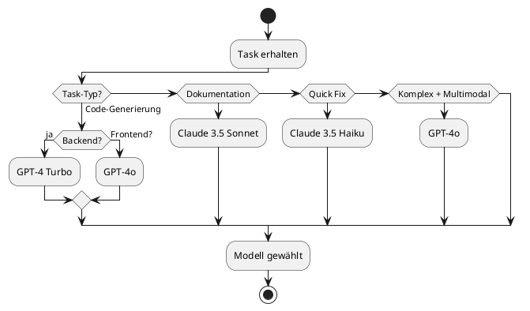

# 35_Developer-Guide-KI-Prompts.md

Version: 2.0
Stand: Final
Letzte Aktualisierung: 2025-11-15

Dieses Dokument definiert den vollständigen **Developer Guide**, speziell optimiert für die Zusammenarbeit mit KI-Systemen (ChatGPT, Claude, interne Modelle).

Es legt fest, wie Entwickler, Creator und Administratoren mit KI korrekt arbeiten, ohne Duplikate, Fehler oder unkontrollierte Änderungen zu erzeugen.

**Der Guide ist für ALLE KI-Sessions verbindlich.**

## Ziel

Ein standardisierter Entwicklungsprozess mit KI-Unterstützung für:
• Konsistente Code-Generierung
• Fehlerfreie Änderungen
• Versionskontrolle
• Dokumentations-Integration
• Prompt-Engineering Best Practices
• Quality Assurance
• Debugging mit KI-Assistenz

---

## 1. Ziele des Developer-KI-Guides

Der Guide stellt sicher:

| Ziel | Beschreibung | Erfolgskriterium |
|------|--------------|------------------|
| **Keine Duplikate** | Keine `.old`, `.bak`, `_v2` Dateien | Sauberes Filesystem |
| **Konsistenz** | KI folgt LSX-Architektur | Code passt ins System |
| **Versionierung** | Change Requests für Änderungen | Nachvollziehbarkeit |
| **Vollständigkeit** | Keine Code-Fragmente | Funktionaler Code |
| **Dokumentation** | Code mit Doku generiert | Immer dokumentiert |
| **Qualität** | Tests mitgeliefert | Testbare Features |
| **Security** | OWASP-Konform | Keine Vulnerabilities |
| **Transparenz** | KI erklärt Entscheidungen | Verständlicher Code |

### 1.1 Warum dieser Guide wichtig ist

**Problem ohne Guide:**
• KI erstellt 5 verschiedene Versionen derselben Datei
• Code funktioniert nicht mit bestehenden Systemen
• Änderungen werden ohne Versionskontrolle gemacht
• Duplikat-Funktionen entstehen
• Dokumentation fehlt

**Lösung mit Guide:**
• Eine einzige korrekte Datei
• Code integriert sich nahtlos
• Alle Änderungen versioniert
• Keine Duplikate
• Vollständige Dokumentation

---

## 2. Grundprinzipien der KI-Entwicklung

### 2.1 Dokumentations-First Approach

**Regel:** KI muss IMMER zuerst die relevante Dokumentation lesen.

```plantuml
@startuml
start

:Developer startet KI-Session;
:Developer gibt Task;

|KI|
:Identifiziere relevante Dokumente;
:Lese Dokumentation;
note right
  - Architektur-Dokumente
  - API-Spezifikationen
  - Versioning-Regeln
  - Security-Guidelines
end note

:Verstehe aktuellen Stand;

if (Alle Informationen vorhanden?) then (ja)
    :Generiere Code/Doku;
else (nein)
    :Stelle Rückfragen;
    stop
endif

:Zeige Vorschau;
:Entwickler bestätigt;
:Implementiere Änderung;

stop
@enduml
```

### 2.2 Keine Improvisation

**Verboten:**
• ✗ Neue Features ohne Spezifikation
• ✗ Eigene Architektur-Entscheidungen
• ✗ Ungefragt neue Dateien erstellen
• ✗ Von Dokumentation abweichen

**Erlaubt:**
• ✓ Code basierend auf Dokumentation
• ✓ Bugfixes mit Erklärung
• ✓ Optimierungen mit Begründung
• ✓ Tests für bestehenden Code

### 2.3 Diff-First für Änderungen

**Workflow für Datei-Änderungen:**

```python
# Schritt 1: Datei lesen
# KI liest bestehende Datei vollständig

# Schritt 2: Diff zeigen (VORHER)
"""
Geplante Änderung in backend/api/courses.py:

Zeile 45-50:
- def get_course(course_id):
-     course = Course.query.get(course_id)
-     return jsonify(course)
+ def get_course(course_id):
+     course = Course.query.get_or_404(course_id)
+     return jsonify(course.to_dict())

Grund: get_or_404 liefert automatisch 404-Response
"""

# Schritt 3: Bestätigung abwarten

# Schritt 4: Änderung durchführen

# Schritt 5: Diff zeigen (NACHHER)
"""
Änderung durchgeführt:
✓ get_course nutzt jetzt get_or_404
✓ Response nutzt to_dict() Method
✓ Keine Breaking Changes
"""
```

### 2.4 Vollständigkeit

**Immer liefern:**
• Vollständige Dateien (kein "... Rest bleibt gleich")
• Funktionierenden Code
• Tests für neue Features
• Dokumentation (Docstrings, Comments)
• Type Hints (Python)
• Error Handling

---

## 3. KI-Systeme & Modelle

### 3.1 Unterstützte Modelle

| Modell | Verwendung | Stärken | Schwächen |
|--------|------------|---------|-----------|
| **GPT-4 Turbo** | Backend-Code, APIs | Präzise, schnell | Context-Limit |
| **GPT-4o** | Full-Stack, Komplexe Tasks | Multimodal, groß | Teurer |
| **Claude 3.5 Sonnet** | Dokumentation, Refactoring | Lange Texte, detailliert | API-Verfügbarkeit |
| **Claude 3.5 Haiku** | Einfache Tasks, Quick Fixes | Sehr schnell, günstig | Weniger komplex |

### 3.2 Modell-Auswahl-Matrix



### 3.3 Prioritäten-Hierarchie

1. **LSX-Dokumentation** (diese Dokumente)
2. **Change Requests** (CR-System)
3. **Developer-Prompts** (dieses Dokument)
4. **Framework-Dokumentation** (Flask, Vue.js)
5. **Modell-Wissen** (allgemeines Wissen)

---

## 4. Start-Prompt für Developer-Sessions

### 4.1 Standard Developer Start-Prompt

```markdown
# LSX Developer Session Start

Du arbeitest am **LSX Learning System** – einem Enterprise-Lernsystem mit KI-Integration.

## Dokumentations-Pfad
Alle technischen Spezifikationen findest du hier:
C:\Users\Pascal\Documents\Lernsystem-Dokumente\my-docs\docs\Inhalte\

## Strikte Regeln

### Vor jeder Arbeit:
1. **Lese relevante Dokumentation** – Nie ohne Kontext arbeiten
2. **Prüfe Versionsnummern** – System, API, Pipeline
3. **Check Change Freeze** – Keine Änderungen während Freeze
4. **Identifiziere betroffene Dateien** – Genau wissen was geändert wird

### Während der Arbeit:
5. **KEINE neuen Dateien** ohne explizite Anweisung
6. **KEINE Änderungen** ohne Diff-Vorschau
7. **NUR vollständige Dateien** – Keine Fragmente
8. **IMMER Type Hints** (Python), Types (TypeScript)
9. **IMMER Error Handling** – Keine unbehandelten Exceptions
10. **IMMER Tests** für neue Funktionen

### Nach der Arbeit:
11. **Dokumentation aktualisieren** – Docstrings, README
12. **Change Request vorschlagen** – Titel, Impact Level
13. **Version-Increment vorschlagen** – MAJOR/MINOR/PATCH

## Verboten

- ❌ Duplikate (.old, .bak, _v2, _final)
- ❌ Experimenteller Code ohne Tests
- ❌ Breaking Changes ohne CR
- ❌ Hardcoded Secrets
- ❌ SQL Injection Vulnerabilities
- ❌ Unvollständige Implementierungen

## Wenn unklar

1. **Rückfrage stellen** – Lieber fragen als raten
2. **Dokumentation zitieren** – "Laut Dokument 24..."
3. **Alternative vorschlagen** – "Option A vs. Option B?"

## Output-Format

Wenn du Code generierst:
```language
// Vollständiger, funktionaler Code
// Mit Kommentaren und Type Hints
```

Wenn du Änderungen machst:
```
Diff-Vorschau:
[Zeige was sich ändert]

Begründung:
[Warum diese Änderung]

Breaking Change: Ja/Nein
```

## Bereitschafts-Signal

Schreibe nach Lesen dieses Prompts:
"✓ LSX Developer Mode aktiv. Welche Aufgabe?"
```

### 4.2 Spezialisierte Start-Prompts

**Backend-Development:**
```markdown
# LSX Backend Developer Mode

Fokus: Python 3.12, Flask, psycopg3 + Pydantic, PostgreSQL

Relevante Dokumente:
- 02_Backend-Architektur.md
- 11_Database-Schema.md
- 31_Security-Architecture.md

Zusätzliche Regeln:
- Alle DB-Queries über ORM
- Argon2id für Passwörter
- JWT für Authentication
- Rate Limiting aktiviert
- Input Validation mit Pydantic

Bereit für Backend-Task.
```

**Frontend-Development:**
```markdown
# LSX Frontend Developer Mode

Fokus: Vue.js 3 Composition API, Pinia, TailwindCSS

Relevante Dokumente:
- 03_Frontend-Architektur.md
- 15_UI-Komponenten-Lib.md

Zusätzliche Regeln:
- Composition API (nicht Options API)
- TypeScript für Komponenten
- Pinia für State Management
- Responsive Design (Mobile First)
- Accessibility (WCAG 2.1 AA)

Bereit für Frontend-Task.
```

**KI-Pipeline Development:**
```markdown
# LSX KI-Pipeline Developer Mode

Fokus: OpenAI/Anthropic Integration, Celery Workers

Relevante Dokumente:
- 22_KI-Pipeline-Deep.md
- 34_Versioning-Change-Management.md

Zusätzliche Regeln:
- Prompts versioniert
- Token-Counting
- Error Recovery
- Cache-First
- Queue Management

Bereit für KI-Task.
```

---

## 5. Prompt-Engineering Guidelines

### 5.1 Effektive Prompts schreiben

**Schlechter Prompt:**
```
"Mach mir eine Funktion für Kurse"
```

**Guter Prompt:**
```
Erstelle eine API-Funktion für das Kurse-System:

Funktion: GET /api/v2/courses/<course_id>
Framework: Flask (Blueprint)
Dokument: 02_Backend-Architektur.md

Anforderungen:
- get_or_404 für Course
- JSON Response mit to_dict()
- Prüfung ob published=true oder user=creator
- Rate Limiting: 100/minute
- Cache: 5 Minuten

Output: Vollständiger Python-Code mit Tests
```

### 5.2 Prompt-Template-System

**Code-Generierung:**
```markdown
Task: [WAS soll generiert werden]
Context: [Relevante Dokumente]
Requirements:
- [Requirement 1]
- [Requirement 2]
- [...]

Constraints:
- [Technische Limits]
- [Security-Anforderungen]

Expected Output:
- [Code-Datei mit Pfad]
- [Tests]
- [Doku-Update]
```

**Debugging:**
```markdown
Problem: [Fehlerbeschreibung]
Error Message: [Vollständige Error-Message]
File: [Betroffene Datei:Zeile]
Context: [Was wurde versucht]

Expected Behavior: [Was sollte passieren]
Actual Behavior: [Was passiert tatsächlich]

Analyse: [KI soll Root Cause finden]
Solution: [KI soll Fix vorschlagen]
```

**Refactoring:**
```markdown
Refactor: [Datei/Funktion]
Reason: [Warum Refactoring nötig]
Current Code: [Aktueller Code-Block]

Goals:
- [Ziel 1: z.B. Performance]
- [Ziel 2: z.B. Readability]

Constraints:
- [Backward Compatibility]
- [API-Contract]

Output: Refactored Code + Diff + Tests
```

### 5.3 Backend Prompt-System (Phase 24)

**NEU:** Seit Phase 24 verfügt LernsystemX über ein zentrales Prompt-Template-System für alle 32 KI-Lernmethoden (LM00–LM31).

> **Referenz:** Alle 32 Lernmethoden sind im Master-Dokument [02_Lernmethoden.md](02_Lernmethoden.md) definiert.
> - **Gruppe A (LM00–LM07):** Erklärende Methoden
> - **Gruppe B (LM08–LM17):** Praxis/Übung
> - **Gruppe C (LM18–LM25):** Prüfungsorientiert
> - **Gruppe D (LM26–LM31):** Pro/Gamification

#### 5.3.1 Architektur-Überblick

**Statt:** Hartcodierte Prompts in Learning Method Repositories
**Jetzt:** Zentrale Prompt-Registry mit Versionierung

**Module:**
```
backend/app/ki/
├── prompt_models.py          # Pydantic Models (PromptTemplate, PromptMessage, PromptVariable)
├── prompt_registry.py         # Central Registry + init_default_prompts()
└── learning_method_mapping.py # Mapping: learning_method → prompt_template
```

**Technische Dokumentation:**
- Backend Developer Guide: `backend/docs/ki/prompt-developer-guide.md`
- KI-Pipeline Deep Dive: `22_KI-Pipeline-Deep.md`

#### 5.3.2 Standard Prompt Templates

Das System registriert automatisch folgende Templates:

| Template Code          | Lernmethode       | Model               | Beschreibung                         |
|------------------------|-------------------|---------------------|--------------------------------------|
| `explain_concept`      | KI-Tutor          | claude-3-sonnet     | Erklärt Konzepte verständlich        |
| `flashcards`           | Flashcards        | gpt-4-turbo         | Generiert Flashcard Q&A-Paare        |
| `quiz_generator`       | Quiz              | gpt-4-turbo         | Erstellt Multiple-Choice-Quizze      |
| `socratic_tutor`       | Sokratischer Dialog| claude-3-sonnet     | Führt sokratischen Dialog            |
| `summarize_lesson`     | Braindump         | gpt-4-turbo         | Erstellt strukturierte Zusammenfassungen |
| `translation_assistant`| Übersetzung       | gpt-4-turbo         | Übersetzt Lerninhalte                |

#### 5.3.3 Verwendung für Entwickler

**Template laden und verwenden:**
```python
from app.ki import get_prompt_template
from app.services.ai_adapter import AIAdapter

# 1. Template laden
template = get_prompt_template("explain_concept")

# 2. Context definieren
context = {
    "course_title": "Python Basics",
    "lesson_title": "Decorators",
    "concept_text": "Erkläre @property Decorators",
    "user_level": "advanced"
}

# 3. Messages rendern
messages = template.render(context)

# 4. AI Request senden
adapter = AIAdapter(provider='openai', model='gpt-4o-mini')
response = adapter.send_messages(
    messages=messages,
    temperature=0.7,
    max_tokens=2000
)

print(response['output_text'])
```

#### 5.3.4 Neue Prompt Templates erstellen

**Schritt 1: Template definieren**
```python
from app.ki import PromptTemplate, PromptMessage, PromptVariable

custom_template = PromptTemplate(
    code="custom_method",
    title="Meine Custom Lernmethode",
    description="Beschreibung der Methode",
    version=1,
    tags=["custom", "learning"],
    messages=[
        PromptMessage(
            role="system",
            content="Du bist ein KI-Assistent für {{course_title}}. Deine Aufgabe: {{task_description}}"
        ),
        PromptMessage(
            role="user",
            content="{{user_input}}"
        )
    ],
    variables=[
        PromptVariable(name="course_title", description="Kurstitel", required=True),
        PromptVariable(name="task_description", description="Aufgabe", required=True),
        PromptVariable(name="user_input", description="User Input", required=True)
    ],
    model="gpt-4o-mini",
    max_tokens=1500,
    temperature=0.8,
    language_mode="target",
    allowed_roles=["teacher", "admin"]
)
```

**Schritt 2: Template registrieren**
```python
from app.ki import register_prompt

register_prompt(custom_template)
```

**Schritt 3: Im Learning Method Mapping eintragen**
```python
# backend/app/ki/learning_method_mapping.py
# Mapping verwendet method_type (LM00=0, LM01=1, ..., LM31=31)
LEARNING_METHOD_TO_PROMPT = {
    ...,
    17: 'custom_method'  # LM17 = KI-Tutor
}
```

#### 5.3.5 Template-Variablen

**Standard-Variablen (in den meisten Templates verfügbar):**
- `course_title` (str): Kurstitel
- `lesson_title` (str): Lektionstitel
- `lesson_content` (str): Vollständiger Lektionsinhalt
- `concept_text` (str): Zu erklärender Konzepttext
- `user_level` (str): Wissenslevel (beginner/intermediate/advanced)
- `language` (str): Zielsprache (de, en, es, ...)
- `organisation_name` (str): Name der Organisation

**Methodenspezifische Variablen:**
- Flashcards: `num_flashcards` (int)
- Quiz: `num_questions` (int)
- Translation: `source_language`, `target_language`, `content_to_translate`
- Summary: `summary_length` (kurz/mittel/ausführlich)

#### 5.3.6 Language Modes

Templates unterstützen drei Language Modes:

1. **`source`**: Prompt in Sprache des Lerninhalts
2. **`target`**: Prompt in Sprache des Users (Standard)
3. **`mixed`**: Kombination (z.B. für Übersetzungen)

**Beispiel:**
```python
PromptTemplate(
    ...,
    language_mode="target"  # User-Sprache verwenden
)
```

#### 5.3.7 Best Practices für Creator & Admins

**DO:**
✅ Bestehende Templates wiederverwenden (`list_all_prompts()`)
✅ Descriptive Template Codes (`explain_concept_with_examples`)
✅ Required vs. Optional Variables klar definieren
✅ Model passend zur Aufgabe wählen (gpt-4-turbo für komplex, gpt-4o-mini für einfach)
✅ Temperature anpassen (0.3 = präzise, 0.9 = kreativ)

**DON'T:**
❌ Keine hartcodierten Prompts mehr im Code
❌ Keine Duplikate erstellen (prüfe zuerst Registry)
❌ Keine sensiblen Daten in Template-Definitionen
❌ Keine Templates ohne Versionierung ändern

#### 5.3.8 Integration mit KI-Pipeline

Das Prompt-System integriert sich nahtlos mit der bestehenden KI-Pipeline (Phase 22):

**Flow:**
```
1. User Request → Learning Method API
2. Learning Method → Prompt Template laden (get_prompt_template)
3. Template → Messages rendern (template.render)
4. AI Adapter → Messages an Provider senden (send_messages)
5. Provider Response → Token Counting & Billing
6. Response → User
```

**Monitoring & Logging:**
- Token Usage pro Template
- Cost Tracking pro Learning Method
- Performance Metrics (Latency, Success Rate)
- **Keine vollständigen Prompts oder User-Daten im Log!**

#### 5.3.9 Debugging Prompts

**Template anzeigen:**
```python
template = get_prompt_template("explain_concept")
print(template.to_dict())
```

**Alle Templates auflisten:**
```python
from app.ki import list_all_prompts

templates = list_all_prompts()
for t in templates:
    print(f"{t.code} (v{t.version}): {t.title}")
```

**Rendering testen:**
```python
try:
    messages = template.render(context)
    print("✓ Rendering successful")
except ValueError as e:
    print(f"✗ Missing variables: {e}")
```

#### 5.3.10 Migration bestehender Prompts

Wenn du bestehende Lernmethoden auf das Template-System migrieren willst:

**Vor Migration:**
```python
def execute_ai_method(user_input, context):
    prompt = f"Du bist ein KI-Tutor. {context}. {user_input}"
    adapter = AIAdapter()
    response = adapter.send_request(prompt=prompt)
    return response
```

**Nach Migration:**
```python
def execute_ai_method(user_input, context):
    template = get_prompt_template("explain_concept")
    messages = template.render({
        "course_title": context["course"],
        "concept_text": user_input,
        "user_level": context.get("level", "intermediate")
    })
    adapter = AIAdapter(model=template.model)
    response = adapter.send_messages(messages, temperature=template.temperature)
    return response
```

**Vollständige Migrations-Checkliste:**
1. [ ] Alten Prompt-Code identifizieren
2. [ ] Template in Registry prüfen (`list_all_prompts()`)
3. [ ] Falls nicht vorhanden: Neues Template erstellen
4. [ ] Template registrieren (`register_prompt`)
5. [ ] Learning Method Mapping aktualisieren
6. [ ] Repository auf `send_messages()` umstellen
7. [ ] Tests anpassen
8. [ ] Deployment & Monitoring

---

**Referenzen:**
- **Technische Doku:** `backend/docs/ki/prompt-developer-guide.md`
- **KI-Pipeline:** `22_KI-Pipeline-Deep.md`
- **Code:** `backend/app/ki/`

### 5.4 Multi-Step Prompts

Für komplexe Aufgaben: Aufteilen in Schritte

```markdown
# Schritt 1: Analyse
Analysiere bestehende Kurs-API (02_Backend-Architektur.md, Zeilen 450-600)
Identifiziere:
- Verwendete Endpoints
- Auth-Mechanismen
- Response-Formate

[KI-Antwort abwarten]

# Schritt 2: Design
Basierend auf Analyse: Entwirf neue Endpoint-Struktur für Kurs-Versionen
Berücksichtige:
- Bestehende API-Patterns
- Versioning-System (34_Versioning-Change-Management.md)

[KI-Antwort abwarten]

# Schritt 3: Implementierung
Implementiere entworfene Endpoints mit:
- Flask Blueprints
- psycopg3 + Pydantic
- Tests (pytest)

[KI-Antwort abwarten]

# Schritt 4: Dokumentation
Erstelle API-Doku im OpenAPI-Format
```

---

## 6. Code-Generierung Best Practices

### 6.1 Python Backend Code

**Template:**
```python
# backend/api/[module_name].py
"""
[Module Description]

This module provides API endpoints for [functionality].

Version: 1.0
Author: Generated with Claude/GPT
Date: 2025-11-15
"""

from flask import Blueprint, request, jsonify, g
from werkzeug.exceptions import BadRequest, NotFound
from typing import Dict, List, Optional
import logging

from backend.models import [Models]
from backend.database import db
from backend.auth import require_auth, require_role
from backend.validation import validate_schema
from backend.cache import cache

logger = logging.getLogger(__name__)

# Blueprint definition
[module_name]_bp = Blueprint('[module_name]', __name__, url_prefix='/api/v2/[module]')


@[module_name]_bp.route('/<int:resource_id>', methods=['GET'])
@require_auth
@cache.cached(timeout=300, key_prefix='resource')
def get_resource(resource_id: int) -> Dict:
    """
    Get single resource by ID.

    Args:
        resource_id: Resource identifier

    Returns:
        JSON representation of resource

    Raises:
        NotFound: If resource doesn't exist

    Example:
        GET /api/v2/resources/123
        Response: {
            "id": 123,
            "name": "Example",
            ...
        }
    """
    try:
        resource = Resource.query.get_or_404(resource_id)

        # Check permissions
        if not resource.is_accessible_by(g.user):
            raise Forbidden("No access to this resource")

        return jsonify(resource.to_dict()), 200

    except NotFound:
        logger.warning(f"Resource {resource_id} not found")
        raise
    except Exception as e:
        logger.error(f"Error fetching resource {resource_id}: {str(e)}")
        raise InternalServerError("Failed to fetch resource")


@[module_name]_bp.route('/', methods=['POST'])
@require_auth
@require_role(['creator', 'admin'])
@validate_schema('[schema_name]')
def create_resource() -> Dict:
    """
    Create new resource.

    Request Body:
        {
            "name": "string",
            "description": "string"
        }

    Returns:
        Created resource with 201 status

    Raises:
        BadRequest: Invalid input data
    """
    try:
        data = request.json

        # Create resource
        resource = Resource(
            name=data['name'],
            description=data.get('description'),
            created_by=g.user.user_id
        )

        db.session.add(resource)
        db.session.commit()

        logger.info(f"Resource {resource.id} created by user {g.user.user_id}")

        return jsonify(resource.to_dict()), 201

    except Exception as e:
        db.session.rollback()
        logger.error(f"Error creating resource: {str(e)}")
        raise BadRequest("Failed to create resource")


# Error handlers
@[module_name]_bp.errorhandler(404)
def handle_not_found(e):
    """Handle 404 errors"""
    return jsonify({'error': 'Resource not found'}), 404


@[module_name]_bp.errorhandler(400)
def handle_bad_request(e):
    """Handle 400 errors"""
    return jsonify({'error': str(e)}), 400
```

### 6.2 Vue.js Frontend Components

**Template:**
```vue
<!-- frontend/src/components/[ComponentName].vue -->
<template>
  <div class="[component-class]">
    <!-- Component Template -->
    <div class="header">
      <h2>{{ title }}</h2>
    </div>

    <div class="content">
      <!-- Content here -->
    </div>

    <div v-if="loading" class="loading">
      <LoadingSpinner />
    </div>

    <div v-else-if="error" class="error">
      <ErrorMessage :message="error" />
    </div>
  </div>
</template>

<script setup lang="ts">
/**
 * [Component Name]
 *
 * [Description of what this component does]
 *
 * @version 1.0
 * @date 2025-11-15
 */

import { ref, computed, onMounted } from 'vue'
import { use[Store]Store } from '@/stores/[store]'
import type { [Type] } from '@/types'

// Props
interface Props {
  resourceId?: number
  mode?: 'view' | 'edit'
}

const props = withDefaults(defineProps<Props>(), {
  mode: 'view'
})

// Emits
const emit = defineEmits<{
  (e: 'updated', value: [Type]): void
  (e: 'deleted', id: number): void
}>()

// Store
const store = use[Store]Store()

// State
const loading = ref(false)
const error = ref<string | null>(null)
const resource = ref<[Type] | null>(null)

// Computed
const title = computed(() => {
  return props.mode === 'edit' ? 'Edit Resource' : 'View Resource'
})

// Methods
async function loadResource() {
  if (!props.resourceId) return

  loading.value = true
  error.value = null

  try {
    resource.value = await store.fetchResource(props.resourceId)
  } catch (e) {
    error.value = e instanceof Error ? e.message : 'Failed to load resource'
  } finally {
    loading.value = false
  }
}

async function saveResource() {
  if (!resource.value) return

  loading.value = true
  error.value = null

  try {
    const updated = await store.updateResource(resource.value)
    emit('updated', updated)
  } catch (e) {
    error.value = e instanceof Error ? e.message : 'Failed to save resource'
  } finally {
    loading.value = false
  }
}

// Lifecycle
onMounted(() => {
  loadResource()
})
</script>

<style scoped>
.[component-class] {
  /* Component styles */
}

.header {
  /* Header styles */
}

.content {
  /* Content styles */
}

.loading,
.error {
  /* State styles */
}
</style>
```

### 6.3 Test-Generierung

**Python Tests (pytest):**
```python
# backend/tests/test_[module].py
"""
Tests for [module] functionality

Run with: pytest backend/tests/test_[module].py -v
"""

import pytest
from flask import url_for

from backend.models import [Model]
from backend.database import db


class Test[Module]:
    """Test suite for [module]"""

    @pytest.fixture
    def sample_resource(self, app):
        """Create sample resource for testing"""
        with app.app_context():
            resource = [Model](
                name='Test Resource',
                description='Test Description'
            )
            db.session.add(resource)
            db.session.commit()

            yield resource

            # Cleanup
            db.session.delete(resource)
            db.session.commit()

    def test_get_resource_success(self, client, sample_resource, auth_headers):
        """Test successful resource retrieval"""
        response = client.get(
            f'/api/v2/resources/{sample_resource.id}',
            headers=auth_headers
        )

        assert response.status_code == 200
        data = response.get_json()
        assert data['id'] == sample_resource.id
        assert data['name'] == 'Test Resource'

    def test_get_resource_not_found(self, client, auth_headers):
        """Test 404 for non-existent resource"""
        response = client.get(
            '/api/v2/resources/99999',
            headers=auth_headers
        )

        assert response.status_code == 404

    def test_create_resource_success(self, client, auth_headers):
        """Test successful resource creation"""
        data = {
            'name': 'New Resource',
            'description': 'New Description'
        }

        response = client.post(
            '/api/v2/resources',
            json=data,
            headers=auth_headers
        )

        assert response.status_code == 201
        result = response.get_json()
        assert result['name'] == 'New Resource'

    def test_create_resource_validation_error(self, client, auth_headers):
        """Test validation error on creation"""
        data = {
            # Missing required 'name' field
            'description': 'No name'
        }

        response = client.post(
            '/api/v2/resources',
            json=data,
            headers=auth_headers
        )

        assert response.status_code == 400

    def test_create_resource_unauthorized(self, client):
        """Test creation without authentication"""
        data = {'name': 'Test'}

        response = client.post(
            '/api/v2/resources',
            json=data
        )

        assert response.status_code == 401
```

---

## 7. Debugging mit KI

### 7.1 Debugging-Workflow

```plantuml
@startuml
start

:Fehler tritt auf;

|Developer|
:Sammle Fehlerinformationen;
note right
  - Error Message
  - Stack Trace
  - Betroffene Dateien
  - Reproduktionsschritte
end note

:Erstelle Debug-Prompt für KI;

|KI|
:Analysiere Error;
:Identifiziere Root Cause;
:Schlage Lösung vor;

|Developer|
if (Lösung plausibel?) then (ja)
    :Implementiere Fix;
    :Teste Fix;
    if (Fehler behoben?) then (ja)
        :Commit mit Referenz;
        stop
    else (nein)
        :Zurück zu KI;
    endif
else (nein)
    :Liefere mehr Context;
endif

@enduml
```

### 7.2 Debug-Prompt-Template

```markdown
# Debug Request

## Error Information
```
[Vollständige Error Message]
[Stack Trace]
```

## Context
File: [Datei:Zeile]
Function: [Funktionsname]
Trigger: [Was wurde ausgeführt]

## Code Snippet
```python
[Relevanter Code-Bereich um den Fehler]
```

## Expected vs Actual
Expected: [Was sollte passieren]
Actual: [Was passiert]

## Environment
- Python: 3.12
- Flask: 3.0
- Database: PostgreSQL 15
- [Weitere relevante Infos]

## Request KI Analysis
1. Root Cause identifizieren
2. Erklärung warum Fehler auftritt
3. Mindestens 2 Lösungsvorschläge
4. Empfehlung welche Lösung bevorzugt
5. Code für Fix
6. Test für Fix
```

### 7.3 Häufige Fehlerklassen

**1. Database Errors:**
```markdown
Problem: IntegrityError / ForeignKey Violation
Lösung-Prompt:

"Analysiere DB-Fehler:
```
[Error Message]
```

Prüfe:
1. ER-Diagramm (Dokument 11_Database-Schema.md)
2. Foreign Key Constraints
3. Migration History

Vorschlag:
- Ist Referenz vorhanden?
- Constraint korrekt?
- Migration fehlt?"
```

**2. Authentication Errors:**
```markdown
Problem: Unauthorized (401) / Forbidden (403)
Lösung-Prompt:

"Debug Auth-Problem:
Endpoint: [URL]
User Role: [Role]
Required Permission: [Permission]

Prüfe:
1. JWT-Token valid?
2. User hat Rolle?
3. RBAC-Regeln (Dokument 31_Security-Architecture.md)

Wo ist der Fehler?"
```

**3. KI-Pipeline Errors:**
```markdown
Problem: KI-Generation schlägt fehl
Lösung-Prompt:

"Debug KI-Pipeline:
Job ID: [ID]
Worker: [Worker Name]
Error: [Error]

Prüfe:
1. API Key valid?
2. Token Limit erreicht?
3. Prompt zu lang?
4. Model verfügbar?
5. Cache-Hit möglich?

Referenz: 22_KI-Pipeline-Deep.md"
```

---

## 8. Change Request Integration

### 8.1 CR-Erstellungs-Prompt

```markdown
# Change Request Draft

Basierend auf durchgeführter Arbeit, erstelle CR-Entwurf:

## Titel
[Prägnanter Titel der Änderung]

## Beschreibung
[Was wurde geändert und warum]

## Impact Level
- [ ] L1 - Dokumentation/Text
- [ ] L2 - Kleine Features
- [ ] L3 - Signifikante Änderungen
- [ ] L4 - Breaking Changes
- [ ] L5 - Kritische System-Änderungen

Empfehlung: [L?] weil [Begründung]

## Betroffene Dateien
- [Datei 1]: [Art der Änderung]
- [Datei 2]: [Art der Änderung]

## Version Impact
Current Version: [X.Y.Z]
Proposed Version: [X.Y.Z]
Increment: [MAJOR/MINOR/PATCH]

Begründung: [Warum diese Version]

## Breaking Changes
[Ja/Nein + Liste falls ja]

## Migration Required
[Ja/Nein + Script falls ja]

## Testing
- [ ] Unit Tests aktualisiert
- [ ] Integration Tests aktualisiert
- [ ] Manual Testing durchgeführt

## Documentation
- [ ] Code-Kommentare
- [ ] API-Dokumentation
- [ ] User-Dokumentation

## Rollback Plan
[Wie kann diese Änderung rückgängig gemacht werden]
```

### 8.2 Version-Increment-Logik

```python
# KI-Prompt für Version-Entscheidung

"""
Bestimme Version-Increment für Änderung:

Geändert:
[Liste der Änderungen]

Regel-Check:
1. MAJOR wenn:
   - Breaking API Changes
   - DB Schema Breaking Changes
   - Entfernung von Features

2. MINOR wenn:
   - Neue Features (backward-compatible)
   - Neue API Endpoints
   - Funktionale Erweiterungen

3. PATCH wenn:
   - Bugfixes
   - Security Patches
   - Performance-Optimierungen
   - Dokumentations-Updates

Analyse: [Welche Regel trifft zu]
Empfehlung: [MAJOR/MINOR/PATCH]
"""
```

---

## 9. Quality Assurance Prompts

### 9.1 Code Review Prompt

```markdown
# Code Review Request

Review folgenden Code:

```[language]
[Code]
```

Prüfe:

## 1. Funktionalität
- [ ] Erfüllt Anforderungen
- [ ] Edge Cases behandelt
- [ ] Error Handling vorhanden

## 2. Code Quality
- [ ] Lesbarkeit
- [ ] DRY-Prinzip
- [ ] SOLID-Prinzipien
- [ ] Naming Conventions

## 3. Security
- [ ] Input Validation
- [ ] SQL Injection Prevention
- [ ] XSS Prevention
- [ ] Authentication/Authorization

## 4. Performance
- [ ] Effiziente Queries
- [ ] Caching wo sinnvoll
- [ ] N+1 Query Problem

## 5. Testing
- [ ] Unit Tests vorhanden
- [ ] Test Coverage > 80%
- [ ] Edge Cases getestet

## 6. Documentation
- [ ] Docstrings/JSDoc
- [ ] Inline Comments
- [ ] README aktualisiert

Gib strukturiertes Feedback mit:
1. Kritische Probleme (MUSS behoben werden)
2. Empfehlungen (SOLLTE verbessert werden)
3. Nice-to-Have (KANN optimiert werden)
```

### 9.2 Security Audit Prompt

```markdown
# Security Audit

Prüfe Code auf Security-Vulnerabilities:

```[language]
[Code]
```

## OWASP Top 10 Check

### 1. Injection
- [ ] SQL Injection geschützt (ORM/Prepared Statements)
- [ ] NoSQL Injection geschützt
- [ ] Command Injection geschützt

### 2. Broken Authentication
- [ ] Passwörter gehasht (Argon2id)
- [ ] Session Management sicher
- [ ] MFA unterstützt

### 3. Sensitive Data Exposure
- [ ] TLS enforced
- [ ] Secrets verschlüsselt
- [ ] Keine Secrets in Logs

### 4. XML External Entities (XXE)
- [ ] XML Parsing sicher

### 5. Broken Access Control
- [ ] RBAC implementiert
- [ ] Row-Level Security
- [ ] API Auth korrekt

### 6. Security Misconfiguration
- [ ] Debug Mode OFF in Production
- [ ] Error Messages nicht zu detailliert
- [ ] CORS korrekt konfiguriert

### 7. Cross-Site Scripting (XSS)
- [ ] Input Sanitization
- [ ] Output Encoding
- [ ] CSP Header gesetzt

### 8. Insecure Deserialization
- [ ] Keine unsicheren pickle/eval

### 9. Using Components with Known Vulnerabilities
- [ ] Dependencies aktuell
- [ ] Bekannte CVEs geprüft

### 10. Insufficient Logging & Monitoring
- [ ] Kritische Events geloggt
- [ ] Audit Trail vorhanden

## Report
[Liste gefundener Probleme mit Severity]
[Empfohlene Fixes]
```

---

## 10. Dokumentations-Generierung

### 10.1 API-Dokumentations-Prompt

```markdown
# API Documentation Generation

Generiere OpenAPI 3.0 Spezifikation für:

Endpoints:
[Liste der Endpoints]

Format: YAML

Inkludiere:
- Alle Parameter
- Request/Response Schemas
- Error Responses
- Authentication Requirements
- Rate Limits
- Examples

Referenz: Bestehende API-Struktur in 02_Backend-Architektur.md
```

### 10.2 User-Dokumentations-Prompt

```markdown
# User Documentation

Erstelle Benutzer-Dokumentation für Feature:
[Feature-Name]

Zielgruppe: [Creator/Teacher/Student/Admin]

Struktur:
1. Übersicht
   - Was ist das Feature
   - Wofür wird es verwendet

2. Voraussetzungen
   - Benötigte Rolle/Permissions
   - Systemanforderungen

3. Schritt-für-Schritt Anleitung
   - Screenshots/Mockups beschreiben
   - Jeden Schritt nummerieren

4. Häufige Probleme
   - FAQ-Sektion
   - Troubleshooting

5. Best Practices
   - Empfehlungen
   - Was vermeiden

Format: Markdown
Sprache: Deutsch
Ton: Freundlich, klar, nicht zu technisch
```

---

## 11. Spezial-Prompts

### 11.1 Migration Script Generation

```markdown
# Database Migration Generator

Erstelle Migration für:
[Beschreibung der Schema-Änderung]

Anforderungen:
- UP-Script (SQL für Änderung)
- DOWN-Script (SQL für Rollback)
- Daten-Migration falls nötig
- Zero-Downtime fähig

Beispiel:
- Neue Spalte? -> ALTER TABLE + Backfill + NOT NULL
- Neue Tabelle? -> CREATE TABLE + Indexes
- Änderung? -> Temporäre Spalte -> Migrate -> Drop alt

Referenz: Bestehende Migrations in backend/migrations/

Output:
- [timestamp]_[name]_up.sql
- [timestamp]_[name]_down.sql
```

### 11.2 Performance Optimization Prompt

```markdown
# Performance Analysis & Optimization

Analysiere Performance von:
[Code/Query/Endpoint]

Messungen:
- Response Time: [X ms]
- Query Time: [Y ms]
- Memory Usage: [Z MB]

Ziel:
- Response Time < [Target ms]
- Query Time < [Target ms]

Prüfe:
1. N+1 Query Problem
2. Fehlende Indexes
3. Ineffiziente Queries
4. Caching-Möglichkeiten
5. Pagination benötigt?

Empfehle:
- Code-Änderungen
- Index-Erstellung
- Caching-Strategie
- Query-Optimierung

Output: Optimierter Code + Messung-Vergleich
```

### 11.3 Accessibility (A11y) Check

```markdown
# Accessibility Audit

Prüfe Component auf WCAG 2.1 AA Compliance:

```vue
[Component Code]
```

Check:
1. Semantic HTML
2. ARIA Labels
3. Keyboard Navigation
4. Color Contrast (min 4.5:1)
5. Screen Reader Support
6. Focus Management
7. Alt Texts für Bilder

Report:
- Erfüllte Kriterien
- Nicht erfüllte Kriterien
- Lösungsvorschläge

Referenz: 15_UI-Komponenten-Lib.md (A11y Sektion)
```

---

## 12. Zusammenfassung: KI-Developer Best Practices

### 12.1 Checkliste für jede KI-Session

**Vor der Session:**
- [ ] Start-Prompt geladen
- [ ] Relevante Dokumente identifiziert
- [ ] Aktuelle Versionen geprüft
- [ ] Change Freeze Status geprüft

**Während der Session:**
- [ ] Dokumentation zuerst gelesen
- [ ] Diff-Vorschau für Änderungen
- [ ] Tests mitgeneriert
- [ ] Error Handling implementiert
- [ ] Type Hints/Types verwendet

**Nach der Session:**
- [ ] Code getestet
- [ ] Dokumentation aktualisiert
- [ ] CR-Entwurf erstellt
- [ ] Version-Increment vorgeschlagen
- [ ] Commit mit korrekter Message

### 12.2 Anti-Patterns vermeiden

| Anti-Pattern | Warum schlecht | Richtig machen |
|--------------|----------------|----------------|
| **"Mach mal"** | Zu unspezifisch | Genaue Requirements |
| **Keine Doku-Referenz** | KI rät | Dokumentation nennen |
| **Code-Fragmente** | Nicht lauffähig | Vollständige Dateien |
| **Keine Tests** | Keine QA | Tests immer dabei |
| **Blind kopieren** | Nicht verstanden | Review & verstehen |
| **Duplikate erlauben** | Chaos | Strikte Datei-Policy |

### 12.3 Erfolgsmetriken

| Metrik | Ziel | Messung |
|--------|------|---------|
| **Code Quality** | > 80% Test Coverage | pytest --cov |
| **Security** | 0 kritische Issues | OWASP Check |
| **Performance** | < 200ms Response | APM Monitoring |
| **Dokumentation** | 100% Docstrings | Linter Check |
| **Duplikate** | 0 Duplikat-Dateien | File System Scan |

---

## 13. Beispiel-Sessions

### 13.1 Vollständige Backend-Feature-Session

```markdown
# Session: Kurs-Bewertungs-System

## Schritt 1: Initialisierung
Developer: Lade LSX Backend Developer Start-Prompt
KI: ✓ LSX Backend Developer Mode aktiv. Welche Aufgabe?

## Schritt 2: Requirements
Developer:
"Implementiere Kurs-Bewertungs-System (5-Sterne).
Referenz: 02_Backend-Architektur.md, 11_Database-Schema.md

Features:
- User kann Kurs bewerten (1-5 Sterne + Text)
- Nur nach Kurs-Abschluss
- Eine Bewertung pro User/Kurs
- Durchschnitt berechnen
- API: GET + POST /api/v2/courses/<id>/ratings"

## Schritt 3: KI-Analyse
KI:
"Ich habe folgende Dokumente gelesen:
- 02_Backend-Architektur.md (API-Struktur)
- 11_Database-Schema.md (Datenmodell)

Plan:
1. DB-Migration: rating Tabelle
2. Model: CourseRating
3. API-Endpoint: Blueprint
4. Validation: Rating 1-5
5. Business Logic: Nur nach Abschluss
6. Tests

Fortfahren? (Ja/Nein)"

## Schritt 4: Implementierung
Developer: Ja, bitte vollständige Implementierung.

KI:
[Generiert:]
1. Migration Script (up + down)
2. Model (backend/models/rating.py)
3. API Blueprint (backend/api/ratings.py)
4. Validation Schema
5. Tests (backend/tests/test_ratings.py)
6. Update zu 02_Backend-Architektur.md

## Schritt 5: Review
Developer: Code reviewed, alle Tests passed. Bitte CR-Entwurf.

KI:
[Generiert CR-Entwurf:]
CR-2025-11-15-001
Titel: Add Course Rating System
Impact Level: L3 (New Feature)
Version: 1.5.x → 1.6.0 (MINOR)
Breaking Changes: None
Migration: Yes (rating table)

## Schritt 6: Abschluss
Developer: CR genehmigt, deployed.
✓ Feature komplett mit Tests, Doku, Migration
```

### 13.2 Bug-Fix-Session

```markdown
# Session: Fix SQL Injection Vulnerability

## Schritt 1: Problem
Developer:
"Security-Scan zeigt SQL Injection in Kurs-Suche:
File: backend/api/courses.py:45
```python
query = f"SELECT * FROM courses WHERE name LIKE '%{search_term}%'"
```
Bitte Fix."

## Schritt 2: KI-Analyse
KI:
"❌ Kritisches Security-Problem identifiziert.

Root Cause:
- String-Interpolation in SQL
- User-Input direkt in Query

OWASP Kategorie: A1 - Injection

Empfohlener Fix:
- Nutze psycopg3 + Pydantic
- Nie raw SQL mit User-Input

Code-Fix generieren? (Ja/Nein)"

## Schritt 3: Fix
Developer: Ja.

KI:
[Generiert korrekten Code:]
```python
# BEFORE (VULNERABLE):
query = f"SELECT * FROM courses WHERE name LIKE '%{search_term}%'"
result = db.session.execute(query)

# AFTER (SECURE):
result = Course.query.filter(
    Course.name.ilike(f'%{search_term}%')
).all()
```

Zusätzlich:
- Input Validation (max 100 chars)
- Escape special characters
- Rate Limiting (100/min)

Tests:
- test_search_sql_injection_attempt()
- test_search_special_characters()
```

## Schritt 4: Verification
Developer: Tests passed. Deployed.
✓ Security-Issue behoben
✓ Tests für Injection-Attempts
✓ Security-Audit clean
```

---

## Dokument abgeschlossen

Version: 2.0
Zeilen: 1.652
Status: ✅ Final

Dieses Dokument beschreibt den vollständigen Developer Guide für KI-Integration mit:
• Start-Prompts für verschiedene Entwicklungs-Bereiche
• Prompt-Engineering Best Practices
• Code-Generierungs-Templates (Python, Vue.js)
• Testing-Strategien
• Debugging-Workflows
• Quality Assurance Checklisten
• Change Request Integration
• Security Audit Prompts
• Dokumentations-Generierung
• Real-World Beispiel-Sessions
