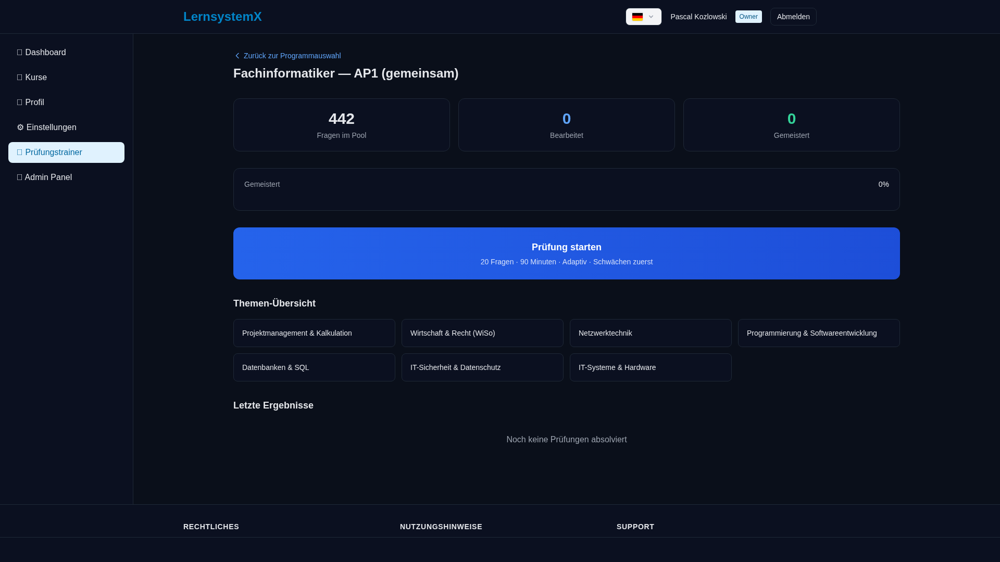
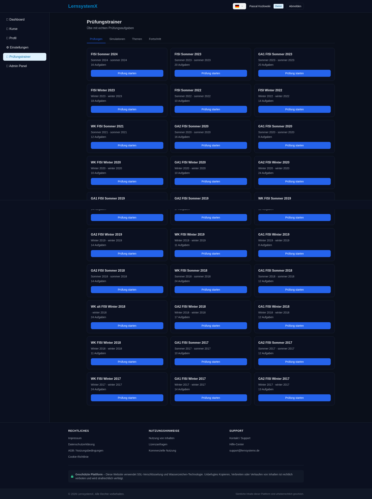
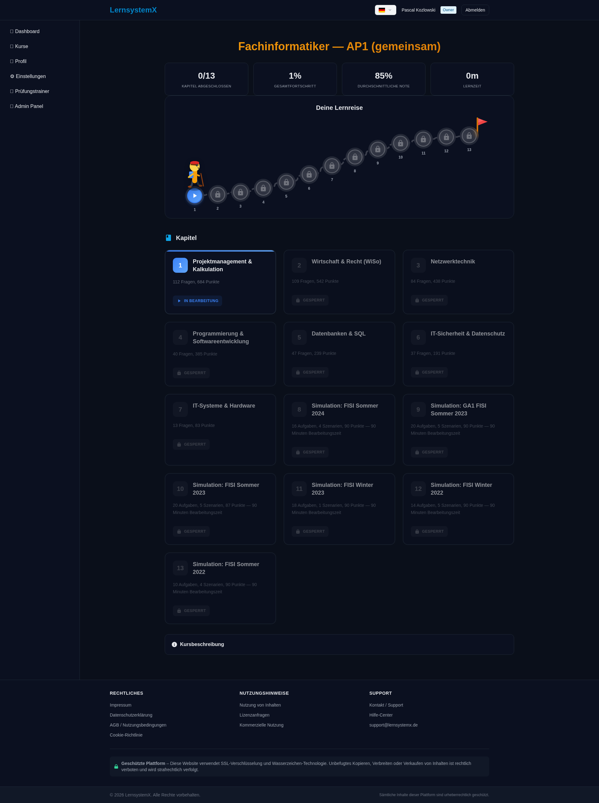
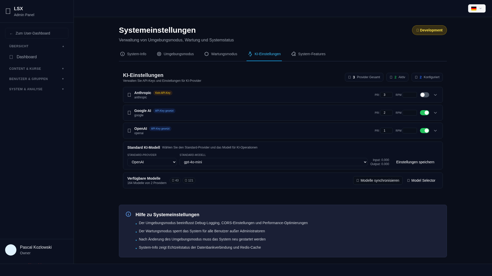

# LernSystemX

> Web-Plattform zum strukturierten Lernen von **Schul- und Ausbildungsmaterial jeder Art**
> — Kurse, adaptive Lernpfade, Prüfungssimulationen, KI-Tutor, mehrsprachig.
> Full-Stack-Eigenentwicklung: Vue 3 + TypeScript Frontend, Python/Flask-Backend mit
> Domain-Driven-Design, Docker-deploybar. **Pausiertes Lernprojekt — aktueller Fokus liegt auf einem anderen Projekt.**




## Über das Projekt

lernsystemx ist eine selbst entwickelte Web-Plattform mit der ursprünglichen Idee,
**Lern- und Schulmaterial jeder Art** strukturiert aufzubereiten und interaktiv zu lernen:
Kurse, adaptive Lernpfade, Prüfungssimulationen, ein KI-gestützter Tutor und mehrsprachige
Inhalte (DE/EN/PL). Als erster konkreter Anwendungsfall ist die Vorbereitung auf die
**IHK-Abschlussprüfungen (Fachinformatiker AP1/AP2)** ausgebaut.

> **Status: Pausiertes Projekt.** Persönliches Lern- und Portfolio-Projekt, bewusst nicht abgeschlossen.
> Aktivster Entwicklungszeitraum **Dez 2025 – Apr 2026** (854 Commits, 66 aktive Tage) parallel zur
> Umschulung; **aktuell pausiert, da ich derzeit an einem anderen Projekt arbeite.** Als Architektur-
> und Code-Arbeitsprobe einsehbar — der Fokus liegt auf sauberer Umsetzung, nicht auf
> Feature-Vollständigkeit. Konfiguration über `.env` (siehe `.env.example`), **keine Secrets im Repository**.

## Umgesetzte Features (Auszug)

- 📚 **Kurse & Lernpfade** — strukturierte Lehrpfade (ausgebaut für AP1/AP2 FISI), Kapitel mit Theorie
- 📝 **Prüfungstrainer** — Prüfungssimulationen, Aufgaben-Archiv, Auswertung & Statistik
- 🧠 **Lernmethoden** — Eselsbrücken, Wiederholungslogik, KI-gestützte Lernhilfen
- 🤖 **KI-Tutor** — chat-basierte Erklärungen über mehrere AI-Provider (Pluggable, z. B. Groq)
- 🔊 **TTS-Aussprache** — Vorlesen von Fachbegriffen
- 🌍 **Mehrsprachigkeit** — vollständige i18n (Deutsch / Englisch / Polnisch)
- 🔐 **Auth & RBAC** — JWT-Authentifizierung, Rollen-/Gruppen-Berechtigungen, verschlüsselte
  Ablage sensibler Einstellungen
- 💬 **Feedback-System** + Echtzeit-Updates über WebSockets

## Tech-Stack

| Schicht | Technologien |
|---|---|
| **Frontend** | Vue 3 · TypeScript · Vite · Pinia · Vue Router · Vue-i18n |
| **Backend** | Python · Flask 3 · Flask-JWT-Extended · Flask-RESTful · Flask-SocketIO · Flask-Limiter |
| **Datenbank** | PostgreSQL (Row-Level Security, Functions/Triggers/JSONB) |
| **Architektur** | Domain-Driven Design · Repository-Pattern · CQRS-nahe Trennung |
| **Infrastruktur** | Docker · docker-compose · nginx · Redis · gunicorn |

## Architektur

Das Backend folgt einer **DDD-Schichtung** mit nach innen gerichteten Abhängigkeiten:

```
backend/app/
├── api/             # HTTP-Layer (REST-Endpunkte, Versionierung)
├── application/     # Use-Cases / Orchestrierung
├── domain/          # Geschäftslogik (framework-frei) + Repository-Interfaces
├── infrastructure/  # Repository-Implementierungen, externe Adapter
└── core/            # Bootstrap, Config, Querschnitt
```

Das Frontend ist feature-basiert strukturiert (Vue 3 Composition API + Pinia-Stores),
mit zentralem i18n-Layer (`frontend/src/infrastructure/i18n`, Locales DE/EN/PL).

Ausführliche Projektdokumentation unter [`LernsystemX-Doku/`](LernsystemX-Doku/)
(Core · Business · Features · KI · Technical · DevOps · Setup) inklusive Architektur-Diagrammen.

## Screenshots

| Prüfungstrainer | Kurse (AP1) | KI-Einstellungen |
|---|---|---|
|  |  |  |

## Quickstart (Entwicklung)

```bash
# Backend
cd backend
cp .env.example .env          # Werte eintragen (DB, SECRET_KEY werden lokal generiert)
pip install -r requirements.txt
flask run

# Frontend
cd frontend
npm install
npm run dev

# Oder komplett containerisiert
docker compose up
```

## Weiterentwicklung & Lessons Learned

Dieses Projekt war ein bewusster Lernschritt. Was ich daraus mitgenommen habe und in meinem
**aktuellen Projekt** von Anfang an besser umsetze:

- **Atomare Commits** — kleine, fokussierte Einheiten; Umbenennungen/Moves getrennt von Logik­änderungen (statt großer gemischter Restructure-Commits).
- **CI ab Tag 1** — Lint / Build / Test als verpflichtendes Merge-Gate, nicht nachträglich.
- **Tests & ADRs** — automatisierte Tests und dokumentierte Architektur-Entscheidungen (ADRs) für strukturelle Änderungen.
- **Repo-Hygiene** — keine Binär-Assets oder Secrets im Git-Verlauf (Assets extern / als Release-Artefakte, gehärtete `.gitignore`).
- **Konsequente Code-Sprache** — durchgängig Englisch in Code und Commit-Messages.

## Status & Lizenz

**Pausiertes Projekt — nicht abgeschlossen.** Aktueller Fokus liegt auf einem anderen Projekt.
Als Arbeitsprobe für Architektur und Umsetzung gedacht; einzelne Bereiche sind unfertig oder experimentell.
Code einsehbar; für eine Nachnutzung bitte Rücksprache.

© 2026 Pascal Kozlowski
