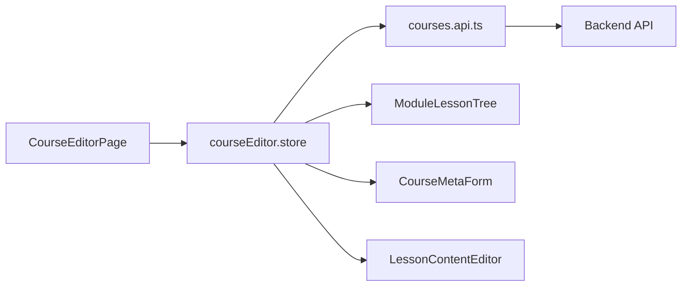

# Frontend Phase F9 – Kurs- & Editor-System

**Version:** 1.0
**Status:** Completed
**Datum:** 2024-11-17

---

## 1. Überblick

Phase F9 implementiert das **vollständige Kurs- & Editor-System** für Creator, Teacher und Admins im Frontend. Das System ermöglicht das Erstellen, Bearbeiten und Verwalten von Kursen, Modulen und Lessons mit einem intuitiven Editor-Interface.

### Ziele

- ✅ Kursverwaltung (Listen, Filtern, Suchen)
- ✅ Kurs-Editor mit Meta-Daten-Bearbeitung
- ✅ Modul- & Lesson-Strukturverwaltung
- ✅ Content-Editor für verschiedene Lesson-Typen
- ✅ Rollenbasierter Zugriff (Creator/Teacher/Admin)
- ✅ Unsaved-Changes-Warnung
- ✅ State Management mit Pinia

---

## 2. Architektur

### 2.1 Komponenten-Hierarchie

```
CreatorCoursesPage (Liste)
└─ Course Cards

CourseEditorPage (Editor)
├─ ModuleLessonTree (Sidebar)
│  ├─ Module hinzufügen/löschen
│  └─ Lessons hinzufügen/löschen
├─ CourseMetaForm (Center)
│  ├─ Titel, Beschreibung
│  ├─ Level, Sprache, Sichtbarkeit
│  └─ Publish/Unpublish Toggle
└─ LessonContentEditor (Center bei Lesson-Auswahl)
   ├─ Text-Editor (Markdown)
   ├─ Video-Editor (URL + Typ)
   ├─ Quiz-Platzhalter
   └─ AI-Lesson-Platzhalter
```

### 2.2 Datenfluss



---

## 3. API-Layer (`courses.api.ts`)

### 3.1 Erweiterte Interfaces

**Editor-spezifische Types:**

```typescript
interface CreateCoursePayload {
  title: string
  subtitle?: string
  description?: string
  category_id?: number
  level?: 'beginner' | 'intermediate' | 'advanced' | 'expert'
  language?: string
  visibility?: string
  price?: number
  tags?: string[]
}

interface EditableCourse {
  course_id: number
  title: string
  description?: string
  level: string
  language: string
  visibility: string
  is_published: boolean
  draft_state: boolean
  // ...
}

interface EditableModule {
  module_id: number
  course_id: number
  title: string
  description?: string
  order_index: number
}

interface EditableLesson {
  lesson_id: number
  module_id: number
  course_id: number
  title: string
  lesson_type: 'text' | 'video' | 'quiz' | 'ai' | 'mixed'
  content?: any
  order_index: number
}
```

### 3.2 CRUD-Funktionen

**Course Operations:**
- `createCourse(payload)` – POST /courses
- `updateCourse(courseId, payload)` – PATCH /courses/:id
- `deleteCourse(courseId)` – DELETE /courses/:id
- `getCourseForEdit(courseId)` – GET /courses/:id/edit
- `publishCourse(courseId)` – POST /courses/:id/publish
- `unpublishCourse(courseId)` – POST /courses/:id/unpublish

**Module Operations:**
- `createModule(payload)` – POST /modules
- `updateModule(moduleId, payload)` – PATCH /modules/:id
- `deleteModule(moduleId)` – DELETE /modules/:id
- `reorderModules(courseId, payload)` – POST /courses/:id/modules/reorder
- `getModulesForEdit(courseId)` – GET /courses/:id/modules/edit

**Lesson Operations:**
- `createLesson(payload)` – POST /lessons
- `updateLesson(lessonId, payload)` – PATCH /lessons/:id
- `deleteLesson(lessonId)` – DELETE /lessons/:id
- `reorderLessons(moduleId, payload)` – POST /modules/:id/lessons/reorder
- `getLessonsForEdit(moduleId)` – GET /modules/:id/lessons/edit

---

## 4. State Management (`courseEditor.store.ts`)

### 4.1 State

```typescript
const currentCourse = ref<EditableCourse | null>(null)
const modules = ref<EditableModule[]>([])
const lessonsByModuleId = ref<Record<number, EditableLesson[]>>({})
const selectedModuleId = ref<number | null>(null)
const selectedLessonId = ref<number | null>(null)
const loading = ref(false)
const saving = ref(false)
const dirty = ref(false)
const error = ref<string | null>(null)
```

### 4.2 Getters

- `hasCourse` – Boolean, ob Kurs geladen
- `isDirty` – Boolean, ob ungespeicherte Änderungen
- `currentModule` – Aktuell ausgewähltes Modul
- `currentLesson` – Aktuell ausgewählte Lesson
- `sortedModules` – Module sortiert nach order_index
- `sortedLessons(moduleId)` – Lessons eines Moduls sortiert

### 4.3 Actions

**Course Management:**
- `loadCourseForEdit(courseId)` – Lädt Kurs + Module + Lessons
- `createNewCourse(initialData?)` – Erstellt neuen Kurs
- `updateCourseMeta(payload)` – Aktualisiert Kurs-Metadaten
- `publishCourse()` / `unpublishCourse()` – Veröffentlichungsstatus

**Module Management:**
- `addModule(title)` – Neues Modul hinzufügen
- `updateModuleMeta(moduleId, payload)` – Modul bearbeiten
- `removeModule(moduleId)` – Modul löschen
- `reorderModules(reorderedModules)` – Reihenfolge ändern

**Lesson Management:**
- `addLesson(moduleId, title)` – Neue Lesson hinzufügen
- `updateLessonMeta(lessonId, payload)` – Lesson-Metadaten bearbeiten
- `updateLessonContent(lessonId, content)` – Lesson-Inhalt aktualisieren
- `removeLesson(moduleId, lessonId)` – Lesson löschen
- `reorderLessons(moduleId, reorderedLessons)` – Reihenfolge ändern

**Utility:**
- `selectModule(moduleId)` – Modul auswählen
- `selectLesson(moduleId, lessonId)` – Lesson auswählen
- `markDirty()` – Als geändert markieren
- `saveAllChanges()` – Alle Änderungen speichern
- `discardChanges()` – Änderungen verwerfen
- `clearEditor()` – Editor-State zurücksetzen

---

## 5. Routing

### 5.1 Creator-Routen

```typescript
{
  path: '/creator',
  meta: { requiresAuth: true, requiresCreatorOrTeacher: true },
  children: [
    {
      path: 'courses',
      name: 'CreatorCourses',
      component: CreatorCoursesPage
    },
    {
      path: 'courses/new',
      name: 'CreateCourse',
      component: CourseEditorPage,
      props: { mode: 'create' }
    },
    {
      path: 'courses/:courseId/edit',
      name: 'EditCourse',
      component: CourseEditorPage,
      props: (route) => ({ courseId: Number(route.params.courseId), mode: 'edit' })
    }
  ]
}
```

### 5.2 Router Guard

```typescript
if (to.meta.requiresCreatorOrTeacher) {
  const allowedRoles = ['creator', 'teacher', 'school_admin', 'company_admin', 'admin', 'superadmin']
  const hasAccess = allowedRoles.includes(authStore.userRole)

  if (!hasAccess) {
    next({ name: 'Dashboard' })
    return
  }
}
```

**Zugriffsrechte:**
- ✅ creator
- ✅ teacher
- ✅ school_admin
- ✅ company_admin
- ✅ admin
- ✅ superadmin
- ❌ user (normale Students)

---

## 6. Seiten & Komponenten

### 6.1 CreatorCoursesPage.vue

**Features:**
- Liste aller eigenen Kurse
- Suche nach Titel/Beschreibung
- Filter nach Status (Draft/Published)
- Karten-Layout mit:
  - Thumbnail (oder Gradient-Placeholder)
  - Titel, Beschreibung
  - Status-Badge
  - Module & Lessons Count
  - "Bearbeiten"-Button
  - "Löschen"-Button (mit Confirm)
- "Neuer Kurs"-Button (Header)

**API-Calls:**
- `getMyCourses()` – Lädt Kurse
- `deleteCourse(courseId)` – Löscht Kurs

### 6.2 CourseEditorPage.vue

**Features:**
- Sticky Header mit Save/Cancel-Buttons
- "Nicht gespeichert"-Badge bei Dirty State
- 3-Spalten-Layout:
  - Sidebar (3 Spalten): ModuleLessonTree
  - Center (9 Spalten): CourseMetaForm ODER LessonContentEditor
- Unsaved-Changes-Warning beim Verlassen
- Loading & Error States

**Lifecycle:**
- `onMounted` – Lädt Kurs (Edit-Modus) oder erstellt neuen (Create-Modus)
- `onBeforeUnmount` – Räumt Editor-State auf
- `onBeforeRouteLeave` – Warnt bei ungespeicherten Änderungen

### 6.3 ModuleLessonTree.vue (Sidebar)

**Features:**
- "Modul hinzufügen"-Button
- Liste aller Module (sortiert)
  - Module-Header (klickbar → selektieren)
  - Löschen-Button
- Bei selektiertem Modul:
  - "Lesson hinzufügen"-Button
  - Liste aller Lessons
  - Lesson-Titel (klickbar → selektieren)
  - Löschen-Button

**Interaktionen:**
- Klick auf Modul → `selectModule(moduleId)`
- Klick auf Lesson → `selectLesson(moduleId, lessonId)`
- "+ Modul" → Prompt → `addModule(title)`
- Löschen → Confirm → `removeModule(moduleId)`

### 6.4 CourseMetaForm.vue

**Felder:**
- Titel (text)
- Beschreibung (textarea)
- Level (select: beginner/intermediate/advanced/expert)
- Sprache (select: de/en/pl)
- Sichtbarkeit (select: private/community_public/marketplace)
- Publish-Toggle (Switch)

**Auto-Save:**
- `@blur` → `updateCourseMeta()`
- Toggle → `publishCourse()` / `unpublishCourse()`

### 6.5 LessonContentEditor.vue

**Felder:**
- Titel (text)
- Typ (select: text/video/quiz/ai)
- Inhalt (abhängig vom Typ):

**Text-Lesson:**
- Textarea (Markdown)
- Auto-Save on blur

**Video-Lesson:**
- Video-URL (input)
- Plattform (select: YouTube/Vimeo/Direct)

**Quiz-Lesson:**
- Platzhalter-Text („Quiz-Builder – Integration F6")

**AI-Lesson:**
- Platzhalter-Text („KI-Lesson Konfiguration")

---

## 7. UX-Features

### 7.1 Unsaved Changes Warning

**Implementation:**
```typescript
onBeforeRouteLeave((_to, _from, next) => {
  if (editorStore.isDirty) {
    const answer = window.confirm('Es gibt ungespeicherte Änderungen. Seite wirklich verlassen?')
    if (!answer) {
      next(false)
      return
    }
  }
  next()
})
```

**Trigger:**
- Browser-Confirm-Dialog
- Nur wenn `dirty === true`

### 7.2 Loading & Error States

**Loading:**
- Spinner-Animation während `loading === true`
- "Kurse werden geladen..." Text

**Error:**
- Rotes Alert-Banner
- Error-Message aus API-Response

**Empty State:**
- Icon + "Keine Kurse vorhanden"
- "Neuer Kurs"-Button

### 7.3 Auto-Save vs. Manual Save

**Current Implementation:**
- Auto-Save bei einzelnen Operationen (z. B. `updateCourseMeta`)
- "Speichern"-Button setzt `dirty = false`
- Änderungen werden sofort API-seitig gespeichert

**Future Enhancement:**
- Batch-Save für mehrere Änderungen
- Debounced Auto-Save

---

## 8. Erweiterungspunkte

### 8.1 KI-Integration (zukünftig)

**Potentielle Features:**
- Button "Inhalt mit KI generieren" im Lesson-Editor
- Auto-Vervollständigung für Beschreibungen
- Quiz-Generierung aus Text-Content

**Platzhalter:**
- Bereits im UI vorbereitet (AI-Lesson Type)
- Backend-Integration (Phase 11/24 – Prompt-System)

### 8.2 Drag & Drop

**Current:**
- Up/Down-Buttons für Reorder (nicht implementiert – Basis vorhanden)

**Future:**
- Vue Draggable für Module & Lessons
- Visuelles Drag & Drop

### 8.3 Vollwertiger Quiz-Builder

**Current:**
- Platzhalter-Text

**Future:**
- Integration von F6 Quiz-System
- Question-Builder UI
- Preview-Modus

### 8.4 Markdown Preview

**Current:**
- Plain Textarea

**Future:**
- Split-View (Editor | Preview)
- Markdown-Rendering mit Syntax-Highlighting

---

## 9. Technische Details

### 9.1 TypeScript

Alle Dateien verwenden vollständiges TypeScript mit Interfaces aus `courses.api.ts`.

### 9.2 TailwindCSS

Styling erfolgt ausschließlich mit Tailwind Utility Classes.

### 9.3 Keine Breaking Changes

- F5/F6 (Player & Quiz) funktionieren unverändert
- Admin/Org-Panel (F7/F8) bleiben funktionsfähig
- Bestehende `courses.api.ts`-Funktionen erweitert, nicht ersetzt

---

## 10. Dateiübersicht

### Neue Dateien

**Pages:**
- `frontend/src/pages/creator/CreatorCoursesPage.vue` (367 Zeilen)
- `frontend/src/pages/creator/CourseEditorPage.vue` (92 Zeilen)

**Components:**
- `frontend/src/components/editor/CourseMetaForm.vue` (144 Zeilen)
- `frontend/src/components/editor/ModuleLessonTree.vue` (125 Zeilen)
- `frontend/src/components/editor/LessonContentEditor.vue` (138 Zeilen)

**Store:**
- `frontend/src/store/courseEditor.store.ts` (484 Zeilen)

**Documentation:**
- `frontend/docs/F9_CourseEditor.md` (diese Datei)

### Geänderte Dateien

**API:**
- `frontend/src/api/courses.api.ts` (+287 Zeilen)

**Router:**
- `frontend/src/router/index.ts` (+37 Zeilen)

---

## 11. Verwendung

### 11.1 Als Creator/Teacher

1. **Kursliste öffnen:**
   - Navigiere zu `/creator/courses`

2. **Neuen Kurs erstellen:**
   - Klick auf "Neuer Kurs"-Button
   - Editor öffnet sich mit leerem Kurs
   - Fülle Meta-Daten aus
   - Füge Module & Lessons hinzu

3. **Bestehenden Kurs bearbeiten:**
   - Klick auf "Bearbeiten" bei Kurs-Karte
   - Editor öffnet sich mit geladenem Kurs
   - Bearbeite Module/Lessons/Meta-Daten
   - Änderungen werden automatisch gespeichert

4. **Kurs veröffentlichen:**
   - Öffne Kurs im Editor
   - Toggle "Veröffentlicht" in CourseMetaForm
   - Status ändert sich zu "Published"

### 11.2 Als Admin

Admins haben vollen Zugriff auf alle Creator-Funktionen für alle Kurse.

---

## 12. Akzeptanzkriterien – Erfüllt ✅

1. ✅ **Kursliste**:
   - Seite `/creator/courses` existiert
   - Suche & Filter funktionieren

2. ✅ **Kurs-Editor**:
   - Seite `/creator/courses/:id/edit` und `/creator/courses/new` existieren
   - Kurs-Metadaten änderbar & speicherbar
   - Module & Lessons verwaltbar

3. ✅ **Lesson-Editor**:
   - Lesson-Meta-Daten bearbeitbar
   - Text-/Video-Inhalt pflegbar
   - Änderungen speicherbar

4. ✅ **State & UX**:
   - Unsaved-Changes-Warnung funktioniert
   - Loading/Error-States sichtbar
   - Nur für Creator/Teacher/Admin erreichbar

5. ✅ **Architektur**:
   - `courseEditor.store.ts` existiert
   - `courses.api.ts` genutzt (keine ad-hoc Axios-Calls)

6. ✅ **Dokumentation**:
   - `F9_CourseEditor.md` existiert

7. ✅ **Keine Breaking Changes**:
   - F5/F6/F7/F8 funktionieren weiter

---

## 13. Zusammenfassung

**Phase F9 – Kurs- & Editor-System** ist vollständig implementiert und bietet:

- 📝 Vollständige Kursverwaltung für Creator/Teacher
- 🎨 Intuitive Editor-UI mit 3-Spalten-Layout
- 🔄 Sauberes State Management mit Pinia
- 🛡️ Rollenbasierte Zugriffskontrolle
- ⚠️ Unsaved-Changes-Protection
- 📦 Erweiterbar für KI, Drag & Drop, Quiz-Builder

**Statistik:**
- 6 neue Dateien
- 2 geänderte Dateien
- ~1.650 Zeilen Code
- 100% TypeScript
- 0 Breaking Changes

---

**Version:** 1.0
**Status:** ✅ Completed
**Letzte Aktualisierung:** 2024-11-17
